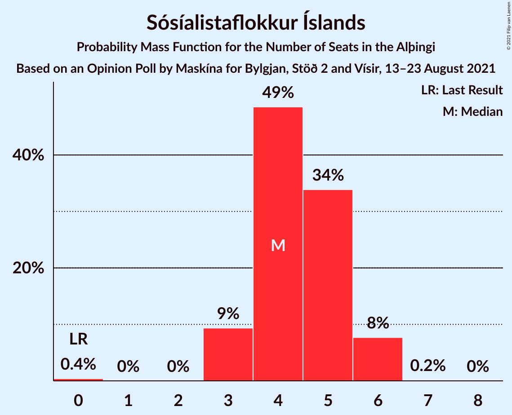
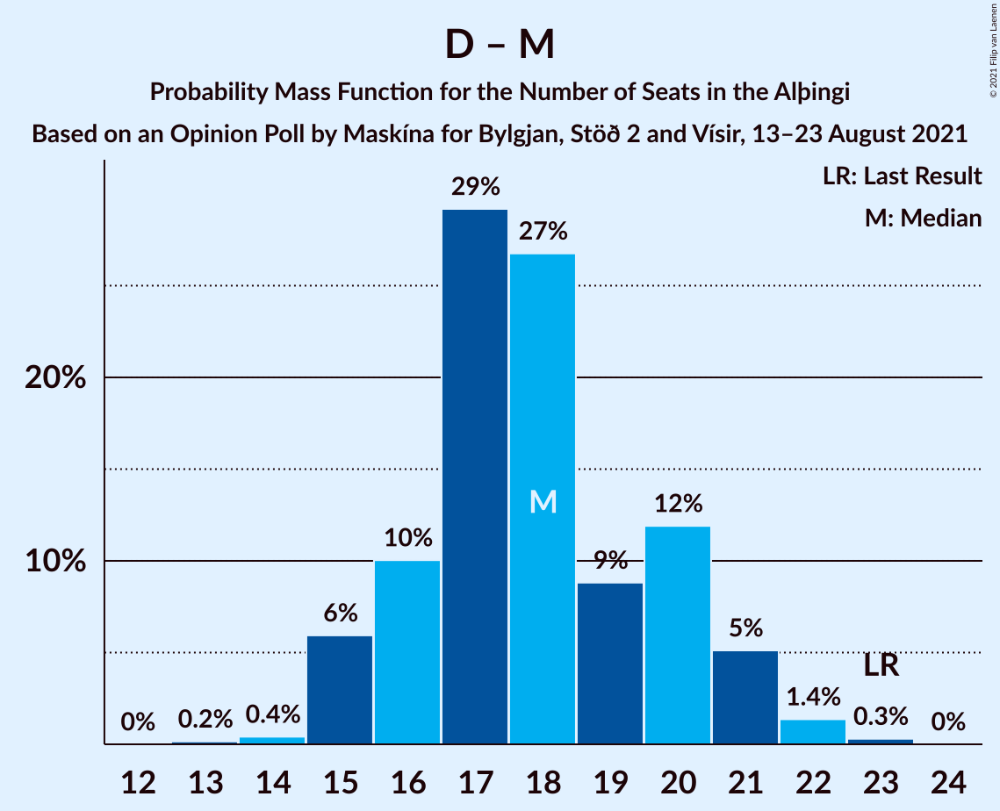

# Opinion Poll by Maskína for Bylgjan, Stöð 2 and Vísir, 13–23 August 2021

<a href="#voting-intentions">Voting Intentions</a> | <a href="#seats">Seats</a> | <a href="#coalitions">Coalitions</a> | <a href="#technical-information">Technical Information</a>

## Voting Intentions

### Confidence Intervals

| Party | Last Result | Poll Result | 80% Confidence Interval | 90% Confidence Interval | 95% Confidence Interval | 99% Confidence Interval |
|:-----:|:-----------:|:-----------:|:-----------------------:|:-----------------------:|:-----------------------:|:-----------------------:|
| Sjálfstæðisflokkurinn | 25.2% | 23.3% | 21.5–25.3% |21.0–25.8% |20.6–26.3% |19.7–27.3% |
| Vinstrihreyfingin – grænt framboð | 16.9% | 14.2% | 12.8–15.9% |12.3–16.4% |12.0–16.8% |11.3–17.6% |
| Samfylkingin | 12.1% | 13.0% | 11.6–14.6% |11.2–15.1% |10.9–15.5% |10.2–16.3% |
| Framsóknarflokkurinn | 10.7% | 12.6% | 11.3–14.2% |10.9–14.7% |10.5–15.1% |9.9–15.9% |
| Viðreisn | 6.7% | 10.7% | 9.4–12.2% |9.1–12.6% |8.8–13.0% |8.2–13.7% |
| Píratar | 9.2% | 9.8% | 8.6–11.3% |8.3–11.7% |8.0–12.1% |7.4–12.8% |
| Sósíalistaflokkur Íslands | 0.0% | 6.9% | 5.9–8.2% |5.6–8.6% |5.4–8.9% |4.9–9.5% |
| Miðflokkurinn | 10.9% | 5.1% | 4.2–6.2% |4.0–6.6% |3.8–6.8% |3.4–7.4% |
| Flokkur fólksins | 6.9% | 4.3% | 3.5–5.3% |3.3–5.6% |3.1–5.9% |2.7–6.4% |

*Note:* The poll result column reflects the actual value used in the calculations. Published results may vary slightly, and in addition be rounded to fewer digits.

## Seats

### Confidence Intervals

| Party | Last Result | Median | 80% Confidence Interval | 90% Confidence Interval | 95% Confidence Interval | 99% Confidence Interval |
|:-----:|:-----------:|:------:|:-----------------------:|:-----------------------:|:-----------------------:|:-----------------------:|
| <a href="#sjálfstæðisflokkurinn">Sjálfstæðisflokkurinn</a> | 16 | 16 | 14–18 |14–18 |14–19 |13–19 |
| <a href="#vinstrihreyfingin-–-grænt-framboð">Vinstrihreyfingin – grænt framboð</a> | 11 | 10 | 8–10 |8–10 |7–11 |7–12 |
| <a href="#samfylkingin">Samfylkingin</a> | 7 | 8 | 7–9 |7–10 |7–10 |6–11 |
| <a href="#framsóknarflokkurinn">Framsóknarflokkurinn</a> | 8 | 10 | 8–11 |8–11 |8–11 |7–12 |
| <a href="#viðreisn">Viðreisn</a> | 4 | 7 | 6–8 |6–8 |5–8 |5–9 |
| <a href="#píratar">Píratar</a> | 6 | 6 | 5–7 |5–7 |5–8 |4–8 |
| <a href="#sósíalistaflokkur-íslands">Sósíalistaflokkur Íslands</a> | 0 | 4 | 4–5 |3–6 |3–6 |3–6 |
| <a href="#miðflokkurinn">Miðflokkurinn</a> | 7 | 3 | 1–3 |1–4 |0–4 |0–4 |
| <a href="#flokkur-fólksins">Flokkur fólksins</a> | 4 | 0 | 0–3 |0–3 |0–3 |0–4 |

### Sjálfstæðisflokkurinn

*For a full overview of the results for this party, see the [Sjálfstæðisflokkurinn](party-sjálfstæðisflokkurinn.html) page.*

| Number of Seats | Probability | Accumulated | Special Marks |
|:---------------:|:-----------:|:-----------:|:-------------:|
| 13 | 2% | 100% |  |
| 14 | 14% | 98% |  |
| 15 | 31% | 84% |  |
| 16 | 30% | 54% | Last Result, Median |
| 17 | 13% | 24% |  |
| 18 | 7% | 10% |  |
| 19 | 3% | 3% |  |
| 20 | 0.1% | 0.1% |  |
| 21 | 0% | 0% |  |

### Vinstrihreyfingin – grænt framboð

*For a full overview of the results for this party, see the [Vinstrihreyfingin – grænt framboð](party-vinstrihreyfingin–græntframboð.html) page.*

| Number of Seats | Probability | Accumulated | Special Marks |
|:---------------:|:-----------:|:-----------:|:-------------:|
| 7 | 3% | 100% |  |
| 8 | 15% | 97% |  |
| 9 | 23% | 82% |  |
| 10 | 55% | 59% | Median |
| 11 | 2% | 4% | Last Result |
| 12 | 0.9% | 1.1% |  |
| 13 | 0.1% | 0.1% |  |
| 14 | 0% | 0% |  |

### Samfylkingin

*For a full overview of the results for this party, see the [Samfylkingin](party-samfylkingin.html) page.*

| Number of Seats | Probability | Accumulated | Special Marks |
|:---------------:|:-----------:|:-----------:|:-------------:|
| 6 | 0.5% | 100% |  |
| 7 | 13% | 99.5% | Last Result |
| 8 | 51% | 87% | Median |
| 9 | 28% | 36% |  |
| 10 | 8% | 8% |  |
| 11 | 0.7% | 0.8% |  |
| 12 | 0.1% | 0.1% |  |
| 13 | 0% | 0% |  |

### Framsóknarflokkurinn

*For a full overview of the results for this party, see the [Framsóknarflokkurinn](party-framsóknarflokkurinn.html) page.*

| Number of Seats | Probability | Accumulated | Special Marks |
|:---------------:|:-----------:|:-----------:|:-------------:|
| 5 | 0.1% | 100% |  |
| 6 | 0.3% | 99.9% |  |
| 7 | 1.2% | 99.6% |  |
| 8 | 17% | 98% | Last Result |
| 9 | 18% | 81% |  |
| 10 | 48% | 63% | Median |
| 11 | 14% | 15% |  |
| 12 | 0.6% | 0.6% |  |
| 13 | 0% | 0% |  |

### Viðreisn

*For a full overview of the results for this party, see the [Viðreisn](party-viðreisn.html) page.*

| Number of Seats | Probability | Accumulated | Special Marks |
|:---------------:|:-----------:|:-----------:|:-------------:|
| 4 | 0.1% | 100% | Last Result |
| 5 | 3% | 99.9% |  |
| 6 | 25% | 97% |  |
| 7 | 50% | 72% | Median |
| 8 | 21% | 22% |  |
| 9 | 2% | 2% |  |
| 10 | 0.2% | 0.2% |  |
| 11 | 0% | 0% |  |

### Píratar

*For a full overview of the results for this party, see the [Píratar](party-píratar.html) page.*

| Number of Seats | Probability | Accumulated | Special Marks |
|:---------------:|:-----------:|:-----------:|:-------------:|
| 3 | 0.1% | 100% |  |
| 4 | 2% | 99.9% |  |
| 5 | 26% | 98% |  |
| 6 | 35% | 71% | Last Result, Median |
| 7 | 31% | 36% |  |
| 8 | 4% | 5% |  |
| 9 | 0.2% | 0.2% |  |
| 10 | 0% | 0% |  |

### Sósíalistaflokkur Íslands

*For a full overview of the results for this party, see the [Sósíalistaflokkur Íslands](party-sósíalistaflokkuríslands.html) page.*

| Number of Seats | Probability | Accumulated | Special Marks |
|:---------------:|:-----------:|:-----------:|:-------------:|
| 0 | 0.4% | 100% | Last Result |
| 1 | 0% | 99.6% |  |
| 2 | 0% | 99.6% |  |
| 3 | 9% | 99.6% |  |
| 4 | 49% | 90% | Median |
| 5 | 34% | 42% |  |
| 6 | 8% | 8% |  |
| 7 | 0.2% | 0.2% |  |
| 8 | 0% | 0% |  |

### Miðflokkurinn

*For a full overview of the results for this party, see the [Miðflokkurinn](party-miðflokkurinn.html) page.*

| Number of Seats | Probability | Accumulated | Special Marks |
|:---------------:|:-----------:|:-----------:|:-------------:|
| 0 | 3% | 100% |  |
| 1 | 45% | 97% |  |
| 2 | 0.1% | 53% |  |
| 3 | 44% | 53% | Median |
| 4 | 9% | 9% |  |
| 5 | 0.3% | 0.3% |  |
| 6 | 0% | 0% |  |
| 7 | 0% | 0% | Last Result |

### Flokkur fólksins

*For a full overview of the results for this party, see the [Flokkur fólksins](party-flokkurfólksins.html) page.*

| Number of Seats | Probability | Accumulated | Special Marks |
|:---------------:|:-----------:|:-----------:|:-------------:|
| 0 | 87% | 100% | Median |
| 1 | 0% | 13% |  |
| 2 | 0.1% | 13% |  |
| 3 | 12% | 13% |  |
| 4 | 1.4% | 1.4% | Last Result |
| 5 | 0% | 0% |  |

## Coalitions

### Confidence Intervals

| Coalition | Last Result | Median | Majority? | 80% Confidence Interval | 90% Confidence Interval | 95% Confidence Interval | 99% Confidence Interval |
|:---------:|:-----------:|:------:|:---------:|:-----------------------:|:-----------------------:|:-----------------------:|:-----------------------:|
| Sjálfstæðisflokkurinn – Vinstrihreyfingin – grænt framboð – Framsóknarflokkurinn | 35 | 35 | 96% | 33–37 | 32–37 | 31–38 | 31–38 |
| Vinstrihreyfingin – grænt framboð – Samfylkingin – Viðreisn – Píratar | 28 | 31 | 30% | 29–32 | 28–33 | 28–34 | 26–35 |
| Vinstrihreyfingin – grænt framboð – Samfylkingin – Framsóknarflokkurinn – Miðflokkurinn | 33 | 30 | 9% | 27–31 | 27–32 | 26–32 | 26–33 |
| Sjálfstæðisflokkurinn – Framsóknarflokkurinn – Miðflokkurinn | 31 | 28 | 0.9% | 25–30 | 24–30 | 24–31 | 24–33 |
| Vinstrihreyfingin – grænt framboð – Samfylkingin – Framsóknarflokkurinn | 26 | 27 | 0.1% | 25–29 | 25–30 | 24–30 | 24–31 |
| Sjálfstæðisflokkurinn – Vinstrihreyfingin – grænt framboð | 27 | 25 | 0% | 24–27 | 23–27 | 22–29 | 22–29 |
| Sjálfstæðisflokkurinn – Framsóknarflokkurinn | 24 | 25 | 0% | 23–27 | 23–28 | 23–28 | 22–29 |
| Vinstrihreyfingin – grænt framboð – Samfylkingin – Píratar | 24 | 24 | 0% | 22–26 | 22–26 | 21–27 | 21–28 |
| Sjálfstæðisflokkurinn – Samfylkingin | 23 | 24 | 0% | 22–26 | 22–27 | 21–27 | 21–28 |
| Sjálfstæðisflokkurinn – Viðreisn | 20 | 23 | 0% | 21–25 | 21–25 | 20–25 | 19–26 |
| Vinstrihreyfingin – grænt framboð – Framsóknarflokkurinn – Miðflokkurinn | 26 | 21 | 0% | 19–23 | 18–24 | 18–24 | 17–25 |
| Vinstrihreyfingin – grænt framboð – Samfylkingin – Miðflokkurinn | 25 | 20 | 0% | 18–22 | 18–22 | 18–23 | 17–24 |
| Vinstrihreyfingin – grænt framboð – Framsóknarflokkurinn | 19 | 19 | 0% | 17–21 | 17–21 | 16–21 | 16–22 |
| Sjálfstæðisflokkurinn – Miðflokkurinn | 23 | 18 | 0% | 16–20 | 15–21 | 15–21 | 14–22 |
| Vinstrihreyfingin – grænt framboð – Samfylkingin | 18 | 18 | 0% | 16–19 | 16–20 | 15–20 | 15–21 |
| Vinstrihreyfingin – grænt framboð – Píratar | 17 | 16 | 0% | 14–17 | 14–17 | 13–18 | 13–19 |
| Vinstrihreyfingin – grænt framboð – Miðflokkurinn | 18 | 11 | 0% | 10–13 | 9–14 | 9–14 | 9–15 |

### Sjálfstæðisflokkurinn – Vinstrihreyfingin – grænt framboð – Framsóknarflokkurinn

| Number of Seats | Probability | Accumulated | Special Marks |
|:---------------:|:-----------:|:-----------:|:-------------:|
| 30 | 0.2% | 100% |  |
| 31 | 3% | 99.7% |  |
| 32 | 3% | 96% | Majority |
| 33 | 11% | 94% |  |
| 34 | 27% | 83% |  |
| 35 | 27% | 56% | Last Result |
| 36 | 15% | 29% | Median |
| 37 | 11% | 13% |  |
| 38 | 2% | 3% |  |
| 39 | 0.4% | 0.5% |  |
| 40 | 0% | 0% |  |

### Vinstrihreyfingin – grænt framboð – Samfylkingin – Viðreisn – Píratar

| Number of Seats | Probability | Accumulated | Special Marks |
|:---------------:|:-----------:|:-----------:|:-------------:|
| 25 | 0.1% | 100% |  |
| 26 | 0.5% | 99.9% |  |
| 27 | 2% | 99.4% |  |
| 28 | 4% | 98% | Last Result |
| 29 | 11% | 94% |  |
| 30 | 23% | 83% |  |
| 31 | 30% | 60% | Median |
| 32 | 21% | 30% | Majority |
| 33 | 6% | 9% |  |
| 34 | 3% | 3% |  |
| 35 | 0.4% | 0.6% |  |
| 36 | 0.1% | 0.1% |  |
| 37 | 0% | 0% |  |

### Vinstrihreyfingin – grænt framboð – Samfylkingin – Framsóknarflokkurinn – Miðflokkurinn

| Number of Seats | Probability | Accumulated | Special Marks |
|:---------------:|:-----------:|:-----------:|:-------------:|
| 24 | 0.1% | 100% |  |
| 25 | 0.3% | 99.9% |  |
| 26 | 3% | 99.6% |  |
| 27 | 16% | 97% |  |
| 28 | 10% | 81% |  |
| 29 | 13% | 71% |  |
| 30 | 32% | 58% |  |
| 31 | 17% | 26% | Median |
| 32 | 7% | 9% | Majority |
| 33 | 2% | 2% | Last Result |
| 34 | 0.1% | 0.1% |  |
| 35 | 0% | 0% |  |

### Sjálfstæðisflokkurinn – Framsóknarflokkurinn – Miðflokkurinn

| Number of Seats | Probability | Accumulated | Special Marks |
|:---------------:|:-----------:|:-----------:|:-------------:|
| 22 | 0.1% | 100% |  |
| 23 | 0.4% | 99.9% |  |
| 24 | 5% | 99.6% |  |
| 25 | 8% | 94% |  |
| 26 | 15% | 87% |  |
| 27 | 17% | 72% |  |
| 28 | 34% | 55% |  |
| 29 | 11% | 21% | Median |
| 30 | 7% | 10% |  |
| 31 | 2% | 3% | Last Result |
| 32 | 0.2% | 0.9% | Majority |
| 33 | 0.6% | 0.6% |  |
| 34 | 0.1% | 0.1% |  |
| 35 | 0% | 0% |  |

### Vinstrihreyfingin – grænt framboð – Samfylkingin – Framsóknarflokkurinn

| Number of Seats | Probability | Accumulated | Special Marks |
|:---------------:|:-----------:|:-----------:|:-------------:|
| 23 | 0.5% | 100% |  |
| 24 | 4% | 99.5% |  |
| 25 | 8% | 96% |  |
| 26 | 23% | 88% | Last Result |
| 27 | 18% | 65% |  |
| 28 | 18% | 47% | Median |
| 29 | 24% | 30% |  |
| 30 | 5% | 6% |  |
| 31 | 0.7% | 0.7% |  |
| 32 | 0.1% | 0.1% | Majority |
| 33 | 0% | 0% |  |

### Sjálfstæðisflokkurinn – Vinstrihreyfingin – grænt framboð

| Number of Seats | Probability | Accumulated | Special Marks |
|:---------------:|:-----------:|:-----------:|:-------------:|
| 21 | 0.2% | 100% |  |
| 22 | 4% | 99.8% |  |
| 23 | 4% | 96% |  |
| 24 | 18% | 92% |  |
| 25 | 38% | 74% |  |
| 26 | 23% | 35% | Median |
| 27 | 8% | 12% | Last Result |
| 28 | 2% | 4% |  |
| 29 | 3% | 3% |  |
| 30 | 0.3% | 0.3% |  |
| 31 | 0% | 0% |  |

### Sjálfstæðisflokkurinn – Framsóknarflokkurinn

| Number of Seats | Probability | Accumulated | Special Marks |
|:---------------:|:-----------:|:-----------:|:-------------:|
| 21 | 0.3% | 100% |  |
| 22 | 0.8% | 99.7% |  |
| 23 | 11% | 98.9% |  |
| 24 | 14% | 88% | Last Result |
| 25 | 33% | 74% |  |
| 26 | 20% | 41% | Median |
| 27 | 16% | 22% |  |
| 28 | 4% | 5% |  |
| 29 | 1.0% | 1.2% |  |
| 30 | 0.2% | 0.2% |  |
| 31 | 0% | 0% |  |

### Vinstrihreyfingin – grænt framboð – Samfylkingin – Píratar

| Number of Seats | Probability | Accumulated | Special Marks |
|:---------------:|:-----------:|:-----------:|:-------------:|
| 19 | 0.1% | 100% |  |
| 20 | 0.3% | 99.9% |  |
| 21 | 3% | 99.6% |  |
| 22 | 11% | 96% |  |
| 23 | 17% | 85% |  |
| 24 | 47% | 68% | Last Result, Median |
| 25 | 11% | 21% |  |
| 26 | 7% | 11% |  |
| 27 | 2% | 3% |  |
| 28 | 0.5% | 0.6% |  |
| 29 | 0.1% | 0.2% |  |
| 30 | 0% | 0% |  |

### Sjálfstæðisflokkurinn – Samfylkingin

| Number of Seats | Probability | Accumulated | Special Marks |
|:---------------:|:-----------:|:-----------:|:-------------:|
| 20 | 0.5% | 100% |  |
| 21 | 3% | 99.5% |  |
| 22 | 10% | 97% |  |
| 23 | 27% | 87% | Last Result |
| 24 | 22% | 60% | Median |
| 25 | 21% | 38% |  |
| 26 | 11% | 17% |  |
| 27 | 5% | 6% |  |
| 28 | 0.7% | 0.9% |  |
| 29 | 0.2% | 0.2% |  |
| 30 | 0% | 0% |  |

### Sjálfstæðisflokkurinn – Viðreisn

| Number of Seats | Probability | Accumulated | Special Marks |
|:---------------:|:-----------:|:-----------:|:-------------:|
| 19 | 1.0% | 100% |  |
| 20 | 4% | 99.0% | Last Result |
| 21 | 19% | 95% |  |
| 22 | 20% | 76% |  |
| 23 | 27% | 56% | Median |
| 24 | 18% | 29% |  |
| 25 | 10% | 11% |  |
| 26 | 0.8% | 1.0% |  |
| 27 | 0.1% | 0.1% |  |
| 28 | 0% | 0% |  |

### Vinstrihreyfingin – grænt framboð – Framsóknarflokkurinn – Miðflokkurinn

| Number of Seats | Probability | Accumulated | Special Marks |
|:---------------:|:-----------:|:-----------:|:-------------:|
| 16 | 0.1% | 100% |  |
| 17 | 0.4% | 99.9% |  |
| 18 | 8% | 99.5% |  |
| 19 | 14% | 92% |  |
| 20 | 10% | 77% |  |
| 21 | 23% | 67% |  |
| 22 | 21% | 44% |  |
| 23 | 14% | 23% | Median |
| 24 | 7% | 8% |  |
| 25 | 0.9% | 1.0% |  |
| 26 | 0.1% | 0.1% | Last Result |
| 27 | 0% | 0% |  |

### Vinstrihreyfingin – grænt framboð – Samfylkingin – Miðflokkurinn

| Number of Seats | Probability | Accumulated | Special Marks |
|:---------------:|:-----------:|:-----------:|:-------------:|
| 16 | 0.2% | 100% |  |
| 17 | 2% | 99.8% |  |
| 18 | 16% | 98% |  |
| 19 | 23% | 82% |  |
| 20 | 26% | 59% |  |
| 21 | 23% | 33% | Median |
| 22 | 6% | 10% |  |
| 23 | 3% | 4% |  |
| 24 | 0.6% | 0.7% |  |
| 25 | 0.1% | 0.1% | Last Result |
| 26 | 0% | 0% |  |

### Vinstrihreyfingin – grænt framboð – Framsóknarflokkurinn

| Number of Seats | Probability | Accumulated | Special Marks |
|:---------------:|:-----------:|:-----------:|:-------------:|
| 15 | 0.3% | 100% |  |
| 16 | 4% | 99.6% |  |
| 17 | 13% | 96% |  |
| 18 | 21% | 83% |  |
| 19 | 17% | 62% | Last Result |
| 20 | 30% | 45% | Median |
| 21 | 13% | 14% |  |
| 22 | 0.8% | 0.9% |  |
| 23 | 0.1% | 0.1% |  |
| 24 | 0% | 0% |  |

### Sjálfstæðisflokkurinn – Miðflokkurinn

| Number of Seats | Probability | Accumulated | Special Marks |
|:---------------:|:-----------:|:-----------:|:-------------:|
| 13 | 0.2% | 100% |  |
| 14 | 0.4% | 99.8% |  |
| 15 | 6% | 99.4% |  |
| 16 | 10% | 93% |  |
| 17 | 29% | 83% |  |
| 18 | 27% | 54% |  |
| 19 | 9% | 28% | Median |
| 20 | 12% | 19% |  |
| 21 | 5% | 7% |  |
| 22 | 1.4% | 2% |  |
| 23 | 0.3% | 0.3% | Last Result |
| 24 | 0% | 0% |  |

### Vinstrihreyfingin – grænt framboð – Samfylkingin

| Number of Seats | Probability | Accumulated | Special Marks |
|:---------------:|:-----------:|:-----------:|:-------------:|
| 14 | 0.2% | 100% |  |
| 15 | 4% | 99.8% |  |
| 16 | 12% | 96% |  |
| 17 | 24% | 84% |  |
| 18 | 34% | 60% | Last Result, Median |
| 19 | 18% | 26% |  |
| 20 | 7% | 8% |  |
| 21 | 0.6% | 0.9% |  |
| 22 | 0.2% | 0.3% |  |
| 23 | 0.1% | 0.1% |  |
| 24 | 0% | 0% |  |

### Vinstrihreyfingin – grænt framboð – Píratar

| Number of Seats | Probability | Accumulated | Special Marks |
|:---------------:|:-----------:|:-----------:|:-------------:|
| 12 | 0.2% | 100% |  |
| 13 | 3% | 99.7% |  |
| 14 | 9% | 96% |  |
| 15 | 36% | 87% |  |
| 16 | 38% | 51% | Median |
| 17 | 10% | 14% | Last Result |
| 18 | 3% | 4% |  |
| 19 | 0.5% | 0.6% |  |
| 20 | 0.1% | 0.1% |  |
| 21 | 0% | 0% |  |

### Vinstrihreyfingin – grænt framboð – Miðflokkurinn

| Number of Seats | Probability | Accumulated | Special Marks |
|:---------------:|:-----------:|:-----------:|:-------------:|
| 8 | 0.5% | 100% |  |
| 9 | 7% | 99.5% |  |
| 10 | 14% | 92% |  |
| 11 | 33% | 78% |  |
| 12 | 14% | 46% |  |
| 13 | 25% | 31% | Median |
| 14 | 6% | 6% |  |
| 15 | 0.8% | 0.9% |  |
| 16 | 0.1% | 0.1% |  |
| 17 | 0% | 0% |  |
| 18 | 0% | 0% | Last Result |

## Technical Information

### Opinion Poll

+ **Polling firm:** Maskína
+ **Commissioner(s):** Bylgjan, Stöð 2 and Vísir
+ **Fieldwork period:** 13–23 August 2021

### Calculations

+ **Sample size:** 823
+ **Simulations done:** 1,048,576
+ **Error estimate:** 1.49%

