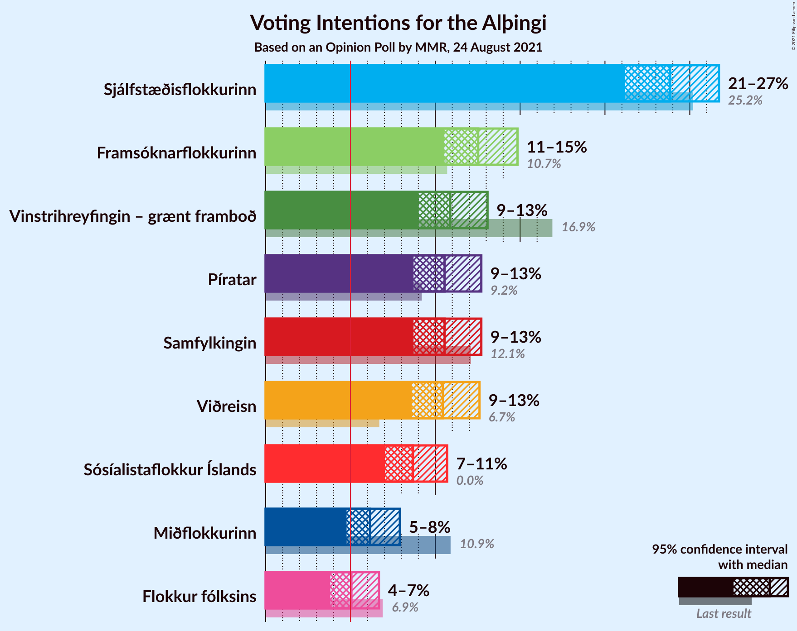
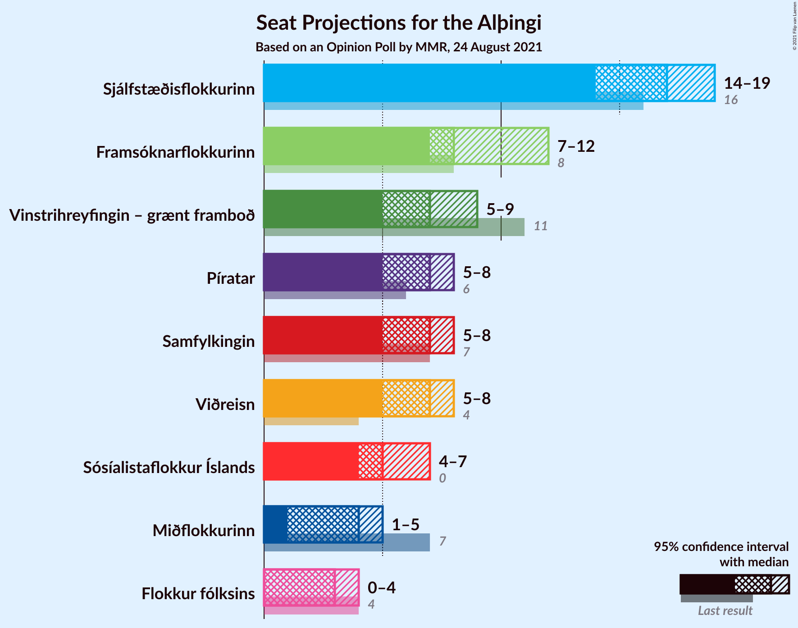
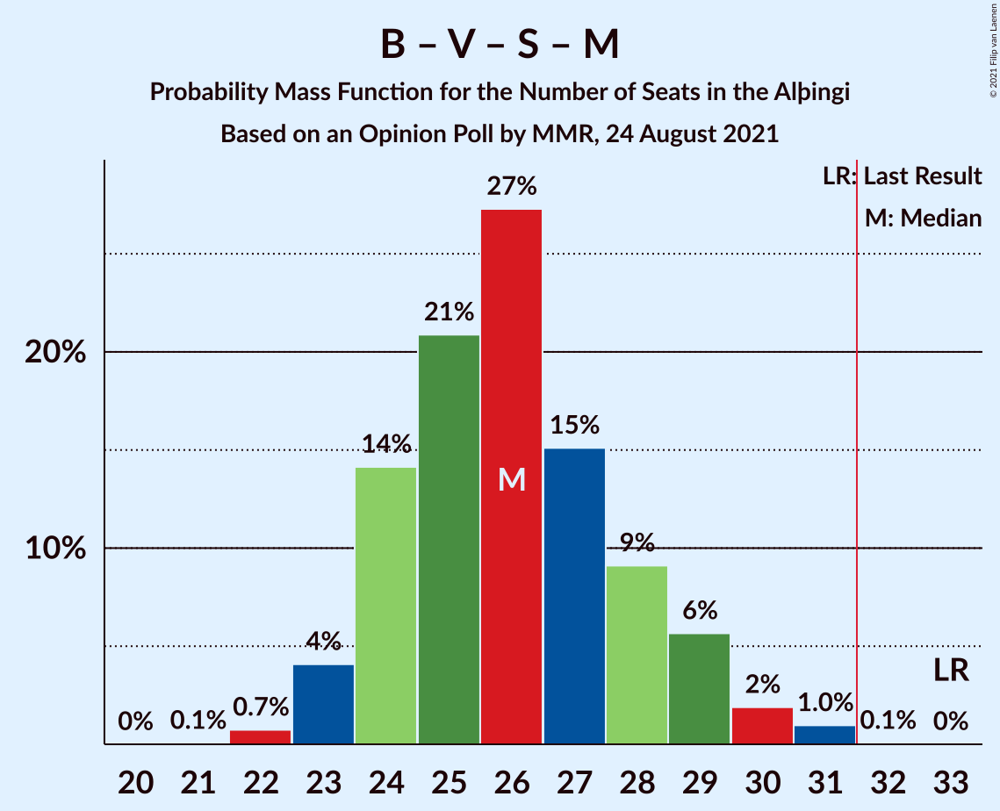

# Opinion Poll by MMR, 24 August 2021

<a href="#voting-intentions">Voting Intentions</a> | <a href="#seats">Seats</a> | <a href="#coalitions">Coalitions</a> | <a href="#technical-information">Technical Information</a>

## Voting Intentions

### Confidence Intervals

| Party | Last Result | Poll Result | 80% Confidence Interval | 90% Confidence Interval | 95% Confidence Interval | 99% Confidence Interval |
|:-----:|:-----------:|:-----------:|:-----------------------:|:-----------------------:|:-----------------------:|:-----------------------:|
| Sjálfstæðisflokkurinn | 25.2% | 23.8% | 22.1–25.7% |21.6–26.3% |21.2–26.7% |20.4–27.6% |
| Framsóknarflokkurinn | 10.7% | 12.5% | 11.2–14.0% |10.9–14.5% |10.5–14.8% |9.9–15.6% |
| Vinstrihreyfingin – grænt framboð | 16.9% | 10.9% | 9.6–12.3% |9.3–12.7% |9.0–13.1% |8.5–13.8% |
| Samfylkingin | 12.1% | 10.5% | 9.3–12.0% |9.0–12.4% |8.7–12.7% |8.2–13.4% |
| Píratar | 9.2% | 10.5% | 9.3–12.0% |9.0–12.4% |8.7–12.7% |8.2–13.4% |
| Viðreisn | 6.7% | 10.4% | 9.2–11.8% |8.9–12.3% |8.6–12.6% |8.1–13.3% |
| Sósíalistaflokkur Íslands | 0.0% | 8.7% | 7.6–10.0% |7.3–10.4% |7.0–10.7% |6.5–11.4% |
| Miðflokkurinn | 10.9% | 6.2% | 5.2–7.3% |5.0–7.6% |4.8–7.9% |4.4–8.5% |
| Flokkur fólksins | 6.9% | 5.1% | 4.2–6.1% |4.0–6.4% |3.8–6.7% |3.4–7.2% |

*Note:* The poll result column reflects the actual value used in the calculations. Published results may vary slightly, and in addition be rounded to fewer digits.

## Seats

### Confidence Intervals

| Party | Last Result | Median | 80% Confidence Interval | 90% Confidence Interval | 95% Confidence Interval | 99% Confidence Interval |
|:-----:|:-----------:|:------:|:-----------------------:|:-----------------------:|:-----------------------:|:-----------------------:|
| <a href="#sjálfstæðisflokkurinn">Sjálfstæðisflokkurinn</a> | 16 | 17 | 15–19 |14–19 |14–19 |13–19 |
| <a href="#framsóknarflokkurinn">Framsóknarflokkurinn</a> | 8 | 8 | 8–10 |8–12 |7–12 |7–12 |
| <a href="#vinstrihreyfingin-–-grænt-framboð">Vinstrihreyfingin – grænt framboð</a> | 11 | 7 | 6–8 |6–9 |5–9 |5–9 |
| <a href="#samfylkingin">Samfylkingin</a> | 7 | 7 | 6–8 |5–8 |5–8 |5–9 |
| <a href="#píratar">Píratar</a> | 6 | 7 | 6–8 |5–8 |5–8 |5–9 |
| <a href="#viðreisn">Viðreisn</a> | 4 | 7 | 6–8 |5–8 |5–8 |5–9 |
| <a href="#sósíalistaflokkur-íslands">Sósíalistaflokkur Íslands</a> | 0 | 5 | 4–6 |4–7 |4–7 |4–7 |
| <a href="#miðflokkurinn">Miðflokkurinn</a> | 7 | 4 | 3–4 |1–5 |1–5 |1–6 |
| <a href="#flokkur-fólksins">Flokkur fólksins</a> | 4 | 3 | 0–4 |0–4 |0–4 |0–4 |

### Sjálfstæðisflokkurinn

*For a full overview of the results for this party, see the [Sjálfstæðisflokkurinn](party-sjálfstæðisflokkurinn.html) page.*

| Number of Seats | Probability | Accumulated | Special Marks |
|:---------------:|:-----------:|:-----------:|:-------------:|
| 13 | 1.1% | 100% |  |
| 14 | 9% | 98.9% |  |
| 15 | 19% | 90% |  |
| 16 | 17% | 72% | Last Result |
| 17 | 19% | 54% | Median |
| 18 | 23% | 35% |  |
| 19 | 12% | 13% |  |
| 20 | 0.2% | 0.2% |  |
| 21 | 0% | 0% |  |

### Framsóknarflokkurinn

*For a full overview of the results for this party, see the [Framsóknarflokkurinn](party-framsóknarflokkurinn.html) page.*

| Number of Seats | Probability | Accumulated | Special Marks |
|:---------------:|:-----------:|:-----------:|:-------------:|
| 6 | 0.2% | 100% |  |
| 7 | 3% | 99.8% |  |
| 8 | 55% | 97% | Last Result, Median |
| 9 | 13% | 42% |  |
| 10 | 19% | 29% |  |
| 11 | 4% | 10% |  |
| 12 | 5% | 5% |  |
| 13 | 0% | 0% |  |

### Vinstrihreyfingin – grænt framboð

*For a full overview of the results for this party, see the [Vinstrihreyfingin – grænt framboð](party-vinstrihreyfingin–græntframboð.html) page.*

| Number of Seats | Probability | Accumulated | Special Marks |
|:---------------:|:-----------:|:-----------:|:-------------:|
| 5 | 3% | 100% |  |
| 6 | 31% | 97% |  |
| 7 | 32% | 65% | Median |
| 8 | 26% | 33% |  |
| 9 | 6% | 7% |  |
| 10 | 0.4% | 0.4% |  |
| 11 | 0% | 0% | Last Result |

### Samfylkingin

*For a full overview of the results for this party, see the [Samfylkingin](party-samfylkingin.html) page.*

| Number of Seats | Probability | Accumulated | Special Marks |
|:---------------:|:-----------:|:-----------:|:-------------:|
| 4 | 0.1% | 100% |  |
| 5 | 8% | 99.9% |  |
| 6 | 38% | 92% |  |
| 7 | 43% | 54% | Last Result, Median |
| 8 | 10% | 11% |  |
| 9 | 1.0% | 1.0% |  |
| 10 | 0% | 0% |  |

### Píratar

*For a full overview of the results for this party, see the [Píratar](party-píratar.html) page.*

| Number of Seats | Probability | Accumulated | Special Marks |
|:---------------:|:-----------:|:-----------:|:-------------:|
| 4 | 0.3% | 100% |  |
| 5 | 9% | 99.7% |  |
| 6 | 36% | 91% | Last Result |
| 7 | 40% | 55% | Median |
| 8 | 14% | 15% |  |
| 9 | 1.0% | 1.0% |  |
| 10 | 0% | 0% |  |

### Viðreisn

*For a full overview of the results for this party, see the [Viðreisn](party-viðreisn.html) page.*

| Number of Seats | Probability | Accumulated | Special Marks |
|:---------------:|:-----------:|:-----------:|:-------------:|
| 4 | 0.2% | 100% | Last Result |
| 5 | 9% | 99.8% |  |
| 6 | 37% | 90% |  |
| 7 | 39% | 54% | Median |
| 8 | 13% | 14% |  |
| 9 | 1.2% | 1.2% |  |
| 10 | 0% | 0% |  |

### Sósíalistaflokkur Íslands

*For a full overview of the results for this party, see the [Sósíalistaflokkur Íslands](party-sósíalistaflokkuríslands.html) page.*

| Number of Seats | Probability | Accumulated | Special Marks |
|:---------------:|:-----------:|:-----------:|:-------------:|
| 0 | 0% | 100% | Last Result |
| 1 | 0% | 100% |  |
| 2 | 0% | 100% |  |
| 3 | 0.1% | 100% |  |
| 4 | 17% | 99.9% |  |
| 5 | 47% | 83% | Median |
| 6 | 29% | 36% |  |
| 7 | 7% | 7% |  |
| 8 | 0.4% | 0.4% |  |
| 9 | 0% | 0% |  |

### Miðflokkurinn

*For a full overview of the results for this party, see the [Miðflokkurinn](party-miðflokkurinn.html) page.*

| Number of Seats | Probability | Accumulated | Special Marks |
|:---------------:|:-----------:|:-----------:|:-------------:|
| 1 | 6% | 100% |  |
| 2 | 0% | 94% |  |
| 3 | 34% | 94% |  |
| 4 | 54% | 60% | Median |
| 5 | 5% | 6% |  |
| 6 | 0.5% | 0.5% |  |
| 7 | 0% | 0% | Last Result |

### Flokkur fólksins

*For a full overview of the results for this party, see the [Flokkur fólksins](party-flokkurfólksins.html) page.*

| Number of Seats | Probability | Accumulated | Special Marks |
|:---------------:|:-----------:|:-----------:|:-------------:|
| 0 | 41% | 100% |  |
| 1 | 0% | 59% |  |
| 2 | 0% | 59% |  |
| 3 | 45% | 59% | Median |
| 4 | 13% | 13% | Last Result |
| 5 | 0.2% | 0.2% |  |
| 6 | 0% | 0% |  |

## Coalitions

### Confidence Intervals

| Coalition | Last Result | Median | Majority? | 80% Confidence Interval | 90% Confidence Interval | 95% Confidence Interval | 99% Confidence Interval |
|:---------:|:-----------:|:------:|:---------:|:-----------------------:|:-----------------------:|:-----------------------:|:-----------------------:|
| Sjálfstæðisflokkurinn – Framsóknarflokkurinn – Vinstrihreyfingin – grænt framboð | 35 | 32 | 70% | 30–35 | 30–35 | 30–36 | 28–36 |
| Sjálfstæðisflokkurinn – Framsóknarflokkurinn – Miðflokkurinn | 31 | 29 | 8% | 27–31 | 26–32 | 26–33 | 25–34 |
| Framsóknarflokkurinn – Vinstrihreyfingin – grænt framboð – Samfylkingin – Miðflokkurinn | 33 | 26 | 0.1% | 24–28 | 24–29 | 23–30 | 22–31 |
| Vinstrihreyfingin – grænt framboð – Píratar – Samfylkingin – Viðreisn | 28 | 27 | 0.2% | 24–29 | 24–30 | 23–30 | 22–31 |
| Sjálfstæðisflokkurinn – Framsóknarflokkurinn | 24 | 25 | 0% | 23–28 | 23–28 | 22–29 | 22–30 |
| Sjálfstæðisflokkurinn – Samfylkingin | 23 | 23 | 0% | 21–25 | 20–26 | 20–26 | 19–27 |
| Sjálfstæðisflokkurinn – Vinstrihreyfingin – grænt framboð | 27 | 24 | 0% | 21–25 | 21–26 | 20–26 | 20–27 |
| Sjálfstæðisflokkurinn – Viðreisn | 20 | 24 | 0% | 21–25 | 20–25 | 20–26 | 19–26 |
| Framsóknarflokkurinn – Vinstrihreyfingin – grænt framboð – Samfylkingin | 26 | 22 | 0% | 20–25 | 20–26 | 19–26 | 19–27 |
| Framsóknarflokkurinn – Vinstrihreyfingin – grænt framboð – Miðflokkurinn | 26 | 19 | 0% | 18–21 | 17–22 | 17–23 | 16–24 |
| Sjálfstæðisflokkurinn – Miðflokkurinn | 23 | 20 | 0% | 18–22 | 17–23 | 17–23 | 16–24 |
| Vinstrihreyfingin – grænt framboð – Píratar – Samfylkingin | 24 | 20 | 0% | 18–22 | 18–23 | 17–23 | 16–24 |
| Vinstrihreyfingin – grænt framboð – Samfylkingin – Miðflokkurinn | 25 | 17 | 0% | 15–19 | 15–19 | 14–20 | 13–21 |
| Framsóknarflokkurinn – Vinstrihreyfingin – grænt framboð | 19 | 16 | 0% | 14–18 | 14–19 | 14–19 | 13–20 |
| Vinstrihreyfingin – grænt framboð – Píratar | 17 | 14 | 0% | 12–15 | 12–16 | 11–16 | 10–17 |
| Vinstrihreyfingin – grænt framboð – Samfylkingin | 18 | 14 | 0% | 12–15 | 12–16 | 11–16 | 10–17 |
| Vinstrihreyfingin – grænt framboð – Miðflokkurinn | 18 | 11 | 0% | 9–12 | 8–12 | 8–13 | 7–13 |

### Sjálfstæðisflokkurinn – Framsóknarflokkurinn – Vinstrihreyfingin – grænt framboð

| Number of Seats | Probability | Accumulated | Special Marks |
|:---------------:|:-----------:|:-----------:|:-------------:|
| 28 | 0.5% | 100% |  |
| 29 | 2% | 99.4% |  |
| 30 | 8% | 98% |  |
| 31 | 20% | 90% |  |
| 32 | 20% | 70% | Median, Majority |
| 33 | 26% | 50% |  |
| 34 | 11% | 24% |  |
| 35 | 8% | 13% | Last Result |
| 36 | 4% | 4% |  |
| 37 | 0.4% | 0.5% |  |
| 38 | 0% | 0% |  |

### Sjálfstæðisflokkurinn – Framsóknarflokkurinn – Miðflokkurinn

| Number of Seats | Probability | Accumulated | Special Marks |
|:---------------:|:-----------:|:-----------:|:-------------:|
| 24 | 0.1% | 100% |  |
| 25 | 1.0% | 99.9% |  |
| 26 | 6% | 98.8% |  |
| 27 | 16% | 93% |  |
| 28 | 17% | 77% |  |
| 29 | 22% | 60% | Median |
| 30 | 15% | 38% |  |
| 31 | 15% | 23% | Last Result |
| 32 | 4% | 8% | Majority |
| 33 | 3% | 3% |  |
| 34 | 0.6% | 0.6% |  |
| 35 | 0% | 0% |  |

### Framsóknarflokkurinn – Vinstrihreyfingin – grænt framboð – Samfylkingin – Miðflokkurinn

| Number of Seats | Probability | Accumulated | Special Marks |
|:---------------:|:-----------:|:-----------:|:-------------:|
| 21 | 0.1% | 100% |  |
| 22 | 0.7% | 99.9% |  |
| 23 | 4% | 99.2% |  |
| 24 | 14% | 95% |  |
| 25 | 21% | 81% |  |
| 26 | 27% | 60% | Median |
| 27 | 15% | 33% |  |
| 28 | 9% | 18% |  |
| 29 | 6% | 9% |  |
| 30 | 2% | 3% |  |
| 31 | 1.0% | 1.0% |  |
| 32 | 0.1% | 0.1% | Majority |
| 33 | 0% | 0% | Last Result |

### Vinstrihreyfingin – grænt framboð – Píratar – Samfylkingin – Viðreisn

| Number of Seats | Probability | Accumulated | Special Marks |
|:---------------:|:-----------:|:-----------:|:-------------:|
| 21 | 0.3% | 100% |  |
| 22 | 0.4% | 99.7% |  |
| 23 | 2% | 99.3% |  |
| 24 | 8% | 97% |  |
| 25 | 13% | 89% |  |
| 26 | 20% | 76% |  |
| 27 | 18% | 56% |  |
| 28 | 16% | 38% | Last Result, Median |
| 29 | 16% | 21% |  |
| 30 | 4% | 6% |  |
| 31 | 1.1% | 1.3% |  |
| 32 | 0.2% | 0.2% | Majority |
| 33 | 0% | 0% |  |

### Sjálfstæðisflokkurinn – Framsóknarflokkurinn

| Number of Seats | Probability | Accumulated | Special Marks |
|:---------------:|:-----------:|:-----------:|:-------------:|
| 21 | 0.4% | 100% |  |
| 22 | 2% | 99.6% |  |
| 23 | 11% | 97% |  |
| 24 | 19% | 87% | Last Result |
| 25 | 20% | 67% | Median |
| 26 | 19% | 47% |  |
| 27 | 15% | 28% |  |
| 28 | 8% | 13% |  |
| 29 | 4% | 5% |  |
| 30 | 0.4% | 0.8% |  |
| 31 | 0.4% | 0.4% |  |
| 32 | 0% | 0% | Majority |

### Sjálfstæðisflokkurinn – Samfylkingin

| Number of Seats | Probability | Accumulated | Special Marks |
|:---------------:|:-----------:|:-----------:|:-------------:|
| 18 | 0.2% | 100% |  |
| 19 | 0.6% | 99.8% |  |
| 20 | 5% | 99.2% |  |
| 21 | 11% | 94% |  |
| 22 | 15% | 84% |  |
| 23 | 20% | 68% | Last Result |
| 24 | 27% | 48% | Median |
| 25 | 14% | 21% |  |
| 26 | 6% | 7% |  |
| 27 | 0.6% | 0.7% |  |
| 28 | 0.1% | 0.1% |  |
| 29 | 0% | 0% |  |

### Sjálfstæðisflokkurinn – Vinstrihreyfingin – grænt framboð

| Number of Seats | Probability | Accumulated | Special Marks |
|:---------------:|:-----------:|:-----------:|:-------------:|
| 19 | 0.4% | 100% |  |
| 20 | 3% | 99.6% |  |
| 21 | 8% | 97% |  |
| 22 | 10% | 89% |  |
| 23 | 23% | 79% |  |
| 24 | 24% | 57% | Median |
| 25 | 24% | 33% |  |
| 26 | 7% | 9% |  |
| 27 | 2% | 2% | Last Result |
| 28 | 0.2% | 0.2% |  |
| 29 | 0% | 0% |  |

### Sjálfstæðisflokkurinn – Viðreisn

| Number of Seats | Probability | Accumulated | Special Marks |
|:---------------:|:-----------:|:-----------:|:-------------:|
| 18 | 0.1% | 100% |  |
| 19 | 0.9% | 99.9% |  |
| 20 | 6% | 99.0% | Last Result |
| 21 | 10% | 93% |  |
| 22 | 16% | 83% |  |
| 23 | 16% | 67% |  |
| 24 | 24% | 51% | Median |
| 25 | 23% | 27% |  |
| 26 | 3% | 3% |  |
| 27 | 0.2% | 0.2% |  |
| 28 | 0% | 0% |  |

### Framsóknarflokkurinn – Vinstrihreyfingin – grænt framboð – Samfylkingin

| Number of Seats | Probability | Accumulated | Special Marks |
|:---------------:|:-----------:|:-----------:|:-------------:|
| 18 | 0.1% | 100% |  |
| 19 | 3% | 99.9% |  |
| 20 | 10% | 97% |  |
| 21 | 18% | 87% |  |
| 22 | 22% | 69% | Median |
| 23 | 21% | 47% |  |
| 24 | 15% | 26% |  |
| 25 | 5% | 11% |  |
| 26 | 5% | 6% | Last Result |
| 27 | 0.8% | 0.9% |  |
| 28 | 0.1% | 0.1% |  |
| 29 | 0% | 0% |  |

### Framsóknarflokkurinn – Vinstrihreyfingin – grænt framboð – Miðflokkurinn

| Number of Seats | Probability | Accumulated | Special Marks |
|:---------------:|:-----------:|:-----------:|:-------------:|
| 15 | 0.1% | 100% |  |
| 16 | 1.1% | 99.8% |  |
| 17 | 5% | 98.7% |  |
| 18 | 23% | 94% |  |
| 19 | 27% | 70% | Median |
| 20 | 21% | 43% |  |
| 21 | 15% | 23% |  |
| 22 | 5% | 8% |  |
| 23 | 2% | 3% |  |
| 24 | 0.8% | 0.9% |  |
| 25 | 0% | 0.1% |  |
| 26 | 0% | 0% | Last Result |

### Sjálfstæðisflokkurinn – Miðflokkurinn

| Number of Seats | Probability | Accumulated | Special Marks |
|:---------------:|:-----------:|:-----------:|:-------------:|
| 15 | 0.2% | 100% |  |
| 16 | 1.0% | 99.8% |  |
| 17 | 5% | 98.8% |  |
| 18 | 14% | 94% |  |
| 19 | 18% | 80% |  |
| 20 | 15% | 62% |  |
| 21 | 20% | 47% | Median |
| 22 | 17% | 27% |  |
| 23 | 9% | 9% | Last Result |
| 24 | 0.7% | 0.7% |  |
| 25 | 0% | 0% |  |

### Vinstrihreyfingin – grænt framboð – Píratar – Samfylkingin

| Number of Seats | Probability | Accumulated | Special Marks |
|:---------------:|:-----------:|:-----------:|:-------------:|
| 15 | 0.3% | 100% |  |
| 16 | 0.6% | 99.7% |  |
| 17 | 2% | 99.1% |  |
| 18 | 7% | 97% |  |
| 19 | 24% | 90% |  |
| 20 | 25% | 66% |  |
| 21 | 20% | 41% | Median |
| 22 | 13% | 21% |  |
| 23 | 7% | 8% |  |
| 24 | 1.0% | 1.1% | Last Result |
| 25 | 0.1% | 0.1% |  |
| 26 | 0% | 0% |  |

### Vinstrihreyfingin – grænt framboð – Samfylkingin – Miðflokkurinn

| Number of Seats | Probability | Accumulated | Special Marks |
|:---------------:|:-----------:|:-----------:|:-------------:|
| 13 | 1.0% | 100% |  |
| 14 | 2% | 99.0% |  |
| 15 | 9% | 97% |  |
| 16 | 23% | 88% |  |
| 17 | 23% | 65% |  |
| 18 | 26% | 43% | Median |
| 19 | 12% | 17% |  |
| 20 | 3% | 5% |  |
| 21 | 1.4% | 2% |  |
| 22 | 0.2% | 0.2% |  |
| 23 | 0% | 0% |  |
| 24 | 0% | 0% |  |
| 25 | 0% | 0% | Last Result |

### Framsóknarflokkurinn – Vinstrihreyfingin – grænt framboð

| Number of Seats | Probability | Accumulated | Special Marks |
|:---------------:|:-----------:|:-----------:|:-------------:|
| 12 | 0.1% | 100% |  |
| 13 | 2% | 99.9% |  |
| 14 | 18% | 98% |  |
| 15 | 23% | 80% | Median |
| 16 | 26% | 57% |  |
| 17 | 18% | 31% |  |
| 18 | 8% | 13% |  |
| 19 | 5% | 5% | Last Result |
| 20 | 0.7% | 0.8% |  |
| 21 | 0.1% | 0.1% |  |
| 22 | 0% | 0% |  |

### Vinstrihreyfingin – grænt framboð – Píratar

| Number of Seats | Probability | Accumulated | Special Marks |
|:---------------:|:-----------:|:-----------:|:-------------:|
| 10 | 1.0% | 100% |  |
| 11 | 3% | 99.0% |  |
| 12 | 12% | 96% |  |
| 13 | 32% | 84% |  |
| 14 | 24% | 52% | Median |
| 15 | 22% | 27% |  |
| 16 | 5% | 6% |  |
| 17 | 0.6% | 0.7% | Last Result |
| 18 | 0.1% | 0.1% |  |
| 19 | 0% | 0% |  |

### Vinstrihreyfingin – grænt framboð – Samfylkingin

| Number of Seats | Probability | Accumulated | Special Marks |
|:---------------:|:-----------:|:-----------:|:-------------:|
| 10 | 0.7% | 100% |  |
| 11 | 4% | 99.3% |  |
| 12 | 18% | 96% |  |
| 13 | 24% | 77% |  |
| 14 | 27% | 53% | Median |
| 15 | 17% | 26% |  |
| 16 | 8% | 9% |  |
| 17 | 0.7% | 0.8% |  |
| 18 | 0.1% | 0.1% | Last Result |
| 19 | 0% | 0% |  |

### Vinstrihreyfingin – grænt framboð – Miðflokkurinn

| Number of Seats | Probability | Accumulated | Special Marks |
|:---------------:|:-----------:|:-----------:|:-------------:|
| 6 | 0.1% | 100% |  |
| 7 | 2% | 99.9% |  |
| 8 | 4% | 98% |  |
| 9 | 10% | 95% |  |
| 10 | 31% | 84% |  |
| 11 | 31% | 53% | Median |
| 12 | 18% | 22% |  |
| 13 | 4% | 4% |  |
| 14 | 0.3% | 0.3% |  |
| 15 | 0% | 0% |  |
| 16 | 0% | 0% |  |
| 17 | 0% | 0% |  |
| 18 | 0% | 0% | Last Result |

## Technical Information

### Opinion Poll

+ **Polling firm:** MMR
+ **Commissioner(s):** —
+ **Fieldwork period:** 24 August 2021

### Calculations

+ **Sample size:** 910
+ **Simulations done:** 1,048,576
+ **Error estimate:** 1.78%

