# Opinion Poll by Gallup, 29 August 2021

<a href="#voting-intentions">Voting Intentions</a> | <a href="#seats">Seats</a> | <a href="#coalitions">Coalitions</a> | <a href="#technical-information">Technical Information</a>

## Voting Intentions

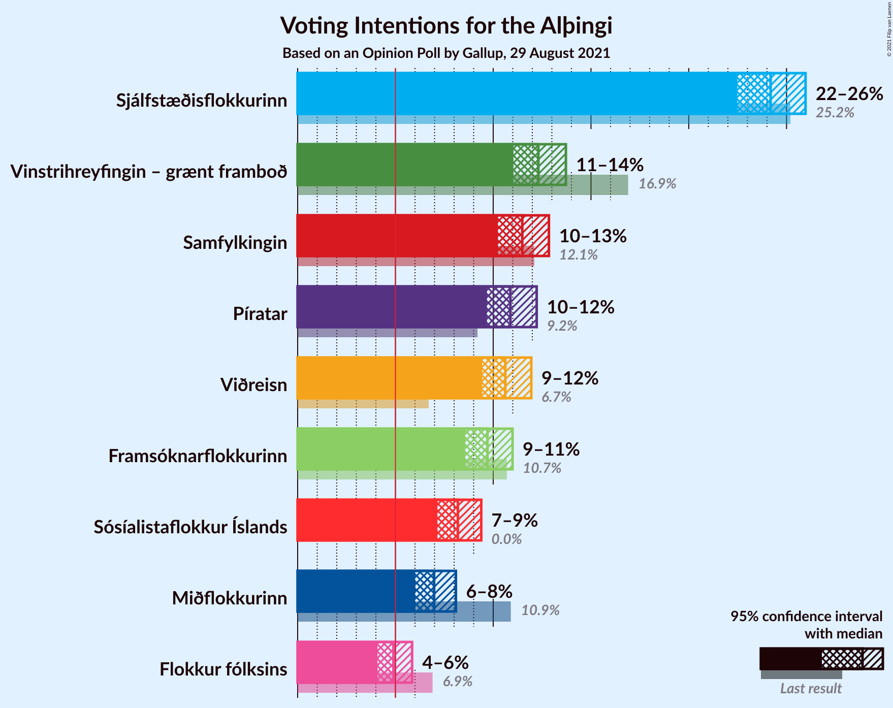

### Confidence Intervals

| Party | Last Result | Poll Result | 80% Confidence Interval | 90% Confidence Interval | 95% Confidence Interval | 99% Confidence Interval |
|:-----:|:-----------:|:-----------:|:-----------------------:|:-----------------------:|:-----------------------:|:-----------------------:|
| Sjálfstæðisflokkurinn | 25.2% | 24.2% | 23.1–25.4% |22.8–25.7% |22.5–26.0% |22.0–26.5% |
| Vinstrihreyfingin – grænt framboð | 16.9% | 12.3% | 11.5–13.2% |11.2–13.5% |11.0–13.7% |10.6–14.2% |
| Samfylkingin | 12.1% | 11.5% | 10.7–12.4% |10.4–12.6% |10.2–12.8% |9.9–13.3% |
| Píratar | 9.2% | 10.9% | 10.1–11.8% |9.9–12.0% |9.7–12.2% |9.3–12.7% |
| Viðreisn | 6.7% | 10.6% | 9.8–11.5% |9.6–11.7% |9.4–11.9% |9.1–12.4% |
| Framsóknarflokkurinn | 10.7% | 9.7% | 9.0–10.5% |8.7–10.8% |8.6–11.0% |8.2–11.4% |
| Sósíalistaflokkur Íslands | 0.0% | 8.2% | 7.5–9.0% |7.3–9.2% |7.1–9.4% |6.8–9.8% |
| Miðflokkurinn | 10.9% | 7.0% | 6.3–7.7% |6.2–7.9% |6.0–8.1% |5.7–8.5% |
| Flokkur fólksins | 6.9% | 4.9% | 4.4–5.5% |4.2–5.7% |4.1–5.9% |3.8–6.2% |

*Note:* The poll result column reflects the actual value used in the calculations. Published results may vary slightly, and in addition be rounded to fewer digits.

## Seats

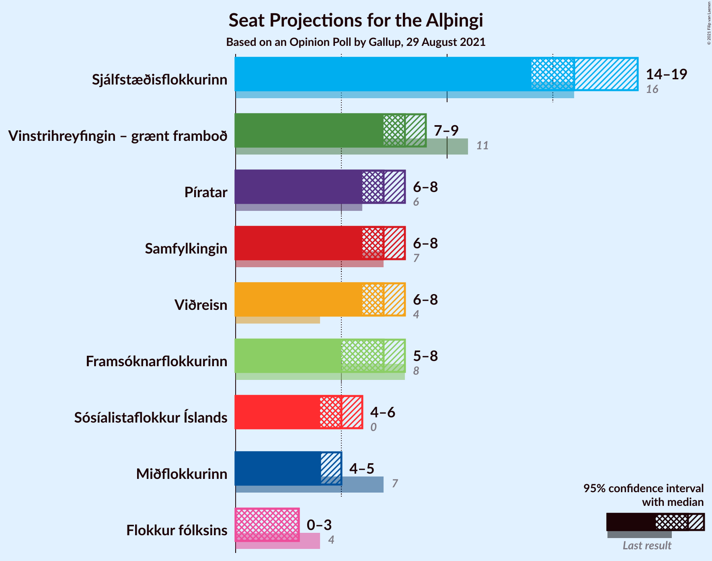

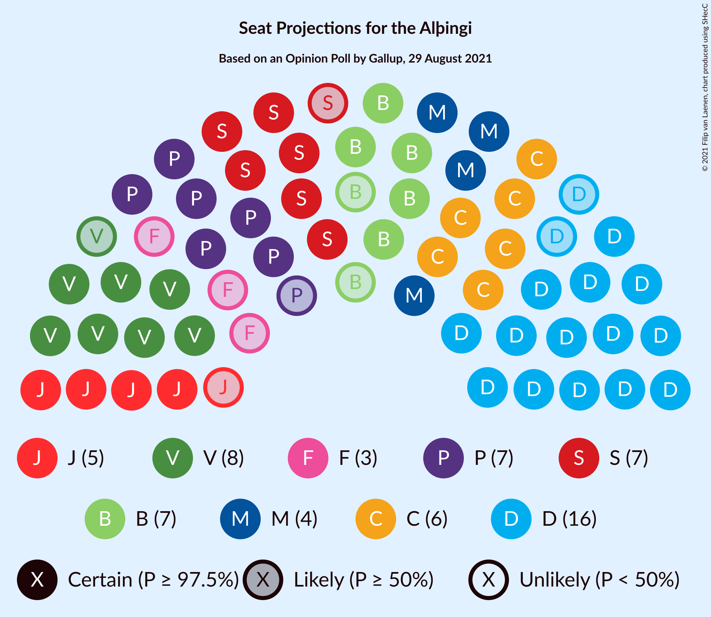

### Confidence Intervals

| Party | Last Result | Median | 80% Confidence Interval | 90% Confidence Interval | 95% Confidence Interval | 99% Confidence Interval |
|:-----:|:-----------:|:------:|:-----------------------:|:-----------------------:|:-----------------------:|:-----------------------:|
| <a href="#sjálfstæðisflokkurinn">Sjálfstæðisflokkurinn</a> | 16 | 16 | 15–19 |15–19 |14–19 |14–19 |
| <a href="#vinstrihreyfingin-–-grænt-framboð">Vinstrihreyfingin – grænt framboð</a> | 11 | 8 | 7–9 |7–9 |7–9 |6–10 |
| <a href="#samfylkingin">Samfylkingin</a> | 7 | 7 | 6–8 |6–8 |6–8 |6–9 |
| <a href="#píratar">Píratar</a> | 6 | 7 | 6–8 |6–8 |6–8 |5–8 |
| <a href="#viðreisn">Viðreisn</a> | 4 | 7 | 6–8 |6–8 |6–8 |5–8 |
| <a href="#framsóknarflokkurinn">Framsóknarflokkurinn</a> | 8 | 7 | 6–8 |5–8 |5–8 |5–8 |
| <a href="#sósíalistaflokkur-íslands">Sósíalistaflokkur Íslands</a> | 0 | 5 | 4–6 |4–6 |4–6 |4–6 |
| <a href="#miðflokkurinn">Miðflokkurinn</a> | 7 | 4 | 4–5 |4–5 |4–5 |3–5 |
| <a href="#flokkur-fólksins">Flokkur fólksins</a> | 4 | 3 | 0–3 |0–3 |0–3 |0–4 |

### Sjálfstæðisflokkurinn

*For a full overview of the results for this party, see the [Sjálfstæðisflokkurinn](party-sjálfstæðisflokkurinn.html) page.*

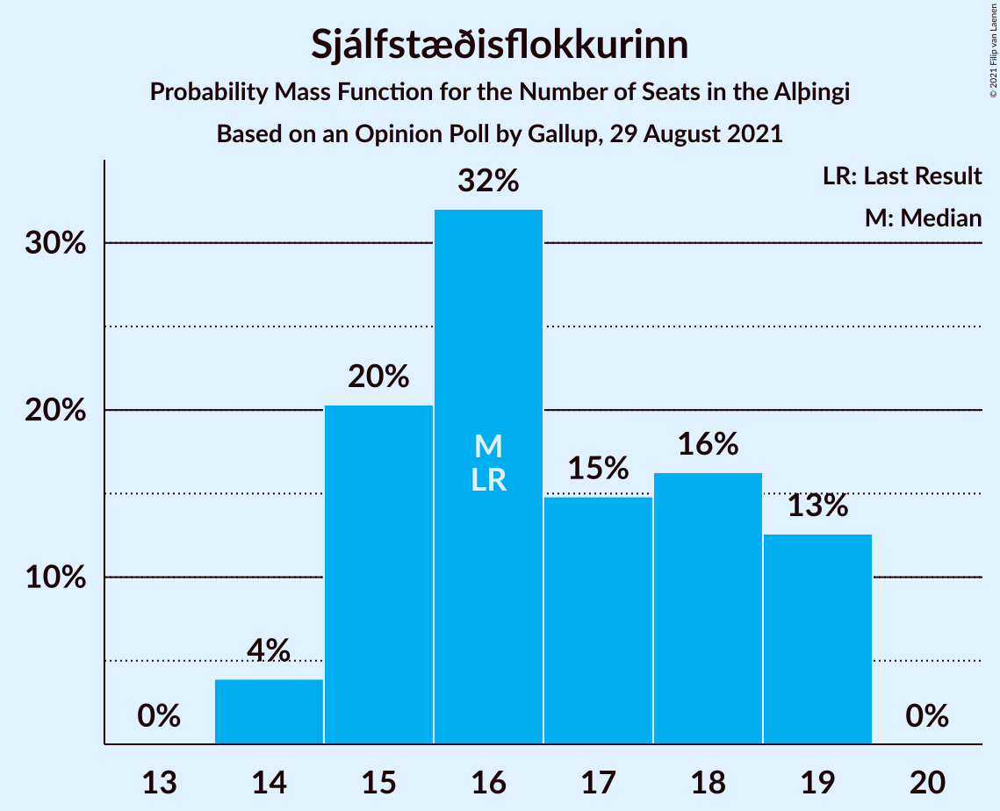

| Number of Seats | Probability | Accumulated | Special Marks |
|:---------------:|:-----------:|:-----------:|:-------------:|
| 14 | 4% | 100% |  |
| 15 | 20% | 96% |  |
| 16 | 32% | 76% | Last Result, Median |
| 17 | 15% | 44% |  |
| 18 | 16% | 29% |  |
| 19 | 13% | 13% |  |
| 20 | 0% | 0% |  |

### Vinstrihreyfingin – grænt framboð

*For a full overview of the results for this party, see the [Vinstrihreyfingin – grænt framboð](party-vinstrihreyfingin–græntframboð.html) page.*

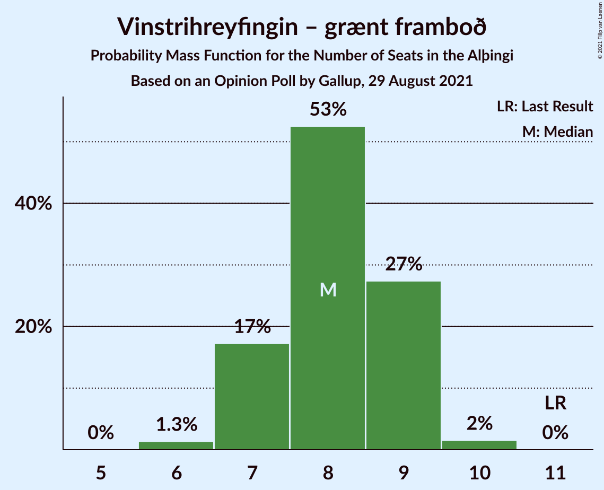

| Number of Seats | Probability | Accumulated | Special Marks |
|:---------------:|:-----------:|:-----------:|:-------------:|
| 6 | 1.3% | 100% |  |
| 7 | 17% | 98.7% |  |
| 8 | 53% | 81% | Median |
| 9 | 27% | 29% |  |
| 10 | 2% | 2% |  |
| 11 | 0% | 0% | Last Result |

### Samfylkingin

*For a full overview of the results for this party, see the [Samfylkingin](party-samfylkingin.html) page.*

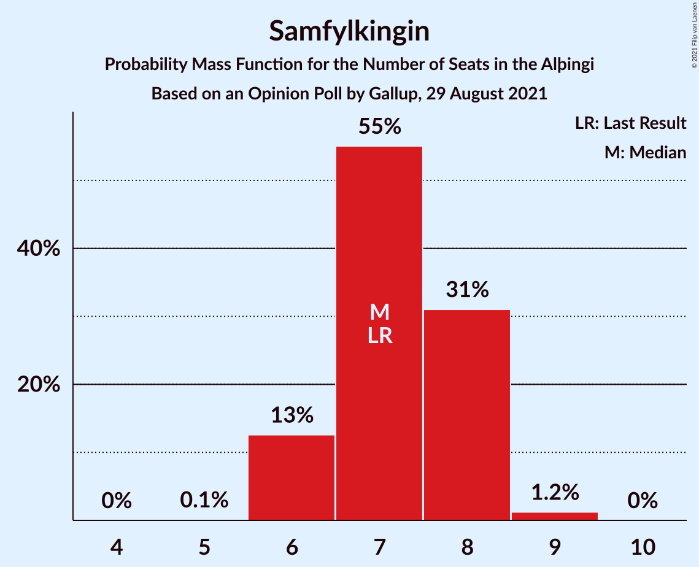

| Number of Seats | Probability | Accumulated | Special Marks |
|:---------------:|:-----------:|:-----------:|:-------------:|
| 5 | 0.1% | 100% |  |
| 6 | 13% | 99.9% |  |
| 7 | 55% | 87% | Last Result, Median |
| 8 | 31% | 32% |  |
| 9 | 1.2% | 1.2% |  |
| 10 | 0% | 0% |  |

### Píratar

*For a full overview of the results for this party, see the [Píratar](party-píratar.html) page.*

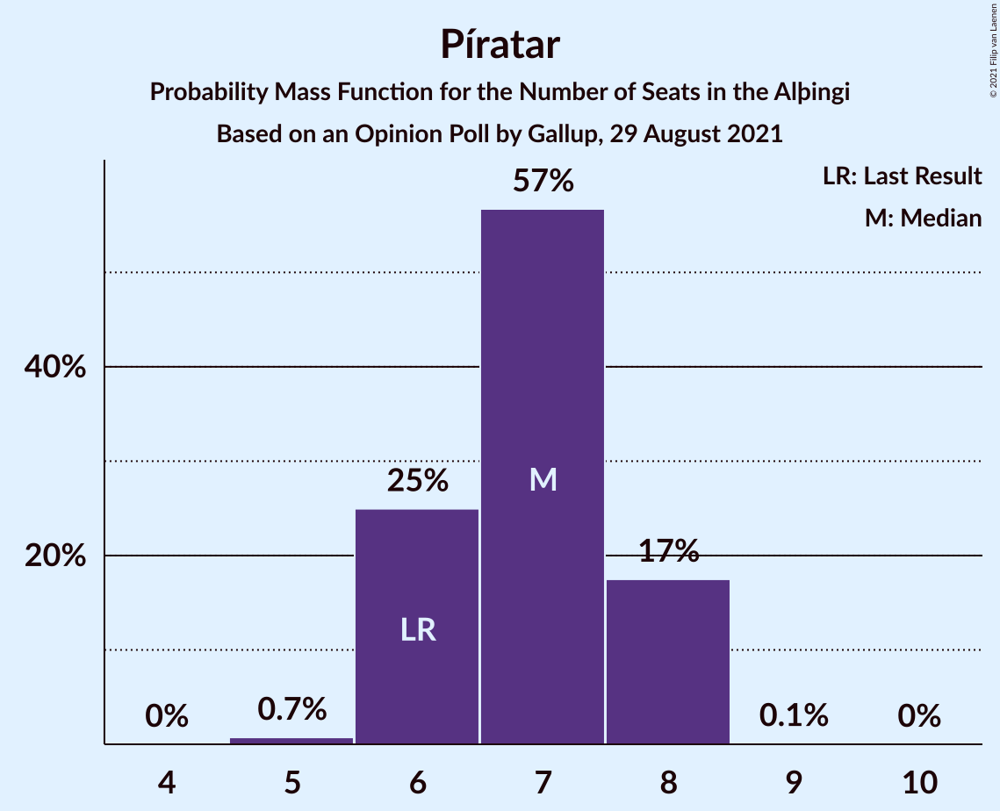

| Number of Seats | Probability | Accumulated | Special Marks |
|:---------------:|:-----------:|:-----------:|:-------------:|
| 5 | 0.7% | 100% |  |
| 6 | 25% | 99.3% | Last Result |
| 7 | 57% | 74% | Median |
| 8 | 17% | 18% |  |
| 9 | 0.1% | 0.1% |  |
| 10 | 0% | 0% |  |

### Viðreisn

*For a full overview of the results for this party, see the [Viðreisn](party-viðreisn.html) page.*

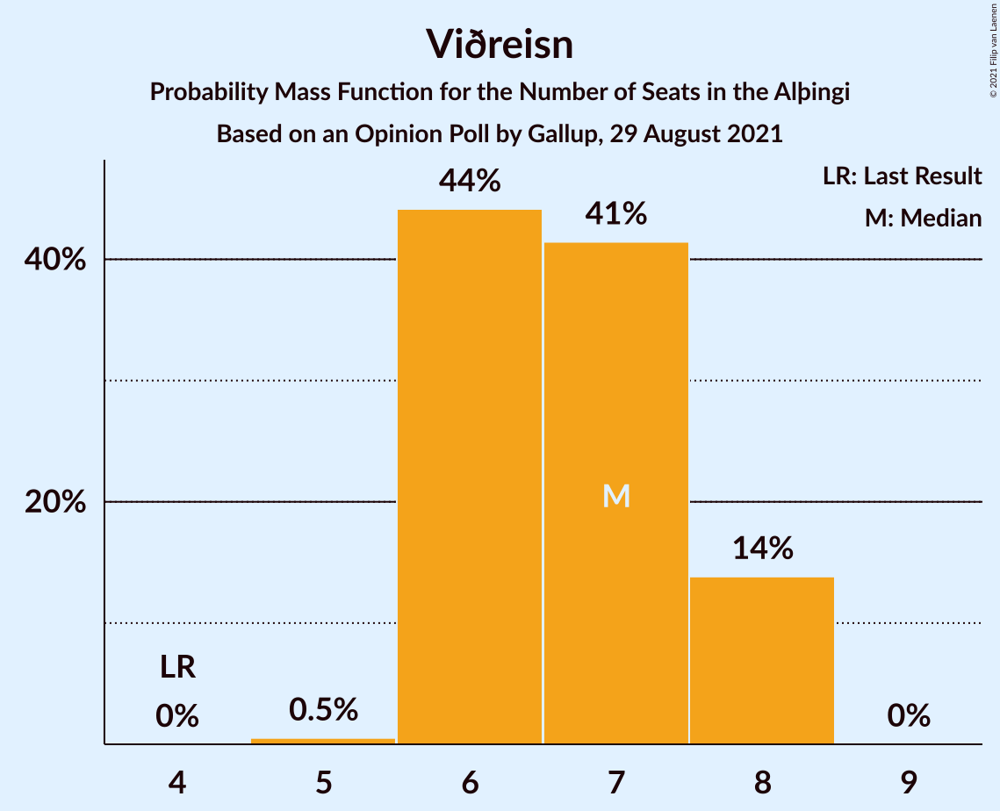

| Number of Seats | Probability | Accumulated | Special Marks |
|:---------------:|:-----------:|:-----------:|:-------------:|
| 4 | 0% | 100% | Last Result |
| 5 | 0.5% | 100% |  |
| 6 | 44% | 99.5% |  |
| 7 | 41% | 55% | Median |
| 8 | 14% | 14% |  |
| 9 | 0% | 0% |  |

### Framsóknarflokkurinn

*For a full overview of the results for this party, see the [Framsóknarflokkurinn](party-framsóknarflokkurinn.html) page.*

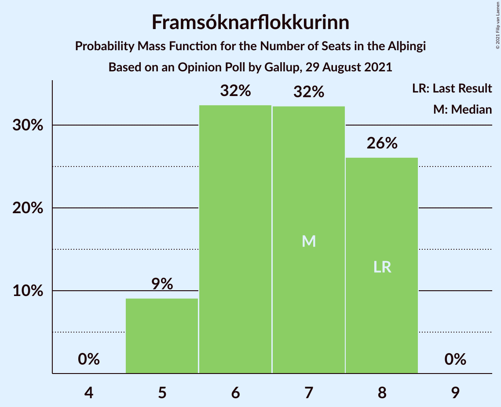

| Number of Seats | Probability | Accumulated | Special Marks |
|:---------------:|:-----------:|:-----------:|:-------------:|
| 5 | 9% | 100% |  |
| 6 | 32% | 91% |  |
| 7 | 32% | 58% | Median |
| 8 | 26% | 26% | Last Result |
| 9 | 0% | 0% |  |

### Sósíalistaflokkur Íslands

*For a full overview of the results for this party, see the [Sósíalistaflokkur Íslands](party-sósíalistaflokkuríslands.html) page.*

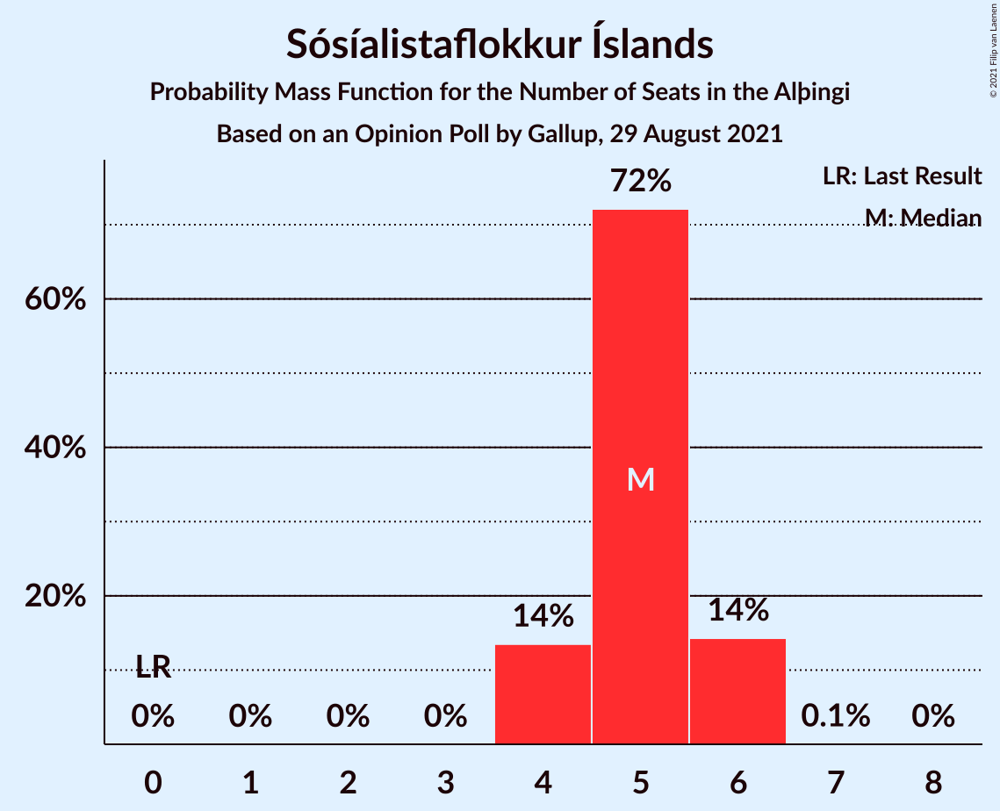

| Number of Seats | Probability | Accumulated | Special Marks |
|:---------------:|:-----------:|:-----------:|:-------------:|
| 0 | 0% | 100% | Last Result |
| 1 | 0% | 100% |  |
| 2 | 0% | 100% |  |
| 3 | 0% | 100% |  |
| 4 | 14% | 100% |  |
| 5 | 72% | 86% | Median |
| 6 | 14% | 14% |  |
| 7 | 0.1% | 0.1% |  |
| 8 | 0% | 0% |  |

### Miðflokkurinn

*For a full overview of the results for this party, see the [Miðflokkurinn](party-miðflokkurinn.html) page.*

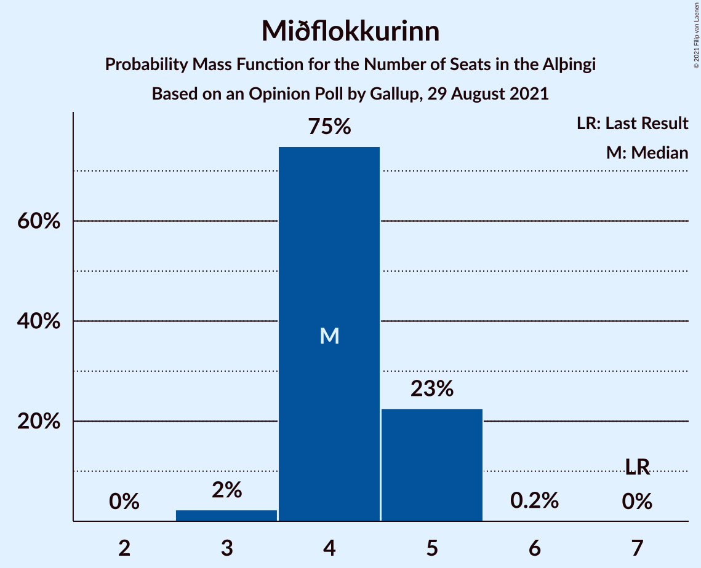

| Number of Seats | Probability | Accumulated | Special Marks |
|:---------------:|:-----------:|:-----------:|:-------------:|
| 3 | 2% | 100% |  |
| 4 | 75% | 98% | Median |
| 5 | 23% | 23% |  |
| 6 | 0.2% | 0.2% |  |
| 7 | 0% | 0% | Last Result |

### Flokkur fólksins

*For a full overview of the results for this party, see the [Flokkur fólksins](party-flokkurfólksins.html) page.*

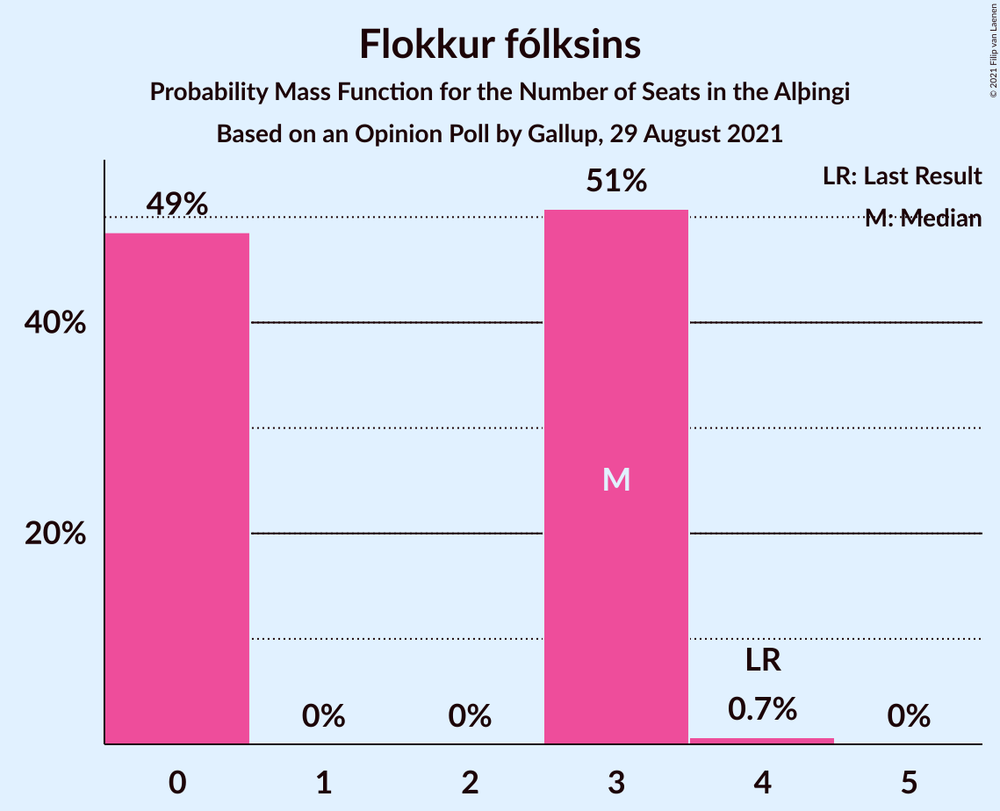

| Number of Seats | Probability | Accumulated | Special Marks |
|:---------------:|:-----------:|:-----------:|:-------------:|
| 0 | 49% | 100% |  |
| 1 | 0% | 51% |  |
| 2 | 0% | 51% |  |
| 3 | 51% | 51% | Median |
| 4 | 0.7% | 0.7% | Last Result |
| 5 | 0% | 0% |  |

## Coalitions

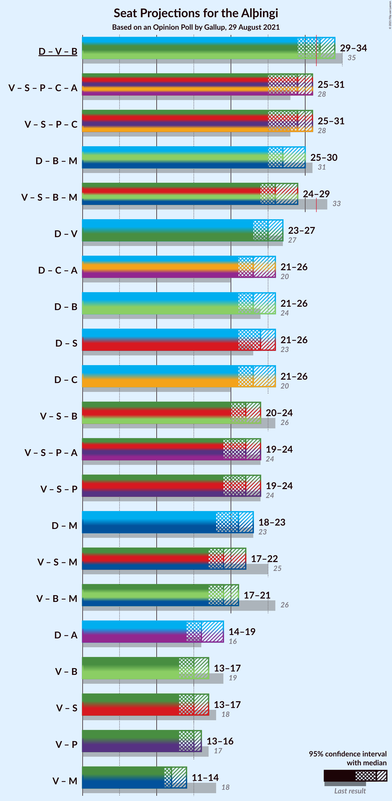

### Confidence Intervals

| Coalition | Last Result | Median | Majority? | 80% Confidence Interval | 90% Confidence Interval | 95% Confidence Interval | 99% Confidence Interval |
|:---------:|:-----------:|:------:|:---------:|:-----------------------:|:-----------------------:|:-----------------------:|:-----------------------:|
| Sjálfstæðisflokkurinn – Vinstrihreyfingin – grænt framboð – Framsóknarflokkurinn | 35 | 32 | 52% | 30–33 | 29–33 | 29–34 | 28–35 |
| Vinstrihreyfingin – grænt framboð – Samfylkingin – Píratar – Viðreisn | 28 | 29 | 2% | 26–31 | 25–31 | 25–31 | 25–32 |
| Sjálfstæðisflokkurinn – Framsóknarflokkurinn – Miðflokkurinn | 31 | 27 | 0% | 26–30 | 25–30 | 25–30 | 24–31 |
| Vinstrihreyfingin – grænt framboð – Samfylkingin – Framsóknarflokkurinn – Miðflokkurinn | 33 | 26 | 0% | 24–28 | 24–28 | 24–29 | 23–30 |
| Sjálfstæðisflokkurinn – Vinstrihreyfingin – grænt framboð | 27 | 25 | 0% | 23–26 | 23–27 | 23–27 | 22–28 |
| Sjálfstæðisflokkurinn – Framsóknarflokkurinn | 24 | 23 | 0% | 22–25 | 21–26 | 21–26 | 20–27 |
| Sjálfstæðisflokkurinn – Samfylkingin | 23 | 24 | 0% | 22–26 | 22–26 | 21–26 | 21–27 |
| Sjálfstæðisflokkurinn – Viðreisn | 20 | 23 | 0% | 21–25 | 21–25 | 21–26 | 20–26 |
| Vinstrihreyfingin – grænt framboð – Samfylkingin – Framsóknarflokkurinn | 26 | 22 | 0% | 20–24 | 20–24 | 20–24 | 19–25 |
| Vinstrihreyfingin – grænt framboð – Samfylkingin – Píratar | 24 | 22 | 0% | 20–24 | 19–24 | 19–24 | 19–25 |
| Sjálfstæðisflokkurinn – Miðflokkurinn | 23 | 21 | 0% | 19–23 | 19–23 | 18–23 | 18–24 |
| Vinstrihreyfingin – grænt framboð – Samfylkingin – Miðflokkurinn | 25 | 19 | 0% | 18–21 | 17–21 | 17–22 | 17–23 |
| Vinstrihreyfingin – grænt framboð – Framsóknarflokkurinn – Miðflokkurinn | 26 | 19 | 0% | 18–20 | 17–21 | 17–21 | 16–22 |
| Vinstrihreyfingin – grænt framboð – Framsóknarflokkurinn | 19 | 15 | 0% | 13–16 | 13–17 | 13–17 | 12–17 |
| Vinstrihreyfingin – grænt framboð – Samfylkingin | 18 | 15 | 0% | 14–17 | 13–17 | 13–17 | 13–18 |
| Vinstrihreyfingin – grænt framboð – Píratar | 17 | 15 | 0% | 13–16 | 13–16 | 13–16 | 13–17 |
| Vinstrihreyfingin – grænt framboð – Miðflokkurinn | 18 | 12 | 0% | 11–13 | 11–14 | 11–14 | 10–15 |

### Sjálfstæðisflokkurinn – Vinstrihreyfingin – grænt framboð – Framsóknarflokkurinn

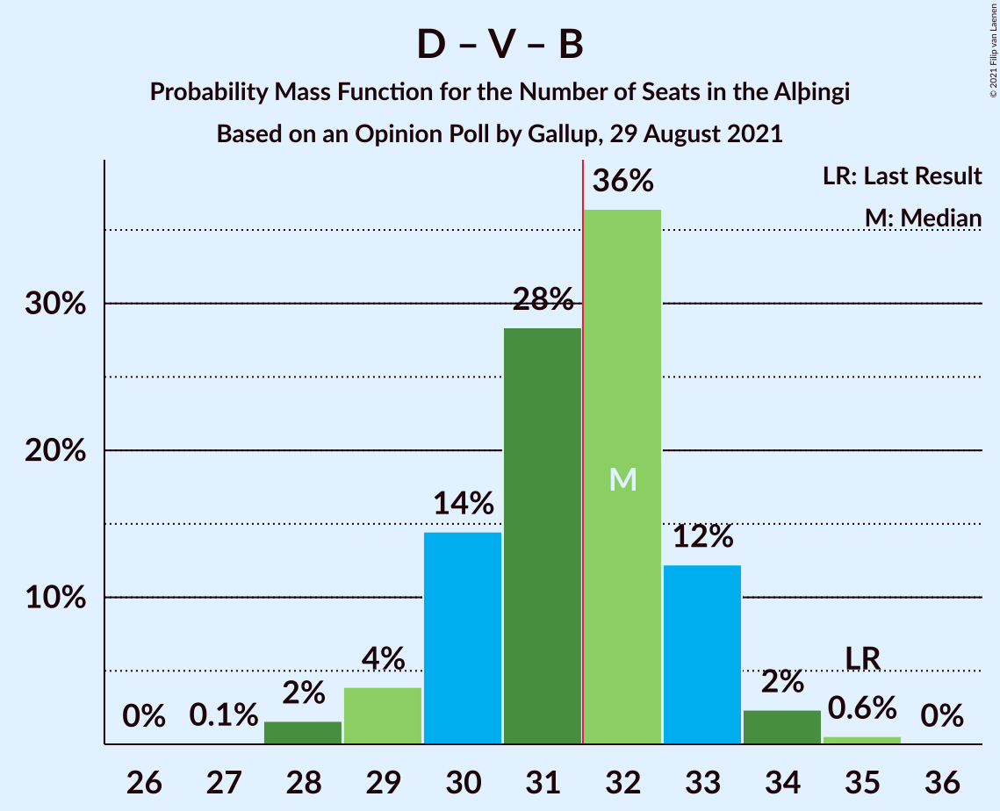

| Number of Seats | Probability | Accumulated | Special Marks |
|:---------------:|:-----------:|:-----------:|:-------------:|
| 27 | 0.1% | 100% |  |
| 28 | 2% | 99.9% |  |
| 29 | 4% | 98% |  |
| 30 | 14% | 94% |  |
| 31 | 28% | 80% | Median |
| 32 | 36% | 52% | Majority |
| 33 | 12% | 15% |  |
| 34 | 2% | 3% |  |
| 35 | 0.6% | 0.6% | Last Result |
| 36 | 0% | 0% |  |

### Vinstrihreyfingin – grænt framboð – Samfylkingin – Píratar – Viðreisn

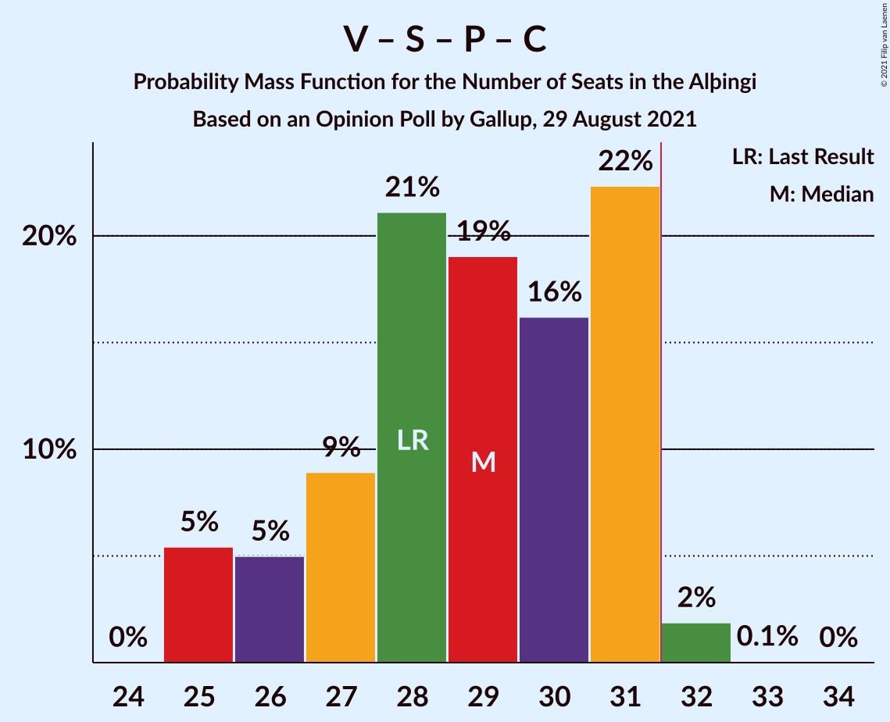

| Number of Seats | Probability | Accumulated | Special Marks |
|:---------------:|:-----------:|:-----------:|:-------------:|
| 25 | 5% | 100% |  |
| 26 | 5% | 95% |  |
| 27 | 9% | 90% |  |
| 28 | 21% | 81% | Last Result |
| 29 | 19% | 60% | Median |
| 30 | 16% | 40% |  |
| 31 | 22% | 24% |  |
| 32 | 2% | 2% | Majority |
| 33 | 0.1% | 0.1% |  |
| 34 | 0% | 0% |  |

### Sjálfstæðisflokkurinn – Framsóknarflokkurinn – Miðflokkurinn

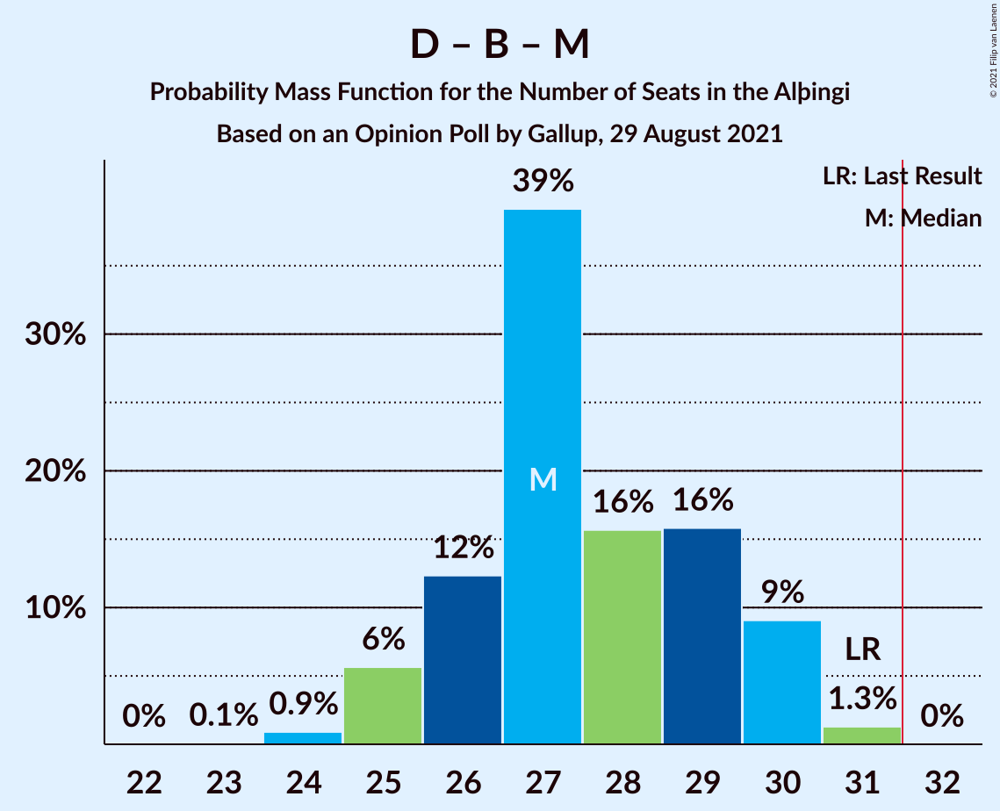

| Number of Seats | Probability | Accumulated | Special Marks |
|:---------------:|:-----------:|:-----------:|:-------------:|
| 23 | 0.1% | 100% |  |
| 24 | 0.9% | 99.9% |  |
| 25 | 6% | 99.0% |  |
| 26 | 12% | 93% |  |
| 27 | 39% | 81% | Median |
| 28 | 16% | 42% |  |
| 29 | 16% | 26% |  |
| 30 | 9% | 10% |  |
| 31 | 1.3% | 1.3% | Last Result |
| 32 | 0% | 0% | Majority |

### Vinstrihreyfingin – grænt framboð – Samfylkingin – Framsóknarflokkurinn – Miðflokkurinn

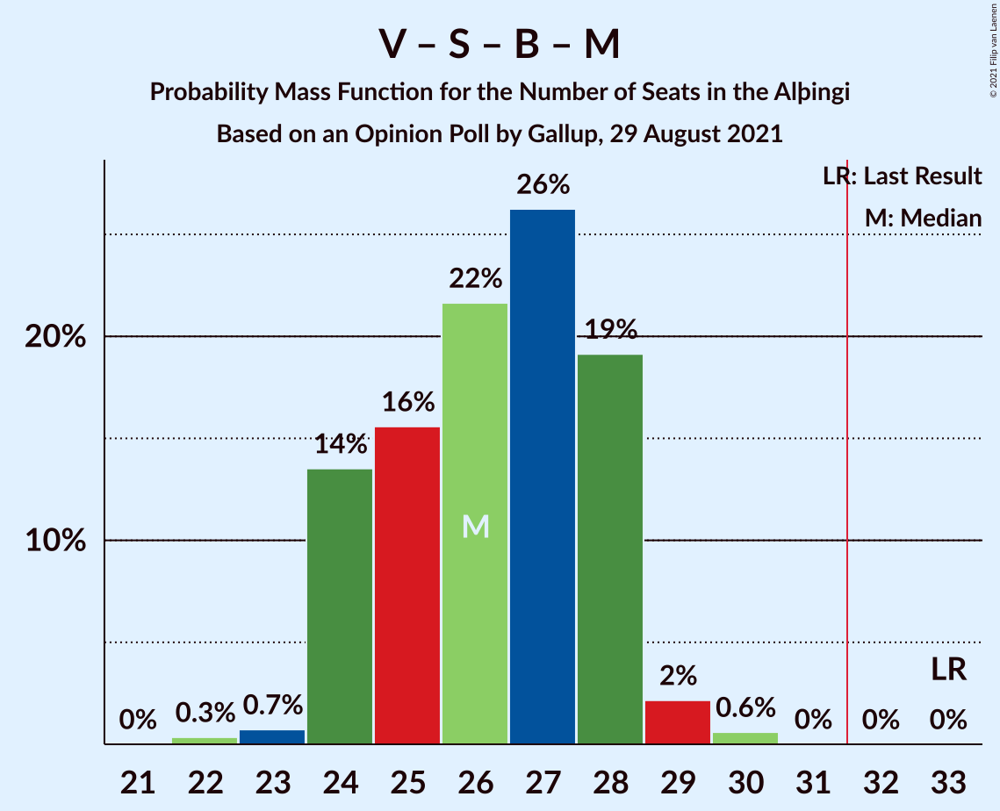

| Number of Seats | Probability | Accumulated | Special Marks |
|:---------------:|:-----------:|:-----------:|:-------------:|
| 22 | 0.3% | 100% |  |
| 23 | 0.7% | 99.6% |  |
| 24 | 14% | 98.9% |  |
| 25 | 16% | 85% |  |
| 26 | 22% | 70% | Median |
| 27 | 26% | 48% |  |
| 28 | 19% | 22% |  |
| 29 | 2% | 3% |  |
| 30 | 0.6% | 0.6% |  |
| 31 | 0% | 0% |  |
| 32 | 0% | 0% | Majority |
| 33 | 0% | 0% | Last Result |

### Sjálfstæðisflokkurinn – Vinstrihreyfingin – grænt framboð

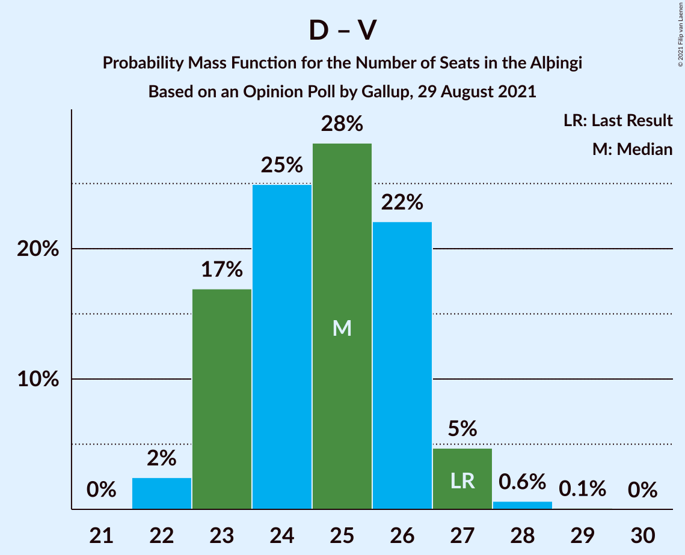

| Number of Seats | Probability | Accumulated | Special Marks |
|:---------------:|:-----------:|:-----------:|:-------------:|
| 22 | 2% | 100% |  |
| 23 | 17% | 98% |  |
| 24 | 25% | 81% | Median |
| 25 | 28% | 56% |  |
| 26 | 22% | 28% |  |
| 27 | 5% | 5% | Last Result |
| 28 | 0.6% | 0.7% |  |
| 29 | 0.1% | 0.1% |  |
| 30 | 0% | 0% |  |

### Sjálfstæðisflokkurinn – Framsóknarflokkurinn

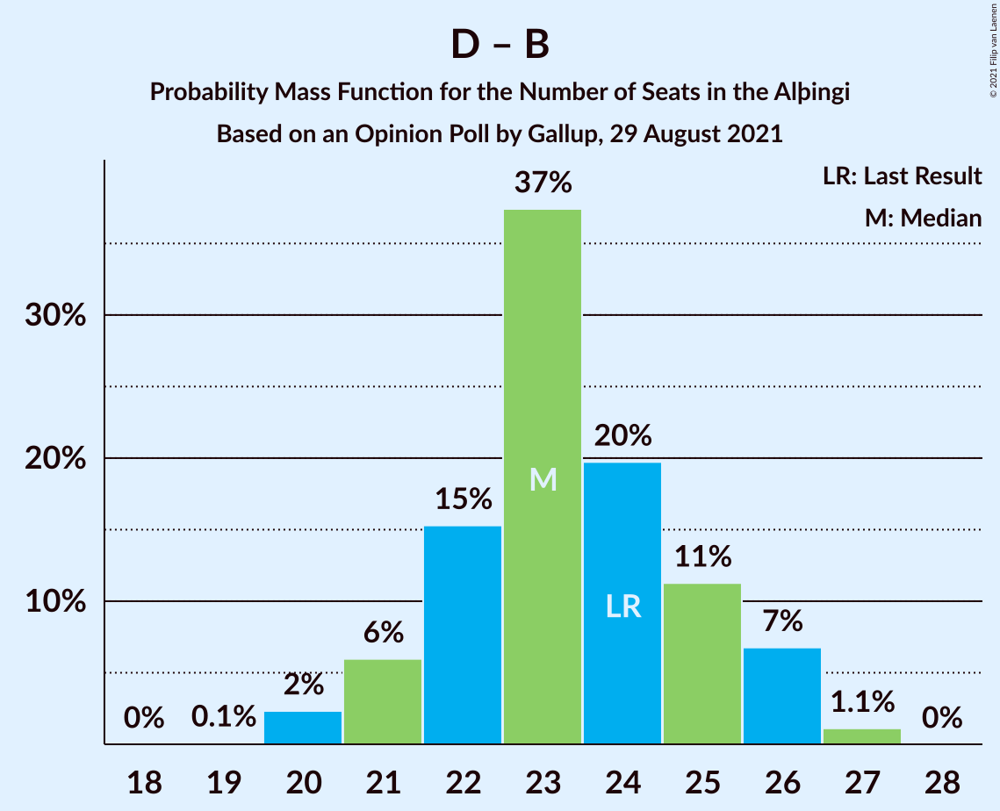

| Number of Seats | Probability | Accumulated | Special Marks |
|:---------------:|:-----------:|:-----------:|:-------------:|
| 19 | 0.1% | 100% |  |
| 20 | 2% | 99.9% |  |
| 21 | 6% | 98% |  |
| 22 | 15% | 92% |  |
| 23 | 37% | 76% | Median |
| 24 | 20% | 39% | Last Result |
| 25 | 11% | 19% |  |
| 26 | 7% | 8% |  |
| 27 | 1.1% | 1.1% |  |
| 28 | 0% | 0% |  |

### Sjálfstæðisflokkurinn – Samfylkingin

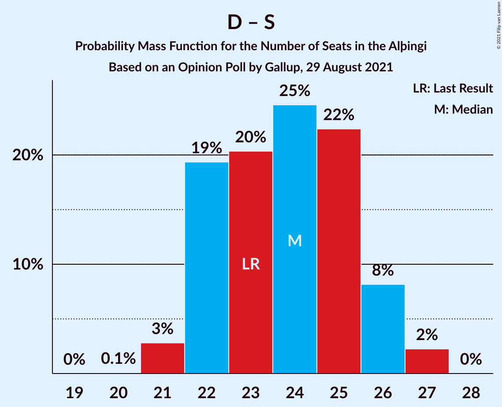

| Number of Seats | Probability | Accumulated | Special Marks |
|:---------------:|:-----------:|:-----------:|:-------------:|
| 20 | 0.1% | 100% |  |
| 21 | 3% | 99.9% |  |
| 22 | 19% | 97% |  |
| 23 | 20% | 78% | Last Result, Median |
| 24 | 25% | 57% |  |
| 25 | 22% | 33% |  |
| 26 | 8% | 10% |  |
| 27 | 2% | 2% |  |
| 28 | 0% | 0% |  |

### Sjálfstæðisflokkurinn – Viðreisn

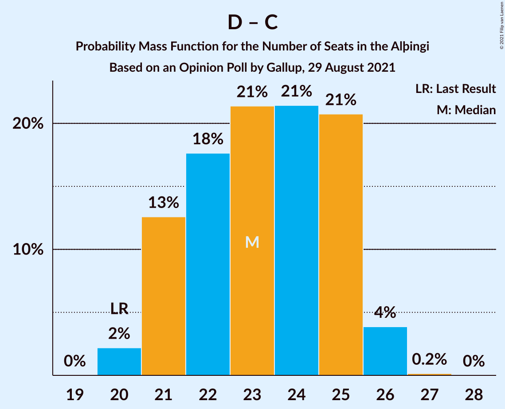

| Number of Seats | Probability | Accumulated | Special Marks |
|:---------------:|:-----------:|:-----------:|:-------------:|
| 20 | 2% | 100% | Last Result |
| 21 | 13% | 98% |  |
| 22 | 18% | 85% |  |
| 23 | 21% | 68% | Median |
| 24 | 21% | 46% |  |
| 25 | 21% | 25% |  |
| 26 | 4% | 4% |  |
| 27 | 0.2% | 0.2% |  |
| 28 | 0% | 0% |  |

### Vinstrihreyfingin – grænt framboð – Samfylkingin – Framsóknarflokkurinn

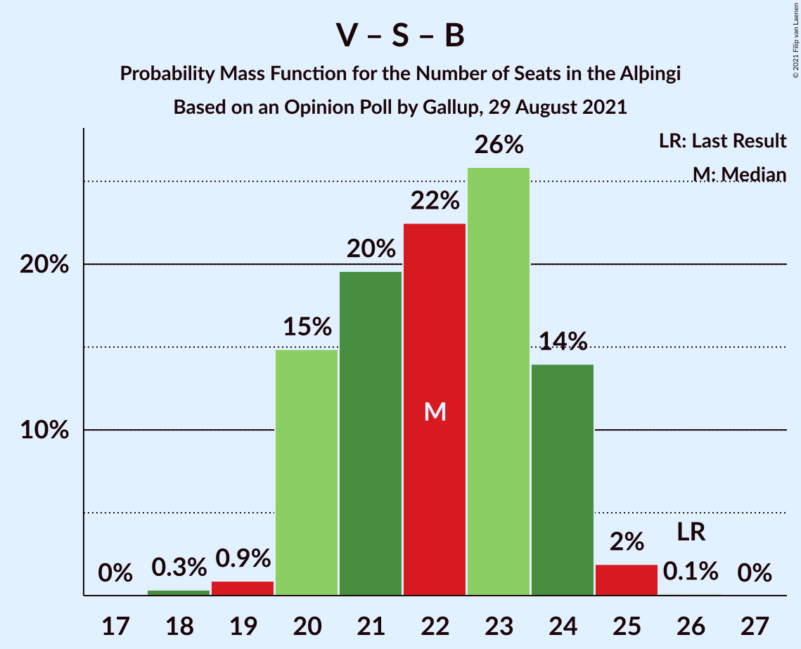

| Number of Seats | Probability | Accumulated | Special Marks |
|:---------------:|:-----------:|:-----------:|:-------------:|
| 18 | 0.3% | 100% |  |
| 19 | 0.9% | 99.6% |  |
| 20 | 15% | 98.8% |  |
| 21 | 20% | 84% |  |
| 22 | 22% | 64% | Median |
| 23 | 26% | 42% |  |
| 24 | 14% | 16% |  |
| 25 | 2% | 2% |  |
| 26 | 0.1% | 0.1% | Last Result |
| 27 | 0% | 0% |  |

### Vinstrihreyfingin – grænt framboð – Samfylkingin – Píratar

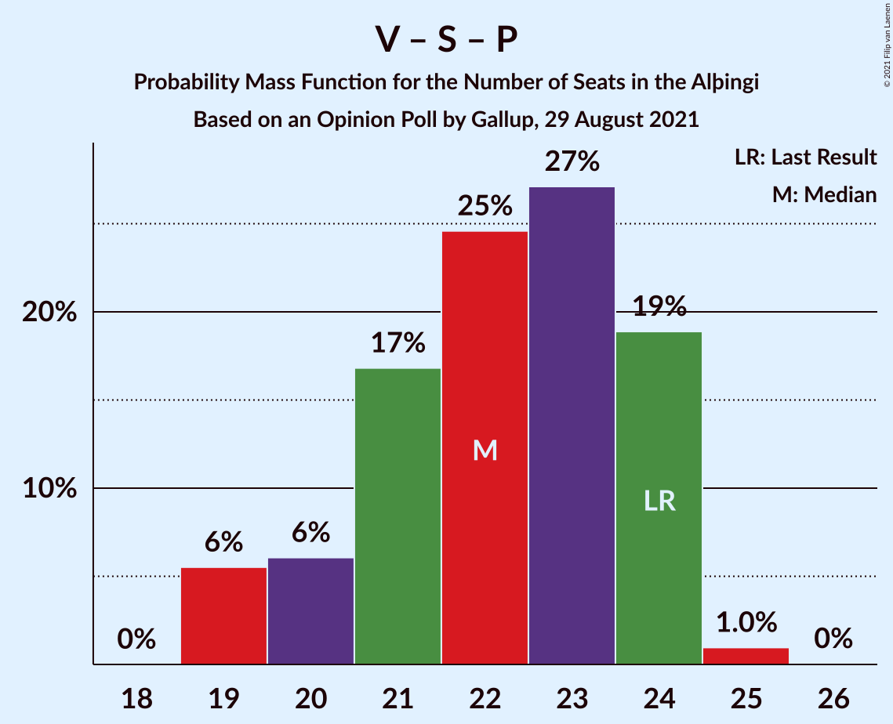

| Number of Seats | Probability | Accumulated | Special Marks |
|:---------------:|:-----------:|:-----------:|:-------------:|
| 19 | 6% | 100% |  |
| 20 | 6% | 94% |  |
| 21 | 17% | 88% |  |
| 22 | 25% | 72% | Median |
| 23 | 27% | 47% |  |
| 24 | 19% | 20% | Last Result |
| 25 | 1.0% | 1.0% |  |
| 26 | 0% | 0% |  |

### Sjálfstæðisflokkurinn – Miðflokkurinn

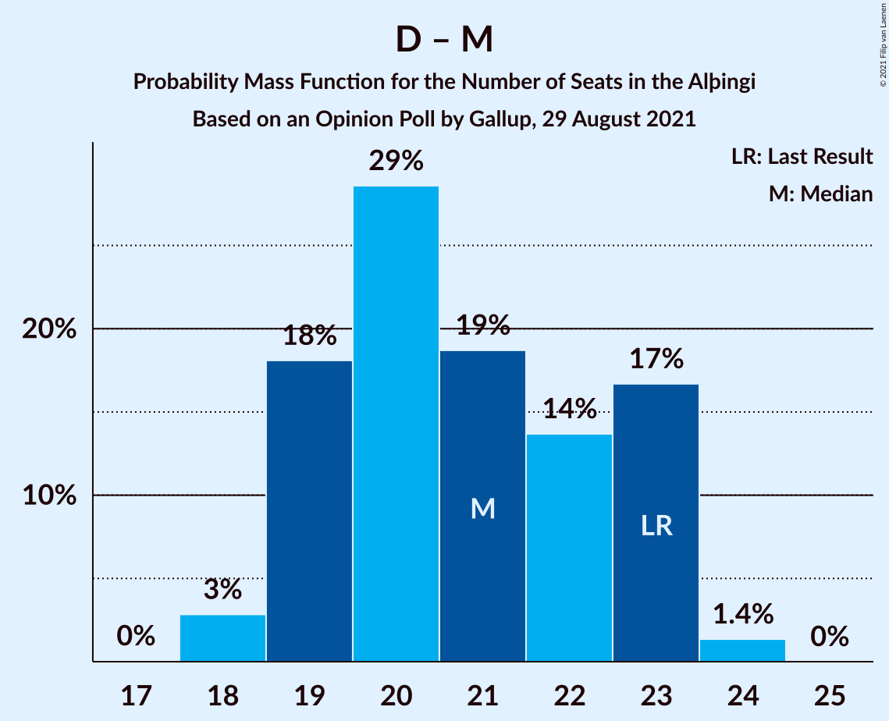

| Number of Seats | Probability | Accumulated | Special Marks |
|:---------------:|:-----------:|:-----------:|:-------------:|
| 18 | 3% | 100% |  |
| 19 | 18% | 97% |  |
| 20 | 29% | 79% | Median |
| 21 | 19% | 50% |  |
| 22 | 14% | 32% |  |
| 23 | 17% | 18% | Last Result |
| 24 | 1.4% | 1.4% |  |
| 25 | 0% | 0% |  |

### Vinstrihreyfingin – grænt framboð – Samfylkingin – Miðflokkurinn

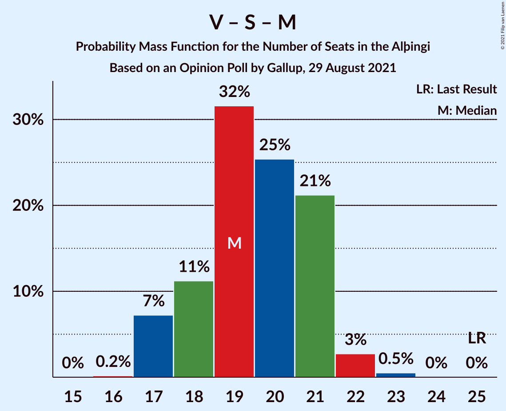

| Number of Seats | Probability | Accumulated | Special Marks |
|:---------------:|:-----------:|:-----------:|:-------------:|
| 16 | 0.2% | 100% |  |
| 17 | 7% | 99.8% |  |
| 18 | 11% | 93% |  |
| 19 | 32% | 81% | Median |
| 20 | 25% | 50% |  |
| 21 | 21% | 24% |  |
| 22 | 3% | 3% |  |
| 23 | 0.5% | 0.5% |  |
| 24 | 0% | 0% |  |
| 25 | 0% | 0% | Last Result |

### Vinstrihreyfingin – grænt framboð – Framsóknarflokkurinn – Miðflokkurinn

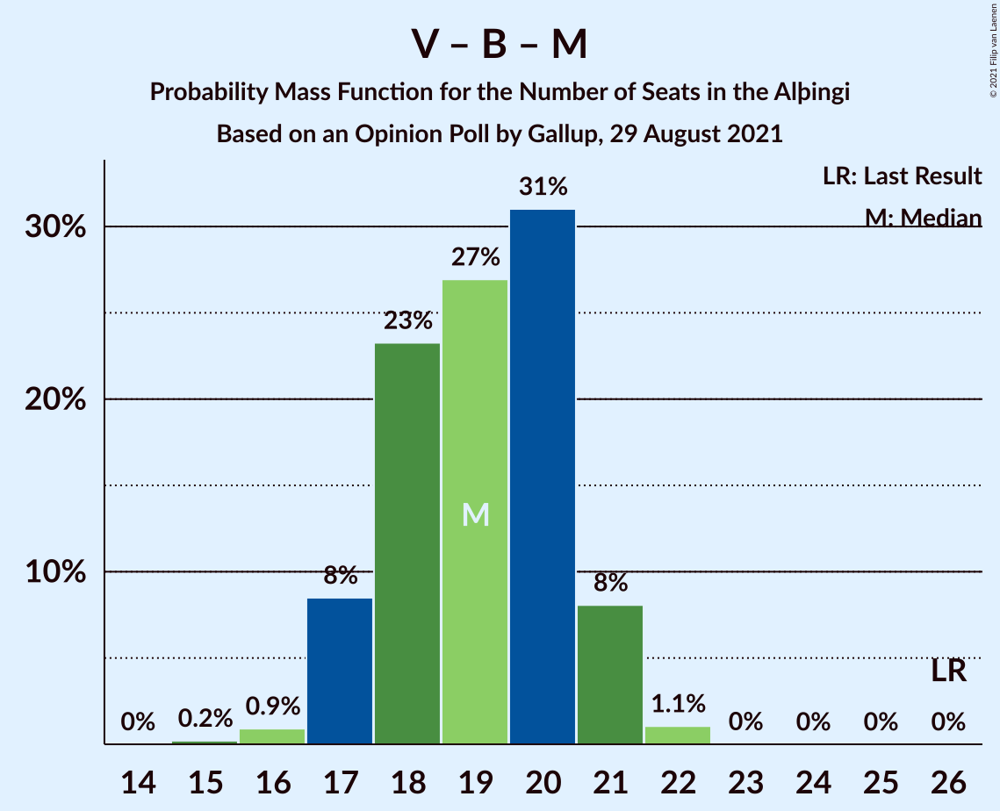

| Number of Seats | Probability | Accumulated | Special Marks |
|:---------------:|:-----------:|:-----------:|:-------------:|
| 15 | 0.2% | 100% |  |
| 16 | 0.9% | 99.8% |  |
| 17 | 8% | 98.9% |  |
| 18 | 23% | 90% |  |
| 19 | 27% | 67% | Median |
| 20 | 31% | 40% |  |
| 21 | 8% | 9% |  |
| 22 | 1.1% | 1.1% |  |
| 23 | 0% | 0% |  |
| 24 | 0% | 0% |  |
| 25 | 0% | 0% |  |
| 26 | 0% | 0% | Last Result |

### Vinstrihreyfingin – grænt framboð – Framsóknarflokkurinn

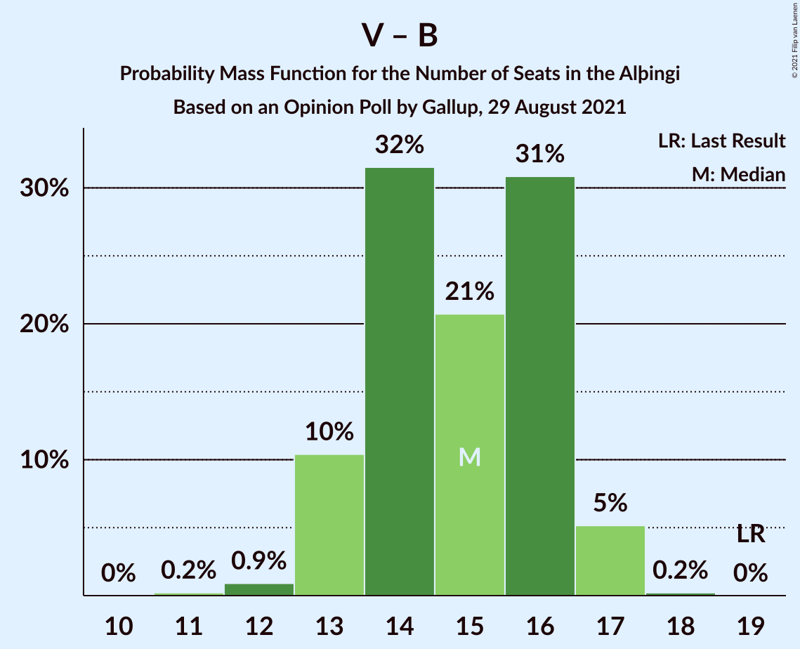

| Number of Seats | Probability | Accumulated | Special Marks |
|:---------------:|:-----------:|:-----------:|:-------------:|
| 11 | 0.2% | 100% |  |
| 12 | 0.9% | 99.8% |  |
| 13 | 10% | 98.9% |  |
| 14 | 32% | 88% |  |
| 15 | 21% | 57% | Median |
| 16 | 31% | 36% |  |
| 17 | 5% | 5% |  |
| 18 | 0.2% | 0.2% |  |
| 19 | 0% | 0% | Last Result |

### Vinstrihreyfingin – grænt framboð – Samfylkingin

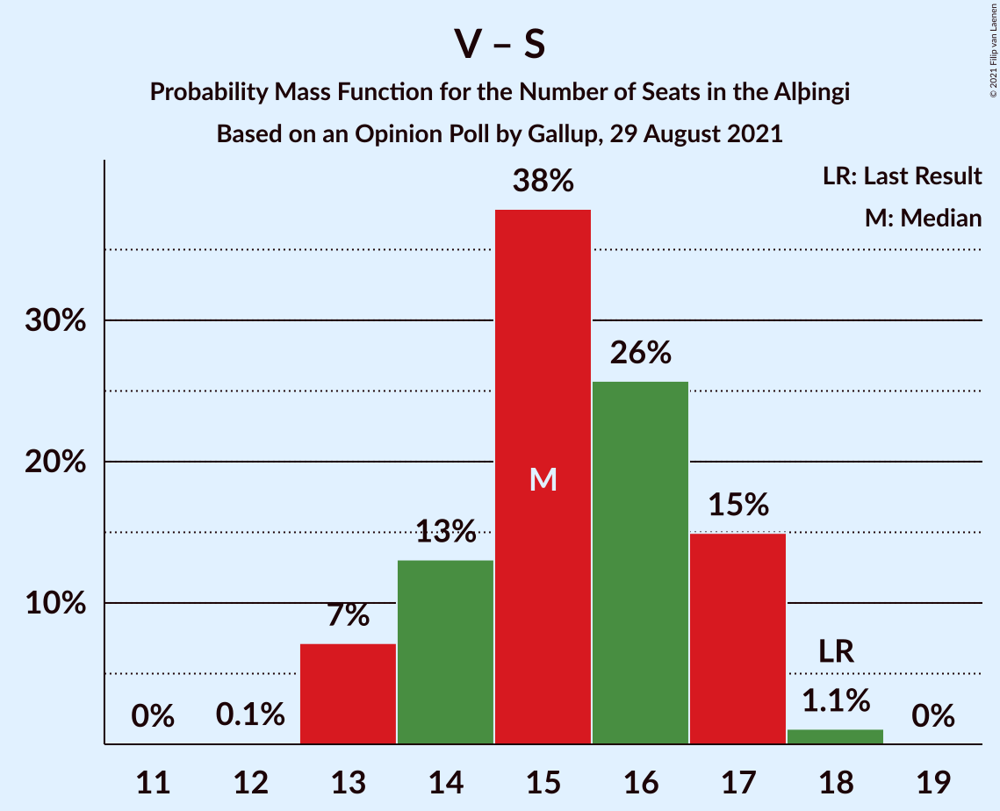

| Number of Seats | Probability | Accumulated | Special Marks |
|:---------------:|:-----------:|:-----------:|:-------------:|
| 12 | 0.1% | 100% |  |
| 13 | 7% | 99.9% |  |
| 14 | 13% | 93% |  |
| 15 | 38% | 80% | Median |
| 16 | 26% | 42% |  |
| 17 | 15% | 16% |  |
| 18 | 1.1% | 1.1% | Last Result |
| 19 | 0% | 0% |  |

### Vinstrihreyfingin – grænt framboð – Píratar

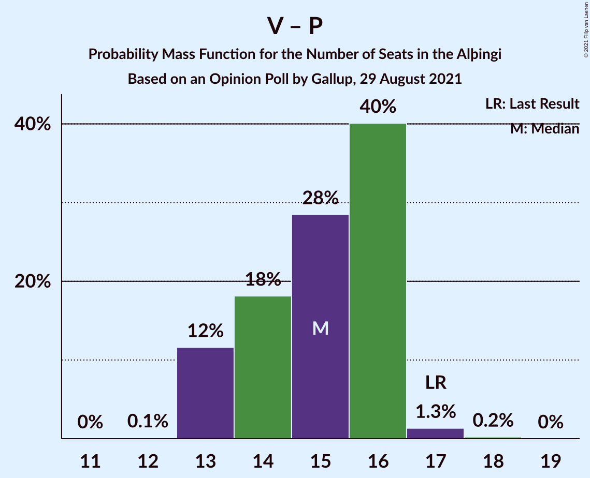

| Number of Seats | Probability | Accumulated | Special Marks |
|:---------------:|:-----------:|:-----------:|:-------------:|
| 12 | 0.1% | 100% |  |
| 13 | 12% | 99.9% |  |
| 14 | 18% | 88% |  |
| 15 | 28% | 70% | Median |
| 16 | 40% | 42% |  |
| 17 | 1.3% | 2% | Last Result |
| 18 | 0.2% | 0.2% |  |
| 19 | 0% | 0% |  |

### Vinstrihreyfingin – grænt framboð – Miðflokkurinn

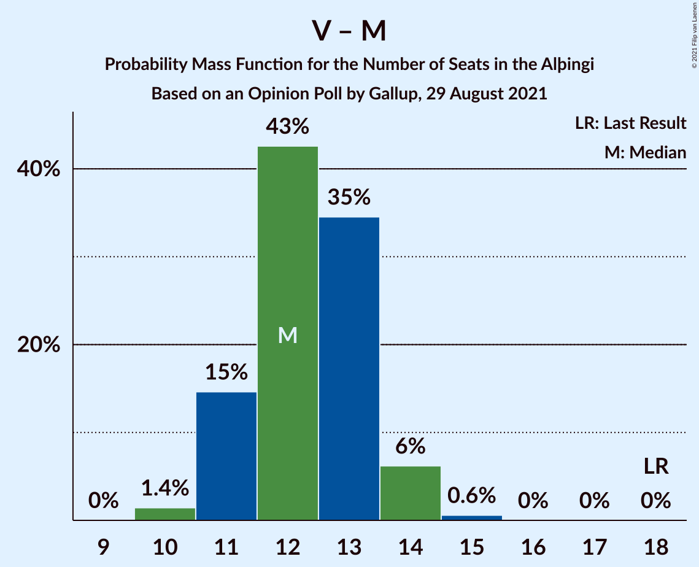

| Number of Seats | Probability | Accumulated | Special Marks |
|:---------------:|:-----------:|:-----------:|:-------------:|
| 10 | 1.4% | 100% |  |
| 11 | 15% | 98.5% |  |
| 12 | 43% | 84% | Median |
| 13 | 35% | 41% |  |
| 14 | 6% | 7% |  |
| 15 | 0.6% | 0.6% |  |
| 16 | 0% | 0% |  |
| 17 | 0% | 0% |  |
| 18 | 0% | 0% | Last Result |

## Technical Information

### Opinion Poll

+ **Polling firm:** Gallup
+ **Commissioner(s):** —
+ **Fieldwork period:** 29 August 2021

### Calculations

+ **Sample size:** 2307
+ **Simulations done:** 1,048,576
+ **Error estimate:** 0.70%

