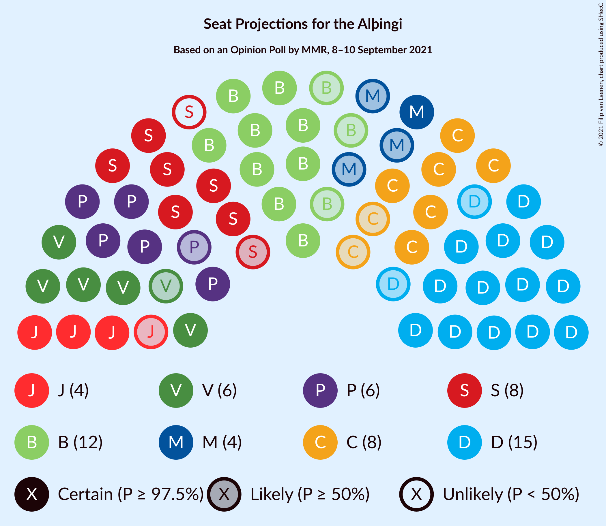

# Opinion Poll by MMR, 8–10 September 2021

<a href="#voting-intentions">Voting Intentions</a> | <a href="#seats">Seats</a> | <a href="#coalitions">Coalitions</a> | <a href="#technical-information">Technical Information</a>

## Voting Intentions

### Confidence Intervals

| Party | Last Result | Poll Result | 80% Confidence Interval | 90% Confidence Interval | 95% Confidence Interval | 99% Confidence Interval |
|:-----:|:-----------:|:-----------:|:-----------------------:|:-----------------------:|:-----------------------:|:-----------------------:|
| Sjálfstæðisflokkurinn | 25.2% | 22.3% | 20.6–24.2% |20.1–24.7% |19.7–25.1% |18.9–26.0% |
| Framsóknarflokkurinn | 10.7% | 14.9% | 13.5–16.6% |13.1–17.0% |12.8–17.4% |12.1–18.2% |
| Viðreisn | 6.7% | 12.2% | 10.9–13.7% |10.5–14.1% |10.2–14.5% |9.6–15.2% |
| Samfylkingin | 12.1% | 11.6% | 10.4–13.1% |10.0–13.5% |9.7–13.9% |9.1–14.6% |
| Vinstrihreyfingin – grænt framboð | 16.9% | 10.5% | 9.3–12.0% |9.0–12.4% |8.7–12.7% |8.2–13.4% |
| Píratar | 9.2% | 9.9% | 8.7–11.3% |8.4–11.7% |8.1–12.0% |7.6–12.7% |
| Sósíalistaflokkur Íslands | 0.0% | 6.7% | 5.7–7.9% |5.5–8.2% |5.3–8.5% |4.8–9.1% |
| Miðflokkurinn | 10.9% | 6.0% | 5.1–7.2% |4.9–7.5% |4.7–7.8% |4.3–8.4% |
| Flokkur fólksins | 6.9% | 4.9% | 4.1–6.0% |3.9–6.3% |3.7–6.6% |3.4–7.1% |

*Note:* The poll result column reflects the actual value used in the calculations. Published results may vary slightly, and in addition be rounded to fewer digits.

## Seats

### Confidence Intervals

| Party | Last Result | Median | 80% Confidence Interval | 90% Confidence Interval | 95% Confidence Interval | 99% Confidence Interval |
|:-----:|:-----------:|:------:|:-----------------------:|:-----------------------:|:-----------------------:|:-----------------------:|
| <a href="#sjálfstæðisflokkurinn">Sjálfstæðisflokkurinn</a> | 16 | 15 | 13–17 |13–18 |13–18 |13–19 |
| <a href="#framsóknarflokkurinn">Framsóknarflokkurinn</a> | 8 | 12 | 10–12 |9–13 |9–14 |8–14 |
| <a href="#viðreisn">Viðreisn</a> | 4 | 8 | 7–9 |6–9 |6–9 |6–10 |
| <a href="#samfylkingin">Samfylkingin</a> | 7 | 7 | 6–8 |6–9 |6–9 |5–10 |
| <a href="#vinstrihreyfingin-–-grænt-framboð">Vinstrihreyfingin – grænt framboð</a> | 11 | 6 | 6–8 |5–8 |5–9 |5–9 |
| <a href="#píratar">Píratar</a> | 6 | 6 | 5–7 |5–8 |5–8 |4–8 |
| <a href="#sósíalistaflokkur-íslands">Sósíalistaflokkur Íslands</a> | 0 | 4 | 3–5 |3–5 |3–5 |0–6 |
| <a href="#miðflokkurinn">Miðflokkurinn</a> | 7 | 4 | 3–4 |1–4 |1–5 |1–5 |
| <a href="#flokkur-fólksins">Flokkur fólksins</a> | 4 | 0 | 0–3 |0–4 |0–4 |0–4 |

### Sjálfstæðisflokkurinn

*For a full overview of the results for this party, see the [Sjálfstæðisflokkurinn](party-sjálfstæðisflokkurinn.html) page.*

| Number of Seats | Probability | Accumulated | Special Marks |
|:---------------:|:-----------:|:-----------:|:-------------:|
| 12 | 0.4% | 100% |  |
| 13 | 15% | 99.6% |  |
| 14 | 23% | 84% |  |
| 15 | 31% | 62% | Median |
| 16 | 15% | 30% | Last Result |
| 17 | 9% | 15% |  |
| 18 | 4% | 6% |  |
| 19 | 2% | 2% |  |
| 20 | 0% | 0% |  |

### Framsóknarflokkurinn

*For a full overview of the results for this party, see the [Framsóknarflokkurinn](party-framsóknarflokkurinn.html) page.*

| Number of Seats | Probability | Accumulated | Special Marks |
|:---------------:|:-----------:|:-----------:|:-------------:|
| 8 | 1.1% | 100% | Last Result |
| 9 | 4% | 98.9% |  |
| 10 | 18% | 95% |  |
| 11 | 17% | 76% |  |
| 12 | 52% | 59% | Median |
| 13 | 5% | 8% |  |
| 14 | 2% | 3% |  |
| 15 | 0.3% | 0.3% |  |
| 16 | 0% | 0% |  |

### Viðreisn

*For a full overview of the results for this party, see the [Viðreisn](party-viðreisn.html) page.*

| Number of Seats | Probability | Accumulated | Special Marks |
|:---------------:|:-----------:|:-----------:|:-------------:|
| 4 | 0% | 100% | Last Result |
| 5 | 0.4% | 100% |  |
| 6 | 6% | 99.6% |  |
| 7 | 38% | 94% |  |
| 8 | 44% | 56% | Median |
| 9 | 10% | 12% |  |
| 10 | 2% | 2% |  |
| 11 | 0% | 0% |  |

### Samfylkingin

*For a full overview of the results for this party, see the [Samfylkingin](party-samfylkingin.html) page.*

| Number of Seats | Probability | Accumulated | Special Marks |
|:---------------:|:-----------:|:-----------:|:-------------:|
| 5 | 0.5% | 100% |  |
| 6 | 10% | 99.5% |  |
| 7 | 51% | 90% | Last Result, Median |
| 8 | 31% | 38% |  |
| 9 | 7% | 7% |  |
| 10 | 0.6% | 0.7% |  |
| 11 | 0% | 0% |  |

### Vinstrihreyfingin – grænt framboð

*For a full overview of the results for this party, see the [Vinstrihreyfingin – grænt framboð](party-vinstrihreyfingin–græntframboð.html) page.*

| Number of Seats | Probability | Accumulated | Special Marks |
|:---------------:|:-----------:|:-----------:|:-------------:|
| 4 | 0.2% | 100% |  |
| 5 | 8% | 99.8% |  |
| 6 | 48% | 92% | Median |
| 7 | 20% | 44% |  |
| 8 | 20% | 24% |  |
| 9 | 3% | 4% |  |
| 10 | 0.4% | 0.4% |  |
| 11 | 0% | 0% | Last Result |

### Píratar

*For a full overview of the results for this party, see the [Píratar](party-píratar.html) page.*

| Number of Seats | Probability | Accumulated | Special Marks |
|:---------------:|:-----------:|:-----------:|:-------------:|
| 4 | 1.0% | 100% |  |
| 5 | 21% | 99.0% |  |
| 6 | 52% | 78% | Last Result, Median |
| 7 | 20% | 26% |  |
| 8 | 6% | 6% |  |
| 9 | 0.1% | 0.2% |  |
| 10 | 0% | 0% |  |

### Sósíalistaflokkur Íslands

*For a full overview of the results for this party, see the [Sósíalistaflokkur Íslands](party-sósíalistaflokkuríslands.html) page.*

| Number of Seats | Probability | Accumulated | Special Marks |
|:---------------:|:-----------:|:-----------:|:-------------:|
| 0 | 2% | 100% | Last Result |
| 1 | 0% | 98% |  |
| 2 | 0% | 98% |  |
| 3 | 16% | 98% |  |
| 4 | 59% | 82% | Median |
| 5 | 22% | 24% |  |
| 6 | 1.2% | 1.2% |  |
| 7 | 0% | 0% |  |

### Miðflokkurinn

*For a full overview of the results for this party, see the [Miðflokkurinn](party-miðflokkurinn.html) page.*

| Number of Seats | Probability | Accumulated | Special Marks |
|:---------------:|:-----------:|:-----------:|:-------------:|
| 1 | 6% | 100% |  |
| 2 | 0.1% | 94% |  |
| 3 | 44% | 94% |  |
| 4 | 45% | 50% | Median |
| 5 | 5% | 5% |  |
| 6 | 0.1% | 0.1% |  |
| 7 | 0% | 0% | Last Result |

### Flokkur fólksins

*For a full overview of the results for this party, see the [Flokkur fólksins](party-flokkurfólksins.html) page.*

| Number of Seats | Probability | Accumulated | Special Marks |
|:---------------:|:-----------:|:-----------:|:-------------:|
| 0 | 54% | 100% | Median |
| 1 | 0% | 46% |  |
| 2 | 0% | 46% |  |
| 3 | 40% | 46% |  |
| 4 | 6% | 6% | Last Result |
| 5 | 0.1% | 0.1% |  |
| 6 | 0% | 0% |  |

## Coalitions

### Confidence Intervals

| Coalition | Last Result | Median | Majority? | 80% Confidence Interval | 90% Confidence Interval | 95% Confidence Interval | 99% Confidence Interval |
|:---------:|:-----------:|:------:|:---------:|:-----------------------:|:-----------------------:|:-----------------------:|:-----------------------:|
| Sjálfstæðisflokkurinn – Framsóknarflokkurinn – Vinstrihreyfingin – grænt framboð | 35 | 33 | 83% | 31–35 | 31–36 | 30–36 | 29–37 |
| Sjálfstæðisflokkurinn – Framsóknarflokkurinn – Miðflokkurinn | 31 | 30 | 12% | 28–32 | 27–32 | 27–33 | 26–35 |
| Framsóknarflokkurinn – Samfylkingin – Vinstrihreyfingin – grænt framboð – Miðflokkurinn | 33 | 29 | 4% | 27–31 | 26–31 | 26–32 | 24–33 |
| Viðreisn – Samfylkingin – Vinstrihreyfingin – grænt framboð – Píratar | 28 | 28 | 1.1% | 26–30 | 25–31 | 24–31 | 23–32 |
| Sjálfstæðisflokkurinn – Framsóknarflokkurinn | 24 | 26 | 0.2% | 25–28 | 24–29 | 23–30 | 22–31 |
| Framsóknarflokkurinn – Samfylkingin – Vinstrihreyfingin – grænt framboð | 26 | 25 | 0% | 23–27 | 23–28 | 23–28 | 22–29 |
| Sjálfstæðisflokkurinn – Samfylkingin | 23 | 22 | 0% | 21–24 | 20–25 | 20–26 | 19–26 |
| Sjálfstæðisflokkurinn – Viðreisn | 20 | 22 | 0% | 21–25 | 20–25 | 20–26 | 19–27 |
| Sjálfstæðisflokkurinn – Vinstrihreyfingin – grænt framboð | 27 | 22 | 0% | 19–24 | 19–24 | 19–25 | 18–26 |
| Framsóknarflokkurinn – Vinstrihreyfingin – grænt framboð – Miðflokkurinn | 26 | 21 | 0% | 19–24 | 19–24 | 19–24 | 17–25 |
| Samfylkingin – Vinstrihreyfingin – grænt framboð – Píratar | 24 | 20 | 0% | 18–22 | 18–23 | 17–23 | 16–24 |
| Sjálfstæðisflokkurinn – Miðflokkurinn | 23 | 18 | 0% | 16–20 | 16–21 | 16–22 | 15–23 |
| Framsóknarflokkurinn – Vinstrihreyfingin – grænt framboð | 19 | 18 | 0% | 16–20 | 16–20 | 16–21 | 15–22 |
| Samfylkingin – Vinstrihreyfingin – grænt framboð – Miðflokkurinn | 25 | 17 | 0% | 16–19 | 15–20 | 15–20 | 13–21 |
| Samfylkingin – Vinstrihreyfingin – grænt framboð | 18 | 14 | 0% | 13–16 | 12–16 | 12–17 | 11–17 |
| Vinstrihreyfingin – grænt framboð – Píratar | 17 | 13 | 0% | 11–15 | 11–15 | 10–15 | 10–16 |
| Vinstrihreyfingin – grænt framboð – Miðflokkurinn | 18 | 10 | 0% | 9–12 | 8–12 | 8–13 | 7–13 |

### Sjálfstæðisflokkurinn – Framsóknarflokkurinn – Vinstrihreyfingin – grænt framboð

| Number of Seats | Probability | Accumulated | Special Marks |
|:---------------:|:-----------:|:-----------:|:-------------:|
| 28 | 0.2% | 100% |  |
| 29 | 0.7% | 99.8% |  |
| 30 | 4% | 99.1% |  |
| 31 | 13% | 95% |  |
| 32 | 18% | 83% | Majority |
| 33 | 31% | 65% | Median |
| 34 | 16% | 34% |  |
| 35 | 11% | 18% | Last Result |
| 36 | 5% | 7% |  |
| 37 | 1.1% | 2% |  |
| 38 | 0.4% | 0.4% |  |
| 39 | 0% | 0% |  |

### Sjálfstæðisflokkurinn – Framsóknarflokkurinn – Miðflokkurinn

| Number of Seats | Probability | Accumulated | Special Marks |
|:---------------:|:-----------:|:-----------:|:-------------:|
| 24 | 0.1% | 100% |  |
| 25 | 0.3% | 99.9% |  |
| 26 | 2% | 99.7% |  |
| 27 | 5% | 98% |  |
| 28 | 14% | 92% |  |
| 29 | 15% | 79% |  |
| 30 | 34% | 64% |  |
| 31 | 18% | 30% | Last Result, Median |
| 32 | 8% | 12% | Majority |
| 33 | 2% | 4% |  |
| 34 | 0.9% | 2% |  |
| 35 | 0.7% | 0.7% |  |
| 36 | 0% | 0% |  |

### Framsóknarflokkurinn – Samfylkingin – Vinstrihreyfingin – grænt framboð – Miðflokkurinn

| Number of Seats | Probability | Accumulated | Special Marks |
|:---------------:|:-----------:|:-----------:|:-------------:|
| 23 | 0.2% | 100% |  |
| 24 | 0.7% | 99.8% |  |
| 25 | 1.1% | 99.1% |  |
| 26 | 5% | 98% |  |
| 27 | 11% | 93% |  |
| 28 | 27% | 82% |  |
| 29 | 20% | 55% | Median |
| 30 | 20% | 35% |  |
| 31 | 11% | 15% |  |
| 32 | 3% | 4% | Majority |
| 33 | 0.6% | 0.8% | Last Result |
| 34 | 0.1% | 0.1% |  |
| 35 | 0% | 0% |  |

### Viðreisn – Samfylkingin – Vinstrihreyfingin – grænt framboð – Píratar

| Number of Seats | Probability | Accumulated | Special Marks |
|:---------------:|:-----------:|:-----------:|:-------------:|
| 22 | 0.2% | 100% |  |
| 23 | 1.4% | 99.8% |  |
| 24 | 1.2% | 98% |  |
| 25 | 5% | 97% |  |
| 26 | 18% | 92% |  |
| 27 | 20% | 74% | Median |
| 28 | 20% | 54% | Last Result |
| 29 | 19% | 34% |  |
| 30 | 9% | 15% |  |
| 31 | 5% | 6% |  |
| 32 | 0.8% | 1.1% | Majority |
| 33 | 0.2% | 0.3% |  |
| 34 | 0.1% | 0.1% |  |
| 35 | 0% | 0% |  |

### Sjálfstæðisflokkurinn – Framsóknarflokkurinn

| Number of Seats | Probability | Accumulated | Special Marks |
|:---------------:|:-----------:|:-----------:|:-------------:|
| 22 | 0.6% | 100% |  |
| 23 | 2% | 99.4% |  |
| 24 | 6% | 97% | Last Result |
| 25 | 21% | 91% |  |
| 26 | 21% | 70% |  |
| 27 | 29% | 49% | Median |
| 28 | 13% | 20% |  |
| 29 | 4% | 7% |  |
| 30 | 1.5% | 3% |  |
| 31 | 1.4% | 2% |  |
| 32 | 0.2% | 0.2% | Majority |
| 33 | 0% | 0% |  |

### Framsóknarflokkurinn – Samfylkingin – Vinstrihreyfingin – grænt framboð

| Number of Seats | Probability | Accumulated | Special Marks |
|:---------------:|:-----------:|:-----------:|:-------------:|
| 20 | 0.1% | 100% |  |
| 21 | 0.3% | 99.9% |  |
| 22 | 1.1% | 99.6% |  |
| 23 | 9% | 98% |  |
| 24 | 17% | 90% |  |
| 25 | 24% | 73% | Median |
| 26 | 30% | 49% | Last Result |
| 27 | 12% | 19% |  |
| 28 | 5% | 7% |  |
| 29 | 2% | 2% |  |
| 30 | 0.2% | 0.2% |  |
| 31 | 0% | 0% |  |

### Sjálfstæðisflokkurinn – Samfylkingin

| Number of Seats | Probability | Accumulated | Special Marks |
|:---------------:|:-----------:|:-----------:|:-------------:|
| 18 | 0.1% | 100% |  |
| 19 | 2% | 99.9% |  |
| 20 | 7% | 98% |  |
| 21 | 17% | 90% |  |
| 22 | 34% | 73% | Median |
| 23 | 18% | 39% | Last Result |
| 24 | 12% | 21% |  |
| 25 | 6% | 9% |  |
| 26 | 3% | 3% |  |
| 27 | 0.3% | 0.3% |  |
| 28 | 0% | 0% |  |

### Sjálfstæðisflokkurinn – Viðreisn

| Number of Seats | Probability | Accumulated | Special Marks |
|:---------------:|:-----------:|:-----------:|:-------------:|
| 19 | 2% | 100% |  |
| 20 | 6% | 98% | Last Result |
| 21 | 15% | 93% |  |
| 22 | 28% | 78% |  |
| 23 | 22% | 49% | Median |
| 24 | 15% | 27% |  |
| 25 | 9% | 12% |  |
| 26 | 2% | 3% |  |
| 27 | 0.8% | 0.8% |  |
| 28 | 0% | 0% |  |

### Sjálfstæðisflokkurinn – Vinstrihreyfingin – grænt framboð

| Number of Seats | Probability | Accumulated | Special Marks |
|:---------------:|:-----------:|:-----------:|:-------------:|
| 18 | 0.9% | 100% |  |
| 19 | 10% | 99.1% |  |
| 20 | 14% | 89% |  |
| 21 | 23% | 75% | Median |
| 22 | 21% | 52% |  |
| 23 | 18% | 30% |  |
| 24 | 8% | 12% |  |
| 25 | 4% | 4% |  |
| 26 | 0.7% | 0.8% |  |
| 27 | 0.1% | 0.1% | Last Result |
| 28 | 0.1% | 0.1% |  |
| 29 | 0% | 0% |  |

### Framsóknarflokkurinn – Vinstrihreyfingin – grænt framboð – Miðflokkurinn

| Number of Seats | Probability | Accumulated | Special Marks |
|:---------------:|:-----------:|:-----------:|:-------------:|
| 16 | 0.2% | 100% |  |
| 17 | 0.6% | 99.8% |  |
| 18 | 1.4% | 99.2% |  |
| 19 | 10% | 98% |  |
| 20 | 8% | 88% |  |
| 21 | 34% | 79% |  |
| 22 | 24% | 46% | Median |
| 23 | 11% | 22% |  |
| 24 | 10% | 11% |  |
| 25 | 1.4% | 2% |  |
| 26 | 0.3% | 0.3% | Last Result |
| 27 | 0% | 0% |  |

### Samfylkingin – Vinstrihreyfingin – grænt framboð – Píratar

| Number of Seats | Probability | Accumulated | Special Marks |
|:---------------:|:-----------:|:-----------:|:-------------:|
| 15 | 0.1% | 100% |  |
| 16 | 0.5% | 99.9% |  |
| 17 | 2% | 99.4% |  |
| 18 | 10% | 97% |  |
| 19 | 23% | 87% | Median |
| 20 | 28% | 64% |  |
| 21 | 18% | 36% |  |
| 22 | 11% | 18% |  |
| 23 | 6% | 7% |  |
| 24 | 0.8% | 0.9% | Last Result |
| 25 | 0.1% | 0.2% |  |
| 26 | 0% | 0% |  |

### Sjálfstæðisflokkurinn – Miðflokkurinn

| Number of Seats | Probability | Accumulated | Special Marks |
|:---------------:|:-----------:|:-----------:|:-------------:|
| 14 | 0.3% | 100% |  |
| 15 | 1.4% | 99.7% |  |
| 16 | 9% | 98% |  |
| 17 | 13% | 89% |  |
| 18 | 34% | 76% |  |
| 19 | 20% | 43% | Median |
| 20 | 15% | 23% |  |
| 21 | 4% | 8% |  |
| 22 | 3% | 3% |  |
| 23 | 0.8% | 0.8% | Last Result |
| 24 | 0% | 0% |  |

### Framsóknarflokkurinn – Vinstrihreyfingin – grænt framboð

| Number of Seats | Probability | Accumulated | Special Marks |
|:---------------:|:-----------:|:-----------:|:-------------:|
| 13 | 0.1% | 100% |  |
| 14 | 0.3% | 99.9% |  |
| 15 | 2% | 99.6% |  |
| 16 | 12% | 98% |  |
| 17 | 15% | 86% |  |
| 18 | 41% | 71% | Median |
| 19 | 17% | 30% | Last Result |
| 20 | 9% | 13% |  |
| 21 | 4% | 4% |  |
| 22 | 0.8% | 0.9% |  |
| 23 | 0% | 0% |  |

### Samfylkingin – Vinstrihreyfingin – grænt framboð – Miðflokkurinn

| Number of Seats | Probability | Accumulated | Special Marks |
|:---------------:|:-----------:|:-----------:|:-------------:|
| 12 | 0.2% | 100% |  |
| 13 | 0.3% | 99.8% |  |
| 14 | 1.5% | 99.5% |  |
| 15 | 6% | 98% |  |
| 16 | 19% | 92% |  |
| 17 | 27% | 74% | Median |
| 18 | 25% | 46% |  |
| 19 | 15% | 22% |  |
| 20 | 5% | 7% |  |
| 21 | 2% | 2% |  |
| 22 | 0.1% | 0.1% |  |
| 23 | 0% | 0% |  |
| 24 | 0% | 0% |  |
| 25 | 0% | 0% | Last Result |

### Samfylkingin – Vinstrihreyfingin – grænt framboð

| Number of Seats | Probability | Accumulated | Special Marks |
|:---------------:|:-----------:|:-----------:|:-------------:|
| 10 | 0.1% | 100% |  |
| 11 | 1.3% | 99.9% |  |
| 12 | 6% | 98.6% |  |
| 13 | 29% | 92% | Median |
| 14 | 35% | 64% |  |
| 15 | 17% | 29% |  |
| 16 | 9% | 12% |  |
| 17 | 3% | 3% |  |
| 18 | 0.2% | 0.2% | Last Result |
| 19 | 0% | 0% |  |

### Vinstrihreyfingin – grænt framboð – Píratar

| Number of Seats | Probability | Accumulated | Special Marks |
|:---------------:|:-----------:|:-----------:|:-------------:|
| 9 | 0.2% | 100% |  |
| 10 | 2% | 99.8% |  |
| 11 | 13% | 97% |  |
| 12 | 32% | 84% | Median |
| 13 | 24% | 52% |  |
| 14 | 16% | 28% |  |
| 15 | 10% | 11% |  |
| 16 | 1.0% | 1.1% |  |
| 17 | 0.1% | 0.1% | Last Result |
| 18 | 0% | 0% |  |

### Vinstrihreyfingin – grænt framboð – Miðflokkurinn

| Number of Seats | Probability | Accumulated | Special Marks |
|:---------------:|:-----------:|:-----------:|:-------------:|
| 6 | 0.5% | 100% |  |
| 7 | 2% | 99.5% |  |
| 8 | 6% | 98% |  |
| 9 | 28% | 92% |  |
| 10 | 30% | 64% | Median |
| 11 | 19% | 34% |  |
| 12 | 12% | 15% |  |
| 13 | 3% | 3% |  |
| 14 | 0.1% | 0.1% |  |
| 15 | 0% | 0% |  |
| 16 | 0% | 0% |  |
| 17 | 0% | 0% |  |
| 18 | 0% | 0% | Last Result |

## Technical Information

### Opinion Poll

+ **Polling firm:** MMR
+ **Commissioner(s):** —
+ **Fieldwork period:** 8–10 September 2021

### Calculations

+ **Sample size:** 910
+ **Simulations done:** 1,048,576
+ **Error estimate:** 1.75%

