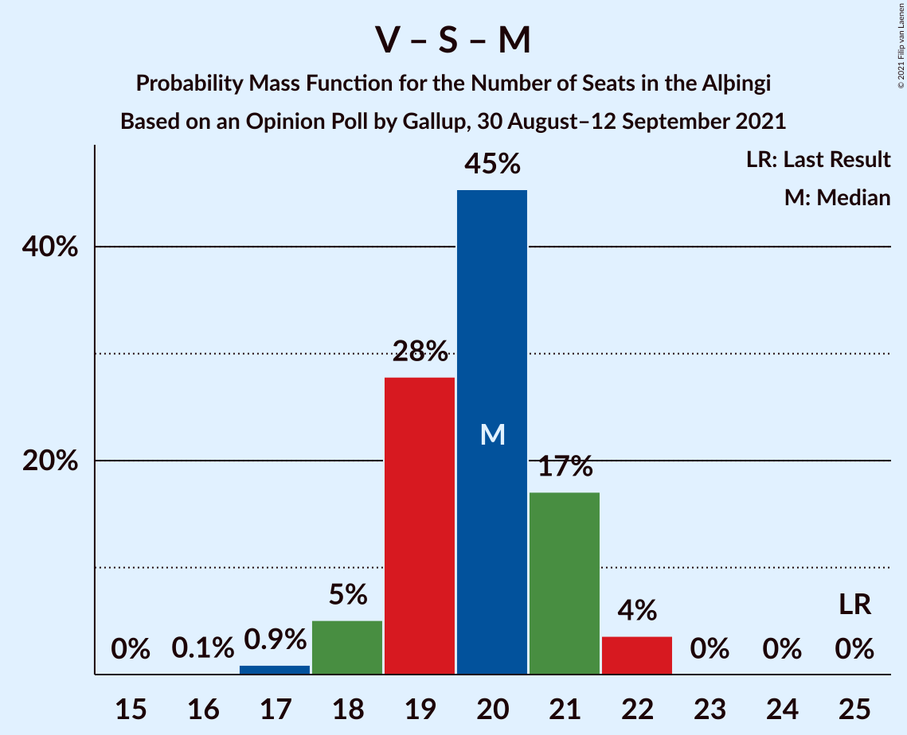

# Opinion Poll by Gallup, 30 August–12 September 2021

<a href="#voting-intentions">Voting Intentions</a> | <a href="#seats">Seats</a> | <a href="#coalitions">Coalitions</a> | <a href="#technical-information">Technical Information</a>

## Voting Intentions

### Confidence Intervals

| Party | Last Result | Poll Result | 80% Confidence Interval | 90% Confidence Interval | 95% Confidence Interval | 99% Confidence Interval |
|:-----:|:-----------:|:-----------:|:-----------------------:|:-----------------------:|:-----------------------:|:-----------------------:|
| Sjálfstæðisflokkurinn | 25.2% | 22.0% | 21.0–23.0% |20.8–23.3% |20.5–23.5% |20.1–24.0% |
| Framsóknarflokkurinn | 10.7% | 12.9% | 12.1–13.7% |11.9–13.9% |11.7–14.1% |11.4–14.5% |
| Vinstrihreyfingin – grænt framboð | 16.9% | 11.8% | 11.1–12.6% |10.9–12.8% |10.7–13.0% |10.3–13.4% |
| Samfylkingin | 12.1% | 11.0% | 10.3–11.8% |10.1–12.0% |9.9–12.2% |9.6–12.6% |
| Píratar | 9.2% | 11.0% | 10.3–11.8% |10.1–12.0% |9.9–12.2% |9.6–12.6% |
| Viðreisn | 6.7% | 9.9% | 9.2–10.6% |9.1–10.9% |8.9–11.0% |8.6–11.4% |
| Sósíalistaflokkur Íslands | 0.0% | 7.8% | 7.2–8.5% |7.0–8.6% |6.9–8.8% |6.6–9.1% |
| Miðflokkurinn | 10.9% | 7.6% | 7.0–8.2% |6.8–8.4% |6.7–8.6% |6.4–8.9% |
| Flokkur fólksins | 6.9% | 4.9% | 4.4–5.5% |4.3–5.6% |4.2–5.7% |4.0–6.0% |

*Note:* The poll result column reflects the actual value used in the calculations. Published results may vary slightly, and in addition be rounded to fewer digits.

## Seats

### Confidence Intervals

| Party | Last Result | Median | 80% Confidence Interval | 90% Confidence Interval | 95% Confidence Interval | 99% Confidence Interval |
|:-----:|:-----------:|:------:|:-----------------------:|:-----------------------:|:-----------------------:|:-----------------------:|
| <a href="#sjálfstæðisflokkurinn">Sjálfstæðisflokkurinn</a> | 16 | 15 | 13–16 |13–17 |13–17 |13–17 |
| <a href="#framsóknarflokkurinn">Framsóknarflokkurinn</a> | 8 | 9 | 8–9 |8–10 |8–11 |8–11 |
| <a href="#vinstrihreyfingin-–-grænt-framboð">Vinstrihreyfingin – grænt framboð</a> | 11 | 8 | 7–9 |7–9 |6–9 |6–9 |
| <a href="#samfylkingin">Samfylkingin</a> | 7 | 7 | 6–7 |6–8 |6–8 |6–8 |
| <a href="#píratar">Píratar</a> | 6 | 7 | 6–8 |6–8 |6–8 |6–9 |
| <a href="#viðreisn">Viðreisn</a> | 4 | 6 | 6–7 |6–7 |6–7 |5–7 |
| <a href="#sósíalistaflokkur-íslands">Sósíalistaflokkur Íslands</a> | 0 | 5 | 4–5 |4–6 |4–6 |4–6 |
| <a href="#miðflokkurinn">Miðflokkurinn</a> | 7 | 5 | 5 |4–6 |4–6 |4–6 |
| <a href="#flokkur-fólksins">Flokkur fólksins</a> | 4 | 0 | 0–3 |0–3 |0–3 |0–3 |

### Sjálfstæðisflokkurinn

*For a full overview of the results for this party, see the [Sjálfstæðisflokkurinn](party-sjálfstæðisflokkurinn.html) page.*

| Number of Seats | Probability | Accumulated | Special Marks |
|:---------------:|:-----------:|:-----------:|:-------------:|
| 13 | 11% | 100% |  |
| 14 | 14% | 89% |  |
| 15 | 56% | 75% | Median |
| 16 | 13% | 19% | Last Result |
| 17 | 6% | 6% |  |
| 18 | 0.3% | 0.3% |  |
| 19 | 0% | 0% |  |

### Framsóknarflokkurinn

*For a full overview of the results for this party, see the [Framsóknarflokkurinn](party-framsóknarflokkurinn.html) page.*

| Number of Seats | Probability | Accumulated | Special Marks |
|:---------------:|:-----------:|:-----------:|:-------------:|
| 8 | 43% | 100% | Last Result |
| 9 | 49% | 57% | Median |
| 10 | 4% | 7% |  |
| 11 | 3% | 3% |  |
| 12 | 0.2% | 0.2% |  |
| 13 | 0% | 0% |  |

### Vinstrihreyfingin – grænt framboð

*For a full overview of the results for this party, see the [Vinstrihreyfingin – grænt framboð](party-vinstrihreyfingin–græntframboð.html) page.*

| Number of Seats | Probability | Accumulated | Special Marks |
|:---------------:|:-----------:|:-----------:|:-------------:|
| 6 | 3% | 100% |  |
| 7 | 15% | 97% |  |
| 8 | 51% | 82% | Median |
| 9 | 31% | 31% |  |
| 10 | 0.1% | 0.1% |  |
| 11 | 0% | 0% | Last Result |

### Samfylkingin

*For a full overview of the results for this party, see the [Samfylkingin](party-samfylkingin.html) page.*

| Number of Seats | Probability | Accumulated | Special Marks |
|:---------------:|:-----------:|:-----------:|:-------------:|
| 6 | 18% | 100% |  |
| 7 | 74% | 82% | Last Result, Median |
| 8 | 8% | 8% |  |
| 9 | 0.2% | 0.2% |  |
| 10 | 0% | 0% |  |

### Píratar

*For a full overview of the results for this party, see the [Píratar](party-píratar.html) page.*

| Number of Seats | Probability | Accumulated | Special Marks |
|:---------------:|:-----------:|:-----------:|:-------------:|
| 6 | 27% | 100% | Last Result |
| 7 | 45% | 73% | Median |
| 8 | 27% | 28% |  |
| 9 | 1.2% | 1.2% |  |
| 10 | 0% | 0% |  |

### Viðreisn

*For a full overview of the results for this party, see the [Viðreisn](party-viðreisn.html) page.*

| Number of Seats | Probability | Accumulated | Special Marks |
|:---------------:|:-----------:|:-----------:|:-------------:|
| 4 | 0% | 100% | Last Result |
| 5 | 0.9% | 100% |  |
| 6 | 77% | 99.1% | Median |
| 7 | 22% | 22% |  |
| 8 | 0.2% | 0.2% |  |
| 9 | 0% | 0% |  |

### Sósíalistaflokkur Íslands

*For a full overview of the results for this party, see the [Sósíalistaflokkur Íslands](party-sósíalistaflokkuríslands.html) page.*

| Number of Seats | Probability | Accumulated | Special Marks |
|:---------------:|:-----------:|:-----------:|:-------------:|
| 0 | 0% | 100% | Last Result |
| 1 | 0% | 100% |  |
| 2 | 0% | 100% |  |
| 3 | 0% | 100% |  |
| 4 | 18% | 100% |  |
| 5 | 77% | 82% | Median |
| 6 | 5% | 5% |  |
| 7 | 0% | 0% |  |

### Miðflokkurinn

*For a full overview of the results for this party, see the [Miðflokkurinn](party-miðflokkurinn.html) page.*

| Number of Seats | Probability | Accumulated | Special Marks |
|:---------------:|:-----------:|:-----------:|:-------------:|
| 4 | 9% | 100% |  |
| 5 | 86% | 91% | Median |
| 6 | 6% | 6% |  |
| 7 | 0% | 0% | Last Result |

### Flokkur fólksins

*For a full overview of the results for this party, see the [Flokkur fólksins](party-flokkurfólksins.html) page.*

| Number of Seats | Probability | Accumulated | Special Marks |
|:---------------:|:-----------:|:-----------:|:-------------:|
| 0 | 55% | 100% | Median |
| 1 | 0% | 45% |  |
| 2 | 0% | 45% |  |
| 3 | 45% | 45% |  |
| 4 | 0.2% | 0.2% | Last Result |
| 5 | 0% | 0% |  |

## Coalitions

### Confidence Intervals

| Coalition | Last Result | Median | Majority? | 80% Confidence Interval | 90% Confidence Interval | 95% Confidence Interval | 99% Confidence Interval |
|:---------:|:-----------:|:------:|:---------:|:-----------------------:|:-----------------------:|:-----------------------:|:-----------------------:|
| Sjálfstæðisflokkurinn – Framsóknarflokkurinn – Vinstrihreyfingin – grænt framboð | 35 | 31 | 50% | 30–33 | 30–33 | 30–33 | 29–34 |
| Sjálfstæðisflokkurinn – Framsóknarflokkurinn – Miðflokkurinn | 31 | 29 | 0% | 27–30 | 27–30 | 27–30 | 26–30 |
| Framsóknarflokkurinn – Vinstrihreyfingin – grænt framboð – Samfylkingin – Miðflokkurinn | 33 | 29 | 0% | 27–30 | 26–30 | 26–30 | 25–31 |
| Vinstrihreyfingin – grænt framboð – Píratar – Samfylkingin – Viðreisn | 28 | 29 | 0% | 27–29 | 25–30 | 25–30 | 25–31 |
| Framsóknarflokkurinn – Vinstrihreyfingin – grænt framboð – Samfylkingin | 26 | 24 | 0% | 23–25 | 21–25 | 21–26 | 20–26 |
| Sjálfstæðisflokkurinn – Framsóknarflokkurinn | 24 | 24 | 0% | 22–25 | 22–25 | 22–25 | 22–26 |
| Sjálfstæðisflokkurinn – Vinstrihreyfingin – grænt framboð | 27 | 23 | 0% | 22–24 | 21–25 | 21–25 | 19–25 |
| Framsóknarflokkurinn – Vinstrihreyfingin – grænt framboð – Miðflokkurinn | 26 | 22 | 0% | 20–23 | 20–23 | 20–23 | 19–24 |
| Sjálfstæðisflokkurinn – Samfylkingin | 23 | 22 | 0% | 20–23 | 20–23 | 20–23 | 20–24 |
| Vinstrihreyfingin – grænt framboð – Píratar – Samfylkingin | 24 | 22 | 0% | 21–23 | 19–23 | 19–23 | 19–24 |
| Sjálfstæðisflokkurinn – Viðreisn | 20 | 21 | 0% | 19–23 | 19–23 | 19–23 | 19–23 |
| Sjálfstæðisflokkurinn – Miðflokkurinn | 23 | 20 | 0% | 18–21 | 18–22 | 18–22 | 17–22 |
| Vinstrihreyfingin – grænt framboð – Samfylkingin – Miðflokkurinn | 25 | 20 | 0% | 19–21 | 18–21 | 18–21 | 17–22 |
| Framsóknarflokkurinn – Vinstrihreyfingin – grænt framboð | 19 | 17 | 0% | 16–18 | 15–18 | 15–18 | 14–19 |
| Vinstrihreyfingin – grænt framboð – Píratar | 17 | 15 | 0% | 14–16 | 13–16 | 13–17 | 13–17 |
| Vinstrihreyfingin – grænt framboð – Samfylkingin | 18 | 15 | 0% | 14–16 | 13–16 | 13–16 | 12–17 |
| Vinstrihreyfingin – grænt framboð – Miðflokkurinn | 18 | 13 | 0% | 12–14 | 12–14 | 11–14 | 10–14 |

### Sjálfstæðisflokkurinn – Framsóknarflokkurinn – Vinstrihreyfingin – grænt framboð

| Number of Seats | Probability | Accumulated | Special Marks |
|:---------------:|:-----------:|:-----------:|:-------------:|
| 29 | 0.9% | 100% |  |
| 30 | 11% | 99.1% |  |
| 31 | 39% | 88% |  |
| 32 | 22% | 50% | Median, Majority |
| 33 | 27% | 28% |  |
| 34 | 1.2% | 1.2% |  |
| 35 | 0% | 0% | Last Result |

### Sjálfstæðisflokkurinn – Framsóknarflokkurinn – Miðflokkurinn

| Number of Seats | Probability | Accumulated | Special Marks |
|:---------------:|:-----------:|:-----------:|:-------------:|
| 26 | 2% | 100% |  |
| 27 | 14% | 98% |  |
| 28 | 29% | 84% |  |
| 29 | 41% | 55% | Median |
| 30 | 14% | 15% |  |
| 31 | 0.4% | 0.5% | Last Result |
| 32 | 0% | 0% | Majority |

### Framsóknarflokkurinn – Vinstrihreyfingin – grænt framboð – Samfylkingin – Miðflokkurinn

| Number of Seats | Probability | Accumulated | Special Marks |
|:---------------:|:-----------:|:-----------:|:-------------:|
| 25 | 1.4% | 100% |  |
| 26 | 5% | 98.6% |  |
| 27 | 5% | 94% |  |
| 28 | 39% | 89% |  |
| 29 | 19% | 50% | Median |
| 30 | 30% | 31% |  |
| 31 | 1.3% | 1.3% |  |
| 32 | 0% | 0% | Majority |
| 33 | 0% | 0% | Last Result |

### Vinstrihreyfingin – grænt framboð – Píratar – Samfylkingin – Viðreisn

| Number of Seats | Probability | Accumulated | Special Marks |
|:---------------:|:-----------:|:-----------:|:-------------:|
| 24 | 0.1% | 100% |  |
| 25 | 6% | 99.9% |  |
| 26 | 0.6% | 94% |  |
| 27 | 21% | 94% |  |
| 28 | 17% | 73% | Last Result, Median |
| 29 | 49% | 56% |  |
| 30 | 6% | 7% |  |
| 31 | 0.7% | 0.7% |  |
| 32 | 0% | 0% | Majority |

### Framsóknarflokkurinn – Vinstrihreyfingin – grænt framboð – Samfylkingin

| Number of Seats | Probability | Accumulated | Special Marks |
|:---------------:|:-----------:|:-----------:|:-------------:|
| 20 | 1.4% | 100% |  |
| 21 | 4% | 98.6% |  |
| 22 | 4% | 94% |  |
| 23 | 37% | 91% |  |
| 24 | 26% | 53% | Median |
| 25 | 25% | 27% |  |
| 26 | 2% | 3% | Last Result |
| 27 | 0.2% | 0.2% |  |
| 28 | 0% | 0% |  |

### Sjálfstæðisflokkurinn – Framsóknarflokkurinn

| Number of Seats | Probability | Accumulated | Special Marks |
|:---------------:|:-----------:|:-----------:|:-------------:|
| 21 | 0.1% | 100% |  |
| 22 | 15% | 99.9% |  |
| 23 | 30% | 85% |  |
| 24 | 40% | 55% | Last Result, Median |
| 25 | 14% | 15% |  |
| 26 | 0.8% | 0.9% |  |
| 27 | 0.1% | 0.1% |  |
| 28 | 0% | 0% |  |

### Sjálfstæðisflokkurinn – Vinstrihreyfingin – grænt framboð

| Number of Seats | Probability | Accumulated | Special Marks |
|:---------------:|:-----------:|:-----------:|:-------------:|
| 19 | 1.0% | 100% |  |
| 20 | 1.3% | 99.0% |  |
| 21 | 3% | 98% |  |
| 22 | 24% | 94% |  |
| 23 | 39% | 70% | Median |
| 24 | 24% | 31% |  |
| 25 | 7% | 7% |  |
| 26 | 0% | 0% |  |
| 27 | 0% | 0% | Last Result |

### Framsóknarflokkurinn – Vinstrihreyfingin – grænt framboð – Miðflokkurinn

| Number of Seats | Probability | Accumulated | Special Marks |
|:---------------:|:-----------:|:-----------:|:-------------:|
| 19 | 2% | 100% |  |
| 20 | 9% | 98% |  |
| 21 | 32% | 89% |  |
| 22 | 29% | 57% | Median |
| 23 | 28% | 29% |  |
| 24 | 0.6% | 0.6% |  |
| 25 | 0.1% | 0.1% |  |
| 26 | 0% | 0% | Last Result |

### Sjálfstæðisflokkurinn – Samfylkingin

| Number of Seats | Probability | Accumulated | Special Marks |
|:---------------:|:-----------:|:-----------:|:-------------:|
| 19 | 0.4% | 100% |  |
| 20 | 13% | 99.6% |  |
| 21 | 21% | 87% |  |
| 22 | 41% | 66% | Median |
| 23 | 24% | 25% | Last Result |
| 24 | 0.4% | 0.8% |  |
| 25 | 0% | 0.3% |  |
| 26 | 0.3% | 0.3% |  |
| 27 | 0% | 0% |  |

### Vinstrihreyfingin – grænt framboð – Píratar – Samfylkingin

| Number of Seats | Probability | Accumulated | Special Marks |
|:---------------:|:-----------:|:-----------:|:-------------:|
| 19 | 5% | 100% |  |
| 20 | 0.8% | 94% |  |
| 21 | 22% | 94% |  |
| 22 | 32% | 72% | Median |
| 23 | 37% | 40% |  |
| 24 | 2% | 2% | Last Result |
| 25 | 0% | 0% |  |

### Sjálfstæðisflokkurinn – Viðreisn

| Number of Seats | Probability | Accumulated | Special Marks |
|:---------------:|:-----------:|:-----------:|:-------------:|
| 18 | 0.3% | 100% |  |
| 19 | 11% | 99.7% |  |
| 20 | 11% | 89% | Last Result |
| 21 | 46% | 78% | Median |
| 22 | 20% | 32% |  |
| 23 | 12% | 12% |  |
| 24 | 0.3% | 0.3% |  |
| 25 | 0% | 0% |  |

### Sjálfstæðisflokkurinn – Miðflokkurinn

| Number of Seats | Probability | Accumulated | Special Marks |
|:---------------:|:-----------:|:-----------:|:-------------:|
| 17 | 2% | 100% |  |
| 18 | 11% | 98% |  |
| 19 | 13% | 87% |  |
| 20 | 54% | 74% | Median |
| 21 | 14% | 20% |  |
| 22 | 6% | 6% |  |
| 23 | 0.1% | 0.1% | Last Result |
| 24 | 0% | 0% |  |

### Vinstrihreyfingin – grænt framboð – Samfylkingin – Miðflokkurinn

| Number of Seats | Probability | Accumulated | Special Marks |
|:---------------:|:-----------:|:-----------:|:-------------:|
| 16 | 0.1% | 100% |  |
| 17 | 2% | 99.9% |  |
| 18 | 5% | 98% |  |
| 19 | 23% | 92% |  |
| 20 | 34% | 69% | Median |
| 21 | 33% | 35% |  |
| 22 | 2% | 2% |  |
| 23 | 0% | 0% |  |
| 24 | 0% | 0% |  |
| 25 | 0% | 0% | Last Result |

### Framsóknarflokkurinn – Vinstrihreyfingin – grænt framboð

| Number of Seats | Probability | Accumulated | Special Marks |
|:---------------:|:-----------:|:-----------:|:-------------:|
| 14 | 1.4% | 100% |  |
| 15 | 8% | 98.6% |  |
| 16 | 32% | 91% |  |
| 17 | 32% | 59% | Median |
| 18 | 26% | 27% |  |
| 19 | 1.2% | 1.4% | Last Result |
| 20 | 0.2% | 0.2% |  |
| 21 | 0% | 0% |  |

### Vinstrihreyfingin – grænt framboð – Píratar

| Number of Seats | Probability | Accumulated | Special Marks |
|:---------------:|:-----------:|:-----------:|:-------------:|
| 12 | 0.1% | 100% |  |
| 13 | 6% | 99.9% |  |
| 14 | 22% | 94% |  |
| 15 | 29% | 72% | Median |
| 16 | 41% | 43% |  |
| 17 | 3% | 3% | Last Result |
| 18 | 0% | 0% |  |

### Vinstrihreyfingin – grænt framboð – Samfylkingin

| Number of Seats | Probability | Accumulated | Special Marks |
|:---------------:|:-----------:|:-----------:|:-------------:|
| 12 | 2% | 100% |  |
| 13 | 5% | 98% |  |
| 14 | 20% | 93% |  |
| 15 | 40% | 74% | Median |
| 16 | 33% | 34% |  |
| 17 | 1.1% | 1.1% |  |
| 18 | 0% | 0% | Last Result |

### Vinstrihreyfingin – grænt framboð – Miðflokkurinn

| Number of Seats | Probability | Accumulated | Special Marks |
|:---------------:|:-----------:|:-----------:|:-------------:|
| 10 | 0.8% | 100% |  |
| 11 | 2% | 99.2% |  |
| 12 | 19% | 97% |  |
| 13 | 44% | 78% | Median |
| 14 | 33% | 33% |  |
| 15 | 0.2% | 0.2% |  |
| 16 | 0% | 0% |  |
| 17 | 0% | 0% |  |
| 18 | 0% | 0% | Last Result |

## Technical Information

### Opinion Poll

+ **Polling firm:** Gallup
+ **Commissioner(s):** —
+ **Fieldwork period:** 30 August–12 September 2021

### Calculations

+ **Sample size:** 2978
+ **Simulations done:** 131,072
+ **Error estimate:** 0.88%

