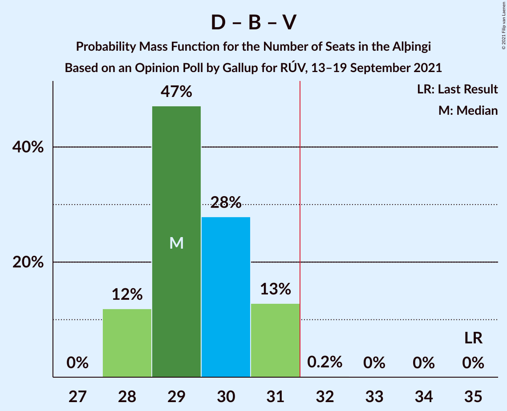

# Opinion Poll by Gallup for RÚV, 13–19 September 2021

<a href="#voting-intentions">Voting Intentions</a> | <a href="#seats">Seats</a> | <a href="#coalitions">Coalitions</a> | <a href="#technical-information">Technical Information</a>

## Voting Intentions

### Confidence Intervals

| Party | Last Result | Poll Result | 80% Confidence Interval | 90% Confidence Interval | 95% Confidence Interval | 99% Confidence Interval |
|:-----:|:-----------:|:-----------:|:-----------------------:|:-----------------------:|:-----------------------:|:-----------------------:|
| Sjálfstæðisflokkurinn | 25.2% | 21.2% | 20.4–22.1% |20.1–22.3% |19.9–22.5% |19.6–22.9% |
| Framsóknarflokkurinn | 10.7% | 13.2% | 12.5–13.9% |12.3–14.1% |12.2–14.3% |11.9–14.7% |
| Samfylkingin | 12.1% | 12.7% | 12.0–13.4% |11.8–13.6% |11.7–13.8% |11.4–14.1% |
| Píratar | 9.2% | 11.5% | 10.9–12.2% |10.7–12.4% |10.5–12.5% |10.2–12.9% |
| Vinstrihreyfingin – grænt framboð | 16.9% | 10.2% | 9.6–10.9% |9.4–11.0% |9.3–11.2% |9.0–11.5% |
| Viðreisn | 6.7% | 10.2% | 9.6–10.9% |9.4–11.0% |9.3–11.2% |9.0–11.5% |
| Sósíalistaflokkur Íslands | 0.0% | 7.3% | 6.8–7.9% |6.6–8.0% |6.5–8.2% |6.3–8.4% |
| Flokkur fólksins | 6.9% | 7.0% | 6.5–7.6% |6.4–7.7% |6.2–7.8% |6.0–8.1% |
| Miðflokkurinn | 10.9% | 6.2% | 5.7–6.7% |5.6–6.9% |5.5–7.0% |5.3–7.3% |

*Note:* The poll result column reflects the actual value used in the calculations. Published results may vary slightly, and in addition be rounded to fewer digits.

## Seats

### Confidence Intervals

| Party | Last Result | Median | 80% Confidence Interval | 90% Confidence Interval | 95% Confidence Interval | 99% Confidence Interval |
|:-----:|:-----------:|:------:|:-----------------------:|:-----------------------:|:-----------------------:|:-----------------------:|
| <a href="#sjálfstæðisflokkurinn">Sjálfstæðisflokkurinn</a> | 16 | 14 | 13–14 |13–14 |13–15 |13–15 |
| <a href="#framsóknarflokkurinn">Framsóknarflokkurinn</a> | 8 | 9 | 9–10 |9–10 |8–11 |8–11 |
| <a href="#samfylkingin">Samfylkingin</a> | 7 | 8 | 8 |7–9 |7–9 |7–9 |
| <a href="#píratar">Píratar</a> | 6 | 7 | 7–8 |7–8 |6–8 |6–8 |
| <a href="#vinstrihreyfingin-–-grænt-framboð">Vinstrihreyfingin – grænt framboð</a> | 11 | 6 | 6–7 |6–7 |6–7 |6–7 |
| <a href="#viðreisn">Viðreisn</a> | 4 | 6 | 6–7 |6–7 |6–7 |5–7 |
| <a href="#sósíalistaflokkur-íslands">Sósíalistaflokkur Íslands</a> | 0 | 4 | 4–5 |4–5 |4–5 |4–5 |
| <a href="#flokkur-fólksins">Flokkur fólksins</a> | 4 | 4 | 4–5 |4–5 |4–5 |3–5 |
| <a href="#miðflokkurinn">Miðflokkurinn</a> | 7 | 4 | 3–4 |3–4 |3–4 |3–4 |

### Sjálfstæðisflokkurinn

*For a full overview of the results for this party, see the [Sjálfstæðisflokkurinn](party-sjálfstæðisflokkurinn.html) page.*

| Number of Seats | Probability | Accumulated | Special Marks |
|:---------------:|:-----------:|:-----------:|:-------------:|
| 13 | 30% | 100% |  |
| 14 | 66% | 70% | Median |
| 15 | 4% | 4% |  |
| 16 | 0.1% | 0.2% | Last Result |
| 17 | 0% | 0% |  |

### Framsóknarflokkurinn

*For a full overview of the results for this party, see the [Framsóknarflokkurinn](party-framsóknarflokkurinn.html) page.*

| Number of Seats | Probability | Accumulated | Special Marks |
|:---------------:|:-----------:|:-----------:|:-------------:|
| 8 | 4% | 100% | Last Result |
| 9 | 66% | 96% | Median |
| 10 | 26% | 30% |  |
| 11 | 4% | 5% |  |
| 12 | 0.4% | 0.4% |  |
| 13 | 0% | 0% |  |

### Samfylkingin

*For a full overview of the results for this party, see the [Samfylkingin](party-samfylkingin.html) page.*

| Number of Seats | Probability | Accumulated | Special Marks |
|:---------------:|:-----------:|:-----------:|:-------------:|
| 7 | 8% | 100% | Last Result |
| 8 | 86% | 92% | Median |
| 9 | 6% | 7% |  |
| 10 | 0.2% | 0.2% |  |
| 11 | 0% | 0% |  |

### Píratar

*For a full overview of the results for this party, see the [Píratar](party-píratar.html) page.*

| Number of Seats | Probability | Accumulated | Special Marks |
|:---------------:|:-----------:|:-----------:|:-------------:|
| 6 | 3% | 100% | Last Result |
| 7 | 73% | 97% | Median |
| 8 | 24% | 24% |  |
| 9 | 0% | 0% |  |

### Vinstrihreyfingin – grænt framboð

*For a full overview of the results for this party, see the [Vinstrihreyfingin – grænt framboð](party-vinstrihreyfingin–græntframboð.html) page.*

| Number of Seats | Probability | Accumulated | Special Marks |
|:---------------:|:-----------:|:-----------:|:-------------:|
| 5 | 0.5% | 100% |  |
| 6 | 62% | 99.5% | Median |
| 7 | 37% | 37% |  |
| 8 | 0.2% | 0.2% |  |
| 9 | 0% | 0% |  |
| 10 | 0% | 0% |  |
| 11 | 0% | 0% | Last Result |

### Viðreisn

*For a full overview of the results for this party, see the [Viðreisn](party-viðreisn.html) page.*

| Number of Seats | Probability | Accumulated | Special Marks |
|:---------------:|:-----------:|:-----------:|:-------------:|
| 4 | 0% | 100% | Last Result |
| 5 | 0.6% | 100% |  |
| 6 | 73% | 99.4% | Median |
| 7 | 27% | 27% |  |
| 8 | 0% | 0% |  |

### Sósíalistaflokkur Íslands

*For a full overview of the results for this party, see the [Sósíalistaflokkur Íslands](party-sósíalistaflokkuríslands.html) page.*

| Number of Seats | Probability | Accumulated | Special Marks |
|:---------------:|:-----------:|:-----------:|:-------------:|
| 0 | 0% | 100% | Last Result |
| 1 | 0% | 100% |  |
| 2 | 0% | 100% |  |
| 3 | 0.1% | 100% |  |
| 4 | 74% | 99.9% | Median |
| 5 | 26% | 26% |  |
| 6 | 0% | 0% |  |

### Flokkur fólksins

*For a full overview of the results for this party, see the [Flokkur fólksins](party-flokkurfólksins.html) page.*

| Number of Seats | Probability | Accumulated | Special Marks |
|:---------------:|:-----------:|:-----------:|:-------------:|
| 3 | 0.8% | 100% |  |
| 4 | 82% | 99.2% | Last Result, Median |
| 5 | 17% | 17% |  |
| 6 | 0% | 0% |  |

### Miðflokkurinn

*For a full overview of the results for this party, see the [Miðflokkurinn](party-miðflokkurinn.html) page.*

| Number of Seats | Probability | Accumulated | Special Marks |
|:---------------:|:-----------:|:-----------:|:-------------:|
| 3 | 32% | 100% |  |
| 4 | 68% | 68% | Median |
| 5 | 0.1% | 0.1% |  |
| 6 | 0% | 0% |  |
| 7 | 0% | 0% | Last Result |

## Coalitions

### Confidence Intervals

| Coalition | Last Result | Median | Majority? | 80% Confidence Interval | 90% Confidence Interval | 95% Confidence Interval | 99% Confidence Interval |
|:---------:|:-----------:|:------:|:---------:|:-----------------------:|:-----------------------:|:-----------------------:|:-----------------------:|
| Sjálfstæðisflokkurinn – Framsóknarflokkurinn – Vinstrihreyfingin – grænt framboð | 35 | 29 | 0.2% | 28–31 | 28–31 | 28–31 | 28–31 |
| Samfylkingin – Píratar – Vinstrihreyfingin – grænt framboð – Viðreisn | 28 | 28 | 0% | 27–29 | 27–29 | 27–29 | 26–30 |
| Framsóknarflokkurinn – Samfylkingin – Vinstrihreyfingin – grænt framboð – Miðflokkurinn | 33 | 27 | 0% | 26–28 | 26–29 | 26–29 | 25–29 |
| Sjálfstæðisflokkurinn – Framsóknarflokkurinn – Miðflokkurinn | 31 | 27 | 0% | 26–28 | 26–28 | 25–28 | 25–29 |
| Framsóknarflokkurinn – Samfylkingin – Vinstrihreyfingin – grænt framboð | 26 | 24 | 0% | 23–25 | 22–25 | 22–25 | 22–26 |
| Sjálfstæðisflokkurinn – Framsóknarflokkurinn | 24 | 23 | 0% | 22–24 | 22–24 | 22–25 | 22–25 |
| Sjálfstæðisflokkurinn – Samfylkingin | 23 | 22 | 0% | 21–22 | 21–23 | 21–23 | 20–23 |
| Samfylkingin – Píratar – Vinstrihreyfingin – grænt framboð | 24 | 22 | 0% | 21–22 | 21–23 | 20–23 | 20–23 |
| Sjálfstæðisflokkurinn – Vinstrihreyfingin – grænt framboð | 27 | 20 | 0% | 19–21 | 19–21 | 19–21 | 19–22 |
| Sjálfstæðisflokkurinn – Viðreisn | 20 | 20 | 0% | 19–21 | 19–21 | 19–21 | 19–22 |
| Framsóknarflokkurinn – Vinstrihreyfingin – grænt framboð – Miðflokkurinn | 26 | 19 | 0% | 19–20 | 18–20 | 18–21 | 17–21 |
| Samfylkingin – Vinstrihreyfingin – grænt framboð – Miðflokkurinn | 25 | 18 | 0% | 17–19 | 17–19 | 17–19 | 16–20 |
| Sjálfstæðisflokkurinn – Miðflokkurinn | 23 | 17 | 0% | 17–18 | 16–18 | 16–18 | 16–19 |
| Framsóknarflokkurinn – Vinstrihreyfingin – grænt framboð | 19 | 16 | 0% | 15–17 | 15–17 | 14–17 | 14–18 |
| Píratar – Vinstrihreyfingin – grænt framboð | 17 | 14 | 0% | 13–14 | 13–14 | 13–15 | 12–15 |
| Samfylkingin – Vinstrihreyfingin – grænt framboð | 18 | 14 | 0% | 14–15 | 14–15 | 13–15 | 13–16 |
| Vinstrihreyfingin – grænt framboð – Miðflokkurinn | 18 | 10 | 0% | 9–11 | 9–11 | 9–11 | 9–11 |

### Sjálfstæðisflokkurinn – Framsóknarflokkurinn – Vinstrihreyfingin – grænt framboð

| Number of Seats | Probability | Accumulated | Special Marks |
|:---------------:|:-----------:|:-----------:|:-------------:|
| 28 | 12% | 100% |  |
| 29 | 47% | 88% | Median |
| 30 | 28% | 41% |  |
| 31 | 13% | 13% |  |
| 32 | 0.2% | 0.2% | Majority |
| 33 | 0% | 0% |  |
| 34 | 0% | 0% |  |
| 35 | 0% | 0% | Last Result |

### Samfylkingin – Píratar – Vinstrihreyfingin – grænt framboð – Viðreisn

| Number of Seats | Probability | Accumulated | Special Marks |
|:---------------:|:-----------:|:-----------:|:-------------:|
| 25 | 0.1% | 100% |  |
| 26 | 1.5% | 99.9% |  |
| 27 | 28% | 98% | Median |
| 28 | 57% | 71% | Last Result |
| 29 | 13% | 14% |  |
| 30 | 1.1% | 1.1% |  |
| 31 | 0% | 0% |  |

### Framsóknarflokkurinn – Samfylkingin – Vinstrihreyfingin – grænt framboð – Miðflokkurinn

| Number of Seats | Probability | Accumulated | Special Marks |
|:---------------:|:-----------:|:-----------:|:-------------:|
| 25 | 1.4% | 100% |  |
| 26 | 10% | 98.6% |  |
| 27 | 45% | 89% | Median |
| 28 | 38% | 43% |  |
| 29 | 5% | 6% |  |
| 30 | 0.2% | 0.2% |  |
| 31 | 0% | 0% |  |
| 32 | 0% | 0% | Majority |
| 33 | 0% | 0% | Last Result |

### Sjálfstæðisflokkurinn – Framsóknarflokkurinn – Miðflokkurinn

| Number of Seats | Probability | Accumulated | Special Marks |
|:---------------:|:-----------:|:-----------:|:-------------:|
| 25 | 3% | 100% |  |
| 26 | 31% | 97% |  |
| 27 | 55% | 66% | Median |
| 28 | 10% | 11% |  |
| 29 | 0.8% | 0.8% |  |
| 30 | 0% | 0% |  |
| 31 | 0% | 0% | Last Result |

### Framsóknarflokkurinn – Samfylkingin – Vinstrihreyfingin – grænt framboð

| Number of Seats | Probability | Accumulated | Special Marks |
|:---------------:|:-----------:|:-----------:|:-------------:|
| 21 | 0.1% | 100% |  |
| 22 | 5% | 99.9% |  |
| 23 | 39% | 95% | Median |
| 24 | 39% | 55% |  |
| 25 | 16% | 17% |  |
| 26 | 0.9% | 0.9% | Last Result |
| 27 | 0% | 0% |  |

### Sjálfstæðisflokkurinn – Framsóknarflokkurinn

| Number of Seats | Probability | Accumulated | Special Marks |
|:---------------:|:-----------:|:-----------:|:-------------:|
| 22 | 23% | 100% |  |
| 23 | 53% | 77% | Median |
| 24 | 21% | 24% | Last Result |
| 25 | 4% | 4% |  |
| 26 | 0.2% | 0.2% |  |
| 27 | 0% | 0% |  |

### Sjálfstæðisflokkurinn – Samfylkingin

| Number of Seats | Probability | Accumulated | Special Marks |
|:---------------:|:-----------:|:-----------:|:-------------:|
| 20 | 1.3% | 100% |  |
| 21 | 30% | 98.7% |  |
| 22 | 64% | 69% | Median |
| 23 | 5% | 5% | Last Result |
| 24 | 0.2% | 0.3% |  |
| 25 | 0% | 0% |  |

### Samfylkingin – Píratar – Vinstrihreyfingin – grænt framboð

| Number of Seats | Probability | Accumulated | Special Marks |
|:---------------:|:-----------:|:-----------:|:-------------:|
| 19 | 0.1% | 100% |  |
| 20 | 3% | 99.9% |  |
| 21 | 43% | 97% | Median |
| 22 | 48% | 54% |  |
| 23 | 6% | 6% |  |
| 24 | 0.1% | 0.1% | Last Result |
| 25 | 0% | 0% |  |

### Sjálfstæðisflokkurinn – Vinstrihreyfingin – grænt framboð

| Number of Seats | Probability | Accumulated | Special Marks |
|:---------------:|:-----------:|:-----------:|:-------------:|
| 18 | 0.1% | 100% |  |
| 19 | 16% | 99.9% |  |
| 20 | 59% | 84% | Median |
| 21 | 25% | 26% |  |
| 22 | 1.0% | 1.0% |  |
| 23 | 0% | 0% |  |
| 24 | 0% | 0% |  |
| 25 | 0% | 0% |  |
| 26 | 0% | 0% |  |
| 27 | 0% | 0% | Last Result |

### Sjálfstæðisflokkurinn – Viðreisn

| Number of Seats | Probability | Accumulated | Special Marks |
|:---------------:|:-----------:|:-----------:|:-------------:|
| 18 | 0.2% | 100% |  |
| 19 | 21% | 99.8% |  |
| 20 | 59% | 79% | Last Result, Median |
| 21 | 18% | 20% |  |
| 22 | 2% | 2% |  |
| 23 | 0% | 0% |  |

### Framsóknarflokkurinn – Vinstrihreyfingin – grænt framboð – Miðflokkurinn

| Number of Seats | Probability | Accumulated | Special Marks |
|:---------------:|:-----------:|:-----------:|:-------------:|
| 17 | 1.3% | 100% |  |
| 18 | 7% | 98.7% |  |
| 19 | 49% | 91% | Median |
| 20 | 37% | 42% |  |
| 21 | 5% | 5% |  |
| 22 | 0.2% | 0.2% |  |
| 23 | 0% | 0% |  |
| 24 | 0% | 0% |  |
| 25 | 0% | 0% |  |
| 26 | 0% | 0% | Last Result |

### Samfylkingin – Vinstrihreyfingin – grænt framboð – Miðflokkurinn

| Number of Seats | Probability | Accumulated | Special Marks |
|:---------------:|:-----------:|:-----------:|:-------------:|
| 16 | 1.1% | 100% |  |
| 17 | 19% | 98.9% |  |
| 18 | 55% | 80% | Median |
| 19 | 24% | 25% |  |
| 20 | 1.2% | 1.2% |  |
| 21 | 0% | 0% |  |
| 22 | 0% | 0% |  |
| 23 | 0% | 0% |  |
| 24 | 0% | 0% |  |
| 25 | 0% | 0% | Last Result |

### Sjálfstæðisflokkurinn – Miðflokkurinn

| Number of Seats | Probability | Accumulated | Special Marks |
|:---------------:|:-----------:|:-----------:|:-------------:|
| 16 | 7% | 100% |  |
| 17 | 46% | 93% |  |
| 18 | 45% | 47% | Median |
| 19 | 2% | 2% |  |
| 20 | 0.1% | 0.1% |  |
| 21 | 0% | 0% |  |
| 22 | 0% | 0% |  |
| 23 | 0% | 0% | Last Result |

### Framsóknarflokkurinn – Vinstrihreyfingin – grænt framboð

| Number of Seats | Probability | Accumulated | Special Marks |
|:---------------:|:-----------:|:-----------:|:-------------:|
| 14 | 3% | 100% |  |
| 15 | 43% | 97% | Median |
| 16 | 37% | 54% |  |
| 17 | 16% | 17% |  |
| 18 | 0.7% | 0.7% |  |
| 19 | 0% | 0% | Last Result |

### Píratar – Vinstrihreyfingin – grænt framboð

| Number of Seats | Probability | Accumulated | Special Marks |
|:---------------:|:-----------:|:-----------:|:-------------:|
| 12 | 1.1% | 100% |  |
| 13 | 44% | 98.9% | Median |
| 14 | 50% | 55% |  |
| 15 | 5% | 5% |  |
| 16 | 0% | 0% |  |
| 17 | 0% | 0% | Last Result |

### Samfylkingin – Vinstrihreyfingin – grænt framboð

| Number of Seats | Probability | Accumulated | Special Marks |
|:---------------:|:-----------:|:-----------:|:-------------:|
| 13 | 5% | 100% |  |
| 14 | 56% | 95% | Median |
| 15 | 38% | 39% |  |
| 16 | 2% | 2% |  |
| 17 | 0% | 0% |  |
| 18 | 0% | 0% | Last Result |

### Vinstrihreyfingin – grænt framboð – Miðflokkurinn

| Number of Seats | Probability | Accumulated | Special Marks |
|:---------------:|:-----------:|:-----------:|:-------------:|
| 8 | 0.1% | 100% |  |
| 9 | 16% | 99.8% |  |
| 10 | 61% | 83% | Median |
| 11 | 22% | 22% |  |
| 12 | 0.1% | 0.1% |  |
| 13 | 0% | 0% |  |
| 14 | 0% | 0% |  |
| 15 | 0% | 0% |  |
| 16 | 0% | 0% |  |
| 17 | 0% | 0% |  |
| 18 | 0% | 0% | Last Result |

## Technical Information

### Opinion Poll

+ **Polling firm:** Gallup
+ **Commissioner(s):** RÚV
+ **Fieldwork period:** 13–19 September 2021

### Calculations

+ **Sample size:** 3845
+ **Simulations done:** 1,048,576
+ **Error estimate:** 1.22%

