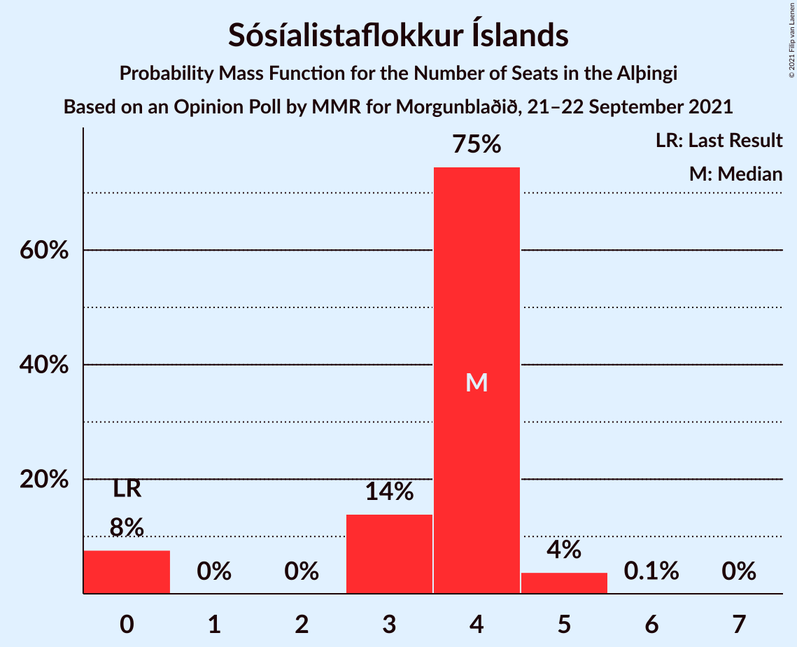
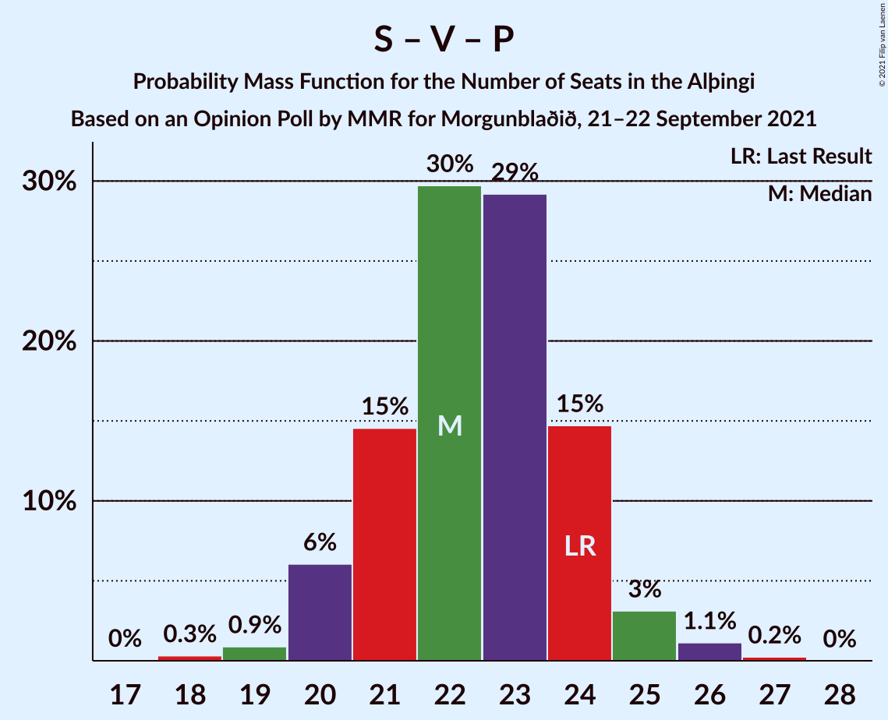

# Opinion Poll by MMR for Morgunblaðið, 21–22 September 2021

<a href="#voting-intentions">Voting Intentions</a> | <a href="#seats">Seats</a> | <a href="#coalitions">Coalitions</a> | <a href="#technical-information">Technical Information</a>

## Voting Intentions

### Confidence Intervals

| Party | Last Result | Poll Result | 80% Confidence Interval | 90% Confidence Interval | 95% Confidence Interval | 99% Confidence Interval |
|:-----:|:-----------:|:-----------:|:-----------------------:|:-----------------------:|:-----------------------:|:-----------------------:|
| Sjálfstæðisflokkurinn | 25.2% | 21.8% | 20.1–23.6% |19.6–24.1% |19.2–24.6% |18.4–25.5% |
| Framsóknarflokkurinn | 10.7% | 14.3% | 12.9–15.9% |12.5–16.3% |12.2–16.7% |11.5–17.5% |
| Samfylkingin | 12.1% | 13.9% | 12.5–15.4% |12.1–15.9% |11.8–16.3% |11.1–17.0% |
| Vinstrihreyfingin – grænt framboð | 16.9% | 11.0% | 9.8–12.4% |9.4–12.8% |9.1–13.2% |8.6–13.9% |
| Píratar | 9.2% | 10.7% | 9.4–12.1% |9.1–12.5% |8.8–12.8% |8.3–13.6% |
| Viðreisn | 6.7% | 10.1% | 8.9–11.5% |8.6–11.9% |8.3–12.3% |7.8–13.0% |
| Flokkur fólksins | 6.9% | 7.3% | 6.3–8.5% |6.0–8.8% |5.7–9.1% |5.3–9.8% |
| Sósíalistaflokkur Íslands | 0.0% | 6.1% | 5.2–7.2% |4.9–7.5% |4.7–7.8% |4.3–8.4% |
| Miðflokkurinn | 10.9% | 4.7% | 3.9–5.8% |3.7–6.1% |3.5–6.3% |3.2–6.8% |

*Note:* The poll result column reflects the actual value used in the calculations. Published results may vary slightly, and in addition be rounded to fewer digits.

## Seats

### Confidence Intervals

| Party | Last Result | Median | 80% Confidence Interval | 90% Confidence Interval | 95% Confidence Interval | 99% Confidence Interval |
|:-----:|:-----------:|:------:|:-----------------------:|:-----------------------:|:-----------------------:|:-----------------------:|
| <a href="#sjálfstæðisflokkurinn">Sjálfstæðisflokkurinn</a> | 16 | 14 | 13–16 |13–16 |13–17 |12–18 |
| <a href="#framsóknarflokkurinn">Framsóknarflokkurinn</a> | 8 | 11 | 9–12 |9–12 |8–13 |8–13 |
| <a href="#samfylkingin">Samfylkingin</a> | 7 | 9 | 8–10 |8–10 |7–10 |7–11 |
| <a href="#vinstrihreyfingin-–-grænt-framboð">Vinstrihreyfingin – grænt framboð</a> | 11 | 7 | 6–8 |6–8 |5–9 |5–10 |
| <a href="#píratar">Píratar</a> | 6 | 7 | 6–8 |5–8 |5–8 |5–9 |
| <a href="#viðreisn">Viðreisn</a> | 4 | 6 | 5–7 |5–7 |5–8 |4–8 |
| <a href="#flokkur-fólksins">Flokkur fólksins</a> | 4 | 4 | 3–5 |3–5 |3–6 |3–6 |
| <a href="#sósíalistaflokkur-íslands">Sósíalistaflokkur Íslands</a> | 0 | 4 | 3–4 |0–4 |0–5 |0–5 |
| <a href="#miðflokkurinn">Miðflokkurinn</a> | 7 | 1 | 1–3 |0–3 |0–3 |0–4 |

### Sjálfstæðisflokkurinn

*For a full overview of the results for this party, see the [Sjálfstæðisflokkurinn](party-sjálfstæðisflokkurinn.html) page.*

| Number of Seats | Probability | Accumulated | Special Marks |
|:---------------:|:-----------:|:-----------:|:-------------:|
| 12 | 0.6% | 100% |  |
| 13 | 14% | 99.3% |  |
| 14 | 55% | 85% | Median |
| 15 | 20% | 31% |  |
| 16 | 7% | 11% | Last Result |
| 17 | 2% | 4% |  |
| 18 | 1.5% | 2% |  |
| 19 | 0.4% | 0.4% |  |
| 20 | 0% | 0% |  |

### Framsóknarflokkurinn

*For a full overview of the results for this party, see the [Framsóknarflokkurinn](party-framsóknarflokkurinn.html) page.*

| Number of Seats | Probability | Accumulated | Special Marks |
|:---------------:|:-----------:|:-----------:|:-------------:|
| 8 | 3% | 100% | Last Result |
| 9 | 20% | 97% |  |
| 10 | 22% | 78% |  |
| 11 | 24% | 55% | Median |
| 12 | 28% | 32% |  |
| 13 | 3% | 4% |  |
| 14 | 0.4% | 0.4% |  |
| 15 | 0% | 0% |  |

### Samfylkingin

*For a full overview of the results for this party, see the [Samfylkingin](party-samfylkingin.html) page.*

| Number of Seats | Probability | Accumulated | Special Marks |
|:---------------:|:-----------:|:-----------:|:-------------:|
| 6 | 0.3% | 100% |  |
| 7 | 3% | 99.7% | Last Result |
| 8 | 34% | 97% |  |
| 9 | 31% | 63% | Median |
| 10 | 30% | 32% |  |
| 11 | 2% | 2% |  |
| 12 | 0.4% | 0.5% |  |
| 13 | 0% | 0% |  |

### Vinstrihreyfingin – grænt framboð

*For a full overview of the results for this party, see the [Vinstrihreyfingin – grænt framboð](party-vinstrihreyfingin–græntframboð.html) page.*

| Number of Seats | Probability | Accumulated | Special Marks |
|:---------------:|:-----------:|:-----------:|:-------------:|
| 5 | 3% | 100% |  |
| 6 | 40% | 97% |  |
| 7 | 31% | 57% | Median |
| 8 | 22% | 25% |  |
| 9 | 3% | 4% |  |
| 10 | 0.8% | 0.8% |  |
| 11 | 0% | 0% | Last Result |

### Píratar

*For a full overview of the results for this party, see the [Píratar](party-píratar.html) page.*

| Number of Seats | Probability | Accumulated | Special Marks |
|:---------------:|:-----------:|:-----------:|:-------------:|
| 4 | 0.1% | 100% |  |
| 5 | 8% | 99.9% |  |
| 6 | 35% | 92% | Last Result |
| 7 | 41% | 57% | Median |
| 8 | 15% | 16% |  |
| 9 | 0.5% | 0.6% |  |
| 10 | 0% | 0% |  |

### Viðreisn

*For a full overview of the results for this party, see the [Viðreisn](party-viðreisn.html) page.*

| Number of Seats | Probability | Accumulated | Special Marks |
|:---------------:|:-----------:|:-----------:|:-------------:|
| 4 | 0.7% | 100% | Last Result |
| 5 | 12% | 99.3% |  |
| 6 | 59% | 87% | Median |
| 7 | 23% | 27% |  |
| 8 | 4% | 5% |  |
| 9 | 0.1% | 0.1% |  |
| 10 | 0% | 0% |  |

### Flokkur fólksins

*For a full overview of the results for this party, see the [Flokkur fólksins](party-flokkurfólksins.html) page.*

| Number of Seats | Probability | Accumulated | Special Marks |
|:---------------:|:-----------:|:-----------:|:-------------:|
| 0 | 0.1% | 100% |  |
| 1 | 0% | 99.9% |  |
| 2 | 0% | 99.9% |  |
| 3 | 19% | 99.9% |  |
| 4 | 42% | 81% | Last Result, Median |
| 5 | 35% | 39% |  |
| 6 | 3% | 4% |  |
| 7 | 0.1% | 0.1% |  |
| 8 | 0% | 0% |  |

### Sósíalistaflokkur Íslands

*For a full overview of the results for this party, see the [Sósíalistaflokkur Íslands](party-sósíalistaflokkuríslands.html) page.*

| Number of Seats | Probability | Accumulated | Special Marks |
|:---------------:|:-----------:|:-----------:|:-------------:|
| 0 | 8% | 100% | Last Result |
| 1 | 0% | 92% |  |
| 2 | 0% | 92% |  |
| 3 | 14% | 92% |  |
| 4 | 75% | 78% | Median |
| 5 | 4% | 4% |  |
| 6 | 0.1% | 0.1% |  |
| 7 | 0% | 0% |  |

### Miðflokkurinn

*For a full overview of the results for this party, see the [Miðflokkurinn](party-miðflokkurinn.html) page.*

| Number of Seats | Probability | Accumulated | Special Marks |
|:---------------:|:-----------:|:-----------:|:-------------:|
| 0 | 6% | 100% |  |
| 1 | 63% | 94% | Median |
| 2 | 0.3% | 31% |  |
| 3 | 29% | 31% |  |
| 4 | 2% | 2% |  |
| 5 | 0% | 0% |  |
| 6 | 0% | 0% |  |
| 7 | 0% | 0% | Last Result |

## Coalitions

### Confidence Intervals

| Coalition | Last Result | Median | Majority? | 80% Confidence Interval | 90% Confidence Interval | 95% Confidence Interval | 99% Confidence Interval |
|:---------:|:-----------:|:------:|:---------:|:-----------------------:|:-----------------------:|:-----------------------:|:-----------------------:|
| Sjálfstæðisflokkurinn – Framsóknarflokkurinn – Vinstrihreyfingin – grænt framboð | 35 | 32 | 56% | 30–34 | 30–34 | 29–35 | 28–36 |
| Samfylkingin – Vinstrihreyfingin – grænt framboð – Píratar – Viðreisn | 28 | 29 | 2% | 27–31 | 26–31 | 26–31 | 25–33 |
| Framsóknarflokkurinn – Samfylkingin – Vinstrihreyfingin – grænt framboð – Miðflokkurinn | 33 | 27 | 0.9% | 26–30 | 26–31 | 25–31 | 25–32 |
| Sjálfstæðisflokkurinn – Framsóknarflokkurinn – Miðflokkurinn | 31 | 27 | 0.3% | 25–28 | 24–29 | 24–30 | 23–31 |
| Framsóknarflokkurinn – Samfylkingin – Vinstrihreyfingin – grænt framboð | 26 | 26 | 0% | 24–29 | 24–29 | 24–29 | 23–30 |
| Sjálfstæðisflokkurinn – Framsóknarflokkurinn | 24 | 25 | 0% | 23–27 | 22–27 | 22–28 | 22–30 |
| Sjálfstæðisflokkurinn – Samfylkingin | 23 | 23 | 0% | 22–25 | 22–25 | 21–26 | 20–28 |
| Samfylkingin – Vinstrihreyfingin – grænt framboð – Píratar | 24 | 22 | 0% | 21–24 | 20–24 | 20–25 | 19–26 |
| Sjálfstæðisflokkurinn – Vinstrihreyfingin – grænt framboð | 27 | 21 | 0% | 20–23 | 19–23 | 19–24 | 18–25 |
| Sjálfstæðisflokkurinn – Viðreisn | 20 | 20 | 0% | 19–22 | 19–23 | 19–23 | 18–24 |
| Framsóknarflokkurinn – Vinstrihreyfingin – grænt framboð – Miðflokkurinn | 26 | 19 | 0% | 17–21 | 17–22 | 17–22 | 16–23 |
| Samfylkingin – Vinstrihreyfingin – grænt framboð – Miðflokkurinn | 25 | 17 | 0% | 15–19 | 15–20 | 15–21 | 14–21 |
| Framsóknarflokkurinn – Vinstrihreyfingin – grænt framboð | 19 | 17 | 0% | 16–19 | 16–19 | 15–20 | 14–21 |
| Sjálfstæðisflokkurinn – Miðflokkurinn | 23 | 16 | 0% | 15–18 | 14–18 | 14–19 | 13–21 |
| Samfylkingin – Vinstrihreyfingin – grænt framboð | 18 | 16 | 0% | 14–17 | 14–18 | 14–18 | 13–19 |
| Vinstrihreyfingin – grænt framboð – Píratar | 17 | 13 | 0% | 12–15 | 12–15 | 11–16 | 10–17 |
| Vinstrihreyfingin – grænt framboð – Miðflokkurinn | 18 | 8 | 0% | 7–11 | 7–11 | 6–11 | 6–12 |

### Sjálfstæðisflokkurinn – Framsóknarflokkurinn – Vinstrihreyfingin – grænt framboð

| Number of Seats | Probability | Accumulated | Special Marks |
|:---------------:|:-----------:|:-----------:|:-------------:|
| 27 | 0% | 100% |  |
| 28 | 2% | 99.9% |  |
| 29 | 3% | 98% |  |
| 30 | 13% | 96% |  |
| 31 | 27% | 83% |  |
| 32 | 23% | 56% | Median, Majority |
| 33 | 23% | 33% |  |
| 34 | 6% | 10% |  |
| 35 | 3% | 4% | Last Result |
| 36 | 0.8% | 1.0% |  |
| 37 | 0.2% | 0.2% |  |
| 38 | 0% | 0% |  |

### Samfylkingin – Vinstrihreyfingin – grænt framboð – Píratar – Viðreisn

| Number of Seats | Probability | Accumulated | Special Marks |
|:---------------:|:-----------:|:-----------:|:-------------:|
| 23 | 0.1% | 100% |  |
| 24 | 0.3% | 99.9% |  |
| 25 | 1.3% | 99.6% |  |
| 26 | 6% | 98% |  |
| 27 | 14% | 92% |  |
| 28 | 24% | 79% | Last Result |
| 29 | 31% | 54% | Median |
| 30 | 10% | 23% |  |
| 31 | 11% | 13% |  |
| 32 | 1.4% | 2% | Majority |
| 33 | 0.4% | 0.5% |  |
| 34 | 0.1% | 0.1% |  |
| 35 | 0% | 0% |  |

### Framsóknarflokkurinn – Samfylkingin – Vinstrihreyfingin – grænt framboð – Miðflokkurinn

| Number of Seats | Probability | Accumulated | Special Marks |
|:---------------:|:-----------:|:-----------:|:-------------:|
| 24 | 0.4% | 100% |  |
| 25 | 3% | 99.6% |  |
| 26 | 10% | 96% |  |
| 27 | 37% | 87% |  |
| 28 | 16% | 50% | Median |
| 29 | 7% | 34% |  |
| 30 | 18% | 27% |  |
| 31 | 8% | 9% |  |
| 32 | 0.7% | 0.9% | Majority |
| 33 | 0.2% | 0.2% | Last Result |
| 34 | 0% | 0% |  |

### Sjálfstæðisflokkurinn – Framsóknarflokkurinn – Miðflokkurinn

| Number of Seats | Probability | Accumulated | Special Marks |
|:---------------:|:-----------:|:-----------:|:-------------:|
| 22 | 0.1% | 100% |  |
| 23 | 1.3% | 99.9% |  |
| 24 | 6% | 98.6% |  |
| 25 | 12% | 92% |  |
| 26 | 29% | 80% | Median |
| 27 | 34% | 52% |  |
| 28 | 8% | 17% |  |
| 29 | 5% | 10% |  |
| 30 | 3% | 5% |  |
| 31 | 1.0% | 1.3% | Last Result |
| 32 | 0.2% | 0.3% | Majority |
| 33 | 0.1% | 0.1% |  |
| 34 | 0% | 0% |  |

### Framsóknarflokkurinn – Samfylkingin – Vinstrihreyfingin – grænt framboð

| Number of Seats | Probability | Accumulated | Special Marks |
|:---------------:|:-----------:|:-----------:|:-------------:|
| 22 | 0.2% | 100% |  |
| 23 | 1.0% | 99.8% |  |
| 24 | 12% | 98.7% |  |
| 25 | 13% | 87% |  |
| 26 | 31% | 74% | Last Result |
| 27 | 17% | 43% | Median |
| 28 | 11% | 26% |  |
| 29 | 14% | 15% |  |
| 30 | 0.8% | 1.0% |  |
| 31 | 0.2% | 0.2% |  |
| 32 | 0% | 0% | Majority |

### Sjálfstæðisflokkurinn – Framsóknarflokkurinn

| Number of Seats | Probability | Accumulated | Special Marks |
|:---------------:|:-----------:|:-----------:|:-------------:|
| 21 | 0.2% | 100% |  |
| 22 | 5% | 99.8% |  |
| 23 | 11% | 95% |  |
| 24 | 19% | 84% | Last Result |
| 25 | 28% | 66% | Median |
| 26 | 27% | 37% |  |
| 27 | 7% | 11% |  |
| 28 | 3% | 4% |  |
| 29 | 0.6% | 1.2% |  |
| 30 | 0.6% | 0.6% |  |
| 31 | 0% | 0% |  |

### Sjálfstæðisflokkurinn – Samfylkingin

| Number of Seats | Probability | Accumulated | Special Marks |
|:---------------:|:-----------:|:-----------:|:-------------:|
| 19 | 0.1% | 100% |  |
| 20 | 0.6% | 99.9% |  |
| 21 | 4% | 99.3% |  |
| 22 | 25% | 95% |  |
| 23 | 29% | 70% | Last Result, Median |
| 24 | 26% | 41% |  |
| 25 | 11% | 15% |  |
| 26 | 3% | 4% |  |
| 27 | 0.7% | 1.3% |  |
| 28 | 0.6% | 0.6% |  |
| 29 | 0% | 0% |  |

### Samfylkingin – Vinstrihreyfingin – grænt framboð – Píratar

| Number of Seats | Probability | Accumulated | Special Marks |
|:---------------:|:-----------:|:-----------:|:-------------:|
| 18 | 0.3% | 100% |  |
| 19 | 0.9% | 99.6% |  |
| 20 | 6% | 98.8% |  |
| 21 | 15% | 93% |  |
| 22 | 30% | 78% |  |
| 23 | 29% | 48% | Median |
| 24 | 15% | 19% | Last Result |
| 25 | 3% | 5% |  |
| 26 | 1.1% | 1.4% |  |
| 27 | 0.2% | 0.3% |  |
| 28 | 0% | 0% |  |

### Sjálfstæðisflokkurinn – Vinstrihreyfingin – grænt framboð

| Number of Seats | Probability | Accumulated | Special Marks |
|:---------------:|:-----------:|:-----------:|:-------------:|
| 18 | 0.8% | 100% |  |
| 19 | 5% | 99.2% |  |
| 20 | 32% | 94% |  |
| 21 | 26% | 63% | Median |
| 22 | 18% | 36% |  |
| 23 | 14% | 18% |  |
| 24 | 3% | 4% |  |
| 25 | 1.1% | 1.5% |  |
| 26 | 0.4% | 0.4% |  |
| 27 | 0% | 0% | Last Result |

### Sjálfstæðisflokkurinn – Viðreisn

| Number of Seats | Probability | Accumulated | Special Marks |
|:---------------:|:-----------:|:-----------:|:-------------:|
| 17 | 0.2% | 100% |  |
| 18 | 2% | 99.8% |  |
| 19 | 12% | 98% |  |
| 20 | 48% | 86% | Last Result, Median |
| 21 | 18% | 38% |  |
| 22 | 14% | 20% |  |
| 23 | 4% | 6% |  |
| 24 | 2% | 2% |  |
| 25 | 0.4% | 0.4% |  |
| 26 | 0% | 0% |  |

### Framsóknarflokkurinn – Vinstrihreyfingin – grænt framboð – Miðflokkurinn

| Number of Seats | Probability | Accumulated | Special Marks |
|:---------------:|:-----------:|:-----------:|:-------------:|
| 15 | 0.4% | 100% |  |
| 16 | 0.7% | 99.6% |  |
| 17 | 14% | 98.9% |  |
| 18 | 22% | 85% |  |
| 19 | 25% | 63% | Median |
| 20 | 22% | 38% |  |
| 21 | 10% | 16% |  |
| 22 | 5% | 6% |  |
| 23 | 0.7% | 1.0% |  |
| 24 | 0.2% | 0.3% |  |
| 25 | 0.1% | 0.1% |  |
| 26 | 0% | 0% | Last Result |

### Samfylkingin – Vinstrihreyfingin – grænt framboð – Miðflokkurinn

| Number of Seats | Probability | Accumulated | Special Marks |
|:---------------:|:-----------:|:-----------:|:-------------:|
| 13 | 0.1% | 100% |  |
| 14 | 2% | 99.9% |  |
| 15 | 11% | 98% |  |
| 16 | 18% | 87% |  |
| 17 | 24% | 69% | Median |
| 18 | 23% | 45% |  |
| 19 | 13% | 22% |  |
| 20 | 5% | 10% |  |
| 21 | 4% | 4% |  |
| 22 | 0.3% | 0.3% |  |
| 23 | 0% | 0% |  |
| 24 | 0% | 0% |  |
| 25 | 0% | 0% | Last Result |

### Framsóknarflokkurinn – Vinstrihreyfingin – grænt framboð

| Number of Seats | Probability | Accumulated | Special Marks |
|:---------------:|:-----------:|:-----------:|:-------------:|
| 14 | 2% | 100% |  |
| 15 | 2% | 98% |  |
| 16 | 21% | 96% |  |
| 17 | 27% | 75% |  |
| 18 | 23% | 48% | Median |
| 19 | 21% | 26% | Last Result |
| 20 | 3% | 5% |  |
| 21 | 1.5% | 2% |  |
| 22 | 0.1% | 0.1% |  |
| 23 | 0% | 0% |  |

### Sjálfstæðisflokkurinn – Miðflokkurinn

| Number of Seats | Probability | Accumulated | Special Marks |
|:---------------:|:-----------:|:-----------:|:-------------:|
| 13 | 0.9% | 100% |  |
| 14 | 7% | 99.1% |  |
| 15 | 41% | 92% | Median |
| 16 | 20% | 51% |  |
| 17 | 19% | 31% |  |
| 18 | 9% | 12% |  |
| 19 | 2% | 3% |  |
| 20 | 0.6% | 1.2% |  |
| 21 | 0.5% | 0.6% |  |
| 22 | 0.1% | 0.1% |  |
| 23 | 0% | 0% | Last Result |

### Samfylkingin – Vinstrihreyfingin – grænt framboð

| Number of Seats | Probability | Accumulated | Special Marks |
|:---------------:|:-----------:|:-----------:|:-------------:|
| 12 | 0.4% | 100% |  |
| 13 | 1.2% | 99.6% |  |
| 14 | 20% | 98% |  |
| 15 | 21% | 79% |  |
| 16 | 25% | 58% | Median |
| 17 | 25% | 33% |  |
| 18 | 7% | 8% | Last Result |
| 19 | 1.1% | 1.2% |  |
| 20 | 0.2% | 0.2% |  |
| 21 | 0% | 0% |  |

### Vinstrihreyfingin – grænt framboð – Píratar

| Number of Seats | Probability | Accumulated | Special Marks |
|:---------------:|:-----------:|:-----------:|:-------------:|
| 10 | 1.0% | 100% |  |
| 11 | 2% | 99.0% |  |
| 12 | 12% | 97% |  |
| 13 | 41% | 85% |  |
| 14 | 26% | 44% | Median |
| 15 | 15% | 18% |  |
| 16 | 3% | 4% |  |
| 17 | 0.9% | 1.0% | Last Result |
| 18 | 0% | 0% |  |

### Vinstrihreyfingin – grænt framboð – Miðflokkurinn

| Number of Seats | Probability | Accumulated | Special Marks |
|:---------------:|:-----------:|:-----------:|:-------------:|
| 5 | 0.2% | 100% |  |
| 6 | 3% | 99.8% |  |
| 7 | 26% | 97% |  |
| 8 | 29% | 71% | Median |
| 9 | 24% | 42% |  |
| 10 | 7% | 18% |  |
| 11 | 9% | 11% |  |
| 12 | 2% | 2% |  |
| 13 | 0.3% | 0.3% |  |
| 14 | 0% | 0% |  |
| 15 | 0% | 0% |  |
| 16 | 0% | 0% |  |
| 17 | 0% | 0% |  |
| 18 | 0% | 0% | Last Result |

## Technical Information

### Opinion Poll

+ **Polling firm:** MMR
+ **Commissioner(s):** Morgunblaðið
+ **Fieldwork period:** 21–22 September 2021

### Calculations

+ **Sample size:** 909
+ **Simulations done:** 1,048,576
+ **Error estimate:** 1.39%

