# Opinion Poll by Maskína for Bylgjan, Stöð 2 and Vísir, 15–22 September 2021

<a href="#voting-intentions">Voting Intentions</a> | <a href="#seats">Seats</a> | <a href="#coalitions">Coalitions</a> | <a href="#technical-information">Technical Information</a>

## Voting Intentions

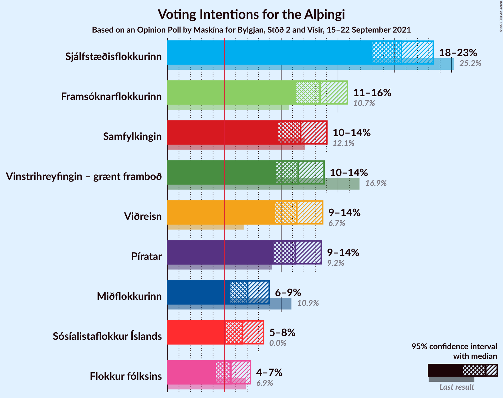

### Confidence Intervals

| Party | Last Result | Poll Result | 80% Confidence Interval | 90% Confidence Interval | 95% Confidence Interval | 99% Confidence Interval |
|:-----:|:-----------:|:-----------:|:-----------------------:|:-----------------------:|:-----------------------:|:-----------------------:|
| Sjálfstæðisflokkurinn | 25.2% | 20.6% | 18.9–22.4% |18.5–22.9% |18.0–23.4% |17.3–24.3% |
| Framsóknarflokkurinn | 10.7% | 13.4% | 12.0–15.0% |11.7–15.5% |11.3–15.8% |10.7–16.6% |
| Samfylkingin | 12.1% | 11.7% | 10.4–13.2% |10.1–13.6% |9.8–14.0% |9.2–14.8% |
| Vinstrihreyfingin – grænt framboð | 16.9% | 11.5% | 10.2–13.0% |9.8–13.4% |9.5–13.8% |9.0–14.5% |
| Viðreisn | 6.7% | 11.4% | 10.1–12.9% |9.7–13.3% |9.4–13.7% |8.9–14.4% |
| Píratar | 9.2% | 11.3% | 10.0–12.7% |9.6–13.2% |9.3–13.5% |8.8–14.3% |
| Miðflokkurinn | 10.9% | 7.1% | 6.1–8.3% |5.8–8.6% |5.5–8.9% |5.1–9.6% |
| Sósíalistaflokkur Íslands | 0.0% | 6.6% | 5.6–7.8% |5.4–8.1% |5.1–8.4% |4.7–9.1% |
| Flokkur fólksins | 6.9% | 5.6% | 4.7–6.7% |4.5–7.0% |4.2–7.3% |3.9–7.9% |

*Note:* The poll result column reflects the actual value used in the calculations. Published results may vary slightly, and in addition be rounded to fewer digits.

## Seats

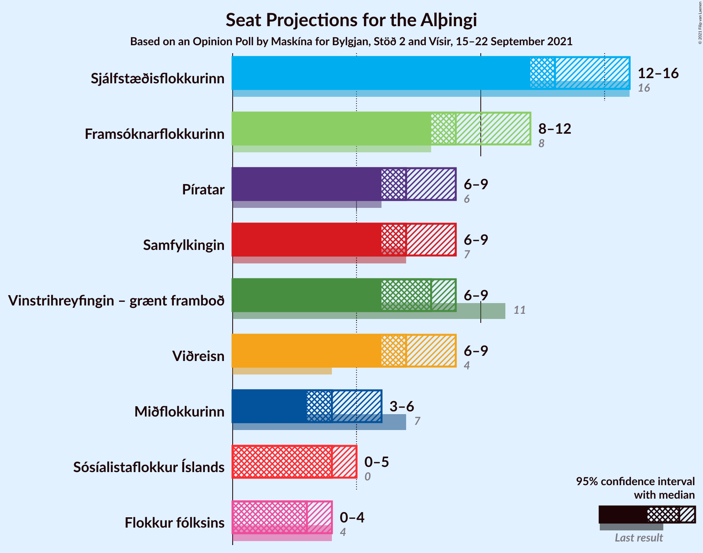

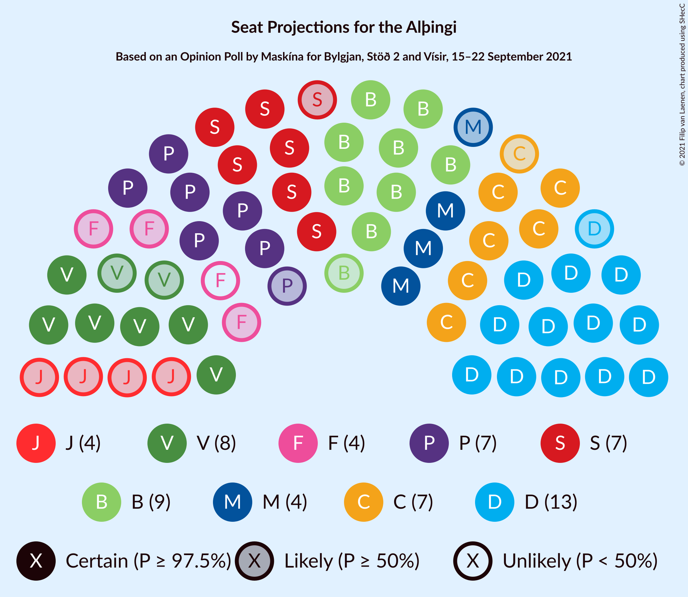

### Confidence Intervals

| Party | Last Result | Median | 80% Confidence Interval | 90% Confidence Interval | 95% Confidence Interval | 99% Confidence Interval |
|:-----:|:-----------:|:------:|:-----------------------:|:-----------------------:|:-----------------------:|:-----------------------:|
| <a href="#sjálfstæðisflokkurinn">Sjálfstæðisflokkurinn</a> | 16 | 13 | 13–15 |13–15 |12–16 |12–18 |
| <a href="#framsóknarflokkurinn">Framsóknarflokkurinn</a> | 8 | 9 | 8–11 |8–12 |8–12 |8–12 |
| <a href="#samfylkingin">Samfylkingin</a> | 7 | 7 | 6–8 |6–9 |6–9 |5–10 |
| <a href="#vinstrihreyfingin-–-grænt-framboð">Vinstrihreyfingin – grænt framboð</a> | 11 | 8 | 6–9 |6–9 |6–9 |5–10 |
| <a href="#viðreisn">Viðreisn</a> | 4 | 7 | 6–8 |6–8 |6–9 |5–9 |
| <a href="#píratar">Píratar</a> | 6 | 7 | 6–8 |6–8 |6–9 |5–9 |
| <a href="#miðflokkurinn">Miðflokkurinn</a> | 7 | 4 | 4–5 |3–5 |3–6 |3–6 |
| <a href="#sósíalistaflokkur-íslands">Sósíalistaflokkur Íslands</a> | 0 | 4 | 3–5 |3–5 |0–5 |0–6 |
| <a href="#flokkur-fólksins">Flokkur fólksins</a> | 4 | 3 | 0–4 |0–4 |0–4 |0–5 |

### Sjálfstæðisflokkurinn

*For a full overview of the results for this party, see the [Sjálfstæðisflokkurinn](party-sjálfstæðisflokkurinn.html) page.*

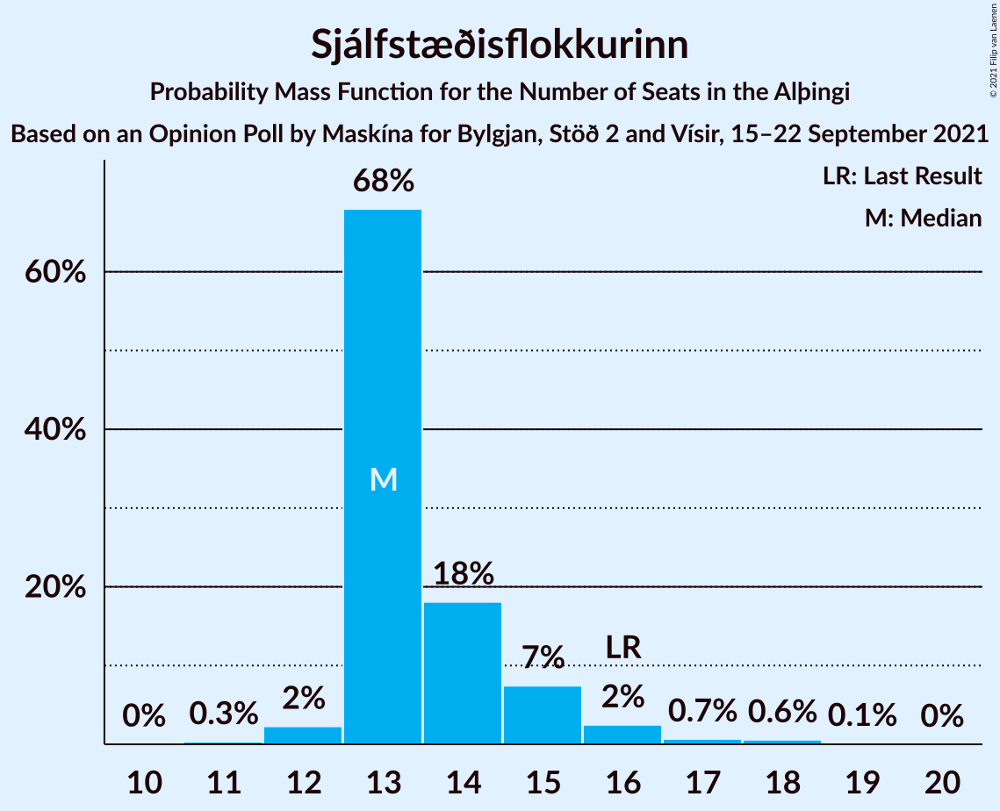

| Number of Seats | Probability | Accumulated | Special Marks |
|:---------------:|:-----------:|:-----------:|:-------------:|
| 11 | 0.3% | 100% |  |
| 12 | 2% | 99.6% |  |
| 13 | 68% | 97% | Median |
| 14 | 18% | 29% |  |
| 15 | 7% | 11% |  |
| 16 | 2% | 4% | Last Result |
| 17 | 0.7% | 1.4% |  |
| 18 | 0.6% | 0.7% |  |
| 19 | 0.1% | 0.1% |  |
| 20 | 0% | 0% |  |

### Framsóknarflokkurinn

*For a full overview of the results for this party, see the [Framsóknarflokkurinn](party-framsóknarflokkurinn.html) page.*

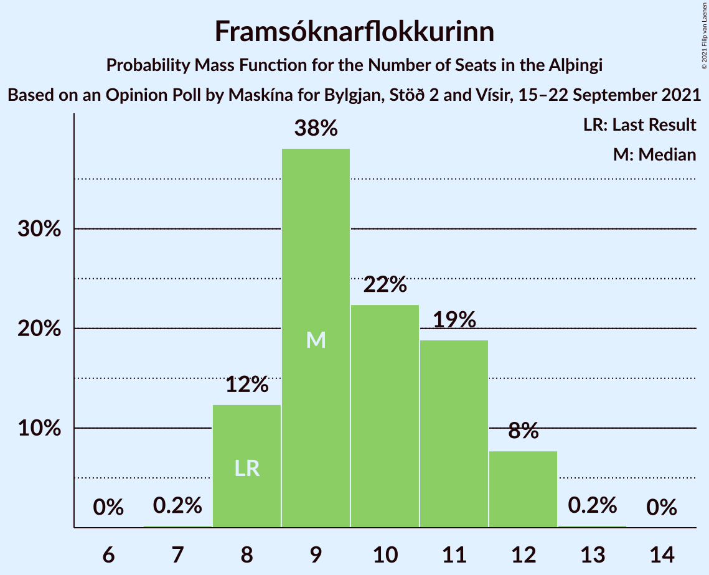

| Number of Seats | Probability | Accumulated | Special Marks |
|:---------------:|:-----------:|:-----------:|:-------------:|
| 7 | 0.2% | 100% |  |
| 8 | 12% | 99.7% | Last Result |
| 9 | 38% | 87% | Median |
| 10 | 22% | 49% |  |
| 11 | 19% | 27% |  |
| 12 | 8% | 8% |  |
| 13 | 0.2% | 0.3% |  |
| 14 | 0% | 0% |  |

### Samfylkingin

*For a full overview of the results for this party, see the [Samfylkingin](party-samfylkingin.html) page.*

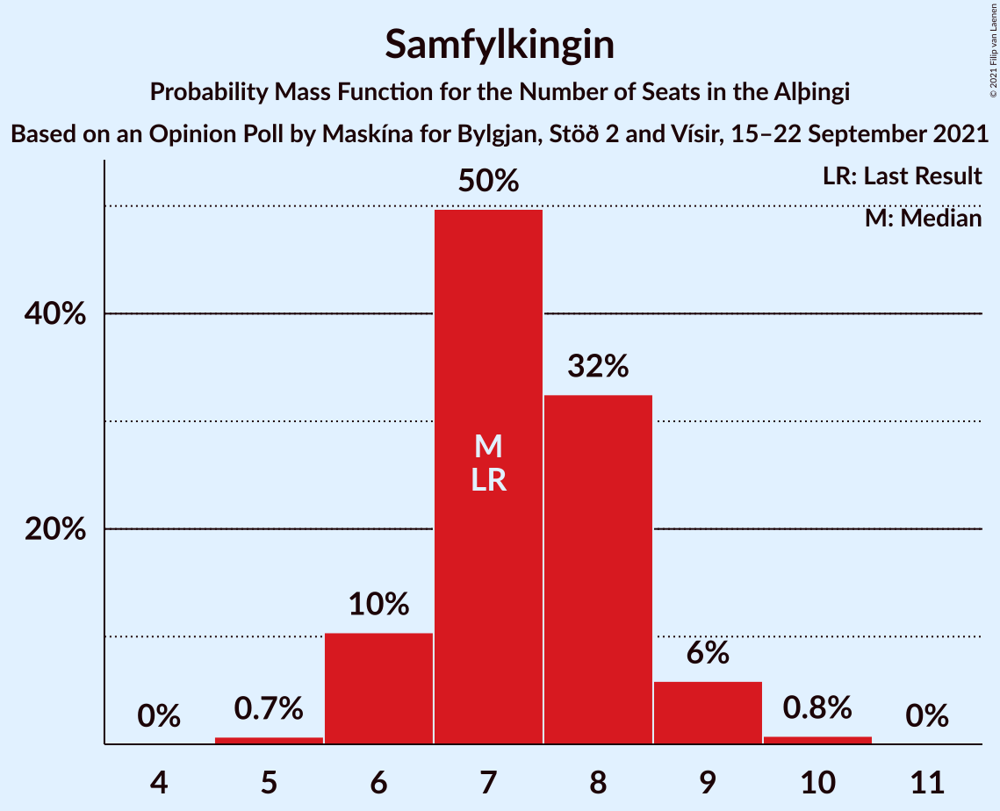

| Number of Seats | Probability | Accumulated | Special Marks |
|:---------------:|:-----------:|:-----------:|:-------------:|
| 5 | 0.7% | 100% |  |
| 6 | 10% | 99.3% |  |
| 7 | 50% | 89% | Last Result, Median |
| 8 | 32% | 39% |  |
| 9 | 6% | 7% |  |
| 10 | 0.8% | 0.8% |  |
| 11 | 0% | 0% |  |

### Vinstrihreyfingin – grænt framboð

*For a full overview of the results for this party, see the [Vinstrihreyfingin – grænt framboð](party-vinstrihreyfingin–græntframboð.html) page.*

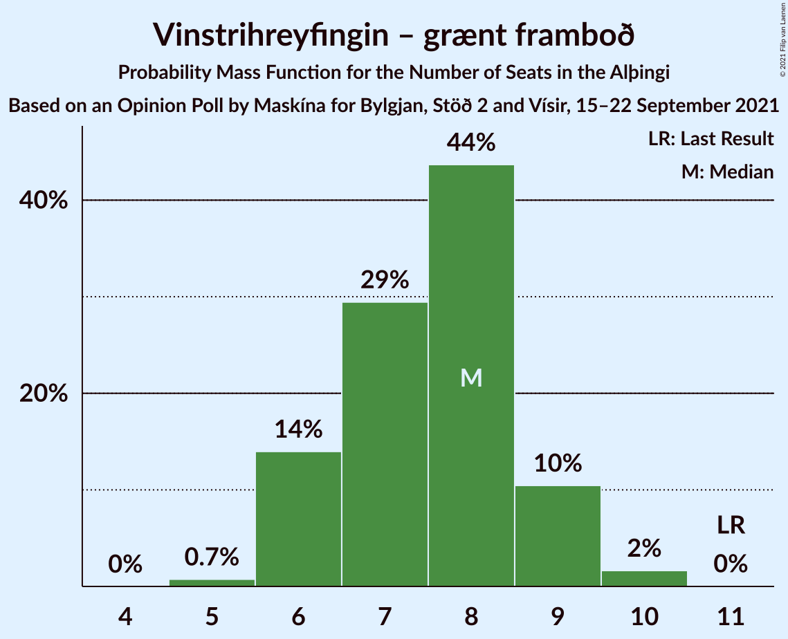

| Number of Seats | Probability | Accumulated | Special Marks |
|:---------------:|:-----------:|:-----------:|:-------------:|
| 5 | 0.7% | 100% |  |
| 6 | 14% | 99.2% |  |
| 7 | 29% | 85% |  |
| 8 | 44% | 56% | Median |
| 9 | 10% | 12% |  |
| 10 | 2% | 2% |  |
| 11 | 0% | 0% | Last Result |

### Viðreisn

*For a full overview of the results for this party, see the [Viðreisn](party-viðreisn.html) page.*

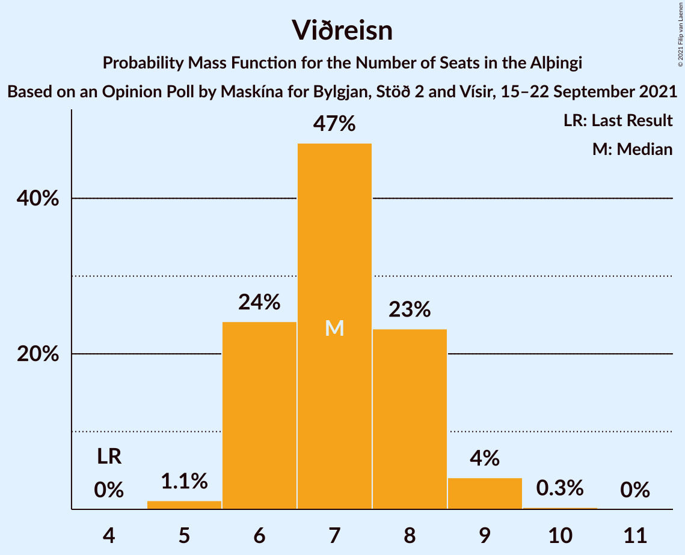

| Number of Seats | Probability | Accumulated | Special Marks |
|:---------------:|:-----------:|:-----------:|:-------------:|
| 4 | 0% | 100% | Last Result |
| 5 | 1.1% | 100% |  |
| 6 | 24% | 98.9% |  |
| 7 | 47% | 75% | Median |
| 8 | 23% | 28% |  |
| 9 | 4% | 4% |  |
| 10 | 0.3% | 0.3% |  |
| 11 | 0% | 0% |  |

### Píratar

*For a full overview of the results for this party, see the [Píratar](party-píratar.html) page.*

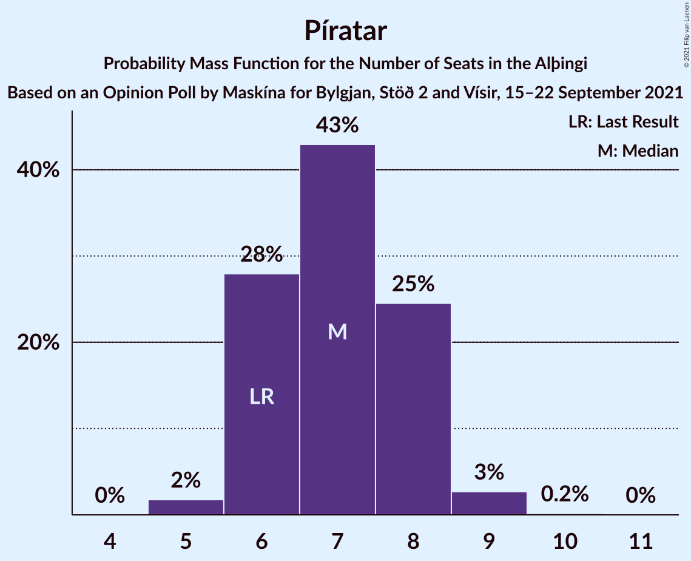

| Number of Seats | Probability | Accumulated | Special Marks |
|:---------------:|:-----------:|:-----------:|:-------------:|
| 5 | 2% | 100% |  |
| 6 | 28% | 98% | Last Result |
| 7 | 43% | 70% | Median |
| 8 | 25% | 27% |  |
| 9 | 3% | 3% |  |
| 10 | 0.2% | 0.2% |  |
| 11 | 0% | 0% |  |

### Miðflokkurinn

*For a full overview of the results for this party, see the [Miðflokkurinn](party-miðflokkurinn.html) page.*

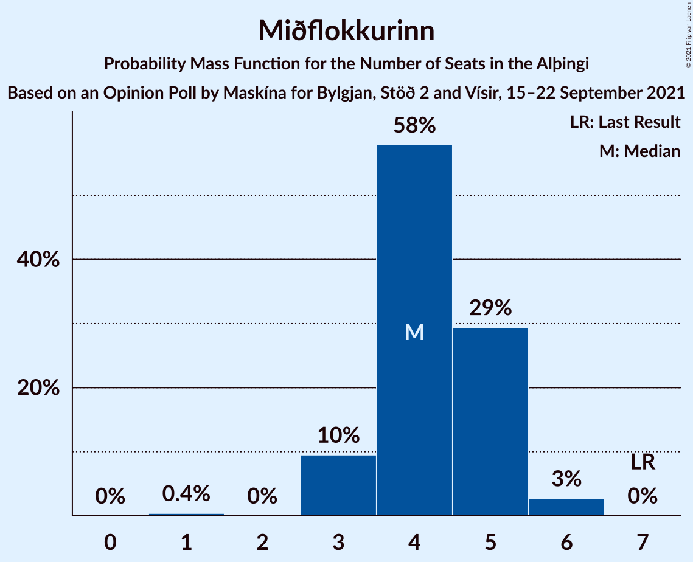

| Number of Seats | Probability | Accumulated | Special Marks |
|:---------------:|:-----------:|:-----------:|:-------------:|
| 1 | 0.4% | 100% |  |
| 2 | 0% | 99.6% |  |
| 3 | 10% | 99.6% |  |
| 4 | 58% | 90% | Median |
| 5 | 29% | 32% |  |
| 6 | 3% | 3% |  |
| 7 | 0% | 0% | Last Result |

### Sósíalistaflokkur Íslands

*For a full overview of the results for this party, see the [Sósíalistaflokkur Íslands](party-sósíalistaflokkuríslands.html) page.*

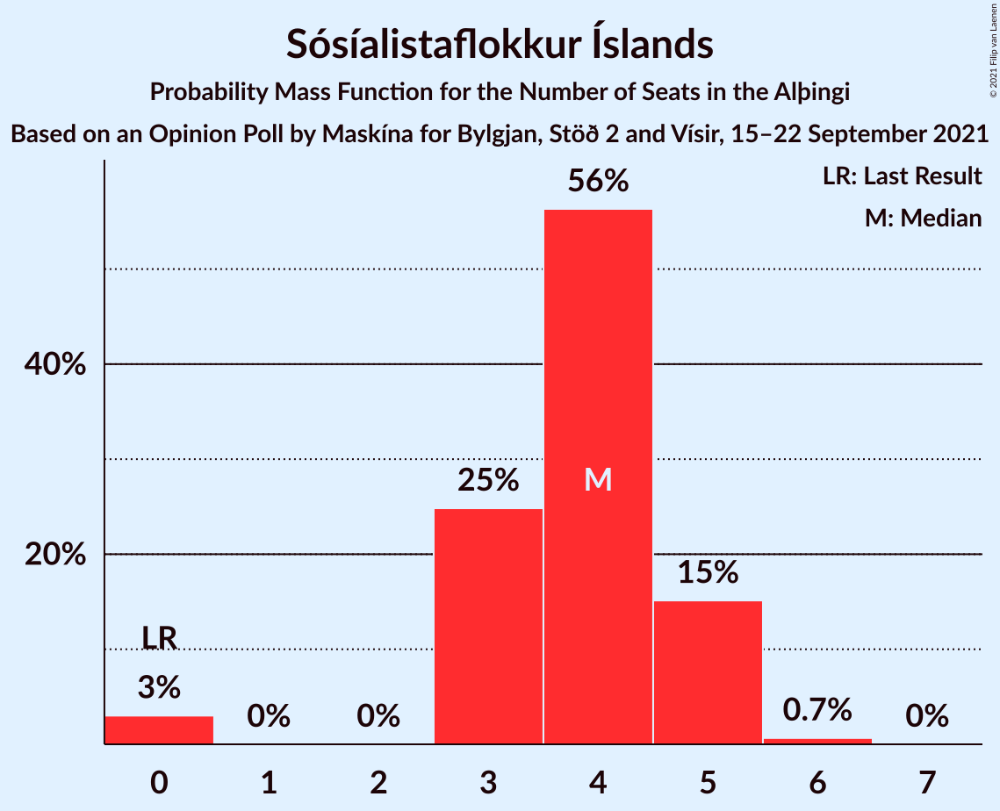

| Number of Seats | Probability | Accumulated | Special Marks |
|:---------------:|:-----------:|:-----------:|:-------------:|
| 0 | 3% | 100% | Last Result |
| 1 | 0% | 97% |  |
| 2 | 0% | 97% |  |
| 3 | 25% | 97% |  |
| 4 | 56% | 72% | Median |
| 5 | 15% | 16% |  |
| 6 | 0.7% | 0.7% |  |
| 7 | 0% | 0% |  |

### Flokkur fólksins

*For a full overview of the results for this party, see the [Flokkur fólksins](party-flokkurfólksins.html) page.*

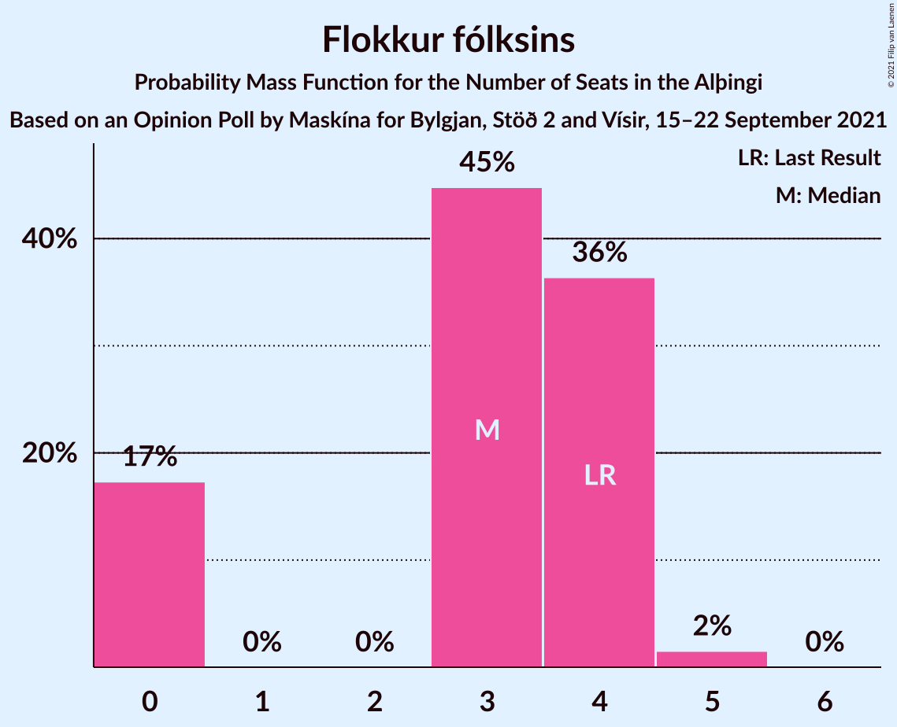

| Number of Seats | Probability | Accumulated | Special Marks |
|:---------------:|:-----------:|:-----------:|:-------------:|
| 0 | 17% | 100% |  |
| 1 | 0% | 83% |  |
| 2 | 0% | 83% |  |
| 3 | 45% | 83% | Median |
| 4 | 36% | 38% | Last Result |
| 5 | 2% | 2% |  |
| 6 | 0% | 0% |  |

## Coalitions

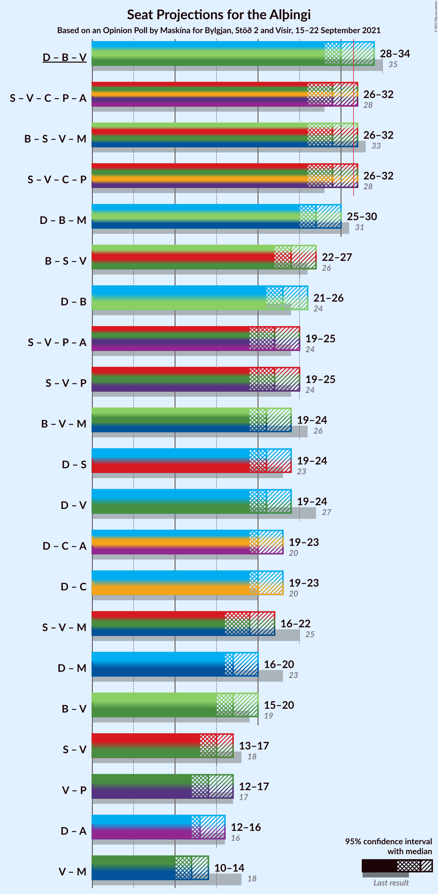

### Confidence Intervals

| Coalition | Last Result | Median | Majority? | 80% Confidence Interval | 90% Confidence Interval | 95% Confidence Interval | 99% Confidence Interval |
|:---------:|:-----------:|:------:|:---------:|:-----------------------:|:-----------------------:|:-----------------------:|:-----------------------:|
| Sjálfstæðisflokkurinn – Framsóknarflokkurinn – Vinstrihreyfingin – grænt framboð | 35 | 30 | 27% | 29–33 | 29–33 | 28–34 | 28–35 |
| Framsóknarflokkurinn – Samfylkingin – Vinstrihreyfingin – grænt framboð – Miðflokkurinn | 33 | 29 | 5% | 27–31 | 27–31 | 26–32 | 25–33 |
| Samfylkingin – Vinstrihreyfingin – grænt framboð – Viðreisn – Píratar | 28 | 29 | 7% | 27–31 | 27–32 | 26–32 | 25–33 |
| Sjálfstæðisflokkurinn – Framsóknarflokkurinn – Miðflokkurinn | 31 | 27 | 0.4% | 26–29 | 26–30 | 25–30 | 24–31 |
| Framsóknarflokkurinn – Samfylkingin – Vinstrihreyfingin – grænt framboð | 26 | 24 | 0% | 23–27 | 23–27 | 22–27 | 21–28 |
| Sjálfstæðisflokkurinn – Framsóknarflokkurinn | 24 | 23 | 0% | 22–25 | 22–25 | 21–26 | 21–27 |
| Samfylkingin – Vinstrihreyfingin – grænt framboð – Píratar | 24 | 22 | 0% | 20–23 | 20–24 | 19–25 | 18–25 |
| Framsóknarflokkurinn – Vinstrihreyfingin – grænt framboð – Miðflokkurinn | 26 | 21 | 0% | 20–24 | 19–24 | 19–24 | 18–25 |
| Sjálfstæðisflokkurinn – Samfylkingin | 23 | 21 | 0% | 20–22 | 19–23 | 19–24 | 18–25 |
| Sjálfstæðisflokkurinn – Vinstrihreyfingin – grænt framboð | 27 | 21 | 0% | 19–23 | 19–23 | 19–24 | 18–25 |
| Sjálfstæðisflokkurinn – Viðreisn | 20 | 20 | 0% | 19–22 | 19–23 | 19–23 | 18–25 |
| Samfylkingin – Vinstrihreyfingin – grænt framboð – Miðflokkurinn | 25 | 19 | 0% | 18–21 | 17–21 | 16–22 | 16–23 |
| Sjálfstæðisflokkurinn – Miðflokkurinn | 23 | 17 | 0% | 17–19 | 16–20 | 16–20 | 15–22 |
| Framsóknarflokkurinn – Vinstrihreyfingin – grænt framboð | 19 | 17 | 0% | 16–19 | 15–20 | 15–20 | 14–21 |
| Samfylkingin – Vinstrihreyfingin – grænt framboð | 18 | 15 | 0% | 13–16 | 13–17 | 13–17 | 12–18 |
| Vinstrihreyfingin – grænt framboð – Píratar | 17 | 14 | 0% | 13–16 | 13–16 | 12–17 | 12–17 |
| Vinstrihreyfingin – grænt framboð – Miðflokkurinn | 18 | 12 | 0% | 10–13 | 10–13 | 10–14 | 9–15 |

### Sjálfstæðisflokkurinn – Framsóknarflokkurinn – Vinstrihreyfingin – grænt framboð

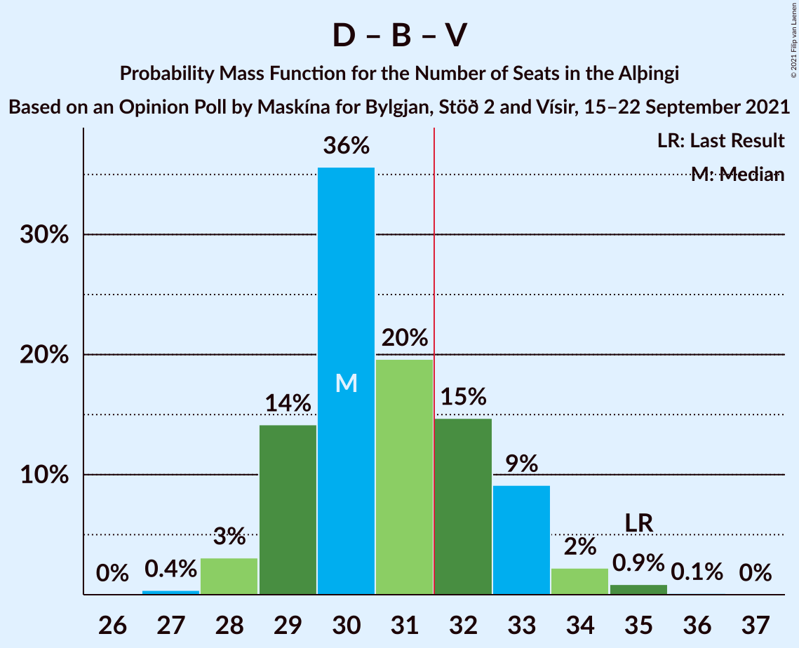

| Number of Seats | Probability | Accumulated | Special Marks |
|:---------------:|:-----------:|:-----------:|:-------------:|
| 27 | 0.4% | 100% |  |
| 28 | 3% | 99.6% |  |
| 29 | 14% | 97% |  |
| 30 | 36% | 82% | Median |
| 31 | 20% | 47% |  |
| 32 | 15% | 27% | Majority |
| 33 | 9% | 12% |  |
| 34 | 2% | 3% |  |
| 35 | 0.9% | 1.0% | Last Result |
| 36 | 0.1% | 0.2% |  |
| 37 | 0% | 0% |  |

### Framsóknarflokkurinn – Samfylkingin – Vinstrihreyfingin – grænt framboð – Miðflokkurinn

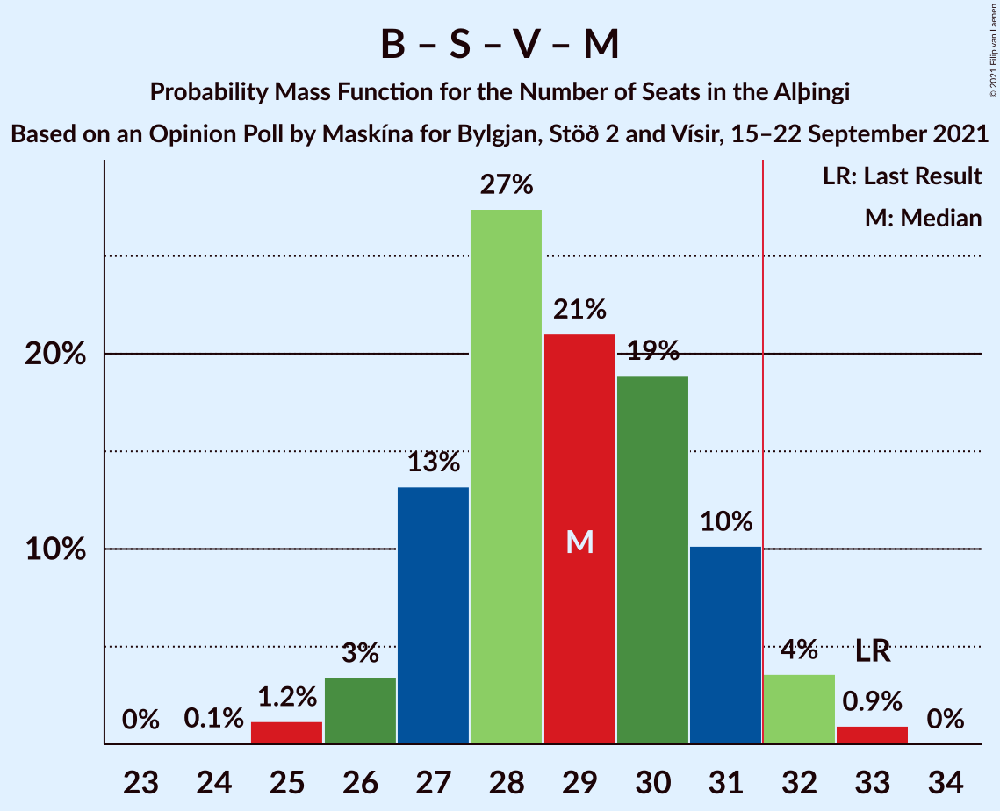

| Number of Seats | Probability | Accumulated | Special Marks |
|:---------------:|:-----------:|:-----------:|:-------------:|
| 24 | 0.1% | 100% |  |
| 25 | 1.2% | 99.9% |  |
| 26 | 3% | 98.7% |  |
| 27 | 13% | 95% |  |
| 28 | 27% | 82% | Median |
| 29 | 21% | 55% |  |
| 30 | 19% | 34% |  |
| 31 | 10% | 15% |  |
| 32 | 4% | 5% | Majority |
| 33 | 0.9% | 1.0% | Last Result |
| 34 | 0% | 0% |  |

### Samfylkingin – Vinstrihreyfingin – grænt framboð – Viðreisn – Píratar

| Number of Seats | Probability | Accumulated | Special Marks |
|:---------------:|:-----------:|:-----------:|:-------------:|
| 24 | 0.2% | 100% |  |
| 25 | 0.6% | 99.8% |  |
| 26 | 4% | 99.1% |  |
| 27 | 6% | 95% |  |
| 28 | 25% | 89% | Last Result |
| 29 | 38% | 64% | Median |
| 30 | 13% | 26% |  |
| 31 | 5% | 13% |  |
| 32 | 7% | 7% | Majority |
| 33 | 0.5% | 0.7% |  |
| 34 | 0.1% | 0.2% |  |
| 35 | 0% | 0% |  |

### Sjálfstæðisflokkurinn – Framsóknarflokkurinn – Miðflokkurinn

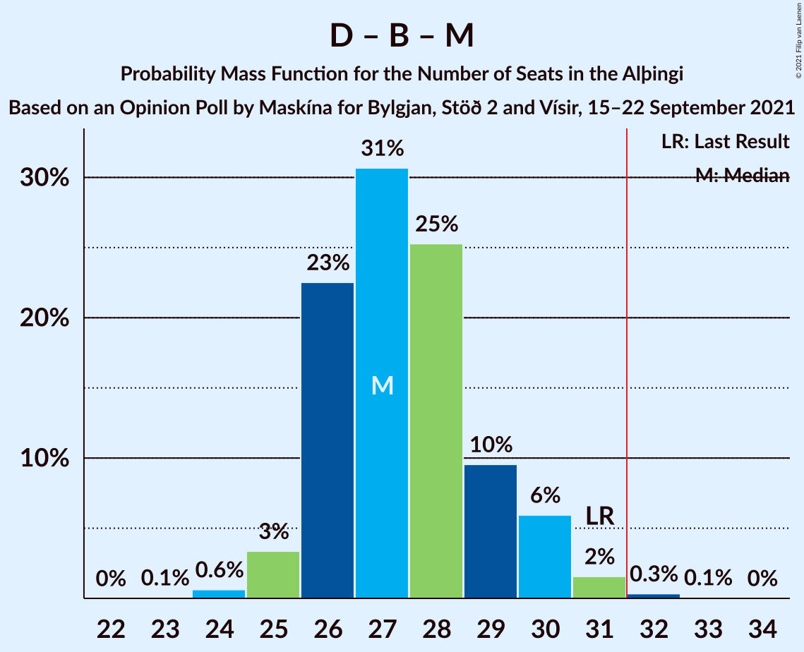

| Number of Seats | Probability | Accumulated | Special Marks |
|:---------------:|:-----------:|:-----------:|:-------------:|
| 23 | 0.1% | 100% |  |
| 24 | 0.6% | 99.9% |  |
| 25 | 3% | 99.3% |  |
| 26 | 23% | 96% | Median |
| 27 | 31% | 73% |  |
| 28 | 25% | 43% |  |
| 29 | 10% | 17% |  |
| 30 | 6% | 8% |  |
| 31 | 2% | 2% | Last Result |
| 32 | 0.3% | 0.4% | Majority |
| 33 | 0.1% | 0.1% |  |
| 34 | 0% | 0% |  |

### Framsóknarflokkurinn – Samfylkingin – Vinstrihreyfingin – grænt framboð

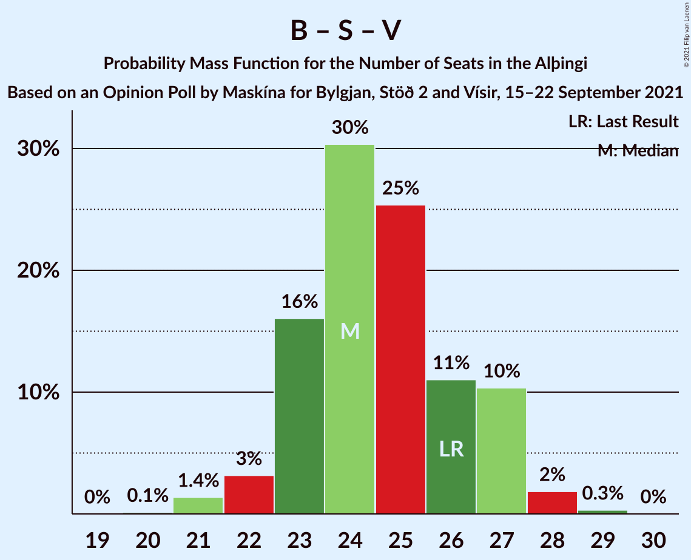

| Number of Seats | Probability | Accumulated | Special Marks |
|:---------------:|:-----------:|:-----------:|:-------------:|
| 20 | 0.1% | 100% |  |
| 21 | 1.4% | 99.9% |  |
| 22 | 3% | 98% |  |
| 23 | 16% | 95% |  |
| 24 | 30% | 79% | Median |
| 25 | 25% | 49% |  |
| 26 | 11% | 24% | Last Result |
| 27 | 10% | 13% |  |
| 28 | 2% | 2% |  |
| 29 | 0.3% | 0.3% |  |
| 30 | 0% | 0% |  |

### Sjálfstæðisflokkurinn – Framsóknarflokkurinn

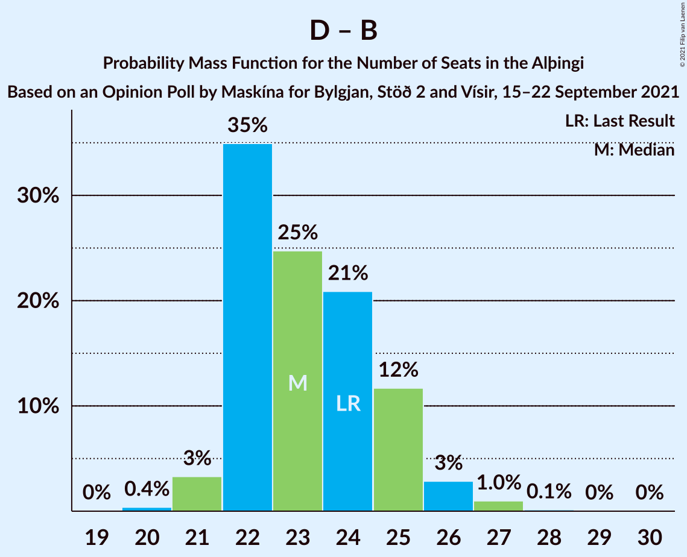

| Number of Seats | Probability | Accumulated | Special Marks |
|:---------------:|:-----------:|:-----------:|:-------------:|
| 20 | 0.4% | 100% |  |
| 21 | 3% | 99.6% |  |
| 22 | 35% | 96% | Median |
| 23 | 25% | 61% |  |
| 24 | 21% | 37% | Last Result |
| 25 | 12% | 16% |  |
| 26 | 3% | 4% |  |
| 27 | 1.0% | 1.2% |  |
| 28 | 0.1% | 0.2% |  |
| 29 | 0% | 0.1% |  |
| 30 | 0% | 0% |  |

### Samfylkingin – Vinstrihreyfingin – grænt framboð – Píratar

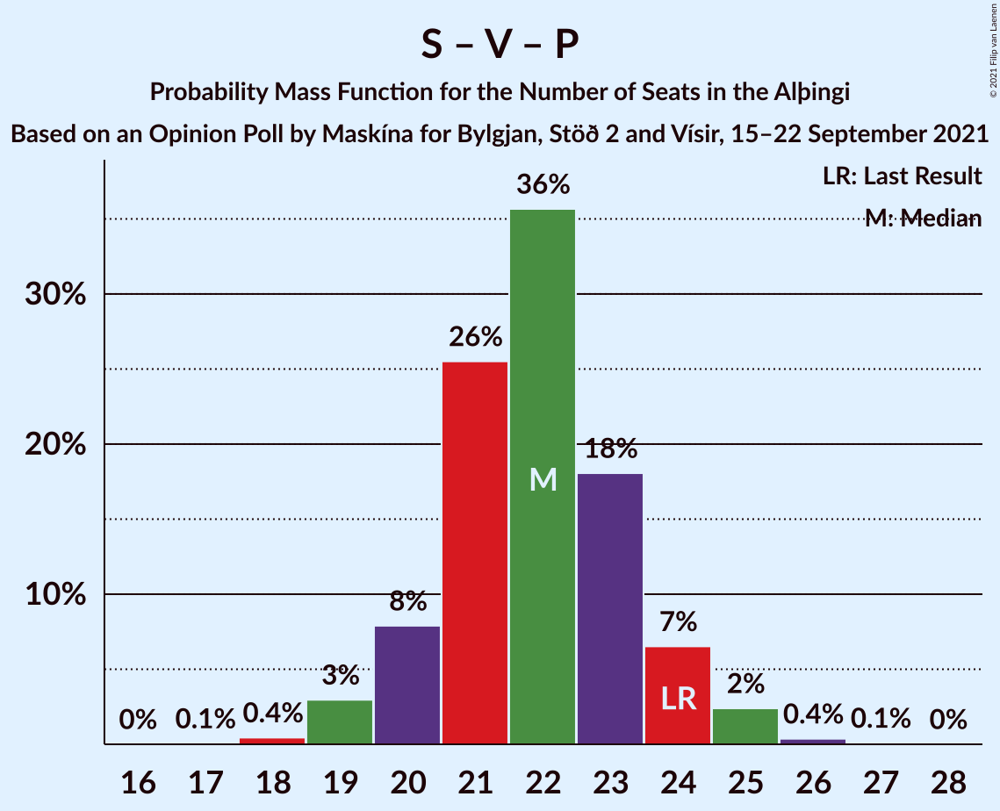

| Number of Seats | Probability | Accumulated | Special Marks |
|:---------------:|:-----------:|:-----------:|:-------------:|
| 17 | 0.1% | 100% |  |
| 18 | 0.4% | 99.9% |  |
| 19 | 3% | 99.5% |  |
| 20 | 8% | 97% |  |
| 21 | 26% | 89% |  |
| 22 | 36% | 63% | Median |
| 23 | 18% | 27% |  |
| 24 | 7% | 9% | Last Result |
| 25 | 2% | 3% |  |
| 26 | 0.4% | 0.5% |  |
| 27 | 0.1% | 0.1% |  |
| 28 | 0% | 0% |  |

### Framsóknarflokkurinn – Vinstrihreyfingin – grænt framboð – Miðflokkurinn

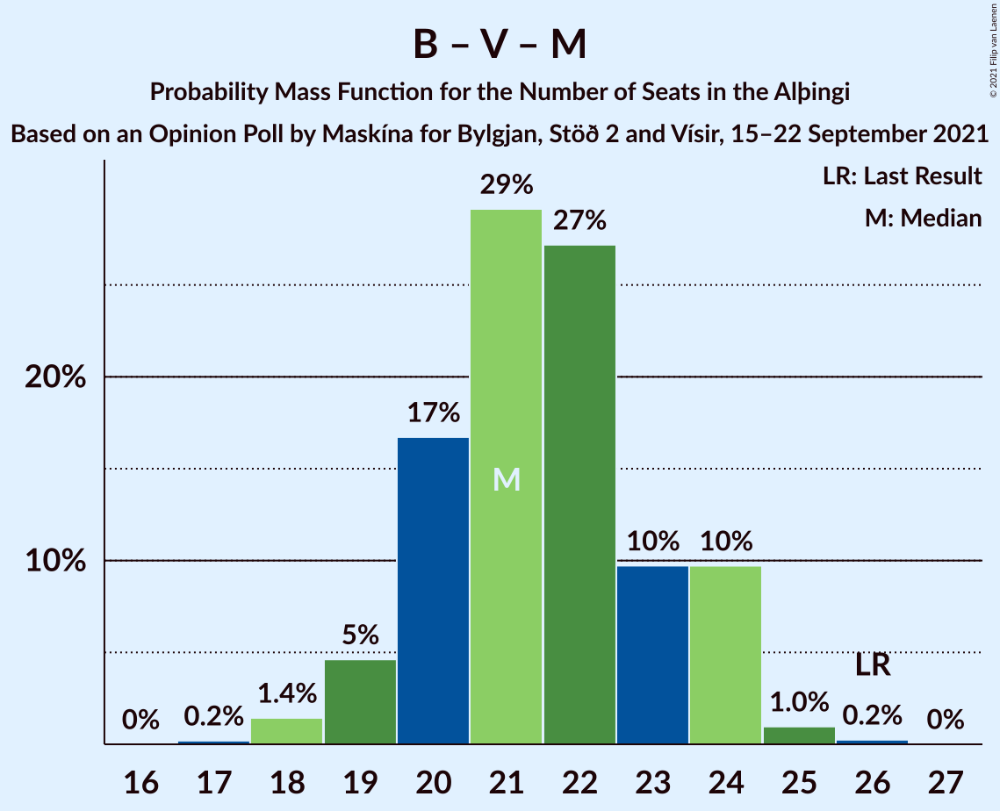

| Number of Seats | Probability | Accumulated | Special Marks |
|:---------------:|:-----------:|:-----------:|:-------------:|
| 17 | 0.2% | 100% |  |
| 18 | 1.4% | 99.8% |  |
| 19 | 5% | 98% |  |
| 20 | 17% | 94% |  |
| 21 | 29% | 77% | Median |
| 22 | 27% | 48% |  |
| 23 | 10% | 21% |  |
| 24 | 10% | 11% |  |
| 25 | 1.0% | 1.2% |  |
| 26 | 0.2% | 0.3% | Last Result |
| 27 | 0% | 0% |  |

### Sjálfstæðisflokkurinn – Samfylkingin

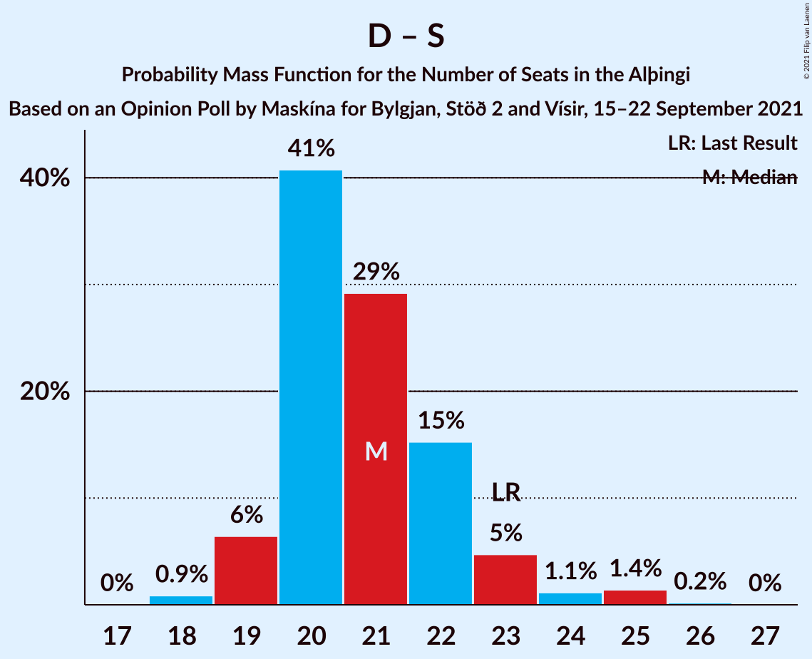

| Number of Seats | Probability | Accumulated | Special Marks |
|:---------------:|:-----------:|:-----------:|:-------------:|
| 18 | 0.9% | 100% |  |
| 19 | 6% | 99.1% |  |
| 20 | 41% | 93% | Median |
| 21 | 29% | 52% |  |
| 22 | 15% | 23% |  |
| 23 | 5% | 7% | Last Result |
| 24 | 1.1% | 3% |  |
| 25 | 1.4% | 2% |  |
| 26 | 0.2% | 0.2% |  |
| 27 | 0% | 0% |  |

### Sjálfstæðisflokkurinn – Vinstrihreyfingin – grænt framboð

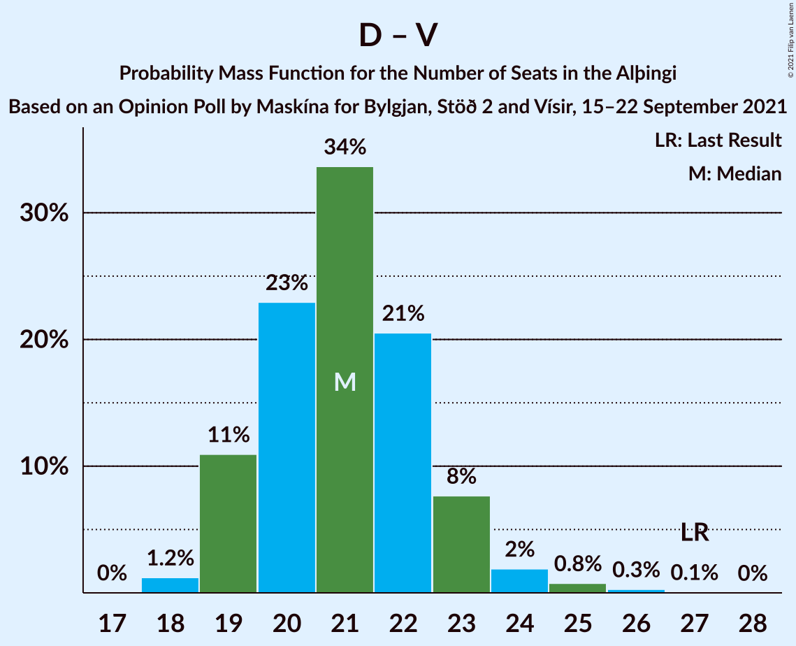

| Number of Seats | Probability | Accumulated | Special Marks |
|:---------------:|:-----------:|:-----------:|:-------------:|
| 18 | 1.2% | 100% |  |
| 19 | 11% | 98.8% |  |
| 20 | 23% | 88% |  |
| 21 | 34% | 65% | Median |
| 22 | 21% | 31% |  |
| 23 | 8% | 11% |  |
| 24 | 2% | 3% |  |
| 25 | 0.8% | 1.1% |  |
| 26 | 0.3% | 0.4% |  |
| 27 | 0.1% | 0.1% | Last Result |
| 28 | 0% | 0% |  |

### Sjálfstæðisflokkurinn – Viðreisn

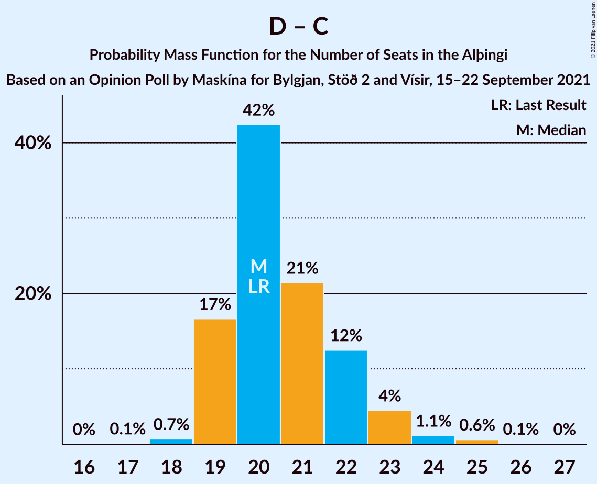

| Number of Seats | Probability | Accumulated | Special Marks |
|:---------------:|:-----------:|:-----------:|:-------------:|
| 17 | 0.1% | 100% |  |
| 18 | 0.7% | 99.9% |  |
| 19 | 17% | 99.2% |  |
| 20 | 42% | 83% | Last Result, Median |
| 21 | 21% | 40% |  |
| 22 | 12% | 19% |  |
| 23 | 4% | 6% |  |
| 24 | 1.1% | 2% |  |
| 25 | 0.6% | 0.7% |  |
| 26 | 0.1% | 0.1% |  |
| 27 | 0% | 0% |  |

### Samfylkingin – Vinstrihreyfingin – grænt framboð – Miðflokkurinn

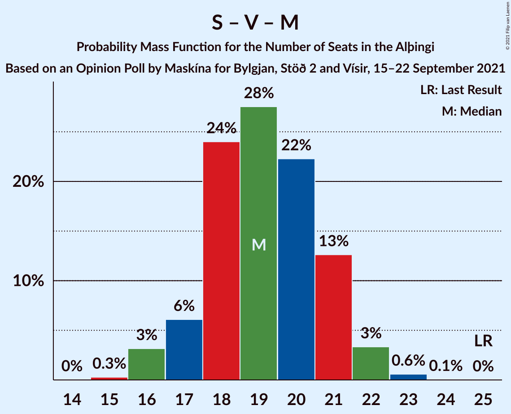

| Number of Seats | Probability | Accumulated | Special Marks |
|:---------------:|:-----------:|:-----------:|:-------------:|
| 15 | 0.3% | 100% |  |
| 16 | 3% | 99.7% |  |
| 17 | 6% | 97% |  |
| 18 | 24% | 90% |  |
| 19 | 28% | 66% | Median |
| 20 | 22% | 39% |  |
| 21 | 13% | 17% |  |
| 22 | 3% | 4% |  |
| 23 | 0.6% | 0.6% |  |
| 24 | 0.1% | 0.1% |  |
| 25 | 0% | 0% | Last Result |

### Sjálfstæðisflokkurinn – Miðflokkurinn

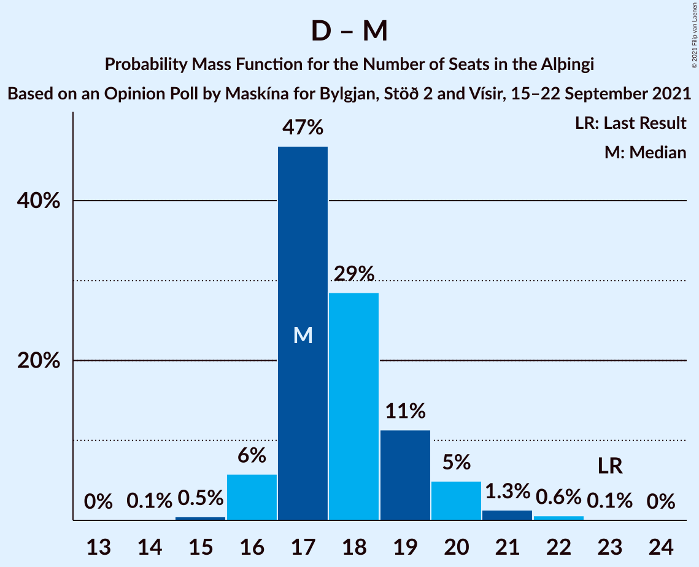

| Number of Seats | Probability | Accumulated | Special Marks |
|:---------------:|:-----------:|:-----------:|:-------------:|
| 14 | 0.1% | 100% |  |
| 15 | 0.5% | 99.9% |  |
| 16 | 6% | 99.4% |  |
| 17 | 47% | 94% | Median |
| 18 | 29% | 47% |  |
| 19 | 11% | 18% |  |
| 20 | 5% | 7% |  |
| 21 | 1.3% | 2% |  |
| 22 | 0.6% | 0.7% |  |
| 23 | 0.1% | 0.1% | Last Result |
| 24 | 0% | 0% |  |

### Framsóknarflokkurinn – Vinstrihreyfingin – grænt framboð

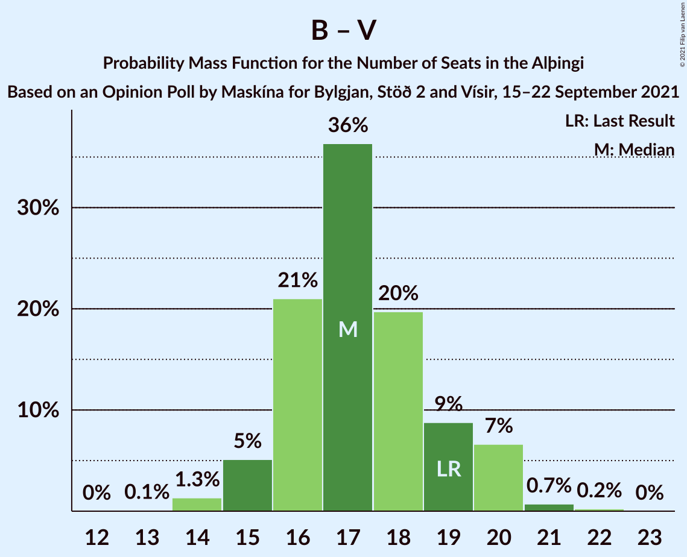

| Number of Seats | Probability | Accumulated | Special Marks |
|:---------------:|:-----------:|:-----------:|:-------------:|
| 13 | 0.1% | 100% |  |
| 14 | 1.3% | 99.9% |  |
| 15 | 5% | 98.6% |  |
| 16 | 21% | 93% |  |
| 17 | 36% | 72% | Median |
| 18 | 20% | 36% |  |
| 19 | 9% | 16% | Last Result |
| 20 | 7% | 8% |  |
| 21 | 0.7% | 1.0% |  |
| 22 | 0.2% | 0.2% |  |
| 23 | 0% | 0% |  |

### Samfylkingin – Vinstrihreyfingin – grænt framboð

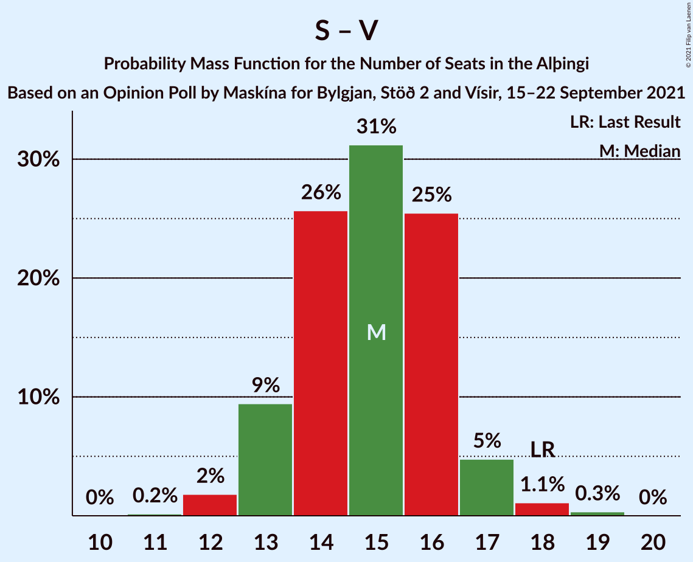

| Number of Seats | Probability | Accumulated | Special Marks |
|:---------------:|:-----------:|:-----------:|:-------------:|
| 11 | 0.2% | 100% |  |
| 12 | 2% | 99.8% |  |
| 13 | 9% | 98% |  |
| 14 | 26% | 89% |  |
| 15 | 31% | 63% | Median |
| 16 | 25% | 32% |  |
| 17 | 5% | 6% |  |
| 18 | 1.1% | 1.5% | Last Result |
| 19 | 0.3% | 0.3% |  |
| 20 | 0% | 0% |  |

### Vinstrihreyfingin – grænt framboð – Píratar

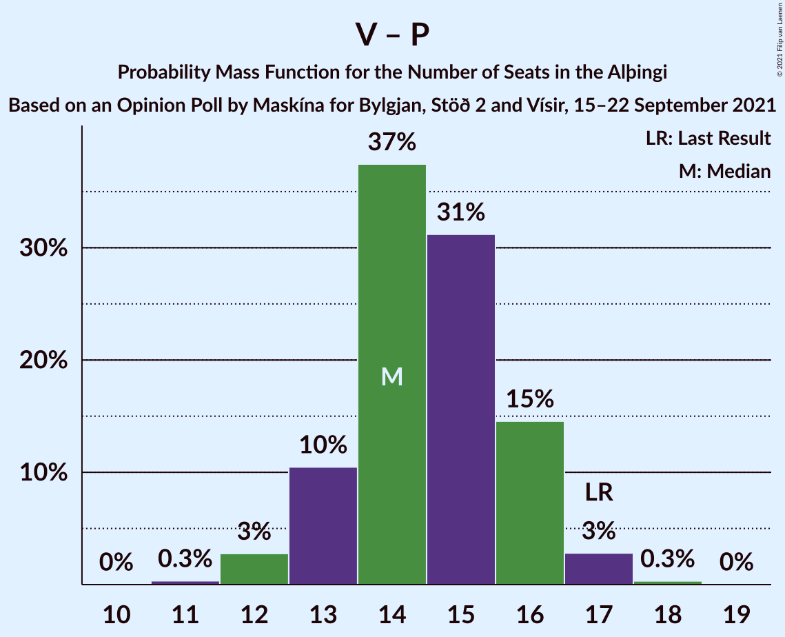

| Number of Seats | Probability | Accumulated | Special Marks |
|:---------------:|:-----------:|:-----------:|:-------------:|
| 11 | 0.3% | 100% |  |
| 12 | 3% | 99.6% |  |
| 13 | 10% | 97% |  |
| 14 | 37% | 86% |  |
| 15 | 31% | 49% | Median |
| 16 | 15% | 18% |  |
| 17 | 3% | 3% | Last Result |
| 18 | 0.3% | 0.4% |  |
| 19 | 0% | 0% |  |

### Vinstrihreyfingin – grænt framboð – Miðflokkurinn

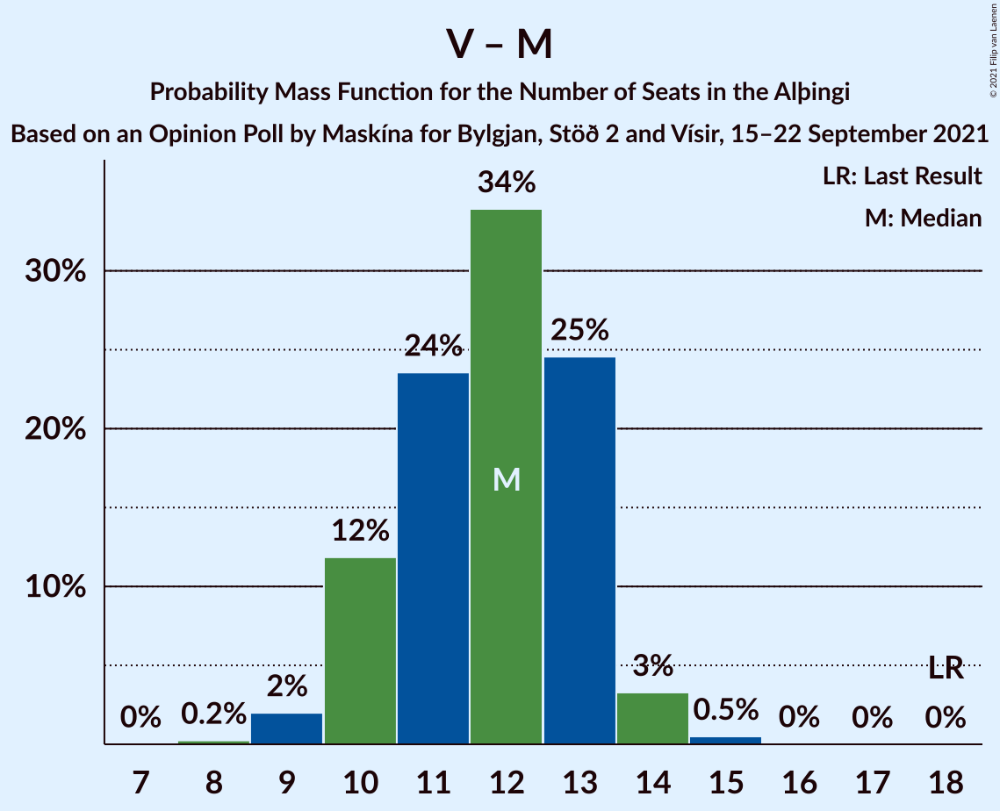

| Number of Seats | Probability | Accumulated | Special Marks |
|:---------------:|:-----------:|:-----------:|:-------------:|
| 8 | 0.2% | 100% |  |
| 9 | 2% | 99.7% |  |
| 10 | 12% | 98% |  |
| 11 | 24% | 86% |  |
| 12 | 34% | 62% | Median |
| 13 | 25% | 28% |  |
| 14 | 3% | 4% |  |
| 15 | 0.5% | 0.5% |  |
| 16 | 0% | 0% |  |
| 17 | 0% | 0% |  |
| 18 | 0% | 0% | Last Result |

## Technical Information

### Opinion Poll

+ **Polling firm:** Maskína
+ **Commissioner(s):** Bylgjan, Stöð 2 and Vísir
+ **Fieldwork period:** 15–22 September 2021

### Calculations

+ **Sample size:** 879
+ **Simulations done:** 1,048,576
+ **Error estimate:** 2.10%

