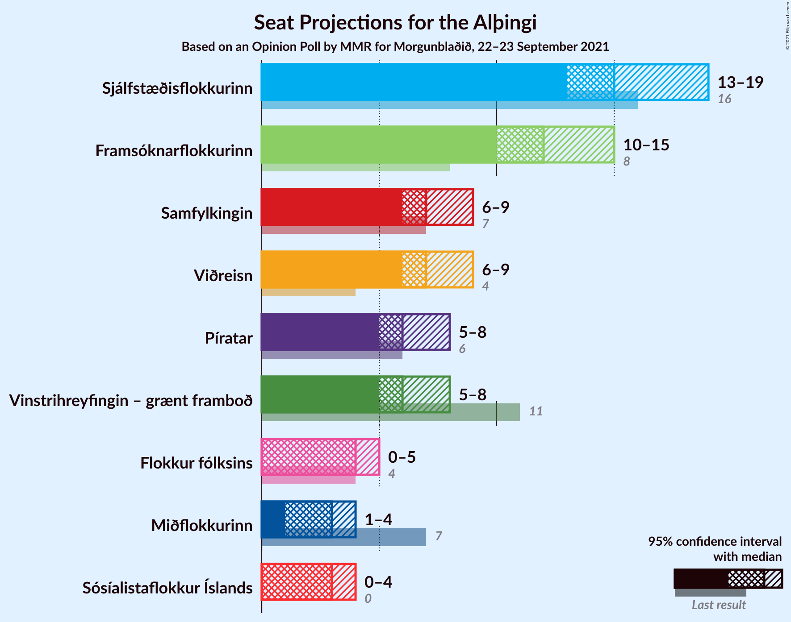
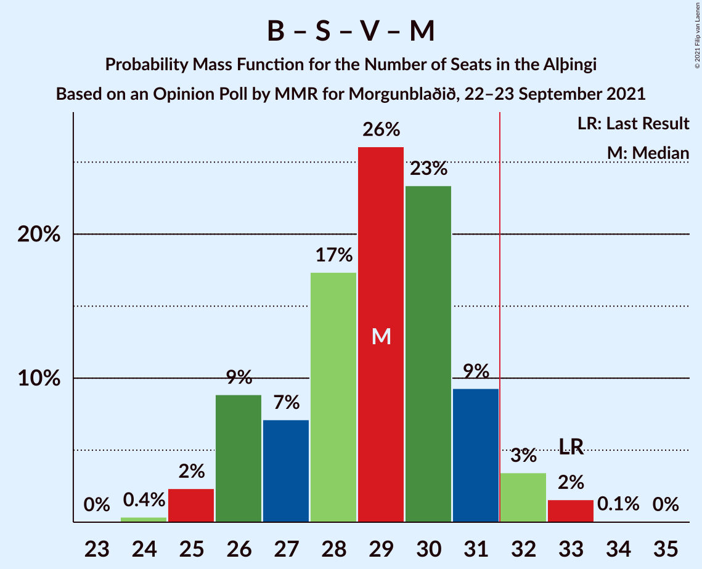
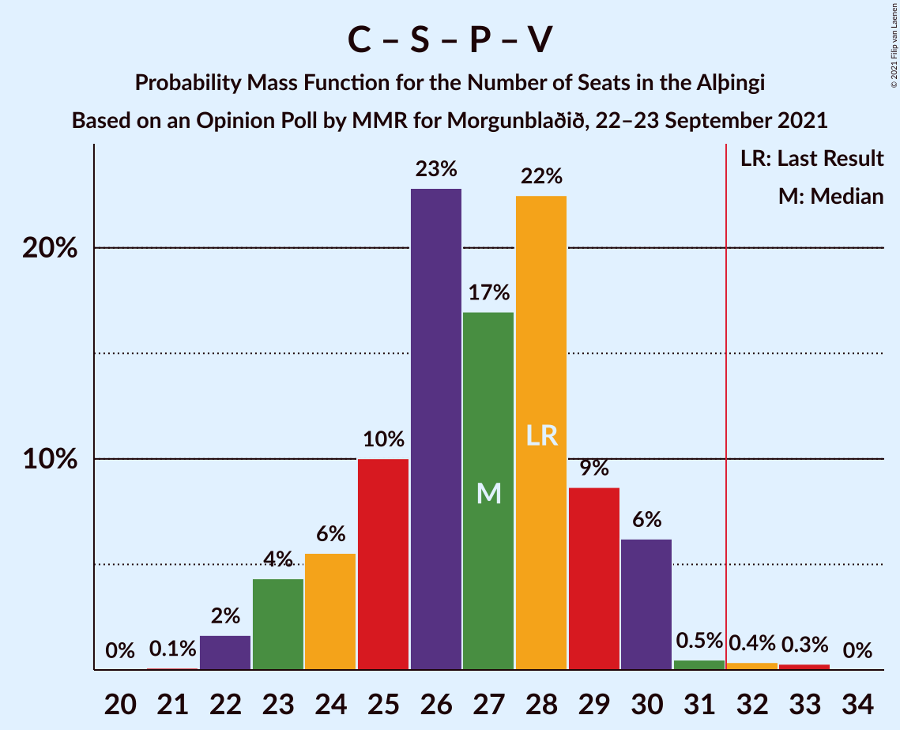
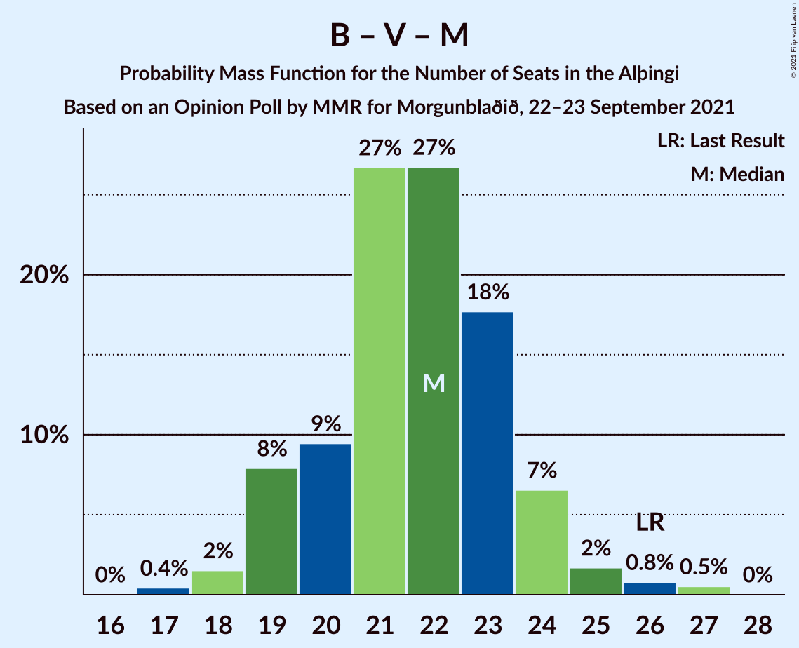
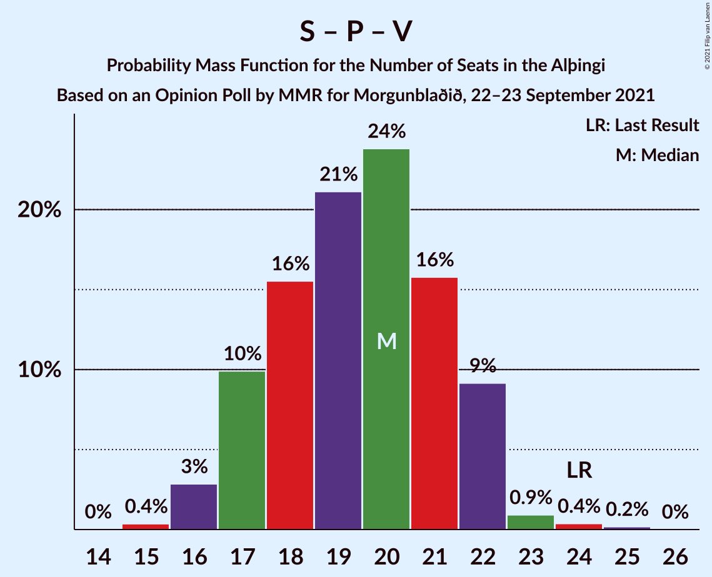

# Opinion Poll by MMR for Morgunblaðið, 22–23 September 2021

<a href="#voting-intentions">Voting Intentions</a> | <a href="#seats">Seats</a> | <a href="#coalitions">Coalitions</a> | <a href="#technical-information">Technical Information</a>

## Voting Intentions

### Confidence Intervals

| Party | Last Result | Poll Result | 80% Confidence Interval | 90% Confidence Interval | 95% Confidence Interval | 99% Confidence Interval |
|:-----:|:-----------:|:-----------:|:-----------------------:|:-----------------------:|:-----------------------:|:-----------------------:|
| Sjálfstæðisflokkurinn | 25.2% | 22.9% | 21.1–24.7% |20.7–25.2% |20.2–25.7% |19.4–26.6% |
| Framsóknarflokkurinn | 10.7% | 16.4% | 14.9–18.0% |14.5–18.5% |14.1–18.9% |13.4–19.7% |
| Viðreisn | 6.7% | 12.0% | 10.7–13.5% |10.3–13.9% |10.0–14.3% |9.4–15.0% |
| Samfylkingin | 12.1% | 11.5% | 10.3–13.0% |9.9–13.4% |9.6–13.8% |9.1–14.5% |
| Píratar | 9.2% | 9.9% | 8.7–11.3% |8.4–11.7% |8.1–12.0% |7.6–12.7% |
| Vinstrihreyfingin – grænt framboð | 16.9% | 9.7% | 8.5–11.0% |8.2–11.4% |7.9–11.8% |7.4–12.5% |
| Flokkur fólksins | 6.9% | 6.2% | 5.2–7.3% |5.0–7.6% |4.8–7.9% |4.4–8.5% |
| Miðflokkurinn | 10.9% | 5.8% | 4.9–7.0% |4.7–7.3% |4.5–7.5% |4.1–8.1% |
| Sósíalistaflokkur Íslands | 0.0% | 5.1% | 4.2–6.1% |4.0–6.4% |3.8–6.7% |3.4–7.2% |

*Note:* The poll result column reflects the actual value used in the calculations. Published results may vary slightly, and in addition be rounded to fewer digits.

## Seats

### Confidence Intervals

| Party | Last Result | Median | 80% Confidence Interval | 90% Confidence Interval | 95% Confidence Interval | 99% Confidence Interval |
|:-----:|:-----------:|:------:|:-----------------------:|:-----------------------:|:-----------------------:|:-----------------------:|
| <a href="#sjálfstæðisflokkurinn">Sjálfstæðisflokkurinn</a> | 16 | 15 | 13–18 |13–19 |13–19 |13–19 |
| <a href="#framsóknarflokkurinn">Framsóknarflokkurinn</a> | 8 | 12 | 11–14 |11–15 |10–15 |10–16 |
| <a href="#viðreisn">Viðreisn</a> | 4 | 7 | 6–8 |6–9 |6–9 |5–9 |
| <a href="#samfylkingin">Samfylkingin</a> | 7 | 7 | 6–8 |6–9 |6–9 |5–10 |
| <a href="#píratar">Píratar</a> | 6 | 6 | 5–7 |5–8 |5–8 |4–8 |
| <a href="#vinstrihreyfingin-–-grænt-framboð">Vinstrihreyfingin – grænt framboð</a> | 11 | 6 | 5–7 |5–8 |5–8 |4–8 |
| <a href="#flokkur-fólksins">Flokkur fólksins</a> | 4 | 4 | 3–4 |0–5 |0–5 |0–5 |
| <a href="#miðflokkurinn">Miðflokkurinn</a> | 7 | 3 | 1–4 |1–4 |1–4 |1–5 |
| <a href="#sósíalistaflokkur-íslands">Sósíalistaflokkur Íslands</a> | 0 | 3 | 0–3 |0–4 |0–4 |0–4 |

### Sjálfstæðisflokkurinn

*For a full overview of the results for this party, see the [Sjálfstæðisflokkurinn](party-sjálfstæðisflokkurinn.html) page.*

| Number of Seats | Probability | Accumulated | Special Marks |
|:---------------:|:-----------:|:-----------:|:-------------:|
| 13 | 12% | 100% |  |
| 14 | 18% | 88% |  |
| 15 | 29% | 70% | Median |
| 16 | 11% | 41% | Last Result |
| 17 | 13% | 30% |  |
| 18 | 11% | 17% |  |
| 19 | 6% | 6% |  |
| 20 | 0% | 0% |  |

### Framsóknarflokkurinn

*For a full overview of the results for this party, see the [Framsóknarflokkurinn](party-framsóknarflokkurinn.html) page.*

| Number of Seats | Probability | Accumulated | Special Marks |
|:---------------:|:-----------:|:-----------:|:-------------:|
| 8 | 0.1% | 100% | Last Result |
| 9 | 0.2% | 99.9% |  |
| 10 | 5% | 99.7% |  |
| 11 | 6% | 95% |  |
| 12 | 53% | 89% | Median |
| 13 | 9% | 36% |  |
| 14 | 21% | 27% |  |
| 15 | 4% | 6% |  |
| 16 | 1.2% | 1.4% |  |
| 17 | 0.2% | 0.2% |  |
| 18 | 0% | 0% |  |

### Viðreisn

*For a full overview of the results for this party, see the [Viðreisn](party-viðreisn.html) page.*

| Number of Seats | Probability | Accumulated | Special Marks |
|:---------------:|:-----------:|:-----------:|:-------------:|
| 4 | 0% | 100% | Last Result |
| 5 | 0.7% | 100% |  |
| 6 | 13% | 99.3% |  |
| 7 | 46% | 86% | Median |
| 8 | 31% | 40% |  |
| 9 | 8% | 9% |  |
| 10 | 0.4% | 0.4% |  |
| 11 | 0% | 0% |  |

### Samfylkingin

*For a full overview of the results for this party, see the [Samfylkingin](party-samfylkingin.html) page.*

| Number of Seats | Probability | Accumulated | Special Marks |
|:---------------:|:-----------:|:-----------:|:-------------:|
| 5 | 0.5% | 100% |  |
| 6 | 20% | 99.5% |  |
| 7 | 42% | 79% | Last Result, Median |
| 8 | 30% | 38% |  |
| 9 | 7% | 8% |  |
| 10 | 1.1% | 1.1% |  |
| 11 | 0% | 0% |  |

### Píratar

*For a full overview of the results for this party, see the [Píratar](party-píratar.html) page.*

| Number of Seats | Probability | Accumulated | Special Marks |
|:---------------:|:-----------:|:-----------:|:-------------:|
| 4 | 1.5% | 100% |  |
| 5 | 22% | 98.5% |  |
| 6 | 43% | 76% | Last Result, Median |
| 7 | 27% | 33% |  |
| 8 | 6% | 6% |  |
| 9 | 0.2% | 0.2% |  |
| 10 | 0% | 0% |  |

### Vinstrihreyfingin – grænt framboð

*For a full overview of the results for this party, see the [Vinstrihreyfingin – grænt framboð](party-vinstrihreyfingin–græntframboð.html) page.*

| Number of Seats | Probability | Accumulated | Special Marks |
|:---------------:|:-----------:|:-----------:|:-------------:|
| 4 | 2% | 100% |  |
| 5 | 24% | 98% |  |
| 6 | 52% | 74% | Median |
| 7 | 14% | 22% |  |
| 8 | 8% | 8% |  |
| 9 | 0.3% | 0.3% |  |
| 10 | 0% | 0% |  |
| 11 | 0% | 0% | Last Result |

### Flokkur fólksins

*For a full overview of the results for this party, see the [Flokkur fólksins](party-flokkurfólksins.html) page.*

| Number of Seats | Probability | Accumulated | Special Marks |
|:---------------:|:-----------:|:-----------:|:-------------:|
| 0 | 6% | 100% |  |
| 1 | 0% | 94% |  |
| 2 | 0.4% | 94% |  |
| 3 | 37% | 94% |  |
| 4 | 50% | 57% | Last Result, Median |
| 5 | 7% | 7% |  |
| 6 | 0.1% | 0.1% |  |
| 7 | 0% | 0% |  |

### Miðflokkurinn

*For a full overview of the results for this party, see the [Miðflokkurinn](party-miðflokkurinn.html) page.*

| Number of Seats | Probability | Accumulated | Special Marks |
|:---------------:|:-----------:|:-----------:|:-------------:|
| 0 | 0.1% | 100% |  |
| 1 | 16% | 99.9% |  |
| 2 | 0.3% | 84% |  |
| 3 | 46% | 83% | Median |
| 4 | 35% | 37% |  |
| 5 | 2% | 2% |  |
| 6 | 0% | 0% |  |
| 7 | 0% | 0% | Last Result |

### Sósíalistaflokkur Íslands

*For a full overview of the results for this party, see the [Sósíalistaflokkur Íslands](party-sósíalistaflokkuríslands.html) page.*

| Number of Seats | Probability | Accumulated | Special Marks |
|:---------------:|:-----------:|:-----------:|:-------------:|
| 0 | 48% | 100% | Last Result |
| 1 | 0% | 52% |  |
| 2 | 2% | 52% |  |
| 3 | 41% | 50% | Median |
| 4 | 9% | 10% |  |
| 5 | 0.1% | 0.1% |  |
| 6 | 0% | 0% |  |

## Coalitions

### Confidence Intervals

| Coalition | Last Result | Median | Majority? | 80% Confidence Interval | 90% Confidence Interval | 95% Confidence Interval | 99% Confidence Interval |
|:---------:|:-----------:|:------:|:---------:|:-----------------------:|:-----------------------:|:-----------------------:|:-----------------------:|
| Sjálfstæðisflokkurinn – Framsóknarflokkurinn – Vinstrihreyfingin – grænt framboð | 35 | 34 | 94% | 32–37 | 31–37 | 31–38 | 30–38 |
| Sjálfstæðisflokkurinn – Framsóknarflokkurinn – Miðflokkurinn | 31 | 31 | 39% | 29–34 | 28–34 | 28–35 | 27–36 |
| Framsóknarflokkurinn – Samfylkingin – Vinstrihreyfingin – grænt framboð – Miðflokkurinn | 33 | 29 | 5% | 26–31 | 26–32 | 25–32 | 25–33 |
| Sjálfstæðisflokkurinn – Framsóknarflokkurinn | 24 | 28 | 3% | 26–30 | 25–31 | 25–32 | 24–33 |
| Viðreisn – Samfylkingin – Píratar – Vinstrihreyfingin – grænt framboð | 28 | 27 | 0.7% | 24–29 | 23–30 | 23–30 | 22–32 |
| Framsóknarflokkurinn – Samfylkingin – Vinstrihreyfingin – grænt framboð | 26 | 26 | 0% | 24–28 | 23–28 | 23–29 | 22–30 |
| Sjálfstæðisflokkurinn – Viðreisn | 20 | 23 | 0% | 21–25 | 20–26 | 20–26 | 19–27 |
| Sjálfstæðisflokkurinn – Samfylkingin | 23 | 23 | 0% | 20–25 | 20–26 | 19–26 | 19–27 |
| Framsóknarflokkurinn – Vinstrihreyfingin – grænt framboð – Miðflokkurinn | 26 | 22 | 0% | 20–23 | 19–24 | 19–25 | 18–27 |
| Sjálfstæðisflokkurinn – Vinstrihreyfingin – grænt framboð | 27 | 21 | 0% | 19–24 | 19–24 | 18–25 | 18–26 |
| Sjálfstæðisflokkurinn – Miðflokkurinn | 23 | 19 | 0% | 16–21 | 16–22 | 16–23 | 15–23 |
| Samfylkingin – Píratar – Vinstrihreyfingin – grænt framboð | 24 | 20 | 0% | 17–22 | 17–22 | 16–22 | 16–24 |
| Framsóknarflokkurinn – Vinstrihreyfingin – grænt framboð | 19 | 18 | 0% | 17–20 | 17–21 | 16–21 | 15–23 |
| Samfylkingin – Vinstrihreyfingin – grænt framboð – Miðflokkurinn | 25 | 16 | 0% | 14–19 | 14–19 | 13–19 | 13–20 |
| Samfylkingin – Vinstrihreyfingin – grænt framboð | 18 | 13 | 0% | 12–15 | 11–16 | 11–16 | 11–17 |
| Píratar – Vinstrihreyfingin – grænt framboð | 17 | 12 | 0% | 11–14 | 10–14 | 10–15 | 9–15 |
| Vinstrihreyfingin – grænt framboð – Miðflokkurinn | 18 | 9 | 0% | 7–11 | 7–11 | 7–12 | 6–12 |

### Sjálfstæðisflokkurinn – Framsóknarflokkurinn – Vinstrihreyfingin – grænt framboð

| Number of Seats | Probability | Accumulated | Special Marks |
|:---------------:|:-----------:|:-----------:|:-------------:|
| 29 | 0.2% | 100% |  |
| 30 | 1.2% | 99.8% |  |
| 31 | 5% | 98.6% |  |
| 32 | 10% | 94% | Majority |
| 33 | 25% | 84% | Median |
| 34 | 21% | 59% |  |
| 35 | 16% | 38% | Last Result |
| 36 | 11% | 22% |  |
| 37 | 8% | 11% |  |
| 38 | 2% | 3% |  |
| 39 | 0.3% | 0.3% |  |
| 40 | 0% | 0% |  |

### Sjálfstæðisflokkurinn – Framsóknarflokkurinn – Miðflokkurinn

| Number of Seats | Probability | Accumulated | Special Marks |
|:---------------:|:-----------:|:-----------:|:-------------:|
| 26 | 0.2% | 100% |  |
| 27 | 1.3% | 99.8% |  |
| 28 | 7% | 98% |  |
| 29 | 12% | 91% |  |
| 30 | 18% | 80% | Median |
| 31 | 22% | 62% | Last Result |
| 32 | 15% | 39% | Majority |
| 33 | 13% | 25% |  |
| 34 | 8% | 12% |  |
| 35 | 2% | 4% |  |
| 36 | 1.5% | 2% |  |
| 37 | 0% | 0% |  |

### Framsóknarflokkurinn – Samfylkingin – Vinstrihreyfingin – grænt framboð – Miðflokkurinn

| Number of Seats | Probability | Accumulated | Special Marks |
|:---------------:|:-----------:|:-----------:|:-------------:|
| 24 | 0.4% | 100% |  |
| 25 | 2% | 99.6% |  |
| 26 | 9% | 97% |  |
| 27 | 7% | 88% |  |
| 28 | 17% | 81% | Median |
| 29 | 26% | 64% |  |
| 30 | 23% | 38% |  |
| 31 | 9% | 14% |  |
| 32 | 3% | 5% | Majority |
| 33 | 2% | 2% | Last Result |
| 34 | 0.1% | 0.1% |  |
| 35 | 0% | 0% |  |

### Sjálfstæðisflokkurinn – Framsóknarflokkurinn

| Number of Seats | Probability | Accumulated | Special Marks |
|:---------------:|:-----------:|:-----------:|:-------------:|
| 23 | 0.2% | 100% |  |
| 24 | 0.9% | 99.8% | Last Result |
| 25 | 5% | 98.9% |  |
| 26 | 13% | 94% |  |
| 27 | 25% | 81% | Median |
| 28 | 17% | 56% |  |
| 29 | 15% | 39% |  |
| 30 | 14% | 24% |  |
| 31 | 6% | 9% |  |
| 32 | 2% | 3% | Majority |
| 33 | 1.1% | 1.2% |  |
| 34 | 0% | 0% |  |

### Viðreisn – Samfylkingin – Píratar – Vinstrihreyfingin – grænt framboð

| Number of Seats | Probability | Accumulated | Special Marks |
|:---------------:|:-----------:|:-----------:|:-------------:|
| 21 | 0.1% | 100% |  |
| 22 | 2% | 99.9% |  |
| 23 | 4% | 98% |  |
| 24 | 6% | 94% |  |
| 25 | 10% | 88% |  |
| 26 | 23% | 78% | Median |
| 27 | 17% | 55% |  |
| 28 | 22% | 39% | Last Result |
| 29 | 9% | 16% |  |
| 30 | 6% | 7% |  |
| 31 | 0.5% | 1.2% |  |
| 32 | 0.4% | 0.7% | Majority |
| 33 | 0.3% | 0.3% |  |
| 34 | 0% | 0% |  |

### Framsóknarflokkurinn – Samfylkingin – Vinstrihreyfingin – grænt framboð

| Number of Seats | Probability | Accumulated | Special Marks |
|:---------------:|:-----------:|:-----------:|:-------------:|
| 21 | 0.1% | 100% |  |
| 22 | 1.3% | 99.9% |  |
| 23 | 6% | 98.6% |  |
| 24 | 13% | 92% |  |
| 25 | 16% | 80% | Median |
| 26 | 30% | 63% | Last Result |
| 27 | 21% | 33% |  |
| 28 | 8% | 12% |  |
| 29 | 3% | 4% |  |
| 30 | 0.9% | 1.0% |  |
| 31 | 0.1% | 0.1% |  |
| 32 | 0% | 0% | Majority |

### Sjálfstæðisflokkurinn – Viðreisn

| Number of Seats | Probability | Accumulated | Special Marks |
|:---------------:|:-----------:|:-----------:|:-------------:|
| 19 | 0.8% | 100% |  |
| 20 | 7% | 99.2% | Last Result |
| 21 | 15% | 92% |  |
| 22 | 21% | 77% | Median |
| 23 | 21% | 56% |  |
| 24 | 17% | 35% |  |
| 25 | 11% | 17% |  |
| 26 | 5% | 7% |  |
| 27 | 1.4% | 2% |  |
| 28 | 0.1% | 0.1% |  |
| 29 | 0% | 0% |  |

### Sjálfstæðisflokkurinn – Samfylkingin

| Number of Seats | Probability | Accumulated | Special Marks |
|:---------------:|:-----------:|:-----------:|:-------------:|
| 19 | 4% | 100% |  |
| 20 | 6% | 96% |  |
| 21 | 14% | 89% |  |
| 22 | 18% | 75% | Median |
| 23 | 22% | 57% | Last Result |
| 24 | 20% | 36% |  |
| 25 | 9% | 16% |  |
| 26 | 6% | 7% |  |
| 27 | 0.6% | 0.7% |  |
| 28 | 0.1% | 0.1% |  |
| 29 | 0% | 0% |  |

### Framsóknarflokkurinn – Vinstrihreyfingin – grænt framboð – Miðflokkurinn

| Number of Seats | Probability | Accumulated | Special Marks |
|:---------------:|:-----------:|:-----------:|:-------------:|
| 17 | 0.4% | 100% |  |
| 18 | 2% | 99.6% |  |
| 19 | 8% | 98% |  |
| 20 | 9% | 90% |  |
| 21 | 27% | 81% | Median |
| 22 | 27% | 54% |  |
| 23 | 18% | 27% |  |
| 24 | 7% | 10% |  |
| 25 | 2% | 3% |  |
| 26 | 0.8% | 1.3% | Last Result |
| 27 | 0.5% | 0.5% |  |
| 28 | 0% | 0% |  |

### Sjálfstæðisflokkurinn – Vinstrihreyfingin – grænt framboð

| Number of Seats | Probability | Accumulated | Special Marks |
|:---------------:|:-----------:|:-----------:|:-------------:|
| 17 | 0.1% | 100% |  |
| 18 | 3% | 99.9% |  |
| 19 | 13% | 97% |  |
| 20 | 12% | 85% |  |
| 21 | 25% | 72% | Median |
| 22 | 16% | 47% |  |
| 23 | 16% | 32% |  |
| 24 | 11% | 16% |  |
| 25 | 4% | 5% |  |
| 26 | 0.5% | 0.5% |  |
| 27 | 0% | 0% | Last Result |

### Sjálfstæðisflokkurinn – Miðflokkurinn

| Number of Seats | Probability | Accumulated | Special Marks |
|:---------------:|:-----------:|:-----------:|:-------------:|
| 14 | 0.5% | 100% |  |
| 15 | 2% | 99.5% |  |
| 16 | 15% | 98% |  |
| 17 | 15% | 82% |  |
| 18 | 17% | 68% | Median |
| 19 | 19% | 51% |  |
| 20 | 14% | 32% |  |
| 21 | 10% | 18% |  |
| 22 | 5% | 8% |  |
| 23 | 3% | 3% | Last Result |
| 24 | 0% | 0% |  |

### Samfylkingin – Píratar – Vinstrihreyfingin – grænt framboð

| Number of Seats | Probability | Accumulated | Special Marks |
|:---------------:|:-----------:|:-----------:|:-------------:|
| 15 | 0.4% | 100% |  |
| 16 | 3% | 99.6% |  |
| 17 | 10% | 97% |  |
| 18 | 16% | 87% |  |
| 19 | 21% | 71% | Median |
| 20 | 24% | 50% |  |
| 21 | 16% | 26% |  |
| 22 | 9% | 11% |  |
| 23 | 0.9% | 1.5% |  |
| 24 | 0.4% | 0.6% | Last Result |
| 25 | 0.2% | 0.2% |  |
| 26 | 0% | 0% |  |

### Framsóknarflokkurinn – Vinstrihreyfingin – grænt framboð

| Number of Seats | Probability | Accumulated | Special Marks |
|:---------------:|:-----------:|:-----------:|:-------------:|
| 14 | 0.1% | 100% |  |
| 15 | 1.3% | 99.9% |  |
| 16 | 2% | 98.6% |  |
| 17 | 15% | 96% |  |
| 18 | 36% | 81% | Median |
| 19 | 19% | 45% | Last Result |
| 20 | 19% | 26% |  |
| 21 | 6% | 8% |  |
| 22 | 1.2% | 2% |  |
| 23 | 0.8% | 0.8% |  |
| 24 | 0% | 0% |  |

### Samfylkingin – Vinstrihreyfingin – grænt framboð – Miðflokkurinn

| Number of Seats | Probability | Accumulated | Special Marks |
|:---------------:|:-----------:|:-----------:|:-------------:|
| 12 | 0.2% | 100% |  |
| 13 | 3% | 99.7% |  |
| 14 | 13% | 97% |  |
| 15 | 17% | 85% |  |
| 16 | 20% | 68% | Median |
| 17 | 22% | 48% |  |
| 18 | 15% | 26% |  |
| 19 | 9% | 11% |  |
| 20 | 1.1% | 1.3% |  |
| 21 | 0.2% | 0.2% |  |
| 22 | 0% | 0% |  |
| 23 | 0% | 0% |  |
| 24 | 0% | 0% |  |
| 25 | 0% | 0% | Last Result |

### Samfylkingin – Vinstrihreyfingin – grænt framboð

| Number of Seats | Probability | Accumulated | Special Marks |
|:---------------:|:-----------:|:-----------:|:-------------:|
| 10 | 0.5% | 100% |  |
| 11 | 8% | 99.5% |  |
| 12 | 20% | 91% |  |
| 13 | 25% | 71% | Median |
| 14 | 29% | 45% |  |
| 15 | 11% | 16% |  |
| 16 | 5% | 5% |  |
| 17 | 0.6% | 0.6% |  |
| 18 | 0.1% | 0.1% | Last Result |
| 19 | 0% | 0% |  |

### Píratar – Vinstrihreyfingin – grænt framboð

| Number of Seats | Probability | Accumulated | Special Marks |
|:---------------:|:-----------:|:-----------:|:-------------:|
| 9 | 1.4% | 100% |  |
| 10 | 6% | 98.6% |  |
| 11 | 26% | 92% |  |
| 12 | 26% | 66% | Median |
| 13 | 24% | 40% |  |
| 14 | 12% | 16% |  |
| 15 | 4% | 4% |  |
| 16 | 0.3% | 0.3% |  |
| 17 | 0% | 0% | Last Result |

### Vinstrihreyfingin – grænt framboð – Miðflokkurinn

| Number of Seats | Probability | Accumulated | Special Marks |
|:---------------:|:-----------:|:-----------:|:-------------:|
| 5 | 0.1% | 100% |  |
| 6 | 2% | 99.9% |  |
| 7 | 12% | 98% |  |
| 8 | 16% | 86% |  |
| 9 | 33% | 70% | Median |
| 10 | 22% | 37% |  |
| 11 | 11% | 15% |  |
| 12 | 4% | 4% |  |
| 13 | 0.1% | 0.2% |  |
| 14 | 0.1% | 0.1% |  |
| 15 | 0% | 0% |  |
| 16 | 0% | 0% |  |
| 17 | 0% | 0% |  |
| 18 | 0% | 0% | Last Result |

## Technical Information

### Opinion Poll

+ **Polling firm:** MMR
+ **Commissioner(s):** Morgunblaðið
+ **Fieldwork period:** 22–23 September 2021

### Calculations

+ **Sample size:** 910
+ **Simulations done:** 1,048,576
+ **Error estimate:** 2.09%

