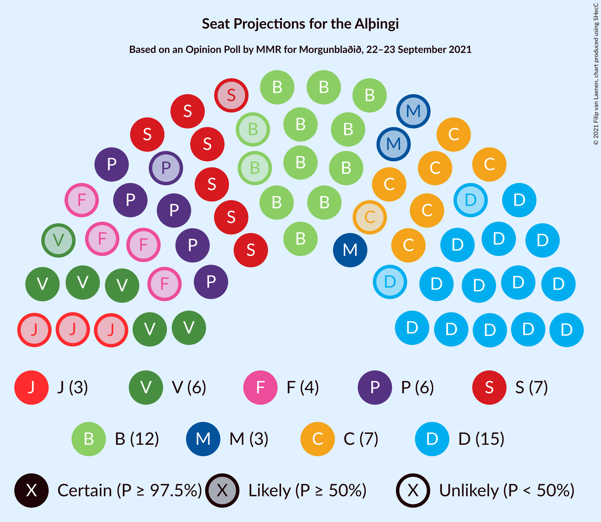
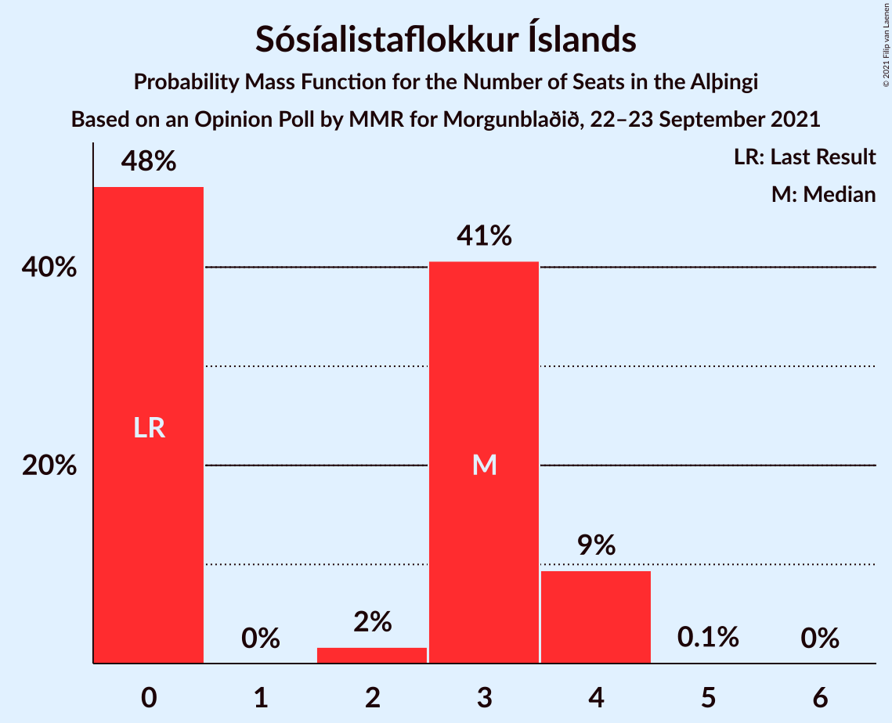
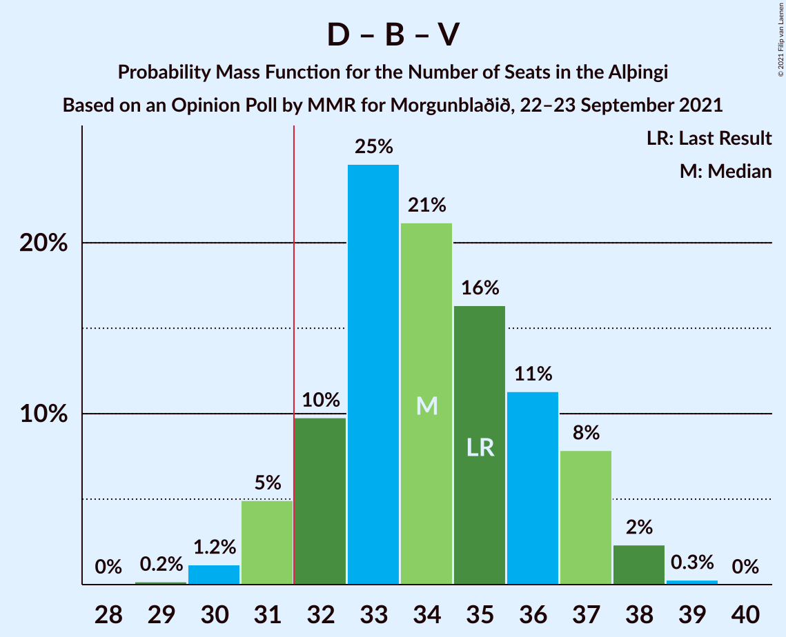
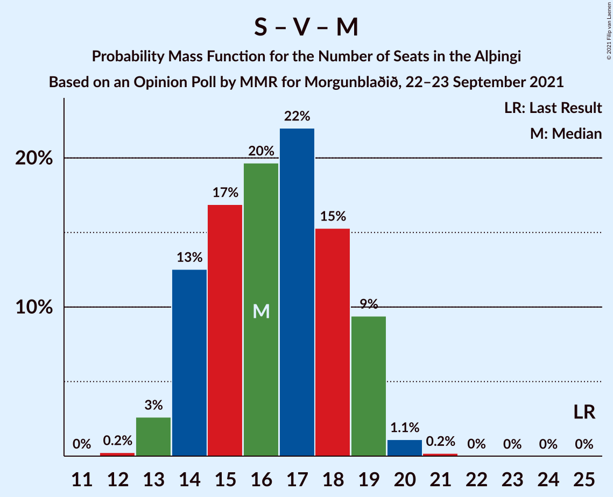

# Opinion Poll by MMR for Morgunblaðið, 22–23 September 2021

<a href="#voting-intentions">Voting Intentions</a> | <a href="#seats">Seats</a> | <a href="#coalitions">Coalitions</a> | <a href="#technical-information">Technical Information</a>

## Voting Intentions

### Confidence Intervals

| Party | Last Result | Poll Result | 80% Confidence Interval | 90% Confidence Interval | 95% Confidence Interval | 99% Confidence Interval |
|:-----:|:-----------:|:-----------:|:-----------------------:|:-----------------------:|:-----------------------:|:-----------------------:|
| Sjálfstæðisflokkurinn | 25.2% | 22.9% | 21.1–24.7% |20.7–25.2% |20.2–25.7% |19.4–26.6% |
| Framsóknarflokkurinn | 10.7% | 16.4% | 14.9–18.0% |14.5–18.5% |14.1–18.9% |13.4–19.7% |
| Viðreisn | 6.7% | 12.0% | 10.7–13.5% |10.3–13.9% |10.0–14.3% |9.4–15.0% |
| Samfylkingin | 12.1% | 11.5% | 10.3–13.0% |9.9–13.4% |9.6–13.8% |9.1–14.5% |
| Píratar | 9.2% | 9.9% | 8.7–11.3% |8.4–11.7% |8.1–12.0% |7.6–12.7% |
| Vinstrihreyfingin – grænt framboð | 16.9% | 9.7% | 8.5–11.0% |8.2–11.4% |7.9–11.8% |7.4–12.5% |
| Flokkur fólksins | 6.9% | 6.2% | 5.2–7.3% |5.0–7.6% |4.8–7.9% |4.4–8.5% |
| Miðflokkurinn | 10.9% | 5.8% | 4.9–7.0% |4.7–7.3% |4.5–7.5% |4.1–8.1% |
| Sósíalistaflokkur Íslands | 0.0% | 5.1% | 4.2–6.1% |4.0–6.4% |3.8–6.7% |3.4–7.2% |

*Note:* The poll result column reflects the actual value used in the calculations. Published results may vary slightly, and in addition be rounded to fewer digits.

## Seats

### Confidence Intervals

| Party | Last Result | Median | 80% Confidence Interval | 90% Confidence Interval | 95% Confidence Interval | 99% Confidence Interval |
|:-----:|:-----------:|:------:|:-----------------------:|:-----------------------:|:-----------------------:|:-----------------------:|
| <a href="#sjálfstæðisflokkurinn">Sjálfstæðisflokkurinn</a> | 16 | 15 | 14–18 |13–19 |13–19 |13–19 |
| <a href="#framsóknarflokkurinn">Framsóknarflokkurinn</a> | 8 | 12 | 11–14 |11–15 |10–15 |10–16 |
| <a href="#viðreisn">Viðreisn</a> | 4 | 7 | 6–9 |6–9 |6–9 |6–10 |
| <a href="#samfylkingin">Samfylkingin</a> | 7 | 7 | 6–8 |6–9 |6–9 |5–10 |
| <a href="#píratar">Píratar</a> | 6 | 6 | 5–7 |5–8 |5–8 |4–8 |
| <a href="#vinstrihreyfingin-–-grænt-framboð">Vinstrihreyfingin – grænt framboð</a> | 11 | 6 | 5–8 |5–8 |5–8 |4–8 |
| <a href="#flokkur-fólksins">Flokkur fólksins</a> | 4 | 4 | 3–4 |0–5 |0–5 |0–5 |
| <a href="#miðflokkurinn">Miðflokkurinn</a> | 7 | 3 | 1–4 |1–4 |1–5 |1–5 |
| <a href="#sósíalistaflokkur-íslands">Sósíalistaflokkur Íslands</a> | 0 | 2 | 0–3 |0–4 |0–4 |0–4 |

### Sjálfstæðisflokkurinn

*For a full overview of the results for this party, see the [Sjálfstæðisflokkurinn](party-sjálfstæðisflokkurinn.html) page.*

| Number of Seats | Probability | Accumulated | Special Marks |
|:---------------:|:-----------:|:-----------:|:-------------:|
| 13 | 10% | 100% |  |
| 14 | 26% | 90% |  |
| 15 | 21% | 64% | Median |
| 16 | 13% | 43% | Last Result |
| 17 | 13% | 30% |  |
| 18 | 9% | 17% |  |
| 19 | 8% | 8% |  |
| 20 | 0% | 0% |  |

### Framsóknarflokkurinn

*For a full overview of the results for this party, see the [Framsóknarflokkurinn](party-framsóknarflokkurinn.html) page.*

| Number of Seats | Probability | Accumulated | Special Marks |
|:---------------:|:-----------:|:-----------:|:-------------:|
| 8 | 0.1% | 100% | Last Result |
| 9 | 0.4% | 99.9% |  |
| 10 | 4% | 99.5% |  |
| 11 | 10% | 95% |  |
| 12 | 52% | 85% | Median |
| 13 | 12% | 33% |  |
| 14 | 15% | 22% |  |
| 15 | 5% | 6% |  |
| 16 | 1.5% | 2% |  |
| 17 | 0.3% | 0.3% |  |
| 18 | 0% | 0% |  |

### Viðreisn

*For a full overview of the results for this party, see the [Viðreisn](party-viðreisn.html) page.*

| Number of Seats | Probability | Accumulated | Special Marks |
|:---------------:|:-----------:|:-----------:|:-------------:|
| 4 | 0% | 100% | Last Result |
| 5 | 0.4% | 100% |  |
| 6 | 15% | 99.6% |  |
| 7 | 40% | 85% | Median |
| 8 | 35% | 45% |  |
| 9 | 10% | 11% |  |
| 10 | 0.5% | 0.5% |  |
| 11 | 0% | 0% |  |

### Samfylkingin

*For a full overview of the results for this party, see the [Samfylkingin](party-samfylkingin.html) page.*

| Number of Seats | Probability | Accumulated | Special Marks |
|:---------------:|:-----------:|:-----------:|:-------------:|
| 5 | 0.5% | 100% |  |
| 6 | 17% | 99.5% |  |
| 7 | 41% | 83% | Last Result, Median |
| 8 | 34% | 42% |  |
| 9 | 6% | 7% |  |
| 10 | 0.7% | 0.7% |  |
| 11 | 0% | 0% |  |

### Píratar

*For a full overview of the results for this party, see the [Píratar](party-píratar.html) page.*

| Number of Seats | Probability | Accumulated | Special Marks |
|:---------------:|:-----------:|:-----------:|:-------------:|
| 4 | 1.4% | 100% |  |
| 5 | 24% | 98.6% |  |
| 6 | 44% | 75% | Last Result, Median |
| 7 | 26% | 31% |  |
| 8 | 5% | 5% |  |
| 9 | 0.3% | 0.3% |  |
| 10 | 0% | 0% |  |

### Vinstrihreyfingin – grænt framboð

*For a full overview of the results for this party, see the [Vinstrihreyfingin – grænt framboð](party-vinstrihreyfingin–græntframboð.html) page.*

| Number of Seats | Probability | Accumulated | Special Marks |
|:---------------:|:-----------:|:-----------:|:-------------:|
| 4 | 2% | 100% |  |
| 5 | 32% | 98% |  |
| 6 | 38% | 66% | Median |
| 7 | 13% | 28% |  |
| 8 | 14% | 15% |  |
| 9 | 0.3% | 0.3% |  |
| 10 | 0% | 0% |  |
| 11 | 0% | 0% | Last Result |

### Flokkur fólksins

*For a full overview of the results for this party, see the [Flokkur fólksins](party-flokkurfólksins.html) page.*

| Number of Seats | Probability | Accumulated | Special Marks |
|:---------------:|:-----------:|:-----------:|:-------------:|
| 0 | 7% | 100% |  |
| 1 | 0% | 93% |  |
| 2 | 0.7% | 93% |  |
| 3 | 34% | 93% |  |
| 4 | 51% | 59% | Last Result, Median |
| 5 | 8% | 8% |  |
| 6 | 0.2% | 0.2% |  |
| 7 | 0% | 0% |  |

### Miðflokkurinn

*For a full overview of the results for this party, see the [Miðflokkurinn](party-miðflokkurinn.html) page.*

| Number of Seats | Probability | Accumulated | Special Marks |
|:---------------:|:-----------:|:-----------:|:-------------:|
| 0 | 0.1% | 100% |  |
| 1 | 13% | 99.9% |  |
| 2 | 0% | 87% |  |
| 3 | 49% | 87% | Median |
| 4 | 35% | 38% |  |
| 5 | 3% | 3% |  |
| 6 | 0.1% | 0.1% |  |
| 7 | 0% | 0% | Last Result |

### Sósíalistaflokkur Íslands

*For a full overview of the results for this party, see the [Sósíalistaflokkur Íslands](party-sósíalistaflokkuríslands.html) page.*

| Number of Seats | Probability | Accumulated | Special Marks |
|:---------------:|:-----------:|:-----------:|:-------------:|
| 0 | 49% | 100% | Last Result |
| 1 | 0% | 51% |  |
| 2 | 4% | 51% | Median |
| 3 | 41% | 47% |  |
| 4 | 6% | 6% |  |
| 5 | 0.1% | 0.1% |  |
| 6 | 0% | 0% |  |

## Coalitions

### Confidence Intervals

| Coalition | Last Result | Median | Majority? | 80% Confidence Interval | 90% Confidence Interval | 95% Confidence Interval | 99% Confidence Interval |
|:---------:|:-----------:|:------:|:---------:|:-----------------------:|:-----------------------:|:-----------------------:|:-----------------------:|
| Sjálfstæðisflokkurinn – Framsóknarflokkurinn – Vinstrihreyfingin – grænt framboð | 35 | 34 | 92% | 32–36 | 31–37 | 31–38 | 30–38 |
| Sjálfstæðisflokkurinn – Framsóknarflokkurinn – Miðflokkurinn | 31 | 31 | 41% | 29–34 | 28–34 | 28–35 | 27–36 |
| Framsóknarflokkurinn – Samfylkingin – Vinstrihreyfingin – grænt framboð – Miðflokkurinn | 33 | 29 | 6% | 27–31 | 26–32 | 26–32 | 25–33 |
| Sjálfstæðisflokkurinn – Framsóknarflokkurinn | 24 | 28 | 4% | 26–30 | 25–31 | 25–32 | 24–33 |
| Viðreisn – Samfylkingin – Píratar – Vinstrihreyfingin – grænt framboð | 28 | 27 | 0.8% | 24–30 | 23–30 | 23–30 | 22–32 |
| Framsóknarflokkurinn – Samfylkingin – Vinstrihreyfingin – grænt framboð | 26 | 26 | 0% | 24–28 | 23–28 | 23–29 | 22–30 |
| Sjálfstæðisflokkurinn – Samfylkingin | 23 | 23 | 0% | 21–26 | 20–26 | 20–26 | 19–27 |
| Sjálfstæðisflokkurinn – Viðreisn | 20 | 23 | 0% | 21–25 | 20–26 | 20–26 | 19–27 |
| Framsóknarflokkurinn – Vinstrihreyfingin – grænt framboð – Miðflokkurinn | 26 | 22 | 0% | 20–24 | 19–24 | 18–25 | 18–27 |
| Sjálfstæðisflokkurinn – Vinstrihreyfingin – grænt framboð | 27 | 22 | 0% | 19–24 | 19–25 | 18–25 | 18–26 |
| Sjálfstæðisflokkurinn – Miðflokkurinn | 23 | 18 | 0% | 16–21 | 16–22 | 15–23 | 14–23 |
| Framsóknarflokkurinn – Vinstrihreyfingin – grænt framboð | 19 | 18 | 0% | 17–20 | 17–21 | 16–22 | 15–23 |
| Samfylkingin – Píratar – Vinstrihreyfingin – grænt framboð | 24 | 20 | 0% | 17–22 | 17–22 | 16–22 | 16–24 |
| Samfylkingin – Vinstrihreyfingin – grænt framboð – Miðflokkurinn | 25 | 17 | 0% | 14–19 | 14–19 | 14–19 | 13–20 |
| Samfylkingin – Vinstrihreyfingin – grænt framboð | 18 | 14 | 0% | 12–15 | 11–16 | 11–16 | 11–17 |
| Píratar – Vinstrihreyfingin – grænt framboð | 17 | 12 | 0% | 10–14 | 10–15 | 10–15 | 9–15 |
| Vinstrihreyfingin – grænt framboð – Miðflokkurinn | 18 | 9 | 0% | 8–11 | 7–12 | 7–12 | 6–12 |

### Sjálfstæðisflokkurinn – Framsóknarflokkurinn – Vinstrihreyfingin – grænt framboð

| Number of Seats | Probability | Accumulated | Special Marks |
|:---------------:|:-----------:|:-----------:|:-------------:|
| 29 | 0.3% | 100% |  |
| 30 | 1.3% | 99.7% |  |
| 31 | 6% | 98% |  |
| 32 | 11% | 92% | Majority |
| 33 | 19% | 82% | Median |
| 34 | 31% | 63% |  |
| 35 | 10% | 32% | Last Result |
| 36 | 12% | 22% |  |
| 37 | 7% | 10% |  |
| 38 | 3% | 3% |  |
| 39 | 0.3% | 0.3% |  |
| 40 | 0% | 0.1% |  |
| 41 | 0.1% | 0.1% |  |
| 42 | 0% | 0% |  |

### Sjálfstæðisflokkurinn – Framsóknarflokkurinn – Miðflokkurinn

| Number of Seats | Probability | Accumulated | Special Marks |
|:---------------:|:-----------:|:-----------:|:-------------:|
| 26 | 0.2% | 100% |  |
| 27 | 2% | 99.8% |  |
| 28 | 6% | 98% |  |
| 29 | 15% | 92% |  |
| 30 | 16% | 77% | Median |
| 31 | 20% | 61% | Last Result |
| 32 | 16% | 41% | Majority |
| 33 | 13% | 25% |  |
| 34 | 7% | 11% |  |
| 35 | 2% | 4% |  |
| 36 | 2% | 2% |  |
| 37 | 0% | 0% |  |

### Framsóknarflokkurinn – Samfylkingin – Vinstrihreyfingin – grænt framboð – Miðflokkurinn

| Number of Seats | Probability | Accumulated | Special Marks |
|:---------------:|:-----------:|:-----------:|:-------------:|
| 24 | 0.3% | 100% |  |
| 25 | 2% | 99.7% |  |
| 26 | 6% | 98% |  |
| 27 | 8% | 92% |  |
| 28 | 18% | 84% | Median |
| 29 | 31% | 65% |  |
| 30 | 18% | 34% |  |
| 31 | 10% | 16% |  |
| 32 | 4% | 6% | Majority |
| 33 | 2% | 2% | Last Result |
| 34 | 0% | 0.1% |  |
| 35 | 0.1% | 0.1% |  |
| 36 | 0% | 0% |  |

### Sjálfstæðisflokkurinn – Framsóknarflokkurinn

| Number of Seats | Probability | Accumulated | Special Marks |
|:---------------:|:-----------:|:-----------:|:-------------:|
| 23 | 0.2% | 100% |  |
| 24 | 1.3% | 99.8% | Last Result |
| 25 | 5% | 98.5% |  |
| 26 | 19% | 94% |  |
| 27 | 18% | 75% | Median |
| 28 | 21% | 57% |  |
| 29 | 13% | 36% |  |
| 30 | 16% | 23% |  |
| 31 | 3% | 7% |  |
| 32 | 1.4% | 4% | Majority |
| 33 | 2% | 2% |  |
| 34 | 0.1% | 0.1% |  |
| 35 | 0% | 0% |  |

### Viðreisn – Samfylkingin – Píratar – Vinstrihreyfingin – grænt framboð

| Number of Seats | Probability | Accumulated | Special Marks |
|:---------------:|:-----------:|:-----------:|:-------------:|
| 21 | 0.1% | 100% |  |
| 22 | 2% | 99.9% |  |
| 23 | 3% | 98% |  |
| 24 | 6% | 95% |  |
| 25 | 13% | 89% |  |
| 26 | 20% | 76% | Median |
| 27 | 17% | 55% |  |
| 28 | 15% | 38% | Last Result |
| 29 | 11% | 23% |  |
| 30 | 11% | 12% |  |
| 31 | 0.7% | 1.5% |  |
| 32 | 0.4% | 0.8% | Majority |
| 33 | 0.4% | 0.4% |  |
| 34 | 0% | 0% |  |

### Framsóknarflokkurinn – Samfylkingin – Vinstrihreyfingin – grænt framboð

| Number of Seats | Probability | Accumulated | Special Marks |
|:---------------:|:-----------:|:-----------:|:-------------:|
| 21 | 0.1% | 100% |  |
| 22 | 2% | 99.9% |  |
| 23 | 6% | 98% |  |
| 24 | 14% | 92% |  |
| 25 | 13% | 78% | Median |
| 26 | 33% | 65% | Last Result |
| 27 | 21% | 32% |  |
| 28 | 7% | 11% |  |
| 29 | 3% | 4% |  |
| 30 | 0.6% | 0.7% |  |
| 31 | 0.1% | 0.1% |  |
| 32 | 0% | 0% | Majority |

### Sjálfstæðisflokkurinn – Samfylkingin

| Number of Seats | Probability | Accumulated | Special Marks |
|:---------------:|:-----------:|:-----------:|:-------------:|
| 19 | 2% | 100% |  |
| 20 | 7% | 98% |  |
| 21 | 21% | 91% |  |
| 22 | 12% | 70% | Median |
| 23 | 21% | 58% | Last Result |
| 24 | 17% | 37% |  |
| 25 | 9% | 19% |  |
| 26 | 10% | 10% |  |
| 27 | 0.5% | 0.6% |  |
| 28 | 0.1% | 0.1% |  |
| 29 | 0% | 0% |  |

### Sjálfstæðisflokkurinn – Viðreisn

| Number of Seats | Probability | Accumulated | Special Marks |
|:---------------:|:-----------:|:-----------:|:-------------:|
| 19 | 0.8% | 100% |  |
| 20 | 5% | 99.2% | Last Result |
| 21 | 20% | 95% |  |
| 22 | 17% | 75% | Median |
| 23 | 22% | 58% |  |
| 24 | 16% | 36% |  |
| 25 | 11% | 20% |  |
| 26 | 7% | 9% |  |
| 27 | 2% | 2% |  |
| 28 | 0.2% | 0.2% |  |
| 29 | 0% | 0% |  |

### Framsóknarflokkurinn – Vinstrihreyfingin – grænt framboð – Miðflokkurinn

| Number of Seats | Probability | Accumulated | Special Marks |
|:---------------:|:-----------:|:-----------:|:-------------:|
| 17 | 0.4% | 100% |  |
| 18 | 2% | 99.6% |  |
| 19 | 5% | 97% |  |
| 20 | 9% | 93% |  |
| 21 | 32% | 84% | Median |
| 22 | 30% | 52% |  |
| 23 | 11% | 22% |  |
| 24 | 7% | 10% |  |
| 25 | 2% | 4% |  |
| 26 | 1.2% | 2% | Last Result |
| 27 | 0.9% | 0.9% |  |
| 28 | 0% | 0% |  |

### Sjálfstæðisflokkurinn – Vinstrihreyfingin – grænt framboð

| Number of Seats | Probability | Accumulated | Special Marks |
|:---------------:|:-----------:|:-----------:|:-------------:|
| 17 | 0.2% | 100% |  |
| 18 | 4% | 99.8% |  |
| 19 | 15% | 96% |  |
| 20 | 9% | 80% |  |
| 21 | 17% | 72% | Median |
| 22 | 23% | 55% |  |
| 23 | 14% | 31% |  |
| 24 | 12% | 18% |  |
| 25 | 5% | 5% |  |
| 26 | 0.9% | 0.9% |  |
| 27 | 0% | 0% | Last Result |

### Sjálfstæðisflokkurinn – Miðflokkurinn

| Number of Seats | Probability | Accumulated | Special Marks |
|:---------------:|:-----------:|:-----------:|:-------------:|
| 14 | 0.5% | 100% |  |
| 15 | 3% | 99.5% |  |
| 16 | 9% | 96% |  |
| 17 | 18% | 87% |  |
| 18 | 22% | 69% | Median |
| 19 | 11% | 47% |  |
| 20 | 16% | 36% |  |
| 21 | 11% | 20% |  |
| 22 | 5% | 9% |  |
| 23 | 3% | 3% | Last Result |
| 24 | 0.1% | 0.1% |  |
| 25 | 0% | 0% |  |

### Framsóknarflokkurinn – Vinstrihreyfingin – grænt framboð

| Number of Seats | Probability | Accumulated | Special Marks |
|:---------------:|:-----------:|:-----------:|:-------------:|
| 14 | 0.2% | 100% |  |
| 15 | 2% | 99.8% |  |
| 16 | 2% | 98% |  |
| 17 | 17% | 95% |  |
| 18 | 32% | 79% | Median |
| 19 | 26% | 46% | Last Result |
| 20 | 13% | 20% |  |
| 21 | 4% | 7% |  |
| 22 | 2% | 3% |  |
| 23 | 1.3% | 1.4% |  |
| 24 | 0% | 0% |  |

### Samfylkingin – Píratar – Vinstrihreyfingin – grænt framboð

| Number of Seats | Probability | Accumulated | Special Marks |
|:---------------:|:-----------:|:-----------:|:-------------:|
| 15 | 0.3% | 100% |  |
| 16 | 3% | 99.6% |  |
| 17 | 13% | 97% |  |
| 18 | 17% | 83% |  |
| 19 | 16% | 67% | Median |
| 20 | 21% | 51% |  |
| 21 | 12% | 30% |  |
| 22 | 17% | 18% |  |
| 23 | 1.1% | 2% |  |
| 24 | 0.5% | 0.6% | Last Result |
| 25 | 0% | 0% |  |

### Samfylkingin – Vinstrihreyfingin – grænt framboð – Miðflokkurinn

| Number of Seats | Probability | Accumulated | Special Marks |
|:---------------:|:-----------:|:-----------:|:-------------:|
| 12 | 0.3% | 100% |  |
| 13 | 2% | 99.7% |  |
| 14 | 9% | 98% |  |
| 15 | 21% | 89% |  |
| 16 | 15% | 68% | Median |
| 17 | 25% | 53% |  |
| 18 | 11% | 27% |  |
| 19 | 16% | 17% |  |
| 20 | 0.8% | 1.0% |  |
| 21 | 0.2% | 0.2% |  |
| 22 | 0% | 0% |  |
| 23 | 0% | 0% |  |
| 24 | 0% | 0% |  |
| 25 | 0% | 0% | Last Result |

### Samfylkingin – Vinstrihreyfingin – grænt framboð

| Number of Seats | Probability | Accumulated | Special Marks |
|:---------------:|:-----------:|:-----------:|:-------------:|
| 10 | 0.4% | 100% |  |
| 11 | 9% | 99.6% |  |
| 12 | 25% | 90% |  |
| 13 | 14% | 66% | Median |
| 14 | 30% | 52% |  |
| 15 | 14% | 22% |  |
| 16 | 7% | 8% |  |
| 17 | 0.6% | 0.6% |  |
| 18 | 0% | 0% | Last Result |

### Píratar – Vinstrihreyfingin – grænt framboð

| Number of Seats | Probability | Accumulated | Special Marks |
|:---------------:|:-----------:|:-----------:|:-------------:|
| 9 | 2% | 100% |  |
| 10 | 9% | 98% |  |
| 11 | 29% | 89% |  |
| 12 | 21% | 60% | Median |
| 13 | 19% | 40% |  |
| 14 | 14% | 21% |  |
| 15 | 7% | 7% |  |
| 16 | 0.3% | 0.3% |  |
| 17 | 0% | 0% | Last Result |

### Vinstrihreyfingin – grænt framboð – Miðflokkurinn

| Number of Seats | Probability | Accumulated | Special Marks |
|:---------------:|:-----------:|:-----------:|:-------------:|
| 5 | 0.1% | 100% |  |
| 6 | 1.3% | 99.9% |  |
| 7 | 8% | 98.6% |  |
| 8 | 22% | 91% |  |
| 9 | 32% | 69% | Median |
| 10 | 18% | 37% |  |
| 11 | 13% | 19% |  |
| 12 | 6% | 6% |  |
| 13 | 0.2% | 0.2% |  |
| 14 | 0% | 0% |  |
| 15 | 0% | 0% |  |
| 16 | 0% | 0% |  |
| 17 | 0% | 0% |  |
| 18 | 0% | 0% | Last Result |

## Technical Information

### Opinion Poll

+ **Polling firm:** MMR
+ **Commissioner(s):** Morgunblaðið
+ **Fieldwork period:** 22–23 September 2021

### Calculations

+ **Sample size:** 910
+ **Simulations done:** 524,288
+ **Error estimate:** 2.64%

