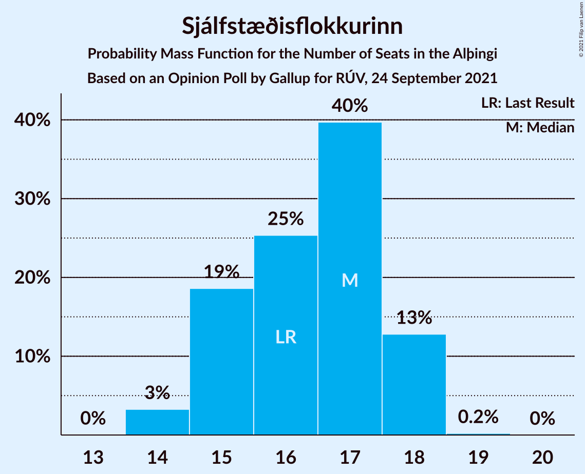

# Opinion Poll by Gallup for RÚV, 24 September 2021

<a href="#voting-intentions">Voting Intentions</a> | <a href="#seats">Seats</a> | <a href="#coalitions">Coalitions</a> | <a href="#technical-information">Technical Information</a>

## Voting Intentions

### Confidence Intervals

| Party | Last Result | Poll Result | 80% Confidence Interval | 90% Confidence Interval | 95% Confidence Interval | 99% Confidence Interval |
|:-----:|:-----------:|:-----------:|:-----------------------:|:-----------------------:|:-----------------------:|:-----------------------:|
| Sjálfstæðisflokkurinn | 25.2% | 23.4% | 22.6–24.2% |22.4–24.4% |22.2–24.6% |21.9–25.0% |
| Framsóknarflokkurinn | 10.7% | 14.9% | 14.3–15.6% |14.1–15.8% |13.9–15.9% |13.6–16.3% |
| Samfylkingin | 12.1% | 12.6% | 12.0–13.2% |11.8–13.4% |11.7–13.6% |11.4–13.9% |
| Vinstrihreyfingin – grænt framboð | 16.9% | 12.0% | 11.4–12.6% |11.2–12.8% |11.1–12.9% |10.8–13.2% |
| Viðreisn | 6.7% | 9.2% | 8.7–9.7% |8.5–9.9% |8.4–10.0% |8.2–10.3% |
| Píratar | 9.2% | 8.8% | 8.3–9.3% |8.2–9.5% |8.0–9.6% |7.8–9.9% |
| Miðflokkurinn | 10.9% | 6.8% | 6.4–7.3% |6.2–7.4% |6.1–7.5% |5.9–7.8% |
| Flokkur fólksins | 6.9% | 6.4% | 6.0–6.9% |5.9–7.0% |5.7–7.1% |5.5–7.4% |
| Sósíalistaflokkur Íslands | 0.0% | 5.3% | 4.9–5.7% |4.8–5.9% |4.7–6.0% |4.5–6.2% |

*Note:* The poll result column reflects the actual value used in the calculations. Published results may vary slightly, and in addition be rounded to fewer digits.

## Seats

### Confidence Intervals

| Party | Last Result | Median | 80% Confidence Interval | 90% Confidence Interval | 95% Confidence Interval | 99% Confidence Interval |
|:-----:|:-----------:|:------:|:-----------------------:|:-----------------------:|:-----------------------:|:-----------------------:|
| <a href="#sjálfstæðisflokkurinn">Sjálfstæðisflokkurinn</a> | 16 | 17 | 15–18 |15–18 |14–18 |14–18 |
| <a href="#framsóknarflokkurinn">Framsóknarflokkurinn</a> | 8 | 11 | 11–12 |11–12 |10–12 |9–12 |
| <a href="#samfylkingin">Samfylkingin</a> | 7 | 7 | 7–9 |7–9 |7–9 |6–10 |
| <a href="#vinstrihreyfingin-–-grænt-framboð">Vinstrihreyfingin – grænt framboð</a> | 11 | 8 | 7–9 |7–9 |7–9 |6–9 |
| <a href="#viðreisn">Viðreisn</a> | 4 | 5 | 5–6 |5–6 |5–6 |4–6 |
| <a href="#píratar">Píratar</a> | 6 | 5 | 5–6 |4–6 |4–6 |4–6 |
| <a href="#miðflokkurinn">Miðflokkurinn</a> | 7 | 4 | 3–4 |3–4 |3–4 |3–5 |
| <a href="#flokkur-fólksins">Flokkur fólksins</a> | 4 | 4 | 3–4 |3–4 |3–4 |3–4 |
| <a href="#sósíalistaflokkur-íslands">Sósíalistaflokkur Íslands</a> | 0 | 3 | 0–3 |0–3 |0–3 |0–3 |

### Sjálfstæðisflokkurinn

*For a full overview of the results for this party, see the [Sjálfstæðisflokkurinn](party-sjálfstæðisflokkurinn.html) page.*

| Number of Seats | Probability | Accumulated | Special Marks |
|:---------------:|:-----------:|:-----------:|:-------------:|
| 14 | 3% | 100% |  |
| 15 | 19% | 97% |  |
| 16 | 25% | 78% | Last Result |
| 17 | 40% | 53% | Median |
| 18 | 13% | 13% |  |
| 19 | 0.2% | 0.2% |  |
| 20 | 0% | 0% |  |

### Framsóknarflokkurinn

*For a full overview of the results for this party, see the [Framsóknarflokkurinn](party-framsóknarflokkurinn.html) page.*

| Number of Seats | Probability | Accumulated | Special Marks |
|:---------------:|:-----------:|:-----------:|:-------------:|
| 8 | 0% | 100% | Last Result |
| 9 | 0.8% | 100% |  |
| 10 | 4% | 99.2% |  |
| 11 | 76% | 95% | Median |
| 12 | 20% | 20% |  |
| 13 | 0% | 0% |  |

### Samfylkingin

*For a full overview of the results for this party, see the [Samfylkingin](party-samfylkingin.html) page.*

| Number of Seats | Probability | Accumulated | Special Marks |
|:---------------:|:-----------:|:-----------:|:-------------:|
| 6 | 1.5% | 100% |  |
| 7 | 58% | 98.5% | Last Result, Median |
| 8 | 27% | 40% |  |
| 9 | 11% | 13% |  |
| 10 | 2% | 2% |  |
| 11 | 0% | 0% |  |

### Vinstrihreyfingin – grænt framboð

*For a full overview of the results for this party, see the [Vinstrihreyfingin – grænt framboð](party-vinstrihreyfingin–græntframboð.html) page.*

| Number of Seats | Probability | Accumulated | Special Marks |
|:---------------:|:-----------:|:-----------:|:-------------:|
| 6 | 2% | 100% |  |
| 7 | 15% | 98% |  |
| 8 | 71% | 83% | Median |
| 9 | 12% | 12% |  |
| 10 | 0% | 0% |  |
| 11 | 0% | 0% | Last Result |

### Viðreisn

*For a full overview of the results for this party, see the [Viðreisn](party-viðreisn.html) page.*

| Number of Seats | Probability | Accumulated | Special Marks |
|:---------------:|:-----------:|:-----------:|:-------------:|
| 4 | 2% | 100% | Last Result |
| 5 | 76% | 98% | Median |
| 6 | 23% | 23% |  |
| 7 | 0.3% | 0.3% |  |
| 8 | 0% | 0% |  |

### Píratar

*For a full overview of the results for this party, see the [Píratar](party-píratar.html) page.*

| Number of Seats | Probability | Accumulated | Special Marks |
|:---------------:|:-----------:|:-----------:|:-------------:|
| 4 | 6% | 100% |  |
| 5 | 83% | 94% | Median |
| 6 | 11% | 11% | Last Result |
| 7 | 0% | 0% |  |

### Miðflokkurinn

*For a full overview of the results for this party, see the [Miðflokkurinn](party-miðflokkurinn.html) page.*

| Number of Seats | Probability | Accumulated | Special Marks |
|:---------------:|:-----------:|:-----------:|:-------------:|
| 3 | 24% | 100% |  |
| 4 | 75% | 76% | Median |
| 5 | 1.0% | 1.0% |  |
| 6 | 0% | 0% |  |
| 7 | 0% | 0% | Last Result |

### Flokkur fólksins

*For a full overview of the results for this party, see the [Flokkur fólksins](party-flokkurfólksins.html) page.*

| Number of Seats | Probability | Accumulated | Special Marks |
|:---------------:|:-----------:|:-----------:|:-------------:|
| 3 | 50% | 100% |  |
| 4 | 50% | 50% | Last Result, Median |
| 5 | 0.1% | 0.1% |  |
| 6 | 0% | 0% |  |

### Sósíalistaflokkur Íslands

*For a full overview of the results for this party, see the [Sósíalistaflokkur Íslands](party-sósíalistaflokkuríslands.html) page.*

| Number of Seats | Probability | Accumulated | Special Marks |
|:---------------:|:-----------:|:-----------:|:-------------:|
| 0 | 17% | 100% | Last Result |
| 1 | 0% | 83% |  |
| 2 | 2% | 83% |  |
| 3 | 80% | 80% | Median |
| 4 | 0.2% | 0.2% |  |
| 5 | 0% | 0% |  |

## Coalitions

### Confidence Intervals

| Coalition | Last Result | Median | Majority? | 80% Confidence Interval | 90% Confidence Interval | 95% Confidence Interval | 99% Confidence Interval |
|:---------:|:-----------:|:------:|:---------:|:-----------------------:|:-----------------------:|:-----------------------:|:-----------------------:|
| Sjálfstæðisflokkurinn – Framsóknarflokkurinn – Vinstrihreyfingin – grænt framboð | 35 | 36 | 100% | 34–37 | 34–37 | 33–37 | 33–38 |
| Sjálfstæðisflokkurinn – Framsóknarflokkurinn – Miðflokkurinn | 31 | 31 | 45% | 30–33 | 30–33 | 29–34 | 29–34 |
| Framsóknarflokkurinn – Samfylkingin – Vinstrihreyfingin – grænt framboð – Miðflokkurinn | 33 | 30 | 14% | 29–32 | 29–32 | 29–33 | 28–33 |
| Sjálfstæðisflokkurinn – Framsóknarflokkurinn | 24 | 28 | 0% | 26–29 | 26–30 | 25–30 | 25–30 |
| Framsóknarflokkurinn – Samfylkingin – Vinstrihreyfingin – grænt framboð | 26 | 26 | 0% | 26–28 | 25–28 | 25–29 | 24–29 |
| Samfylkingin – Vinstrihreyfingin – grænt framboð – Viðreisn – Píratar | 28 | 25 | 0% | 24–27 | 24–28 | 24–28 | 23–29 |
| Sjálfstæðisflokkurinn – Samfylkingin | 23 | 24 | 0% | 23–25 | 22–26 | 22–26 | 21–26 |
| Sjálfstæðisflokkurinn – Vinstrihreyfingin – grænt framboð | 27 | 25 | 0% | 23–25 | 22–26 | 22–26 | 22–27 |
| Framsóknarflokkurinn – Vinstrihreyfingin – grænt framboð – Miðflokkurinn | 26 | 23 | 0% | 22–24 | 22–24 | 21–24 | 21–25 |
| Sjálfstæðisflokkurinn – Viðreisn | 20 | 22 | 0% | 20–23 | 20–23 | 20–23 | 19–24 |
| Samfylkingin – Vinstrihreyfingin – grænt framboð – Píratar | 24 | 20 | 0% | 19–22 | 19–22 | 19–23 | 18–23 |
| Sjálfstæðisflokkurinn – Miðflokkurinn | 23 | 20 | 0% | 19–21 | 18–22 | 18–22 | 18–22 |
| Samfylkingin – Vinstrihreyfingin – grænt framboð – Miðflokkurinn | 25 | 19 | 0% | 18–21 | 17–21 | 17–21 | 17–22 |
| Framsóknarflokkurinn – Vinstrihreyfingin – grænt framboð | 19 | 19 | 0% | 19–20 | 18–20 | 18–20 | 17–21 |
| Samfylkingin – Vinstrihreyfingin – grænt framboð | 18 | 15 | 0% | 14–17 | 14–17 | 14–17 | 13–18 |
| Vinstrihreyfingin – grænt framboð – Píratar | 17 | 13 | 0% | 12–14 | 12–14 | 11–14 | 11–15 |
| Vinstrihreyfingin – grænt framboð – Miðflokkurinn | 18 | 12 | 0% | 11–12 | 10–13 | 10–13 | 10–13 |

### Sjálfstæðisflokkurinn – Framsóknarflokkurinn – Vinstrihreyfingin – grænt framboð

| Number of Seats | Probability | Accumulated | Special Marks |
|:---------------:|:-----------:|:-----------:|:-------------:|
| 32 | 0.1% | 100% | Majority |
| 33 | 3% | 99.9% |  |
| 34 | 14% | 97% |  |
| 35 | 28% | 83% | Last Result |
| 36 | 45% | 55% | Median |
| 37 | 8% | 10% |  |
| 38 | 2% | 2% |  |
| 39 | 0.1% | 0.1% |  |
| 40 | 0% | 0% |  |

### Sjálfstæðisflokkurinn – Framsóknarflokkurinn – Miðflokkurinn

| Number of Seats | Probability | Accumulated | Special Marks |
|:---------------:|:-----------:|:-----------:|:-------------:|
| 28 | 0.2% | 100% |  |
| 29 | 4% | 99.8% |  |
| 30 | 20% | 95% |  |
| 31 | 30% | 75% | Last Result |
| 32 | 32% | 45% | Median, Majority |
| 33 | 11% | 13% |  |
| 34 | 3% | 3% |  |
| 35 | 0% | 0% |  |

### Framsóknarflokkurinn – Samfylkingin – Vinstrihreyfingin – grænt framboð – Miðflokkurinn

| Number of Seats | Probability | Accumulated | Special Marks |
|:---------------:|:-----------:|:-----------:|:-------------:|
| 27 | 0.1% | 100% |  |
| 28 | 2% | 99.9% |  |
| 29 | 17% | 98% |  |
| 30 | 39% | 81% | Median |
| 31 | 27% | 41% |  |
| 32 | 11% | 14% | Majority |
| 33 | 3% | 3% | Last Result |
| 34 | 0% | 0% |  |

### Sjálfstæðisflokkurinn – Framsóknarflokkurinn

| Number of Seats | Probability | Accumulated | Special Marks |
|:---------------:|:-----------:|:-----------:|:-------------:|
| 24 | 0% | 100% | Last Result |
| 25 | 3% | 100% |  |
| 26 | 15% | 97% |  |
| 27 | 27% | 81% |  |
| 28 | 37% | 54% | Median |
| 29 | 12% | 17% |  |
| 30 | 5% | 5% |  |
| 31 | 0% | 0% |  |

### Framsóknarflokkurinn – Samfylkingin – Vinstrihreyfingin – grænt framboð

| Number of Seats | Probability | Accumulated | Special Marks |
|:---------------:|:-----------:|:-----------:|:-------------:|
| 24 | 0.9% | 100% |  |
| 25 | 5% | 99.1% |  |
| 26 | 45% | 94% | Last Result, Median |
| 27 | 33% | 48% |  |
| 28 | 13% | 16% |  |
| 29 | 3% | 3% |  |
| 30 | 0% | 0% |  |

### Samfylkingin – Vinstrihreyfingin – grænt framboð – Viðreisn – Píratar

| Number of Seats | Probability | Accumulated | Special Marks |
|:---------------:|:-----------:|:-----------:|:-------------:|
| 22 | 0.1% | 100% |  |
| 23 | 2% | 99.9% |  |
| 24 | 9% | 98% |  |
| 25 | 40% | 89% | Median |
| 26 | 23% | 49% |  |
| 27 | 17% | 26% |  |
| 28 | 7% | 9% | Last Result |
| 29 | 2% | 2% |  |
| 30 | 0.1% | 0.1% |  |
| 31 | 0% | 0% |  |

### Sjálfstæðisflokkurinn – Samfylkingin

| Number of Seats | Probability | Accumulated | Special Marks |
|:---------------:|:-----------:|:-----------:|:-------------:|
| 21 | 0.6% | 100% |  |
| 22 | 6% | 99.4% |  |
| 23 | 23% | 93% | Last Result |
| 24 | 46% | 71% | Median |
| 25 | 20% | 25% |  |
| 26 | 5% | 5% |  |
| 27 | 0.2% | 0.2% |  |
| 28 | 0% | 0% |  |

### Sjálfstæðisflokkurinn – Vinstrihreyfingin – grænt framboð

| Number of Seats | Probability | Accumulated | Special Marks |
|:---------------:|:-----------:|:-----------:|:-------------:|
| 21 | 0.3% | 100% |  |
| 22 | 6% | 99.7% |  |
| 23 | 13% | 93% |  |
| 24 | 29% | 80% |  |
| 25 | 43% | 51% | Median |
| 26 | 7% | 8% |  |
| 27 | 0.5% | 0.5% | Last Result |
| 28 | 0% | 0% |  |

### Framsóknarflokkurinn – Vinstrihreyfingin – grænt framboð – Miðflokkurinn

| Number of Seats | Probability | Accumulated | Special Marks |
|:---------------:|:-----------:|:-----------:|:-------------:|
| 20 | 0.2% | 100% |  |
| 21 | 2% | 99.8% |  |
| 22 | 24% | 97% |  |
| 23 | 61% | 73% | Median |
| 24 | 12% | 12% |  |
| 25 | 0.7% | 0.7% |  |
| 26 | 0% | 0% | Last Result |

### Sjálfstæðisflokkurinn – Viðreisn

| Number of Seats | Probability | Accumulated | Special Marks |
|:---------------:|:-----------:|:-----------:|:-------------:|
| 19 | 2% | 100% |  |
| 20 | 15% | 98% | Last Result |
| 21 | 25% | 83% |  |
| 22 | 35% | 57% | Median |
| 23 | 21% | 23% |  |
| 24 | 1.4% | 1.4% |  |
| 25 | 0.1% | 0.1% |  |
| 26 | 0% | 0% |  |

### Samfylkingin – Vinstrihreyfingin – grænt framboð – Píratar

| Number of Seats | Probability | Accumulated | Special Marks |
|:---------------:|:-----------:|:-----------:|:-------------:|
| 17 | 0.2% | 100% |  |
| 18 | 2% | 99.8% |  |
| 19 | 9% | 98% |  |
| 20 | 49% | 89% | Median |
| 21 | 21% | 40% |  |
| 22 | 16% | 19% |  |
| 23 | 4% | 4% |  |
| 24 | 0.1% | 0.1% | Last Result |
| 25 | 0% | 0% |  |

### Sjálfstæðisflokkurinn – Miðflokkurinn

| Number of Seats | Probability | Accumulated | Special Marks |
|:---------------:|:-----------:|:-----------:|:-------------:|
| 17 | 0.2% | 100% |  |
| 18 | 5% | 99.8% |  |
| 19 | 22% | 95% |  |
| 20 | 29% | 73% |  |
| 21 | 36% | 43% | Median |
| 22 | 7% | 7% |  |
| 23 | 0.2% | 0.2% | Last Result |
| 24 | 0% | 0% |  |

### Samfylkingin – Vinstrihreyfingin – grænt framboð – Miðflokkurinn

| Number of Seats | Probability | Accumulated | Special Marks |
|:---------------:|:-----------:|:-----------:|:-------------:|
| 16 | 0.1% | 100% |  |
| 17 | 5% | 99.9% |  |
| 18 | 17% | 95% |  |
| 19 | 45% | 78% | Median |
| 20 | 19% | 33% |  |
| 21 | 12% | 14% |  |
| 22 | 2% | 2% |  |
| 23 | 0% | 0% |  |
| 24 | 0% | 0% |  |
| 25 | 0% | 0% | Last Result |

### Framsóknarflokkurinn – Vinstrihreyfingin – grænt framboð

| Number of Seats | Probability | Accumulated | Special Marks |
|:---------------:|:-----------:|:-----------:|:-------------:|
| 17 | 1.3% | 100% |  |
| 18 | 7% | 98.7% |  |
| 19 | 76% | 91% | Last Result, Median |
| 20 | 15% | 15% |  |
| 21 | 0.7% | 0.7% |  |
| 22 | 0% | 0% |  |

### Samfylkingin – Vinstrihreyfingin – grænt framboð

| Number of Seats | Probability | Accumulated | Special Marks |
|:---------------:|:-----------:|:-----------:|:-------------:|
| 13 | 2% | 100% |  |
| 14 | 8% | 98% |  |
| 15 | 49% | 90% | Median |
| 16 | 25% | 41% |  |
| 17 | 13% | 15% |  |
| 18 | 2% | 2% | Last Result |
| 19 | 0% | 0% |  |

### Vinstrihreyfingin – grænt framboð – Píratar

| Number of Seats | Probability | Accumulated | Special Marks |
|:---------------:|:-----------:|:-----------:|:-------------:|
| 10 | 0.3% | 100% |  |
| 11 | 3% | 99.7% |  |
| 12 | 18% | 97% |  |
| 13 | 61% | 80% | Median |
| 14 | 17% | 18% |  |
| 15 | 2% | 2% |  |
| 16 | 0% | 0% |  |
| 17 | 0% | 0% | Last Result |

### Vinstrihreyfingin – grænt framboð – Miðflokkurinn

| Number of Seats | Probability | Accumulated | Special Marks |
|:---------------:|:-----------:|:-----------:|:-------------:|
| 9 | 0.2% | 100% |  |
| 10 | 6% | 99.8% |  |
| 11 | 28% | 94% |  |
| 12 | 56% | 66% | Median |
| 13 | 9% | 9% |  |
| 14 | 0.2% | 0.2% |  |
| 15 | 0% | 0% |  |
| 16 | 0% | 0% |  |
| 17 | 0% | 0% |  |
| 18 | 0% | 0% | Last Result |

## Technical Information

### Opinion Poll

+ **Polling firm:** Gallup
+ **Commissioner(s):** RÚV
+ **Fieldwork period:** 24 September 2021

### Calculations

+ **Sample size:** 4809
+ **Simulations done:** 1,048,576
+ **Error estimate:** 0.78%

