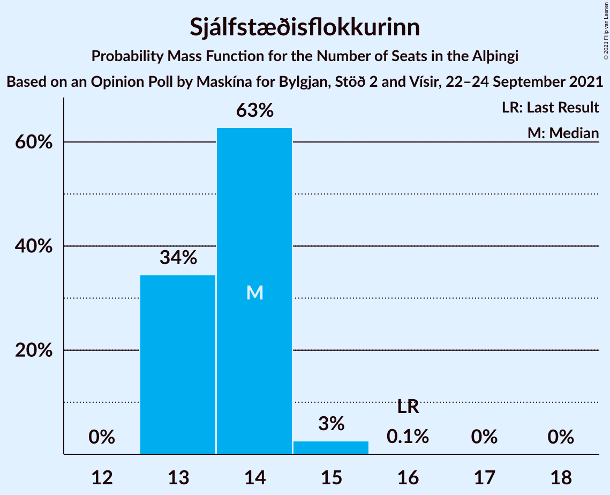
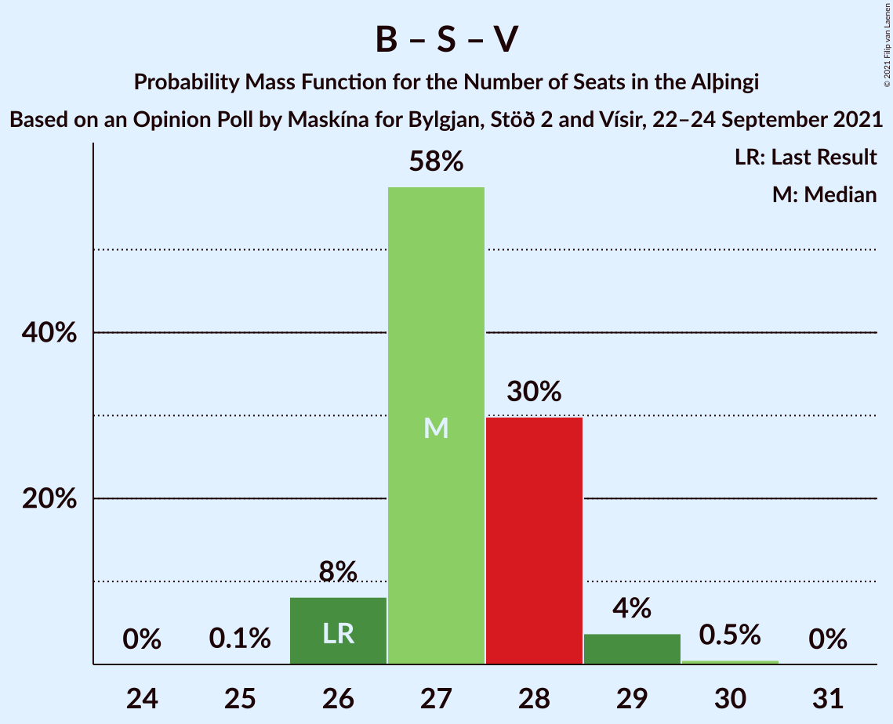
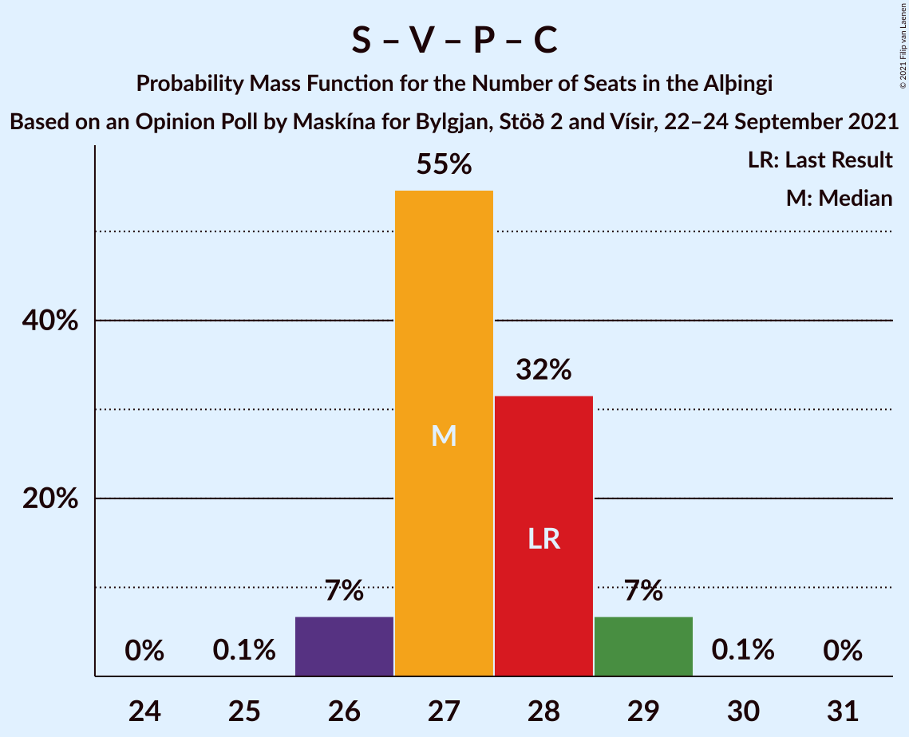

# Opinion Poll by Maskína for Bylgjan, Stöð 2 and Vísir, 22–24 September 2021

<a href="#voting-intentions">Voting Intentions</a> | <a href="#seats">Seats</a> | <a href="#coalitions">Coalitions</a> | <a href="#technical-information">Technical Information</a>

## Voting Intentions

### Confidence Intervals

| Party | Last Result | Poll Result | 80% Confidence Interval | 90% Confidence Interval | 95% Confidence Interval | 99% Confidence Interval |
|:-----:|:-----------:|:-----------:|:-----------------------:|:-----------------------:|:-----------------------:|:-----------------------:|
| Sjálfstæðisflokkurinn | 25.2% | 21.4% | 20.7–22.1% |20.5–22.3% |20.4–22.5% |20.1–22.8% |
| Framsóknarflokkurinn | 10.7% | 15.4% | 14.8–16.0% |14.6–16.2% |14.5–16.4% |14.2–16.6% |
| Samfylkingin | 12.1% | 13.8% | 13.2–14.4% |13.1–14.6% |12.9–14.7% |12.7–15.0% |
| Vinstrihreyfingin – grænt framboð | 16.9% | 10.5% | 10.0–11.0% |9.9–11.2% |9.7–11.3% |9.5–11.6% |
| Píratar | 9.2% | 10.2% | 9.7–10.7% |9.6–10.9% |9.4–11.0% |9.2–11.2% |
| Viðreisn | 6.7% | 10.1% | 9.6–10.6% |9.5–10.8% |9.3–10.9% |9.1–11.1% |
| Flokkur fólksins | 6.9% | 6.2% | 5.8–6.6% |5.7–6.8% |5.6–6.8% |5.4–7.1% |
| Sósíalistaflokkur Íslands | 0.0% | 6.1% | 5.7–6.5% |5.6–6.6% |5.5–6.7% |5.3–7.0% |
| Miðflokkurinn | 10.9% | 5.5% | 5.1–5.9% |5.0–6.0% |4.9–6.1% |4.8–6.3% |

*Note:* The poll result column reflects the actual value used in the calculations. Published results may vary slightly, and in addition be rounded to fewer digits.

## Seats

### Confidence Intervals

| Party | Last Result | Median | 80% Confidence Interval | 90% Confidence Interval | 95% Confidence Interval | 99% Confidence Interval |
|:-----:|:-----------:|:------:|:-----------------------:|:-----------------------:|:-----------------------:|:-----------------------:|
| <a href="#sjálfstæðisflokkurinn">Sjálfstæðisflokkurinn</a> | 16 | 14 | 13–14 |13–14 |13–15 |13–15 |
| <a href="#framsóknarflokkurinn">Framsóknarflokkurinn</a> | 8 | 12 | 12 |12 |11–13 |11–13 |
| <a href="#samfylkingin">Samfylkingin</a> | 7 | 9 | 8–10 |8–10 |8–10 |8–10 |
| <a href="#vinstrihreyfingin-–-grænt-framboð">Vinstrihreyfingin – grænt framboð</a> | 11 | 6 | 6–7 |6–7 |6–7 |5–8 |
| <a href="#píratar">Píratar</a> | 6 | 6 | 6 |6–7 |5–7 |5–7 |
| <a href="#viðreisn">Viðreisn</a> | 4 | 6 | 6 |6–7 |5–7 |5–7 |
| <a href="#flokkur-fólksins">Flokkur fólksins</a> | 4 | 4 | 3–4 |3–4 |3–4 |3–4 |
| <a href="#sósíalistaflokkur-íslands">Sósíalistaflokkur Íslands</a> | 0 | 3 | 3–4 |3–4 |3–4 |3–4 |
| <a href="#miðflokkurinn">Miðflokkurinn</a> | 7 | 3 | 3 |3 |1–3 |1–4 |

### Sjálfstæðisflokkurinn

*For a full overview of the results for this party, see the [Sjálfstæðisflokkurinn](party-sjálfstæðisflokkurinn.html) page.*

| Number of Seats | Probability | Accumulated | Special Marks |
|:---------------:|:-----------:|:-----------:|:-------------:|
| 13 | 34% | 100% |  |
| 14 | 63% | 66% | Median |
| 15 | 3% | 3% |  |
| 16 | 0.1% | 0.2% | Last Result |
| 17 | 0% | 0.1% |  |
| 18 | 0% | 0% |  |

### Framsóknarflokkurinn

*For a full overview of the results for this party, see the [Framsóknarflokkurinn](party-framsóknarflokkurinn.html) page.*

| Number of Seats | Probability | Accumulated | Special Marks |
|:---------------:|:-----------:|:-----------:|:-------------:|
| 8 | 0% | 100% | Last Result |
| 9 | 0% | 100% |  |
| 10 | 0.3% | 100% |  |
| 11 | 3% | 99.7% |  |
| 12 | 94% | 97% | Median |
| 13 | 3% | 3% |  |
| 14 | 0% | 0% |  |

### Samfylkingin

*For a full overview of the results for this party, see the [Samfylkingin](party-samfylkingin.html) page.*

| Number of Seats | Probability | Accumulated | Special Marks |
|:---------------:|:-----------:|:-----------:|:-------------:|
| 7 | 0% | 100% | Last Result |
| 8 | 15% | 100% |  |
| 9 | 64% | 84% | Median |
| 10 | 21% | 21% |  |
| 11 | 0% | 0% |  |

### Vinstrihreyfingin – grænt framboð

*For a full overview of the results for this party, see the [Vinstrihreyfingin – grænt framboð](party-vinstrihreyfingin–græntframboð.html) page.*

| Number of Seats | Probability | Accumulated | Special Marks |
|:---------------:|:-----------:|:-----------:|:-------------:|
| 5 | 0.6% | 100% |  |
| 6 | 74% | 99.4% | Median |
| 7 | 24% | 25% |  |
| 8 | 1.2% | 1.2% |  |
| 9 | 0% | 0% |  |
| 10 | 0% | 0% |  |
| 11 | 0% | 0% | Last Result |

### Píratar

*For a full overview of the results for this party, see the [Píratar](party-píratar.html) page.*

| Number of Seats | Probability | Accumulated | Special Marks |
|:---------------:|:-----------:|:-----------:|:-------------:|
| 5 | 3% | 100% |  |
| 6 | 92% | 97% | Last Result, Median |
| 7 | 6% | 6% |  |
| 8 | 0% | 0% |  |

### Viðreisn

*For a full overview of the results for this party, see the [Viðreisn](party-viðreisn.html) page.*

| Number of Seats | Probability | Accumulated | Special Marks |
|:---------------:|:-----------:|:-----------:|:-------------:|
| 4 | 0% | 100% | Last Result |
| 5 | 3% | 100% |  |
| 6 | 89% | 97% | Median |
| 7 | 7% | 7% |  |
| 8 | 0% | 0% |  |

### Flokkur fólksins

*For a full overview of the results for this party, see the [Flokkur fólksins](party-flokkurfólksins.html) page.*

| Number of Seats | Probability | Accumulated | Special Marks |
|:---------------:|:-----------:|:-----------:|:-------------:|
| 3 | 49% | 100% |  |
| 4 | 51% | 51% | Last Result, Median |
| 5 | 0% | 0% |  |

### Sósíalistaflokkur Íslands

*For a full overview of the results for this party, see the [Sósíalistaflokkur Íslands](party-sósíalistaflokkuríslands.html) page.*

| Number of Seats | Probability | Accumulated | Special Marks |
|:---------------:|:-----------:|:-----------:|:-------------:|
| 0 | 0% | 100% | Last Result |
| 1 | 0% | 100% |  |
| 2 | 0% | 100% |  |
| 3 | 51% | 100% | Median |
| 4 | 49% | 49% |  |
| 5 | 0% | 0% |  |

### Miðflokkurinn

*For a full overview of the results for this party, see the [Miðflokkurinn](party-miðflokkurinn.html) page.*

| Number of Seats | Probability | Accumulated | Special Marks |
|:---------------:|:-----------:|:-----------:|:-------------:|
| 1 | 4% | 100% |  |
| 2 | 0% | 96% |  |
| 3 | 95% | 96% | Median |
| 4 | 2% | 2% |  |
| 5 | 0% | 0% |  |
| 6 | 0% | 0% |  |
| 7 | 0% | 0% | Last Result |

## Coalitions

### Confidence Intervals

| Coalition | Last Result | Median | Majority? | 80% Confidence Interval | 90% Confidence Interval | 95% Confidence Interval | 99% Confidence Interval |
|:---------:|:-----------:|:------:|:---------:|:-----------------------:|:-----------------------:|:-----------------------:|:-----------------------:|
| Sjálfstæðisflokkurinn – Framsóknarflokkurinn – Vinstrihreyfingin – grænt framboð | 35 | 32 | 82% | 31–33 | 31–33 | 31–33 | 31–34 |
| Framsóknarflokkurinn – Samfylkingin – Vinstrihreyfingin – grænt framboð – Miðflokkurinn | 33 | 30 | 4% | 29–31 | 29–31 | 29–32 | 28–32 |
| Sjálfstæðisflokkurinn – Framsóknarflokkurinn – Miðflokkurinn | 31 | 29 | 0% | 28–29 | 27–29 | 27–30 | 27–30 |
| Framsóknarflokkurinn – Samfylkingin – Vinstrihreyfingin – grænt framboð | 26 | 27 | 0% | 27–28 | 26–28 | 26–29 | 26–30 |
| Samfylkingin – Vinstrihreyfingin – grænt framboð – Píratar – Viðreisn | 28 | 27 | 0% | 27–28 | 26–29 | 26–29 | 26–29 |
| Sjálfstæðisflokkurinn – Framsóknarflokkurinn | 24 | 26 | 0% | 25–26 | 25–26 | 25–27 | 24–27 |
| Sjálfstæðisflokkurinn – Samfylkingin | 23 | 23 | 0% | 22–24 | 22–24 | 21–24 | 21–25 |
| Samfylkingin – Vinstrihreyfingin – grænt framboð – Píratar | 24 | 21 | 0% | 21–22 | 20–23 | 20–23 | 20–23 |
| Framsóknarflokkurinn – Vinstrihreyfingin – grænt framboð – Miðflokkurinn | 26 | 21 | 0% | 21–22 | 21–22 | 20–22 | 19–22 |
| Sjálfstæðisflokkurinn – Vinstrihreyfingin – grænt framboð | 27 | 20 | 0% | 19–21 | 19–21 | 19–21 | 19–22 |
| Sjálfstæðisflokkurinn – Viðreisn | 20 | 20 | 0% | 19–20 | 19–21 | 19–21 | 18–21 |
| Samfylkingin – Vinstrihreyfingin – grænt framboð – Miðflokkurinn | 25 | 18 | 0% | 17–19 | 17–19 | 17–20 | 16–20 |
| Framsóknarflokkurinn – Vinstrihreyfingin – grænt framboð | 19 | 18 | 0% | 18–19 | 18–19 | 18–19 | 17–20 |
| Sjálfstæðisflokkurinn – Miðflokkurinn | 23 | 17 | 0% | 16–17 | 16–17 | 15–18 | 14–18 |
| Samfylkingin – Vinstrihreyfingin – grænt framboð | 18 | 15 | 0% | 15–16 | 14–16 | 14–17 | 14–17 |
| Vinstrihreyfingin – grænt framboð – Píratar | 17 | 12 | 0% | 12–13 | 12–13 | 12–13 | 11–14 |
| Vinstrihreyfingin – grænt framboð – Miðflokkurinn | 18 | 9 | 0% | 9–10 | 9–10 | 8–10 | 7–11 |

### Sjálfstæðisflokkurinn – Framsóknarflokkurinn – Vinstrihreyfingin – grænt framboð

| Number of Seats | Probability | Accumulated | Special Marks |
|:---------------:|:-----------:|:-----------:|:-------------:|
| 30 | 0.4% | 100% |  |
| 31 | 18% | 99.6% |  |
| 32 | 70% | 82% | Median, Majority |
| 33 | 11% | 12% |  |
| 34 | 0.6% | 0.7% |  |
| 35 | 0.1% | 0.1% | Last Result |
| 36 | 0% | 0% |  |

### Framsóknarflokkurinn – Samfylkingin – Vinstrihreyfingin – grænt framboð – Miðflokkurinn

| Number of Seats | Probability | Accumulated | Special Marks |
|:---------------:|:-----------:|:-----------:|:-------------:|
| 27 | 0.1% | 100% |  |
| 28 | 1.0% | 99.9% |  |
| 29 | 10% | 98.9% |  |
| 30 | 57% | 89% | Median |
| 31 | 28% | 32% |  |
| 32 | 4% | 4% | Majority |
| 33 | 0% | 0% | Last Result |

### Sjálfstæðisflokkurinn – Framsóknarflokkurinn – Miðflokkurinn

| Number of Seats | Probability | Accumulated | Special Marks |
|:---------------:|:-----------:|:-----------:|:-------------:|
| 26 | 0.4% | 100% |  |
| 27 | 5% | 99.6% |  |
| 28 | 30% | 95% |  |
| 29 | 62% | 64% | Median |
| 30 | 2% | 3% |  |
| 31 | 0.3% | 0.4% | Last Result |
| 32 | 0% | 0% | Majority |

### Framsóknarflokkurinn – Samfylkingin – Vinstrihreyfingin – grænt framboð

| Number of Seats | Probability | Accumulated | Special Marks |
|:---------------:|:-----------:|:-----------:|:-------------:|
| 25 | 0.1% | 100% |  |
| 26 | 8% | 99.9% | Last Result |
| 27 | 58% | 92% | Median |
| 28 | 30% | 34% |  |
| 29 | 4% | 4% |  |
| 30 | 0.5% | 0.5% |  |
| 31 | 0% | 0% |  |

### Samfylkingin – Vinstrihreyfingin – grænt framboð – Píratar – Viðreisn

| Number of Seats | Probability | Accumulated | Special Marks |
|:---------------:|:-----------:|:-----------:|:-------------:|
| 25 | 0.1% | 100% |  |
| 26 | 7% | 99.9% |  |
| 27 | 55% | 93% | Median |
| 28 | 32% | 38% | Last Result |
| 29 | 7% | 7% |  |
| 30 | 0.1% | 0.1% |  |
| 31 | 0% | 0% |  |

### Sjálfstæðisflokkurinn – Framsóknarflokkurinn

| Number of Seats | Probability | Accumulated | Special Marks |
|:---------------:|:-----------:|:-----------:|:-------------:|
| 23 | 0.1% | 100% |  |
| 24 | 2% | 99.9% | Last Result |
| 25 | 31% | 98% |  |
| 26 | 64% | 67% | Median |
| 27 | 3% | 3% |  |
| 28 | 0.3% | 0.4% |  |
| 29 | 0% | 0.1% |  |
| 30 | 0% | 0% |  |

### Sjálfstæðisflokkurinn – Samfylkingin

| Number of Seats | Probability | Accumulated | Special Marks |
|:---------------:|:-----------:|:-----------:|:-------------:|
| 21 | 5% | 100% |  |
| 22 | 28% | 95% |  |
| 23 | 57% | 67% | Last Result, Median |
| 24 | 9% | 10% |  |
| 25 | 1.2% | 1.2% |  |
| 26 | 0% | 0% |  |

### Samfylkingin – Vinstrihreyfingin – grænt framboð – Píratar

| Number of Seats | Probability | Accumulated | Special Marks |
|:---------------:|:-----------:|:-----------:|:-------------:|
| 20 | 8% | 100% |  |
| 21 | 56% | 92% | Median |
| 22 | 30% | 36% |  |
| 23 | 6% | 6% |  |
| 24 | 0.1% | 0.1% | Last Result |
| 25 | 0% | 0% |  |

### Framsóknarflokkurinn – Vinstrihreyfingin – grænt framboð – Miðflokkurinn

| Number of Seats | Probability | Accumulated | Special Marks |
|:---------------:|:-----------:|:-----------:|:-------------:|
| 19 | 1.3% | 100% |  |
| 20 | 3% | 98.6% |  |
| 21 | 71% | 96% | Median |
| 22 | 24% | 25% |  |
| 23 | 0.4% | 0.4% |  |
| 24 | 0% | 0% |  |
| 25 | 0% | 0% |  |
| 26 | 0% | 0% | Last Result |

### Sjálfstæðisflokkurinn – Vinstrihreyfingin – grænt framboð

| Number of Seats | Probability | Accumulated | Special Marks |
|:---------------:|:-----------:|:-----------:|:-------------:|
| 19 | 18% | 100% |  |
| 20 | 70% | 82% | Median |
| 21 | 11% | 12% |  |
| 22 | 1.0% | 1.0% |  |
| 23 | 0.1% | 0.1% |  |
| 24 | 0% | 0% |  |
| 25 | 0% | 0% |  |
| 26 | 0% | 0% |  |
| 27 | 0% | 0% | Last Result |

### Sjálfstæðisflokkurinn – Viðreisn

| Number of Seats | Probability | Accumulated | Special Marks |
|:---------------:|:-----------:|:-----------:|:-------------:|
| 18 | 1.0% | 100% |  |
| 19 | 31% | 99.0% |  |
| 20 | 63% | 68% | Last Result, Median |
| 21 | 5% | 5% |  |
| 22 | 0.1% | 0.2% |  |
| 23 | 0% | 0% |  |

### Samfylkingin – Vinstrihreyfingin – grænt framboð – Miðflokkurinn

| Number of Seats | Probability | Accumulated | Special Marks |
|:---------------:|:-----------:|:-----------:|:-------------:|
| 15 | 0.1% | 100% |  |
| 16 | 0.9% | 99.9% |  |
| 17 | 10% | 99.0% |  |
| 18 | 57% | 89% | Median |
| 19 | 28% | 32% |  |
| 20 | 5% | 5% |  |
| 21 | 0.1% | 0.1% |  |
| 22 | 0% | 0% |  |
| 23 | 0% | 0% |  |
| 24 | 0% | 0% |  |
| 25 | 0% | 0% | Last Result |

### Framsóknarflokkurinn – Vinstrihreyfingin – grænt framboð

| Number of Seats | Probability | Accumulated | Special Marks |
|:---------------:|:-----------:|:-----------:|:-------------:|
| 17 | 1.3% | 100% |  |
| 18 | 73% | 98.7% | Median |
| 19 | 25% | 26% | Last Result |
| 20 | 0.9% | 0.9% |  |
| 21 | 0% | 0% |  |

### Sjálfstæðisflokkurinn – Miðflokkurinn

| Number of Seats | Probability | Accumulated | Special Marks |
|:---------------:|:-----------:|:-----------:|:-------------:|
| 14 | 0.7% | 100% |  |
| 15 | 3% | 99.3% |  |
| 16 | 33% | 96% |  |
| 17 | 61% | 64% | Median |
| 18 | 3% | 3% |  |
| 19 | 0.1% | 0.1% |  |
| 20 | 0% | 0% |  |
| 21 | 0% | 0% |  |
| 22 | 0% | 0% |  |
| 23 | 0% | 0% | Last Result |

### Samfylkingin – Vinstrihreyfingin – grænt framboð

| Number of Seats | Probability | Accumulated | Special Marks |
|:---------------:|:-----------:|:-----------:|:-------------:|
| 14 | 8% | 100% |  |
| 15 | 57% | 92% | Median |
| 16 | 30% | 35% |  |
| 17 | 5% | 5% |  |
| 18 | 0.1% | 0.1% | Last Result |
| 19 | 0% | 0% |  |

### Vinstrihreyfingin – grænt framboð – Píratar

| Number of Seats | Probability | Accumulated | Special Marks |
|:---------------:|:-----------:|:-----------:|:-------------:|
| 11 | 2% | 100% |  |
| 12 | 69% | 98% | Median |
| 13 | 27% | 29% |  |
| 14 | 2% | 2% |  |
| 15 | 0.2% | 0.2% |  |
| 16 | 0% | 0% |  |
| 17 | 0% | 0% | Last Result |

### Vinstrihreyfingin – grænt framboð – Miðflokkurinn

| Number of Seats | Probability | Accumulated | Special Marks |
|:---------------:|:-----------:|:-----------:|:-------------:|
| 7 | 1.4% | 100% |  |
| 8 | 3% | 98.6% |  |
| 9 | 72% | 96% | Median |
| 10 | 23% | 24% |  |
| 11 | 1.1% | 1.1% |  |
| 12 | 0.1% | 0.1% |  |
| 13 | 0% | 0% |  |
| 14 | 0% | 0% |  |
| 15 | 0% | 0% |  |
| 16 | 0% | 0% |  |
| 17 | 0% | 0% |  |
| 18 | 0% | 0% | Last Result |

## Technical Information

### Opinion Poll

+ **Polling firm:** Maskína
+ **Commissioner(s):** Bylgjan, Stöð 2 and Vísir
+ **Fieldwork period:** 22–24 September 2021

### Calculations

+ **Sample size:** 5836
+ **Simulations done:** 1,048,576
+ **Error estimate:** 0.61%

