# Poll Average

<a href="#voting-intentions">Voting Intentions</a> | <a href="#seats">Seats</a> | <a href="#coalitions">Coalitions</a> | <a href="#technical-information">Technical Information</a>

## Summary

The table below lists the polls on which the average is based. They are the most recent polls (less than 30 days old) registered and analyzed so far.

| Period     | Polling firm/Commissioner(s) | D | V | S | M | B | P | F | C | A | R | T |
|:----------:|:----------------------------:|:--:|:--:|:--:|:--:|:--:|:--:|:--:|:--:|:--:|:--:|:--:|
| 28 October 2017 | General Election | 25.2%   16 | 16.9%   11 | 12.1%   7 | 10.9%   7 | 10.7%   8 | 9.2%   6 | 6.9%   4 | 6.7%   4 | 1.2%   0 | 0.2%   0 | 0.1%   0 |
| N/A | Poll Average | 18–24%   12–17 | 11–16%   7–11 | 16–22%   10–16 | 4–7%   0–4 | 7–14%   5–10 | 10–17%   6–11 | 3–7%   0–4 | 7–15%   5–10 | N/A   N/A | N/A   N/A | N/A   N/A |
| [3 December 2018–1 January 2019](2019-01-01-Gallup.html) | Gallup | 21–24%   14–17 | 10–13%   7–9 | 17–20%   11–14 | 5–7%   1–4 | 10–13%   7–9 | 10–12%   6–8 | 5–6%   0–4 | 9–12%   6–8 | N/A   N/A | N/A   N/A | N/A   N/A |
| [5–11 December 2018](2018-12-11-MMR.html) | MMR | 20–25%   13–17 | 11–15%   7–10 | 15–19%   10–13 | 5–8%   0–5 | 11–15%   7–10 | 12–17%   8–11 | 3–6%   0–3 | 7–10%   4–7 | N/A   N/A | N/A   N/A | N/A   N/A |
| [3–4 December 2018](2018-12-04-Zenter.html) | Zenter | 19–24%   13–17 | 11–15%   7–10 | 19–23%   12–16 | 3–6%   0–3 | 7–10%   4–7 | 13–16%   8–11 | 5–7%   0–5 | 8–11%   5–7 | N/A   N/A | N/A   N/A | N/A   N/A |
| [30 November–3 December 2018](2018-12-03-Maskína.html) | Maskína | 17–22%   12–15 | 13–17%   9–11 | 18–22%   12–15 | 4–6%   0–4 | 7–10%   5–7 | 13–17%   9–12 | 3–6%   0–3 | 12–15%   8–10 | N/A   N/A | N/A   N/A | N/A   N/A |
| 28 October 2017 | General Election | 25.2%   16 | 16.9%   11 | 12.1%   7 | 10.9%   7 | 10.7%   8 | 9.2%   6 | 6.9%   4 | 6.7%   4 | 1.2%   0 | 0.2%   0 | 0.1%   0 |

Only polls for which at least the sample size has been published are included in the table above.

**Legend:**
+ **Top half of each row:** Voting intentions (95% confidence interval)
+ **Bottom half of each row:** Seat projections for the Alþingi (95% confidence interval)
+ **D:** Sjálfstæðisflokkurinn
+ **V:** Vinstrihreyfingin – grænt framboð
+ **S:** Samfylkingin
+ **M:** Miðflokkurinn
+ **B:** Framsóknarflokkurinn
+ **P:** Píratar
+ **F:** Flokkur fólksins
+ **C:** Viðreisn
+ **A:** Björt framtíð
+ **R:** Alþýðufylkingin
+ **T:** Dögun
+ **N/A (single party):** Party not included the published results
+ **N/A (entire row):** Calculation for this opinion poll not started yet

## Voting Intentions

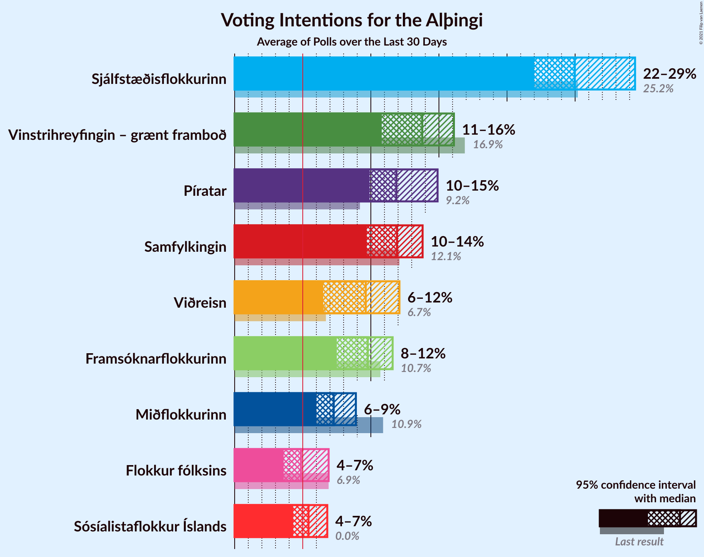

### Confidence Intervals

| Party | Last Result | Median | 80% Confidence Interval | 90% Confidence Interval | 95% Confidence Interval | 99% Confidence Interval |
|:-----:|:-----------:|:------:|:-----------------------:|:-----------------------:|:-----------------------:|:-----------------------:|
| <a href="#sjálfstæðisflokkurinn">Sjálfstæðisflokkurinn</a> | 25.2% | 21.7% | 19.0–23.4% |18.4–23.8% | 18.0–24.2% | 17.2–25.0% |
| <a href="#vinstrihreyfingin-–-grænt-framboð">Vinstrihreyfingin – grænt framboð</a> | 16.9% | 12.9% | 11.3–15.2% |11.0–15.8% | 10.8–16.2% | 10.3–17.0% |
| <a href="#samfylkingin">Samfylkingin</a> | 12.1% | 19.0% | 16.6–21.3% |16.0–21.9% | 15.5–22.4% | 14.6–23.3% |
| <a href="#miðflokkurinn">Miðflokkurinn</a> | 10.9% | 5.2% | 4.0–6.4% |3.7–6.7% | 3.6–7.0% | 3.2–7.7% |
| <a href="#framsóknarflokkurinn">Framsóknarflokkurinn</a> | 10.7% | 10.4% | 8.0–12.9% |7.7–13.5% | 7.4–14.0% | 7.0–14.8% |
| <a href="#píratar">Píratar</a> | 9.2% | 14.1% | 10.6–15.8% |10.2–16.2% | 10.0–16.6% | 9.6–17.3% |
| <a href="#flokkur-fólksins">Flokkur fólksins</a> | 6.9% | 5.0% | 3.9–6.0% |3.6–6.3% | 3.4–6.6% | 3.0–7.2% |
| <a href="#viðreisn">Viðreisn</a> | 6.7% | 10.0% | 8.1–13.7% |7.7–14.3% | 7.4–14.7% | 6.8–15.5% |
| <a href="#björt-framtíð">Björt framtíð</a> | 1.2% | N/A | N/A |N/A | N/A | N/A |
| <a href="#alþýðufylkingin">Alþýðufylkingin</a> | 0.2% | N/A | N/A |N/A | N/A | N/A |
| <a href="#dögun">Dögun</a> | 0.1% | N/A | N/A |N/A | N/A | N/A |

### Sjálfstæðisflokkurinn

*For a full overview of the results for this party, see the [Sjálfstæðisflokkurinn](party-sjálfstæðisflokkurinn.html) page.*

| Voting Intentions | Probability | Accumulated | Special Marks |
|:-----------------:|:-----------:|:-----------:|:-------------:|
| 14.5–15.5% | 0% | 100% |  |
| 15.5–16.5% | 0.1% | 100% |  |
| 16.5–17.5% | 1.1% | 99.9% |  |
| 17.5–18.5% | 5% | 98.8% |  |
| 18.5–19.5% | 10% | 94% |  |
| 19.5–20.5% | 14% | 84% |  |
| 20.5–21.5% | 18% | 70% |  |
| 21.5–22.5% | 24% | 52% | Median |
| 22.5–23.5% | 20% | 28% |  |
| 23.5–24.5% | 7% | 8% |  |
| 24.5–25.5% | 1.1% | 1.2% | Last Result |
| 25.5–26.5% | 0.1% | 0.2% |  |
| 26.5–27.5% | 0% | 0% |  |

### Vinstrihreyfingin – grænt framboð

*For a full overview of the results for this party, see the [Vinstrihreyfingin – grænt framboð](party-vinstrihreyfingin–græntframboð.html) page.*

| Voting Intentions | Probability | Accumulated | Special Marks |
|:-----------------:|:-----------:|:-----------:|:-------------:|
| 8.5–9.5% | 0% | 100% |  |
| 9.5–10.5% | 1.1% | 100% |  |
| 10.5–11.5% | 14% | 98.9% |  |
| 11.5–12.5% | 27% | 84% |  |
| 12.5–13.5% | 22% | 58% | Median |
| 13.5–14.5% | 17% | 36% |  |
| 14.5–15.5% | 12% | 19% |  |
| 15.5–16.5% | 6% | 7% |  |
| 16.5–17.5% | 1.2% | 1.3% | Last Result |
| 17.5–18.5% | 0.1% | 0.1% |  |
| 18.5–19.5% | 0% | 0% |  |

### Samfylkingin

*For a full overview of the results for this party, see the [Samfylkingin](party-samfylkingin.html) page.*

| Voting Intentions | Probability | Accumulated | Special Marks |
|:-----------------:|:-----------:|:-----------:|:-------------:|
| 11.5–12.5% | 0% | 100% | Last Result |
| 12.5–13.5% | 0% | 100% |  |
| 13.5–14.5% | 0.4% | 100% |  |
| 14.5–15.5% | 2% | 99.6% |  |
| 15.5–16.5% | 6% | 97% |  |
| 16.5–17.5% | 11% | 91% |  |
| 17.5–18.5% | 20% | 80% |  |
| 18.5–19.5% | 22% | 59% | Median |
| 19.5–20.5% | 17% | 38% |  |
| 20.5–21.5% | 13% | 21% |  |
| 21.5–22.5% | 6% | 8% |  |
| 22.5–23.5% | 2% | 2% |  |
| 23.5–24.5% | 0.2% | 0.3% |  |
| 24.5–25.5% | 0% | 0% |  |

### Miðflokkurinn

*For a full overview of the results for this party, see the [Miðflokkurinn](party-miðflokkurinn.html) page.*

| Voting Intentions | Probability | Accumulated | Special Marks |
|:-----------------:|:-----------:|:-----------:|:-------------:|
| 1.5–2.5% | 0% | 100% |  |
| 2.5–3.5% | 2% | 100% |  |
| 3.5–4.5% | 26% | 98% |  |
| 4.5–5.5% | 35% | 72% | Median |
| 5.5–6.5% | 30% | 37% |  |
| 6.5–7.5% | 6% | 7% |  |
| 7.5–8.5% | 0.7% | 0.7% |  |
| 8.5–9.5% | 0% | 0% |  |
| 9.5–10.5% | 0% | 0% |  |
| 10.5–11.5% | 0% | 0% | Last Result |

### Framsóknarflokkurinn

*For a full overview of the results for this party, see the [Framsóknarflokkurinn](party-framsóknarflokkurinn.html) page.*

| Voting Intentions | Probability | Accumulated | Special Marks |
|:-----------------:|:-----------:|:-----------:|:-------------:|
| 5.5–6.5% | 0.1% | 100% |  |
| 6.5–7.5% | 3% | 99.9% |  |
| 7.5–8.5% | 18% | 97% |  |
| 8.5–9.5% | 21% | 79% |  |
| 9.5–10.5% | 9% | 57% | Median |
| 10.5–11.5% | 17% | 48% | Last Result |
| 11.5–12.5% | 18% | 31% |  |
| 12.5–13.5% | 9% | 14% |  |
| 13.5–14.5% | 4% | 5% |  |
| 14.5–15.5% | 0.8% | 0.9% |  |
| 15.5–16.5% | 0.1% | 0.1% |  |
| 16.5–17.5% | 0% | 0% |  |

### Píratar

*For a full overview of the results for this party, see the [Píratar](party-píratar.html) page.*

| Voting Intentions | Probability | Accumulated | Special Marks |
|:-----------------:|:-----------:|:-----------:|:-------------:|
| 7.5–8.5% | 0% | 100% |  |
| 8.5–9.5% | 0.5% | 100% | Last Result |
| 9.5–10.5% | 9% | 99.5% |  |
| 10.5–11.5% | 14% | 90% |  |
| 11.5–12.5% | 4% | 77% |  |
| 12.5–13.5% | 10% | 73% |  |
| 13.5–14.5% | 25% | 63% | Median |
| 14.5–15.5% | 25% | 38% |  |
| 15.5–16.5% | 11% | 14% |  |
| 16.5–17.5% | 2% | 3% |  |
| 17.5–18.5% | 0.2% | 0.3% |  |
| 18.5–19.5% | 0% | 0% |  |

### Flokkur fólksins

*For a full overview of the results for this party, see the [Flokkur fólksins](party-flokkurfólksins.html) page.*

| Voting Intentions | Probability | Accumulated | Special Marks |
|:-----------------:|:-----------:|:-----------:|:-------------:|
| 1.5–2.5% | 0% | 100% |  |
| 2.5–3.5% | 4% | 100% |  |
| 3.5–4.5% | 28% | 96% |  |
| 4.5–5.5% | 43% | 68% | Median |
| 5.5–6.5% | 22% | 25% |  |
| 6.5–7.5% | 3% | 3% | Last Result |
| 7.5–8.5% | 0.1% | 0.1% |  |
| 8.5–9.5% | 0% | 0% |  |

### Viðreisn

*For a full overview of the results for this party, see the [Viðreisn](party-viðreisn.html) page.*

| Voting Intentions | Probability | Accumulated | Special Marks |
|:-----------------:|:-----------:|:-----------:|:-------------:|
| 4.5–5.5% | 0% | 100% |  |
| 5.5–6.5% | 0.2% | 100% |  |
| 6.5–7.5% | 3% | 99.8% | Last Result |
| 7.5–8.5% | 15% | 97% |  |
| 8.5–9.5% | 22% | 82% |  |
| 9.5–10.5% | 22% | 60% | Median |
| 10.5–11.5% | 13% | 38% |  |
| 11.5–12.5% | 5% | 26% |  |
| 12.5–13.5% | 9% | 21% |  |
| 13.5–14.5% | 8% | 12% |  |
| 14.5–15.5% | 3% | 3% |  |
| 15.5–16.5% | 0.4% | 0.4% |  |
| 16.5–17.5% | 0% | 0% |  |

## Seats

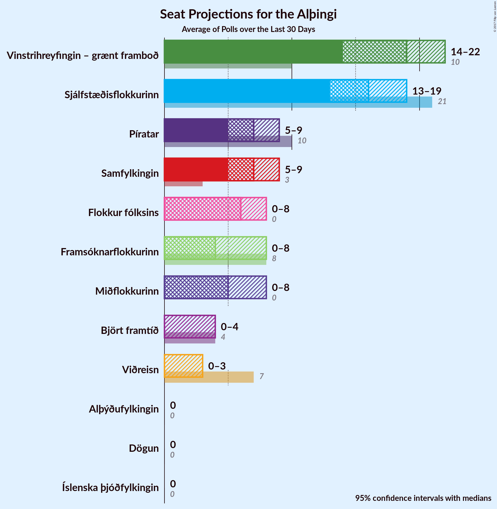

### Confidence Intervals

| Party | Last Result | Median | 80% Confidence Interval | 90% Confidence Interval | 95% Confidence Interval | 99% Confidence Interval |
|:-----:|:-----------:|:------:|:-----------------------:|:-----------------------:|:-----------------------:|:-----------------------:|
| <a href="#sjálfstæðisflokkurinn">Sjálfstæðisflokkurinn</a> | 16 | 15 | 13–16 |12–17 | 12–17 | 11–17 |
| <a href="#vinstrihreyfingin-–-grænt-framboð">Vinstrihreyfingin – grænt framboð</a> | 11 | 9 | 7–10 |7–11 | 7–11 | 6–11 |
| <a href="#samfylkingin">Samfylkingin</a> | 7 | 13 | 11–15 |11–15 | 10–16 | 10–16 |
| <a href="#miðflokkurinn">Miðflokkurinn</a> | 7 | 3 | 0–4 |0–4 | 0–4 | 0–5 |
| <a href="#framsóknarflokkurinn">Framsóknarflokkurinn</a> | 8 | 7 | 5–10 |5–10 | 5–10 | 4–10 |
| <a href="#píratar">Píratar</a> | 6 | 9 | 7–11 |7–11 | 6–11 | 6–12 |
| <a href="#flokkur-fólksins">Flokkur fólksins</a> | 4 | 0 | 0–4 |0–4 | 0–4 | 0–5 |
| <a href="#viðreisn">Viðreisn</a> | 4 | 6 | 5–9 |5–9 | 5–10 | 4–10 |
| <a href="#björt-framtíð">Björt framtíð</a> | 0 | N/A | N/A |N/A | N/A | N/A |
| <a href="#alþýðufylkingin">Alþýðufylkingin</a> | 0 | N/A | N/A |N/A | N/A | N/A |
| <a href="#dögun">Dögun</a> | 0 | N/A | N/A |N/A | N/A | N/A |

### Sjálfstæðisflokkurinn

*For a full overview of the results for this party, see the [Sjálfstæðisflokkurinn](party-sjálfstæðisflokkurinn.html) page.*

| Number of Seats | Probability | Accumulated | Special Marks |
|:---------------:|:-----------:|:-----------:|:-------------:|
| 11 | 0.6% | 100% |  |
| 12 | 5% | 99.4% |  |
| 13 | 12% | 94% |  |
| 14 | 26% | 83% |  |
| 15 | 36% | 57% | Median |
| 16 | 15% | 20% | Last Result |
| 17 | 5% | 6% |  |
| 18 | 0.4% | 0.4% |  |
| 19 | 0% | 0% |  |

### Vinstrihreyfingin – grænt framboð

*For a full overview of the results for this party, see the [Vinstrihreyfingin – grænt framboð](party-vinstrihreyfingin–græntframboð.html) page.*

| Number of Seats | Probability | Accumulated | Special Marks |
|:---------------:|:-----------:|:-----------:|:-------------:|
| 6 | 0.5% | 100% |  |
| 7 | 20% | 99.5% |  |
| 8 | 26% | 79% |  |
| 9 | 24% | 53% | Median |
| 10 | 24% | 29% |  |
| 11 | 5% | 5% | Last Result |
| 12 | 0.5% | 0.5% |  |
| 13 | 0% | 0% |  |

### Samfylkingin

*For a full overview of the results for this party, see the [Samfylkingin](party-samfylkingin.html) page.*

| Number of Seats | Probability | Accumulated | Special Marks |
|:---------------:|:-----------:|:-----------:|:-------------:|
| 7 | 0% | 100% | Last Result |
| 8 | 0% | 100% |  |
| 9 | 0.2% | 100% |  |
| 10 | 4% | 99.8% |  |
| 11 | 12% | 96% |  |
| 12 | 19% | 84% |  |
| 13 | 20% | 65% | Median |
| 14 | 32% | 45% |  |
| 15 | 10% | 13% |  |
| 16 | 3% | 3% |  |
| 17 | 0.3% | 0.3% |  |
| 18 | 0% | 0% |  |

### Miðflokkurinn

*For a full overview of the results for this party, see the [Miðflokkurinn](party-miðflokkurinn.html) page.*

| Number of Seats | Probability | Accumulated | Special Marks |
|:---------------:|:-----------:|:-----------:|:-------------:|
| 0 | 22% | 100% |  |
| 1 | 22% | 78% |  |
| 2 | 0.8% | 56% |  |
| 3 | 30% | 55% | Median |
| 4 | 23% | 25% |  |
| 5 | 2% | 2% |  |
| 6 | 0% | 0% |  |
| 7 | 0% | 0% | Last Result |

### Framsóknarflokkurinn

*For a full overview of the results for this party, see the [Framsóknarflokkurinn](party-framsóknarflokkurinn.html) page.*

| Number of Seats | Probability | Accumulated | Special Marks |
|:---------------:|:-----------:|:-----------:|:-------------:|
| 4 | 2% | 100% |  |
| 5 | 19% | 98% |  |
| 6 | 26% | 80% |  |
| 7 | 7% | 54% | Median |
| 8 | 32% | 46% | Last Result |
| 9 | 3% | 15% |  |
| 10 | 11% | 12% |  |
| 11 | 0.3% | 0.3% |  |
| 12 | 0% | 0% |  |

### Píratar

*For a full overview of the results for this party, see the [Píratar](party-píratar.html) page.*

| Number of Seats | Probability | Accumulated | Special Marks |
|:---------------:|:-----------:|:-----------:|:-------------:|
| 6 | 4% | 100% | Last Result |
| 7 | 18% | 96% |  |
| 8 | 6% | 77% |  |
| 9 | 23% | 72% | Median |
| 10 | 35% | 48% |  |
| 11 | 12% | 13% |  |
| 12 | 1.4% | 1.5% |  |
| 13 | 0% | 0% |  |

### Flokkur fólksins

*For a full overview of the results for this party, see the [Flokkur fólksins](party-flokkurfólksins.html) page.*

| Number of Seats | Probability | Accumulated | Special Marks |
|:---------------:|:-----------:|:-----------:|:-------------:|
| 0 | 50% | 100% | Median |
| 1 | 0.4% | 50% |  |
| 2 | 0% | 49% |  |
| 3 | 34% | 49% |  |
| 4 | 15% | 15% | Last Result |
| 5 | 0.6% | 0.6% |  |
| 6 | 0% | 0% |  |

### Viðreisn

*For a full overview of the results for this party, see the [Viðreisn](party-viðreisn.html) page.*

| Number of Seats | Probability | Accumulated | Special Marks |
|:---------------:|:-----------:|:-----------:|:-------------:|
| 4 | 1.3% | 100% | Last Result |
| 5 | 17% | 98.7% |  |
| 6 | 40% | 82% | Median |
| 7 | 15% | 42% |  |
| 8 | 8% | 27% |  |
| 9 | 14% | 19% |  |
| 10 | 5% | 5% |  |
| 11 | 0.4% | 0.4% |  |
| 12 | 0% | 0% |  |

## Coalitions

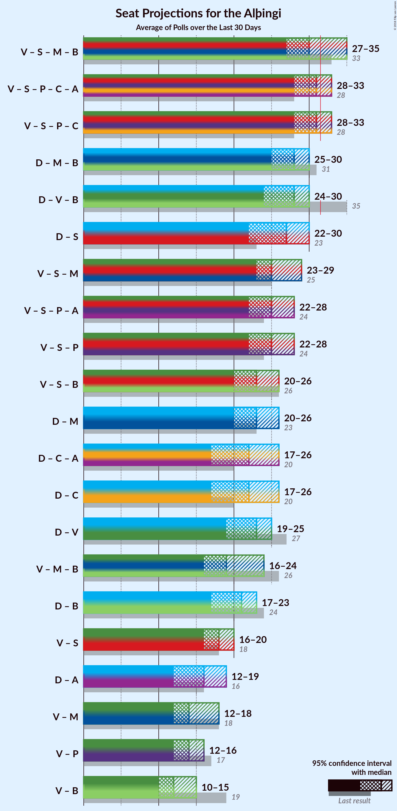

### Confidence Intervals

| Coalition | Last Result | Median | Majority? | 80% Confidence Interval | 90% Confidence Interval | 95% Confidence Interval | 99% Confidence Interval |
|:---------:|:-----------:|:------:|:---------:|:-----------------------:|:-----------------------:|:-----------------------:|:-----------------------:|
| Vinstrihreyfingin – grænt framboð – Samfylkingin – Píratar – Viðreisn – Björt framtíð | 28 | 37 | 99.2% | 34–43 | 33–43 | 32–44 | 31–45 |
| Vinstrihreyfingin – grænt framboð – Samfylkingin – Píratar – Viðreisn | 28 | 37 | 99.2% | 34–43 | 33–43 | 32–44 | 31–45 |
| Vinstrihreyfingin – grænt framboð – Samfylkingin – Píratar – Björt framtíð | 24 | 31 | 46% | 27–34 | 26–34 | 26–35 | 25–36 |
| Vinstrihreyfingin – grænt framboð – Samfylkingin – Píratar | 24 | 31 | 46% | 27–34 | 26–34 | 26–35 | 25–36 |
| Vinstrihreyfingin – grænt framboð – Samfylkingin – Miðflokkurinn – Framsóknarflokkurinn | 33 | 31 | 43% | 29–33 | 28–34 | 28–34 | 27–35 |
| Sjálfstæðisflokkurinn – Vinstrihreyfingin – grænt framboð – Framsóknarflokkurinn | 35 | 30 | 27% | 28–33 | 27–34 | 27–34 | 26–35 |
| Vinstrihreyfingin – grænt framboð – Samfylkingin – Framsóknarflokkurinn | 26 | 29 | 2% | 27–30 | 27–31 | 26–31 | 26–32 |
| Sjálfstæðisflokkurinn – Samfylkingin | 23 | 28 | 0.9% | 25–30 | 25–30 | 25–31 | 24–32 |
| Sjálfstæðisflokkurinn – Miðflokkurinn – Framsóknarflokkurinn | 31 | 24 | 0% | 20–28 | 19–29 | 19–29 | 18–30 |
| Vinstrihreyfingin – grænt framboð – Samfylkingin – Miðflokkurinn | 25 | 24 | 0% | 22–26 | 22–26 | 21–27 | 20–27 |
| Sjálfstæðisflokkurinn – Vinstrihreyfingin – grænt framboð | 27 | 23 | 0% | 22–25 | 22–25 | 21–26 | 21–26 |
| Sjálfstæðisflokkurinn – Framsóknarflokkurinn | 24 | 22 | 0% | 19–25 | 18–25 | 18–25 | 17–26 |
| Vinstrihreyfingin – grænt framboð – Samfylkingin | 18 | 22 | 0% | 19–24 | 19–24 | 18–25 | 18–26 |
| Sjálfstæðisflokkurinn – Viðreisn – Björt framtíð | 20 | 21 | 0% | 20–23 | 19–24 | 19–24 | 18–25 |
| Sjálfstæðisflokkurinn – Viðreisn | 20 | 21 | 0% | 20–23 | 19–24 | 19–24 | 18–25 |
| Vinstrihreyfingin – grænt framboð – Miðflokkurinn – Framsóknarflokkurinn | 26 | 18 | 0% | 15–21 | 14–22 | 14–23 | 13–23 |
| Vinstrihreyfingin – grænt framboð – Píratar | 17 | 18 | 0% | 14–20 | 14–21 | 14–21 | 13–22 |
| Sjálfstæðisflokkurinn – Miðflokkurinn | 23 | 17 | 0% | 14–20 | 13–20 | 13–20 | 12–21 |
| Vinstrihreyfingin – grænt framboð – Framsóknarflokkurinn | 19 | 16 | 0% | 14–18 | 13–19 | 13–19 | 12–20 |
| Sjálfstæðisflokkurinn – Björt framtíð | 16 | 15 | 0% | 13–16 | 12–17 | 12–17 | 11–17 |
| Vinstrihreyfingin – grænt framboð – Miðflokkurinn | 18 | 11 | 0% | 9–13 | 9–13 | 8–14 | 8–14 |

### Vinstrihreyfingin – grænt framboð – Samfylkingin – Píratar – Viðreisn – Björt framtíð

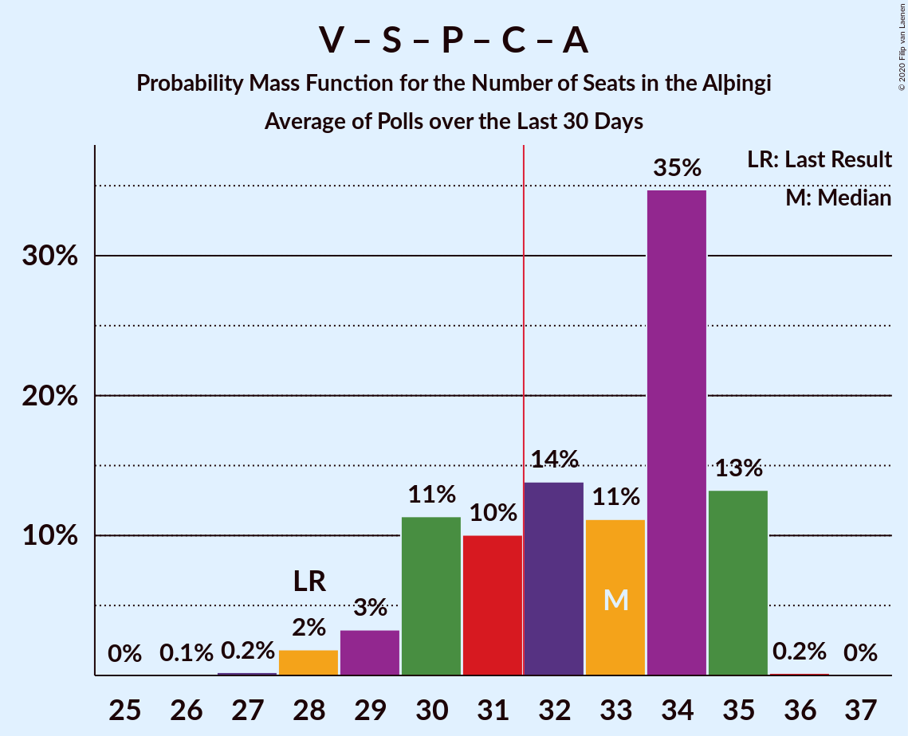

| Number of Seats | Probability | Accumulated | Special Marks |
|:---------------:|:-----------:|:-----------:|:-------------:|
| 28 | 0% | 100% | Last Result |
| 29 | 0% | 100% |  |
| 30 | 0% | 100% |  |
| 31 | 0.7% | 100% |  |
| 32 | 3% | 99.2% | Majority |
| 33 | 5% | 96% |  |
| 34 | 18% | 91% |  |
| 35 | 11% | 73% |  |
| 36 | 8% | 62% |  |
| 37 | 6% | 53% | Median |
| 38 | 8% | 47% |  |
| 39 | 8% | 39% |  |
| 40 | 6% | 31% |  |
| 41 | 5% | 25% |  |
| 42 | 6% | 20% |  |
| 43 | 10% | 14% |  |
| 44 | 3% | 4% |  |
| 45 | 1.0% | 1.0% |  |
| 46 | 0.1% | 0.1% |  |
| 47 | 0% | 0% |  |

### Vinstrihreyfingin – grænt framboð – Samfylkingin – Píratar – Viðreisn

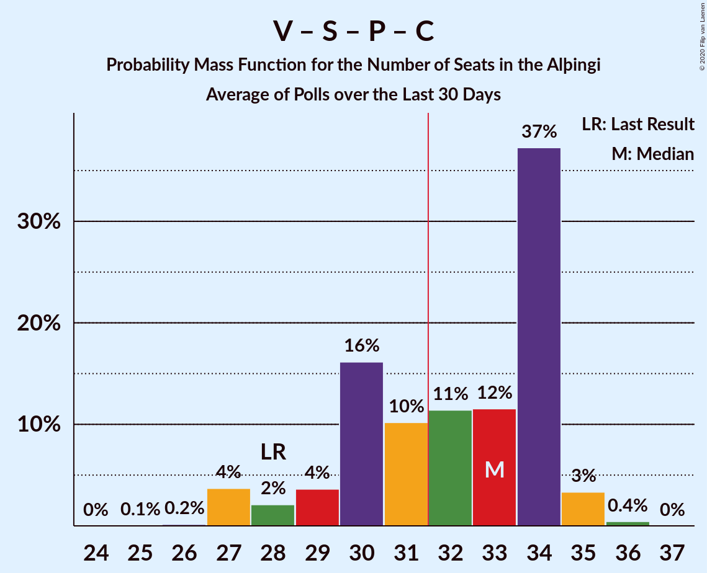

| Number of Seats | Probability | Accumulated | Special Marks |
|:---------------:|:-----------:|:-----------:|:-------------:|
| 28 | 0% | 100% | Last Result |
| 29 | 0% | 100% |  |
| 30 | 0% | 100% |  |
| 31 | 0.7% | 100% |  |
| 32 | 3% | 99.2% | Majority |
| 33 | 5% | 96% |  |
| 34 | 18% | 91% |  |
| 35 | 11% | 73% |  |
| 36 | 8% | 62% |  |
| 37 | 6% | 53% | Median |
| 38 | 8% | 47% |  |
| 39 | 8% | 39% |  |
| 40 | 6% | 31% |  |
| 41 | 5% | 25% |  |
| 42 | 6% | 20% |  |
| 43 | 10% | 14% |  |
| 44 | 3% | 4% |  |
| 45 | 1.0% | 1.0% |  |
| 46 | 0.1% | 0.1% |  |
| 47 | 0% | 0% |  |

### Vinstrihreyfingin – grænt framboð – Samfylkingin – Píratar – Björt framtíð

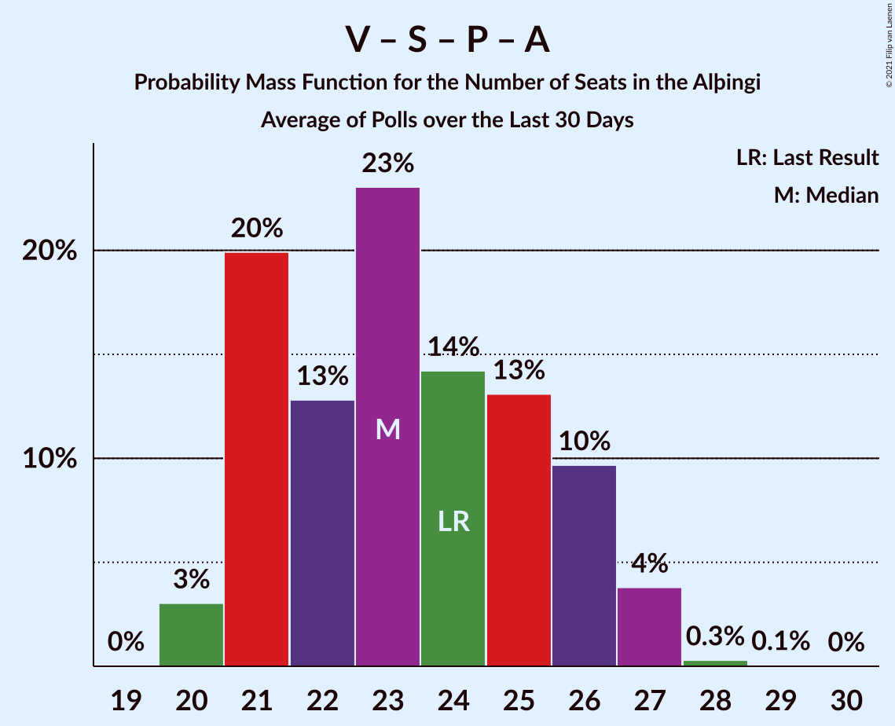

| Number of Seats | Probability | Accumulated | Special Marks |
|:---------------:|:-----------:|:-----------:|:-------------:|
| 24 | 0% | 100% | Last Result |
| 25 | 2% | 99.9% |  |
| 26 | 4% | 98% |  |
| 27 | 6% | 94% |  |
| 28 | 16% | 88% |  |
| 29 | 9% | 72% |  |
| 30 | 8% | 63% |  |
| 31 | 8% | 55% | Median |
| 32 | 11% | 46% | Majority |
| 33 | 16% | 36% |  |
| 34 | 15% | 20% |  |
| 35 | 3% | 5% |  |
| 36 | 1.3% | 1.4% |  |
| 37 | 0.2% | 0.2% |  |
| 38 | 0% | 0% |  |

### Vinstrihreyfingin – grænt framboð – Samfylkingin – Píratar

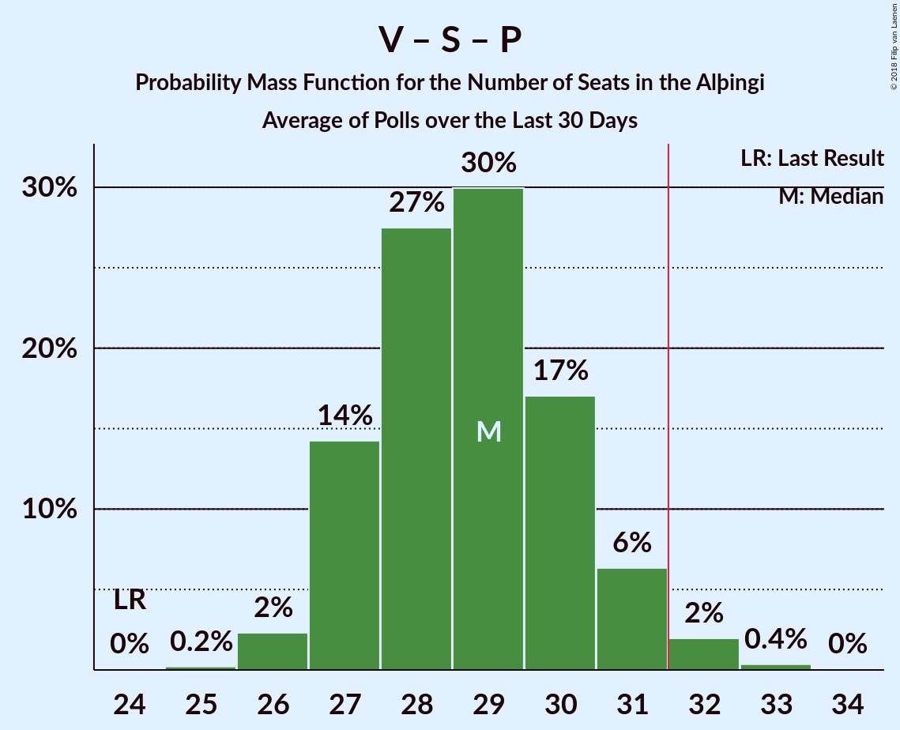

| Number of Seats | Probability | Accumulated | Special Marks |
|:---------------:|:-----------:|:-----------:|:-------------:|
| 24 | 0% | 100% | Last Result |
| 25 | 2% | 99.9% |  |
| 26 | 4% | 98% |  |
| 27 | 6% | 94% |  |
| 28 | 16% | 88% |  |
| 29 | 9% | 72% |  |
| 30 | 8% | 63% |  |
| 31 | 8% | 55% | Median |
| 32 | 11% | 46% | Majority |
| 33 | 16% | 36% |  |
| 34 | 15% | 20% |  |
| 35 | 3% | 5% |  |
| 36 | 1.3% | 1.4% |  |
| 37 | 0.2% | 0.2% |  |
| 38 | 0% | 0% |  |

### Vinstrihreyfingin – grænt framboð – Samfylkingin – Miðflokkurinn – Framsóknarflokkurinn

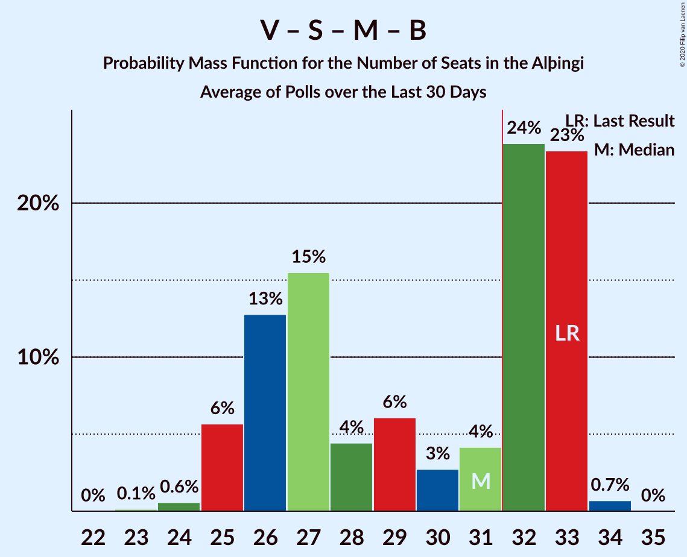

| Number of Seats | Probability | Accumulated | Special Marks |
|:---------------:|:-----------:|:-----------:|:-------------:|
| 26 | 0.2% | 100% |  |
| 27 | 2% | 99.8% |  |
| 28 | 6% | 98% |  |
| 29 | 14% | 92% |  |
| 30 | 20% | 78% |  |
| 31 | 16% | 58% |  |
| 32 | 28% | 43% | Median, Majority |
| 33 | 8% | 15% | Last Result |
| 34 | 6% | 7% |  |
| 35 | 2% | 2% |  |
| 36 | 0.1% | 0.1% |  |
| 37 | 0% | 0% |  |

### Sjálfstæðisflokkurinn – Vinstrihreyfingin – grænt framboð – Framsóknarflokkurinn

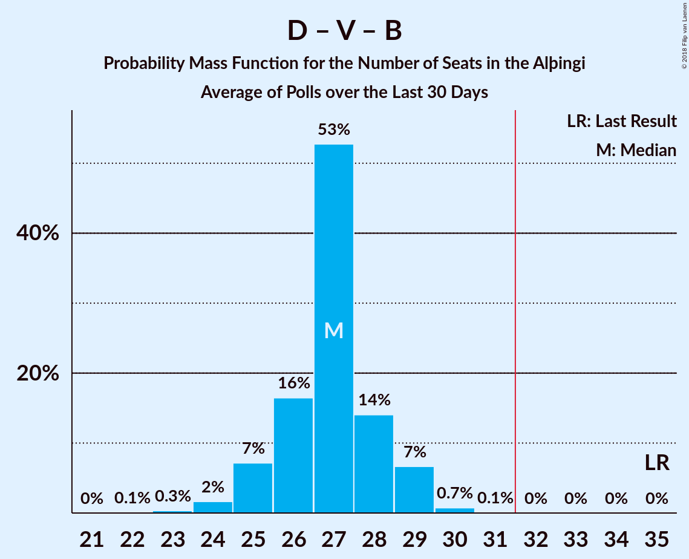

| Number of Seats | Probability | Accumulated | Special Marks |
|:---------------:|:-----------:|:-----------:|:-------------:|
| 25 | 0.1% | 100% |  |
| 26 | 0.9% | 99.9% |  |
| 27 | 6% | 99.0% |  |
| 28 | 13% | 93% |  |
| 29 | 12% | 80% |  |
| 30 | 28% | 68% |  |
| 31 | 13% | 40% | Median |
| 32 | 12% | 27% | Majority |
| 33 | 10% | 15% |  |
| 34 | 4% | 5% |  |
| 35 | 1.1% | 1.4% | Last Result |
| 36 | 0.3% | 0.4% |  |
| 37 | 0% | 0% |  |

### Vinstrihreyfingin – grænt framboð – Samfylkingin – Framsóknarflokkurinn

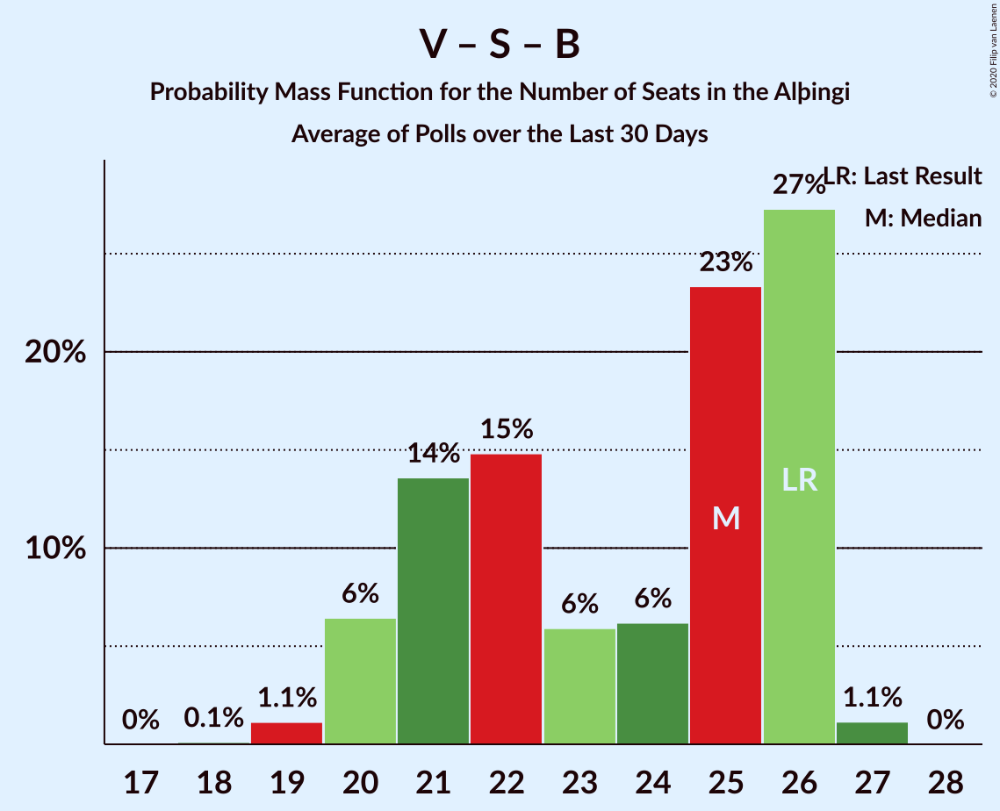

| Number of Seats | Probability | Accumulated | Special Marks |
|:---------------:|:-----------:|:-----------:|:-------------:|
| 25 | 0.4% | 100% |  |
| 26 | 3% | 99.6% | Last Result |
| 27 | 13% | 97% |  |
| 28 | 21% | 84% |  |
| 29 | 36% | 62% | Median |
| 30 | 19% | 26% |  |
| 31 | 5% | 7% |  |
| 32 | 1.4% | 2% | Majority |
| 33 | 0.2% | 0.2% |  |
| 34 | 0% | 0% |  |

### Sjálfstæðisflokkurinn – Samfylkingin

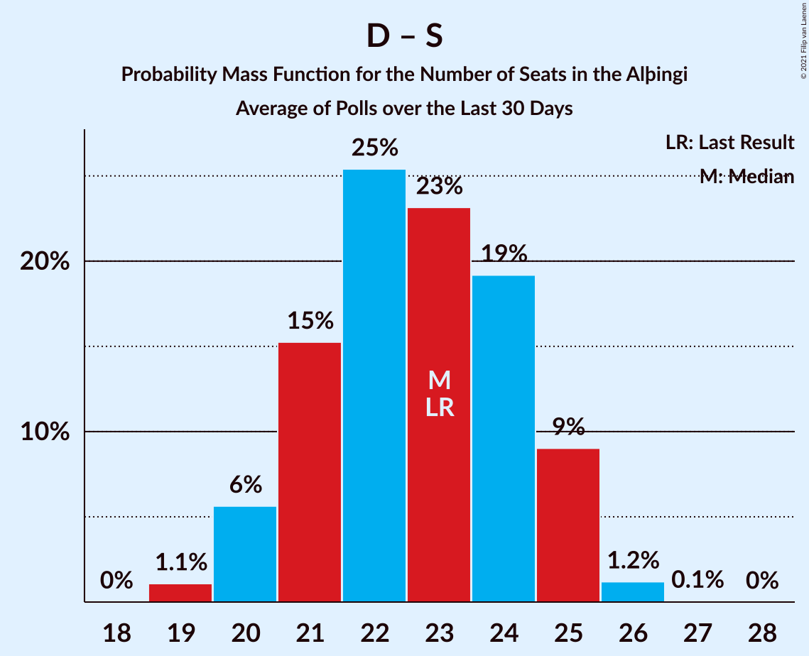

| Number of Seats | Probability | Accumulated | Special Marks |
|:---------------:|:-----------:|:-----------:|:-------------:|
| 22 | 0.1% | 100% |  |
| 23 | 0.3% | 99.9% | Last Result |
| 24 | 2% | 99.7% |  |
| 25 | 9% | 98% |  |
| 26 | 14% | 88% |  |
| 27 | 20% | 74% |  |
| 28 | 19% | 54% | Median |
| 29 | 23% | 35% |  |
| 30 | 8% | 12% |  |
| 31 | 3% | 4% |  |
| 32 | 0.8% | 0.9% | Majority |
| 33 | 0.1% | 0.1% |  |
| 34 | 0% | 0% |  |

### Sjálfstæðisflokkurinn – Miðflokkurinn – Framsóknarflokkurinn

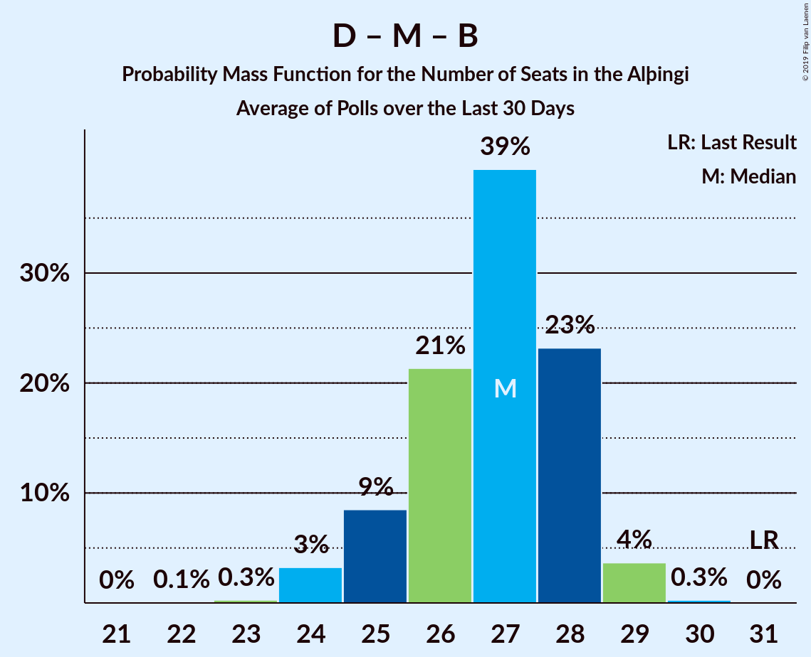

| Number of Seats | Probability | Accumulated | Special Marks |
|:---------------:|:-----------:|:-----------:|:-------------:|
| 17 | 0.2% | 100% |  |
| 18 | 2% | 99.8% |  |
| 19 | 6% | 98% |  |
| 20 | 16% | 91% |  |
| 21 | 14% | 75% |  |
| 22 | 7% | 61% |  |
| 23 | 4% | 55% |  |
| 24 | 2% | 51% |  |
| 25 | 3% | 49% | Median |
| 26 | 17% | 46% |  |
| 27 | 12% | 29% |  |
| 28 | 11% | 17% |  |
| 29 | 5% | 6% |  |
| 30 | 0.8% | 1.0% |  |
| 31 | 0.1% | 0.1% | Last Result |
| 32 | 0% | 0% | Majority |

### Vinstrihreyfingin – grænt framboð – Samfylkingin – Miðflokkurinn

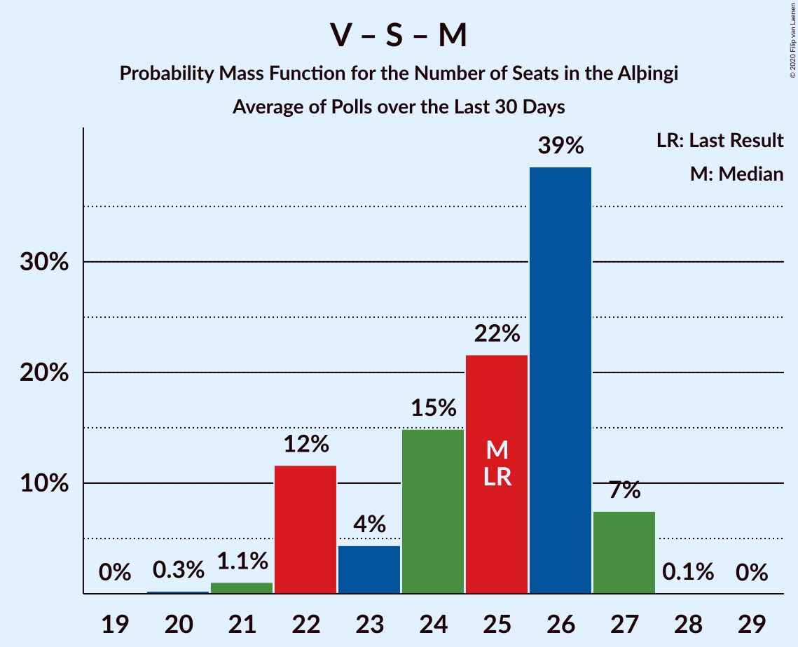

| Number of Seats | Probability | Accumulated | Special Marks |
|:---------------:|:-----------:|:-----------:|:-------------:|
| 19 | 0.2% | 100% |  |
| 20 | 0.5% | 99.8% |  |
| 21 | 2% | 99.3% |  |
| 22 | 10% | 97% |  |
| 23 | 20% | 88% |  |
| 24 | 45% | 68% |  |
| 25 | 13% | 23% | Last Result, Median |
| 26 | 7% | 10% |  |
| 27 | 3% | 3% |  |
| 28 | 0.4% | 0.4% |  |
| 29 | 0% | 0% |  |

### Sjálfstæðisflokkurinn – Vinstrihreyfingin – grænt framboð

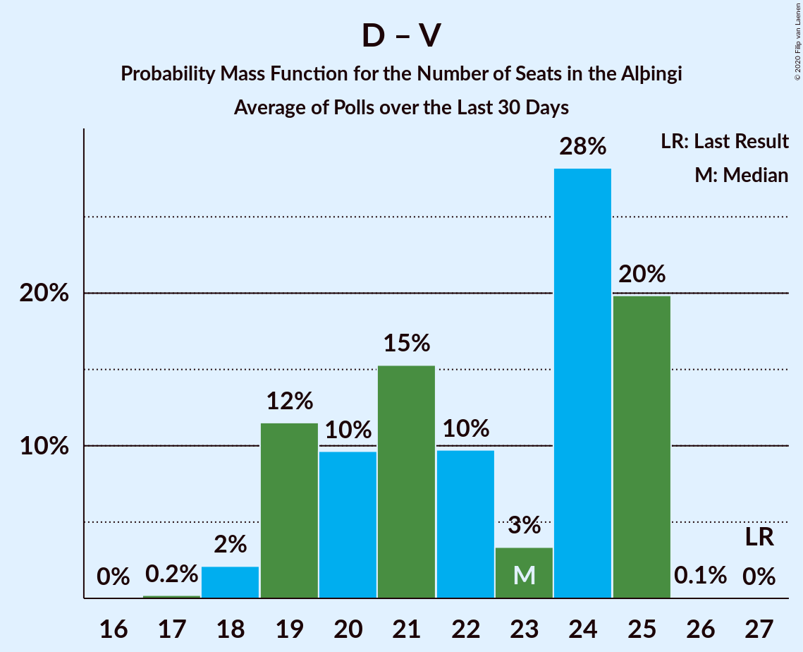

| Number of Seats | Probability | Accumulated | Special Marks |
|:---------------:|:-----------:|:-----------:|:-------------:|
| 20 | 0.5% | 100% |  |
| 21 | 4% | 99.5% |  |
| 22 | 28% | 95% |  |
| 23 | 25% | 67% |  |
| 24 | 26% | 42% | Median |
| 25 | 12% | 16% |  |
| 26 | 4% | 5% |  |
| 27 | 0.4% | 0.5% | Last Result |
| 28 | 0% | 0% |  |

### Sjálfstæðisflokkurinn – Framsóknarflokkurinn

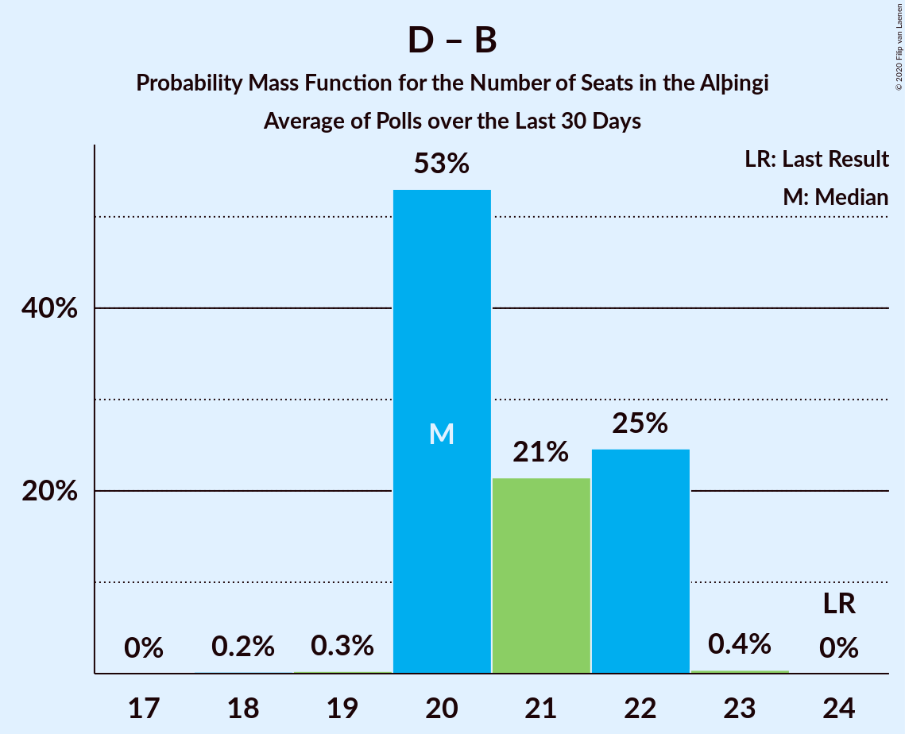

| Number of Seats | Probability | Accumulated | Special Marks |
|:---------------:|:-----------:|:-----------:|:-------------:|
| 16 | 0.2% | 100% |  |
| 17 | 2% | 99.8% |  |
| 18 | 7% | 98% |  |
| 19 | 10% | 91% |  |
| 20 | 20% | 80% |  |
| 21 | 8% | 60% |  |
| 22 | 7% | 52% | Median |
| 23 | 22% | 45% |  |
| 24 | 13% | 24% | Last Result |
| 25 | 8% | 11% |  |
| 26 | 2% | 2% |  |
| 27 | 0.4% | 0.5% |  |
| 28 | 0.1% | 0.1% |  |
| 29 | 0% | 0% |  |

### Vinstrihreyfingin – grænt framboð – Samfylkingin

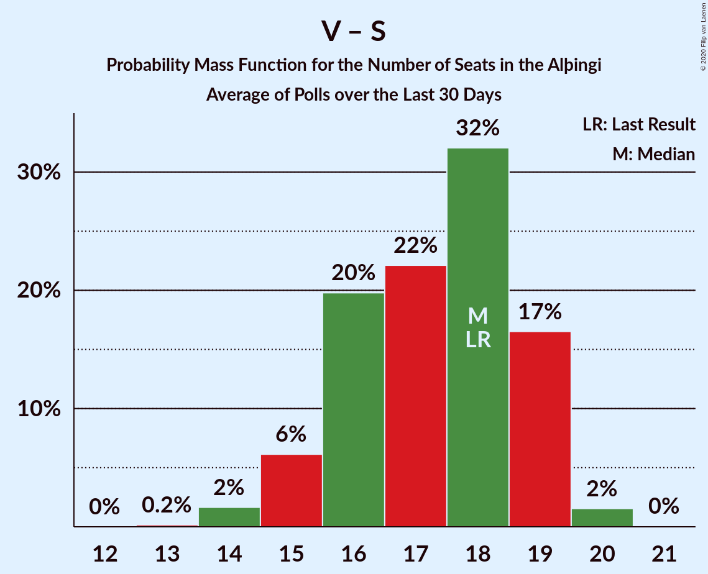

| Number of Seats | Probability | Accumulated | Special Marks |
|:---------------:|:-----------:|:-----------:|:-------------:|
| 17 | 0.3% | 100% |  |
| 18 | 2% | 99.7% | Last Result |
| 19 | 10% | 97% |  |
| 20 | 15% | 87% |  |
| 21 | 20% | 72% |  |
| 22 | 14% | 52% | Median |
| 23 | 16% | 38% |  |
| 24 | 18% | 22% |  |
| 25 | 3% | 4% |  |
| 26 | 0.7% | 0.8% |  |
| 27 | 0.1% | 0.1% |  |
| 28 | 0% | 0% |  |

### Sjálfstæðisflokkurinn – Viðreisn – Björt framtíð

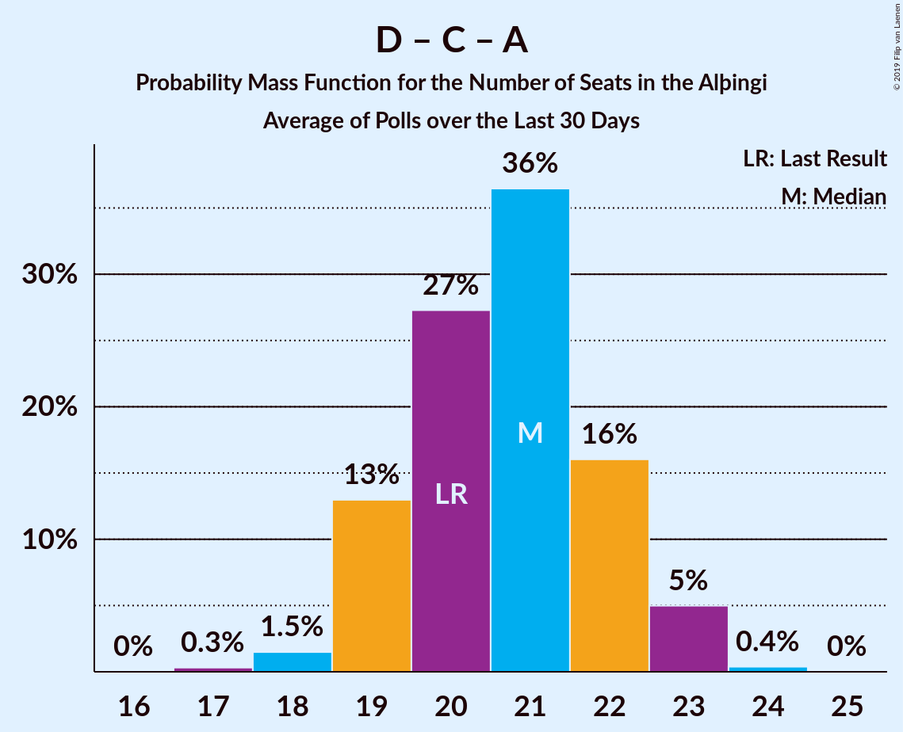

| Number of Seats | Probability | Accumulated | Special Marks |
|:---------------:|:-----------:|:-----------:|:-------------:|
| 17 | 0.1% | 100% |  |
| 18 | 1.3% | 99.9% |  |
| 19 | 7% | 98.6% |  |
| 20 | 18% | 92% | Last Result |
| 21 | 32% | 74% | Median |
| 22 | 20% | 42% |  |
| 23 | 15% | 21% |  |
| 24 | 6% | 7% |  |
| 25 | 0.6% | 0.6% |  |
| 26 | 0% | 0% |  |

### Sjálfstæðisflokkurinn – Viðreisn

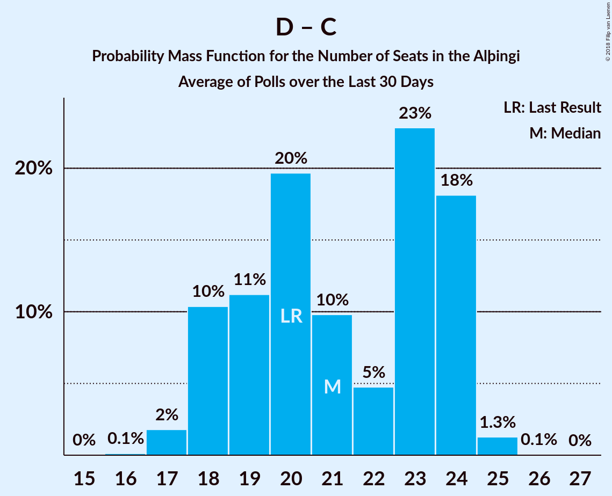

| Number of Seats | Probability | Accumulated | Special Marks |
|:---------------:|:-----------:|:-----------:|:-------------:|
| 17 | 0.1% | 100% |  |
| 18 | 1.3% | 99.9% |  |
| 19 | 7% | 98.6% |  |
| 20 | 18% | 92% | Last Result |
| 21 | 32% | 74% | Median |
| 22 | 20% | 42% |  |
| 23 | 15% | 21% |  |
| 24 | 6% | 7% |  |
| 25 | 0.6% | 0.6% |  |
| 26 | 0% | 0% |  |

### Vinstrihreyfingin – grænt framboð – Miðflokkurinn – Framsóknarflokkurinn

| Number of Seats | Probability | Accumulated | Special Marks |
|:---------------:|:-----------:|:-----------:|:-------------:|
| 12 | 0.1% | 100% |  |
| 13 | 2% | 99.9% |  |
| 14 | 7% | 98% |  |
| 15 | 10% | 90% |  |
| 16 | 13% | 80% |  |
| 17 | 9% | 67% |  |
| 18 | 18% | 57% |  |
| 19 | 11% | 39% | Median |
| 20 | 10% | 27% |  |
| 21 | 8% | 17% |  |
| 22 | 7% | 10% |  |
| 23 | 3% | 3% |  |
| 24 | 0.4% | 0.4% |  |
| 25 | 0% | 0% |  |
| 26 | 0% | 0% | Last Result |

### Vinstrihreyfingin – grænt framboð – Píratar

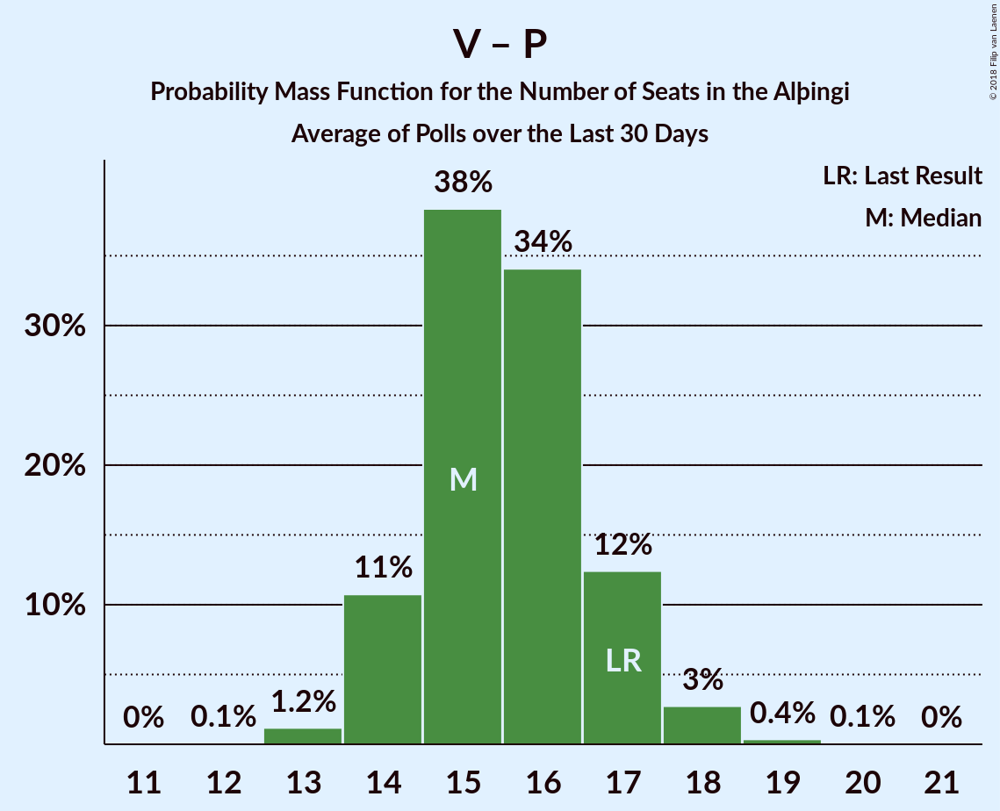

| Number of Seats | Probability | Accumulated | Special Marks |
|:---------------:|:-----------:|:-----------:|:-------------:|
| 12 | 0.1% | 100% |  |
| 13 | 2% | 99.9% |  |
| 14 | 16% | 98% |  |
| 15 | 6% | 83% |  |
| 16 | 4% | 77% |  |
| 17 | 10% | 73% | Last Result |
| 18 | 17% | 63% | Median |
| 19 | 20% | 46% |  |
| 20 | 18% | 25% |  |
| 21 | 5% | 7% |  |
| 22 | 2% | 2% |  |
| 23 | 0.1% | 0.1% |  |
| 24 | 0% | 0% |  |

### Sjálfstæðisflokkurinn – Miðflokkurinn

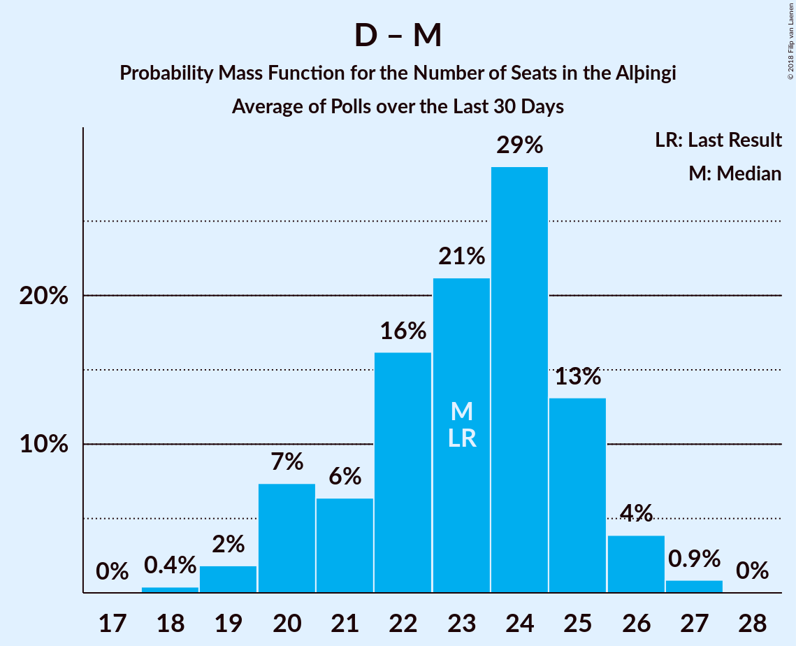

| Number of Seats | Probability | Accumulated | Special Marks |
|:---------------:|:-----------:|:-----------:|:-------------:|
| 12 | 0.6% | 100% |  |
| 13 | 5% | 99.3% |  |
| 14 | 15% | 95% |  |
| 15 | 13% | 80% |  |
| 16 | 12% | 66% |  |
| 17 | 9% | 54% |  |
| 18 | 21% | 45% | Median |
| 19 | 13% | 24% |  |
| 20 | 9% | 11% |  |
| 21 | 2% | 2% |  |
| 22 | 0.2% | 0.2% |  |
| 23 | 0% | 0% | Last Result |

### Vinstrihreyfingin – grænt framboð – Framsóknarflokkurinn

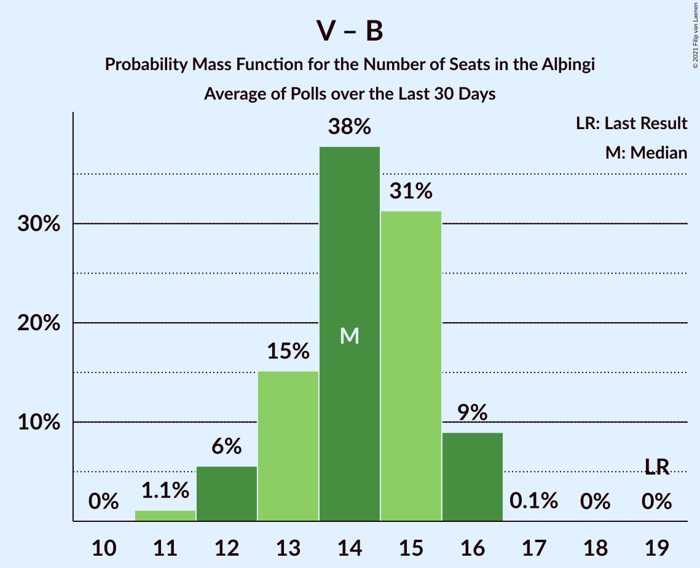

| Number of Seats | Probability | Accumulated | Special Marks |
|:---------------:|:-----------:|:-----------:|:-------------:|
| 11 | 0.1% | 100% |  |
| 12 | 1.3% | 99.9% |  |
| 13 | 6% | 98.6% |  |
| 14 | 11% | 93% |  |
| 15 | 31% | 82% |  |
| 16 | 25% | 51% | Median |
| 17 | 12% | 26% |  |
| 18 | 9% | 14% |  |
| 19 | 4% | 5% | Last Result |
| 20 | 0.8% | 0.9% |  |
| 21 | 0.1% | 0.1% |  |
| 22 | 0% | 0% |  |

### Sjálfstæðisflokkurinn – Björt framtíð

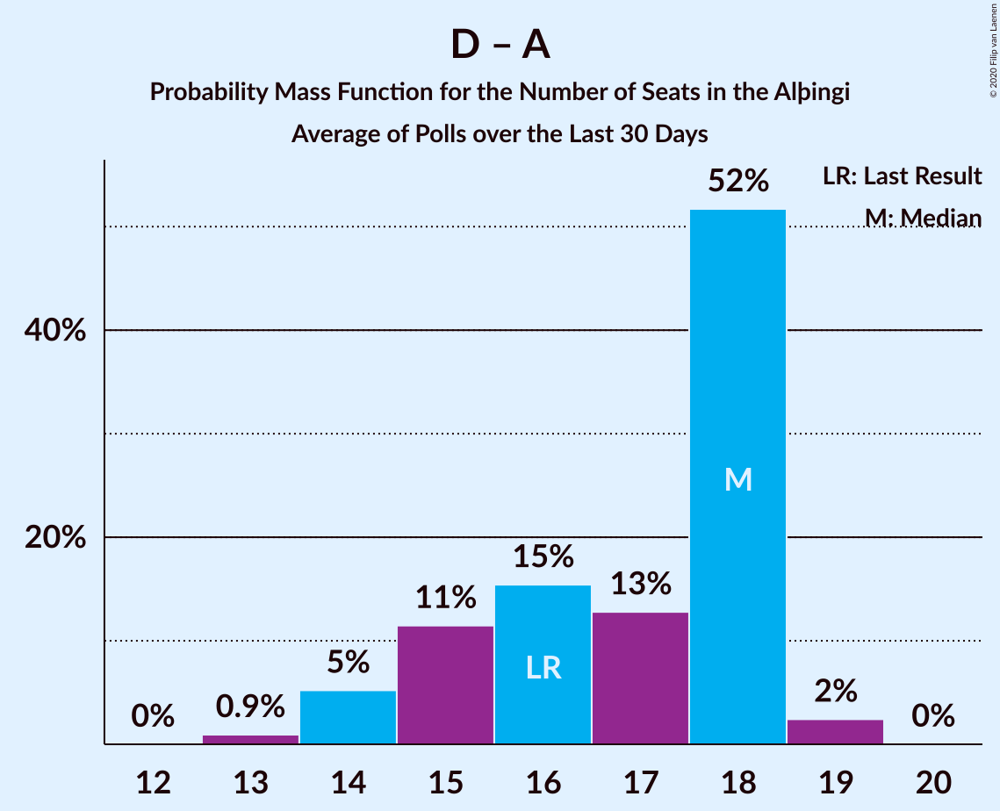

| Number of Seats | Probability | Accumulated | Special Marks |
|:---------------:|:-----------:|:-----------:|:-------------:|
| 11 | 0.6% | 100% |  |
| 12 | 5% | 99.4% |  |
| 13 | 12% | 94% |  |
| 14 | 26% | 83% |  |
| 15 | 36% | 57% | Median |
| 16 | 15% | 20% | Last Result |
| 17 | 5% | 6% |  |
| 18 | 0.4% | 0.4% |  |
| 19 | 0% | 0% |  |

### Vinstrihreyfingin – grænt framboð – Miðflokkurinn

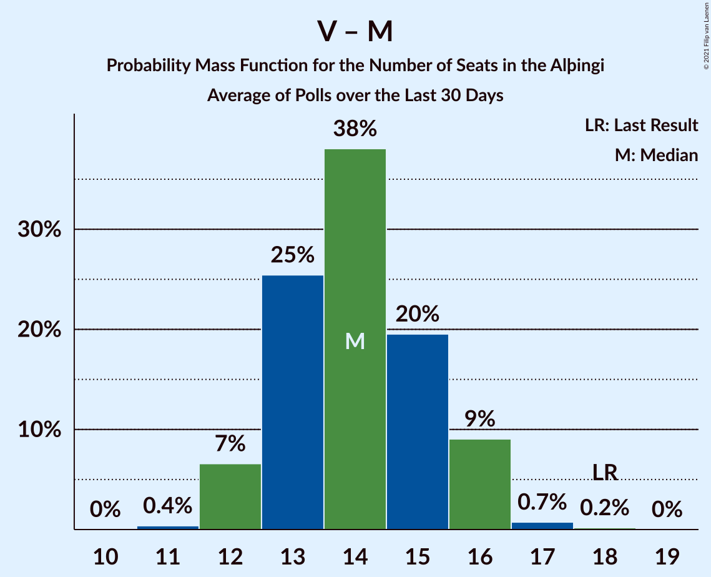

| Number of Seats | Probability | Accumulated | Special Marks |
|:---------------:|:-----------:|:-----------:|:-------------:|
| 7 | 0.3% | 100% |  |
| 8 | 5% | 99.7% |  |
| 9 | 14% | 95% |  |
| 10 | 27% | 81% |  |
| 11 | 22% | 55% |  |
| 12 | 18% | 33% | Median |
| 13 | 11% | 15% |  |
| 14 | 3% | 4% |  |
| 15 | 0.4% | 0.4% |  |
| 16 | 0% | 0% |  |
| 17 | 0% | 0% |  |
| 18 | 0% | 0% | Last Result |

## Technical Information

+ **Number of polls included in this average:** 4
+ **Lowest number of simulations done in a poll included in this average:** 131,072
+ **Total number of simulations done in the polls included in this average:** 3,276,800
+ **Error estimate:** 1.30%
