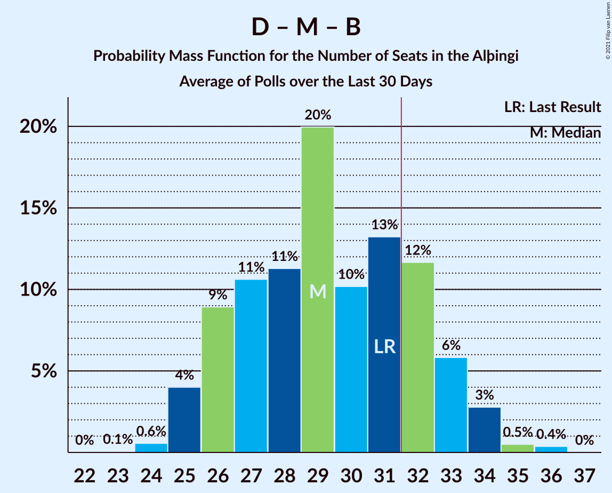

# Poll Average

<a href="#voting-intentions">Voting Intentions</a> | <a href="#seats">Seats</a> | <a href="#coalitions">Coalitions</a> | <a href="#technical-information">Technical Information</a>

## Summary

The table below lists the polls on which the average is based. They are the most recent polls (less than 30 days old) registered and analyzed so far.

| Period     | Polling firm/Commissioner(s) | D | V | S | M | B | P | F | C | A | R | T | J |
|:----------:|:----------------------------:|:--:|:--:|:--:|:--:|:--:|:--:|:--:|:--:|:--:|:--:|:--:|:--:|
| 28 October 2017 | General Election | 25.2%   16 | 16.9%   11 | 12.1%   7 | 10.9%   7 | 10.7%   8 | 9.2%   6 | 6.9%   4 | 6.7%   4 | 1.2%   0 | 0.2%   0 | 0.1%   0 | 0.0%   0 |
| N/A | Poll Average | 21–29%   15–22 | 6–12%   4–9 | 12–18%   8–13 | 6–9%   3–6 | 6–9%   4–6 | 12–18%   8–13 | 4–8%   0–5 | 8–12%   5–8 | N/A   N/A | N/A   N/A | N/A   N/A | 3–6%   0–4 |
| [11–19 December 2020](2020-12-19-Zenter.html) | Zenter | 21–25%   15–18 | 9–12%   6–8 | 14–18%   9–13 | 5–8%   3–5 | 6–9%   4–6 | 15–19%   10–13 | 4–6%   0–4 | 9–12%   6–8 | N/A   N/A | N/A   N/A | N/A   N/A | 2–4%   0 |
| [26 November–3 December 2020](2020-12-03-MMR.html) | MMR | 24–30%   17–22 | 6–9%   4–6 | 12–16%   7–11 | 6–9%   3–6 | 6–9%   3–6 | 12–16%   7–11 | 5–8%   0–5 | 8–12%   5–7 | N/A   N/A | N/A   N/A | N/A   N/A | 4–7%   0–4 |
| [2–30 November 2020](2020-11-30-Gallup.html) | Gallup | 23–25%   16–17 | 11–13%   7–9 | 16–18%   11–13 | 8–10%   5–6 | 8–9%   5–6 | 12–13%   8–9 | 4–5%   0 | 9–11%   6–7 | N/A   N/A | N/A   N/A | N/A   N/A | 3–4%   0 |
| 28 October 2017 | General Election | 25.2%   16 | 16.9%   11 | 12.1%   7 | 10.9%   7 | 10.7%   8 | 9.2%   6 | 6.9%   4 | 6.7%   4 | 1.2%   0 | 0.2%   0 | 0.1%   0 | 0.0%   0 |

Only polls for which at least the sample size has been published are included in the table above.

**Legend:**
+ **Top half of each row:** Voting intentions (95% confidence interval)
+ **Bottom half of each row:** Seat projections for the Alþingi (95% confidence interval)
+ **D:** Sjálfstæðisflokkurinn
+ **V:** Vinstrihreyfingin – grænt framboð
+ **S:** Samfylkingin
+ **M:** Miðflokkurinn
+ **B:** Framsóknarflokkurinn
+ **P:** Píratar
+ **F:** Flokkur fólksins
+ **C:** Viðreisn
+ **A:** Björt framtíð
+ **R:** Alþýðufylkingin
+ **T:** Dögun
+ **J:** Sósíalistaflokkur Íslands
+ **N/A (single party):** Party not included the published results
+ **N/A (entire row):** Calculation for this opinion poll not started yet

## Voting Intentions

### Confidence Intervals

| Party | Last Result | Median | 80% Confidence Interval | 90% Confidence Interval | 95% Confidence Interval | 99% Confidence Interval |
|:-----:|:-----------:|:------:|:-----------------------:|:-----------------------:|:-----------------------:|:-----------------------:|
| <a href="#sjálfstæðisflokkurinn">Sjálfstæðisflokkurinn</a> | 25.2% | 24.0% | 22.3–27.9% |21.7–28.7% | 21.3–29.3% | 20.5–30.4% |
| <a href="#vinstrihreyfingin-–-grænt-framboð">Vinstrihreyfingin – grænt framboð</a> | 16.9% | 10.3% | 7.2–12.1% |6.8–12.3% | 6.5–12.5% | 6.0–12.8% |
| <a href="#samfylkingin">Samfylkingin</a> | 12.1% | 15.8% | 13.3–17.5% |12.8–17.7% | 12.4–17.9% | 11.6–18.4% |
| <a href="#miðflokkurinn">Miðflokkurinn</a> | 10.9% | 7.4% | 6.1–9.0% |5.8–9.2% | 5.6–9.4% | 5.2–9.7% |
| <a href="#framsóknarflokkurinn">Framsóknarflokkurinn</a> | 10.7% | 7.9% | 6.7–8.9% |6.4–9.1% | 6.1–9.3% | 5.7–9.7% |
| <a href="#píratar">Píratar</a> | 9.2% | 13.9% | 12.1–17.6% |11.9–18.1% | 11.7–18.5% | 11.3–19.3% |
| <a href="#flokkur-fólksins">Flokkur fólksins</a> | 6.9% | 4.7% | 3.9–6.7% |3.8–7.2% | 3.7–7.5% | 3.5–8.2% |
| <a href="#viðreisn">Viðreisn</a> | 6.7% | 9.8% | 8.9–11.0% |8.6–11.3% | 8.2–11.7% | 7.6–12.3% |
| <a href="#björt-framtíð">Björt framtíð</a> | 1.2% | N/A | N/A |N/A | N/A | N/A |
| <a href="#alþýðufylkingin">Alþýðufylkingin</a> | 0.2% | N/A | N/A |N/A | N/A | N/A |
| <a href="#dögun">Dögun</a> | 0.1% | N/A | N/A |N/A | N/A | N/A |
| <a href="#sósíalistaflokkur-íslands">Sósíalistaflokkur Íslands</a> | 0.0% | 3.8% | 3.1–5.4% |2.9–5.8% | 2.7–6.1% | 2.4–6.7% |

### Sjálfstæðisflokkurinn

*For a full overview of the results for this party, see the [Sjálfstæðisflokkurinn](party-sjálfstæðisflokkurinn.html) page.*

| Voting Intentions | Probability | Accumulated | Special Marks |
|:-----------------:|:-----------:|:-----------:|:-------------:|
| 18.5–19.5% | 0% | 100% |  |
| 19.5–20.5% | 0.5% | 100% |  |
| 20.5–21.5% | 3% | 99.4% |  |
| 21.5–22.5% | 10% | 96% |  |
| 22.5–23.5% | 23% | 87% |  |
| 23.5–24.5% | 26% | 64% | Median |
| 24.5–25.5% | 8% | 38% | Last Result |
| 25.5–26.5% | 7% | 29% |  |
| 26.5–27.5% | 9% | 22% |  |
| 27.5–28.5% | 7% | 13% |  |
| 28.5–29.5% | 4% | 6% |  |
| 29.5–30.5% | 1.3% | 2% |  |
| 30.5–31.5% | 0.3% | 0.4% |  |
| 31.5–32.5% | 0% | 0.1% |  |
| 32.5–33.5% | 0% | 0% |  |

### Vinstrihreyfingin – grænt framboð

*For a full overview of the results for this party, see the [Vinstrihreyfingin – grænt framboð](party-vinstrihreyfingin–græntframboð.html) page.*

| Voting Intentions | Probability | Accumulated | Special Marks |
|:-----------------:|:-----------:|:-----------:|:-------------:|
| 3.5–4.5% | 0% | 100% |  |
| 4.5–5.5% | 0.1% | 100% |  |
| 5.5–6.5% | 3% | 99.9% |  |
| 6.5–7.5% | 12% | 97% |  |
| 7.5–8.5% | 14% | 86% |  |
| 8.5–9.5% | 11% | 72% |  |
| 9.5–10.5% | 15% | 61% | Median |
| 10.5–11.5% | 19% | 46% |  |
| 11.5–12.5% | 24% | 26% |  |
| 12.5–13.5% | 2% | 2% |  |
| 13.5–14.5% | 0% | 0% |  |
| 14.5–15.5% | 0% | 0% |  |
| 15.5–16.5% | 0% | 0% |  |
| 16.5–17.5% | 0% | 0% | Last Result |

### Samfylkingin

*For a full overview of the results for this party, see the [Samfylkingin](party-samfylkingin.html) page.*

| Voting Intentions | Probability | Accumulated | Special Marks |
|:-----------------:|:-----------:|:-----------:|:-------------:|
| 9.5–10.5% | 0% | 100% |  |
| 10.5–11.5% | 0.4% | 100% |  |
| 11.5–12.5% | 3% | 99.6% | Last Result |
| 12.5–13.5% | 9% | 97% |  |
| 13.5–14.5% | 15% | 87% |  |
| 14.5–15.5% | 18% | 72% |  |
| 15.5–16.5% | 19% | 54% | Median |
| 16.5–17.5% | 27% | 35% |  |
| 17.5–18.5% | 8% | 8% |  |
| 18.5–19.5% | 0.2% | 0.2% |  |
| 19.5–20.5% | 0% | 0% |  |

### Miðflokkurinn

*For a full overview of the results for this party, see the [Miðflokkurinn](party-miðflokkurinn.html) page.*

| Voting Intentions | Probability | Accumulated | Special Marks |
|:-----------------:|:-----------:|:-----------:|:-------------:|
| 3.5–4.5% | 0% | 100% |  |
| 4.5–5.5% | 2% | 100% |  |
| 5.5–6.5% | 21% | 98% |  |
| 6.5–7.5% | 31% | 77% | Median |
| 7.5–8.5% | 20% | 47% |  |
| 8.5–9.5% | 25% | 27% |  |
| 9.5–10.5% | 1.2% | 1.2% |  |
| 10.5–11.5% | 0% | 0% | Last Result |

### Framsóknarflokkurinn

*For a full overview of the results for this party, see the [Framsóknarflokkurinn](party-framsóknarflokkurinn.html) page.*

| Voting Intentions | Probability | Accumulated | Special Marks |
|:-----------------:|:-----------:|:-----------:|:-------------:|
| 3.5–4.5% | 0% | 100% |  |
| 4.5–5.5% | 0.3% | 100% |  |
| 5.5–6.5% | 8% | 99.7% |  |
| 6.5–7.5% | 29% | 92% |  |
| 7.5–8.5% | 38% | 63% | Median |
| 8.5–9.5% | 24% | 25% |  |
| 9.5–10.5% | 0.9% | 0.9% |  |
| 10.5–11.5% | 0% | 0% | Last Result |

### Píratar

*For a full overview of the results for this party, see the [Píratar](party-píratar.html) page.*

| Voting Intentions | Probability | Accumulated | Special Marks |
|:-----------------:|:-----------:|:-----------:|:-------------:|
| 8.5–9.5% | 0% | 100% | Last Result |
| 9.5–10.5% | 0% | 100% |  |
| 10.5–11.5% | 1.3% | 100% |  |
| 11.5–12.5% | 22% | 98.7% |  |
| 12.5–13.5% | 22% | 76% |  |
| 13.5–14.5% | 12% | 55% | Median |
| 14.5–15.5% | 9% | 43% |  |
| 15.5–16.5% | 11% | 34% |  |
| 16.5–17.5% | 13% | 23% |  |
| 17.5–18.5% | 8% | 10% |  |
| 18.5–19.5% | 2% | 2% |  |
| 19.5–20.5% | 0.3% | 0.3% |  |
| 20.5–21.5% | 0% | 0% |  |

### Flokkur fólksins

*For a full overview of the results for this party, see the [Flokkur fólksins](party-flokkurfólksins.html) page.*

| Voting Intentions | Probability | Accumulated | Special Marks |
|:-----------------:|:-----------:|:-----------:|:-------------:|
| 1.5–2.5% | 0% | 100% |  |
| 2.5–3.5% | 0.9% | 100% |  |
| 3.5–4.5% | 43% | 99.1% |  |
| 4.5–5.5% | 25% | 56% | Median |
| 5.5–6.5% | 18% | 31% |  |
| 6.5–7.5% | 10% | 13% | Last Result |
| 7.5–8.5% | 2% | 2% |  |
| 8.5–9.5% | 0.2% | 0.2% |  |
| 9.5–10.5% | 0% | 0% |  |

### Viðreisn

*For a full overview of the results for this party, see the [Viðreisn](party-viðreisn.html) page.*

| Voting Intentions | Probability | Accumulated | Special Marks |
|:-----------------:|:-----------:|:-----------:|:-------------:|
| 5.5–6.5% | 0% | 100% |  |
| 6.5–7.5% | 0.4% | 100% | Last Result |
| 7.5–8.5% | 5% | 99.6% |  |
| 8.5–9.5% | 29% | 95% |  |
| 9.5–10.5% | 47% | 66% | Median |
| 10.5–11.5% | 16% | 19% |  |
| 11.5–12.5% | 3% | 3% |  |
| 12.5–13.5% | 0.2% | 0.2% |  |
| 13.5–14.5% | 0% | 0% |  |

### Sósíalistaflokkur Íslands

*For a full overview of the results for this party, see the [Sósíalistaflokkur Íslands](party-sósíalistaflokkuríslands.html) page.*

| Voting Intentions | Probability | Accumulated | Special Marks |
|:-----------------:|:-----------:|:-----------:|:-------------:|
| 0.0–0.5% | 0% | 100% | Last Result |
| 0.5–1.5% | 0% | 100% |  |
| 1.5–2.5% | 1.1% | 100% |  |
| 2.5–3.5% | 29% | 98.9% |  |
| 3.5–4.5% | 44% | 70% | Median |
| 4.5–5.5% | 18% | 26% |  |
| 5.5–6.5% | 7% | 8% |  |
| 6.5–7.5% | 0.8% | 0.8% |  |
| 7.5–8.5% | 0% | 0% |  |

## Seats

### Confidence Intervals

| Party | Last Result | Median | 80% Confidence Interval | 90% Confidence Interval | 95% Confidence Interval | 99% Confidence Interval |
|:-----:|:-----------:|:------:|:-----------------------:|:-----------------------:|:-----------------------:|:-----------------------:|
| <a href="#sjálfstæðisflokkurinn">Sjálfstæðisflokkurinn</a> | 16 | 17 | 16–21 |15–22 | 15–22 | 15–22 |
| <a href="#vinstrihreyfingin-–-grænt-framboð">Vinstrihreyfingin – grænt framboð</a> | 11 | 7 | 4–8 |4–8 | 4–9 | 3–9 |
| <a href="#samfylkingin">Samfylkingin</a> | 7 | 11 | 9–12 |8–13 | 8–13 | 7–13 |
| <a href="#miðflokkurinn">Miðflokkurinn</a> | 7 | 5 | 4–6 |3–6 | 3–6 | 3–7 |
| <a href="#framsóknarflokkurinn">Framsóknarflokkurinn</a> | 8 | 5 | 4–6 |4–6 | 4–6 | 3–7 |
| <a href="#píratar">Píratar</a> | 6 | 9 | 8–12 |8–13 | 8–13 | 7–14 |
| <a href="#flokkur-fólksins">Flokkur fólksins</a> | 4 | 0 | 0–4 |0–4 | 0–5 | 0–5 |
| <a href="#viðreisn">Viðreisn</a> | 4 | 6 | 5–7 |5–8 | 5–8 | 5–8 |
| <a href="#björt-framtíð">Björt framtíð</a> | 0 | N/A | N/A |N/A | N/A | N/A |
| <a href="#alþýðufylkingin">Alþýðufylkingin</a> | 0 | N/A | N/A |N/A | N/A | N/A |
| <a href="#dögun">Dögun</a> | 0 | N/A | N/A |N/A | N/A | N/A |
| <a href="#sósíalistaflokkur-íslands">Sósíalistaflokkur Íslands</a> | 0 | 0 | 0–3 |0–3 | 0–4 | 0–4 |

### Sjálfstæðisflokkurinn

*For a full overview of the results for this party, see the [Sjálfstæðisflokkurinn](party-sjálfstæðisflokkurinn.html) page.*

| Number of Seats | Probability | Accumulated | Special Marks |
|:---------------:|:-----------:|:-----------:|:-------------:|
| 14 | 0.3% | 100% |  |
| 15 | 6% | 99.6% |  |
| 16 | 27% | 93% | Last Result |
| 17 | 30% | 66% | Median |
| 18 | 7% | 37% |  |
| 19 | 8% | 29% |  |
| 20 | 9% | 22% |  |
| 21 | 7% | 12% |  |
| 22 | 5% | 5% |  |
| 23 | 0.2% | 0.3% |  |
| 24 | 0.1% | 0.1% |  |
| 25 | 0% | 0% |  |

### Vinstrihreyfingin – grænt framboð

*For a full overview of the results for this party, see the [Vinstrihreyfingin – grænt framboð](party-vinstrihreyfingin–græntframboð.html) page.*

| Number of Seats | Probability | Accumulated | Special Marks |
|:---------------:|:-----------:|:-----------:|:-------------:|
| 3 | 0.5% | 100% |  |
| 4 | 14% | 99.5% |  |
| 5 | 16% | 85% |  |
| 6 | 11% | 70% |  |
| 7 | 21% | 58% | Median |
| 8 | 35% | 38% |  |
| 9 | 3% | 3% |  |
| 10 | 0.1% | 0.1% |  |
| 11 | 0% | 0% | Last Result |

### Samfylkingin

*For a full overview of the results for this party, see the [Samfylkingin](party-samfylkingin.html) page.*

| Number of Seats | Probability | Accumulated | Special Marks |
|:---------------:|:-----------:|:-----------:|:-------------:|
| 7 | 1.2% | 100% | Last Result |
| 8 | 7% | 98.8% |  |
| 9 | 10% | 92% |  |
| 10 | 25% | 83% |  |
| 11 | 16% | 58% | Median |
| 12 | 36% | 42% |  |
| 13 | 6% | 6% |  |
| 14 | 0% | 0% |  |

### Miðflokkurinn

*For a full overview of the results for this party, see the [Miðflokkurinn](party-miðflokkurinn.html) page.*

| Number of Seats | Probability | Accumulated | Special Marks |
|:---------------:|:-----------:|:-----------:|:-------------:|
| 1 | 0.1% | 100% |  |
| 2 | 0.1% | 99.9% |  |
| 3 | 5% | 99.8% |  |
| 4 | 39% | 95% |  |
| 5 | 26% | 56% | Median |
| 6 | 29% | 30% |  |
| 7 | 0.7% | 0.7% | Last Result |
| 8 | 0% | 0% |  |

### Framsóknarflokkurinn

*For a full overview of the results for this party, see the [Framsóknarflokkurinn](party-framsóknarflokkurinn.html) page.*

| Number of Seats | Probability | Accumulated | Special Marks |
|:---------------:|:-----------:|:-----------:|:-------------:|
| 3 | 1.4% | 100% |  |
| 4 | 25% | 98.6% |  |
| 5 | 43% | 74% | Median |
| 6 | 30% | 31% |  |
| 7 | 0.4% | 0.5% |  |
| 8 | 0.1% | 0.1% | Last Result |
| 9 | 0% | 0% |  |

### Píratar

*For a full overview of the results for this party, see the [Píratar](party-píratar.html) page.*

| Number of Seats | Probability | Accumulated | Special Marks |
|:---------------:|:-----------:|:-----------:|:-------------:|
| 6 | 0% | 100% | Last Result |
| 7 | 1.0% | 100% |  |
| 8 | 31% | 99.0% |  |
| 9 | 27% | 68% | Median |
| 10 | 10% | 41% |  |
| 11 | 12% | 32% |  |
| 12 | 13% | 20% |  |
| 13 | 6% | 7% |  |
| 14 | 0.8% | 0.8% |  |
| 15 | 0% | 0% |  |

### Flokkur fólksins

*For a full overview of the results for this party, see the [Flokkur fólksins](party-flokkurfólksins.html) page.*

| Number of Seats | Probability | Accumulated | Special Marks |
|:---------------:|:-----------:|:-----------:|:-------------:|
| 0 | 57% | 100% | Median |
| 1 | 0.7% | 43% |  |
| 2 | 0% | 43% |  |
| 3 | 20% | 43% |  |
| 4 | 19% | 23% | Last Result |
| 5 | 3% | 3% |  |
| 6 | 0.1% | 0.1% |  |
| 7 | 0% | 0% |  |

### Viðreisn

*For a full overview of the results for this party, see the [Viðreisn](party-viðreisn.html) page.*

| Number of Seats | Probability | Accumulated | Special Marks |
|:---------------:|:-----------:|:-----------:|:-------------:|
| 4 | 0.3% | 100% | Last Result |
| 5 | 11% | 99.7% |  |
| 6 | 46% | 89% | Median |
| 7 | 37% | 43% |  |
| 8 | 6% | 6% |  |
| 9 | 0.3% | 0.3% |  |
| 10 | 0% | 0% |  |

### Björt framtíð

*For a full overview of the results for this party, see the [Björt framtíð](party-björtframtíð.html) page.*

### Alþýðufylkingin

*For a full overview of the results for this party, see the [Alþýðufylkingin](party-alþýðufylkingin.html) page.*

### Dögun

*For a full overview of the results for this party, see the [Dögun](party-dögun.html) page.*

### Sósíalistaflokkur Íslands

*For a full overview of the results for this party, see the [Sósíalistaflokkur Íslands](party-sósíalistaflokkuríslands.html) page.*

| Number of Seats | Probability | Accumulated | Special Marks |
|:---------------:|:-----------:|:-----------:|:-------------:|
| 0 | 82% | 100% | Last Result, Median |
| 1 | 0.1% | 18% |  |
| 2 | 0% | 18% |  |
| 3 | 15% | 18% |  |
| 4 | 3% | 3% |  |
| 5 | 0.1% | 0.1% |  |
| 6 | 0% | 0% |  |

## Coalitions

### Confidence Intervals

| Coalition | Last Result | Median | Majority? | 80% Confidence Interval | 90% Confidence Interval | 95% Confidence Interval | 99% Confidence Interval |
|:---------:|:-----------:|:------:|:---------:|:-----------------------:|:-----------------------:|:-----------------------:|:-----------------------:|
| Vinstrihreyfingin – grænt framboð – Samfylkingin – Píratar – Viðreisn – Björt framtíð | 28 | 35 | 68% | 28–38 | 28–38 | 27–38 | 26–39 |
| Vinstrihreyfingin – grænt framboð – Samfylkingin – Píratar – Viðreisn | 28 | 35 | 68% | 28–38 | 28–38 | 27–38 | 26–39 |
| Vinstrihreyfingin – grænt framboð – Samfylkingin – Miðflokkurinn – Framsóknarflokkurinn | 33 | 27 | 19% | 22–32 | 21–32 | 21–32 | 19–33 |
| Sjálfstæðisflokkurinn – Vinstrihreyfingin – grænt framboð – Framsóknarflokkurinn | 35 | 30 | 2% | 27–31 | 26–31 | 26–31 | 25–32 |
| Sjálfstæðisflokkurinn – Samfylkingin | 23 | 29 | 2% | 26–30 | 26–31 | 25–31 | 25–32 |
| Sjálfstæðisflokkurinn – Miðflokkurinn – Framsóknarflokkurinn | 31 | 28 | 0.6% | 25–30 | 24–30 | 23–31 | 23–32 |
| Vinstrihreyfingin – grænt framboð – Samfylkingin – Píratar – Björt framtíð | 24 | 28 | 2% | 22–31 | 22–31 | 21–31 | 20–32 |
| Vinstrihreyfingin – grænt framboð – Samfylkingin – Píratar | 24 | 28 | 2% | 22–31 | 22–31 | 21–31 | 20–32 |
| Sjálfstæðisflokkurinn – Viðreisn – Björt framtíð | 20 | 24 | 0% | 22–27 | 22–28 | 21–28 | 21–29 |
| Sjálfstæðisflokkurinn – Viðreisn | 20 | 24 | 0% | 22–27 | 22–28 | 21–28 | 21–29 |
| Sjálfstæðisflokkurinn – Vinstrihreyfingin – grænt framboð | 27 | 24 | 0% | 22–26 | 22–26 | 21–27 | 21–27 |
| Sjálfstæðisflokkurinn – Framsóknarflokkurinn | 24 | 23 | 0% | 20–25 | 20–26 | 19–27 | 19–27 |
| Sjálfstæðisflokkurinn – Miðflokkurinn | 23 | 23 | 0% | 20–25 | 19–26 | 19–26 | 18–27 |
| Vinstrihreyfingin – grænt framboð – Samfylkingin – Framsóknarflokkurinn | 26 | 23 | 0% | 18–26 | 17–26 | 17–26 | 15–27 |
| Vinstrihreyfingin – grænt framboð – Samfylkingin – Miðflokkurinn | 25 | 22 | 0% | 18–26 | 17–26 | 16–26 | 15–27 |
| Sjálfstæðisflokkurinn – Björt framtíð | 16 | 17 | 0% | 16–21 | 15–22 | 15–22 | 15–22 |
| Vinstrihreyfingin – grænt framboð – Miðflokkurinn – Framsóknarflokkurinn | 26 | 16 | 0% | 13–20 | 12–20 | 12–20 | 11–21 |
| Vinstrihreyfingin – grænt framboð – Píratar | 17 | 16 | 0% | 13–19 | 13–20 | 12–20 | 12–21 |
| Vinstrihreyfingin – grænt framboð – Samfylkingin | 18 | 18 | 0% | 13–20 | 13–20 | 12–20 | 11–21 |
| Vinstrihreyfingin – grænt framboð – Framsóknarflokkurinn | 19 | 12 | 0% | 9–14 | 8–14 | 8–14 | 7–15 |
| Vinstrihreyfingin – grænt framboð – Miðflokkurinn | 18 | 11 | 0% | 8–14 | 8–14 | 8–14 | 7–15 |

### Vinstrihreyfingin – grænt framboð – Samfylkingin – Píratar – Viðreisn – Björt framtíð

| Number of Seats | Probability | Accumulated | Special Marks |
|:---------------:|:-----------:|:-----------:|:-------------:|
| 25 | 0.2% | 100% |  |
| 26 | 1.4% | 99.7% |  |
| 27 | 3% | 98% |  |
| 28 | 12% | 95% | Last Result |
| 29 | 7% | 84% |  |
| 30 | 5% | 76% |  |
| 31 | 3% | 71% |  |
| 32 | 0.8% | 68% | Majority |
| 33 | 1.2% | 67% | Median |
| 34 | 15% | 66% |  |
| 35 | 23% | 51% |  |
| 36 | 8% | 28% |  |
| 37 | 7% | 20% |  |
| 38 | 10% | 12% |  |
| 39 | 2% | 2% |  |
| 40 | 0.1% | 0.2% |  |
| 41 | 0% | 0% |  |

### Vinstrihreyfingin – grænt framboð – Samfylkingin – Píratar – Viðreisn

| Number of Seats | Probability | Accumulated | Special Marks |
|:---------------:|:-----------:|:-----------:|:-------------:|
| 25 | 0.2% | 100% |  |
| 26 | 1.4% | 99.7% |  |
| 27 | 3% | 98% |  |
| 28 | 12% | 95% | Last Result |
| 29 | 7% | 84% |  |
| 30 | 5% | 76% |  |
| 31 | 3% | 71% |  |
| 32 | 0.8% | 68% | Majority |
| 33 | 1.2% | 67% | Median |
| 34 | 15% | 66% |  |
| 35 | 23% | 51% |  |
| 36 | 8% | 28% |  |
| 37 | 7% | 20% |  |
| 38 | 10% | 12% |  |
| 39 | 2% | 2% |  |
| 40 | 0.1% | 0.2% |  |
| 41 | 0% | 0% |  |

### Vinstrihreyfingin – grænt framboð – Samfylkingin – Miðflokkurinn – Framsóknarflokkurinn

| Number of Seats | Probability | Accumulated | Special Marks |
|:---------------:|:-----------:|:-----------:|:-------------:|
| 19 | 0.5% | 100% |  |
| 20 | 2% | 99.5% |  |
| 21 | 4% | 98% |  |
| 22 | 8% | 94% |  |
| 23 | 10% | 87% |  |
| 24 | 5% | 76% |  |
| 25 | 8% | 71% |  |
| 26 | 8% | 63% |  |
| 27 | 8% | 56% |  |
| 28 | 9% | 47% | Median |
| 29 | 5% | 39% |  |
| 30 | 2% | 34% |  |
| 31 | 14% | 32% |  |
| 32 | 18% | 19% | Majority |
| 33 | 0.9% | 1.0% | Last Result |
| 34 | 0% | 0% |  |

### Sjálfstæðisflokkurinn – Vinstrihreyfingin – grænt framboð – Framsóknarflokkurinn

| Number of Seats | Probability | Accumulated | Special Marks |
|:---------------:|:-----------:|:-----------:|:-------------:|
| 24 | 0.1% | 100% |  |
| 25 | 0.9% | 99.9% |  |
| 26 | 4% | 99.0% |  |
| 27 | 11% | 95% |  |
| 28 | 16% | 83% |  |
| 29 | 17% | 67% | Median |
| 30 | 25% | 50% |  |
| 31 | 23% | 25% |  |
| 32 | 2% | 2% | Majority |
| 33 | 0.2% | 0.3% |  |
| 34 | 0% | 0% |  |
| 35 | 0% | 0% | Last Result |

### Sjálfstæðisflokkurinn – Samfylkingin

| Number of Seats | Probability | Accumulated | Special Marks |
|:---------------:|:-----------:|:-----------:|:-------------:|
| 23 | 0% | 100% | Last Result |
| 24 | 0.2% | 100% |  |
| 25 | 2% | 99.8% |  |
| 26 | 8% | 97% |  |
| 27 | 14% | 89% |  |
| 28 | 23% | 75% | Median |
| 29 | 33% | 52% |  |
| 30 | 10% | 19% |  |
| 31 | 7% | 9% |  |
| 32 | 1.4% | 2% | Majority |
| 33 | 0.2% | 0.2% |  |
| 34 | 0% | 0% |  |

### Sjálfstæðisflokkurinn – Miðflokkurinn – Framsóknarflokkurinn

| Number of Seats | Probability | Accumulated | Special Marks |
|:---------------:|:-----------:|:-----------:|:-------------:|
| 22 | 0.1% | 100% |  |
| 23 | 3% | 99.8% |  |
| 24 | 5% | 97% |  |
| 25 | 15% | 93% |  |
| 26 | 7% | 78% |  |
| 27 | 9% | 70% | Median |
| 28 | 28% | 62% |  |
| 29 | 23% | 34% |  |
| 30 | 7% | 11% |  |
| 31 | 3% | 4% | Last Result |
| 32 | 0.5% | 0.6% | Majority |
| 33 | 0.1% | 0.1% |  |
| 34 | 0% | 0% |  |

### Vinstrihreyfingin – grænt framboð – Samfylkingin – Píratar – Björt framtíð

| Number of Seats | Probability | Accumulated | Special Marks |
|:---------------:|:-----------:|:-----------:|:-------------:|
| 19 | 0.1% | 100% |  |
| 20 | 1.1% | 99.9% |  |
| 21 | 3% | 98.8% |  |
| 22 | 7% | 96% |  |
| 23 | 13% | 88% |  |
| 24 | 6% | 76% | Last Result |
| 25 | 2% | 70% |  |
| 26 | 1.2% | 68% |  |
| 27 | 3% | 67% | Median |
| 28 | 27% | 64% |  |
| 29 | 16% | 37% |  |
| 30 | 8% | 21% |  |
| 31 | 12% | 13% |  |
| 32 | 1.5% | 2% | Majority |
| 33 | 0.2% | 0.2% |  |
| 34 | 0% | 0% |  |

### Vinstrihreyfingin – grænt framboð – Samfylkingin – Píratar

| Number of Seats | Probability | Accumulated | Special Marks |
|:---------------:|:-----------:|:-----------:|:-------------:|
| 19 | 0.1% | 100% |  |
| 20 | 1.1% | 99.9% |  |
| 21 | 3% | 98.8% |  |
| 22 | 7% | 96% |  |
| 23 | 13% | 88% |  |
| 24 | 6% | 76% | Last Result |
| 25 | 2% | 70% |  |
| 26 | 1.2% | 68% |  |
| 27 | 3% | 67% | Median |
| 28 | 27% | 64% |  |
| 29 | 16% | 37% |  |
| 30 | 8% | 21% |  |
| 31 | 12% | 13% |  |
| 32 | 1.5% | 2% | Majority |
| 33 | 0.2% | 0.2% |  |
| 34 | 0% | 0% |  |

### Sjálfstæðisflokkurinn – Viðreisn – Björt framtíð

| Number of Seats | Probability | Accumulated | Special Marks |
|:---------------:|:-----------:|:-----------:|:-------------:|
| 20 | 0.2% | 100% | Last Result |
| 21 | 2% | 99.8% |  |
| 22 | 11% | 97% |  |
| 23 | 36% | 86% | Median |
| 24 | 18% | 50% |  |
| 25 | 13% | 32% |  |
| 26 | 8% | 20% |  |
| 27 | 6% | 11% |  |
| 28 | 5% | 6% |  |
| 29 | 0.6% | 0.7% |  |
| 30 | 0.1% | 0.1% |  |
| 31 | 0% | 0% |  |

### Sjálfstæðisflokkurinn – Viðreisn

| Number of Seats | Probability | Accumulated | Special Marks |
|:---------------:|:-----------:|:-----------:|:-------------:|
| 20 | 0.2% | 100% | Last Result |
| 21 | 2% | 99.8% |  |
| 22 | 11% | 97% |  |
| 23 | 36% | 86% | Median |
| 24 | 18% | 50% |  |
| 25 | 13% | 32% |  |
| 26 | 8% | 20% |  |
| 27 | 6% | 11% |  |
| 28 | 5% | 6% |  |
| 29 | 0.6% | 0.7% |  |
| 30 | 0.1% | 0.1% |  |
| 31 | 0% | 0% |  |

### Sjálfstæðisflokkurinn – Vinstrihreyfingin – grænt framboð

| Number of Seats | Probability | Accumulated | Special Marks |
|:---------------:|:-----------:|:-----------:|:-------------:|
| 20 | 0.2% | 100% |  |
| 21 | 3% | 99.7% |  |
| 22 | 8% | 97% |  |
| 23 | 19% | 89% |  |
| 24 | 22% | 70% | Median |
| 25 | 35% | 47% |  |
| 26 | 9% | 12% |  |
| 27 | 3% | 3% | Last Result |
| 28 | 0.4% | 0.5% |  |
| 29 | 0% | 0% |  |

### Sjálfstæðisflokkurinn – Framsóknarflokkurinn

| Number of Seats | Probability | Accumulated | Special Marks |
|:---------------:|:-----------:|:-----------:|:-------------:|
| 18 | 0.1% | 100% |  |
| 19 | 3% | 99.9% |  |
| 20 | 10% | 97% |  |
| 21 | 14% | 87% |  |
| 22 | 22% | 73% | Median |
| 23 | 22% | 51% |  |
| 24 | 9% | 29% | Last Result |
| 25 | 14% | 20% |  |
| 26 | 4% | 7% |  |
| 27 | 3% | 3% |  |
| 28 | 0.2% | 0.2% |  |
| 29 | 0% | 0% |  |

### Sjálfstæðisflokkurinn – Miðflokkurinn

| Number of Seats | Probability | Accumulated | Special Marks |
|:---------------:|:-----------:|:-----------:|:-------------:|
| 17 | 0.1% | 100% |  |
| 18 | 0.5% | 99.9% |  |
| 19 | 5% | 99.4% |  |
| 20 | 12% | 94% |  |
| 21 | 11% | 83% |  |
| 22 | 19% | 71% | Median |
| 23 | 29% | 53% | Last Result |
| 24 | 10% | 24% |  |
| 25 | 7% | 14% |  |
| 26 | 6% | 7% |  |
| 27 | 0.8% | 1.0% |  |
| 28 | 0.2% | 0.2% |  |
| 29 | 0% | 0% |  |

### Vinstrihreyfingin – grænt framboð – Samfylkingin – Framsóknarflokkurinn

| Number of Seats | Probability | Accumulated | Special Marks |
|:---------------:|:-----------:|:-----------:|:-------------:|
| 15 | 0.6% | 100% |  |
| 16 | 1.3% | 99.3% |  |
| 17 | 5% | 98% |  |
| 18 | 8% | 94% |  |
| 19 | 12% | 86% |  |
| 20 | 6% | 74% |  |
| 21 | 7% | 68% |  |
| 22 | 9% | 61% |  |
| 23 | 9% | 53% | Median |
| 24 | 9% | 44% |  |
| 25 | 12% | 35% |  |
| 26 | 22% | 23% | Last Result |
| 27 | 1.2% | 1.2% |  |
| 28 | 0% | 0% |  |

### Vinstrihreyfingin – grænt framboð – Samfylkingin – Miðflokkurinn

| Number of Seats | Probability | Accumulated | Special Marks |
|:---------------:|:-----------:|:-----------:|:-------------:|
| 15 | 0.6% | 100% |  |
| 16 | 2% | 99.4% |  |
| 17 | 6% | 97% |  |
| 18 | 12% | 91% |  |
| 19 | 7% | 79% |  |
| 20 | 9% | 72% |  |
| 21 | 5% | 63% |  |
| 22 | 8% | 58% |  |
| 23 | 10% | 50% | Median |
| 24 | 4% | 40% |  |
| 25 | 10% | 36% | Last Result |
| 26 | 24% | 26% |  |
| 27 | 2% | 2% |  |
| 28 | 0% | 0% |  |

### Sjálfstæðisflokkurinn – Björt framtíð

| Number of Seats | Probability | Accumulated | Special Marks |
|:---------------:|:-----------:|:-----------:|:-------------:|
| 14 | 0.3% | 100% |  |
| 15 | 6% | 99.6% |  |
| 16 | 27% | 93% | Last Result |
| 17 | 30% | 66% | Median |
| 18 | 7% | 37% |  |
| 19 | 8% | 29% |  |
| 20 | 9% | 22% |  |
| 21 | 7% | 12% |  |
| 22 | 5% | 5% |  |
| 23 | 0.2% | 0.3% |  |
| 24 | 0.1% | 0.1% |  |
| 25 | 0% | 0% |  |

### Vinstrihreyfingin – grænt framboð – Miðflokkurinn – Framsóknarflokkurinn

| Number of Seats | Probability | Accumulated | Special Marks |
|:---------------:|:-----------:|:-----------:|:-------------:|
| 10 | 0.1% | 100% |  |
| 11 | 1.1% | 99.9% |  |
| 12 | 5% | 98.7% |  |
| 13 | 13% | 94% |  |
| 14 | 8% | 81% |  |
| 15 | 14% | 72% |  |
| 16 | 15% | 59% |  |
| 17 | 8% | 43% | Median |
| 18 | 3% | 35% |  |
| 19 | 12% | 33% |  |
| 20 | 20% | 21% |  |
| 21 | 1.0% | 1.0% |  |
| 22 | 0% | 0% |  |
| 23 | 0% | 0% |  |
| 24 | 0% | 0% |  |
| 25 | 0% | 0% |  |
| 26 | 0% | 0% | Last Result |

### Vinstrihreyfingin – grænt framboð – Píratar

| Number of Seats | Probability | Accumulated | Special Marks |
|:---------------:|:-----------:|:-----------:|:-------------:|
| 11 | 0.4% | 100% |  |
| 12 | 4% | 99.6% |  |
| 13 | 13% | 96% |  |
| 14 | 10% | 83% |  |
| 15 | 6% | 73% |  |
| 16 | 23% | 67% | Median |
| 17 | 15% | 44% | Last Result |
| 18 | 11% | 30% |  |
| 19 | 11% | 19% |  |
| 20 | 5% | 7% |  |
| 21 | 2% | 2% |  |
| 22 | 0.2% | 0.2% |  |
| 23 | 0% | 0% |  |

### Vinstrihreyfingin – grænt framboð – Samfylkingin

| Number of Seats | Probability | Accumulated | Special Marks |
|:---------------:|:-----------:|:-----------:|:-------------:|
| 11 | 0.5% | 100% |  |
| 12 | 3% | 99.5% |  |
| 13 | 8% | 97% |  |
| 14 | 11% | 89% |  |
| 15 | 9% | 78% |  |
| 16 | 6% | 68% |  |
| 17 | 6% | 62% |  |
| 18 | 10% | 56% | Last Result, Median |
| 19 | 12% | 46% |  |
| 20 | 32% | 34% |  |
| 21 | 2% | 2% |  |
| 22 | 0% | 0% |  |

### Vinstrihreyfingin – grænt framboð – Framsóknarflokkurinn

| Number of Seats | Probability | Accumulated | Special Marks |
|:---------------:|:-----------:|:-----------:|:-------------:|
| 7 | 1.0% | 100% |  |
| 8 | 5% | 98.9% |  |
| 9 | 15% | 94% |  |
| 10 | 10% | 79% |  |
| 11 | 17% | 69% |  |
| 12 | 14% | 52% | Median |
| 13 | 12% | 37% |  |
| 14 | 24% | 25% |  |
| 15 | 1.3% | 1.3% |  |
| 16 | 0% | 0% |  |
| 17 | 0% | 0% |  |
| 18 | 0% | 0% |  |
| 19 | 0% | 0% | Last Result |

### Vinstrihreyfingin – grænt framboð – Miðflokkurinn

| Number of Seats | Probability | Accumulated | Special Marks |
|:---------------:|:-----------:|:-----------:|:-------------:|
| 6 | 0.1% | 100% |  |
| 7 | 1.1% | 99.9% |  |
| 8 | 13% | 98.8% |  |
| 9 | 12% | 86% |  |
| 10 | 13% | 74% |  |
| 11 | 15% | 62% |  |
| 12 | 11% | 47% | Median |
| 13 | 8% | 36% |  |
| 14 | 26% | 28% |  |
| 15 | 2% | 2% |  |
| 16 | 0% | 0% |  |
| 17 | 0% | 0% |  |
| 18 | 0% | 0% | Last Result |

## Technical Information

+ **Number of polls included in this average:** 3
+ **Lowest number of simulations done in a poll included in this average:** 1,048,576
+ **Total number of simulations done in the polls included in this average:** 3,145,728
+ **Error estimate:** 1.34%
