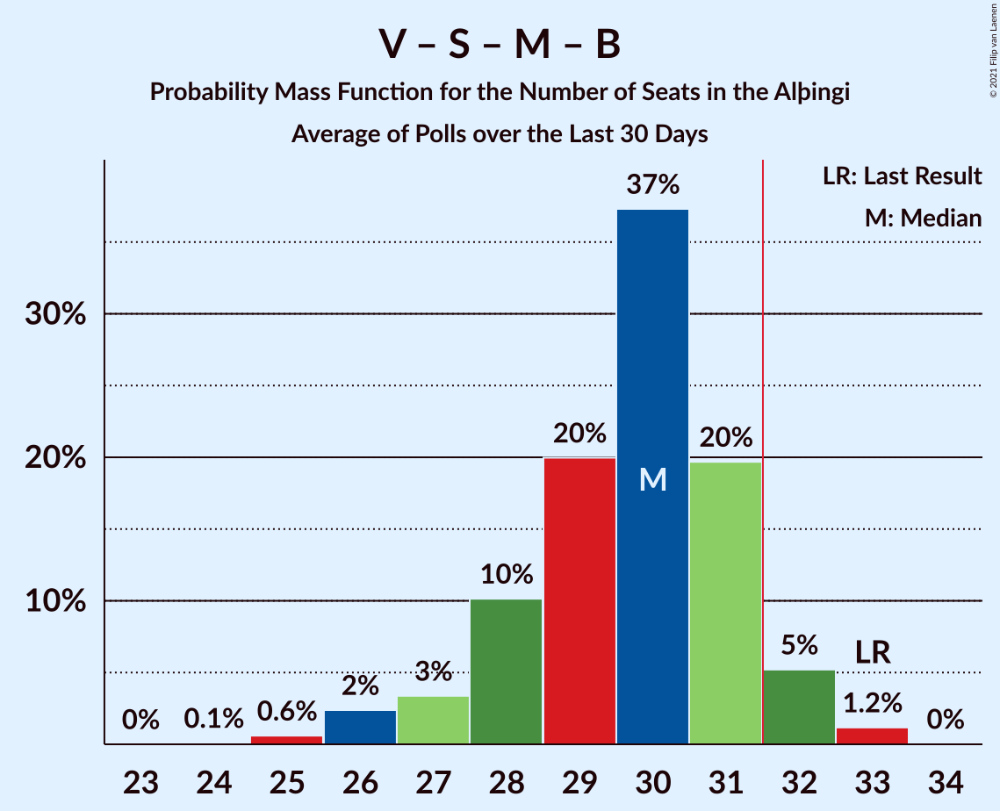

# Poll Average

<a href="#voting-intentions">Voting Intentions</a> | <a href="#seats">Seats</a> | <a href="#coalitions">Coalitions</a> | <a href="#technical-information">Technical Information</a>

## Summary

The table below lists the polls on which the average is based. They are the most recent polls (less than 30 days old) registered and analyzed so far.

| Period     | Polling firm/Commissioner(s) | D | V | S | M | B | P | F | C | A | R | T | J |
|:----------:|:----------------------------:|:--:|:--:|:--:|:--:|:--:|:--:|:--:|:--:|:--:|:--:|:--:|:--:|
| 28 October 2017 | General Election | 25.2%   16 | 16.9%   11 | 12.1%   7 | 10.9%   7 | 10.7%   8 | 9.2%   6 | 6.9%   4 | 6.7%   4 | 1.2%   0 | 0.2%   0 | 0.1%   0 | 0.0%   0 |
| N/A | Poll Average | 22–26%   15–19 | 9–14%   6–10 | 12–16%   7–11 | 7–11%   4–8 | 7–10%   4–7 | 10–18%   7–12 | 3–5%   0–3 | 7–11%   5–8 | N/A   N/A | N/A   N/A | N/A   N/A | 3–6%   0–4 |
| [23–28 July 2020](2020-07-28-MMR.html) | MMR | 21–27%   15–20 | 9–13%   6–9 | 11–15%   7–11 | 7–10%   4–8 | 7–11%   4–8 | 13–18%   9–13 | 3–5%   0–3 | 7–10%   5–7 | N/A   N/A | N/A   N/A | N/A   N/A | 4–7%   0–4 |
| [2–30 June 2020](2020-06-30-Gallup.html) | Gallup | 23–25%   16–18 | 13–15%   9–10 | 14–16%   9–11 | 9–11%   6–8 | 8–9%   5–6 | 10–12%   7–8 | 3–4%   0 | 10–11%   6–8 | N/A   N/A | N/A   N/A | N/A   N/A | 3–4%   0 |
| 28 October 2017 | General Election | 25.2%   16 | 16.9%   11 | 12.1%   7 | 10.9%   7 | 10.7%   8 | 9.2%   6 | 6.9%   4 | 6.7%   4 | 1.2%   0 | 0.2%   0 | 0.1%   0 | 0.0%   0 |

Only polls for which at least the sample size has been published are included in the table above.

**Legend:**
+ **Top half of each row:** Voting intentions (95% confidence interval)
+ **Bottom half of each row:** Seat projections for the Alþingi (95% confidence interval)
+ **D:** Sjálfstæðisflokkurinn
+ **V:** Vinstrihreyfingin – grænt framboð
+ **S:** Samfylkingin
+ **M:** Miðflokkurinn
+ **B:** Framsóknarflokkurinn
+ **P:** Píratar
+ **F:** Flokkur fólksins
+ **C:** Viðreisn
+ **A:** Björt framtíð
+ **R:** Alþýðufylkingin
+ **T:** Dögun
+ **J:** Sósíalistaflokkur Íslands
+ **N/A (single party):** Party not included the published results
+ **N/A (entire row):** Calculation for this opinion poll not started yet

## Voting Intentions

### Confidence Intervals

| Party | Last Result | Median | 80% Confidence Interval | 90% Confidence Interval | 95% Confidence Interval | 99% Confidence Interval |
|:-----:|:-----------:|:------:|:-----------------------:|:-----------------------:|:-----------------------:|:-----------------------:|
| <a href="#sjálfstæðisflokkurinn">Sjálfstæðisflokkurinn</a> | 25.2% | 24.0% | 22.8–25.3% |22.3–25.8% | 21.8–26.3% | 20.9–27.3% |
| <a href="#vinstrihreyfingin-–-grænt-framboð">Vinstrihreyfingin – grænt framboð</a> | 16.9% | 12.8% | 10.1–14.0% |9.6–14.2% | 9.3–14.4% | 8.7–14.7% |
| <a href="#samfylkingin">Samfylkingin</a> | 12.1% | 14.4% | 12.3–15.4% |11.8–15.6% | 11.5–15.8% | 10.8–16.2% |
| <a href="#miðflokkurinn">Miðflokkurinn</a> | 10.9% | 9.7% | 7.7–10.6% |7.4–10.8% | 7.1–10.9% | 6.5–11.2% |
| <a href="#framsóknarflokkurinn">Framsóknarflokkurinn</a> | 10.7% | 8.6% | 7.9–9.5% |7.6–9.9% | 7.3–10.2% | 6.7–11.0% |
| <a href="#píratar">Píratar</a> | 9.2% | 12.1% | 10.4–16.5% |10.2–17.0% | 10.0–17.5% | 9.8–18.4% |
| <a href="#flokkur-fólksins">Flokkur fólksins</a> | 6.9% | 3.7% | 3.3–4.6% |3.2–4.9% | 3.0–5.2% | 2.8–5.7% |
| <a href="#viðreisn">Viðreisn</a> | 6.7% | 9.9% | 7.7–10.9% |7.4–11.1% | 7.1–11.2% | 6.5–11.5% |
| <a href="#björt-framtíð">Björt framtíð</a> | 1.2% | N/A | N/A |N/A | N/A | N/A |
| <a href="#alþýðufylkingin">Alþýðufylkingin</a> | 0.2% | N/A | N/A |N/A | N/A | N/A |
| <a href="#dögun">Dögun</a> | 0.1% | N/A | N/A |N/A | N/A | N/A |
| <a href="#sósíalistaflokkur-íslands">Sósíalistaflokkur Íslands</a> | 0.0% | 4.2% | 3.6–5.8% |3.5–6.2% | 3.4–6.5% | 3.2–7.0% |

### Sjálfstæðisflokkurinn

*For a full overview of the results for this party, see the [Sjálfstæðisflokkurinn](party-sjálfstæðisflokkurinn.html) page.*

| Voting Intentions | Probability | Accumulated | Special Marks |
|:-----------------:|:-----------:|:-----------:|:-------------:|
| 18.5–19.5% | 0% | 100% |  |
| 19.5–20.5% | 0.2% | 100% |  |
| 20.5–21.5% | 1.5% | 99.8% |  |
| 21.5–22.5% | 6% | 98% |  |
| 22.5–23.5% | 22% | 93% |  |
| 23.5–24.5% | 45% | 71% | Median |
| 24.5–25.5% | 19% | 26% | Last Result |
| 25.5–26.5% | 5% | 7% |  |
| 26.5–27.5% | 1.5% | 2% |  |
| 27.5–28.5% | 0.3% | 0.3% |  |
| 28.5–29.5% | 0% | 0% |  |

### Vinstrihreyfingin – grænt framboð

*For a full overview of the results for this party, see the [Vinstrihreyfingin – grænt framboð](party-vinstrihreyfingin–græntframboð.html) page.*

| Voting Intentions | Probability | Accumulated | Special Marks |
|:-----------------:|:-----------:|:-----------:|:-------------:|
| 6.5–7.5% | 0% | 100% |  |
| 7.5–8.5% | 0.3% | 100% |  |
| 8.5–9.5% | 4% | 99.7% |  |
| 9.5–10.5% | 14% | 96% |  |
| 10.5–11.5% | 19% | 82% |  |
| 11.5–12.5% | 11% | 63% |  |
| 12.5–13.5% | 25% | 52% | Median |
| 13.5–14.5% | 26% | 27% |  |
| 14.5–15.5% | 1.1% | 1.1% |  |
| 15.5–16.5% | 0% | 0% |  |
| 16.5–17.5% | 0% | 0% | Last Result |

### Samfylkingin

*For a full overview of the results for this party, see the [Samfylkingin](party-samfylkingin.html) page.*

| Voting Intentions | Probability | Accumulated | Special Marks |
|:-----------------:|:-----------:|:-----------:|:-------------:|
| 8.5–9.5% | 0% | 100% |  |
| 9.5–10.5% | 0.2% | 100% |  |
| 10.5–11.5% | 3% | 99.8% |  |
| 11.5–12.5% | 11% | 97% | Last Result |
| 12.5–13.5% | 18% | 86% |  |
| 13.5–14.5% | 25% | 69% | Median |
| 14.5–15.5% | 38% | 44% |  |
| 15.5–16.5% | 5% | 6% |  |
| 16.5–17.5% | 0.1% | 0.1% |  |
| 17.5–18.5% | 0% | 0% |  |

### Miðflokkurinn

*For a full overview of the results for this party, see the [Miðflokkurinn](party-miðflokkurinn.html) page.*

| Voting Intentions | Probability | Accumulated | Special Marks |
|:-----------------:|:-----------:|:-----------:|:-------------:|
| 4.5–5.5% | 0% | 100% |  |
| 5.5–6.5% | 0.5% | 100% |  |
| 6.5–7.5% | 7% | 99.5% |  |
| 7.5–8.5% | 20% | 93% |  |
| 8.5–9.5% | 20% | 73% |  |
| 9.5–10.5% | 42% | 54% | Median |
| 10.5–11.5% | 11% | 11% | Last Result |
| 11.5–12.5% | 0.1% | 0.1% |  |
| 12.5–13.5% | 0% | 0% |  |

### Framsóknarflokkurinn

*For a full overview of the results for this party, see the [Framsóknarflokkurinn](party-framsóknarflokkurinn.html) page.*

| Voting Intentions | Probability | Accumulated | Special Marks |
|:-----------------:|:-----------:|:-----------:|:-------------:|
| 4.5–5.5% | 0% | 100% |  |
| 5.5–6.5% | 0.3% | 100% |  |
| 6.5–7.5% | 5% | 99.7% |  |
| 7.5–8.5% | 39% | 95% |  |
| 8.5–9.5% | 47% | 56% | Median |
| 9.5–10.5% | 8% | 9% |  |
| 10.5–11.5% | 1.2% | 1.3% | Last Result |
| 11.5–12.5% | 0.1% | 0.1% |  |
| 12.5–13.5% | 0% | 0% |  |

### Píratar

*For a full overview of the results for this party, see the [Píratar](party-píratar.html) page.*

| Voting Intentions | Probability | Accumulated | Special Marks |
|:-----------------:|:-----------:|:-----------:|:-------------:|
| 8.5–9.5% | 0.1% | 100% | Last Result |
| 9.5–10.5% | 18% | 99.9% |  |
| 10.5–11.5% | 31% | 82% |  |
| 11.5–12.5% | 1.3% | 51% | Median |
| 12.5–13.5% | 2% | 50% |  |
| 13.5–14.5% | 8% | 48% |  |
| 14.5–15.5% | 15% | 40% |  |
| 15.5–16.5% | 15% | 24% |  |
| 16.5–17.5% | 7% | 9% |  |
| 17.5–18.5% | 2% | 2% |  |
| 18.5–19.5% | 0.3% | 0.3% |  |
| 19.5–20.5% | 0% | 0% |  |

### Flokkur fólksins

*For a full overview of the results for this party, see the [Flokkur fólksins](party-flokkurfólksins.html) page.*

| Voting Intentions | Probability | Accumulated | Special Marks |
|:-----------------:|:-----------:|:-----------:|:-------------:|
| 0.5–1.5% | 0% | 100% |  |
| 1.5–2.5% | 0.2% | 100% |  |
| 2.5–3.5% | 31% | 99.8% |  |
| 3.5–4.5% | 58% | 69% | Median |
| 4.5–5.5% | 10% | 11% |  |
| 5.5–6.5% | 0.9% | 0.9% |  |
| 6.5–7.5% | 0% | 0% | Last Result |

### Viðreisn

*For a full overview of the results for this party, see the [Viðreisn](party-viðreisn.html) page.*

| Voting Intentions | Probability | Accumulated | Special Marks |
|:-----------------:|:-----------:|:-----------:|:-------------:|
| 4.5–5.5% | 0% | 100% |  |
| 5.5–6.5% | 0.5% | 100% |  |
| 6.5–7.5% | 7% | 99.5% | Last Result |
| 7.5–8.5% | 20% | 93% |  |
| 8.5–9.5% | 18% | 73% |  |
| 9.5–10.5% | 31% | 56% | Median |
| 10.5–11.5% | 24% | 24% |  |
| 11.5–12.5% | 0.4% | 0.4% |  |
| 12.5–13.5% | 0% | 0% |  |

### Sósíalistaflokkur Íslands

*For a full overview of the results for this party, see the [Sósíalistaflokkur Íslands](party-sósíalistaflokkuríslands.html) page.*

| Voting Intentions | Probability | Accumulated | Special Marks |
|:-----------------:|:-----------:|:-----------:|:-------------:|
| 0.0–0.5% | 0% | 100% | Last Result |
| 0.5–1.5% | 0% | 100% |  |
| 1.5–2.5% | 0% | 100% |  |
| 2.5–3.5% | 8% | 100% |  |
| 3.5–4.5% | 51% | 92% | Median |
| 4.5–5.5% | 25% | 42% |  |
| 5.5–6.5% | 14% | 16% |  |
| 6.5–7.5% | 2% | 2% |  |
| 7.5–8.5% | 0.1% | 0.1% |  |
| 8.5–9.5% | 0% | 0% |  |

## Seats

### Confidence Intervals

| Party | Last Result | Median | 80% Confidence Interval | 90% Confidence Interval | 95% Confidence Interval | 99% Confidence Interval |
|:-----:|:-----------:|:------:|:-----------------------:|:-----------------------:|:-----------------------:|:-----------------------:|
| <a href="#sjálfstæðisflokkurinn">Sjálfstæðisflokkurinn</a> | 16 | 17 | 16–19 |15–19 | 15–19 | 14–20 |
| <a href="#vinstrihreyfingin-–-grænt-framboð">Vinstrihreyfingin – grænt framboð</a> | 11 | 9 | 7–10 |6–10 | 6–10 | 6–10 |
| <a href="#samfylkingin">Samfylkingin</a> | 7 | 10 | 8–10 |8–11 | 7–11 | 7–11 |
| <a href="#miðflokkurinn">Miðflokkurinn</a> | 7 | 6 | 5–7 |5–7 | 4–8 | 4–8 |
| <a href="#framsóknarflokkurinn">Framsóknarflokkurinn</a> | 8 | 6 | 5–7 |4–7 | 4–7 | 4–8 |
| <a href="#píratar">Píratar</a> | 6 | 8 | 7–11 |7–12 | 7–12 | 6–13 |
| <a href="#flokkur-fólksins">Flokkur fólksins</a> | 4 | 0 | 0 |0–3 | 0–3 | 0–3 |
| <a href="#viðreisn">Viðreisn</a> | 4 | 7 | 5–7 |5–7 | 5–8 | 4–8 |
| <a href="#björt-framtíð">Björt framtíð</a> | 0 | N/A | N/A |N/A | N/A | N/A |
| <a href="#alþýðufylkingin">Alþýðufylkingin</a> | 0 | N/A | N/A |N/A | N/A | N/A |
| <a href="#dögun">Dögun</a> | 0 | N/A | N/A |N/A | N/A | N/A |
| <a href="#sósíalistaflokkur-íslands">Sósíalistaflokkur Íslands</a> | 0 | 0 | 0–4 |0–4 | 0–4 | 0–4 |

### Sjálfstæðisflokkurinn

*For a full overview of the results for this party, see the [Sjálfstæðisflokkurinn](party-sjálfstæðisflokkurinn.html) page.*

| Number of Seats | Probability | Accumulated | Special Marks |
|:---------------:|:-----------:|:-----------:|:-------------:|
| 14 | 0.8% | 100% |  |
| 15 | 5% | 99.2% |  |
| 16 | 23% | 94% | Last Result |
| 17 | 42% | 71% | Median |
| 18 | 18% | 30% |  |
| 19 | 10% | 11% |  |
| 20 | 1.3% | 2% |  |
| 21 | 0.3% | 0.5% |  |
| 22 | 0.2% | 0.2% |  |
| 23 | 0% | 0% |  |

### Vinstrihreyfingin – grænt framboð

*For a full overview of the results for this party, see the [Vinstrihreyfingin – grænt framboð](party-vinstrihreyfingin–græntframboð.html) page.*

| Number of Seats | Probability | Accumulated | Special Marks |
|:---------------:|:-----------:|:-----------:|:-------------:|
| 5 | 0.3% | 100% |  |
| 6 | 8% | 99.7% |  |
| 7 | 15% | 92% |  |
| 8 | 20% | 76% |  |
| 9 | 32% | 56% | Median |
| 10 | 24% | 24% |  |
| 11 | 0% | 0% | Last Result |

### Samfylkingin

*For a full overview of the results for this party, see the [Samfylkingin](party-samfylkingin.html) page.*

| Number of Seats | Probability | Accumulated | Special Marks |
|:---------------:|:-----------:|:-----------:|:-------------:|
| 6 | 0.3% | 100% |  |
| 7 | 4% | 99.7% | Last Result |
| 8 | 19% | 95% |  |
| 9 | 19% | 77% |  |
| 10 | 50% | 57% | Median |
| 11 | 7% | 7% |  |
| 12 | 0.4% | 0.4% |  |
| 13 | 0% | 0% |  |

### Miðflokkurinn

*For a full overview of the results for this party, see the [Miðflokkurinn](party-miðflokkurinn.html) page.*

| Number of Seats | Probability | Accumulated | Special Marks |
|:---------------:|:-----------:|:-----------:|:-------------:|
| 3 | 0.2% | 100% |  |
| 4 | 3% | 99.8% |  |
| 5 | 29% | 97% |  |
| 6 | 19% | 67% | Median |
| 7 | 46% | 48% | Last Result |
| 8 | 3% | 3% |  |
| 9 | 0.1% | 0.1% |  |
| 10 | 0% | 0% |  |

### Framsóknarflokkurinn

*For a full overview of the results for this party, see the [Framsóknarflokkurinn](party-framsóknarflokkurinn.html) page.*

| Number of Seats | Probability | Accumulated | Special Marks |
|:---------------:|:-----------:|:-----------:|:-------------:|
| 4 | 6% | 100% |  |
| 5 | 39% | 94% |  |
| 6 | 46% | 56% | Median |
| 7 | 9% | 10% |  |
| 8 | 1.5% | 2% | Last Result |
| 9 | 0.1% | 0.1% |  |
| 10 | 0% | 0% |  |

### Píratar

*For a full overview of the results for this party, see the [Píratar](party-píratar.html) page.*

| Number of Seats | Probability | Accumulated | Special Marks |
|:---------------:|:-----------:|:-----------:|:-------------:|
| 6 | 1.2% | 100% | Last Result |
| 7 | 39% | 98.8% |  |
| 8 | 10% | 60% | Median |
| 9 | 5% | 50% |  |
| 10 | 26% | 45% |  |
| 11 | 14% | 19% |  |
| 12 | 4% | 5% |  |
| 13 | 1.3% | 1.4% |  |
| 14 | 0.1% | 0.1% |  |
| 15 | 0% | 0% |  |

### Flokkur fólksins

*For a full overview of the results for this party, see the [Flokkur fólksins](party-flokkurfólksins.html) page.*

| Number of Seats | Probability | Accumulated | Special Marks |
|:---------------:|:-----------:|:-----------:|:-------------:|
| 0 | 95% | 100% | Median |
| 1 | 0% | 5% |  |
| 2 | 0% | 5% |  |
| 3 | 5% | 5% |  |
| 4 | 0.5% | 0.5% | Last Result |
| 5 | 0% | 0% |  |

### Viðreisn

*For a full overview of the results for this party, see the [Viðreisn](party-viðreisn.html) page.*

| Number of Seats | Probability | Accumulated | Special Marks |
|:---------------:|:-----------:|:-----------:|:-------------:|
| 4 | 1.2% | 100% | Last Result |
| 5 | 24% | 98.8% |  |
| 6 | 24% | 75% |  |
| 7 | 47% | 50% | Median |
| 8 | 3% | 3% |  |
| 9 | 0% | 0% |  |

### Björt framtíð

*For a full overview of the results for this party, see the [Björt framtíð](party-björtframtíð.html) page.*

### Alþýðufylkingin

*For a full overview of the results for this party, see the [Alþýðufylkingin](party-alþýðufylkingin.html) page.*

### Dögun

*For a full overview of the results for this party, see the [Dögun](party-dögun.html) page.*

### Sósíalistaflokkur Íslands

*For a full overview of the results for this party, see the [Sósíalistaflokkur Íslands](party-sósíalistaflokkuríslands.html) page.*

| Number of Seats | Probability | Accumulated | Special Marks |
|:---------------:|:-----------:|:-----------:|:-------------:|
| 0 | 68% | 100% | Last Result, Median |
| 1 | 0% | 32% |  |
| 2 | 0% | 32% |  |
| 3 | 19% | 32% |  |
| 4 | 13% | 13% |  |
| 5 | 0.5% | 0.5% |  |
| 6 | 0% | 0% |  |

## Coalitions

### Confidence Intervals

| Coalition | Last Result | Median | Majority? | 80% Confidence Interval | 90% Confidence Interval | 95% Confidence Interval | 99% Confidence Interval |
|:---------:|:-----------:|:------:|:---------:|:-----------------------:|:-----------------------:|:-----------------------:|:-----------------------:|
| Vinstrihreyfingin – grænt framboð – Samfylkingin – Píratar – Viðreisn – Björt framtíð | 28 | 33 | 85% | 31–34 | 30–35 | 30–35 | 29–36 |
| Vinstrihreyfingin – grænt framboð – Samfylkingin – Píratar – Viðreisn | 28 | 33 | 85% | 31–34 | 30–35 | 30–35 | 29–36 |
| Sjálfstæðisflokkurinn – Vinstrihreyfingin – grænt framboð – Framsóknarflokkurinn | 35 | 32 | 54% | 29–32 | 28–33 | 28–33 | 27–34 |
| Vinstrihreyfingin – grænt framboð – Samfylkingin – Miðflokkurinn – Framsóknarflokkurinn | 33 | 31 | 46% | 26–32 | 25–33 | 24–33 | 23–34 |
| Sjálfstæðisflokkurinn – Miðflokkurinn – Framsóknarflokkurinn | 31 | 29 | 0.5% | 27–30 | 26–30 | 25–31 | 25–32 |
| Vinstrihreyfingin – grænt framboð – Samfylkingin – Píratar – Björt framtíð | 24 | 27 | 0% | 25–28 | 25–29 | 24–29 | 23–30 |
| Vinstrihreyfingin – grænt framboð – Samfylkingin – Píratar | 24 | 27 | 0% | 25–28 | 25–29 | 24–29 | 23–30 |
| Sjálfstæðisflokkurinn – Samfylkingin | 23 | 27 | 0% | 25–28 | 24–28 | 24–28 | 22–29 |
| Sjálfstæðisflokkurinn – Vinstrihreyfingin – grænt framboð | 27 | 26 | 0% | 24–27 | 23–27 | 22–28 | 21–28 |
| Vinstrihreyfingin – grænt framboð – Samfylkingin – Miðflokkurinn | 25 | 25 | 0% | 20–27 | 20–27 | 19–27 | 18–28 |
| Vinstrihreyfingin – grænt framboð – Samfylkingin – Framsóknarflokkurinn | 26 | 24 | 0% | 20–25 | 20–26 | 19–26 | 18–27 |
| Sjálfstæðisflokkurinn – Viðreisn – Björt framtíð | 20 | 24 | 0% | 21–25 | 21–25 | 20–25 | 19–26 |
| Sjálfstæðisflokkurinn – Framsóknarflokkurinn | 24 | 23 | 0% | 22–24 | 21–25 | 20–25 | 19–26 |
| Sjálfstæðisflokkurinn – Miðflokkurinn | 23 | 23 | 0% | 21–25 | 21–25 | 20–25 | 19–26 |
| Sjálfstæðisflokkurinn – Viðreisn | 20 | 24 | 0% | 21–25 | 21–25 | 20–25 | 19–26 |
| Vinstrihreyfingin – grænt framboð – Miðflokkurinn – Framsóknarflokkurinn | 26 | 21 | 0% | 17–22 | 16–22 | 16–23 | 15–23 |
| Vinstrihreyfingin – grænt framboð – Píratar | 17 | 17 | 0% | 16–19 | 16–20 | 16–20 | 15–21 |
| Vinstrihreyfingin – grænt framboð – Samfylkingin | 18 | 19 | 0% | 15–20 | 15–20 | 14–20 | 13–21 |
| Sjálfstæðisflokkurinn – Björt framtíð | 16 | 17 | 0% | 16–19 | 15–19 | 15–19 | 14–20 |
| Vinstrihreyfingin – grænt framboð – Miðflokkurinn | 18 | 15 | 0% | 12–17 | 11–17 | 11–17 | 10–17 |
| Vinstrihreyfingin – grænt framboð – Framsóknarflokkurinn | 19 | 15 | 0% | 12–15 | 11–16 | 11–16 | 10–16 |

### Vinstrihreyfingin – grænt framboð – Samfylkingin – Píratar – Viðreisn – Björt framtíð

| Number of Seats | Probability | Accumulated | Special Marks |
|:---------------:|:-----------:|:-----------:|:-------------:|
| 27 | 0.1% | 100% |  |
| 28 | 0.3% | 99.9% | Last Result |
| 29 | 2% | 99.6% |  |
| 30 | 7% | 98% |  |
| 31 | 7% | 91% |  |
| 32 | 16% | 85% | Majority |
| 33 | 28% | 69% |  |
| 34 | 32% | 40% | Median |
| 35 | 7% | 8% |  |
| 36 | 0.9% | 1.0% |  |
| 37 | 0.1% | 0.1% |  |
| 38 | 0% | 0% |  |

### Vinstrihreyfingin – grænt framboð – Samfylkingin – Píratar – Viðreisn

| Number of Seats | Probability | Accumulated | Special Marks |
|:---------------:|:-----------:|:-----------:|:-------------:|
| 27 | 0.1% | 100% |  |
| 28 | 0.3% | 99.9% | Last Result |
| 29 | 2% | 99.6% |  |
| 30 | 7% | 98% |  |
| 31 | 7% | 91% |  |
| 32 | 16% | 85% | Majority |
| 33 | 28% | 69% |  |
| 34 | 32% | 40% | Median |
| 35 | 7% | 8% |  |
| 36 | 0.9% | 1.0% |  |
| 37 | 0.1% | 0.1% |  |
| 38 | 0% | 0% |  |

### Sjálfstæðisflokkurinn – Vinstrihreyfingin – grænt framboð – Framsóknarflokkurinn

| Number of Seats | Probability | Accumulated | Special Marks |
|:---------------:|:-----------:|:-----------:|:-------------:|
| 25 | 0.1% | 100% |  |
| 26 | 0.3% | 99.9% |  |
| 27 | 1.2% | 99.6% |  |
| 28 | 5% | 98% |  |
| 29 | 6% | 94% |  |
| 30 | 11% | 88% |  |
| 31 | 23% | 77% |  |
| 32 | 47% | 54% | Median, Majority |
| 33 | 5% | 6% |  |
| 34 | 0.6% | 0.8% |  |
| 35 | 0.2% | 0.2% | Last Result |
| 36 | 0% | 0% |  |

### Vinstrihreyfingin – grænt framboð – Samfylkingin – Miðflokkurinn – Framsóknarflokkurinn

| Number of Seats | Probability | Accumulated | Special Marks |
|:---------------:|:-----------:|:-----------:|:-------------:|
| 23 | 1.2% | 100% |  |
| 24 | 3% | 98.8% |  |
| 25 | 5% | 96% |  |
| 26 | 12% | 91% |  |
| 27 | 9% | 80% |  |
| 28 | 8% | 71% |  |
| 29 | 6% | 63% |  |
| 30 | 6% | 57% |  |
| 31 | 6% | 51% | Median |
| 32 | 38% | 46% | Majority |
| 33 | 7% | 8% | Last Result |
| 34 | 0.6% | 0.6% |  |
| 35 | 0% | 0% |  |

### Sjálfstæðisflokkurinn – Miðflokkurinn – Framsóknarflokkurinn

| Number of Seats | Probability | Accumulated | Special Marks |
|:---------------:|:-----------:|:-----------:|:-------------:|
| 24 | 0.5% | 100% |  |
| 25 | 2% | 99.5% |  |
| 26 | 3% | 97% |  |
| 27 | 6% | 94% |  |
| 28 | 19% | 89% |  |
| 29 | 38% | 70% | Median |
| 30 | 29% | 32% |  |
| 31 | 3% | 3% | Last Result |
| 32 | 0.5% | 0.5% | Majority |
| 33 | 0% | 0% |  |

### Vinstrihreyfingin – grænt framboð – Samfylkingin – Píratar – Björt framtíð

| Number of Seats | Probability | Accumulated | Special Marks |
|:---------------:|:-----------:|:-----------:|:-------------:|
| 22 | 0.1% | 100% |  |
| 23 | 1.4% | 99.9% |  |
| 24 | 3% | 98% | Last Result |
| 25 | 8% | 95% |  |
| 26 | 26% | 88% |  |
| 27 | 48% | 62% | Median |
| 28 | 8% | 13% |  |
| 29 | 5% | 6% |  |
| 30 | 0.8% | 1.2% |  |
| 31 | 0.4% | 0.4% |  |
| 32 | 0% | 0% | Majority |

### Vinstrihreyfingin – grænt framboð – Samfylkingin – Píratar

| Number of Seats | Probability | Accumulated | Special Marks |
|:---------------:|:-----------:|:-----------:|:-------------:|
| 22 | 0.1% | 100% |  |
| 23 | 1.4% | 99.9% |  |
| 24 | 3% | 98% | Last Result |
| 25 | 8% | 95% |  |
| 26 | 26% | 88% |  |
| 27 | 48% | 62% | Median |
| 28 | 8% | 13% |  |
| 29 | 5% | 6% |  |
| 30 | 0.8% | 1.2% |  |
| 31 | 0.4% | 0.4% |  |
| 32 | 0% | 0% | Majority |

### Sjálfstæðisflokkurinn – Samfylkingin

| Number of Seats | Probability | Accumulated | Special Marks |
|:---------------:|:-----------:|:-----------:|:-------------:|
| 22 | 0.6% | 100% |  |
| 23 | 1.2% | 99.4% | Last Result |
| 24 | 5% | 98% |  |
| 25 | 14% | 93% |  |
| 26 | 19% | 79% |  |
| 27 | 48% | 60% | Median |
| 28 | 11% | 12% |  |
| 29 | 1.1% | 1.4% |  |
| 30 | 0.1% | 0.4% |  |
| 31 | 0.2% | 0.2% |  |
| 32 | 0% | 0% | Majority |

### Sjálfstæðisflokkurinn – Vinstrihreyfingin – grænt framboð

| Number of Seats | Probability | Accumulated | Special Marks |
|:---------------:|:-----------:|:-----------:|:-------------:|
| 20 | 0.1% | 100% |  |
| 21 | 1.1% | 99.9% |  |
| 22 | 2% | 98.8% |  |
| 23 | 6% | 97% |  |
| 24 | 10% | 91% |  |
| 25 | 21% | 81% |  |
| 26 | 34% | 60% | Median |
| 27 | 23% | 26% | Last Result |
| 28 | 2% | 3% |  |
| 29 | 0.4% | 0.4% |  |
| 30 | 0% | 0% |  |

### Vinstrihreyfingin – grænt framboð – Samfylkingin – Miðflokkurinn

| Number of Seats | Probability | Accumulated | Special Marks |
|:---------------:|:-----------:|:-----------:|:-------------:|
| 18 | 1.3% | 100% |  |
| 19 | 3% | 98.6% |  |
| 20 | 9% | 95% |  |
| 21 | 8% | 87% |  |
| 22 | 19% | 79% |  |
| 23 | 5% | 60% |  |
| 24 | 3% | 55% |  |
| 25 | 5% | 52% | Last Result, Median |
| 26 | 22% | 47% |  |
| 27 | 23% | 25% |  |
| 28 | 2% | 2% |  |
| 29 | 0% | 0% |  |

### Vinstrihreyfingin – grænt framboð – Samfylkingin – Framsóknarflokkurinn

| Number of Seats | Probability | Accumulated | Special Marks |
|:---------------:|:-----------:|:-----------:|:-------------:|
| 17 | 0.1% | 100% |  |
| 18 | 1.1% | 99.9% |  |
| 19 | 3% | 98.7% |  |
| 20 | 6% | 96% |  |
| 21 | 15% | 90% |  |
| 22 | 7% | 75% |  |
| 23 | 10% | 68% |  |
| 24 | 8% | 58% |  |
| 25 | 40% | 50% | Median |
| 26 | 8% | 10% | Last Result |
| 27 | 1.3% | 1.3% |  |
| 28 | 0% | 0% |  |

### Sjálfstæðisflokkurinn – Viðreisn – Björt framtíð

| Number of Seats | Probability | Accumulated | Special Marks |
|:---------------:|:-----------:|:-----------:|:-------------:|
| 19 | 0.6% | 100% |  |
| 20 | 3% | 99.4% | Last Result |
| 21 | 7% | 97% |  |
| 22 | 9% | 89% |  |
| 23 | 27% | 81% |  |
| 24 | 39% | 53% | Median |
| 25 | 12% | 14% |  |
| 26 | 1.3% | 2% |  |
| 27 | 0.2% | 0.4% |  |
| 28 | 0.2% | 0.2% |  |
| 29 | 0% | 0% |  |

### Sjálfstæðisflokkurinn – Framsóknarflokkurinn

| Number of Seats | Probability | Accumulated | Special Marks |
|:---------------:|:-----------:|:-----------:|:-------------:|
| 19 | 0.7% | 100% |  |
| 20 | 3% | 99.3% |  |
| 21 | 6% | 97% |  |
| 22 | 36% | 90% |  |
| 23 | 34% | 55% | Median |
| 24 | 15% | 21% | Last Result |
| 25 | 5% | 6% |  |
| 26 | 0.8% | 1.1% |  |
| 27 | 0.3% | 0.3% |  |
| 28 | 0% | 0% |  |

### Sjálfstæðisflokkurinn – Miðflokkurinn

| Number of Seats | Probability | Accumulated | Special Marks |
|:---------------:|:-----------:|:-----------:|:-------------:|
| 19 | 0.6% | 100% |  |
| 20 | 3% | 99.3% |  |
| 21 | 8% | 97% |  |
| 22 | 10% | 88% |  |
| 23 | 31% | 79% | Last Result, Median |
| 24 | 37% | 48% |  |
| 25 | 10% | 11% |  |
| 26 | 0.4% | 0.6% |  |
| 27 | 0.2% | 0.2% |  |
| 28 | 0% | 0% |  |

### Sjálfstæðisflokkurinn – Viðreisn

| Number of Seats | Probability | Accumulated | Special Marks |
|:---------------:|:-----------:|:-----------:|:-------------:|
| 19 | 0.6% | 100% |  |
| 20 | 3% | 99.4% | Last Result |
| 21 | 7% | 97% |  |
| 22 | 9% | 89% |  |
| 23 | 27% | 81% |  |
| 24 | 39% | 53% | Median |
| 25 | 12% | 14% |  |
| 26 | 1.3% | 2% |  |
| 27 | 0.2% | 0.4% |  |
| 28 | 0.2% | 0.2% |  |
| 29 | 0% | 0% |  |

### Vinstrihreyfingin – grænt framboð – Miðflokkurinn – Framsóknarflokkurinn

| Number of Seats | Probability | Accumulated | Special Marks |
|:---------------:|:-----------:|:-----------:|:-------------:|
| 14 | 0% | 100% |  |
| 15 | 2% | 99.9% |  |
| 16 | 3% | 98% |  |
| 17 | 9% | 95% |  |
| 18 | 9% | 86% |  |
| 19 | 11% | 77% |  |
| 20 | 12% | 65% |  |
| 21 | 8% | 54% | Median |
| 22 | 41% | 46% |  |
| 23 | 5% | 5% |  |
| 24 | 0% | 0% |  |
| 25 | 0% | 0% |  |
| 26 | 0% | 0% | Last Result |

### Vinstrihreyfingin – grænt framboð – Píratar

| Number of Seats | Probability | Accumulated | Special Marks |
|:---------------:|:-----------:|:-----------:|:-------------:|
| 14 | 0.1% | 100% |  |
| 15 | 2% | 99.9% |  |
| 16 | 26% | 98% |  |
| 17 | 38% | 72% | Last Result, Median |
| 18 | 16% | 34% |  |
| 19 | 13% | 18% |  |
| 20 | 4% | 5% |  |
| 21 | 1.1% | 1.1% |  |
| 22 | 0.1% | 0.1% |  |
| 23 | 0% | 0% |  |

### Vinstrihreyfingin – grænt framboð – Samfylkingin

| Number of Seats | Probability | Accumulated | Special Marks |
|:---------------:|:-----------:|:-----------:|:-------------:|
| 13 | 1.3% | 100% |  |
| 14 | 3% | 98.6% |  |
| 15 | 10% | 95% |  |
| 16 | 14% | 85% |  |
| 17 | 16% | 71% |  |
| 18 | 5% | 55% | Last Result |
| 19 | 24% | 50% | Median |
| 20 | 24% | 26% |  |
| 21 | 2% | 2% |  |
| 22 | 0% | 0% |  |

### Sjálfstæðisflokkurinn – Björt framtíð

| Number of Seats | Probability | Accumulated | Special Marks |
|:---------------:|:-----------:|:-----------:|:-------------:|
| 14 | 0.8% | 100% |  |
| 15 | 5% | 99.2% |  |
| 16 | 23% | 94% | Last Result |
| 17 | 42% | 71% | Median |
| 18 | 18% | 30% |  |
| 19 | 10% | 11% |  |
| 20 | 1.3% | 2% |  |
| 21 | 0.3% | 0.5% |  |
| 22 | 0.2% | 0.2% |  |
| 23 | 0% | 0% |  |

### Vinstrihreyfingin – grænt framboð – Miðflokkurinn

| Number of Seats | Probability | Accumulated | Special Marks |
|:---------------:|:-----------:|:-----------:|:-------------:|
| 9 | 0.1% | 100% |  |
| 10 | 0.7% | 99.9% |  |
| 11 | 7% | 99.2% |  |
| 12 | 10% | 92% |  |
| 13 | 15% | 82% |  |
| 14 | 14% | 67% |  |
| 15 | 7% | 53% | Median |
| 16 | 24% | 47% |  |
| 17 | 23% | 23% |  |
| 18 | 0.1% | 0.1% | Last Result |
| 19 | 0% | 0% |  |

### Vinstrihreyfingin – grænt framboð – Framsóknarflokkurinn

| Number of Seats | Probability | Accumulated | Special Marks |
|:---------------:|:-----------:|:-----------:|:-------------:|
| 9 | 0.1% | 100% |  |
| 10 | 2% | 99.9% |  |
| 11 | 4% | 98% |  |
| 12 | 10% | 94% |  |
| 13 | 17% | 85% |  |
| 14 | 10% | 68% |  |
| 15 | 51% | 58% | Median |
| 16 | 6% | 6% |  |
| 17 | 0.3% | 0.3% |  |
| 18 | 0% | 0% |  |
| 19 | 0% | 0% | Last Result |

## Technical Information

+ **Number of polls included in this average:** 2
+ **Lowest number of simulations done in a poll included in this average:** 262,144
+ **Total number of simulations done in the polls included in this average:** 1,310,720
+ **Error estimate:** 3.14%
