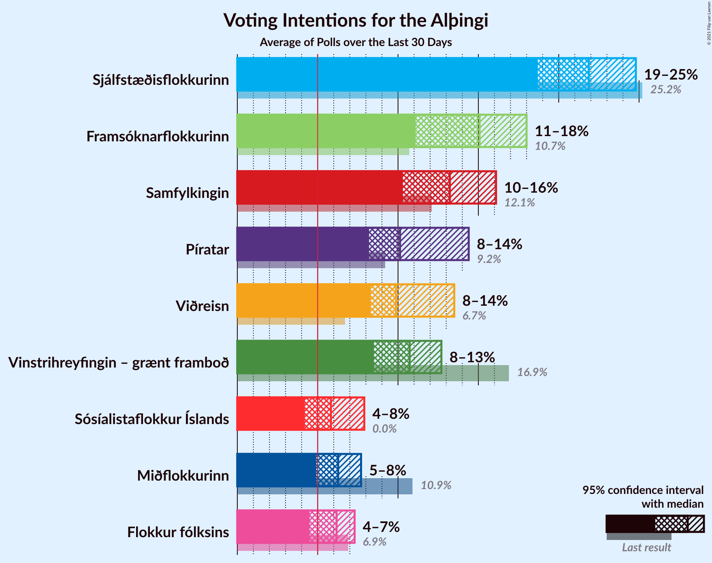

# Poll Average

<a href="#voting-intentions">Voting Intentions</a> | <a href="#seats">Seats</a> | <a href="#coalitions">Coalitions</a> | <a href="#technical-information">Technical Information</a>

## Summary

The table below lists the polls on which the average is based. They are the most recent polls (less than 30 days old) registered and analyzed so far.

| Period     | Polling firm/Commissioner(s) | D | V | S | M | B | P | F | C | A | R | T | J |
|:----------:|:----------------------------:|:--:|:--:|:--:|:--:|:--:|:--:|:--:|:--:|:--:|:--:|:--:|:--:|
| 28 October 2017 | General Election | 25.2%   16 | 16.9%   11 | 12.1%   7 | 10.9%   7 | 10.7%   8 | 9.2%   6 | 6.9%   4 | 6.7%   4 | 1.2%   0 | 0.2%   0 | 0.1%   0 | 0.0%   0 |
| N/A | Poll Average | 21–26%   14–18 | 12–16%   8–10 | 10–15%   7–10 | 4–7%   1–5 | 10–15%   6–11 | 8–13%   5–9 | 3–6%   0–3 | 8–13%   5–8 | N/A   N/A | N/A   N/A | N/A   N/A | 6–8%   3–6 |
| [13–23 August 2021](2021-08-23-Maskína.html) | Maskína   Bylgjan, Stöð 2 and Vísir | 21–26%   14–19 | 12–17%   7–11 | 11–15%   7–10 | 4–7%   0–4 | 11–15%   8–11 | 8–12%   5–8 | 3–6%   0–3 | 9–13%   5–8 | N/A   N/A | N/A   N/A | N/A   N/A | 5–9%   3–6 |
| [29 July–15 August 2021](2021-08-15-Gallup.html) | Gallup | 23–26%   16–18 | 13–15%   9–10 | 10–12%   7–8 | 6–7%   4–5 | 10–11%   6–8 | 12–13%   8–9 | 4–5%   0 | 8–10%   5–6 | N/A   N/A | N/A   N/A | N/A   N/A | 6–7%   4–5 |
| 28 October 2017 | General Election | 25.2%   16 | 16.9%   11 | 12.1%   7 | 10.9%   7 | 10.7%   8 | 9.2%   6 | 6.9%   4 | 6.7%   4 | 1.2%   0 | 0.2%   0 | 0.1%   0 | 0.0%   0 |

Only polls for which at least the sample size has been published are included in the table above.

**Legend:**
+ **Top half of each row:** Voting intentions (95% confidence interval)
+ **Bottom half of each row:** Seat projections for the Alþingi (95% confidence interval)
+ **D:** Sjálfstæðisflokkurinn
+ **V:** Vinstrihreyfingin – grænt framboð
+ **S:** Samfylkingin
+ **M:** Miðflokkurinn
+ **B:** Framsóknarflokkurinn
+ **P:** Píratar
+ **F:** Flokkur fólksins
+ **C:** Viðreisn
+ **A:** Björt framtíð
+ **R:** Alþýðufylkingin
+ **T:** Dögun
+ **J:** Sósíalistaflokkur Íslands
+ **N/A (single party):** Party not included the published results
+ **N/A (entire row):** Calculation for this opinion poll not started yet

## Voting Intentions

### Confidence Intervals

| Party | Last Result | Median | 80% Confidence Interval | 90% Confidence Interval | 95% Confidence Interval | 99% Confidence Interval |
|:-----:|:-----------:|:------:|:-----------------------:|:-----------------------:|:-----------------------:|:-----------------------:|
| <a href="#sjálfstæðisflokkurinn">Sjálfstæðisflokkurinn</a> | 25.2% | 24.2% | 22.2–25.2% |21.5–25.6% | 21.0–25.9% | 20.1–26.9% |
| <a href="#vinstrihreyfingin-–-grænt-framboð">Vinstrihreyfingin – grænt framboð</a> | 16.9% | 14.2% | 13.2–15.3% |12.8–15.9% | 12.4–16.3% | 11.6–17.3% |
| <a href="#samfylkingin">Samfylkingin</a> | 12.1% | 11.7% | 10.8–14.1% |10.7–14.6% | 10.5–15.1% | 10.2–16.0% |
| <a href="#miðflokkurinn">Miðflokkurinn</a> | 10.9% | 6.3% | 4.5–7.0% |4.2–7.1% | 4.0–7.3% | 3.6–7.5% |
| <a href="#framsóknarflokkurinn">Framsóknarflokkurinn</a> | 10.7% | 11.0% | 10.1–13.7% |9.9–14.2% | 9.8–14.7% | 9.5–15.6% |
| <a href="#píratar">Píratar</a> | 9.2% | 11.9% | 9.1–13.0% |8.6–13.1% | 8.3–13.3% | 7.7–13.6% |
| <a href="#flokkur-fólksins">Flokkur fólksins</a> | 6.9% | 4.2% | 3.7–4.9% |3.5–5.3% | 3.3–5.6% | 2.9–6.2% |
| <a href="#viðreisn">Viðreisn</a> | 6.7% | 9.5% | 8.8–11.7% |8.6–12.2% | 8.5–12.6% | 8.2–13.4% |
| <a href="#björt-framtíð">Björt framtíð</a> | 1.2% | N/A | N/A |N/A | N/A | N/A |
| <a href="#alþýðufylkingin">Alþýðufylkingin</a> | 0.2% | N/A | N/A |N/A | N/A | N/A |
| <a href="#dögun">Dögun</a> | 0.1% | N/A | N/A |N/A | N/A | N/A |
| <a href="#sósíalistaflokkur-íslands">Sósíalistaflokkur Íslands</a> | 0.0% | 6.8% | 6.2–7.8% |5.9–8.2% | 5.6–8.5% | 5.1–9.2% |

### Sjálfstæðisflokkurinn

*For a full overview of the results for this party, see the [Sjálfstæðisflokkurinn](party-sjálfstæðisflokkurinn.html) page.*

| Voting Intentions | Probability | Accumulated | Special Marks |
|:-----------------:|:-----------:|:-----------:|:-------------:|
| 17.5–18.5% | 0% | 100% |  |
| 18.5–19.5% | 0.2% | 100% |  |
| 19.5–20.5% | 1.0% | 99.8% |  |
| 20.5–21.5% | 4% | 98.8% |  |
| 21.5–22.5% | 9% | 95% |  |
| 22.5–23.5% | 15% | 86% |  |
| 23.5–24.5% | 37% | 71% | Median |
| 24.5–25.5% | 29% | 34% | Last Result |
| 25.5–26.5% | 4% | 5% |  |
| 26.5–27.5% | 0.7% | 0.9% |  |
| 27.5–28.5% | 0.1% | 0.2% |  |
| 28.5–29.5% | 0% | 0% |  |

### Vinstrihreyfingin – grænt framboð

*For a full overview of the results for this party, see the [Vinstrihreyfingin – grænt framboð](party-vinstrihreyfingin–græntframboð.html) page.*

| Voting Intentions | Probability | Accumulated | Special Marks |
|:-----------------:|:-----------:|:-----------:|:-------------:|
| 9.5–10.5% | 0% | 100% |  |
| 10.5–11.5% | 0.4% | 100% |  |
| 11.5–12.5% | 3% | 99.6% |  |
| 12.5–13.5% | 15% | 96% |  |
| 13.5–14.5% | 53% | 82% | Median |
| 14.5–15.5% | 21% | 28% |  |
| 15.5–16.5% | 6% | 8% |  |
| 16.5–17.5% | 2% | 2% | Last Result |
| 17.5–18.5% | 0.3% | 0.3% |  |
| 18.5–19.5% | 0% | 0% |  |

### Samfylkingin

*For a full overview of the results for this party, see the [Samfylkingin](party-samfylkingin.html) page.*

| Voting Intentions | Probability | Accumulated | Special Marks |
|:-----------------:|:-----------:|:-----------:|:-------------:|
| 8.5–9.5% | 0% | 100% |  |
| 9.5–10.5% | 3% | 100% |  |
| 10.5–11.5% | 42% | 97% |  |
| 11.5–12.5% | 22% | 55% | Last Result, Median |
| 12.5–13.5% | 17% | 34% |  |
| 13.5–14.5% | 12% | 17% |  |
| 14.5–15.5% | 4% | 5% |  |
| 15.5–16.5% | 1.0% | 1.1% |  |
| 16.5–17.5% | 0.1% | 0.1% |  |
| 17.5–18.5% | 0% | 0% |  |

### Miðflokkurinn

*For a full overview of the results for this party, see the [Miðflokkurinn](party-miðflokkurinn.html) page.*

| Voting Intentions | Probability | Accumulated | Special Marks |
|:-----------------:|:-----------:|:-----------:|:-------------:|
| 1.5–2.5% | 0% | 100% |  |
| 2.5–3.5% | 0.4% | 100% |  |
| 3.5–4.5% | 10% | 99.6% |  |
| 4.5–5.5% | 24% | 90% |  |
| 5.5–6.5% | 29% | 66% | Median |
| 6.5–7.5% | 37% | 37% |  |
| 7.5–8.5% | 0.4% | 0.4% |  |
| 8.5–9.5% | 0% | 0% |  |
| 9.5–10.5% | 0% | 0% |  |
| 10.5–11.5% | 0% | 0% | Last Result |

### Framsóknarflokkurinn

*For a full overview of the results for this party, see the [Framsóknarflokkurinn](party-framsóknarflokkurinn.html) page.*

| Voting Intentions | Probability | Accumulated | Special Marks |
|:-----------------:|:-----------:|:-----------:|:-------------:|
| 7.5–8.5% | 0% | 100% |  |
| 8.5–9.5% | 0.6% | 100% |  |
| 9.5–10.5% | 33% | 99.4% |  |
| 10.5–11.5% | 24% | 67% | Last Result, Median |
| 11.5–12.5% | 15% | 42% |  |
| 12.5–13.5% | 16% | 28% |  |
| 13.5–14.5% | 9% | 12% |  |
| 14.5–15.5% | 3% | 3% |  |
| 15.5–16.5% | 0.5% | 0.5% |  |
| 16.5–17.5% | 0% | 0.1% |  |
| 17.5–18.5% | 0% | 0% |  |

### Píratar

*For a full overview of the results for this party, see the [Píratar](party-píratar.html) page.*

| Voting Intentions | Probability | Accumulated | Special Marks |
|:-----------------:|:-----------:|:-----------:|:-------------:|
| 5.5–6.5% | 0% | 100% |  |
| 6.5–7.5% | 0.3% | 100% |  |
| 7.5–8.5% | 4% | 99.7% |  |
| 8.5–9.5% | 14% | 96% | Last Result |
| 9.5–10.5% | 18% | 82% |  |
| 10.5–11.5% | 11% | 64% |  |
| 11.5–12.5% | 25% | 53% | Median |
| 12.5–13.5% | 28% | 29% |  |
| 13.5–14.5% | 0.7% | 0.7% |  |
| 14.5–15.5% | 0% | 0% |  |

### Flokkur fólksins

*For a full overview of the results for this party, see the [Flokkur fólksins](party-flokkurfólksins.html) page.*

| Voting Intentions | Probability | Accumulated | Special Marks |
|:-----------------:|:-----------:|:-----------:|:-------------:|
| 1.5–2.5% | 0.1% | 100% |  |
| 2.5–3.5% | 6% | 99.9% |  |
| 3.5–4.5% | 73% | 93% | Median |
| 4.5–5.5% | 18% | 21% |  |
| 5.5–6.5% | 3% | 3% |  |
| 6.5–7.5% | 0.1% | 0.1% | Last Result |
| 7.5–8.5% | 0% | 0% |  |

### Viðreisn

*For a full overview of the results for this party, see the [Viðreisn](party-viðreisn.html) page.*

| Voting Intentions | Probability | Accumulated | Special Marks |
|:-----------------:|:-----------:|:-----------:|:-------------:|
| 6.5–7.5% | 0% | 100% | Last Result |
| 7.5–8.5% | 3% | 100% |  |
| 8.5–9.5% | 47% | 97% |  |
| 9.5–10.5% | 21% | 49% | Median |
| 10.5–11.5% | 17% | 29% |  |
| 11.5–12.5% | 9% | 12% |  |
| 12.5–13.5% | 2% | 3% |  |
| 13.5–14.5% | 0.4% | 0.4% |  |
| 14.5–15.5% | 0% | 0% |  |

### Sósíalistaflokkur Íslands

*For a full overview of the results for this party, see the [Sósíalistaflokkur Íslands](party-sósíalistaflokkuríslands.html) page.*

| Voting Intentions | Probability | Accumulated | Special Marks |
|:-----------------:|:-----------:|:-----------:|:-------------:|
| 0.0–0.5% | 0% | 100% | Last Result |
| 0.5–1.5% | 0% | 100% |  |
| 1.5–2.5% | 0% | 100% |  |
| 2.5–3.5% | 0% | 100% |  |
| 3.5–4.5% | 0% | 100% |  |
| 4.5–5.5% | 2% | 100% |  |
| 5.5–6.5% | 29% | 98% |  |
| 6.5–7.5% | 55% | 69% | Median |
| 7.5–8.5% | 11% | 14% |  |
| 8.5–9.5% | 2% | 2% |  |
| 9.5–10.5% | 0.2% | 0.2% |  |
| 10.5–11.5% | 0% | 0% |  |

## Seats

### Confidence Intervals

| Party | Last Result | Median | 80% Confidence Interval | 90% Confidence Interval | 95% Confidence Interval | 99% Confidence Interval |
|:-----:|:-----------:|:------:|:-----------------------:|:-----------------------:|:-----------------------:|:-----------------------:|
| <a href="#sjálfstæðisflokkurinn">Sjálfstæðisflokkurinn</a> | 16 | 16 | 15–17 |14–18 | 14–18 | 13–19 |
| <a href="#vinstrihreyfingin-–-grænt-framboð">Vinstrihreyfingin – grænt framboð</a> | 11 | 9 | 9–10 |8–10 | 8–10 | 7–12 |
| <a href="#samfylkingin">Samfylkingin</a> | 7 | 8 | 7–9 |7–9 | 7–10 | 7–10 |
| <a href="#miðflokkurinn">Miðflokkurinn</a> | 7 | 4 | 1–4 |1–4 | 1–5 | 0–5 |
| <a href="#framsóknarflokkurinn">Framsóknarflokkurinn</a> | 8 | 8 | 7–10 |7–11 | 6–11 | 6–11 |
| <a href="#píratar">Píratar</a> | 6 | 8 | 5–9 |5–9 | 5–9 | 4–9 |
| <a href="#flokkur-fólksins">Flokkur fólksins</a> | 4 | 0 | 0 |0–3 | 0–3 | 0–4 |
| <a href="#viðreisn">Viðreisn</a> | 4 | 6 | 6–8 |5–8 | 5–8 | 5–9 |
| <a href="#björt-framtíð">Björt framtíð</a> | 0 | N/A | N/A |N/A | N/A | N/A |
| <a href="#alþýðufylkingin">Alþýðufylkingin</a> | 0 | N/A | N/A |N/A | N/A | N/A |
| <a href="#dögun">Dögun</a> | 0 | N/A | N/A |N/A | N/A | N/A |
| <a href="#sósíalistaflokkur-íslands">Sósíalistaflokkur Íslands</a> | 0 | 4 | 4–5 |3–5 | 3–6 | 3–6 |

### Sjálfstæðisflokkurinn

*For a full overview of the results for this party, see the [Sjálfstæðisflokkurinn](party-sjálfstæðisflokkurinn.html) page.*

| Number of Seats | Probability | Accumulated | Special Marks |
|:---------------:|:-----------:|:-----------:|:-------------:|
| 13 | 1.1% | 100% |  |
| 14 | 7% | 98.9% |  |
| 15 | 16% | 92% |  |
| 16 | 40% | 76% | Last Result, Median |
| 17 | 28% | 36% |  |
| 18 | 6% | 9% |  |
| 19 | 2% | 2% |  |
| 20 | 0% | 0.1% |  |
| 21 | 0% | 0% |  |

### Vinstrihreyfingin – grænt framboð

*For a full overview of the results for this party, see the [Vinstrihreyfingin – grænt framboð](party-vinstrihreyfingin–græntframboð.html) page.*

| Number of Seats | Probability | Accumulated | Special Marks |
|:---------------:|:-----------:|:-----------:|:-------------:|
| 7 | 2% | 100% |  |
| 8 | 8% | 98% |  |
| 9 | 46% | 91% | Median |
| 10 | 43% | 45% |  |
| 11 | 1.2% | 2% | Last Result |
| 12 | 0.5% | 0.5% |  |
| 13 | 0.1% | 0.1% |  |
| 14 | 0% | 0% |  |

### Samfylkingin

*For a full overview of the results for this party, see the [Samfylkingin](party-samfylkingin.html) page.*

| Number of Seats | Probability | Accumulated | Special Marks |
|:---------------:|:-----------:|:-----------:|:-------------:|
| 6 | 0.4% | 100% |  |
| 7 | 43% | 99.6% | Last Result |
| 8 | 38% | 56% | Median |
| 9 | 14% | 18% |  |
| 10 | 4% | 4% |  |
| 11 | 0.3% | 0.4% |  |
| 12 | 0.1% | 0.1% |  |
| 13 | 0% | 0% |  |

### Miðflokkurinn

*For a full overview of the results for this party, see the [Miðflokkurinn](party-miðflokkurinn.html) page.*

| Number of Seats | Probability | Accumulated | Special Marks |
|:---------------:|:-----------:|:-----------:|:-------------:|
| 0 | 1.3% | 100% |  |
| 1 | 22% | 98.7% |  |
| 2 | 0% | 76% |  |
| 3 | 22% | 76% |  |
| 4 | 52% | 54% | Median |
| 5 | 3% | 3% |  |
| 6 | 0% | 0% |  |
| 7 | 0% | 0% | Last Result |

### Framsóknarflokkurinn

*For a full overview of the results for this party, see the [Framsóknarflokkurinn](party-framsóknarflokkurinn.html) page.*

| Number of Seats | Probability | Accumulated | Special Marks |
|:---------------:|:-----------:|:-----------:|:-------------:|
| 6 | 4% | 100% |  |
| 7 | 10% | 96% |  |
| 8 | 45% | 86% | Last Result, Median |
| 9 | 9% | 41% |  |
| 10 | 24% | 31% |  |
| 11 | 7% | 7% |  |
| 12 | 0.3% | 0.3% |  |
| 13 | 0% | 0% |  |

### Píratar

*For a full overview of the results for this party, see the [Píratar](party-píratar.html) page.*

| Number of Seats | Probability | Accumulated | Special Marks |
|:---------------:|:-----------:|:-----------:|:-------------:|
| 4 | 1.1% | 100% |  |
| 5 | 13% | 98.9% |  |
| 6 | 18% | 86% | Last Result |
| 7 | 16% | 68% |  |
| 8 | 42% | 52% | Median |
| 9 | 10% | 10% |  |
| 10 | 0% | 0% |  |

### Flokkur fólksins

*For a full overview of the results for this party, see the [Flokkur fólksins](party-flokkurfólksins.html) page.*

| Number of Seats | Probability | Accumulated | Special Marks |
|:---------------:|:-----------:|:-----------:|:-------------:|
| 0 | 93% | 100% | Median |
| 1 | 0% | 7% |  |
| 2 | 0% | 7% |  |
| 3 | 6% | 7% |  |
| 4 | 0.7% | 0.7% | Last Result |
| 5 | 0% | 0% |  |

### Viðreisn

*For a full overview of the results for this party, see the [Viðreisn](party-viðreisn.html) page.*

| Number of Seats | Probability | Accumulated | Special Marks |
|:---------------:|:-----------:|:-----------:|:-------------:|
| 4 | 0.1% | 100% | Last Result |
| 5 | 6% | 99.9% |  |
| 6 | 58% | 94% | Median |
| 7 | 25% | 36% |  |
| 8 | 10% | 11% |  |
| 9 | 0.8% | 0.9% |  |
| 10 | 0.1% | 0.1% |  |
| 11 | 0% | 0% |  |

### Björt framtíð

*For a full overview of the results for this party, see the [Björt framtíð](party-björtframtíð.html) page.*

### Alþýðufylkingin

*For a full overview of the results for this party, see the [Alþýðufylkingin](party-alþýðufylkingin.html) page.*

### Dögun

*For a full overview of the results for this party, see the [Dögun](party-dögun.html) page.*

### Sósíalistaflokkur Íslands

*For a full overview of the results for this party, see the [Sósíalistaflokkur Íslands](party-sósíalistaflokkuríslands.html) page.*

| Number of Seats | Probability | Accumulated | Special Marks |
|:---------------:|:-----------:|:-----------:|:-------------:|
| 0 | 0.2% | 100% | Last Result |
| 1 | 0% | 99.8% |  |
| 2 | 0% | 99.8% |  |
| 3 | 5% | 99.8% |  |
| 4 | 72% | 95% | Median |
| 5 | 20% | 23% |  |
| 6 | 4% | 4% |  |
| 7 | 0.1% | 0.1% |  |
| 8 | 0% | 0% |  |

## Coalitions

### Confidence Intervals

| Coalition | Last Result | Median | Majority? | 80% Confidence Interval | 90% Confidence Interval | 95% Confidence Interval | 99% Confidence Interval |
|:---------:|:-----------:|:------:|:---------:|:-----------------------:|:-----------------------:|:-----------------------:|:-----------------------:|
| Sjálfstæðisflokkurinn – Vinstrihreyfingin – grænt framboð – Framsóknarflokkurinn | 35 | 34 | 98% | 33–36 | 32–37 | 32–37 | 31–38 |
| Vinstrihreyfingin – grænt framboð – Samfylkingin – Píratar – Viðreisn – Björt framtíð | 28 | 31 | 23% | 30–32 | 29–32 | 28–33 | 27–34 |
| Vinstrihreyfingin – grænt framboð – Samfylkingin – Píratar – Viðreisn | 28 | 31 | 23% | 30–32 | 29–32 | 28–33 | 27–34 |
| Vinstrihreyfingin – grænt framboð – Samfylkingin – Miðflokkurinn – Framsóknarflokkurinn | 33 | 29 | 5% | 27–31 | 27–31 | 27–32 | 26–33 |
| Sjálfstæðisflokkurinn – Miðflokkurinn – Framsóknarflokkurinn | 31 | 28 | 0.4% | 26–29 | 25–30 | 24–30 | 24–31 |
| Vinstrihreyfingin – grænt framboð – Samfylkingin – Framsóknarflokkurinn | 26 | 25 | 0% | 24–29 | 23–29 | 23–30 | 22–30 |
| Sjálfstæðisflokkurinn – Framsóknarflokkurinn | 24 | 25 | 0% | 23–27 | 23–27 | 23–28 | 22–29 |
| Sjálfstæðisflokkurinn – Vinstrihreyfingin – grænt framboð | 27 | 26 | 0% | 24–27 | 24–27 | 23–28 | 22–29 |
| Sjálfstæðisflokkurinn – Samfylkingin | 23 | 24 | 0% | 23–25 | 22–26 | 22–27 | 21–27 |
| Vinstrihreyfingin – grænt framboð – Samfylkingin – Píratar – Björt framtíð | 24 | 24 | 0% | 23–26 | 22–26 | 22–26 | 21–27 |
| Vinstrihreyfingin – grænt framboð – Samfylkingin – Píratar | 24 | 24 | 0% | 23–26 | 22–26 | 22–26 | 21–27 |
| Sjálfstæðisflokkurinn – Viðreisn – Björt framtíð | 20 | 22 | 0% | 21–24 | 21–25 | 21–25 | 20–25 |
| Sjálfstæðisflokkurinn – Viðreisn | 20 | 22 | 0% | 21–24 | 21–25 | 21–25 | 20–25 |
| Vinstrihreyfingin – grænt framboð – Miðflokkurinn – Framsóknarflokkurinn | 26 | 21 | 0% | 19–23 | 19–23 | 18–24 | 18–25 |
| Vinstrihreyfingin – grænt framboð – Samfylkingin – Miðflokkurinn | 25 | 20 | 0% | 19–22 | 18–22 | 18–22 | 17–23 |
| Sjálfstæðisflokkurinn – Miðflokkurinn | 23 | 20 | 0% | 17–21 | 16–21 | 15–22 | 15–23 |
| Vinstrihreyfingin – grænt framboð – Framsóknarflokkurinn | 19 | 17 | 0% | 17–20 | 16–21 | 16–21 | 15–21 |
| Vinstrihreyfingin – grænt framboð – Samfylkingin | 18 | 17 | 0% | 16–19 | 16–19 | 16–20 | 15–20 |
| Vinstrihreyfingin – grænt framboð – Píratar | 17 | 17 | 0% | 15–18 | 14–18 | 14–19 | 13–19 |
| Sjálfstæðisflokkurinn – Björt framtíð | 16 | 16 | 0% | 15–17 | 14–18 | 14–18 | 13–19 |
| Vinstrihreyfingin – grænt framboð – Miðflokkurinn | 18 | 13 | 0% | 10–14 | 10–14 | 9–14 | 9–15 |

### Sjálfstæðisflokkurinn – Vinstrihreyfingin – grænt framboð – Framsóknarflokkurinn

| Number of Seats | Probability | Accumulated | Special Marks |
|:---------------:|:-----------:|:-----------:|:-------------:|
| 30 | 0.1% | 100% |  |
| 31 | 2% | 99.9% |  |
| 32 | 3% | 98% | Majority |
| 33 | 27% | 95% | Median |
| 34 | 38% | 68% |  |
| 35 | 16% | 30% | Last Result |
| 36 | 8% | 14% |  |
| 37 | 5% | 7% |  |
| 38 | 1.1% | 1.4% |  |
| 39 | 0.2% | 0.2% |  |
| 40 | 0% | 0% |  |

### Vinstrihreyfingin – grænt framboð – Samfylkingin – Píratar – Viðreisn – Björt framtíð

| Number of Seats | Probability | Accumulated | Special Marks |
|:---------------:|:-----------:|:-----------:|:-------------:|
| 26 | 0.3% | 100% |  |
| 27 | 0.8% | 99.7% |  |
| 28 | 2% | 98.9% | Last Result |
| 29 | 7% | 97% |  |
| 30 | 33% | 90% |  |
| 31 | 34% | 57% | Median |
| 32 | 18% | 23% | Majority |
| 33 | 3% | 5% |  |
| 34 | 1.4% | 2% |  |
| 35 | 0.2% | 0.3% |  |
| 36 | 0.1% | 0.1% |  |
| 37 | 0% | 0% |  |

### Vinstrihreyfingin – grænt framboð – Samfylkingin – Píratar – Viðreisn

| Number of Seats | Probability | Accumulated | Special Marks |
|:---------------:|:-----------:|:-----------:|:-------------:|
| 26 | 0.3% | 100% |  |
| 27 | 0.8% | 99.7% |  |
| 28 | 2% | 98.9% | Last Result |
| 29 | 7% | 97% |  |
| 30 | 33% | 90% |  |
| 31 | 34% | 57% | Median |
| 32 | 18% | 23% | Majority |
| 33 | 3% | 5% |  |
| 34 | 1.4% | 2% |  |
| 35 | 0.2% | 0.3% |  |
| 36 | 0.1% | 0.1% |  |
| 37 | 0% | 0% |  |

### Vinstrihreyfingin – grænt framboð – Samfylkingin – Miðflokkurinn – Framsóknarflokkurinn

| Number of Seats | Probability | Accumulated | Special Marks |
|:---------------:|:-----------:|:-----------:|:-------------:|
| 25 | 0.2% | 100% |  |
| 26 | 2% | 99.8% |  |
| 27 | 13% | 98% |  |
| 28 | 30% | 84% |  |
| 29 | 25% | 55% | Median |
| 30 | 17% | 30% |  |
| 31 | 9% | 13% |  |
| 32 | 3% | 5% | Majority |
| 33 | 1.0% | 1.1% | Last Result |
| 34 | 0.1% | 0.1% |  |
| 35 | 0% | 0% |  |

### Sjálfstæðisflokkurinn – Miðflokkurinn – Framsóknarflokkurinn

| Number of Seats | Probability | Accumulated | Special Marks |
|:---------------:|:-----------:|:-----------:|:-------------:|
| 23 | 0.2% | 100% |  |
| 24 | 3% | 99.8% |  |
| 25 | 4% | 97% |  |
| 26 | 8% | 93% |  |
| 27 | 17% | 85% |  |
| 28 | 37% | 69% | Median |
| 29 | 26% | 32% |  |
| 30 | 4% | 6% |  |
| 31 | 1.2% | 2% | Last Result |
| 32 | 0.1% | 0.4% | Majority |
| 33 | 0.3% | 0.3% |  |
| 34 | 0% | 0% |  |

### Vinstrihreyfingin – grænt framboð – Samfylkingin – Framsóknarflokkurinn

| Number of Seats | Probability | Accumulated | Special Marks |
|:---------------:|:-----------:|:-----------:|:-------------:|
| 22 | 0.7% | 100% |  |
| 23 | 6% | 99.3% |  |
| 24 | 28% | 94% |  |
| 25 | 21% | 66% | Median |
| 26 | 12% | 44% | Last Result |
| 27 | 9% | 33% |  |
| 28 | 9% | 24% |  |
| 29 | 12% | 15% |  |
| 30 | 2% | 3% |  |
| 31 | 0.3% | 0.4% |  |
| 32 | 0% | 0% | Majority |

### Sjálfstæðisflokkurinn – Framsóknarflokkurinn

| Number of Seats | Probability | Accumulated | Special Marks |
|:---------------:|:-----------:|:-----------:|:-------------:|
| 21 | 0.1% | 100% |  |
| 22 | 0.9% | 99.8% |  |
| 23 | 14% | 98.9% |  |
| 24 | 28% | 85% | Last Result, Median |
| 25 | 36% | 57% |  |
| 26 | 11% | 21% |  |
| 27 | 8% | 11% |  |
| 28 | 2% | 3% |  |
| 29 | 0.5% | 0.6% |  |
| 30 | 0.1% | 0.1% |  |
| 31 | 0% | 0% |  |

### Sjálfstæðisflokkurinn – Vinstrihreyfingin – grænt framboð

| Number of Seats | Probability | Accumulated | Special Marks |
|:---------------:|:-----------:|:-----------:|:-------------:|
| 21 | 0.1% | 100% |  |
| 22 | 2% | 99.9% |  |
| 23 | 2% | 98% |  |
| 24 | 9% | 96% |  |
| 25 | 33% | 87% | Median |
| 26 | 41% | 54% |  |
| 27 | 10% | 13% | Last Result |
| 28 | 1.5% | 3% |  |
| 29 | 1.3% | 1.5% |  |
| 30 | 0.1% | 0.2% |  |
| 31 | 0% | 0% |  |

### Sjálfstæðisflokkurinn – Samfylkingin

| Number of Seats | Probability | Accumulated | Special Marks |
|:---------------:|:-----------:|:-----------:|:-------------:|
| 20 | 0.2% | 100% |  |
| 21 | 1.3% | 99.8% |  |
| 22 | 5% | 98% |  |
| 23 | 29% | 93% | Last Result |
| 24 | 40% | 64% | Median |
| 25 | 15% | 25% |  |
| 26 | 7% | 10% |  |
| 27 | 2% | 3% |  |
| 28 | 0.3% | 0.4% |  |
| 29 | 0.1% | 0.1% |  |
| 30 | 0% | 0% |  |

### Vinstrihreyfingin – grænt framboð – Samfylkingin – Píratar – Björt framtíð

| Number of Seats | Probability | Accumulated | Special Marks |
|:---------------:|:-----------:|:-----------:|:-------------:|
| 20 | 0.2% | 100% |  |
| 21 | 2% | 99.8% |  |
| 22 | 6% | 98% |  |
| 23 | 9% | 93% |  |
| 24 | 43% | 83% | Last Result |
| 25 | 27% | 40% | Median |
| 26 | 12% | 14% |  |
| 27 | 1.5% | 2% |  |
| 28 | 0.2% | 0.3% |  |
| 29 | 0.1% | 0.1% |  |
| 30 | 0% | 0% |  |

### Vinstrihreyfingin – grænt framboð – Samfylkingin – Píratar

| Number of Seats | Probability | Accumulated | Special Marks |
|:---------------:|:-----------:|:-----------:|:-------------:|
| 20 | 0.2% | 100% |  |
| 21 | 2% | 99.8% |  |
| 22 | 6% | 98% |  |
| 23 | 9% | 93% |  |
| 24 | 43% | 83% | Last Result |
| 25 | 27% | 40% | Median |
| 26 | 12% | 14% |  |
| 27 | 1.5% | 2% |  |
| 28 | 0.2% | 0.3% |  |
| 29 | 0.1% | 0.1% |  |
| 30 | 0% | 0% |  |

### Sjálfstæðisflokkurinn – Viðreisn – Björt framtíð

| Number of Seats | Probability | Accumulated | Special Marks |
|:---------------:|:-----------:|:-----------:|:-------------:|
| 19 | 0.5% | 100% |  |
| 20 | 2% | 99.5% | Last Result |
| 21 | 11% | 98% |  |
| 22 | 37% | 87% | Median |
| 23 | 32% | 50% |  |
| 24 | 12% | 18% |  |
| 25 | 5% | 6% |  |
| 26 | 0.4% | 0.5% |  |
| 27 | 0.1% | 0.1% |  |
| 28 | 0% | 0% |  |

### Sjálfstæðisflokkurinn – Viðreisn

| Number of Seats | Probability | Accumulated | Special Marks |
|:---------------:|:-----------:|:-----------:|:-------------:|
| 19 | 0.5% | 100% |  |
| 20 | 2% | 99.5% | Last Result |
| 21 | 11% | 98% |  |
| 22 | 37% | 87% | Median |
| 23 | 32% | 50% |  |
| 24 | 12% | 18% |  |
| 25 | 5% | 6% |  |
| 26 | 0.4% | 0.5% |  |
| 27 | 0.1% | 0.1% |  |
| 28 | 0% | 0% |  |

### Vinstrihreyfingin – grænt framboð – Miðflokkurinn – Framsóknarflokkurinn

| Number of Seats | Probability | Accumulated | Special Marks |
|:---------------:|:-----------:|:-----------:|:-------------:|
| 16 | 0.1% | 100% |  |
| 17 | 0.2% | 99.9% |  |
| 18 | 4% | 99.7% |  |
| 19 | 9% | 96% |  |
| 20 | 11% | 87% |  |
| 21 | 44% | 76% | Median |
| 22 | 21% | 32% |  |
| 23 | 7% | 12% |  |
| 24 | 4% | 4% |  |
| 25 | 0.5% | 0.5% |  |
| 26 | 0% | 0% | Last Result |

### Vinstrihreyfingin – grænt framboð – Samfylkingin – Miðflokkurinn

| Number of Seats | Probability | Accumulated | Special Marks |
|:---------------:|:-----------:|:-----------:|:-------------:|
| 16 | 0.1% | 100% |  |
| 17 | 1.1% | 99.9% |  |
| 18 | 8% | 98.8% |  |
| 19 | 12% | 91% |  |
| 20 | 38% | 79% |  |
| 21 | 30% | 41% | Median |
| 22 | 9% | 11% |  |
| 23 | 2% | 2% |  |
| 24 | 0.3% | 0.3% |  |
| 25 | 0.1% | 0.1% | Last Result |
| 26 | 0% | 0% |  |

### Sjálfstæðisflokkurinn – Miðflokkurinn

| Number of Seats | Probability | Accumulated | Special Marks |
|:---------------:|:-----------:|:-----------:|:-------------:|
| 13 | 0.1% | 100% |  |
| 14 | 0.2% | 99.9% |  |
| 15 | 3% | 99.7% |  |
| 16 | 5% | 97% |  |
| 17 | 15% | 92% |  |
| 18 | 13% | 77% |  |
| 19 | 5% | 64% |  |
| 20 | 29% | 59% | Median |
| 21 | 25% | 30% |  |
| 22 | 4% | 5% |  |
| 23 | 0.8% | 0.8% | Last Result |
| 24 | 0% | 0% |  |

### Vinstrihreyfingin – grænt framboð – Framsóknarflokkurinn

| Number of Seats | Probability | Accumulated | Special Marks |
|:---------------:|:-----------:|:-----------:|:-------------:|
| 14 | 0.1% | 100% |  |
| 15 | 2% | 99.9% |  |
| 16 | 8% | 98% |  |
| 17 | 41% | 90% | Median |
| 18 | 18% | 49% |  |
| 19 | 9% | 31% | Last Result |
| 20 | 15% | 22% |  |
| 21 | 7% | 7% |  |
| 22 | 0.4% | 0.5% |  |
| 23 | 0% | 0% |  |

### Vinstrihreyfingin – grænt framboð – Samfylkingin

| Number of Seats | Probability | Accumulated | Special Marks |
|:---------------:|:-----------:|:-----------:|:-------------:|
| 14 | 0.1% | 100% |  |
| 15 | 2% | 99.9% |  |
| 16 | 32% | 98% |  |
| 17 | 30% | 65% | Median |
| 18 | 22% | 35% | Last Result |
| 19 | 9% | 13% |  |
| 20 | 3% | 4% |  |
| 21 | 0.3% | 0.4% |  |
| 22 | 0.1% | 0.2% |  |
| 23 | 0% | 0% |  |

### Vinstrihreyfingin – grænt framboð – Píratar

| Number of Seats | Probability | Accumulated | Special Marks |
|:---------------:|:-----------:|:-----------:|:-------------:|
| 12 | 0.1% | 100% |  |
| 13 | 2% | 99.9% |  |
| 14 | 5% | 98% |  |
| 15 | 18% | 94% |  |
| 16 | 19% | 76% |  |
| 17 | 31% | 56% | Last Result, Median |
| 18 | 23% | 25% |  |
| 19 | 3% | 3% |  |
| 20 | 0.1% | 0.1% |  |
| 21 | 0% | 0% |  |

### Sjálfstæðisflokkurinn – Björt framtíð

| Number of Seats | Probability | Accumulated | Special Marks |
|:---------------:|:-----------:|:-----------:|:-------------:|
| 13 | 1.1% | 100% |  |
| 14 | 7% | 98.9% |  |
| 15 | 16% | 92% |  |
| 16 | 40% | 76% | Last Result, Median |
| 17 | 28% | 36% |  |
| 18 | 6% | 9% |  |
| 19 | 2% | 2% |  |
| 20 | 0% | 0.1% |  |
| 21 | 0% | 0% |  |

### Vinstrihreyfingin – grænt framboð – Miðflokkurinn

| Number of Seats | Probability | Accumulated | Special Marks |
|:---------------:|:-----------:|:-----------:|:-------------:|
| 8 | 0.2% | 100% |  |
| 9 | 4% | 99.8% |  |
| 10 | 7% | 96% |  |
| 11 | 16% | 89% |  |
| 12 | 8% | 73% |  |
| 13 | 44% | 65% | Median |
| 14 | 20% | 21% |  |
| 15 | 1.1% | 1.1% |  |
| 16 | 0% | 0.1% |  |
| 17 | 0% | 0% |  |
| 18 | 0% | 0% | Last Result |

## Technical Information

+ **Number of polls included in this average:** 2
+ **Lowest number of simulations done in a poll included in this average:** 1,048,576
+ **Total number of simulations done in the polls included in this average:** 2,097,152
+ **Error estimate:** 1.49%
