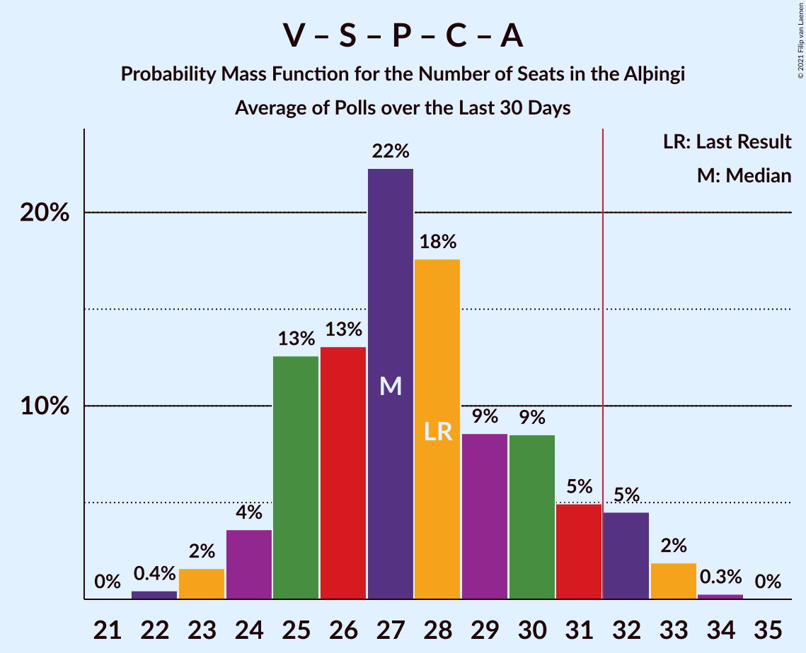

# Poll Average

<a href="#voting-intentions">Voting Intentions</a> | <a href="#seats">Seats</a> | <a href="#coalitions">Coalitions</a> | <a href="#technical-information">Technical Information</a>

## Summary

The table below lists the polls on which the average is based. They are the most recent polls (less than 30 days old) registered and analyzed so far.

| Period     | Polling firm/Commissioner(s) | D | V | S | M | B | P | F | C | A | R | T | J |
|:----------:|:----------------------------:|:--:|:--:|:--:|:--:|:--:|:--:|:--:|:--:|:--:|:--:|:--:|:--:|
| 28 October 2017 | General Election | 25.2%   16 | 16.9%   11 | 12.1%   7 | 10.9%   7 | 10.7%   8 | 9.2%   6 | 6.9%   4 | 6.7%   4 | 1.2%   0 | 0.2%   0 | 0.1%   0 | 0.0%   0 |
| N/A | Poll Average | 19–24%   13–17 | 10–14%   6–9 | 12–16%   7–11 | 8–11%   5–8 | 10–15%   7–11 | 10–13%   6–9 | 4–6%   0–4 | 8–12%   5–8 | N/A   N/A | N/A   N/A | N/A   N/A | 3–6%   0–3 |
| [1–29 March 2021](2021-03-29-Gallup.html) | Gallup | 22–24%   15–17 | 11–13%   7–9 | 12–14%   7–9 | 9–10%   5–7 | 10–12%   7–8 | 11–12%   6–8 | 4–6%   0–3 | 9–10%   5–7 | N/A   N/A | N/A   N/A | N/A   N/A | 4–6%   0–3 |
| [5–10 March 2021](2021-03-10-MMR.html) | MMR | 19–24%   12–16 | 10–14%   6–9 | 12–16%   8–11 | 8–11%   5–9 | 11–15%   8–11 | 10–14%   6–9 | 4–7%   0–4 | 8–12%   5–8 | N/A   N/A | N/A   N/A | N/A   N/A | 3–5%   0 |
| 28 October 2017 | General Election | 25.2%   16 | 16.9%   11 | 12.1%   7 | 10.9%   7 | 10.7%   8 | 9.2%   6 | 6.9%   4 | 6.7%   4 | 1.2%   0 | 0.2%   0 | 0.1%   0 | 0.0%   0 |

Only polls for which at least the sample size has been published are included in the table above.

**Legend:**
+ **Top half of each row:** Voting intentions (95% confidence interval)
+ **Bottom half of each row:** Seat projections for the Alþingi (95% confidence interval)
+ **D:** Sjálfstæðisflokkurinn
+ **V:** Vinstrihreyfingin – grænt framboð
+ **S:** Samfylkingin
+ **M:** Miðflokkurinn
+ **B:** Framsóknarflokkurinn
+ **P:** Píratar
+ **F:** Flokkur fólksins
+ **C:** Viðreisn
+ **A:** Björt framtíð
+ **R:** Alþýðufylkingin
+ **T:** Dögun
+ **J:** Sósíalistaflokkur Íslands
+ **N/A (single party):** Party not included the published results
+ **N/A (entire row):** Calculation for this opinion poll not started yet

## Voting Intentions

### Confidence Intervals

| Party | Last Result | Median | 80% Confidence Interval | 90% Confidence Interval | 95% Confidence Interval | 99% Confidence Interval |
|:-----:|:-----------:|:------:|:-----------------------:|:-----------------------:|:-----------------------:|:-----------------------:|
| <a href="#sjálfstæðisflokkurinn">Sjálfstæðisflokkurinn</a> | 25.2% | 22.4% | 20.0–23.6% |19.4–23.8% | 19.0–24.1% | 18.1–24.5% |
| <a href="#vinstrihreyfingin-–-grænt-framboð">Vinstrihreyfingin – grænt framboð</a> | 16.9% | 12.1% | 10.9–13.0% |10.4–13.3% | 10.1–13.5% | 9.5–14.3% |
| <a href="#samfylkingin">Samfylkingin</a> | 12.1% | 13.0% | 12.2–14.8% |12.0–15.3% | 11.8–15.7% | 11.3–16.6% |
| <a href="#miðflokkurinn">Miðflokkurinn</a> | 10.9% | 9.5% | 8.6–10.3% |8.3–10.7% | 7.9–11.0% | 7.4–11.8% |
| <a href="#framsóknarflokkurinn">Framsóknarflokkurinn</a> | 10.7% | 11.6% | 10.7–13.7% |10.5–14.2% | 10.4–14.6% | 10.1–15.4% |
| <a href="#píratar">Píratar</a> | 9.2% | 11.5% | 10.6–12.5% |10.2–12.9% | 9.9–13.3% | 9.3–14.1% |
| <a href="#flokkur-fólksins">Flokkur fólksins</a> | 6.9% | 5.1% | 4.5–5.8% |4.3–6.2% | 4.1–6.5% | 3.7–7.0% |
| <a href="#viðreisn">Viðreisn</a> | 6.7% | 9.7% | 9.0–10.9% |8.7–11.3% | 8.5–11.7% | 7.9–12.5% |
| <a href="#björt-framtíð">Björt framtíð</a> | 1.2% | N/A | N/A |N/A | N/A | N/A |
| <a href="#alþýðufylkingin">Alþýðufylkingin</a> | 0.2% | N/A | N/A |N/A | N/A | N/A |
| <a href="#dögun">Dögun</a> | 0.1% | N/A | N/A |N/A | N/A | N/A |
| <a href="#sósíalistaflokkur-íslands">Sósíalistaflokkur Íslands</a> | 0.0% | 4.7% | 3.3–5.3% |3.1–5.4% | 2.9–5.5% | 2.6–5.8% |

### Sjálfstæðisflokkurinn

*For a full overview of the results for this party, see the [Sjálfstæðisflokkurinn](party-sjálfstæðisflokkurinn.html) page.*

| Voting Intentions | Probability | Accumulated | Special Marks |
|:-----------------:|:-----------:|:-----------:|:-------------:|
| 15.5–16.5% | 0% | 100% |  |
| 16.5–17.5% | 0.1% | 100% |  |
| 17.5–18.5% | 1.1% | 99.9% |  |
| 18.5–19.5% | 5% | 98.8% |  |
| 19.5–20.5% | 11% | 94% |  |
| 20.5–21.5% | 15% | 83% |  |
| 21.5–22.5% | 22% | 68% | Median |
| 22.5–23.5% | 36% | 46% |  |
| 23.5–24.5% | 10% | 11% |  |
| 24.5–25.5% | 0.4% | 0.5% | Last Result |
| 25.5–26.5% | 0% | 0% |  |

### Vinstrihreyfingin – grænt framboð

*For a full overview of the results for this party, see the [Vinstrihreyfingin – grænt framboð](party-vinstrihreyfingin–græntframboð.html) page.*

| Voting Intentions | Probability | Accumulated | Special Marks |
|:-----------------:|:-----------:|:-----------:|:-------------:|
| 7.5–8.5% | 0% | 100% |  |
| 8.5–9.5% | 0.7% | 100% |  |
| 9.5–10.5% | 5% | 99.3% |  |
| 10.5–11.5% | 18% | 94% |  |
| 11.5–12.5% | 50% | 76% | Median |
| 12.5–13.5% | 24% | 26% |  |
| 13.5–14.5% | 2% | 2% |  |
| 14.5–15.5% | 0.2% | 0.3% |  |
| 15.5–16.5% | 0% | 0% |  |
| 16.5–17.5% | 0% | 0% | Last Result |

### Samfylkingin

*For a full overview of the results for this party, see the [Samfylkingin](party-samfylkingin.html) page.*

| Voting Intentions | Probability | Accumulated | Special Marks |
|:-----------------:|:-----------:|:-----------:|:-------------:|
| 9.5–10.5% | 0% | 100% |  |
| 10.5–11.5% | 1.0% | 100% |  |
| 11.5–12.5% | 23% | 99.0% | Last Result |
| 12.5–13.5% | 44% | 76% | Median |
| 13.5–14.5% | 19% | 32% |  |
| 14.5–15.5% | 10% | 13% |  |
| 15.5–16.5% | 3% | 3% |  |
| 16.5–17.5% | 0.5% | 0.5% |  |
| 17.5–18.5% | 0% | 0% |  |
| 18.5–19.5% | 0% | 0% |  |

### Miðflokkurinn

*For a full overview of the results for this party, see the [Miðflokkurinn](party-miðflokkurinn.html) page.*

| Voting Intentions | Probability | Accumulated | Special Marks |
|:-----------------:|:-----------:|:-----------:|:-------------:|
| 5.5–6.5% | 0% | 100% |  |
| 6.5–7.5% | 0.8% | 100% |  |
| 7.5–8.5% | 8% | 99.1% |  |
| 8.5–9.5% | 47% | 91% | Median |
| 9.5–10.5% | 38% | 44% |  |
| 10.5–11.5% | 6% | 6% | Last Result |
| 11.5–12.5% | 0.8% | 0.8% |  |
| 12.5–13.5% | 0.1% | 0.1% |  |
| 13.5–14.5% | 0% | 0% |  |

### Framsóknarflokkurinn

*For a full overview of the results for this party, see the [Framsóknarflokkurinn](party-framsóknarflokkurinn.html) page.*

| Voting Intentions | Probability | Accumulated | Special Marks |
|:-----------------:|:-----------:|:-----------:|:-------------:|
| 8.5–9.5% | 0% | 100% |  |
| 9.5–10.5% | 5% | 100% |  |
| 10.5–11.5% | 43% | 95% | Last Result |
| 11.5–12.5% | 22% | 52% | Median |
| 12.5–13.5% | 17% | 29% |  |
| 13.5–14.5% | 9% | 12% |  |
| 14.5–15.5% | 2% | 3% |  |
| 15.5–16.5% | 0.4% | 0.4% |  |
| 16.5–17.5% | 0% | 0% |  |

### Píratar

*For a full overview of the results for this party, see the [Píratar](party-píratar.html) page.*

| Voting Intentions | Probability | Accumulated | Special Marks |
|:-----------------:|:-----------:|:-----------:|:-------------:|
| 7.5–8.5% | 0% | 100% |  |
| 8.5–9.5% | 1.1% | 100% | Last Result |
| 9.5–10.5% | 8% | 98.9% |  |
| 10.5–11.5% | 44% | 91% |  |
| 11.5–12.5% | 39% | 47% | Median |
| 12.5–13.5% | 7% | 9% |  |
| 13.5–14.5% | 1.4% | 1.5% |  |
| 14.5–15.5% | 0.1% | 0.1% |  |
| 15.5–16.5% | 0% | 0% |  |

### Flokkur fólksins

*For a full overview of the results for this party, see the [Flokkur fólksins](party-flokkurfólksins.html) page.*

| Voting Intentions | Probability | Accumulated | Special Marks |
|:-----------------:|:-----------:|:-----------:|:-------------:|
| 1.5–2.5% | 0% | 100% |  |
| 2.5–3.5% | 0.2% | 100% |  |
| 3.5–4.5% | 11% | 99.8% |  |
| 4.5–5.5% | 70% | 89% | Median |
| 5.5–6.5% | 16% | 18% |  |
| 6.5–7.5% | 2% | 2% | Last Result |
| 7.5–8.5% | 0.1% | 0.1% |  |
| 8.5–9.5% | 0% | 0% |  |

### Viðreisn

*For a full overview of the results for this party, see the [Viðreisn](party-viðreisn.html) page.*

| Voting Intentions | Probability | Accumulated | Special Marks |
|:-----------------:|:-----------:|:-----------:|:-------------:|
| 5.5–6.5% | 0% | 100% |  |
| 6.5–7.5% | 0.1% | 100% | Last Result |
| 7.5–8.5% | 3% | 99.9% |  |
| 8.5–9.5% | 40% | 97% |  |
| 9.5–10.5% | 42% | 57% | Median |
| 10.5–11.5% | 12% | 16% |  |
| 11.5–12.5% | 3% | 3% |  |
| 12.5–13.5% | 0.4% | 0.4% |  |
| 13.5–14.5% | 0% | 0% |  |

### Sósíalistaflokkur Íslands

*For a full overview of the results for this party, see the [Sósíalistaflokkur Íslands](party-sósíalistaflokkuríslands.html) page.*

| Voting Intentions | Probability | Accumulated | Special Marks |
|:-----------------:|:-----------:|:-----------:|:-------------:|
| 0.0–0.5% | 0% | 100% | Last Result |
| 0.5–1.5% | 0% | 100% |  |
| 1.5–2.5% | 0.4% | 100% |  |
| 2.5–3.5% | 15% | 99.6% |  |
| 3.5–4.5% | 30% | 84% |  |
| 4.5–5.5% | 52% | 54% | Median |
| 5.5–6.5% | 2% | 2% |  |
| 6.5–7.5% | 0% | 0% |  |

## Seats

### Confidence Intervals

| Party | Last Result | Median | 80% Confidence Interval | 90% Confidence Interval | 95% Confidence Interval | 99% Confidence Interval |
|:-----:|:-----------:|:------:|:-----------------------:|:-----------------------:|:-----------------------:|:-----------------------:|
| <a href="#sjálfstæðisflokkurinn">Sjálfstæðisflokkurinn</a> | 16 | 15 | 13–17 |13–17 | 13–17 | 12–17 |
| <a href="#vinstrihreyfingin-–-grænt-framboð">Vinstrihreyfingin – grænt framboð</a> | 11 | 8 | 7–9 |7–9 | 6–9 | 6–10 |
| <a href="#samfylkingin">Samfylkingin</a> | 7 | 9 | 8–10 |7–10 | 7–11 | 7–11 |
| <a href="#miðflokkurinn">Miðflokkurinn</a> | 7 | 6 | 5–7 |5–7 | 5–8 | 5–9 |
| <a href="#framsóknarflokkurinn">Framsóknarflokkurinn</a> | 8 | 8 | 8–11 |7–11 | 7–11 | 7–11 |
| <a href="#píratar">Píratar</a> | 6 | 7 | 7–8 |6–9 | 6–9 | 6–9 |
| <a href="#flokkur-fólksins">Flokkur fólksins</a> | 4 | 3 | 0–3 |0–4 | 0–4 | 0–4 |
| <a href="#viðreisn">Viðreisn</a> | 4 | 6 | 5–7 |5–8 | 5–8 | 5–8 |
| <a href="#björt-framtíð">Björt framtíð</a> | 0 | N/A | N/A |N/A | N/A | N/A |
| <a href="#alþýðufylkingin">Alþýðufylkingin</a> | 0 | N/A | N/A |N/A | N/A | N/A |
| <a href="#dögun">Dögun</a> | 0 | N/A | N/A |N/A | N/A | N/A |
| <a href="#sósíalistaflokkur-íslands">Sósíalistaflokkur Íslands</a> | 0 | 0 | 0–3 |0–3 | 0–3 | 0–3 |

### Sjálfstæðisflokkurinn

*For a full overview of the results for this party, see the [Sjálfstæðisflokkurinn](party-sjálfstæðisflokkurinn.html) page.*

| Number of Seats | Probability | Accumulated | Special Marks |
|:---------------:|:-----------:|:-----------:|:-------------:|
| 11 | 0.1% | 100% |  |
| 12 | 2% | 99.9% |  |
| 13 | 13% | 98% |  |
| 14 | 20% | 85% |  |
| 15 | 30% | 65% | Median |
| 16 | 15% | 35% | Last Result |
| 17 | 20% | 20% |  |
| 18 | 0.5% | 0.5% |  |
| 19 | 0% | 0% |  |

### Vinstrihreyfingin – grænt framboð

*For a full overview of the results for this party, see the [Vinstrihreyfingin – grænt framboð](party-vinstrihreyfingin–græntframboð.html) page.*

| Number of Seats | Probability | Accumulated | Special Marks |
|:---------------:|:-----------:|:-----------:|:-------------:|
| 5 | 0.1% | 100% |  |
| 6 | 3% | 99.9% |  |
| 7 | 36% | 97% |  |
| 8 | 37% | 61% | Median |
| 9 | 23% | 24% |  |
| 10 | 1.0% | 1.1% |  |
| 11 | 0% | 0% | Last Result |

### Samfylkingin

*For a full overview of the results for this party, see the [Samfylkingin](party-samfylkingin.html) page.*

| Number of Seats | Probability | Accumulated | Special Marks |
|:---------------:|:-----------:|:-----------:|:-------------:|
| 6 | 0.1% | 100% |  |
| 7 | 8% | 99.9% | Last Result |
| 8 | 24% | 92% |  |
| 9 | 46% | 68% | Median |
| 10 | 19% | 22% |  |
| 11 | 3% | 3% |  |
| 12 | 0.3% | 0.3% |  |
| 13 | 0% | 0% |  |

### Miðflokkurinn

*For a full overview of the results for this party, see the [Miðflokkurinn](party-miðflokkurinn.html) page.*

| Number of Seats | Probability | Accumulated | Special Marks |
|:---------------:|:-----------:|:-----------:|:-------------:|
| 4 | 0.2% | 100% |  |
| 5 | 14% | 99.8% |  |
| 6 | 58% | 86% | Median |
| 7 | 25% | 28% | Last Result |
| 8 | 0.8% | 3% |  |
| 9 | 2% | 2% |  |
| 10 | 0% | 0% |  |

### Framsóknarflokkurinn

*For a full overview of the results for this party, see the [Framsóknarflokkurinn](party-framsóknarflokkurinn.html) page.*

| Number of Seats | Probability | Accumulated | Special Marks |
|:---------------:|:-----------:|:-----------:|:-------------:|
| 6 | 0.1% | 100% |  |
| 7 | 8% | 99.9% |  |
| 8 | 51% | 91% | Last Result, Median |
| 9 | 6% | 41% |  |
| 10 | 25% | 35% |  |
| 11 | 10% | 11% |  |
| 12 | 0.1% | 0.1% |  |
| 13 | 0% | 0% |  |

### Píratar

*For a full overview of the results for this party, see the [Píratar](party-píratar.html) page.*

| Number of Seats | Probability | Accumulated | Special Marks |
|:---------------:|:-----------:|:-----------:|:-------------:|
| 5 | 0.2% | 100% |  |
| 6 | 6% | 99.8% | Last Result |
| 7 | 48% | 94% | Median |
| 8 | 39% | 46% |  |
| 9 | 7% | 7% |  |
| 10 | 0.3% | 0.3% |  |
| 11 | 0% | 0% |  |

### Flokkur fólksins

*For a full overview of the results for this party, see the [Flokkur fólksins](party-flokkurfólksins.html) page.*

| Number of Seats | Probability | Accumulated | Special Marks |
|:---------------:|:-----------:|:-----------:|:-------------:|
| 0 | 43% | 100% |  |
| 1 | 0% | 57% |  |
| 2 | 0% | 57% |  |
| 3 | 51% | 57% | Median |
| 4 | 6% | 6% | Last Result |
| 5 | 0.1% | 0.1% |  |
| 6 | 0% | 0% |  |

### Viðreisn

*For a full overview of the results for this party, see the [Viðreisn](party-viðreisn.html) page.*

| Number of Seats | Probability | Accumulated | Special Marks |
|:---------------:|:-----------:|:-----------:|:-------------:|
| 4 | 0% | 100% | Last Result |
| 5 | 21% | 100% |  |
| 6 | 48% | 79% | Median |
| 7 | 26% | 31% |  |
| 8 | 5% | 5% |  |
| 9 | 0.3% | 0.3% |  |
| 10 | 0% | 0% |  |

### Björt framtíð

*For a full overview of the results for this party, see the [Björt framtíð](party-björtframtíð.html) page.*

### Alþýðufylkingin

*For a full overview of the results for this party, see the [Alþýðufylkingin](party-alþýðufylkingin.html) page.*

### Dögun

*For a full overview of the results for this party, see the [Dögun](party-dögun.html) page.*

### Sósíalistaflokkur Íslands

*For a full overview of the results for this party, see the [Sósíalistaflokkur Íslands](party-sósíalistaflokkuríslands.html) page.*

| Number of Seats | Probability | Accumulated | Special Marks |
|:---------------:|:-----------:|:-----------:|:-------------:|
| 0 | 70% | 100% | Last Result, Median |
| 1 | 0% | 30% |  |
| 2 | 0% | 30% |  |
| 3 | 30% | 30% |  |
| 4 | 0.2% | 0.2% |  |
| 5 | 0% | 0% |  |

## Coalitions

### Confidence Intervals

| Coalition | Last Result | Median | Majority? | 80% Confidence Interval | 90% Confidence Interval | 95% Confidence Interval | 99% Confidence Interval |
|:---------:|:-----------:|:------:|:---------:|:-----------------------:|:-----------------------:|:-----------------------:|:-----------------------:|
| Vinstrihreyfingin – grænt framboð – Samfylkingin – Miðflokkurinn – Framsóknarflokkurinn | 33 | 32 | 54% | 29–34 | 29–35 | 28–36 | 28–36 |
| Sjálfstæðisflokkurinn – Vinstrihreyfingin – grænt framboð – Framsóknarflokkurinn | 35 | 32 | 55% | 30–33 | 29–34 | 29–34 | 28–34 |
| Vinstrihreyfingin – grænt framboð – Samfylkingin – Píratar – Viðreisn – Björt framtíð | 28 | 30 | 25% | 28–33 | 27–33 | 27–34 | 26–34 |
| Vinstrihreyfingin – grænt framboð – Samfylkingin – Píratar – Viðreisn | 28 | 30 | 25% | 28–33 | 27–33 | 27–34 | 26–34 |
| Sjálfstæðisflokkurinn – Miðflokkurinn – Framsóknarflokkurinn | 31 | 30 | 10% | 29–32 | 28–32 | 28–33 | 27–33 |
| Vinstrihreyfingin – grænt framboð – Samfylkingin – Framsóknarflokkurinn | 26 | 25 | 0% | 24–28 | 23–29 | 22–29 | 22–30 |
| Vinstrihreyfingin – grænt framboð – Samfylkingin – Píratar – Björt framtíð | 24 | 24 | 0% | 23–26 | 22–27 | 21–27 | 20–28 |
| Vinstrihreyfingin – grænt framboð – Samfylkingin – Píratar | 24 | 24 | 0% | 23–26 | 22–27 | 21–27 | 20–28 |
| Sjálfstæðisflokkurinn – Framsóknarflokkurinn | 24 | 24 | 0% | 22–25 | 22–25 | 22–26 | 20–27 |
| Sjálfstæðisflokkurinn – Samfylkingin | 23 | 24 | 0% | 22–25 | 22–26 | 22–26 | 20–27 |
| Vinstrihreyfingin – grænt framboð – Miðflokkurinn – Framsóknarflokkurinn | 26 | 23 | 0% | 21–25 | 21–25 | 20–26 | 20–26 |
| Vinstrihreyfingin – grænt framboð – Samfylkingin – Miðflokkurinn | 25 | 23 | 0% | 21–25 | 21–25 | 20–26 | 20–26 |
| Sjálfstæðisflokkurinn – Vinstrihreyfingin – grænt framboð | 27 | 23 | 0% | 21–25 | 20–26 | 20–26 | 19–26 |
| Sjálfstæðisflokkurinn – Miðflokkurinn | 23 | 21 | 0% | 19–23 | 19–23 | 19–24 | 18–24 |
| Sjálfstæðisflokkurinn – Viðreisn – Björt framtíð | 20 | 21 | 0% | 19–23 | 19–23 | 19–23 | 18–24 |
| Sjálfstæðisflokkurinn – Viðreisn | 20 | 21 | 0% | 19–23 | 19–23 | 19–23 | 18–24 |
| Vinstrihreyfingin – grænt framboð – Framsóknarflokkurinn | 19 | 17 | 0% | 15–18 | 15–19 | 15–19 | 14–20 |
| Vinstrihreyfingin – grænt framboð – Samfylkingin | 18 | 17 | 0% | 15–18 | 15–19 | 14–19 | 14–20 |
| Sjálfstæðisflokkurinn – Björt framtíð | 16 | 15 | 0% | 13–17 | 13–17 | 13–17 | 12–17 |
| Vinstrihreyfingin – grænt framboð – Píratar | 17 | 15 | 0% | 14–17 | 14–17 | 13–17 | 13–18 |
| Vinstrihreyfingin – grænt framboð – Miðflokkurinn | 18 | 14 | 0% | 13–15 | 12–16 | 12–16 | 12–17 |

### Vinstrihreyfingin – grænt framboð – Samfylkingin – Miðflokkurinn – Framsóknarflokkurinn

| Number of Seats | Probability | Accumulated | Special Marks |
|:---------------:|:-----------:|:-----------:|:-------------:|
| 27 | 0.3% | 100% |  |
| 28 | 5% | 99.7% |  |
| 29 | 8% | 95% |  |
| 30 | 18% | 87% |  |
| 31 | 15% | 69% | Median |
| 32 | 19% | 54% | Majority |
| 33 | 19% | 35% | Last Result |
| 34 | 11% | 16% |  |
| 35 | 3% | 6% |  |
| 36 | 3% | 3% |  |
| 37 | 0.2% | 0.2% |  |
| 38 | 0% | 0% |  |

### Sjálfstæðisflokkurinn – Vinstrihreyfingin – grænt framboð – Framsóknarflokkurinn

| Number of Seats | Probability | Accumulated | Special Marks |
|:---------------:|:-----------:|:-----------:|:-------------:|
| 27 | 0.1% | 100% |  |
| 28 | 1.3% | 99.9% |  |
| 29 | 4% | 98.6% |  |
| 30 | 16% | 94% |  |
| 31 | 23% | 78% | Median |
| 32 | 24% | 55% | Majority |
| 33 | 24% | 31% |  |
| 34 | 7% | 7% |  |
| 35 | 0.3% | 0.4% | Last Result |
| 36 | 0% | 0% |  |

### Vinstrihreyfingin – grænt framboð – Samfylkingin – Píratar – Viðreisn – Björt framtíð

| Number of Seats | Probability | Accumulated | Special Marks |
|:---------------:|:-----------:|:-----------:|:-------------:|
| 26 | 2% | 100% |  |
| 27 | 4% | 98% |  |
| 28 | 11% | 94% | Last Result |
| 29 | 14% | 83% |  |
| 30 | 22% | 69% | Median |
| 31 | 22% | 48% |  |
| 32 | 14% | 25% | Majority |
| 33 | 8% | 11% |  |
| 34 | 2% | 3% |  |
| 35 | 0.4% | 0.5% |  |
| 36 | 0.1% | 0.1% |  |
| 37 | 0% | 0% |  |

### Vinstrihreyfingin – grænt framboð – Samfylkingin – Píratar – Viðreisn

| Number of Seats | Probability | Accumulated | Special Marks |
|:---------------:|:-----------:|:-----------:|:-------------:|
| 26 | 2% | 100% |  |
| 27 | 4% | 98% |  |
| 28 | 11% | 94% | Last Result |
| 29 | 14% | 83% |  |
| 30 | 22% | 69% | Median |
| 31 | 22% | 48% |  |
| 32 | 14% | 25% | Majority |
| 33 | 8% | 11% |  |
| 34 | 2% | 3% |  |
| 35 | 0.4% | 0.5% |  |
| 36 | 0.1% | 0.1% |  |
| 37 | 0% | 0% |  |

### Sjálfstæðisflokkurinn – Miðflokkurinn – Framsóknarflokkurinn

| Number of Seats | Probability | Accumulated | Special Marks |
|:---------------:|:-----------:|:-----------:|:-------------:|
| 26 | 0.2% | 100% |  |
| 27 | 2% | 99.8% |  |
| 28 | 6% | 98% |  |
| 29 | 28% | 92% | Median |
| 30 | 28% | 64% |  |
| 31 | 25% | 35% | Last Result |
| 32 | 7% | 10% | Majority |
| 33 | 3% | 3% |  |
| 34 | 0.1% | 0.1% |  |
| 35 | 0% | 0% |  |

### Vinstrihreyfingin – grænt framboð – Samfylkingin – Framsóknarflokkurinn

| Number of Seats | Probability | Accumulated | Special Marks |
|:---------------:|:-----------:|:-----------:|:-------------:|
| 21 | 0.1% | 100% |  |
| 22 | 3% | 99.9% |  |
| 23 | 6% | 97% |  |
| 24 | 24% | 91% |  |
| 25 | 24% | 67% | Median |
| 26 | 14% | 44% | Last Result |
| 27 | 20% | 30% |  |
| 28 | 5% | 10% |  |
| 29 | 4% | 5% |  |
| 30 | 0.6% | 0.7% |  |
| 31 | 0.1% | 0.1% |  |
| 32 | 0% | 0% | Majority |

### Vinstrihreyfingin – grænt framboð – Samfylkingin – Píratar – Björt framtíð

| Number of Seats | Probability | Accumulated | Special Marks |
|:---------------:|:-----------:|:-----------:|:-------------:|
| 20 | 0.6% | 100% |  |
| 21 | 3% | 99.4% |  |
| 22 | 6% | 97% |  |
| 23 | 26% | 91% |  |
| 24 | 25% | 65% | Last Result, Median |
| 25 | 24% | 40% |  |
| 26 | 10% | 16% |  |
| 27 | 5% | 6% |  |
| 28 | 0.7% | 0.8% |  |
| 29 | 0.1% | 0.1% |  |
| 30 | 0% | 0% |  |

### Vinstrihreyfingin – grænt framboð – Samfylkingin – Píratar

| Number of Seats | Probability | Accumulated | Special Marks |
|:---------------:|:-----------:|:-----------:|:-------------:|
| 20 | 0.6% | 100% |  |
| 21 | 3% | 99.4% |  |
| 22 | 6% | 97% |  |
| 23 | 26% | 91% |  |
| 24 | 25% | 65% | Last Result, Median |
| 25 | 24% | 40% |  |
| 26 | 10% | 16% |  |
| 27 | 5% | 6% |  |
| 28 | 0.7% | 0.8% |  |
| 29 | 0.1% | 0.1% |  |
| 30 | 0% | 0% |  |

### Sjálfstæðisflokkurinn – Framsóknarflokkurinn

| Number of Seats | Probability | Accumulated | Special Marks |
|:---------------:|:-----------:|:-----------:|:-------------:|
| 20 | 0.5% | 100% |  |
| 21 | 2% | 99.5% |  |
| 22 | 8% | 98% |  |
| 23 | 31% | 90% | Median |
| 24 | 26% | 59% | Last Result |
| 25 | 28% | 33% |  |
| 26 | 3% | 4% |  |
| 27 | 0.7% | 0.7% |  |
| 28 | 0% | 0% |  |

### Sjálfstæðisflokkurinn – Samfylkingin

| Number of Seats | Probability | Accumulated | Special Marks |
|:---------------:|:-----------:|:-----------:|:-------------:|
| 20 | 0.5% | 100% |  |
| 21 | 2% | 99.5% |  |
| 22 | 8% | 98% |  |
| 23 | 22% | 89% | Last Result |
| 24 | 40% | 68% | Median |
| 25 | 21% | 28% |  |
| 26 | 6% | 7% |  |
| 27 | 0.9% | 1.0% |  |
| 28 | 0.1% | 0.1% |  |
| 29 | 0% | 0% |  |

### Vinstrihreyfingin – grænt framboð – Miðflokkurinn – Framsóknarflokkurinn

| Number of Seats | Probability | Accumulated | Special Marks |
|:---------------:|:-----------:|:-----------:|:-------------:|
| 19 | 0.2% | 100% |  |
| 20 | 3% | 99.8% |  |
| 21 | 16% | 97% |  |
| 22 | 26% | 81% | Median |
| 23 | 25% | 55% |  |
| 24 | 18% | 30% |  |
| 25 | 7% | 12% |  |
| 26 | 4% | 4% | Last Result |
| 27 | 0.3% | 0.4% |  |
| 28 | 0% | 0% |  |

### Vinstrihreyfingin – grænt framboð – Samfylkingin – Miðflokkurinn

| Number of Seats | Probability | Accumulated | Special Marks |
|:---------------:|:-----------:|:-----------:|:-------------:|
| 19 | 0.3% | 100% |  |
| 20 | 4% | 99.7% |  |
| 21 | 12% | 96% |  |
| 22 | 22% | 84% |  |
| 23 | 34% | 62% | Median |
| 24 | 16% | 28% |  |
| 25 | 8% | 12% | Last Result |
| 26 | 4% | 4% |  |
| 27 | 0.4% | 0.5% |  |
| 28 | 0% | 0% |  |

### Sjálfstæðisflokkurinn – Vinstrihreyfingin – grænt framboð

| Number of Seats | Probability | Accumulated | Special Marks |
|:---------------:|:-----------:|:-----------:|:-------------:|
| 18 | 0.1% | 100% |  |
| 19 | 1.3% | 99.9% |  |
| 20 | 7% | 98.7% |  |
| 21 | 16% | 91% |  |
| 22 | 21% | 76% |  |
| 23 | 18% | 54% | Median |
| 24 | 11% | 36% |  |
| 25 | 17% | 24% |  |
| 26 | 7% | 7% |  |
| 27 | 0.2% | 0.3% | Last Result |
| 28 | 0% | 0% |  |

### Sjálfstæðisflokkurinn – Miðflokkurinn

| Number of Seats | Probability | Accumulated | Special Marks |
|:---------------:|:-----------:|:-----------:|:-------------:|
| 17 | 0.2% | 100% |  |
| 18 | 2% | 99.8% |  |
| 19 | 12% | 98% |  |
| 20 | 13% | 86% |  |
| 21 | 31% | 73% | Median |
| 22 | 21% | 42% |  |
| 23 | 17% | 21% | Last Result |
| 24 | 4% | 4% |  |
| 25 | 0.1% | 0.1% |  |
| 26 | 0% | 0% |  |

### Sjálfstæðisflokkurinn – Viðreisn – Björt framtíð

| Number of Seats | Probability | Accumulated | Special Marks |
|:---------------:|:-----------:|:-----------:|:-------------:|
| 17 | 0.1% | 100% |  |
| 18 | 0.9% | 99.9% |  |
| 19 | 9% | 99.0% |  |
| 20 | 23% | 90% | Last Result |
| 21 | 24% | 66% | Median |
| 22 | 20% | 42% |  |
| 23 | 20% | 22% |  |
| 24 | 2% | 2% |  |
| 25 | 0.1% | 0.1% |  |
| 26 | 0% | 0% |  |

### Sjálfstæðisflokkurinn – Viðreisn

| Number of Seats | Probability | Accumulated | Special Marks |
|:---------------:|:-----------:|:-----------:|:-------------:|
| 17 | 0.1% | 100% |  |
| 18 | 0.9% | 99.9% |  |
| 19 | 9% | 99.0% |  |
| 20 | 23% | 90% | Last Result |
| 21 | 24% | 66% | Median |
| 22 | 20% | 42% |  |
| 23 | 20% | 22% |  |
| 24 | 2% | 2% |  |
| 25 | 0.1% | 0.1% |  |
| 26 | 0% | 0% |  |

### Vinstrihreyfingin – grænt framboð – Framsóknarflokkurinn

| Number of Seats | Probability | Accumulated | Special Marks |
|:---------------:|:-----------:|:-----------:|:-------------:|
| 13 | 0.1% | 100% |  |
| 14 | 0.9% | 99.9% |  |
| 15 | 19% | 99.0% |  |
| 16 | 28% | 80% | Median |
| 17 | 29% | 52% |  |
| 18 | 16% | 23% |  |
| 19 | 6% | 7% | Last Result |
| 20 | 0.7% | 0.8% |  |
| 21 | 0.1% | 0.1% |  |
| 22 | 0% | 0% |  |

### Vinstrihreyfingin – grænt framboð – Samfylkingin

| Number of Seats | Probability | Accumulated | Special Marks |
|:---------------:|:-----------:|:-----------:|:-------------:|
| 13 | 0% | 100% |  |
| 14 | 3% | 99.9% |  |
| 15 | 7% | 97% |  |
| 16 | 33% | 90% |  |
| 17 | 38% | 57% | Median |
| 18 | 13% | 18% | Last Result |
| 19 | 5% | 6% |  |
| 20 | 1.0% | 1.0% |  |
| 21 | 0.1% | 0.1% |  |
| 22 | 0% | 0% |  |

### Sjálfstæðisflokkurinn – Björt framtíð

| Number of Seats | Probability | Accumulated | Special Marks |
|:---------------:|:-----------:|:-----------:|:-------------:|
| 11 | 0.1% | 100% |  |
| 12 | 2% | 99.9% |  |
| 13 | 13% | 98% |  |
| 14 | 20% | 85% |  |
| 15 | 30% | 65% | Median |
| 16 | 15% | 35% | Last Result |
| 17 | 20% | 20% |  |
| 18 | 0.5% | 0.5% |  |
| 19 | 0% | 0% |  |

### Vinstrihreyfingin – grænt framboð – Píratar

| Number of Seats | Probability | Accumulated | Special Marks |
|:---------------:|:-----------:|:-----------:|:-------------:|
| 12 | 0.2% | 100% |  |
| 13 | 3% | 99.8% |  |
| 14 | 26% | 97% |  |
| 15 | 24% | 70% | Median |
| 16 | 29% | 46% |  |
| 17 | 15% | 16% | Last Result |
| 18 | 1.4% | 1.5% |  |
| 19 | 0.1% | 0.1% |  |
| 20 | 0% | 0% |  |

### Vinstrihreyfingin – grænt framboð – Miðflokkurinn

| Number of Seats | Probability | Accumulated | Special Marks |
|:---------------:|:-----------:|:-----------:|:-------------:|
| 11 | 0.4% | 100% |  |
| 12 | 7% | 99.6% |  |
| 13 | 25% | 93% |  |
| 14 | 38% | 68% | Median |
| 15 | 20% | 30% |  |
| 16 | 9% | 10% |  |
| 17 | 0.7% | 0.9% |  |
| 18 | 0.2% | 0.2% | Last Result |
| 19 | 0% | 0% |  |

## Technical Information

+ **Number of polls included in this average:** 2
+ **Lowest number of simulations done in a poll included in this average:** 1,048,576
+ **Total number of simulations done in the polls included in this average:** 2,097,152
+ **Error estimate:** 1.48%
