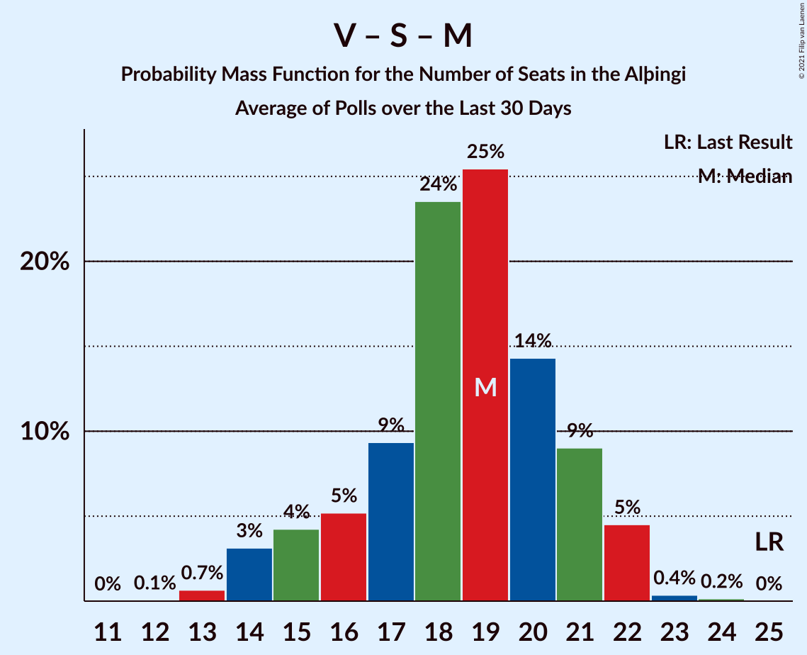

# Poll Average

<a href="#voting-intentions">Voting Intentions</a> | <a href="#seats">Seats</a> | <a href="#coalitions">Coalitions</a> | <a href="#technical-information">Technical Information</a>

## Summary

The table below lists the polls on which the average is based. They are the most recent polls (less than 30 days old) registered and analyzed so far.

| Period     | Polling firm/Commissioner(s) | D | V | S | M | B | P | F | C | A | R | T |
|:----------:|:----------------------------:|:--:|:--:|:--:|:--:|:--:|:--:|:--:|:--:|:--:|:--:|:--:|
| 28 October 2017 | General Election | 25.2%   16 | 16.9%   11 | 12.1%   7 | 10.9%   7 | 10.7%   8 | 9.2%   6 | 6.9%   4 | 6.7%   4 | 1.2%   0 | 0.2%   0 | 0.1%   0 |
| N/A | Poll Average | 20–25%   13–18 | 9–14%   5–10 | 12–17%   7–12 | 8–12%   5–9 | 7–10%   4–7 | 10–17%   7–11 | 4–7%   0–4 | 8–12%   4–8 | N/A   N/A | N/A   N/A | N/A   N/A |
| [5–30 April 2019](2019-04-30-Gallup.html) | Gallup | 22–25%   15–18 | 12–15%   8–10 | 15–18%   10–12 | 8–10%   5–7 | 7–9%   5–6 | 10–12%   7–8 | 3–5%   0 | 10–12%   7–8 | N/A   N/A | N/A   N/A | N/A   N/A |
| [4–9 April 2019](2019-04-09-MMR.html) | MMR | 19–24%   13–18 | 9–12%   5–9 | 12–16%   7–11 | 8–12%   5–9 | 7–11%   4–7 | 13–17%   8–12 | 4–7%   0–4 | 7–11%   4–7 | N/A   N/A | N/A   N/A | N/A   N/A |
| 28 October 2017 | General Election | 25.2%   16 | 16.9%   11 | 12.1%   7 | 10.9%   7 | 10.7%   8 | 9.2%   6 | 6.9%   4 | 6.7%   4 | 1.2%   0 | 0.2%   0 | 0.1%   0 |

Only polls for which at least the sample size has been published are included in the table above.

**Legend:**
+ **Top half of each row:** Voting intentions (95% confidence interval)
+ **Bottom half of each row:** Seat projections for the Alþingi (95% confidence interval)
+ **D:** Sjálfstæðisflokkurinn
+ **V:** Vinstrihreyfingin – grænt framboð
+ **S:** Samfylkingin
+ **M:** Miðflokkurinn
+ **B:** Framsóknarflokkurinn
+ **P:** Píratar
+ **F:** Flokkur fólksins
+ **C:** Viðreisn
+ **A:** Björt framtíð
+ **R:** Alþýðufylkingin
+ **T:** Dögun
+ **N/A (single party):** Party not included the published results
+ **N/A (entire row):** Calculation for this opinion poll not started yet

## Voting Intentions

### Confidence Intervals

| Party | Last Result | Median | 80% Confidence Interval | 90% Confidence Interval | 95% Confidence Interval | 99% Confidence Interval |
|:-----:|:-----------:|:------:|:-----------------------:|:-----------------------:|:-----------------------:|:-----------------------:|
| <a href="#sjálfstæðisflokkurinn">Sjálfstæðisflokkurinn</a> | 25.2% | 22.9% | 20.6–24.4% |20.0–24.7% | 19.6–25.0% | 18.7–25.6% |
| <a href="#vinstrihreyfingin-–-grænt-framboð">Vinstrihreyfingin – grænt framboð</a> | 16.9% | 12.3% | 9.6–13.8% |9.2–14.1% | 8.8–14.4% | 8.3–14.8% |
| <a href="#samfylkingin">Samfylkingin</a> | 12.1% | 15.4% | 13.0–16.8% |12.6–17.1% | 12.2–17.4% | 11.5–17.8% |
| <a href="#miðflokkurinn">Miðflokkurinn</a> | 10.9% | 9.4% | 8.4–11.1% |8.2–11.5% | 8.0–11.9% | 7.7–12.7% |
| <a href="#framsóknarflokkurinn">Framsóknarflokkurinn</a> | 10.7% | 8.3% | 7.5–9.6% |7.3–10.1% | 7.1–10.4% | 6.7–11.1% |
| <a href="#píratar">Píratar</a> | 9.2% | 12.5% | 10.6–16.1% |10.4–16.6% | 10.2–17.0% | 9.8–17.9% |
| <a href="#flokkur-fólksins">Flokkur fólksins</a> | 6.9% | 4.5% | 3.7–6.1% |3.6–6.5% | 3.5–6.8% | 3.3–7.4% |
| <a href="#viðreisn">Viðreisn</a> | 6.7% | 10.3% | 8.3–11.5% |7.9–11.8% | 7.6–12.0% | 7.0–12.4% |
| <a href="#björt-framtíð">Björt framtíð</a> | 1.2% | N/A | N/A |N/A | N/A | N/A |
| <a href="#alþýðufylkingin">Alþýðufylkingin</a> | 0.2% | N/A | N/A |N/A | N/A | N/A |
| <a href="#dögun">Dögun</a> | 0.1% | N/A | N/A |N/A | N/A | N/A |

### Sjálfstæðisflokkurinn

*For a full overview of the results for this party, see the [Sjálfstæðisflokkurinn](party-sjálfstæðisflokkurinn.html) page.*

| Voting Intentions | Probability | Accumulated | Special Marks |
|:-----------------:|:-----------:|:-----------:|:-------------:|
| 16.5–17.5% | 0% | 100% |  |
| 17.5–18.5% | 0.3% | 100% |  |
| 18.5–19.5% | 2% | 99.7% |  |
| 19.5–20.5% | 7% | 98% |  |
| 20.5–21.5% | 13% | 91% |  |
| 21.5–22.5% | 18% | 78% |  |
| 22.5–23.5% | 28% | 60% | Median |
| 23.5–24.5% | 25% | 32% |  |
| 24.5–25.5% | 6% | 7% | Last Result |
| 25.5–26.5% | 0.5% | 0.5% |  |
| 26.5–27.5% | 0% | 0% |  |

### Vinstrihreyfingin – grænt framboð

*For a full overview of the results for this party, see the [Vinstrihreyfingin – grænt framboð](party-vinstrihreyfingin–græntframboð.html) page.*

| Voting Intentions | Probability | Accumulated | Special Marks |
|:-----------------:|:-----------:|:-----------:|:-------------:|
| 6.5–7.5% | 0% | 100% |  |
| 7.5–8.5% | 1.1% | 100% |  |
| 8.5–9.5% | 8% | 98.8% |  |
| 9.5–10.5% | 18% | 91% |  |
| 10.5–11.5% | 16% | 73% |  |
| 11.5–12.5% | 11% | 57% | Median |
| 12.5–13.5% | 28% | 46% |  |
| 13.5–14.5% | 16% | 18% |  |
| 14.5–15.5% | 1.2% | 1.2% |  |
| 15.5–16.5% | 0% | 0% |  |
| 16.5–17.5% | 0% | 0% | Last Result |

### Samfylkingin

*For a full overview of the results for this party, see the [Samfylkingin](party-samfylkingin.html) page.*

| Voting Intentions | Probability | Accumulated | Special Marks |
|:-----------------:|:-----------:|:-----------:|:-------------:|
| 9.5–10.5% | 0% | 100% |  |
| 10.5–11.5% | 0.6% | 100% |  |
| 11.5–12.5% | 4% | 99.4% | Last Result |
| 12.5–13.5% | 13% | 95% |  |
| 13.5–14.5% | 17% | 82% |  |
| 14.5–15.5% | 18% | 65% | Median |
| 15.5–16.5% | 31% | 47% |  |
| 16.5–17.5% | 15% | 16% |  |
| 17.5–18.5% | 1.3% | 1.4% |  |
| 18.5–19.5% | 0% | 0% |  |

### Miðflokkurinn

*For a full overview of the results for this party, see the [Miðflokkurinn](party-miðflokkurinn.html) page.*

| Voting Intentions | Probability | Accumulated | Special Marks |
|:-----------------:|:-----------:|:-----------:|:-------------:|
| 5.5–6.5% | 0% | 100% |  |
| 6.5–7.5% | 0.2% | 100% |  |
| 7.5–8.5% | 14% | 99.8% |  |
| 8.5–9.5% | 43% | 86% | Median |
| 9.5–10.5% | 24% | 43% |  |
| 10.5–11.5% | 14% | 18% | Last Result |
| 11.5–12.5% | 4% | 5% |  |
| 12.5–13.5% | 0.6% | 0.7% |  |
| 13.5–14.5% | 0% | 0% |  |
| 14.5–15.5% | 0% | 0% |  |

### Framsóknarflokkurinn

*For a full overview of the results for this party, see the [Framsóknarflokkurinn](party-framsóknarflokkurinn.html) page.*

| Voting Intentions | Probability | Accumulated | Special Marks |
|:-----------------:|:-----------:|:-----------:|:-------------:|
| 4.5–5.5% | 0% | 100% |  |
| 5.5–6.5% | 0.2% | 100% |  |
| 6.5–7.5% | 11% | 99.8% |  |
| 7.5–8.5% | 50% | 88% | Median |
| 8.5–9.5% | 27% | 38% |  |
| 9.5–10.5% | 9% | 11% |  |
| 10.5–11.5% | 2% | 2% | Last Result |
| 11.5–12.5% | 0.2% | 0.2% |  |
| 12.5–13.5% | 0% | 0% |  |

### Píratar

*For a full overview of the results for this party, see the [Píratar](party-píratar.html) page.*

| Voting Intentions | Probability | Accumulated | Special Marks |
|:-----------------:|:-----------:|:-----------:|:-------------:|
| 7.5–8.5% | 0% | 100% |  |
| 8.5–9.5% | 0.1% | 100% | Last Result |
| 9.5–10.5% | 8% | 99.9% |  |
| 10.5–11.5% | 31% | 92% |  |
| 11.5–12.5% | 11% | 61% | Median |
| 12.5–13.5% | 4% | 50% |  |
| 13.5–14.5% | 12% | 45% |  |
| 14.5–15.5% | 16% | 33% |  |
| 15.5–16.5% | 12% | 17% |  |
| 16.5–17.5% | 4% | 5% |  |
| 17.5–18.5% | 0.9% | 1.1% |  |
| 18.5–19.5% | 0.1% | 0.1% |  |
| 19.5–20.5% | 0% | 0% |  |

### Flokkur fólksins

*For a full overview of the results for this party, see the [Flokkur fólksins](party-flokkurfólksins.html) page.*

| Voting Intentions | Probability | Accumulated | Special Marks |
|:-----------------:|:-----------:|:-----------:|:-------------:|
| 1.5–2.5% | 0% | 100% |  |
| 2.5–3.5% | 4% | 100% |  |
| 3.5–4.5% | 47% | 96% |  |
| 4.5–5.5% | 26% | 49% | Median |
| 5.5–6.5% | 19% | 23% |  |
| 6.5–7.5% | 4% | 4% | Last Result |
| 7.5–8.5% | 0.3% | 0.3% |  |
| 8.5–9.5% | 0% | 0% |  |

### Viðreisn

*For a full overview of the results for this party, see the [Viðreisn](party-viðreisn.html) page.*

| Voting Intentions | Probability | Accumulated | Special Marks |
|:-----------------:|:-----------:|:-----------:|:-------------:|
| 4.5–5.5% | 0% | 100% |  |
| 5.5–6.5% | 0.1% | 100% |  |
| 6.5–7.5% | 2% | 99.9% | Last Result |
| 7.5–8.5% | 13% | 98% |  |
| 8.5–9.5% | 21% | 85% |  |
| 9.5–10.5% | 22% | 64% | Median |
| 10.5–11.5% | 34% | 43% |  |
| 11.5–12.5% | 9% | 9% |  |
| 12.5–13.5% | 0.2% | 0.2% |  |
| 13.5–14.5% | 0% | 0% |  |

## Seats

### Confidence Intervals

| Party | Last Result | Median | 80% Confidence Interval | 90% Confidence Interval | 95% Confidence Interval | 99% Confidence Interval |
|:-----:|:-----------:|:------:|:-----------------------:|:-----------------------:|:-----------------------:|:-----------------------:|
| <a href="#sjálfstæðisflokkurinn">Sjálfstæðisflokkurinn</a> | 16 | 16 | 14–17 |13–17 | 13–18 | 13–18 |
| <a href="#vinstrihreyfingin-–-grænt-framboð">Vinstrihreyfingin – grænt framboð</a> | 11 | 8 | 6–10 |6–10 | 5–10 | 5–10 |
| <a href="#samfylkingin">Samfylkingin</a> | 7 | 10 | 8–11 |8–12 | 7–12 | 7–12 |
| <a href="#miðflokkurinn">Miðflokkurinn</a> | 7 | 6 | 5–8 |5–9 | 5–9 | 5–9 |
| <a href="#framsóknarflokkurinn">Framsóknarflokkurinn</a> | 8 | 5 | 5–6 |4–7 | 4–7 | 4–8 |
| <a href="#píratar">Píratar</a> | 6 | 8 | 7–10 |7–11 | 7–11 | 7–12 |
| <a href="#flokkur-fólksins">Flokkur fólksins</a> | 4 | 0 | 0–3 |0–4 | 0–4 | 0–4 |
| <a href="#viðreisn">Viðreisn</a> | 4 | 7 | 5–8 |5–8 | 4–8 | 4–8 |
| <a href="#björt-framtíð">Björt framtíð</a> | 0 | N/A | N/A |N/A | N/A | N/A |
| <a href="#alþýðufylkingin">Alþýðufylkingin</a> | 0 | N/A | N/A |N/A | N/A | N/A |
| <a href="#dögun">Dögun</a> | 0 | N/A | N/A |N/A | N/A | N/A |

### Sjálfstæðisflokkurinn

*For a full overview of the results for this party, see the [Sjálfstæðisflokkurinn](party-sjálfstæðisflokkurinn.html) page.*

| Number of Seats | Probability | Accumulated | Special Marks |
|:---------------:|:-----------:|:-----------:|:-------------:|
| 12 | 0.1% | 100% |  |
| 13 | 8% | 99.8% |  |
| 14 | 10% | 92% |  |
| 15 | 23% | 82% |  |
| 16 | 30% | 59% | Last Result, Median |
| 17 | 25% | 29% |  |
| 18 | 4% | 4% |  |
| 19 | 0.1% | 0.1% |  |
| 20 | 0% | 0% |  |

### Vinstrihreyfingin – grænt framboð

*For a full overview of the results for this party, see the [Vinstrihreyfingin – grænt framboð](party-vinstrihreyfingin–græntframboð.html) page.*

| Number of Seats | Probability | Accumulated | Special Marks |
|:---------------:|:-----------:|:-----------:|:-------------:|
| 4 | 0.1% | 100% |  |
| 5 | 3% | 99.9% |  |
| 6 | 27% | 97% |  |
| 7 | 16% | 70% |  |
| 8 | 7% | 54% | Median |
| 9 | 21% | 47% |  |
| 10 | 26% | 26% |  |
| 11 | 0.1% | 0.1% | Last Result |
| 12 | 0% | 0% |  |

### Samfylkingin

*For a full overview of the results for this party, see the [Samfylkingin](party-samfylkingin.html) page.*

| Number of Seats | Probability | Accumulated | Special Marks |
|:---------------:|:-----------:|:-----------:|:-------------:|
| 6 | 0.3% | 100% |  |
| 7 | 3% | 99.7% | Last Result |
| 8 | 8% | 97% |  |
| 9 | 18% | 89% |  |
| 10 | 23% | 71% | Median |
| 11 | 37% | 47% |  |
| 12 | 10% | 10% |  |
| 13 | 0.2% | 0.3% |  |
| 14 | 0% | 0% |  |

### Miðflokkurinn

*For a full overview of the results for this party, see the [Miðflokkurinn](party-miðflokkurinn.html) page.*

| Number of Seats | Probability | Accumulated | Special Marks |
|:---------------:|:-----------:|:-----------:|:-------------:|
| 4 | 0.2% | 100% |  |
| 5 | 13% | 99.8% |  |
| 6 | 61% | 87% | Median |
| 7 | 13% | 25% | Last Result |
| 8 | 6% | 13% |  |
| 9 | 7% | 7% |  |
| 10 | 0.4% | 0.4% |  |
| 11 | 0% | 0% |  |

### Framsóknarflokkurinn

*For a full overview of the results for this party, see the [Framsóknarflokkurinn](party-framsóknarflokkurinn.html) page.*

| Number of Seats | Probability | Accumulated | Special Marks |
|:---------------:|:-----------:|:-----------:|:-------------:|
| 4 | 5% | 100% |  |
| 5 | 60% | 94% | Median |
| 6 | 26% | 34% |  |
| 7 | 8% | 8% |  |
| 8 | 0.6% | 0.7% | Last Result |
| 9 | 0% | 0.1% |  |
| 10 | 0% | 0% |  |

### Píratar

*For a full overview of the results for this party, see the [Píratar](party-píratar.html) page.*

| Number of Seats | Probability | Accumulated | Special Marks |
|:---------------:|:-----------:|:-----------:|:-------------:|
| 6 | 0.3% | 100% | Last Result |
| 7 | 22% | 99.7% |  |
| 8 | 32% | 78% | Median |
| 9 | 21% | 46% |  |
| 10 | 17% | 25% |  |
| 11 | 6% | 8% |  |
| 12 | 1.5% | 2% |  |
| 13 | 0.1% | 0.2% |  |
| 14 | 0% | 0% |  |

### Flokkur fólksins

*For a full overview of the results for this party, see the [Flokkur fólksins](party-flokkurfólksins.html) page.*

| Number of Seats | Probability | Accumulated | Special Marks |
|:---------------:|:-----------:|:-----------:|:-------------:|
| 0 | 63% | 100% | Median |
| 1 | 0.1% | 37% |  |
| 2 | 0% | 37% |  |
| 3 | 28% | 37% |  |
| 4 | 9% | 9% | Last Result |
| 5 | 0.3% | 0.3% |  |
| 6 | 0% | 0% |  |

### Viðreisn

*For a full overview of the results for this party, see the [Viðreisn](party-viðreisn.html) page.*

| Number of Seats | Probability | Accumulated | Special Marks |
|:---------------:|:-----------:|:-----------:|:-------------:|
| 4 | 3% | 100% | Last Result |
| 5 | 27% | 97% |  |
| 6 | 18% | 70% |  |
| 7 | 40% | 52% | Median |
| 8 | 13% | 13% |  |
| 9 | 0.4% | 0.4% |  |
| 10 | 0% | 0% |  |

## Coalitions

### Confidence Intervals

| Coalition | Last Result | Median | Majority? | 80% Confidence Interval | 90% Confidence Interval | 95% Confidence Interval | 99% Confidence Interval |
|:---------:|:-----------:|:------:|:---------:|:-----------------------:|:-----------------------:|:-----------------------:|:-----------------------:|
| Vinstrihreyfingin – grænt framboð – Samfylkingin – Píratar – Viðreisn – Björt framtíð | 28 | 34 | 64% | 29–36 | 29–36 | 28–37 | 27–37 |
| Vinstrihreyfingin – grænt framboð – Samfylkingin – Píratar – Viðreisn | 28 | 34 | 64% | 29–36 | 29–36 | 28–37 | 27–37 |
| Vinstrihreyfingin – grænt framboð – Samfylkingin – Miðflokkurinn – Framsóknarflokkurinn | 33 | 30 | 32% | 27–32 | 26–32 | 25–33 | 24–33 |
| Sjálfstæðisflokkurinn – Vinstrihreyfingin – grænt framboð – Framsóknarflokkurinn | 35 | 30 | 17% | 25–32 | 25–32 | 24–32 | 23–33 |
| Sjálfstæðisflokkurinn – Miðflokkurinn – Framsóknarflokkurinn | 31 | 27 | 0.2% | 26–29 | 25–29 | 25–30 | 24–31 |
| Vinstrihreyfingin – grænt framboð – Samfylkingin – Píratar – Björt framtíð | 24 | 27 | 0% | 24–29 | 23–29 | 23–29 | 22–30 |
| Vinstrihreyfingin – grænt framboð – Samfylkingin – Píratar | 24 | 27 | 0% | 24–29 | 23–29 | 23–29 | 22–30 |
| Sjálfstæðisflokkurinn – Samfylkingin | 23 | 26 | 0% | 23–28 | 22–28 | 21–29 | 20–29 |
| Vinstrihreyfingin – grænt framboð – Samfylkingin – Miðflokkurinn | 25 | 25 | 0% | 21–27 | 20–27 | 20–28 | 19–28 |
| Vinstrihreyfingin – grænt framboð – Samfylkingin – Framsóknarflokkurinn | 26 | 24 | 0% | 20–26 | 19–26 | 19–27 | 18–27 |
| Sjálfstæðisflokkurinn – Vinstrihreyfingin – grænt framboð | 27 | 24 | 0% | 20–27 | 19–27 | 19–27 | 18–28 |
| Sjálfstæðisflokkurinn – Viðreisn – Björt framtíð | 20 | 23 | 0% | 19–24 | 19–25 | 18–25 | 17–26 |
| Sjálfstæðisflokkurinn – Viðreisn | 20 | 23 | 0% | 19–24 | 19–25 | 18–25 | 17–26 |
| Sjálfstæðisflokkurinn – Miðflokkurinn | 23 | 22 | 0% | 20–23 | 20–24 | 19–24 | 19–25 |
| Sjálfstæðisflokkurinn – Framsóknarflokkurinn | 24 | 21 | 0% | 19–23 | 19–23 | 18–23 | 18–24 |
| Vinstrihreyfingin – grænt framboð – Miðflokkurinn – Framsóknarflokkurinn | 26 | 20 | 0% | 17–21 | 17–22 | 16–22 | 15–23 |
| Vinstrihreyfingin – grænt framboð – Samfylkingin | 18 | 19 | 0% | 15–21 | 14–21 | 13–22 | 13–22 |
| Vinstrihreyfingin – grænt framboð – Píratar | 17 | 17 | 0% | 15–18 | 15–18 | 14–18 | 13–19 |
| Sjálfstæðisflokkurinn – Björt framtíð | 16 | 16 | 0% | 14–17 | 13–17 | 13–18 | 13–18 |
| Vinstrihreyfingin – grænt framboð – Miðflokkurinn | 18 | 15 | 0% | 12–16 | 12–16 | 11–16 | 10–17 |
| Vinstrihreyfingin – grænt framboð – Framsóknarflokkurinn | 19 | 14 | 0% | 11–15 | 11–15 | 10–15 | 10–16 |

### Vinstrihreyfingin – grænt framboð – Samfylkingin – Píratar – Viðreisn – Björt framtíð

| Number of Seats | Probability | Accumulated | Special Marks |
|:---------------:|:-----------:|:-----------:|:-------------:|
| 26 | 0.3% | 100% |  |
| 27 | 1.2% | 99.6% |  |
| 28 | 3% | 98% | Last Result |
| 29 | 10% | 95% |  |
| 30 | 10% | 85% |  |
| 31 | 10% | 75% |  |
| 32 | 7% | 64% | Majority |
| 33 | 5% | 58% | Median |
| 34 | 9% | 53% |  |
| 35 | 22% | 44% |  |
| 36 | 19% | 22% |  |
| 37 | 3% | 3% |  |
| 38 | 0% | 0% |  |

### Vinstrihreyfingin – grænt framboð – Samfylkingin – Píratar – Viðreisn

| Number of Seats | Probability | Accumulated | Special Marks |
|:---------------:|:-----------:|:-----------:|:-------------:|
| 26 | 0.3% | 100% |  |
| 27 | 1.2% | 99.6% |  |
| 28 | 3% | 98% | Last Result |
| 29 | 10% | 95% |  |
| 30 | 10% | 85% |  |
| 31 | 10% | 75% |  |
| 32 | 7% | 64% | Majority |
| 33 | 5% | 58% | Median |
| 34 | 9% | 53% |  |
| 35 | 22% | 44% |  |
| 36 | 19% | 22% |  |
| 37 | 3% | 3% |  |
| 38 | 0% | 0% |  |

### Vinstrihreyfingin – grænt framboð – Samfylkingin – Miðflokkurinn – Framsóknarflokkurinn

| Number of Seats | Probability | Accumulated | Special Marks |
|:---------------:|:-----------:|:-----------:|:-------------:|
| 23 | 0.2% | 100% |  |
| 24 | 0.6% | 99.8% |  |
| 25 | 3% | 99.2% |  |
| 26 | 5% | 97% |  |
| 27 | 13% | 92% |  |
| 28 | 13% | 79% |  |
| 29 | 9% | 66% | Median |
| 30 | 7% | 57% |  |
| 31 | 18% | 50% |  |
| 32 | 28% | 32% | Majority |
| 33 | 4% | 5% | Last Result |
| 34 | 0.2% | 0.2% |  |
| 35 | 0% | 0% |  |

### Sjálfstæðisflokkurinn – Vinstrihreyfingin – grænt framboð – Framsóknarflokkurinn

| Number of Seats | Probability | Accumulated | Special Marks |
|:---------------:|:-----------:|:-----------:|:-------------:|
| 23 | 0.7% | 100% |  |
| 24 | 3% | 99.3% |  |
| 25 | 7% | 96% |  |
| 26 | 11% | 90% |  |
| 27 | 12% | 79% |  |
| 28 | 10% | 67% |  |
| 29 | 5% | 57% | Median |
| 30 | 11% | 52% |  |
| 31 | 24% | 41% |  |
| 32 | 16% | 17% | Majority |
| 33 | 1.3% | 1.3% |  |
| 34 | 0% | 0% |  |
| 35 | 0% | 0% | Last Result |

### Sjálfstæðisflokkurinn – Miðflokkurinn – Framsóknarflokkurinn

| Number of Seats | Probability | Accumulated | Special Marks |
|:---------------:|:-----------:|:-----------:|:-------------:|
| 23 | 0.2% | 100% |  |
| 24 | 1.4% | 99.8% |  |
| 25 | 4% | 98% |  |
| 26 | 16% | 94% |  |
| 27 | 31% | 78% | Median |
| 28 | 33% | 48% |  |
| 29 | 12% | 15% |  |
| 30 | 2% | 3% |  |
| 31 | 0.9% | 1.0% | Last Result |
| 32 | 0.1% | 0.2% | Majority |
| 33 | 0% | 0% |  |

### Vinstrihreyfingin – grænt framboð – Samfylkingin – Píratar – Björt framtíð

| Number of Seats | Probability | Accumulated | Special Marks |
|:---------------:|:-----------:|:-----------:|:-------------:|
| 21 | 0.4% | 100% |  |
| 22 | 1.3% | 99.6% |  |
| 23 | 4% | 98% |  |
| 24 | 13% | 94% | Last Result |
| 25 | 10% | 81% |  |
| 26 | 12% | 71% | Median |
| 27 | 17% | 59% |  |
| 28 | 25% | 42% |  |
| 29 | 15% | 17% |  |
| 30 | 2% | 2% |  |
| 31 | 0% | 0% |  |

### Vinstrihreyfingin – grænt framboð – Samfylkingin – Píratar

| Number of Seats | Probability | Accumulated | Special Marks |
|:---------------:|:-----------:|:-----------:|:-------------:|
| 21 | 0.4% | 100% |  |
| 22 | 1.3% | 99.6% |  |
| 23 | 4% | 98% |  |
| 24 | 13% | 94% | Last Result |
| 25 | 10% | 81% |  |
| 26 | 12% | 71% | Median |
| 27 | 17% | 59% |  |
| 28 | 25% | 42% |  |
| 29 | 15% | 17% |  |
| 30 | 2% | 2% |  |
| 31 | 0% | 0% |  |

### Sjálfstæðisflokkurinn – Samfylkingin

| Number of Seats | Probability | Accumulated | Special Marks |
|:---------------:|:-----------:|:-----------:|:-------------:|
| 20 | 1.1% | 100% |  |
| 21 | 2% | 98.9% |  |
| 22 | 5% | 97% |  |
| 23 | 7% | 92% | Last Result |
| 24 | 15% | 85% |  |
| 25 | 14% | 70% |  |
| 26 | 8% | 56% | Median |
| 27 | 21% | 48% |  |
| 28 | 23% | 28% |  |
| 29 | 5% | 5% |  |
| 30 | 0.3% | 0.3% |  |
| 31 | 0% | 0% |  |

### Vinstrihreyfingin – grænt framboð – Samfylkingin – Miðflokkurinn

| Number of Seats | Probability | Accumulated | Special Marks |
|:---------------:|:-----------:|:-----------:|:-------------:|
| 17 | 0.1% | 100% |  |
| 18 | 0.2% | 99.9% |  |
| 19 | 1.1% | 99.8% |  |
| 20 | 4% | 98.6% |  |
| 21 | 9% | 95% |  |
| 22 | 16% | 86% |  |
| 23 | 9% | 70% |  |
| 24 | 7% | 61% | Median |
| 25 | 8% | 54% | Last Result |
| 26 | 21% | 46% |  |
| 27 | 21% | 25% |  |
| 28 | 3% | 4% |  |
| 29 | 0.1% | 0.1% |  |
| 30 | 0% | 0% |  |

### Vinstrihreyfingin – grænt framboð – Samfylkingin – Framsóknarflokkurinn

| Number of Seats | Probability | Accumulated | Special Marks |
|:---------------:|:-----------:|:-----------:|:-------------:|
| 16 | 0.1% | 100% |  |
| 17 | 0.4% | 99.9% |  |
| 18 | 1.3% | 99.5% |  |
| 19 | 4% | 98% |  |
| 20 | 11% | 94% |  |
| 21 | 12% | 84% |  |
| 22 | 16% | 72% |  |
| 23 | 4% | 57% | Median |
| 24 | 4% | 52% |  |
| 25 | 14% | 48% |  |
| 26 | 29% | 34% | Last Result |
| 27 | 5% | 5% |  |
| 28 | 0.1% | 0.1% |  |
| 29 | 0% | 0% |  |

### Sjálfstæðisflokkurinn – Vinstrihreyfingin – grænt framboð

| Number of Seats | Probability | Accumulated | Special Marks |
|:---------------:|:-----------:|:-----------:|:-------------:|
| 18 | 1.0% | 100% |  |
| 19 | 4% | 98.9% |  |
| 20 | 8% | 95% |  |
| 21 | 17% | 87% |  |
| 22 | 11% | 70% |  |
| 23 | 5% | 59% |  |
| 24 | 4% | 54% | Median |
| 25 | 14% | 49% |  |
| 26 | 23% | 36% |  |
| 27 | 11% | 12% | Last Result |
| 28 | 1.0% | 1.0% |  |
| 29 | 0% | 0% |  |

### Sjálfstæðisflokkurinn – Viðreisn – Björt framtíð

| Number of Seats | Probability | Accumulated | Special Marks |
|:---------------:|:-----------:|:-----------:|:-------------:|
| 17 | 0.5% | 100% |  |
| 18 | 4% | 99.5% |  |
| 19 | 10% | 95% |  |
| 20 | 15% | 85% | Last Result |
| 21 | 12% | 71% |  |
| 22 | 8% | 59% |  |
| 23 | 18% | 51% | Median |
| 24 | 27% | 33% |  |
| 25 | 6% | 6% |  |
| 26 | 0.5% | 0.5% |  |
| 27 | 0% | 0% |  |

### Sjálfstæðisflokkurinn – Viðreisn

| Number of Seats | Probability | Accumulated | Special Marks |
|:---------------:|:-----------:|:-----------:|:-------------:|
| 17 | 0.5% | 100% |  |
| 18 | 4% | 99.5% |  |
| 19 | 10% | 95% |  |
| 20 | 15% | 85% | Last Result |
| 21 | 12% | 71% |  |
| 22 | 8% | 59% |  |
| 23 | 18% | 51% | Median |
| 24 | 27% | 33% |  |
| 25 | 6% | 6% |  |
| 26 | 0.5% | 0.5% |  |
| 27 | 0% | 0% |  |

### Sjálfstæðisflokkurinn – Miðflokkurinn

| Number of Seats | Probability | Accumulated | Special Marks |
|:---------------:|:-----------:|:-----------:|:-------------:|
| 18 | 0.3% | 100% |  |
| 19 | 2% | 99.7% |  |
| 20 | 8% | 97% |  |
| 21 | 20% | 89% |  |
| 22 | 33% | 69% | Median |
| 23 | 29% | 36% | Last Result |
| 24 | 6% | 7% |  |
| 25 | 1.0% | 1.3% |  |
| 26 | 0.2% | 0.3% |  |
| 27 | 0.1% | 0.1% |  |
| 28 | 0% | 0% |  |

### Sjálfstæðisflokkurinn – Framsóknarflokkurinn

| Number of Seats | Probability | Accumulated | Special Marks |
|:---------------:|:-----------:|:-----------:|:-------------:|
| 17 | 0.1% | 100% |  |
| 18 | 5% | 99.8% |  |
| 19 | 9% | 95% |  |
| 20 | 16% | 86% |  |
| 21 | 30% | 71% | Median |
| 22 | 30% | 41% |  |
| 23 | 10% | 11% |  |
| 24 | 0.7% | 0.8% | Last Result |
| 25 | 0.1% | 0.1% |  |
| 26 | 0% | 0% |  |

### Vinstrihreyfingin – grænt framboð – Miðflokkurinn – Framsóknarflokkurinn

| Number of Seats | Probability | Accumulated | Special Marks |
|:---------------:|:-----------:|:-----------:|:-------------:|
| 15 | 0.5% | 100% |  |
| 16 | 2% | 99.5% |  |
| 17 | 9% | 97% |  |
| 18 | 12% | 88% |  |
| 19 | 15% | 76% | Median |
| 20 | 25% | 61% |  |
| 21 | 31% | 36% |  |
| 22 | 4% | 5% |  |
| 23 | 0.5% | 0.6% |  |
| 24 | 0.1% | 0.1% |  |
| 25 | 0% | 0% |  |
| 26 | 0% | 0% | Last Result |

### Vinstrihreyfingin – grænt framboð – Samfylkingin

| Number of Seats | Probability | Accumulated | Special Marks |
|:---------------:|:-----------:|:-----------:|:-------------:|
| 12 | 0.4% | 100% |  |
| 13 | 2% | 99.6% |  |
| 14 | 4% | 97% |  |
| 15 | 17% | 93% |  |
| 16 | 16% | 76% |  |
| 17 | 8% | 60% |  |
| 18 | 2% | 53% | Last Result, Median |
| 19 | 5% | 51% |  |
| 20 | 19% | 46% |  |
| 21 | 24% | 27% |  |
| 22 | 3% | 3% |  |
| 23 | 0% | 0% |  |

### Vinstrihreyfingin – grænt framboð – Píratar

| Number of Seats | Probability | Accumulated | Special Marks |
|:---------------:|:-----------:|:-----------:|:-------------:|
| 13 | 0.6% | 100% |  |
| 14 | 4% | 99.4% |  |
| 15 | 18% | 96% |  |
| 16 | 24% | 78% | Median |
| 17 | 34% | 54% | Last Result |
| 18 | 18% | 20% |  |
| 19 | 2% | 2% |  |
| 20 | 0.3% | 0.4% |  |
| 21 | 0.1% | 0.1% |  |
| 22 | 0% | 0% |  |

### Sjálfstæðisflokkurinn – Björt framtíð

| Number of Seats | Probability | Accumulated | Special Marks |
|:---------------:|:-----------:|:-----------:|:-------------:|
| 12 | 0.1% | 100% |  |
| 13 | 8% | 99.8% |  |
| 14 | 10% | 92% |  |
| 15 | 23% | 82% |  |
| 16 | 30% | 59% | Last Result, Median |
| 17 | 25% | 29% |  |
| 18 | 4% | 4% |  |
| 19 | 0.1% | 0.1% |  |
| 20 | 0% | 0% |  |

### Vinstrihreyfingin – grænt framboð – Miðflokkurinn

| Number of Seats | Probability | Accumulated | Special Marks |
|:---------------:|:-----------:|:-----------:|:-------------:|
| 10 | 0.5% | 100% |  |
| 11 | 4% | 99.5% |  |
| 12 | 15% | 96% |  |
| 13 | 13% | 81% |  |
| 14 | 14% | 68% | Median |
| 15 | 28% | 54% |  |
| 16 | 24% | 26% |  |
| 17 | 2% | 2% |  |
| 18 | 0% | 0% | Last Result |

### Vinstrihreyfingin – grænt framboð – Framsóknarflokkurinn

| Number of Seats | Probability | Accumulated | Special Marks |
|:---------------:|:-----------:|:-----------:|:-------------:|
| 9 | 0.3% | 100% |  |
| 10 | 4% | 99.7% |  |
| 11 | 14% | 95% |  |
| 12 | 14% | 81% |  |
| 13 | 15% | 67% | Median |
| 14 | 18% | 52% |  |
| 15 | 33% | 34% |  |
| 16 | 2% | 2% |  |
| 17 | 0.1% | 0.1% |  |
| 18 | 0% | 0% |  |
| 19 | 0% | 0% | Last Result |

## Technical Information

+ **Number of polls included in this average:** 2
+ **Lowest number of simulations done in a poll included in this average:** 1,048,576
+ **Total number of simulations done in the polls included in this average:** 2,097,152
+ **Error estimate:** 0.90%
