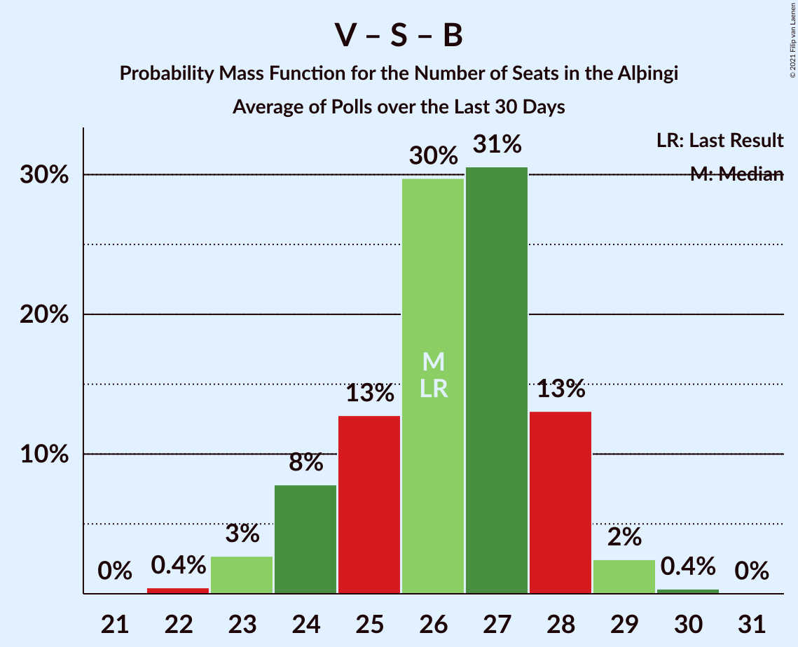

# Poll Average

<a href="#voting-intentions">Voting Intentions</a> | <a href="#seats">Seats</a> | <a href="#coalitions">Coalitions</a> | <a href="#technical-information">Technical Information</a>

## Summary

The table below lists the polls on which the average is based. They are the most recent polls (less than 30 days old) registered and analyzed so far.

| Period     | Polling firm/Commissioner(s) | D | V | S | M | B | P | F | C | A | R | T |
|:----------:|:----------------------------:|:--:|:--:|:--:|:--:|:--:|:--:|:--:|:--:|:--:|:--:|:--:|
| 28 October 2017 | General Election | 25.2%   16 | 16.9%   11 | 12.1%   7 | 10.9%   7 | 10.7%   8 | 9.2%   6 | 6.9%   4 | 6.7%   4 | 1.2%   0 | 0.2%   0 | 0.1%   0 |
| N/A | Poll Average | 18–24%   12–16 | 10–16%   6–10 | 15–22%   10–16 | 4–14%   0–10 | 7–10%   4–7 | 10–16%   6–11 | 4–8%   0–5 | 7–15%   4–9 | N/A   N/A | N/A   N/A | N/A   N/A |
| [3–4 December 2018](2018-12-04-Zenter.html) | Zenter | 19–24%   13–16 | 11–15%   7–10 | 19–23%   13–16 | 3–6%   0–3 | 7–10%   4–7 | 13–16%   9–11 | 5–7%   0–4 | 8–11%   5–7 | N/A   N/A | N/A   N/A | N/A   N/A |
| [30 November–3 December 2018](2018-12-03-Maskína.html) | Maskína | 17–22%   12–14 | 13–17%   9–11 | 18–22%   12–14 | 4–6%   0–3 | 7–10%   5–7 | 13–17%   9–11 | 3–6%   0–3 | 12–15%   8–10 | N/A   N/A | N/A   N/A | N/A   N/A |
| [3 November–2 December 2018](2018-12-02-Gallup.html) | Gallup | 22–25%   14–17 | 9–12%   6–7 | 17–20%   11–14 | 11–13%   7–10 | 7–8%   4–5 | 9–11%   5–7 | 5–7%   3–4 | 9–11%   5–6 | N/A   N/A | N/A   N/A | N/A   N/A |
| [8–12 November 2018](2018-11-12-MMR.html) | MMR | 18–22%   12–15 | 10–14%   6–9 | 14–19%   9–13 | 10–14%   7–10 | 7–11%   4–7 | 10–13%   6–9 | 6–9%   3–6 | 6–10%   4–6 | N/A   N/A | N/A   N/A | N/A   N/A |
| 28 October 2017 | General Election | 25.2%   16 | 16.9%   11 | 12.1%   7 | 10.9%   7 | 10.7%   8 | 9.2%   6 | 6.9%   4 | 6.7%   4 | 1.2%   0 | 0.2%   0 | 0.1%   0 |

Only polls for which at least the sample size has been published are included in the table above.

**Legend:**
+ **Top half of each row:** Voting intentions (95% confidence interval)
+ **Bottom half of each row:** Seat projections for the Alþingi (95% confidence interval)
+ **D:** Sjálfstæðisflokkurinn
+ **V:** Vinstrihreyfingin – grænt framboð
+ **S:** Samfylkingin
+ **M:** Miðflokkurinn
+ **B:** Framsóknarflokkurinn
+ **P:** Píratar
+ **F:** Flokkur fólksins
+ **C:** Viðreisn
+ **A:** Björt framtíð
+ **R:** Alþýðufylkingin
+ **T:** Dögun
+ **N/A (single party):** Party not included the published results
+ **N/A (entire row):** Calculation for this opinion poll not started yet

## Voting Intentions

### Confidence Intervals

| Party | Last Result | Median | 80% Confidence Interval | 90% Confidence Interval | 95% Confidence Interval | 99% Confidence Interval |
|:-----:|:-----------:|:------:|:-----------------------:|:-----------------------:|:-----------------------:|:-----------------------:|
| <a href="#sjálfstæðisflokkurinn">Sjálfstæðisflokkurinn</a> | 25.2% | 20.9% | 18.6–23.8% |18.1–24.2% | 17.7–24.5% | 17.0–25.1% |
| <a href="#vinstrihreyfingin-–-grænt-framboð">Vinstrihreyfingin – grænt framboð</a> | 16.9% | 12.2% | 10.3–15.2% |10.0–15.8% | 9.8–16.2% | 9.4–17.0% |
| <a href="#samfylkingin">Samfylkingin</a> | 12.1% | 19.1% | 16.3–21.3% |15.7–21.9% | 15.2–22.4% | 14.4–23.3% |
| <a href="#miðflokkurinn">Miðflokkurinn</a> | 10.9% | 7.9% | 4.0–12.7% |3.7–13.1% | 3.6–13.5% | 3.2–14.3% |
| <a href="#framsóknarflokkurinn">Framsóknarflokkurinn</a> | 10.7% | 8.4% | 7.3–9.7% |7.1–10.0% | 6.9–10.3% | 6.5–10.9% |
| <a href="#píratar">Píratar</a> | 9.2% | 12.9% | 10.0–15.5% |9.7–16.0% | 9.5–16.4% | 9.1–17.1% |
| <a href="#flokkur-fólksins">Flokkur fólksins</a> | 6.9% | 6.0% | 4.3–7.6% |4.0–8.1% | 3.8–8.5% | 3.4–9.2% |
| <a href="#viðreisn">Viðreisn</a> | 6.7% | 9.6% | 7.6–13.7% |7.2–14.3% | 6.9–14.7% | 6.3–15.5% |
| <a href="#björt-framtíð">Björt framtíð</a> | 1.2% | N/A | N/A |N/A | N/A | N/A |
| <a href="#alþýðufylkingin">Alþýðufylkingin</a> | 0.2% | N/A | N/A |N/A | N/A | N/A |
| <a href="#dögun">Dögun</a> | 0.1% | N/A | N/A |N/A | N/A | N/A |

### Sjálfstæðisflokkurinn

*For a full overview of the results for this party, see the [Sjálfstæðisflokkurinn](party-sjálfstæðisflokkurinn.html) page.*

| Voting Intentions | Probability | Accumulated | Special Marks |
|:-----------------:|:-----------:|:-----------:|:-------------:|
| 14.5–15.5% | 0% | 100% |  |
| 15.5–16.5% | 0.1% | 100% |  |
| 16.5–17.5% | 2% | 99.8% |  |
| 17.5–18.5% | 8% | 98% |  |
| 18.5–19.5% | 16% | 91% |  |
| 19.5–20.5% | 19% | 74% |  |
| 20.5–21.5% | 16% | 55% | Median |
| 21.5–22.5% | 12% | 39% |  |
| 22.5–23.5% | 14% | 27% |  |
| 23.5–24.5% | 11% | 13% |  |
| 24.5–25.5% | 2% | 2% | Last Result |
| 25.5–26.5% | 0.1% | 0.1% |  |
| 26.5–27.5% | 0% | 0% |  |

### Vinstrihreyfingin – grænt framboð

*For a full overview of the results for this party, see the [Vinstrihreyfingin – grænt framboð](party-vinstrihreyfingin–græntframboð.html) page.*

| Voting Intentions | Probability | Accumulated | Special Marks |
|:-----------------:|:-----------:|:-----------:|:-------------:|
| 7.5–8.5% | 0% | 100% |  |
| 8.5–9.5% | 1.2% | 100% |  |
| 9.5–10.5% | 15% | 98.8% |  |
| 10.5–11.5% | 22% | 84% |  |
| 11.5–12.5% | 17% | 61% | Median |
| 12.5–13.5% | 15% | 44% |  |
| 13.5–14.5% | 12% | 29% |  |
| 14.5–15.5% | 10% | 17% |  |
| 15.5–16.5% | 5% | 7% |  |
| 16.5–17.5% | 1.2% | 1.3% | Last Result |
| 17.5–18.5% | 0.1% | 0.1% |  |
| 18.5–19.5% | 0% | 0% |  |

### Samfylkingin

*For a full overview of the results for this party, see the [Samfylkingin](party-samfylkingin.html) page.*

| Voting Intentions | Probability | Accumulated | Special Marks |
|:-----------------:|:-----------:|:-----------:|:-------------:|
| 11.5–12.5% | 0% | 100% | Last Result |
| 12.5–13.5% | 0.1% | 100% |  |
| 13.5–14.5% | 0.7% | 99.9% |  |
| 14.5–15.5% | 3% | 99.3% |  |
| 15.5–16.5% | 8% | 96% |  |
| 16.5–17.5% | 9% | 88% |  |
| 17.5–18.5% | 17% | 79% |  |
| 18.5–19.5% | 23% | 62% | Median |
| 19.5–20.5% | 18% | 39% |  |
| 20.5–21.5% | 13% | 21% |  |
| 21.5–22.5% | 6% | 8% |  |
| 22.5–23.5% | 2% | 2% |  |
| 23.5–24.5% | 0.2% | 0.3% |  |
| 24.5–25.5% | 0% | 0% |  |

### Miðflokkurinn

*For a full overview of the results for this party, see the [Miðflokkurinn](party-miðflokkurinn.html) page.*

| Voting Intentions | Probability | Accumulated | Special Marks |
|:-----------------:|:-----------:|:-----------:|:-------------:|
| 1.5–2.5% | 0% | 100% |  |
| 2.5–3.5% | 2% | 100% |  |
| 3.5–4.5% | 25% | 98% |  |
| 4.5–5.5% | 20% | 72% |  |
| 5.5–6.5% | 2% | 52% |  |
| 6.5–7.5% | 0% | 50% |  |
| 7.5–8.5% | 0% | 50% | Median |
| 8.5–9.5% | 0.1% | 50% |  |
| 9.5–10.5% | 1.2% | 50% |  |
| 10.5–11.5% | 11% | 49% | Last Result |
| 11.5–12.5% | 25% | 38% |  |
| 12.5–13.5% | 11% | 13% |  |
| 13.5–14.5% | 2% | 2% |  |
| 14.5–15.5% | 0.3% | 0.3% |  |
| 15.5–16.5% | 0% | 0% |  |

### Framsóknarflokkurinn

*For a full overview of the results for this party, see the [Framsóknarflokkurinn](party-framsóknarflokkurinn.html) page.*

| Voting Intentions | Probability | Accumulated | Special Marks |
|:-----------------:|:-----------:|:-----------:|:-------------:|
| 4.5–5.5% | 0% | 100% |  |
| 5.5–6.5% | 0.5% | 100% |  |
| 6.5–7.5% | 17% | 99.5% |  |
| 7.5–8.5% | 38% | 82% | Median |
| 8.5–9.5% | 32% | 45% |  |
| 9.5–10.5% | 11% | 12% |  |
| 10.5–11.5% | 1.4% | 1.5% | Last Result |
| 11.5–12.5% | 0.1% | 0.1% |  |
| 12.5–13.5% | 0% | 0% |  |

### Píratar

*For a full overview of the results for this party, see the [Píratar](party-píratar.html) page.*

| Voting Intentions | Probability | Accumulated | Special Marks |
|:-----------------:|:-----------:|:-----------:|:-------------:|
| 7.5–8.5% | 0% | 100% |  |
| 8.5–9.5% | 3% | 100% | Last Result |
| 9.5–10.5% | 20% | 97% |  |
| 10.5–11.5% | 16% | 77% |  |
| 11.5–12.5% | 9% | 61% |  |
| 12.5–13.5% | 9% | 52% | Median |
| 13.5–14.5% | 17% | 44% |  |
| 14.5–15.5% | 17% | 27% |  |
| 15.5–16.5% | 8% | 10% |  |
| 16.5–17.5% | 2% | 2% |  |
| 17.5–18.5% | 0.2% | 0.2% |  |
| 18.5–19.5% | 0% | 0% |  |

### Flokkur fólksins

*For a full overview of the results for this party, see the [Flokkur fólksins](party-flokkurfólksins.html) page.*

| Voting Intentions | Probability | Accumulated | Special Marks |
|:-----------------:|:-----------:|:-----------:|:-------------:|
| 1.5–2.5% | 0% | 100% |  |
| 2.5–3.5% | 1.0% | 100% |  |
| 3.5–4.5% | 14% | 99.0% |  |
| 4.5–5.5% | 21% | 85% |  |
| 5.5–6.5% | 35% | 65% | Median |
| 6.5–7.5% | 19% | 30% | Last Result |
| 7.5–8.5% | 9% | 11% |  |
| 8.5–9.5% | 2% | 2% |  |
| 9.5–10.5% | 0.2% | 0.2% |  |
| 10.5–11.5% | 0% | 0% |  |

### Viðreisn

*For a full overview of the results for this party, see the [Viðreisn](party-viðreisn.html) page.*

| Voting Intentions | Probability | Accumulated | Special Marks |
|:-----------------:|:-----------:|:-----------:|:-------------:|
| 4.5–5.5% | 0% | 100% |  |
| 5.5–6.5% | 1.1% | 100% |  |
| 6.5–7.5% | 8% | 98.9% | Last Result |
| 7.5–8.5% | 17% | 91% |  |
| 8.5–9.5% | 24% | 74% |  |
| 9.5–10.5% | 22% | 51% | Median |
| 10.5–11.5% | 4% | 28% |  |
| 11.5–12.5% | 4% | 25% |  |
| 12.5–13.5% | 9% | 21% |  |
| 13.5–14.5% | 8% | 12% |  |
| 14.5–15.5% | 3% | 3% |  |
| 15.5–16.5% | 0.4% | 0.4% |  |
| 16.5–17.5% | 0% | 0% |  |

## Seats

### Confidence Intervals

| Party | Last Result | Median | 80% Confidence Interval | 90% Confidence Interval | 95% Confidence Interval | 99% Confidence Interval |
|:-----:|:-----------:|:------:|:-----------------------:|:-----------------------:|:-----------------------:|:-----------------------:|
| <a href="#sjálfstæðisflokkurinn">Sjálfstæðisflokkurinn</a> | 16 | 14 | 13–16 |12–16 | 12–16 | 11–17 |
| <a href="#vinstrihreyfingin-–-grænt-framboð">Vinstrihreyfingin – grænt framboð</a> | 11 | 8 | 6–10 |6–10 | 6–10 | 6–11 |
| <a href="#samfylkingin">Samfylkingin</a> | 7 | 13 | 11–15 |10–15 | 10–16 | 9–16 |
| <a href="#miðflokkurinn">Miðflokkurinn</a> | 7 | 5 | 0–10 |0–10 | 0–10 | 0–10 |
| <a href="#framsóknarflokkurinn">Framsóknarflokkurinn</a> | 8 | 5 | 4–6 |4–7 | 4–7 | 4–8 |
| <a href="#píratar">Píratar</a> | 6 | 9 | 6–10 |6–11 | 6–11 | 5–11 |
| <a href="#flokkur-fólksins">Flokkur fólksins</a> | 4 | 4 | 0–5 |0–5 | 0–5 | 0–6 |
| <a href="#viðreisn">Viðreisn</a> | 4 | 6 | 5–9 |4–9 | 4–9 | 4–10 |
| <a href="#björt-framtíð">Björt framtíð</a> | 0 | N/A | N/A |N/A | N/A | N/A |
| <a href="#alþýðufylkingin">Alþýðufylkingin</a> | 0 | N/A | N/A |N/A | N/A | N/A |
| <a href="#dögun">Dögun</a> | 0 | N/A | N/A |N/A | N/A | N/A |

### Sjálfstæðisflokkurinn

*For a full overview of the results for this party, see the [Sjálfstæðisflokkurinn](party-sjálfstæðisflokkurinn.html) page.*

| Number of Seats | Probability | Accumulated | Special Marks |
|:---------------:|:-----------:|:-----------:|:-------------:|
| 10 | 0.1% | 100% |  |
| 11 | 0.8% | 99.9% |  |
| 12 | 6% | 99.2% |  |
| 13 | 21% | 93% |  |
| 14 | 31% | 72% | Median |
| 15 | 21% | 41% |  |
| 16 | 19% | 20% | Last Result |
| 17 | 1.4% | 2% |  |
| 18 | 0.1% | 0.1% |  |
| 19 | 0% | 0% |  |

### Vinstrihreyfingin – grænt framboð

*For a full overview of the results for this party, see the [Vinstrihreyfingin – grænt framboð](party-vinstrihreyfingin–græntframboð.html) page.*

| Number of Seats | Probability | Accumulated | Special Marks |
|:---------------:|:-----------:|:-----------:|:-------------:|
| 5 | 0.2% | 100% |  |
| 6 | 17% | 99.8% |  |
| 7 | 27% | 83% |  |
| 8 | 19% | 56% | Median |
| 9 | 12% | 37% |  |
| 10 | 23% | 25% |  |
| 11 | 2% | 2% | Last Result |
| 12 | 0.1% | 0.1% |  |
| 13 | 0% | 0% |  |

### Samfylkingin

*For a full overview of the results for this party, see the [Samfylkingin](party-samfylkingin.html) page.*

| Number of Seats | Probability | Accumulated | Special Marks |
|:---------------:|:-----------:|:-----------:|:-------------:|
| 7 | 0% | 100% | Last Result |
| 8 | 0.1% | 100% |  |
| 9 | 0.9% | 99.9% |  |
| 10 | 9% | 99.1% |  |
| 11 | 17% | 90% |  |
| 12 | 15% | 73% |  |
| 13 | 14% | 58% | Median |
| 14 | 32% | 44% |  |
| 15 | 7% | 11% |  |
| 16 | 4% | 4% |  |
| 17 | 0.1% | 0.2% |  |
| 18 | 0% | 0% |  |

### Miðflokkurinn

*For a full overview of the results for this party, see the [Miðflokkurinn](party-miðflokkurinn.html) page.*

| Number of Seats | Probability | Accumulated | Special Marks |
|:---------------:|:-----------:|:-----------:|:-------------:|
| 0 | 24% | 100% |  |
| 1 | 19% | 76% |  |
| 2 | 0.2% | 57% |  |
| 3 | 6% | 56% |  |
| 4 | 0.7% | 51% |  |
| 5 | 0% | 50% | Median |
| 6 | 0.7% | 50% |  |
| 7 | 11% | 49% | Last Result |
| 8 | 8% | 38% |  |
| 9 | 17% | 31% |  |
| 10 | 13% | 13% |  |
| 11 | 0% | 0% |  |

### Framsóknarflokkurinn

*For a full overview of the results for this party, see the [Framsóknarflokkurinn](party-framsóknarflokkurinn.html) page.*

| Number of Seats | Probability | Accumulated | Special Marks |
|:---------------:|:-----------:|:-----------:|:-------------:|
| 4 | 17% | 100% |  |
| 5 | 37% | 83% | Median |
| 6 | 40% | 46% |  |
| 7 | 5% | 6% |  |
| 8 | 0.6% | 0.6% | Last Result |
| 9 | 0% | 0% |  |

### Píratar

*For a full overview of the results for this party, see the [Píratar](party-píratar.html) page.*

| Number of Seats | Probability | Accumulated | Special Marks |
|:---------------:|:-----------:|:-----------:|:-------------:|
| 5 | 0.9% | 100% |  |
| 6 | 18% | 99.1% | Last Result |
| 7 | 23% | 81% |  |
| 8 | 8% | 58% |  |
| 9 | 14% | 50% | Median |
| 10 | 29% | 37% |  |
| 11 | 8% | 8% |  |
| 12 | 0.3% | 0.3% |  |
| 13 | 0% | 0% |  |

### Flokkur fólksins

*For a full overview of the results for this party, see the [Flokkur fólksins](party-flokkurfólksins.html) page.*

| Number of Seats | Probability | Accumulated | Special Marks |
|:---------------:|:-----------:|:-----------:|:-------------:|
| 0 | 26% | 100% |  |
| 1 | 1.0% | 74% |  |
| 2 | 0% | 73% |  |
| 3 | 20% | 73% |  |
| 4 | 40% | 53% | Last Result, Median |
| 5 | 11% | 13% |  |
| 6 | 2% | 2% |  |
| 7 | 0% | 0% |  |

### Viðreisn

*For a full overview of the results for this party, see the [Viðreisn](party-viðreisn.html) page.*

| Number of Seats | Probability | Accumulated | Special Marks |
|:---------------:|:-----------:|:-----------:|:-------------:|
| 3 | 0.2% | 100% |  |
| 4 | 7% | 99.8% | Last Result |
| 5 | 22% | 93% |  |
| 6 | 40% | 70% | Median |
| 7 | 5% | 30% |  |
| 8 | 3% | 25% |  |
| 9 | 21% | 22% |  |
| 10 | 2% | 2% |  |
| 11 | 0% | 0% |  |

## Coalitions

### Confidence Intervals

| Coalition | Last Result | Median | Majority? | 80% Confidence Interval | 90% Confidence Interval | 95% Confidence Interval | 99% Confidence Interval |
|:---------:|:-----------:|:------:|:---------:|:-----------------------:|:-----------------------:|:-----------------------:|:-----------------------:|
| Vinstrihreyfingin – grænt framboð – Samfylkingin – Píratar – Viðreisn – Björt framtíð | 28 | 35 | 63% | 30–43 | 29–43 | 28–43 | 27–45 |
| Vinstrihreyfingin – grænt framboð – Samfylkingin – Píratar – Viðreisn | 28 | 35 | 63% | 30–43 | 29–43 | 28–43 | 27–45 |
| Vinstrihreyfingin – grænt framboð – Samfylkingin – Píratar – Björt framtíð | 24 | 29 | 43% | 24–34 | 24–34 | 23–35 | 22–36 |
| Vinstrihreyfingin – grænt framboð – Samfylkingin – Píratar | 24 | 29 | 43% | 24–34 | 24–34 | 23–35 | 22–36 |
| Vinstrihreyfingin – grænt framboð – Samfylkingin – Miðflokkurinn – Framsóknarflokkurinn | 33 | 31 | 35% | 29–33 | 28–34 | 28–34 | 27–35 |
| Sjálfstæðisflokkurinn – Vinstrihreyfingin – grænt framboð – Framsóknarflokkurinn | 35 | 27 | 0.5% | 25–30 | 25–30 | 25–31 | 24–31 |
| Sjálfstæðisflokkurinn – Samfylkingin | 23 | 28 | 0.8% | 24–30 | 23–31 | 23–31 | 22–32 |
| Vinstrihreyfingin – grænt framboð – Samfylkingin – Framsóknarflokkurinn | 26 | 26 | 0.4% | 22–30 | 22–30 | 21–30 | 21–31 |
| Sjálfstæðisflokkurinn – Miðflokkurinn – Framsóknarflokkurinn | 31 | 24 | 0.1% | 20–29 | 19–30 | 19–30 | 18–31 |
| Vinstrihreyfingin – grænt framboð – Samfylkingin – Miðflokkurinn | 25 | 26 | 0% | 23–28 | 22–28 | 22–29 | 21–30 |
| Sjálfstæðisflokkurinn – Miðflokkurinn | 23 | 19 | 0% | 14–24 | 14–25 | 14–26 | 13–26 |
| Sjálfstæðisflokkurinn – Vinstrihreyfingin – grænt framboð | 27 | 22 | 0% | 20–24 | 20–25 | 19–25 | 18–26 |
| Vinstrihreyfingin – grænt framboð – Samfylkingin | 18 | 21 | 0% | 17–24 | 17–24 | 17–25 | 16–25 |
| Sjálfstæðisflokkurinn – Viðreisn – Björt framtíð | 20 | 21 | 0% | 18–23 | 17–23 | 17–23 | 16–24 |
| Sjálfstæðisflokkurinn – Viðreisn | 20 | 21 | 0% | 18–23 | 17–23 | 17–23 | 16–24 |
| Vinstrihreyfingin – grænt framboð – Miðflokkurinn – Framsóknarflokkurinn | 26 | 18 | 0% | 14–22 | 14–23 | 13–23 | 13–24 |
| Sjálfstæðisflokkurinn – Framsóknarflokkurinn | 24 | 20 | 0% | 18–21 | 18–22 | 17–22 | 17–23 |
| Vinstrihreyfingin – grænt framboð – Píratar | 17 | 16 | 0% | 13–20 | 12–20 | 12–21 | 11–21 |
| Vinstrihreyfingin – grænt framboð – Framsóknarflokkurinn | 19 | 13 | 0% | 11–16 | 10–16 | 10–17 | 10–17 |
| Vinstrihreyfingin – grænt framboð – Miðflokkurinn | 18 | 13 | 0% | 9–17 | 8–17 | 8–17 | 8–18 |
| Sjálfstæðisflokkurinn – Björt framtíð | 16 | 14 | 0% | 13–16 | 12–16 | 12–16 | 11–17 |

### Vinstrihreyfingin – grænt framboð – Samfylkingin – Píratar – Viðreisn – Björt framtíð

| Number of Seats | Probability | Accumulated | Special Marks |
|:---------------:|:-----------:|:-----------:|:-------------:|
| 26 | 0.2% | 100% |  |
| 27 | 1.0% | 99.8% |  |
| 28 | 2% | 98.8% | Last Result |
| 29 | 6% | 97% |  |
| 30 | 14% | 91% |  |
| 31 | 13% | 77% |  |
| 32 | 10% | 63% | Majority |
| 33 | 3% | 53% |  |
| 34 | 0.2% | 50% |  |
| 35 | 0.3% | 50% |  |
| 36 | 2% | 50% | Median |
| 37 | 4% | 48% |  |
| 38 | 9% | 44% |  |
| 39 | 4% | 35% |  |
| 40 | 5% | 31% |  |
| 41 | 2% | 26% |  |
| 42 | 5% | 24% |  |
| 43 | 18% | 19% |  |
| 44 | 0.5% | 1.0% |  |
| 45 | 0.5% | 0.5% |  |
| 46 | 0% | 0% |  |

### Vinstrihreyfingin – grænt framboð – Samfylkingin – Píratar – Viðreisn

| Number of Seats | Probability | Accumulated | Special Marks |
|:---------------:|:-----------:|:-----------:|:-------------:|
| 26 | 0.2% | 100% |  |
| 27 | 1.0% | 99.8% |  |
| 28 | 2% | 98.8% | Last Result |
| 29 | 6% | 97% |  |
| 30 | 14% | 91% |  |
| 31 | 13% | 77% |  |
| 32 | 10% | 63% | Majority |
| 33 | 3% | 53% |  |
| 34 | 0.2% | 50% |  |
| 35 | 0.3% | 50% |  |
| 36 | 2% | 50% | Median |
| 37 | 4% | 48% |  |
| 38 | 9% | 44% |  |
| 39 | 4% | 35% |  |
| 40 | 5% | 31% |  |
| 41 | 2% | 26% |  |
| 42 | 5% | 24% |  |
| 43 | 18% | 19% |  |
| 44 | 0.5% | 1.0% |  |
| 45 | 0.5% | 0.5% |  |
| 46 | 0% | 0% |  |

### Vinstrihreyfingin – grænt framboð – Samfylkingin – Píratar – Björt framtíð

| Number of Seats | Probability | Accumulated | Special Marks |
|:---------------:|:-----------:|:-----------:|:-------------:|
| 21 | 0.1% | 100% |  |
| 22 | 0.5% | 99.9% |  |
| 23 | 3% | 99.4% |  |
| 24 | 11% | 96% | Last Result |
| 25 | 13% | 85% |  |
| 26 | 15% | 72% |  |
| 27 | 5% | 57% |  |
| 28 | 1.2% | 51% |  |
| 29 | 0.4% | 50% |  |
| 30 | 2% | 50% | Median |
| 31 | 4% | 48% |  |
| 32 | 9% | 43% | Majority |
| 33 | 9% | 35% |  |
| 34 | 23% | 25% |  |
| 35 | 2% | 3% |  |
| 36 | 0.9% | 0.9% |  |
| 37 | 0.1% | 0.1% |  |
| 38 | 0% | 0% |  |

### Vinstrihreyfingin – grænt framboð – Samfylkingin – Píratar

| Number of Seats | Probability | Accumulated | Special Marks |
|:---------------:|:-----------:|:-----------:|:-------------:|
| 21 | 0.1% | 100% |  |
| 22 | 0.5% | 99.9% |  |
| 23 | 3% | 99.4% |  |
| 24 | 11% | 96% | Last Result |
| 25 | 13% | 85% |  |
| 26 | 15% | 72% |  |
| 27 | 5% | 57% |  |
| 28 | 1.2% | 51% |  |
| 29 | 0.4% | 50% |  |
| 30 | 2% | 50% | Median |
| 31 | 4% | 48% |  |
| 32 | 9% | 43% | Majority |
| 33 | 9% | 35% |  |
| 34 | 23% | 25% |  |
| 35 | 2% | 3% |  |
| 36 | 0.9% | 0.9% |  |
| 37 | 0.1% | 0.1% |  |
| 38 | 0% | 0% |  |

### Vinstrihreyfingin – grænt framboð – Samfylkingin – Miðflokkurinn – Framsóknarflokkurinn

| Number of Seats | Probability | Accumulated | Special Marks |
|:---------------:|:-----------:|:-----------:|:-------------:|
| 26 | 0.2% | 100% |  |
| 27 | 0.8% | 99.8% |  |
| 28 | 6% | 98.9% |  |
| 29 | 13% | 93% |  |
| 30 | 23% | 80% |  |
| 31 | 21% | 56% | Median |
| 32 | 18% | 35% | Majority |
| 33 | 10% | 16% | Last Result |
| 34 | 6% | 7% |  |
| 35 | 1.0% | 1.2% |  |
| 36 | 0.1% | 0.1% |  |
| 37 | 0% | 0% |  |

### Sjálfstæðisflokkurinn – Vinstrihreyfingin – grænt framboð – Framsóknarflokkurinn

| Number of Seats | Probability | Accumulated | Special Marks |
|:---------------:|:-----------:|:-----------:|:-------------:|
| 22 | 0.1% | 100% |  |
| 23 | 0.2% | 99.9% |  |
| 24 | 2% | 99.7% |  |
| 25 | 9% | 98% |  |
| 26 | 19% | 88% |  |
| 27 | 23% | 69% | Median |
| 28 | 10% | 46% |  |
| 29 | 10% | 36% |  |
| 30 | 22% | 26% |  |
| 31 | 4% | 4% |  |
| 32 | 0.4% | 0.5% | Majority |
| 33 | 0.1% | 0.1% |  |
| 34 | 0% | 0% |  |
| 35 | 0% | 0% | Last Result |

### Sjálfstæðisflokkurinn – Samfylkingin

| Number of Seats | Probability | Accumulated | Special Marks |
|:---------------:|:-----------:|:-----------:|:-------------:|
| 21 | 0.3% | 100% |  |
| 22 | 1.4% | 99.7% |  |
| 23 | 6% | 98% | Last Result |
| 24 | 8% | 92% |  |
| 25 | 10% | 84% |  |
| 26 | 8% | 74% |  |
| 27 | 16% | 66% | Median |
| 28 | 25% | 50% |  |
| 29 | 12% | 25% |  |
| 30 | 7% | 13% |  |
| 31 | 5% | 6% |  |
| 32 | 0.7% | 0.8% | Majority |
| 33 | 0% | 0% |  |

### Vinstrihreyfingin – grænt framboð – Samfylkingin – Framsóknarflokkurinn

| Number of Seats | Probability | Accumulated | Special Marks |
|:---------------:|:-----------:|:-----------:|:-------------:|
| 20 | 0.2% | 100% |  |
| 21 | 4% | 99.8% |  |
| 22 | 9% | 96% |  |
| 23 | 13% | 87% |  |
| 24 | 15% | 74% |  |
| 25 | 7% | 59% |  |
| 26 | 3% | 52% | Last Result, Median |
| 27 | 6% | 49% |  |
| 28 | 12% | 43% |  |
| 29 | 8% | 31% |  |
| 30 | 21% | 23% |  |
| 31 | 2% | 2% |  |
| 32 | 0.4% | 0.4% | Majority |
| 33 | 0% | 0% |  |

### Sjálfstæðisflokkurinn – Miðflokkurinn – Framsóknarflokkurinn

| Number of Seats | Probability | Accumulated | Special Marks |
|:---------------:|:-----------:|:-----------:|:-------------:|
| 17 | 0.1% | 100% |  |
| 18 | 1.3% | 99.9% |  |
| 19 | 4% | 98.6% |  |
| 20 | 21% | 95% |  |
| 21 | 12% | 74% |  |
| 22 | 7% | 62% |  |
| 23 | 5% | 56% |  |
| 24 | 1.1% | 51% | Median |
| 25 | 2% | 50% |  |
| 26 | 5% | 48% |  |
| 27 | 10% | 43% |  |
| 28 | 18% | 34% |  |
| 29 | 10% | 16% |  |
| 30 | 5% | 6% |  |
| 31 | 0.8% | 0.8% | Last Result |
| 32 | 0.1% | 0.1% | Majority |
| 33 | 0% | 0% |  |

### Vinstrihreyfingin – grænt framboð – Samfylkingin – Miðflokkurinn

| Number of Seats | Probability | Accumulated | Special Marks |
|:---------------:|:-----------:|:-----------:|:-------------:|
| 20 | 0.1% | 100% |  |
| 21 | 0.5% | 99.9% |  |
| 22 | 5% | 99.4% |  |
| 23 | 8% | 95% |  |
| 24 | 26% | 87% |  |
| 25 | 9% | 60% | Last Result |
| 26 | 16% | 51% | Median |
| 27 | 16% | 35% |  |
| 28 | 15% | 19% |  |
| 29 | 3% | 4% |  |
| 30 | 2% | 2% |  |
| 31 | 0% | 0% |  |

### Sjálfstæðisflokkurinn – Miðflokkurinn

| Number of Seats | Probability | Accumulated | Special Marks |
|:---------------:|:-----------:|:-----------:|:-------------:|
| 12 | 0.4% | 100% |  |
| 13 | 2% | 99.6% |  |
| 14 | 22% | 98% |  |
| 15 | 9% | 76% |  |
| 16 | 10% | 67% |  |
| 17 | 6% | 57% |  |
| 18 | 1.3% | 51% |  |
| 19 | 1.0% | 50% | Median |
| 20 | 3% | 49% |  |
| 21 | 5% | 46% |  |
| 22 | 9% | 41% |  |
| 23 | 15% | 32% | Last Result |
| 24 | 9% | 18% |  |
| 25 | 5% | 9% |  |
| 26 | 4% | 4% |  |
| 27 | 0.2% | 0.2% |  |
| 28 | 0% | 0% |  |

### Sjálfstæðisflokkurinn – Vinstrihreyfingin – grænt framboð

| Number of Seats | Probability | Accumulated | Special Marks |
|:---------------:|:-----------:|:-----------:|:-------------:|
| 17 | 0.1% | 100% |  |
| 18 | 0.4% | 99.9% |  |
| 19 | 3% | 99.5% |  |
| 20 | 10% | 96% |  |
| 21 | 15% | 87% |  |
| 22 | 28% | 72% | Median |
| 23 | 17% | 44% |  |
| 24 | 22% | 27% |  |
| 25 | 4% | 5% |  |
| 26 | 0.8% | 1.0% |  |
| 27 | 0.2% | 0.2% | Last Result |
| 28 | 0% | 0% |  |

### Vinstrihreyfingin – grænt framboð – Samfylkingin

| Number of Seats | Probability | Accumulated | Special Marks |
|:---------------:|:-----------:|:-----------:|:-------------:|
| 15 | 0.2% | 100% |  |
| 16 | 2% | 99.8% |  |
| 17 | 8% | 98% |  |
| 18 | 14% | 90% | Last Result |
| 19 | 19% | 76% |  |
| 20 | 5% | 56% |  |
| 21 | 6% | 51% | Median |
| 22 | 9% | 45% |  |
| 23 | 12% | 37% |  |
| 24 | 21% | 25% |  |
| 25 | 3% | 4% |  |
| 26 | 0.4% | 0.5% |  |
| 27 | 0.1% | 0.1% |  |
| 28 | 0% | 0% |  |

### Sjálfstæðisflokkurinn – Viðreisn – Björt framtíð

| Number of Seats | Probability | Accumulated | Special Marks |
|:---------------:|:-----------:|:-----------:|:-------------:|
| 15 | 0.2% | 100% |  |
| 16 | 1.0% | 99.8% |  |
| 17 | 6% | 98.8% |  |
| 18 | 10% | 93% |  |
| 19 | 9% | 83% |  |
| 20 | 13% | 74% | Last Result, Median |
| 21 | 20% | 61% |  |
| 22 | 23% | 42% |  |
| 23 | 18% | 19% |  |
| 24 | 0.5% | 0.5% |  |
| 25 | 0.1% | 0.1% |  |
| 26 | 0% | 0% |  |

### Sjálfstæðisflokkurinn – Viðreisn

| Number of Seats | Probability | Accumulated | Special Marks |
|:---------------:|:-----------:|:-----------:|:-------------:|
| 15 | 0.2% | 100% |  |
| 16 | 1.0% | 99.8% |  |
| 17 | 6% | 98.8% |  |
| 18 | 10% | 93% |  |
| 19 | 9% | 83% |  |
| 20 | 13% | 74% | Last Result, Median |
| 21 | 20% | 61% |  |
| 22 | 23% | 42% |  |
| 23 | 18% | 19% |  |
| 24 | 0.5% | 0.5% |  |
| 25 | 0.1% | 0.1% |  |
| 26 | 0% | 0% |  |

### Vinstrihreyfingin – grænt framboð – Miðflokkurinn – Framsóknarflokkurinn

| Number of Seats | Probability | Accumulated | Special Marks |
|:---------------:|:-----------:|:-----------:|:-------------:|
| 12 | 0.2% | 100% |  |
| 13 | 3% | 99.8% |  |
| 14 | 8% | 97% |  |
| 15 | 8% | 89% |  |
| 16 | 21% | 81% |  |
| 17 | 4% | 59% |  |
| 18 | 10% | 55% | Median |
| 19 | 6% | 45% |  |
| 20 | 17% | 39% |  |
| 21 | 9% | 23% |  |
| 22 | 8% | 14% |  |
| 23 | 5% | 6% |  |
| 24 | 0.9% | 1.1% |  |
| 25 | 0.1% | 0.2% |  |
| 26 | 0% | 0% | Last Result |

### Sjálfstæðisflokkurinn – Framsóknarflokkurinn

| Number of Seats | Probability | Accumulated | Special Marks |
|:---------------:|:-----------:|:-----------:|:-------------:|
| 15 | 0.1% | 100% |  |
| 16 | 0.4% | 99.9% |  |
| 17 | 4% | 99.5% |  |
| 18 | 14% | 96% |  |
| 19 | 22% | 82% | Median |
| 20 | 40% | 60% |  |
| 21 | 13% | 20% |  |
| 22 | 5% | 6% |  |
| 23 | 0.6% | 0.7% |  |
| 24 | 0.1% | 0.1% | Last Result |
| 25 | 0% | 0% |  |

### Vinstrihreyfingin – grænt framboð – Píratar

| Number of Seats | Probability | Accumulated | Special Marks |
|:---------------:|:-----------:|:-----------:|:-------------:|
| 11 | 0.7% | 100% |  |
| 12 | 5% | 99.2% |  |
| 13 | 23% | 95% |  |
| 14 | 9% | 72% |  |
| 15 | 8% | 64% |  |
| 16 | 8% | 55% |  |
| 17 | 6% | 47% | Last Result, Median |
| 18 | 8% | 41% |  |
| 19 | 7% | 33% |  |
| 20 | 22% | 26% |  |
| 21 | 4% | 4% |  |
| 22 | 0.3% | 0.3% |  |
| 23 | 0.1% | 0.1% |  |
| 24 | 0% | 0% |  |

### Vinstrihreyfingin – grænt framboð – Framsóknarflokkurinn

| Number of Seats | Probability | Accumulated | Special Marks |
|:---------------:|:-----------:|:-----------:|:-------------:|
| 9 | 0.1% | 100% |  |
| 10 | 6% | 99.9% |  |
| 11 | 20% | 94% |  |
| 12 | 11% | 75% |  |
| 13 | 16% | 63% | Median |
| 14 | 14% | 47% |  |
| 15 | 11% | 33% |  |
| 16 | 20% | 22% |  |
| 17 | 3% | 3% |  |
| 18 | 0.2% | 0.2% |  |
| 19 | 0% | 0% | Last Result |

### Vinstrihreyfingin – grænt framboð – Miðflokkurinn

| Number of Seats | Probability | Accumulated | Special Marks |
|:---------------:|:-----------:|:-----------:|:-------------:|
| 7 | 0.2% | 100% |  |
| 8 | 7% | 99.8% |  |
| 9 | 9% | 92% |  |
| 10 | 22% | 84% |  |
| 11 | 5% | 61% |  |
| 12 | 5% | 56% |  |
| 13 | 7% | 51% | Median |
| 14 | 4% | 45% |  |
| 15 | 9% | 40% |  |
| 16 | 21% | 32% |  |
| 17 | 9% | 10% |  |
| 18 | 2% | 2% | Last Result |
| 19 | 0.2% | 0.2% |  |
| 20 | 0% | 0% |  |

### Sjálfstæðisflokkurinn – Björt framtíð

| Number of Seats | Probability | Accumulated | Special Marks |
|:---------------:|:-----------:|:-----------:|:-------------:|
| 10 | 0.1% | 100% |  |
| 11 | 0.8% | 99.9% |  |
| 12 | 6% | 99.2% |  |
| 13 | 21% | 93% |  |
| 14 | 31% | 72% | Median |
| 15 | 21% | 41% |  |
| 16 | 19% | 20% | Last Result |
| 17 | 1.4% | 2% |  |
| 18 | 0.1% | 0.1% |  |
| 19 | 0% | 0% |  |

## Technical Information

+ **Number of polls included in this average:** 4
+ **Lowest number of simulations done in a poll included in this average:** 131,072
+ **Total number of simulations done in the polls included in this average:** 1,441,792
+ **Error estimate:** 2.04%
