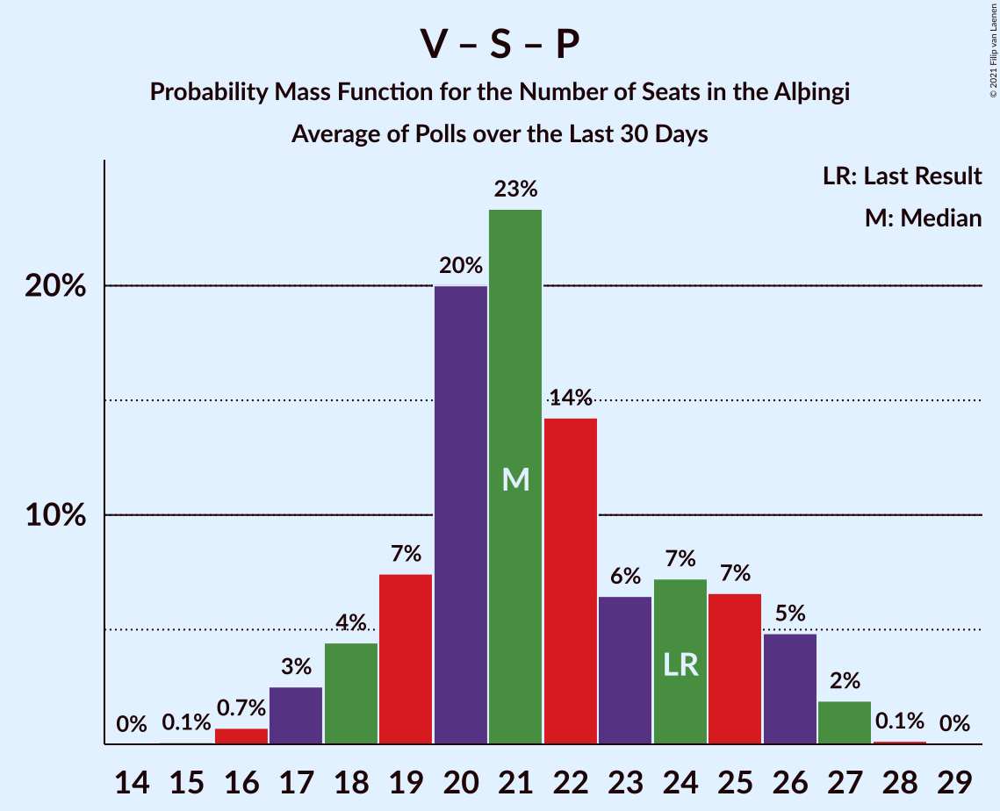

# Poll Average

<a href="#voting-intentions">Voting Intentions</a> | <a href="#seats">Seats</a> | <a href="#coalitions">Coalitions</a> | <a href="#technical-information">Technical Information</a>

## Summary

The table below lists the polls on which the average is based. They are the most recent polls (less than 30 days old) registered and analyzed so far.

| Period     | Polling firm/Commissioner(s) | D | V | S | M | B | P | F | C | A | R | T | J |
|:----------:|:----------------------------:|:--:|:--:|:--:|:--:|:--:|:--:|:--:|:--:|:--:|:--:|:--:|:--:|
| 28 October 2017 | General Election | 25.2%   16 | 16.9%   11 | 12.1%   7 | 10.9%   7 | 10.7%   8 | 9.2%   6 | 6.9%   4 | 6.7%   4 | 1.2%   0 | 0.2%   0 | 0.1%   0 | 0.0%   0 |
| N/A | Poll Average | 21–25%   15–18 | 9–12%   6–9 | 14–18%   10–13 | 6–10%   3–6 | 6–9%   4–6 | 11–19%   8–13 | 4–6%   0–4 | 9–12%   6–8 | N/A   N/A | N/A   N/A | N/A   N/A | 3–4%   0 |
| [1 December 2020–3 January 2021](2021-01-03-Gallup.html) | Gallup | 23–25%   16–17 | 11–13%   7–9 | 16–18%   11–12 | 8–10%   6–7 | 8–9%   5–6 | 11–13%   8–9 | 4–5%   0 | 9–11%   6–7 | N/A   N/A | N/A   N/A | N/A   N/A | 3–4%   0 |
| [11–19 December 2020](2020-12-19-Zenter.html) | Zenter | 21–25%   15–18 | 9–12%   6–8 | 14–18%   9–13 | 5–8%   3–5 | 6–9%   4–6 | 15–19%   10–13 | 4–6%   0–4 | 9–12%   6–8 | N/A   N/A | N/A   N/A | N/A   N/A | 2–4%   0 |
| 28 October 2017 | General Election | 25.2%   16 | 16.9%   11 | 12.1%   7 | 10.9%   7 | 10.7%   8 | 9.2%   6 | 6.9%   4 | 6.7%   4 | 1.2%   0 | 0.2%   0 | 0.1%   0 | 0.0%   0 |

Only polls for which at least the sample size has been published are included in the table above.

**Legend:**
+ **Top half of each row:** Voting intentions (95% confidence interval)
+ **Bottom half of each row:** Seat projections for the Alþingi (95% confidence interval)
+ **D:** Sjálfstæðisflokkurinn
+ **V:** Vinstrihreyfingin – grænt framboð
+ **S:** Samfylkingin
+ **M:** Miðflokkurinn
+ **B:** Framsóknarflokkurinn
+ **P:** Píratar
+ **F:** Flokkur fólksins
+ **C:** Viðreisn
+ **A:** Björt framtíð
+ **R:** Alþýðufylkingin
+ **T:** Dögun
+ **J:** Sósíalistaflokkur Íslands
+ **N/A (single party):** Party not included the published results
+ **N/A (entire row):** Calculation for this opinion poll not started yet

## Voting Intentions

### Confidence Intervals

| Party | Last Result | Median | 80% Confidence Interval | 90% Confidence Interval | 95% Confidence Interval | 99% Confidence Interval |
|:-----:|:-----------:|:------:|:-----------------------:|:-----------------------:|:-----------------------:|:-----------------------:|
| <a href="#sjálfstæðisflokkurinn">Sjálfstæðisflokkurinn</a> | 25.2% | 23.5% | 21.9–24.5% |21.5–24.7% | 21.0–25.0% | 20.3–25.7% |
| <a href="#vinstrihreyfingin-–-grænt-framboð">Vinstrihreyfingin – grænt framboð</a> | 16.9% | 11.2% | 9.6–12.1% |9.2–12.3% | 9.0–12.5% | 8.4–12.8% |
| <a href="#samfylkingin">Samfylkingin</a> | 12.1% | 16.6% | 14.8–17.5% |14.4–17.7% | 14.0–17.9% | 13.4–18.3% |
| <a href="#miðflokkurinn">Miðflokkurinn</a> | 10.9% | 8.3% | 6.2–9.4% |5.9–9.6% | 5.6–9.7% | 5.2–10.0% |
| <a href="#framsóknarflokkurinn">Framsóknarflokkurinn</a> | 10.7% | 8.0% | 6.7–8.7% |6.4–8.8% | 6.2–9.0% | 5.8–9.3% |
| <a href="#píratar">Píratar</a> | 9.2% | 13.5% | 11.6–17.9% |11.4–18.3% | 11.2–18.7% | 11.0–19.5% |
| <a href="#flokkur-fólksins">Flokkur fólksins</a> | 6.9% | 4.5% | 4.0–5.3% |3.9–5.5% | 3.8–5.8% | 3.5–6.2% |
| <a href="#viðreisn">Viðreisn</a> | 6.7% | 10.1% | 9.4–11.0% |9.2–11.4% | 8.9–11.7% | 8.4–12.3% |
| <a href="#björt-framtíð">Björt framtíð</a> | 1.2% | N/A | N/A |N/A | N/A | N/A |
| <a href="#alþýðufylkingin">Alþýðufylkingin</a> | 0.2% | N/A | N/A |N/A | N/A | N/A |
| <a href="#dögun">Dögun</a> | 0.1% | N/A | N/A |N/A | N/A | N/A |
| <a href="#sósíalistaflokkur-íslands">Sósíalistaflokkur Íslands</a> | 0.0% | 3.7% | 3.0–4.1% |2.8–4.2% | 2.6–4.4% | 2.4–4.7% |

### Sjálfstæðisflokkurinn

*For a full overview of the results for this party, see the [Sjálfstæðisflokkurinn](party-sjálfstæðisflokkurinn.html) page.*

| Voting Intentions | Probability | Accumulated | Special Marks |
|:-----------------:|:-----------:|:-----------:|:-------------:|
| 18.5–19.5% | 0.1% | 100% |  |
| 19.5–20.5% | 0.8% | 99.9% |  |
| 20.5–21.5% | 5% | 99.1% |  |
| 21.5–22.5% | 14% | 94% |  |
| 22.5–23.5% | 34% | 80% | Median |
| 23.5–24.5% | 39% | 47% |  |
| 24.5–25.5% | 7% | 8% | Last Result |
| 25.5–26.5% | 0.6% | 0.7% |  |
| 26.5–27.5% | 0.1% | 0.1% |  |
| 27.5–28.5% | 0% | 0% |  |

### Vinstrihreyfingin – grænt framboð

*For a full overview of the results for this party, see the [Vinstrihreyfingin – grænt framboð](party-vinstrihreyfingin–græntframboð.html) page.*

| Voting Intentions | Probability | Accumulated | Special Marks |
|:-----------------:|:-----------:|:-----------:|:-------------:|
| 6.5–7.5% | 0% | 100% |  |
| 7.5–8.5% | 0.7% | 100% |  |
| 8.5–9.5% | 9% | 99.3% |  |
| 9.5–10.5% | 22% | 90% |  |
| 10.5–11.5% | 32% | 68% | Median |
| 11.5–12.5% | 35% | 36% |  |
| 12.5–13.5% | 2% | 2% |  |
| 13.5–14.5% | 0% | 0% |  |
| 14.5–15.5% | 0% | 0% |  |
| 15.5–16.5% | 0% | 0% |  |
| 16.5–17.5% | 0% | 0% | Last Result |

### Samfylkingin

*For a full overview of the results for this party, see the [Samfylkingin](party-samfylkingin.html) page.*

| Voting Intentions | Probability | Accumulated | Special Marks |
|:-----------------:|:-----------:|:-----------:|:-------------:|
| 11.5–12.5% | 0% | 100% | Last Result |
| 12.5–13.5% | 0.7% | 100% |  |
| 13.5–14.5% | 6% | 99.3% |  |
| 14.5–15.5% | 17% | 93% |  |
| 15.5–16.5% | 26% | 77% |  |
| 16.5–17.5% | 42% | 51% | Median |
| 17.5–18.5% | 9% | 9% |  |
| 18.5–19.5% | 0.2% | 0.2% |  |
| 19.5–20.5% | 0% | 0% |  |

### Miðflokkurinn

*For a full overview of the results for this party, see the [Miðflokkurinn](party-miðflokkurinn.html) page.*

| Voting Intentions | Probability | Accumulated | Special Marks |
|:-----------------:|:-----------:|:-----------:|:-------------:|
| 3.5–4.5% | 0% | 100% |  |
| 4.5–5.5% | 2% | 100% |  |
| 5.5–6.5% | 19% | 98% |  |
| 6.5–7.5% | 24% | 80% |  |
| 7.5–8.5% | 9% | 56% | Median |
| 8.5–9.5% | 41% | 47% |  |
| 9.5–10.5% | 6% | 6% |  |
| 10.5–11.5% | 0% | 0% | Last Result |

### Framsóknarflokkurinn

*For a full overview of the results for this party, see the [Framsóknarflokkurinn](party-framsóknarflokkurinn.html) page.*

| Voting Intentions | Probability | Accumulated | Special Marks |
|:-----------------:|:-----------:|:-----------:|:-------------:|
| 3.5–4.5% | 0% | 100% |  |
| 4.5–5.5% | 0.2% | 100% |  |
| 5.5–6.5% | 7% | 99.8% |  |
| 6.5–7.5% | 25% | 93% |  |
| 7.5–8.5% | 52% | 68% | Median |
| 8.5–9.5% | 16% | 16% |  |
| 9.5–10.5% | 0.1% | 0.1% |  |
| 10.5–11.5% | 0% | 0% | Last Result |

### Píratar

*For a full overview of the results for this party, see the [Píratar](party-píratar.html) page.*

| Voting Intentions | Probability | Accumulated | Special Marks |
|:-----------------:|:-----------:|:-----------:|:-------------:|
| 8.5–9.5% | 0% | 100% | Last Result |
| 9.5–10.5% | 0% | 100% |  |
| 10.5–11.5% | 9% | 100% |  |
| 11.5–12.5% | 37% | 91% |  |
| 12.5–13.5% | 4% | 54% |  |
| 13.5–14.5% | 0.3% | 50% | Median |
| 14.5–15.5% | 3% | 50% |  |
| 15.5–16.5% | 13% | 46% |  |
| 16.5–17.5% | 18% | 34% |  |
| 17.5–18.5% | 12% | 15% |  |
| 18.5–19.5% | 3% | 4% |  |
| 19.5–20.5% | 0.4% | 0.4% |  |
| 20.5–21.5% | 0% | 0% |  |

### Flokkur fólksins

*For a full overview of the results for this party, see the [Flokkur fólksins](party-flokkurfólksins.html) page.*

| Voting Intentions | Probability | Accumulated | Special Marks |
|:-----------------:|:-----------:|:-----------:|:-------------:|
| 1.5–2.5% | 0% | 100% |  |
| 2.5–3.5% | 0.7% | 100% |  |
| 3.5–4.5% | 59% | 99.3% | Median |
| 4.5–5.5% | 36% | 41% |  |
| 5.5–6.5% | 5% | 5% |  |
| 6.5–7.5% | 0.1% | 0.1% | Last Result |
| 7.5–8.5% | 0% | 0% |  |

### Viðreisn

*For a full overview of the results for this party, see the [Viðreisn](party-viðreisn.html) page.*

| Voting Intentions | Probability | Accumulated | Special Marks |
|:-----------------:|:-----------:|:-----------:|:-------------:|
| 6.5–7.5% | 0% | 100% | Last Result |
| 7.5–8.5% | 0.7% | 100% |  |
| 8.5–9.5% | 15% | 99.3% |  |
| 9.5–10.5% | 61% | 85% | Median |
| 10.5–11.5% | 20% | 23% |  |
| 11.5–12.5% | 3% | 3% |  |
| 12.5–13.5% | 0.2% | 0.2% |  |
| 13.5–14.5% | 0% | 0% |  |

### Sósíalistaflokkur Íslands

*For a full overview of the results for this party, see the [Sósíalistaflokkur Íslands](party-sósíalistaflokkuríslands.html) page.*

| Voting Intentions | Probability | Accumulated | Special Marks |
|:-----------------:|:-----------:|:-----------:|:-------------:|
| 0.0–0.5% | 0% | 100% | Last Result |
| 0.5–1.5% | 0% | 100% |  |
| 1.5–2.5% | 2% | 100% |  |
| 2.5–3.5% | 37% | 98% |  |
| 3.5–4.5% | 61% | 62% | Median |
| 4.5–5.5% | 0.9% | 0.9% |  |
| 5.5–6.5% | 0% | 0% |  |

## Seats

### Confidence Intervals

| Party | Last Result | Median | 80% Confidence Interval | 90% Confidence Interval | 95% Confidence Interval | 99% Confidence Interval |
|:-----:|:-----------:|:------:|:-----------------------:|:-----------------------:|:-----------------------:|:-----------------------:|
| <a href="#sjálfstæðisflokkurinn">Sjálfstæðisflokkurinn</a> | 16 | 16 | 16–17 |15–18 | 15–18 | 14–19 |
| <a href="#vinstrihreyfingin-–-grænt-framboð">Vinstrihreyfingin – grænt framboð</a> | 11 | 8 | 6–8 |6–8 | 6–9 | 5–9 |
| <a href="#samfylkingin">Samfylkingin</a> | 7 | 12 | 10–12 |10–13 | 10–13 | 9–13 |
| <a href="#miðflokkurinn">Miðflokkurinn</a> | 7 | 6 | 4–6 |4–6 | 3–6 | 3–7 |
| <a href="#framsóknarflokkurinn">Framsóknarflokkurinn</a> | 8 | 5 | 4–6 |4–6 | 4–6 | 4–6 |
| <a href="#píratar">Píratar</a> | 6 | 9 | 8–13 |8–13 | 8–13 | 7–14 |
| <a href="#flokkur-fólksins">Flokkur fólksins</a> | 4 | 0 | 0–3 |0–3 | 0–4 | 0–4 |
| <a href="#viðreisn">Viðreisn</a> | 4 | 7 | 6–7 |6–8 | 6–8 | 6–8 |
| <a href="#björt-framtíð">Björt framtíð</a> | 0 | N/A | N/A |N/A | N/A | N/A |
| <a href="#alþýðufylkingin">Alþýðufylkingin</a> | 0 | N/A | N/A |N/A | N/A | N/A |
| <a href="#dögun">Dögun</a> | 0 | N/A | N/A |N/A | N/A | N/A |
| <a href="#sósíalistaflokkur-íslands">Sósíalistaflokkur Íslands</a> | 0 | 0 | 0 |0 | 0 | 0 |

### Sjálfstæðisflokkurinn

*For a full overview of the results for this party, see the [Sjálfstæðisflokkurinn](party-sjálfstæðisflokkurinn.html) page.*

| Number of Seats | Probability | Accumulated | Special Marks |
|:---------------:|:-----------:|:-----------:|:-------------:|
| 13 | 0.1% | 100% |  |
| 14 | 0.5% | 99.9% |  |
| 15 | 9% | 99.5% |  |
| 16 | 41% | 90% | Last Result, Median |
| 17 | 43% | 49% |  |
| 18 | 6% | 6% |  |
| 19 | 0.6% | 0.9% |  |
| 20 | 0.2% | 0.3% |  |
| 21 | 0.1% | 0.1% |  |
| 22 | 0% | 0% |  |

### Vinstrihreyfingin – grænt framboð

*For a full overview of the results for this party, see the [Vinstrihreyfingin – grænt framboð](party-vinstrihreyfingin–græntframboð.html) page.*

| Number of Seats | Probability | Accumulated | Special Marks |
|:---------------:|:-----------:|:-----------:|:-------------:|
| 5 | 0.5% | 100% |  |
| 6 | 12% | 99.5% |  |
| 7 | 33% | 87% |  |
| 8 | 50% | 55% | Median |
| 9 | 4% | 4% |  |
| 10 | 0.1% | 0.1% |  |
| 11 | 0% | 0% | Last Result |

### Samfylkingin

*For a full overview of the results for this party, see the [Samfylkingin](party-samfylkingin.html) page.*

| Number of Seats | Probability | Accumulated | Special Marks |
|:---------------:|:-----------:|:-----------:|:-------------:|
| 7 | 0% | 100% | Last Result |
| 8 | 0.1% | 100% |  |
| 9 | 2% | 99.9% |  |
| 10 | 14% | 98% |  |
| 11 | 32% | 84% |  |
| 12 | 45% | 52% | Median |
| 13 | 8% | 8% |  |
| 14 | 0.1% | 0.1% |  |
| 15 | 0% | 0% |  |

### Miðflokkurinn

*For a full overview of the results for this party, see the [Miðflokkurinn](party-miðflokkurinn.html) page.*

| Number of Seats | Probability | Accumulated | Special Marks |
|:---------------:|:-----------:|:-----------:|:-------------:|
| 1 | 0.1% | 100% |  |
| 2 | 0.1% | 99.9% |  |
| 3 | 3% | 99.8% |  |
| 4 | 28% | 97% |  |
| 5 | 19% | 69% |  |
| 6 | 48% | 50% | Median |
| 7 | 2% | 2% | Last Result |
| 8 | 0% | 0% |  |

### Framsóknarflokkurinn

*For a full overview of the results for this party, see the [Framsóknarflokkurinn](party-framsóknarflokkurinn.html) page.*

| Number of Seats | Probability | Accumulated | Special Marks |
|:---------------:|:-----------:|:-----------:|:-------------:|
| 3 | 0.2% | 100% |  |
| 4 | 19% | 99.8% |  |
| 5 | 49% | 81% | Median |
| 6 | 32% | 32% |  |
| 7 | 0.1% | 0.1% |  |
| 8 | 0% | 0% | Last Result |

### Píratar

*For a full overview of the results for this party, see the [Píratar](party-píratar.html) page.*

| Number of Seats | Probability | Accumulated | Special Marks |
|:---------------:|:-----------:|:-----------:|:-------------:|
| 6 | 0% | 100% | Last Result |
| 7 | 0.8% | 100% |  |
| 8 | 43% | 99.2% |  |
| 9 | 6% | 56% | Median |
| 10 | 4% | 50% |  |
| 11 | 16% | 46% |  |
| 12 | 19% | 30% |  |
| 13 | 9% | 10% |  |
| 14 | 1.2% | 1.2% |  |
| 15 | 0.1% | 0.1% |  |
| 16 | 0% | 0% |  |

### Flokkur fólksins

*For a full overview of the results for this party, see the [Flokkur fólksins](party-flokkurfólksins.html) page.*

| Number of Seats | Probability | Accumulated | Special Marks |
|:---------------:|:-----------:|:-----------:|:-------------:|
| 0 | 83% | 100% | Median |
| 1 | 0.6% | 17% |  |
| 2 | 0% | 17% |  |
| 3 | 14% | 17% |  |
| 4 | 3% | 3% | Last Result |
| 5 | 0% | 0% |  |

### Viðreisn

*For a full overview of the results for this party, see the [Viðreisn](party-viðreisn.html) page.*

| Number of Seats | Probability | Accumulated | Special Marks |
|:---------------:|:-----------:|:-----------:|:-------------:|
| 4 | 0% | 100% | Last Result |
| 5 | 0.4% | 100% |  |
| 6 | 21% | 99.6% |  |
| 7 | 70% | 79% | Median |
| 8 | 9% | 9% |  |
| 9 | 0.5% | 0.5% |  |
| 10 | 0% | 0% |  |

### Björt framtíð

*For a full overview of the results for this party, see the [Björt framtíð](party-björtframtíð.html) page.*

### Alþýðufylkingin

*For a full overview of the results for this party, see the [Alþýðufylkingin](party-alþýðufylkingin.html) page.*

### Dögun

*For a full overview of the results for this party, see the [Dögun](party-dögun.html) page.*

### Sósíalistaflokkur Íslands

*For a full overview of the results for this party, see the [Sósíalistaflokkur Íslands](party-sósíalistaflokkuríslands.html) page.*

| Number of Seats | Probability | Accumulated | Special Marks |
|:---------------:|:-----------:|:-----------:|:-------------:|
| 0 | 99.9% | 100% | Last Result, Median |
| 1 | 0% | 0.1% |  |
| 2 | 0% | 0.1% |  |
| 3 | 0.1% | 0.1% |  |
| 4 | 0% | 0% |  |

## Coalitions

### Confidence Intervals

| Coalition | Last Result | Median | Majority? | 80% Confidence Interval | 90% Confidence Interval | 95% Confidence Interval | 99% Confidence Interval |
|:---------:|:-----------:|:------:|:---------:|:-----------------------:|:-----------------------:|:-----------------------:|:-----------------------:|
| Vinstrihreyfingin – grænt framboð – Samfylkingin – Píratar – Viðreisn – Björt framtíð | 28 | 35 | 99.9% | 34–38 | 34–38 | 34–39 | 33–39 |
| Vinstrihreyfingin – grænt framboð – Samfylkingin – Píratar – Viðreisn | 28 | 35 | 99.9% | 34–38 | 34–38 | 34–39 | 33–39 |
| Vinstrihreyfingin – grænt framboð – Samfylkingin – Píratar – Björt framtíð | 24 | 28 | 3% | 27–31 | 27–31 | 27–32 | 26–32 |
| Vinstrihreyfingin – grænt framboð – Samfylkingin – Píratar | 24 | 28 | 3% | 27–31 | 27–31 | 27–32 | 26–32 |
| Vinstrihreyfingin – grænt framboð – Samfylkingin – Miðflokkurinn – Framsóknarflokkurinn | 33 | 30 | 16% | 26–32 | 25–32 | 25–32 | 24–33 |
| Sjálfstæðisflokkurinn – Vinstrihreyfingin – grænt framboð – Framsóknarflokkurinn | 35 | 29 | 0.3% | 27–31 | 26–31 | 26–31 | 25–31 |
| Sjálfstæðisflokkurinn – Samfylkingin | 23 | 28 | 0% | 26–29 | 26–29 | 25–30 | 25–30 |
| Sjálfstæðisflokkurinn – Miðflokkurinn – Framsóknarflokkurinn | 31 | 27 | 0% | 24–29 | 24–29 | 23–29 | 23–30 |
| Vinstrihreyfingin – grænt framboð – Samfylkingin – Framsóknarflokkurinn | 26 | 25 | 0% | 22–26 | 21–26 | 21–26 | 20–26 |
| Sjálfstæðisflokkurinn – Vinstrihreyfingin – grænt framboð | 27 | 24 | 0% | 22–25 | 22–25 | 21–26 | 21–26 |
| Vinstrihreyfingin – grænt framboð – Samfylkingin – Miðflokkurinn | 25 | 25 | 0% | 21–26 | 20–26 | 20–26 | 19–27 |
| Sjálfstæðisflokkurinn – Viðreisn – Björt framtíð | 20 | 23 | 0% | 22–24 | 22–25 | 21–25 | 21–26 |
| Sjálfstæðisflokkurinn – Viðreisn | 20 | 23 | 0% | 22–24 | 22–25 | 21–25 | 21–26 |
| Sjálfstæðisflokkurinn – Framsóknarflokkurinn | 24 | 22 | 0% | 20–23 | 20–23 | 19–23 | 19–24 |
| Sjálfstæðisflokkurinn – Miðflokkurinn | 23 | 22 | 0% | 20–23 | 19–23 | 19–23 | 18–24 |
| Vinstrihreyfingin – grænt framboð – Píratar | 17 | 17 | 0% | 16–20 | 16–20 | 15–21 | 15–21 |
| Vinstrihreyfingin – grænt framboð – Miðflokkurinn – Framsóknarflokkurinn | 26 | 19 | 0% | 15–20 | 15–20 | 14–21 | 14–21 |
| Vinstrihreyfingin – grænt framboð – Samfylkingin | 18 | 19 | 0% | 17–20 | 16–20 | 16–20 | 15–21 |
| Sjálfstæðisflokkurinn – Björt framtíð | 16 | 16 | 0% | 16–17 | 15–18 | 15–18 | 14–19 |
| Vinstrihreyfingin – grænt framboð – Framsóknarflokkurinn | 19 | 13 | 0% | 11–14 | 11–14 | 10–15 | 10–15 |
| Vinstrihreyfingin – grænt framboð – Miðflokkurinn | 18 | 13 | 0% | 10–14 | 10–14 | 10–15 | 9–15 |

### Vinstrihreyfingin – grænt framboð – Samfylkingin – Píratar – Viðreisn – Björt framtíð

| Number of Seats | Probability | Accumulated | Special Marks |
|:---------------:|:-----------:|:-----------:|:-------------:|
| 28 | 0% | 100% | Last Result |
| 29 | 0% | 100% |  |
| 30 | 0% | 100% |  |
| 31 | 0.1% | 100% |  |
| 32 | 0.2% | 99.9% | Majority |
| 33 | 1.4% | 99.7% |  |
| 34 | 23% | 98% |  |
| 35 | 33% | 76% |  |
| 36 | 13% | 43% | Median |
| 37 | 11% | 30% |  |
| 38 | 16% | 19% |  |
| 39 | 3% | 3% |  |
| 40 | 0.2% | 0.2% |  |
| 41 | 0% | 0% |  |

### Vinstrihreyfingin – grænt framboð – Samfylkingin – Píratar – Viðreisn

| Number of Seats | Probability | Accumulated | Special Marks |
|:---------------:|:-----------:|:-----------:|:-------------:|
| 28 | 0% | 100% | Last Result |
| 29 | 0% | 100% |  |
| 30 | 0% | 100% |  |
| 31 | 0.1% | 100% |  |
| 32 | 0.2% | 99.9% | Majority |
| 33 | 1.4% | 99.7% |  |
| 34 | 23% | 98% |  |
| 35 | 33% | 76% |  |
| 36 | 13% | 43% | Median |
| 37 | 11% | 30% |  |
| 38 | 16% | 19% |  |
| 39 | 3% | 3% |  |
| 40 | 0.2% | 0.2% |  |
| 41 | 0% | 0% |  |

### Vinstrihreyfingin – grænt framboð – Samfylkingin – Píratar – Björt framtíð

| Number of Seats | Probability | Accumulated | Special Marks |
|:---------------:|:-----------:|:-----------:|:-------------:|
| 24 | 0% | 100% | Last Result |
| 25 | 0.1% | 100% |  |
| 26 | 0.6% | 99.9% |  |
| 27 | 16% | 99.3% |  |
| 28 | 39% | 83% |  |
| 29 | 14% | 44% | Median |
| 30 | 11% | 31% |  |
| 31 | 17% | 20% |  |
| 32 | 2% | 3% | Majority |
| 33 | 0.3% | 0.3% |  |
| 34 | 0% | 0% |  |

### Vinstrihreyfingin – grænt framboð – Samfylkingin – Píratar

| Number of Seats | Probability | Accumulated | Special Marks |
|:---------------:|:-----------:|:-----------:|:-------------:|
| 24 | 0% | 100% | Last Result |
| 25 | 0.1% | 100% |  |
| 26 | 0.6% | 99.9% |  |
| 27 | 16% | 99.3% |  |
| 28 | 39% | 83% |  |
| 29 | 14% | 44% | Median |
| 30 | 11% | 31% |  |
| 31 | 17% | 20% |  |
| 32 | 2% | 3% | Majority |
| 33 | 0.3% | 0.3% |  |
| 34 | 0% | 0% |  |

### Vinstrihreyfingin – grænt framboð – Samfylkingin – Miðflokkurinn – Framsóknarflokkurinn

| Number of Seats | Probability | Accumulated | Special Marks |
|:---------------:|:-----------:|:-----------:|:-------------:|
| 23 | 0.2% | 100% |  |
| 24 | 1.0% | 99.8% |  |
| 25 | 7% | 98.8% |  |
| 26 | 9% | 92% |  |
| 27 | 12% | 83% |  |
| 28 | 13% | 71% |  |
| 29 | 7% | 58% |  |
| 30 | 2% | 51% |  |
| 31 | 33% | 49% | Median |
| 32 | 16% | 16% | Majority |
| 33 | 0.5% | 0.6% | Last Result |
| 34 | 0% | 0% |  |

### Sjálfstæðisflokkurinn – Vinstrihreyfingin – grænt framboð – Framsóknarflokkurinn

| Number of Seats | Probability | Accumulated | Special Marks |
|:---------------:|:-----------:|:-----------:|:-------------:|
| 24 | 0.1% | 100% |  |
| 25 | 1.2% | 99.9% |  |
| 26 | 5% | 98.7% |  |
| 27 | 15% | 93% |  |
| 28 | 16% | 79% |  |
| 29 | 13% | 63% | Median |
| 30 | 28% | 50% |  |
| 31 | 21% | 22% |  |
| 32 | 0.3% | 0.3% | Majority |
| 33 | 0% | 0% |  |
| 34 | 0% | 0% |  |
| 35 | 0% | 0% | Last Result |

### Sjálfstæðisflokkurinn – Samfylkingin

| Number of Seats | Probability | Accumulated | Special Marks |
|:---------------:|:-----------:|:-----------:|:-------------:|
| 23 | 0% | 100% | Last Result |
| 24 | 0.3% | 100% |  |
| 25 | 3% | 99.7% |  |
| 26 | 11% | 96% |  |
| 27 | 17% | 86% |  |
| 28 | 32% | 68% | Median |
| 29 | 33% | 36% |  |
| 30 | 2% | 3% |  |
| 31 | 0.2% | 0.2% |  |
| 32 | 0% | 0% | Majority |

### Sjálfstæðisflokkurinn – Miðflokkurinn – Framsóknarflokkurinn

| Number of Seats | Probability | Accumulated | Special Marks |
|:---------------:|:-----------:|:-----------:|:-------------:|
| 22 | 0.2% | 100% |  |
| 23 | 4% | 99.8% |  |
| 24 | 7% | 96% |  |
| 25 | 22% | 89% |  |
| 26 | 10% | 67% |  |
| 27 | 10% | 57% | Median |
| 28 | 26% | 47% |  |
| 29 | 20% | 21% |  |
| 30 | 0.7% | 0.7% |  |
| 31 | 0% | 0% | Last Result |

### Vinstrihreyfingin – grænt framboð – Samfylkingin – Framsóknarflokkurinn

| Number of Seats | Probability | Accumulated | Special Marks |
|:---------------:|:-----------:|:-----------:|:-------------:|
| 19 | 0.2% | 100% |  |
| 20 | 1.1% | 99.8% |  |
| 21 | 8% | 98.7% |  |
| 22 | 12% | 91% |  |
| 23 | 13% | 79% |  |
| 24 | 14% | 66% |  |
| 25 | 36% | 51% | Median |
| 26 | 15% | 16% | Last Result |
| 27 | 0.3% | 0.3% |  |
| 28 | 0% | 0% |  |

### Sjálfstæðisflokkurinn – Vinstrihreyfingin – grænt framboð

| Number of Seats | Probability | Accumulated | Special Marks |
|:---------------:|:-----------:|:-----------:|:-------------:|
| 20 | 0.3% | 100% |  |
| 21 | 3% | 99.7% |  |
| 22 | 11% | 96% |  |
| 23 | 21% | 86% |  |
| 24 | 22% | 64% | Median |
| 25 | 39% | 42% |  |
| 26 | 3% | 3% |  |
| 27 | 0.2% | 0.2% | Last Result |
| 28 | 0% | 0% |  |

### Vinstrihreyfingin – grænt framboð – Samfylkingin – Miðflokkurinn

| Number of Seats | Probability | Accumulated | Special Marks |
|:---------------:|:-----------:|:-----------:|:-------------:|
| 18 | 0.1% | 100% |  |
| 19 | 0.6% | 99.9% |  |
| 20 | 6% | 99.3% |  |
| 21 | 6% | 93% |  |
| 22 | 12% | 87% |  |
| 23 | 15% | 75% |  |
| 24 | 5% | 60% |  |
| 25 | 19% | 54% | Last Result |
| 26 | 33% | 35% | Median |
| 27 | 2% | 2% |  |
| 28 | 0.1% | 0.1% |  |
| 29 | 0% | 0% |  |

### Sjálfstæðisflokkurinn – Viðreisn – Björt framtíð

| Number of Seats | Probability | Accumulated | Special Marks |
|:---------------:|:-----------:|:-----------:|:-------------:|
| 20 | 0.3% | 100% | Last Result |
| 21 | 3% | 99.7% |  |
| 22 | 10% | 96% |  |
| 23 | 41% | 86% | Median |
| 24 | 39% | 45% |  |
| 25 | 5% | 6% |  |
| 26 | 0.8% | 1.0% |  |
| 27 | 0.1% | 0.2% |  |
| 28 | 0.1% | 0.1% |  |
| 29 | 0% | 0% |  |

### Sjálfstæðisflokkurinn – Viðreisn

| Number of Seats | Probability | Accumulated | Special Marks |
|:---------------:|:-----------:|:-----------:|:-------------:|
| 20 | 0.3% | 100% | Last Result |
| 21 | 3% | 99.7% |  |
| 22 | 10% | 96% |  |
| 23 | 41% | 86% | Median |
| 24 | 39% | 45% |  |
| 25 | 5% | 6% |  |
| 26 | 0.8% | 1.0% |  |
| 27 | 0.1% | 0.2% |  |
| 28 | 0.1% | 0.1% |  |
| 29 | 0% | 0% |  |

### Sjálfstæðisflokkurinn – Framsóknarflokkurinn

| Number of Seats | Probability | Accumulated | Special Marks |
|:---------------:|:-----------:|:-----------:|:-------------:|
| 18 | 0.2% | 100% |  |
| 19 | 4% | 99.8% |  |
| 20 | 14% | 95% |  |
| 21 | 24% | 81% | Median |
| 22 | 33% | 57% |  |
| 23 | 23% | 24% |  |
| 24 | 1.1% | 1.3% | Last Result |
| 25 | 0.2% | 0.2% |  |
| 26 | 0% | 0% |  |

### Sjálfstæðisflokkurinn – Miðflokkurinn

| Number of Seats | Probability | Accumulated | Special Marks |
|:---------------:|:-----------:|:-----------:|:-------------:|
| 17 | 0.1% | 100% |  |
| 18 | 0.7% | 99.9% |  |
| 19 | 8% | 99.2% |  |
| 20 | 17% | 91% |  |
| 21 | 15% | 74% |  |
| 22 | 21% | 59% | Median |
| 23 | 36% | 38% | Last Result |
| 24 | 2% | 2% |  |
| 25 | 0.2% | 0.2% |  |
| 26 | 0% | 0% |  |

### Vinstrihreyfingin – grænt framboð – Píratar

| Number of Seats | Probability | Accumulated | Special Marks |
|:---------------:|:-----------:|:-----------:|:-------------:|
| 15 | 4% | 100% |  |
| 16 | 40% | 96% |  |
| 17 | 13% | 56% | Last Result, Median |
| 18 | 15% | 43% |  |
| 19 | 17% | 28% |  |
| 20 | 8% | 11% |  |
| 21 | 2% | 3% |  |
| 22 | 0.2% | 0.3% |  |
| 23 | 0% | 0% |  |

### Vinstrihreyfingin – grænt framboð – Miðflokkurinn – Framsóknarflokkurinn

| Number of Seats | Probability | Accumulated | Special Marks |
|:---------------:|:-----------:|:-----------:|:-------------:|
| 13 | 0.2% | 100% |  |
| 14 | 4% | 99.7% |  |
| 15 | 12% | 96% |  |
| 16 | 20% | 84% |  |
| 17 | 11% | 64% |  |
| 18 | 3% | 53% |  |
| 19 | 23% | 50% | Median |
| 20 | 24% | 27% |  |
| 21 | 3% | 3% |  |
| 22 | 0% | 0% |  |
| 23 | 0% | 0% |  |
| 24 | 0% | 0% |  |
| 25 | 0% | 0% |  |
| 26 | 0% | 0% | Last Result |

### Vinstrihreyfingin – grænt framboð – Samfylkingin

| Number of Seats | Probability | Accumulated | Special Marks |
|:---------------:|:-----------:|:-----------:|:-------------:|
| 14 | 0.1% | 100% |  |
| 15 | 0.5% | 99.9% |  |
| 16 | 7% | 99.4% |  |
| 17 | 8% | 93% |  |
| 18 | 15% | 84% | Last Result |
| 19 | 28% | 69% |  |
| 20 | 39% | 41% | Median |
| 21 | 2% | 2% |  |
| 22 | 0% | 0% |  |

### Sjálfstæðisflokkurinn – Björt framtíð

| Number of Seats | Probability | Accumulated | Special Marks |
|:---------------:|:-----------:|:-----------:|:-------------:|
| 13 | 0.1% | 100% |  |
| 14 | 0.5% | 99.9% |  |
| 15 | 9% | 99.5% |  |
| 16 | 41% | 90% | Last Result, Median |
| 17 | 43% | 49% |  |
| 18 | 6% | 6% |  |
| 19 | 0.6% | 0.9% |  |
| 20 | 0.2% | 0.3% |  |
| 21 | 0.1% | 0.1% |  |
| 22 | 0% | 0% |  |

### Vinstrihreyfingin – grænt framboð – Framsóknarflokkurinn

| Number of Seats | Probability | Accumulated | Special Marks |
|:---------------:|:-----------:|:-----------:|:-------------:|
| 9 | 0.2% | 100% |  |
| 10 | 3% | 99.8% |  |
| 11 | 21% | 97% |  |
| 12 | 20% | 76% |  |
| 13 | 29% | 56% | Median |
| 14 | 24% | 27% |  |
| 15 | 3% | 3% |  |
| 16 | 0% | 0% |  |
| 17 | 0% | 0% |  |
| 18 | 0% | 0% |  |
| 19 | 0% | 0% | Last Result |

### Vinstrihreyfingin – grænt framboð – Miðflokkurinn

| Number of Seats | Probability | Accumulated | Special Marks |
|:---------------:|:-----------:|:-----------:|:-------------:|
| 8 | 0% | 100% |  |
| 9 | 2% | 99.9% |  |
| 10 | 9% | 98% |  |
| 11 | 19% | 89% |  |
| 12 | 16% | 70% |  |
| 13 | 8% | 55% |  |
| 14 | 42% | 47% | Median |
| 15 | 5% | 5% |  |
| 16 | 0.1% | 0.1% |  |
| 17 | 0% | 0% |  |
| 18 | 0% | 0% | Last Result |

## Technical Information

+ **Number of polls included in this average:** 2
+ **Lowest number of simulations done in a poll included in this average:** 1,048,576
+ **Total number of simulations done in the polls included in this average:** 2,097,152
+ **Error estimate:** 1.20%
