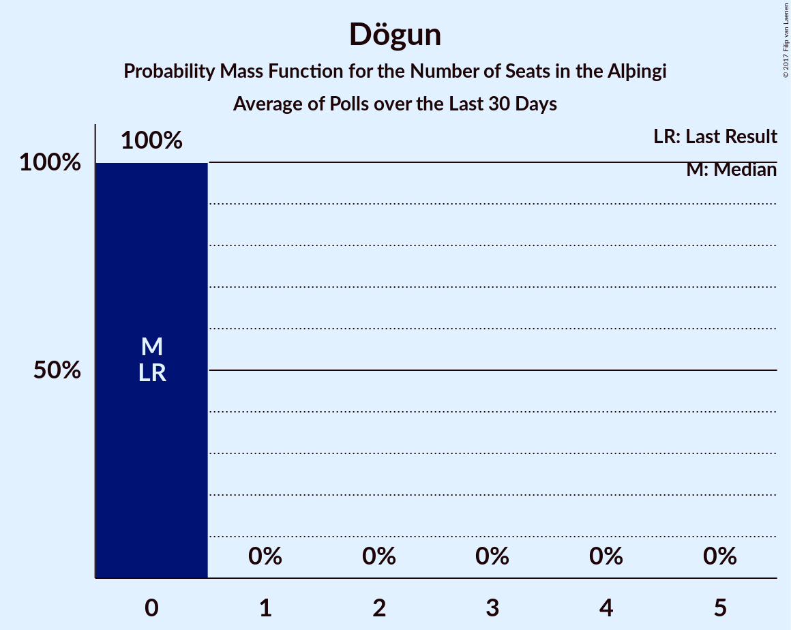
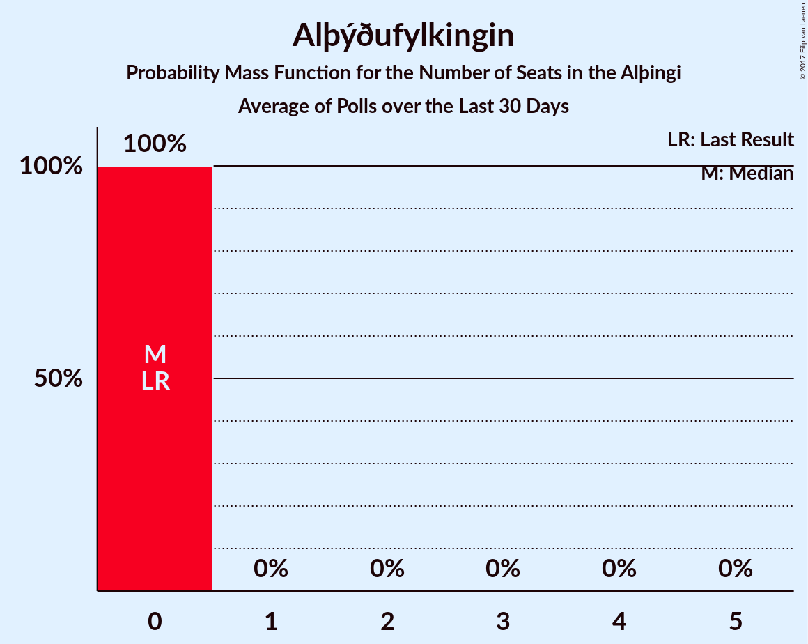

# Poll Average

<a href="#voting-intentions">Voting Intentions</a> | <a href="#seats">Seats</a> | <a href="#coalitions">Coalitions</a> | <a href="#technical-information">Technical Information</a>

## Summary

The table below lists the polls on which the average is based. They are the most recent polls (less than 30 days old) registered and analyzed so far.

| Period     | Polling firm/Commissioner(s) | D | V | P | B | C | A | S | F | T | R | E | M |
|:----------:|:----------------------------:|:--:|:--:|:--:|:--:|:--:|:--:|:--:|:--:|:--:|:--:|:--:|:--:|
| 29 October 2016 | General Election | 29.0%   21 | 15.9%   10 | 14.5%   10 | 11.5%   8 | 10.5%   7 | 7.2%   4 | 5.7%   3 | 3.5%   0 | 1.7%   0 | 0.3%   0 | 0.2%   0 | 0.0%   0 |
| N/A | Poll Average | 20–27%   15–18 | 15–21%   11–15 | 8–12%   5–7 | 6–13%   3–8 | 7–10%   4–6 | 1–3%   0 | 11–17%   7–12 | 3–6%   0–3 | 0%   0 | 0–1%   0 | N/A   N/A | 8–13%   5–8 |
| [26–27 October 2017](2017-10-27-MMR.html) | MMR | 19–24%   16 | 14–19%   12 | 9–13%   7 | 10–14%   8 | 7–10%   5 | 1–3%   0 | 11–15%   7 | 3–6%   0 | N/A   N/A | N/A   N/A | N/A   N/A | 10–14%   8 |
| [23–27 October 2017](2017-10-27-Gallup.html) | Gallup | 23–27%   16–18 | 16–19%   11–13 | 8–10%   5–7 | 8–10%   4–8 | 7–9%   4–7 | 1–2%   0 | 14–17%   9–12 | 3–5%   0 | 0%   0 | 0–1%   0 | N/A   N/A | 8–11%   6–8 |
| [22–25 October 2017](2017-10-25-Felagsvisindastofnun.html) | Félagsvísindastofnun   Morgunblaðið | 23–26%   15–18 | 19–22%   12–16 | 8–10%   5–6 | 7–9%   4–6 | 7–9%   4–6 | 1–2%   0 | 14–17%   9–12 | 3–5%   0–3 | N/A   N/A | N/A   N/A | N/A   N/A | 8–11%   5–7 |
| [23–24 October 2017](2017-10-24-Frettabladid.html) | Fréttablaðið | 22–26%   15–19 | 17–21%   12–16 | 8–11%   5–8 | 5–7%   3–5 | 6–9%   4–6 | 1–3%   0 | 13–16%   9–11 | 3–5%   0–3 | N/A   N/A | N/A   N/A | N/A   N/A | 8–11%   5–8 |
| 29 October 2016 | General Election | 29.0%   21 | 15.9%   10 | 14.5%   10 | 11.5%   8 | 10.5%   7 | 7.2%   4 | 5.7%   3 | 3.5%   0 | 1.7%   0 | 0.3%   0 | 0.2%   0 | 0.0%   0 |

Only polls for which at least the sample size has been published are included in the table above.

**Legend:**
+ **Top half of each row:** Voting intentions (95% confidence interval)
+ **Bottom half of each row:** Seat projections for the Alþingi (95% confidence interval)
+ **D:** Sjálfstæðisflokkurinn
+ **V:** Vinstrihreyfingin – grænt framboð
+ **P:** Píratar
+ **B:** Framsóknarflokkurinn
+ **C:** Viðreisn
+ **A:** Björt framtíð
+ **S:** Samfylkingin
+ **F:** Flokkur fólksins
+ **T:** Dögun
+ **R:** Alþýðufylkingin
+ **E:** Íslenska þjóðfylkingin
+ **M:** Miðflokkurinn
+ **N/A (single party):** Party not included the published results
+ **N/A (entire row):** Calculation for this opinion poll not started yet

## Voting Intentions

### Confidence Intervals

| Party | Last Result | Median | 80% Confidence Interval | 90% Confidence Interval | 95% Confidence Interval | 99% Confidence Interval |
|:-----:|:-----------:|:------:|:-----------------------:|:-----------------------:|:-----------------------:|:-----------------------:|
| <a href="#sjálfstæðisflokkurinn">Sjálfstæðisflokkurinn</a> | 29.0% | 24.2% | 21.0–25.8% |20.3–26.3% | 19.7–26.6% | 18.8–27.3% |
| <a href="#vinstrihreyfingin-–-grænt-framboð">Vinstrihreyfingin – grænt framboð</a> | 15.9% | 18.3% | 16.1–20.6% |15.6–21.0% | 15.2–21.4% | 14.3–22.0% |
| <a href="#píratar">Píratar</a> | 14.5% | 9.4% | 8.3–11.3% |8.1–11.9% | 7.9–12.4% | 7.5–13.2% |
| <a href="#framsóknarflokkurinn">Framsóknarflokkurinn</a> | 11.5% | 8.4% | 6.1–12.0% |5.7–12.7% | 5.5–13.1% | 5.1–14.0% |
| <a href="#viðreisn">Viðreisn</a> | 10.5% | 8.1% | 7.1–9.0% |6.8–9.3% | 6.6–9.5% | 6.1–10.1% |
| <a href="#björt-framtíð">Björt framtíð</a> | 7.2% | 1.7% | 1.2–2.5% |1.1–2.8% | 1.0–3.0% | 0.9–3.4% |
| <a href="#samfylkingin">Samfylkingin</a> | 5.7% | 14.7% | 12.2–16.1% |11.6–16.4% | 11.2–16.7% | 10.4–17.3% |
| <a href="#flokkur-fólksins">Flokkur fólksins</a> | 3.5% | 4.3% | 3.7–5.0% |3.5–5.3% | 3.3–5.5% | 3.1–6.0% |
| <a href="#dögun">Dögun</a> | 1.7% | 0.1% | 0.1–0.3% |0.0–0.3% | 0.0–0.3% | 0.0–0.4% |
| <a href="#alþýðufylkingin">Alþýðufylkingin</a> | 0.3% | 0.6% | 0.4–0.9% |0.4–1.0% | 0.4–1.0% | 0.3–1.2% |
| <a href="#Íslenska-þjóðfylkingin">Íslenska þjóðfylkingin</a> | 0.2% | N/A | N/A |N/A | N/A | N/A |
| <a href="#miðflokkurinn">Miðflokkurinn</a> | 0.0% | 9.8% | 8.8–11.8% |8.6–12.4% | 8.4–12.8% | 8.0–13.7% |

### Sjálfstæðisflokkurinn

*For a full overview of the results for this party, see the [Sjálfstæðisflokkurinn](party-sjlfstisflokkurinn.html) page.*

| Voting Intentions | Probability | Accumulated | Special Marks |
|:-----------------:|:-----------:|:-----------:|:-------------:|
| 16.5–17.5% | 0% | 100% |  |
| 17.5–18.5% | 0.3% | 100% |  |
| 18.5–19.5% | 2% | 99.7% |  |
| 19.5–20.5% | 5% | 98% |  |
| 20.5–21.5% | 8% | 93% |  |
| 21.5–22.5% | 8% | 86% |  |
| 22.5–23.5% | 13% | 78% |  |
| 23.5–24.5% | 24% | 65% | Median |
| 24.5–25.5% | 25% | 40% |  |
| 25.5–26.5% | 12% | 15% |  |
| 26.5–27.5% | 3% | 3% |  |
| 27.5–28.5% | 0.2% | 0.2% |  |
| 28.5–29.5% | 0% | 0% | Last Result |

### Vinstrihreyfingin – grænt framboð

*For a full overview of the results for this party, see the [Vinstrihreyfingin – grænt framboð](party-vinstrihreyfingingrntframbo.html) page.*

| Voting Intentions | Probability | Accumulated | Special Marks |
|:-----------------:|:-----------:|:-----------:|:-------------:|
| 12.5–13.5% | 0.1% | 100% |  |
| 13.5–14.5% | 0.7% | 99.9% |  |
| 14.5–15.5% | 4% | 99.2% |  |
| 15.5–16.5% | 11% | 96% | Last Result |
| 16.5–17.5% | 20% | 84% |  |
| 17.5–18.5% | 18% | 64% | Median |
| 18.5–19.5% | 17% | 47% |  |
| 19.5–20.5% | 18% | 29% |  |
| 20.5–21.5% | 9% | 11% |  |
| 21.5–22.5% | 2% | 2% |  |
| 22.5–23.5% | 0.1% | 0.1% |  |
| 23.5–24.5% | 0% | 0% |  |

### Píratar

*For a full overview of the results for this party, see the [Píratar](party-pratar.html) page.*

| Voting Intentions | Probability | Accumulated | Special Marks |
|:-----------------:|:-----------:|:-----------:|:-------------:|
| 5.5–6.5% | 0% | 100% |  |
| 6.5–7.5% | 0.5% | 100% |  |
| 7.5–8.5% | 16% | 99.5% |  |
| 8.5–9.5% | 41% | 84% | Median |
| 9.5–10.5% | 23% | 42% |  |
| 10.5–11.5% | 12% | 20% |  |
| 11.5–12.5% | 6% | 8% |  |
| 12.5–13.5% | 2% | 2% |  |
| 13.5–14.5% | 0.2% | 0.2% | Last Result |
| 14.5–15.5% | 0% | 0% |  |

### Framsóknarflokkurinn

*For a full overview of the results for this party, see the [Framsóknarflokkurinn](party-framsknarflokkurinn.html) page.*

| Voting Intentions | Probability | Accumulated | Special Marks |
|:-----------------:|:-----------:|:-----------:|:-------------:|
| 3.5–4.5% | 0% | 100% |  |
| 4.5–5.5% | 3% | 100% |  |
| 5.5–6.5% | 15% | 97% |  |
| 6.5–7.5% | 13% | 82% |  |
| 7.5–8.5% | 23% | 69% | Median |
| 8.5–9.5% | 18% | 46% |  |
| 9.5–10.5% | 6% | 28% |  |
| 10.5–11.5% | 8% | 22% | Last Result |
| 11.5–12.5% | 9% | 15% |  |
| 12.5–13.5% | 5% | 6% |  |
| 13.5–14.5% | 1.1% | 1.2% |  |
| 14.5–15.5% | 0.1% | 0.1% |  |
| 15.5–16.5% | 0% | 0% |  |

### Viðreisn

*For a full overview of the results for this party, see the [Viðreisn](party-vireisn.html) page.*

| Voting Intentions | Probability | Accumulated | Special Marks |
|:-----------------:|:-----------:|:-----------:|:-------------:|
| 4.5–5.5% | 0% | 100% |  |
| 5.5–6.5% | 2% | 100% |  |
| 6.5–7.5% | 22% | 98% |  |
| 7.5–8.5% | 51% | 76% | Median |
| 8.5–9.5% | 23% | 25% |  |
| 9.5–10.5% | 2% | 2% | Last Result |
| 10.5–11.5% | 0.1% | 0.1% |  |
| 11.5–12.5% | 0% | 0% |  |

### Björt framtíð

*For a full overview of the results for this party, see the [Björt framtíð](party-bjrtframt.html) page.*

| Voting Intentions | Probability | Accumulated | Special Marks |
|:-----------------:|:-----------:|:-----------:|:-------------:|
| 0.0–0.5% | 0% | 100% |  |
| 0.5–1.5% | 37% | 100% |  |
| 1.5–2.5% | 54% | 63% | Median |
| 2.5–3.5% | 9% | 9% |  |
| 3.5–4.5% | 0.3% | 0.3% |  |
| 4.5–5.5% | 0% | 0% |  |
| 5.5–6.5% | 0% | 0% |  |
| 6.5–7.5% | 0% | 0% | Last Result |

### Samfylkingin

*For a full overview of the results for this party, see the [Samfylkingin](party-samfylkingin.html) page.*

| Voting Intentions | Probability | Accumulated | Special Marks |
|:-----------------:|:-----------:|:-----------:|:-------------:|
| 5.5–6.5% | 0% | 100% | Last Result |
| 6.5–7.5% | 0% | 100% |  |
| 7.5–8.5% | 0% | 100% |  |
| 8.5–9.5% | 0% | 100% |  |
| 9.5–10.5% | 0.6% | 100% |  |
| 10.5–11.5% | 4% | 99.4% |  |
| 11.5–12.5% | 9% | 96% |  |
| 12.5–13.5% | 12% | 87% |  |
| 13.5–14.5% | 20% | 74% |  |
| 14.5–15.5% | 31% | 54% | Median |
| 15.5–16.5% | 20% | 24% |  |
| 16.5–17.5% | 4% | 4% |  |
| 17.5–18.5% | 0.2% | 0.2% |  |
| 18.5–19.5% | 0% | 0% |  |

### Flokkur fólksins

*For a full overview of the results for this party, see the [Flokkur fólksins](party-flokkurflksins.html) page.*

| Voting Intentions | Probability | Accumulated | Special Marks |
|:-----------------:|:-----------:|:-----------:|:-------------:|
| 1.5–2.5% | 0% | 100% |  |
| 2.5–3.5% | 7% | 100% |  |
| 3.5–4.5% | 64% | 93% | Last Result, Median |
| 4.5–5.5% | 27% | 29% |  |
| 5.5–6.5% | 2% | 2% |  |
| 6.5–7.5% | 0.1% | 0.1% |  |
| 7.5–8.5% | 0% | 0% |  |

### Dögun

*For a full overview of the results for this party, see the [Dögun](party-dgun.html) page.*

| Voting Intentions | Probability | Accumulated | Special Marks |
|:-----------------:|:-----------:|:-----------:|:-------------:|
| 0.0–0.5% | 99.9% | 100% | Median |
| 0.5–1.5% | 0.1% | 0.1% |  |
| 1.5–2.5% | 0% | 0% | Last Result |

### Alþýðufylkingin

*For a full overview of the results for this party, see the [Alþýðufylkingin](party-alufylkingin.html) page.*

| Voting Intentions | Probability | Accumulated | Special Marks |
|:-----------------:|:-----------:|:-----------:|:-------------:|
| 0.0–0.5% | 28% | 100% | Last Result |
| 0.5–1.5% | 72% | 72% | Median |
| 1.5–2.5% | 0% | 0% |  |

### Miðflokkurinn

*For a full overview of the results for this party, see the [Miðflokkurinn](party-miflokkurinn.html) page.*

| Voting Intentions | Probability | Accumulated | Special Marks |
|:-----------------:|:-----------:|:-----------:|:-------------:|
| 0.0–0.5% | 0% | 100% | Last Result |
| 0.5–1.5% | 0% | 100% |  |
| 1.5–2.5% | 0% | 100% |  |
| 2.5–3.5% | 0% | 100% |  |
| 3.5–4.5% | 0% | 100% |  |
| 4.5–5.5% | 0% | 100% |  |
| 5.5–6.5% | 0% | 100% |  |
| 6.5–7.5% | 0.1% | 100% |  |
| 7.5–8.5% | 5% | 99.9% |  |
| 8.5–9.5% | 34% | 95% |  |
| 9.5–10.5% | 35% | 61% | Median |
| 10.5–11.5% | 15% | 27% |  |
| 11.5–12.5% | 8% | 12% |  |
| 12.5–13.5% | 3% | 4% |  |
| 13.5–14.5% | 0.6% | 0.7% |  |
| 14.5–15.5% | 0.1% | 0.1% |  |
| 15.5–16.5% | 0% | 0% |  |

## Seats

### Confidence Intervals

| Party | Last Result | Median | 80% Confidence Interval | 90% Confidence Interval | 95% Confidence Interval | 99% Confidence Interval |
|:-----:|:-----------:|:------:|:-----------------------:|:-----------------------:|:-----------------------:|:-----------------------:|
| <a href="#sjálfstæðisflokkurinn">Sjálfstæðisflokkurinn</a> | 21 | 17 | 16–18 |16–18 | 15–18 | 15–19 |
| <a href="#vinstrihreyfingin-–-grænt-framboð">Vinstrihreyfingin – grænt framboð</a> | 10 | 13 | 12–14 |11–15 | 11–15 | 11–16 |
| <a href="#píratar">Píratar</a> | 10 | 6 | 5–7 |5–7 | 5–7 | 5–8 |
| <a href="#framsóknarflokkurinn">Framsóknarflokkurinn</a> | 8 | 5 | 4–8 |4–8 | 3–8 | 3–8 |
| <a href="#viðreisn">Viðreisn</a> | 7 | 5 | 4–6 |4–6 | 4–6 | 4–7 |
| <a href="#björt-framtíð">Björt framtíð</a> | 4 | 0 | 0 |0 | 0 | 0 |
| <a href="#samfylkingin">Samfylkingin</a> | 3 | 10 | 7–11 |7–11 | 7–12 | 7–13 |
| <a href="#flokkur-fólksins">Flokkur fólksins</a> | 0 | 0 | 0 |0 | 0–3 | 0–3 |
| <a href="#dögun">Dögun</a> | 0 | 0 | 0 |0 | 0 | 0 |
| <a href="#alþýðufylkingin">Alþýðufylkingin</a> | 0 | 0 | 0 |0 | 0 | 0 |
| <a href="#Íslenska-þjóðfylkingin">Íslenska þjóðfylkingin</a> | 0 | N/A | N/A |N/A | N/A | N/A |
| <a href="#miðflokkurinn">Miðflokkurinn</a> | 0 | 7 | 6–8 |5–8 | 5–8 | 5–8 |

### Sjálfstæðisflokkurinn

*For a full overview of the results for this party, see the [Sjálfstæðisflokkurinn](party-sjlfstisflokkurinn.html) page.*

| Number of Seats | Probability | Accumulated | Special Marks |
|:---------------:|:-----------:|:-----------:|:-------------:|
| 14 | 0.4% | 100% |  |
| 15 | 3% | 99.6% |  |
| 16 | 37% | 96% |  |
| 17 | 27% | 59% | Median |
| 18 | 30% | 32% |  |
| 19 | 2% | 2% |  |
| 20 | 0.1% | 0.1% |  |
| 21 | 0% | 0% | Last Result |

### Vinstrihreyfingin – grænt framboð

*For a full overview of the results for this party, see the [Vinstrihreyfingin – grænt framboð](party-vinstrihreyfingingrntframbo.html) page.*

| Number of Seats | Probability | Accumulated | Special Marks |
|:---------------:|:-----------:|:-----------:|:-------------:|
| 10 | 0.1% | 100% | Last Result |
| 11 | 6% | 99.9% |  |
| 12 | 38% | 94% |  |
| 13 | 24% | 56% | Median |
| 14 | 25% | 32% |  |
| 15 | 5% | 7% |  |
| 16 | 2% | 2% |  |
| 17 | 0% | 0% |  |

### Píratar

*For a full overview of the results for this party, see the [Píratar](party-pratar.html) page.*

| Number of Seats | Probability | Accumulated | Special Marks |
|:---------------:|:-----------:|:-----------:|:-------------:|
| 4 | 0.1% | 100% |  |
| 5 | 18% | 99.9% |  |
| 6 | 46% | 81% | Median |
| 7 | 35% | 36% |  |
| 8 | 0.7% | 0.9% |  |
| 9 | 0.2% | 0.2% |  |
| 10 | 0% | 0% | Last Result |

### Framsóknarflokkurinn

*For a full overview of the results for this party, see the [Framsóknarflokkurinn](party-framsknarflokkurinn.html) page.*

| Number of Seats | Probability | Accumulated | Special Marks |
|:---------------:|:-----------:|:-----------:|:-------------:|
| 2 | 0.1% | 100% |  |
| 3 | 3% | 99.9% |  |
| 4 | 23% | 97% |  |
| 5 | 41% | 74% | Median |
| 6 | 4% | 32% |  |
| 7 | 0.1% | 29% |  |
| 8 | 28% | 29% | Last Result |
| 9 | 0% | 0.1% |  |
| 10 | 0% | 0.1% |  |
| 11 | 0% | 0.1% |  |
| 12 | 0.1% | 0.1% |  |
| 13 | 0% | 0% |  |

### Viðreisn

*For a full overview of the results for this party, see the [Viðreisn](party-vireisn.html) page.*

| Number of Seats | Probability | Accumulated | Special Marks |
|:---------------:|:-----------:|:-----------:|:-------------:|
| 4 | 10% | 100% |  |
| 5 | 70% | 90% | Median |
| 6 | 19% | 20% |  |
| 7 | 1.2% | 1.2% | Last Result |
| 8 | 0% | 0% |  |

### Björt framtíð

*For a full overview of the results for this party, see the [Björt framtíð](party-bjrtframt.html) page.*

| Number of Seats | Probability | Accumulated | Special Marks |
|:---------------:|:-----------:|:-----------:|:-------------:|
| 0 | 100% | 100% | Median |
| 1 | 0% | 0% |  |
| 2 | 0% | 0% |  |
| 3 | 0% | 0% |  |
| 4 | 0% | 0% | Last Result |

### Samfylkingin

*For a full overview of the results for this party, see the [Samfylkingin](party-samfylkingin.html) page.*

| Number of Seats | Probability | Accumulated | Special Marks |
|:---------------:|:-----------:|:-----------:|:-------------:|
| 3 | 0% | 100% | Last Result |
| 4 | 0% | 100% |  |
| 5 | 0% | 100% |  |
| 6 | 0% | 100% |  |
| 7 | 25% | 100% |  |
| 8 | 0.8% | 75% |  |
| 9 | 19% | 74% |  |
| 10 | 22% | 55% | Median |
| 11 | 30% | 33% |  |
| 12 | 3% | 3% |  |
| 13 | 0.5% | 0.5% |  |
| 14 | 0% | 0% |  |

### Flokkur fólksins

*For a full overview of the results for this party, see the [Flokkur fólksins](party-flokkurflksins.html) page.*

| Number of Seats | Probability | Accumulated | Special Marks |
|:---------------:|:-----------:|:-----------:|:-------------:|
| 0 | 96% | 100% | Last Result, Median |
| 1 | 0% | 4% |  |
| 2 | 0% | 4% |  |
| 3 | 4% | 4% |  |
| 4 | 0.2% | 0.2% |  |
| 5 | 0% | 0% |  |

### Dögun

*For a full overview of the results for this party, see the [Dögun](party-dgun.html) page.*

| Number of Seats | Probability | Accumulated | Special Marks |
|:---------------:|:-----------:|:-----------:|:-------------:|
| 0 | 100% | 100% | Last Result, Median |

### Alþýðufylkingin

*For a full overview of the results for this party, see the [Alþýðufylkingin](party-alufylkingin.html) page.*

| Number of Seats | Probability | Accumulated | Special Marks |
|:---------------:|:-----------:|:-----------:|:-------------:|
| 0 | 100% | 100% | Last Result, Median |

### Miðflokkurinn

*For a full overview of the results for this party, see the [Miðflokkurinn](party-miflokkurinn.html) page.*

| Number of Seats | Probability | Accumulated | Special Marks |
|:---------------:|:-----------:|:-----------:|:-------------:|
| 0 | 0% | 100% | Last Result |
| 1 | 0% | 100% |  |
| 2 | 0% | 100% |  |
| 3 | 0% | 100% |  |
| 4 | 0.1% | 100% |  |
| 5 | 6% | 99.9% |  |
| 6 | 39% | 94% |  |
| 7 | 27% | 55% | Median |
| 8 | 27% | 28% |  |
| 9 | 0% | 0.1% |  |
| 10 | 0.1% | 0.1% |  |
| 11 | 0% | 0% |  |

## Coalitions

### Confidence Intervals

| Coalition | Last Result | Median | Majority? | 80% Confidence Interval | 90% Confidence Interval | 95% Confidence Interval | 99% Confidence Interval |
|:---------:|:-----------:|:------:|:---------:|:-----------------------:|:-----------------------:|:-----------------------:|:-----------------------:|
| Vinstrihreyfingin – grænt framboð – Framsóknarflokkurinn – Samfylkingin – Miðflokkurinn | 21 | 35 | 99.2% | 33–36 | 33–36 | 32–37 | 31–37 |
| Vinstrihreyfingin – grænt framboð – Píratar – Viðreisn – Björt framtíð – Samfylkingin | 34 | 34 | 72% | 31–36 | 31–36 | 31–37 | 31–37 |
| Vinstrihreyfingin – grænt framboð – Píratar – Viðreisn – Samfylkingin | 30 | 34 | 72% | 31–36 | 31–36 | 31–37 | 31–37 |
| Sjálfstæðisflokkurinn – Vinstrihreyfingin – grænt framboð | 31 | 30 | 17% | 28–32 | 28–32 | 28–32 | 27–33 |
| Sjálfstæðisflokkurinn – Framsóknarflokkurinn – Miðflokkurinn | 29 | 29 | 28% | 27–32 | 26–32 | 26–32 | 25–32 |
| Vinstrihreyfingin – grænt framboð – Samfylkingin – Miðflokkurinn | 13 | 30 | 4% | 27–31 | 27–31 | 26–32 | 26–32 |
| Vinstrihreyfingin – grænt framboð – Píratar – Björt framtíð – Samfylkingin | 27 | 29 | 3% | 26–31 | 26–31 | 25–32 | 25–32 |
| Vinstrihreyfingin – grænt framboð – Píratar – Samfylkingin | 23 | 29 | 3% | 26–31 | 26–31 | 25–32 | 25–32 |
| Vinstrihreyfingin – grænt framboð – Framsóknarflokkurinn – Samfylkingin | 21 | 28 | 0.2% | 27–30 | 26–30 | 26–31 | 25–31 |
| Sjálfstæðisflokkurinn – Samfylkingin | 24 | 27 | 0% | 23–28 | 23–28 | 23–29 | 23–30 |
| Vinstrihreyfingin – grænt framboð – Framsóknarflokkurinn – Miðflokkurinn | 18 | 25 | 0% | 23–28 | 23–28 | 23–28 | 21–28 |
| Sjálfstæðisflokkurinn – Framsóknarflokkurinn | 29 | 22 | 0% | 21–24 | 20–24 | 20–26 | 19–26 |
| Vinstrihreyfingin – grænt framboð – Samfylkingin | 13 | 23 | 0% | 19–25 | 19–25 | 19–26 | 19–26 |
| Sjálfstæðisflokkurinn – Miðflokkurinn | 21 | 24 | 0% | 22–25 | 22–25 | 21–25 | 20–26 |
| Sjálfstæðisflokkurinn – Viðreisn – Björt framtíð | 32 | 22 | 0% | 21–24 | 21–24 | 20–24 | 19–24 |
| Sjálfstæðisflokkurinn – Viðreisn | 28 | 22 | 0% | 21–24 | 21–24 | 20–24 | 19–24 |
| Vinstrihreyfingin – grænt framboð – Miðflokkurinn | 10 | 20 | 0% | 19–21 | 18–21 | 17–22 | 16–22 |
| Vinstrihreyfingin – grænt framboð – Píratar | 20 | 19 | 0% | 18–20 | 17–21 | 16–21 | 16–22 |
| Vinstrihreyfingin – grænt framboð – Framsóknarflokkurinn | 18 | 19 | 0% | 17–20 | 17–20 | 16–20 | 15–21 |
| Sjálfstæðisflokkurinn – Björt framtíð | 25 | 17 | 0% | 16–18 | 16–18 | 15–18 | 15–19 |

### Vinstrihreyfingin – grænt framboð – Framsóknarflokkurinn – Samfylkingin – Miðflokkurinn

| Number of Seats | Probability | Accumulated | Special Marks |
|:---------------:|:-----------:|:-----------:|:-------------:|
| 21 | 0% | 100% | Last Result |
| 22 | 0% | 100% |  |
| 23 | 0% | 100% |  |
| 24 | 0% | 100% |  |
| 25 | 0% | 100% |  |
| 26 | 0% | 100% |  |
| 27 | 0% | 100% |  |
| 28 | 0% | 100% |  |
| 29 | 0% | 100% |  |
| 30 | 0.1% | 100% |  |
| 31 | 0.7% | 99.9% |  |
| 32 | 2% | 99.2% | Majority |
| 33 | 9% | 97% |  |
| 34 | 21% | 88% |  |
| 35 | 53% | 67% | Median |
| 36 | 11% | 14% |  |
| 37 | 3% | 3% |  |
| 38 | 0.2% | 0.2% |  |
| 39 | 0% | 0% |  |

### Vinstrihreyfingin – grænt framboð – Píratar – Viðreisn – Björt framtíð – Samfylkingin

| Number of Seats | Probability | Accumulated | Special Marks |
|:---------------:|:-----------:|:-----------:|:-------------:|
| 28 | 0.1% | 100% |  |
| 29 | 0.1% | 99.9% |  |
| 30 | 0.1% | 99.9% |  |
| 31 | 28% | 99.8% |  |
| 32 | 2% | 72% | Majority |
| 33 | 9% | 70% |  |
| 34 | 24% | 61% | Last Result, Median |
| 35 | 20% | 37% |  |
| 36 | 13% | 17% |  |
| 37 | 4% | 4% |  |
| 38 | 0.5% | 0.5% |  |
| 39 | 0% | 0% |  |

### Vinstrihreyfingin – grænt framboð – Píratar – Viðreisn – Samfylkingin

| Number of Seats | Probability | Accumulated | Special Marks |
|:---------------:|:-----------:|:-----------:|:-------------:|
| 28 | 0.1% | 100% |  |
| 29 | 0.1% | 99.9% |  |
| 30 | 0.1% | 99.9% | Last Result |
| 31 | 28% | 99.8% |  |
| 32 | 2% | 72% | Majority |
| 33 | 9% | 70% |  |
| 34 | 24% | 61% | Median |
| 35 | 20% | 37% |  |
| 36 | 13% | 17% |  |
| 37 | 4% | 4% |  |
| 38 | 0.5% | 0.5% |  |
| 39 | 0% | 0% |  |

### Sjálfstæðisflokkurinn – Vinstrihreyfingin – grænt framboð

| Number of Seats | Probability | Accumulated | Special Marks |
|:---------------:|:-----------:|:-----------:|:-------------:|
| 25 | 0.2% | 100% |  |
| 26 | 0.1% | 99.8% |  |
| 27 | 1.0% | 99.7% |  |
| 28 | 27% | 98.7% |  |
| 29 | 18% | 72% |  |
| 30 | 16% | 53% | Median |
| 31 | 21% | 38% | Last Result |
| 32 | 15% | 17% | Majority |
| 33 | 2% | 2% |  |
| 34 | 0.1% | 0.1% |  |
| 35 | 0% | 0% |  |

### Sjálfstæðisflokkurinn – Framsóknarflokkurinn – Miðflokkurinn

| Number of Seats | Probability | Accumulated | Special Marks |
|:---------------:|:-----------:|:-----------:|:-------------:|
| 24 | 0.3% | 100% |  |
| 25 | 1.0% | 99.7% |  |
| 26 | 5% | 98.7% |  |
| 27 | 14% | 94% |  |
| 28 | 20% | 80% |  |
| 29 | 23% | 60% | Last Result, Median |
| 30 | 7% | 37% |  |
| 31 | 1.4% | 29% |  |
| 32 | 28% | 28% | Majority |
| 33 | 0% | 0% |  |

### Vinstrihreyfingin – grænt framboð – Samfylkingin – Miðflokkurinn

| Number of Seats | Probability | Accumulated | Special Marks |
|:---------------:|:-----------:|:-----------:|:-------------:|
| 13 | 0% | 100% | Last Result |
| 14 | 0% | 100% |  |
| 15 | 0% | 100% |  |
| 16 | 0% | 100% |  |
| 17 | 0% | 100% |  |
| 18 | 0% | 100% |  |
| 19 | 0% | 100% |  |
| 20 | 0% | 100% |  |
| 21 | 0% | 100% |  |
| 22 | 0% | 100% |  |
| 23 | 0% | 100% |  |
| 24 | 0.1% | 100% |  |
| 25 | 0.1% | 99.9% |  |
| 26 | 3% | 99.9% |  |
| 27 | 26% | 97% |  |
| 28 | 4% | 71% |  |
| 29 | 16% | 66% |  |
| 30 | 30% | 50% | Median |
| 31 | 16% | 20% |  |
| 32 | 4% | 4% | Majority |
| 33 | 0.4% | 0.4% |  |
| 34 | 0% | 0% |  |

### Vinstrihreyfingin – grænt framboð – Píratar – Björt framtíð – Samfylkingin

| Number of Seats | Probability | Accumulated | Special Marks |
|:---------------:|:-----------:|:-----------:|:-------------:|
| 24 | 0.1% | 100% |  |
| 25 | 3% | 99.9% |  |
| 26 | 25% | 97% |  |
| 27 | 2% | 72% | Last Result |
| 28 | 8% | 70% |  |
| 29 | 31% | 62% | Median |
| 30 | 17% | 31% |  |
| 31 | 12% | 15% |  |
| 32 | 2% | 3% | Majority |
| 33 | 0.3% | 0.3% |  |
| 34 | 0% | 0% |  |

### Vinstrihreyfingin – grænt framboð – Píratar – Samfylkingin

| Number of Seats | Probability | Accumulated | Special Marks |
|:---------------:|:-----------:|:-----------:|:-------------:|
| 23 | 0% | 100% | Last Result |
| 24 | 0.1% | 100% |  |
| 25 | 3% | 99.9% |  |
| 26 | 25% | 97% |  |
| 27 | 2% | 72% |  |
| 28 | 8% | 70% |  |
| 29 | 31% | 62% | Median |
| 30 | 17% | 31% |  |
| 31 | 12% | 15% |  |
| 32 | 2% | 3% | Majority |
| 33 | 0.3% | 0.3% |  |
| 34 | 0% | 0% |  |

### Vinstrihreyfingin – grænt framboð – Framsóknarflokkurinn – Samfylkingin

| Number of Seats | Probability | Accumulated | Special Marks |
|:---------------:|:-----------:|:-----------:|:-------------:|
| 21 | 0% | 100% | Last Result |
| 22 | 0% | 100% |  |
| 23 | 0% | 100% |  |
| 24 | 0.1% | 100% |  |
| 25 | 1.0% | 99.8% |  |
| 26 | 6% | 98.9% |  |
| 27 | 35% | 93% |  |
| 28 | 33% | 58% | Median |
| 29 | 13% | 26% |  |
| 30 | 10% | 13% |  |
| 31 | 3% | 3% |  |
| 32 | 0.2% | 0.2% | Majority |
| 33 | 0% | 0% |  |

### Sjálfstæðisflokkurinn – Samfylkingin

| Number of Seats | Probability | Accumulated | Special Marks |
|:---------------:|:-----------:|:-----------:|:-------------:|
| 21 | 0.2% | 100% |  |
| 22 | 0% | 99.8% |  |
| 23 | 25% | 99.8% |  |
| 24 | 0.3% | 75% | Last Result |
| 25 | 2% | 75% |  |
| 26 | 7% | 73% |  |
| 27 | 28% | 66% | Median |
| 28 | 34% | 38% |  |
| 29 | 3% | 4% |  |
| 30 | 0.6% | 0.8% |  |
| 31 | 0.2% | 0.2% |  |
| 32 | 0% | 0% | Majority |

### Vinstrihreyfingin – grænt framboð – Framsóknarflokkurinn – Miðflokkurinn

| Number of Seats | Probability | Accumulated | Special Marks |
|:---------------:|:-----------:|:-----------:|:-------------:|
| 18 | 0% | 100% | Last Result |
| 19 | 0% | 100% |  |
| 20 | 0% | 100% |  |
| 21 | 0.8% | 100% |  |
| 22 | 2% | 99.2% |  |
| 23 | 9% | 98% |  |
| 24 | 29% | 89% |  |
| 25 | 30% | 60% | Median |
| 26 | 4% | 31% |  |
| 27 | 1.1% | 26% |  |
| 28 | 25% | 25% |  |
| 29 | 0.2% | 0.2% |  |
| 30 | 0% | 0% |  |

### Sjálfstæðisflokkurinn – Framsóknarflokkurinn

| Number of Seats | Probability | Accumulated | Special Marks |
|:---------------:|:-----------:|:-----------:|:-------------:|
| 18 | 0.3% | 100% |  |
| 19 | 1.3% | 99.7% |  |
| 20 | 6% | 98% |  |
| 21 | 16% | 92% |  |
| 22 | 29% | 76% | Median |
| 23 | 16% | 47% |  |
| 24 | 28% | 31% |  |
| 25 | 0.2% | 3% |  |
| 26 | 3% | 3% |  |
| 27 | 0% | 0% |  |
| 28 | 0% | 0% |  |
| 29 | 0% | 0% | Last Result |

### Vinstrihreyfingin – grænt framboð – Samfylkingin

| Number of Seats | Probability | Accumulated | Special Marks |
|:---------------:|:-----------:|:-----------:|:-------------:|
| 13 | 0% | 100% | Last Result |
| 14 | 0% | 100% |  |
| 15 | 0% | 100% |  |
| 16 | 0% | 100% |  |
| 17 | 0% | 100% |  |
| 18 | 0.2% | 100% |  |
| 19 | 25% | 99.8% |  |
| 20 | 4% | 75% |  |
| 21 | 1.1% | 71% |  |
| 22 | 6% | 70% |  |
| 23 | 31% | 64% | Median |
| 24 | 18% | 33% |  |
| 25 | 13% | 16% |  |
| 26 | 3% | 3% |  |
| 27 | 0.2% | 0.2% |  |
| 28 | 0% | 0% |  |

### Sjálfstæðisflokkurinn – Miðflokkurinn

| Number of Seats | Probability | Accumulated | Special Marks |
|:---------------:|:-----------:|:-----------:|:-------------:|
| 20 | 0.5% | 100% |  |
| 21 | 3% | 99.4% | Last Result |
| 22 | 10% | 96% |  |
| 23 | 18% | 86% |  |
| 24 | 54% | 69% | Median |
| 25 | 13% | 14% |  |
| 26 | 1.0% | 1.0% |  |
| 27 | 0.1% | 0.1% |  |
| 28 | 0% | 0% |  |

### Sjálfstæðisflokkurinn – Viðreisn – Björt framtíð

| Number of Seats | Probability | Accumulated | Special Marks |
|:---------------:|:-----------:|:-----------:|:-------------:|
| 18 | 0.3% | 100% |  |
| 19 | 0.2% | 99.7% |  |
| 20 | 2% | 99.5% |  |
| 21 | 37% | 97% |  |
| 22 | 28% | 60% | Median |
| 23 | 22% | 32% |  |
| 24 | 10% | 11% |  |
| 25 | 0.2% | 0.2% |  |
| 26 | 0% | 0% |  |
| 27 | 0% | 0% |  |
| 28 | 0% | 0% |  |
| 29 | 0% | 0% |  |
| 30 | 0% | 0% |  |
| 31 | 0% | 0% |  |
| 32 | 0% | 0% | Last Result, Majority |

### Sjálfstæðisflokkurinn – Viðreisn

| Number of Seats | Probability | Accumulated | Special Marks |
|:---------------:|:-----------:|:-----------:|:-------------:|
| 18 | 0.3% | 100% |  |
| 19 | 0.2% | 99.7% |  |
| 20 | 2% | 99.5% |  |
| 21 | 37% | 97% |  |
| 22 | 28% | 60% | Median |
| 23 | 22% | 32% |  |
| 24 | 10% | 11% |  |
| 25 | 0.2% | 0.2% |  |
| 26 | 0% | 0% |  |
| 27 | 0% | 0% |  |
| 28 | 0% | 0% | Last Result |

### Vinstrihreyfingin – grænt framboð – Miðflokkurinn

| Number of Seats | Probability | Accumulated | Special Marks |
|:---------------:|:-----------:|:-----------:|:-------------:|
| 10 | 0% | 100% | Last Result |
| 11 | 0% | 100% |  |
| 12 | 0% | 100% |  |
| 13 | 0% | 100% |  |
| 14 | 0% | 100% |  |
| 15 | 0.1% | 100% |  |
| 16 | 0.5% | 99.9% |  |
| 17 | 4% | 99.4% |  |
| 18 | 5% | 95% |  |
| 19 | 23% | 91% |  |
| 20 | 55% | 67% | Median |
| 21 | 9% | 12% |  |
| 22 | 2% | 3% |  |
| 23 | 0.4% | 0.4% |  |
| 24 | 0% | 0% |  |

### Vinstrihreyfingin – grænt framboð – Píratar

| Number of Seats | Probability | Accumulated | Special Marks |
|:---------------:|:-----------:|:-----------:|:-------------:|
| 16 | 4% | 100% |  |
| 17 | 2% | 96% |  |
| 18 | 17% | 94% |  |
| 19 | 46% | 77% | Median |
| 20 | 21% | 30% | Last Result |
| 21 | 8% | 10% |  |
| 22 | 2% | 2% |  |
| 23 | 0.2% | 0.2% |  |
| 24 | 0% | 0% |  |

### Vinstrihreyfingin – grænt framboð – Framsóknarflokkurinn

| Number of Seats | Probability | Accumulated | Special Marks |
|:---------------:|:-----------:|:-----------:|:-------------:|
| 15 | 0.5% | 100% |  |
| 16 | 4% | 99.5% |  |
| 17 | 22% | 96% |  |
| 18 | 23% | 74% | Last Result, Median |
| 19 | 20% | 50% |  |
| 20 | 29% | 30% |  |
| 21 | 1.2% | 1.3% |  |
| 22 | 0.1% | 0.2% |  |
| 23 | 0.1% | 0.1% |  |
| 24 | 0% | 0% |  |

### Sjálfstæðisflokkurinn – Björt framtíð

| Number of Seats | Probability | Accumulated | Special Marks |
|:---------------:|:-----------:|:-----------:|:-------------:|
| 14 | 0.4% | 100% |  |
| 15 | 3% | 99.6% |  |
| 16 | 37% | 96% |  |
| 17 | 27% | 59% | Median |
| 18 | 30% | 32% |  |
| 19 | 2% | 2% |  |
| 20 | 0.1% | 0.1% |  |
| 21 | 0% | 0% |  |
| 22 | 0% | 0% |  |
| 23 | 0% | 0% |  |
| 24 | 0% | 0% |  |
| 25 | 0% | 0% | Last Result |

## Technical Information

