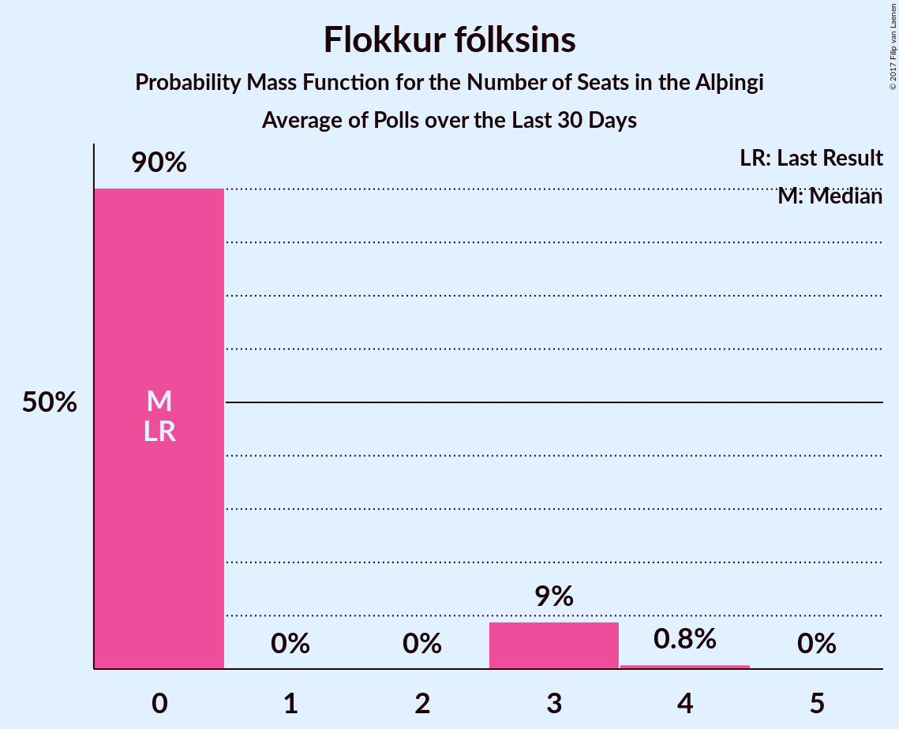

# Poll Average

<a href="#voting-intentions">Voting Intentions</a> | <a href="#seats">Seats</a> | <a href="#coalitions">Coalitions</a> | <a href="#technical-information">Technical Information</a>

## Summary

The table below lists the polls on which the average is based. They are the most recent polls (less than 30 days old) registered and analyzed so far.

| Period     | Polling firm/Commissioner(s) | D | V | P | B | C | A | S | F | T | R | E | M |
|:----------:|:----------------------------:|:--:|:--:|:--:|:--:|:--:|:--:|:--:|:--:|:--:|:--:|:--:|:--:|
| 29 October 2016 | General Election | 29.0%   21 | 15.9%   10 | 14.5%   10 | 11.5%   8 | 10.5%   7 | 7.2%   4 | 5.7%   3 | 3.5%   0 | 1.7%   0 | 0.3%   0 | 0.2%   0 | 0.0%   0 |
| N/A | Poll Average | 18–26%   12–18 | 18–29%   12–21 | 8–13%   4–9 | 6–10%   4–7 | 4–8%   0–5 | 1–3%   0 | 9–17%   6–12 | 3–7%   0–4 | 0%   0 | 0%   0 | N/A   N/A | 8–14%   5–10 |
| [20–23 October 2017](2017-10-23-MMR.html) |  | 20–26%   14–18 | 18–23%   12–16 | 8–11%   5–8 | 7–11%   4–7 | 4–7%   0–4 | 1–3%   0 | 11–16%   7–11 | 4–6%   0–4 | N/A   N/A | N/A   N/A | N/A   N/A | 10–15%   7–11 |
| [13–19 October 2017](2017-10-19-Gallup.html) | Gallup | 21–25%   13–17 | 21–25%   15–18 | 9–12%   6–8 | 6–9%   4–5 | 5–7%   0–4 | 1–2%   0 | 12–15%   7–10 | 5–7%   0–4 | N/A   N/A | N/A   N/A | N/A   N/A | 8–11%   5–7 |
| [16–19 October 2017](2017-10-19-Felagsvisindastofnun.html) | Félagsvísindastofnun   Morgunblaðið | 23–27%   16–18 | 21–25%   15–17 | 7–9%   4–6 | 6–8%   4–5 | 5–7%   0–4 | 1–2%   0 | 14–17%   10–12 | 3–4%   0 | 0–1%   0 | 0%   0 | N/A   N/A | 9–11%   5–7 |
| [17–18 October 2017](2017-10-18-MMR.html) | MMR | 18–22%   12–15 | 17–22%   11–15 | 10–14%   6–9 | 6–10%   4–6 | 5–8%   3–5 | 1–3%   0 | 14–18%   9–12 | 4–7%   0–4 | N/A   N/A | N/A   N/A | N/A   N/A | 9–13%   6–9 |
| [16 October 2017](2017-10-16-Frettabladid.html) | Fréttablaðið | 19–25%   13–18 | 24–30%   17–22 | 8–12%   5–8 | 6–9%   4–6 | 4–7%   0–4 | 1–3%   0 | 8–13%   6–9 | 3–5%   0–3 | N/A   N/A | N/A   N/A | N/A   N/A | 9–13%   5–9 |
| 29 October 2016 | General Election | 29.0%   21 | 15.9%   10 | 14.5%   10 | 11.5%   8 | 10.5%   7 | 7.2%   4 | 5.7%   3 | 3.5%   0 | 1.7%   0 | 0.3%   0 | 0.2%   0 | 0.0%   0 |

Only polls for which at least the sample size has been published are included in the table above.

**Legend:**
+ **Top half of each row:** Voting intentions (95% confidence interval)
+ **Bottom half of each row:** Seat projections for the Alþingi (95% confidence interval)
+ **D:** Sjálfstæðisflokkurinn
+ **V:** Vinstrihreyfingin – grænt framboð
+ **P:** Píratar
+ **B:** Framsóknarflokkurinn
+ **C:** Viðreisn
+ **A:** Björt framtíð
+ **S:** Samfylkingin
+ **F:** Flokkur fólksins
+ **T:** Dögun
+ **R:** Alþýðufylkingin
+ **E:** Íslenska þjóðfylkingin
+ **M:** Miðflokkurinn
+ **N/A (single party):** Party not included the published results
+ **N/A (entire row):** Calculation for this opinion poll not started yet

## Voting Intentions

### Confidence Intervals

| Party | Last Result | Median | 80% Confidence Interval | 90% Confidence Interval | 95% Confidence Interval | 99% Confidence Interval |
|:-----:|:-----------:|:------:|:-----------------------:|:-----------------------:|:-----------------------:|:-----------------------:|
| <a href="#sjálfstæðisflokkurinn">Sjálfstæðisflokkurinn</a> | 29.0% | 22.7% | 19.8–25.3% |19.0–25.9% | 18.5–26.3% | 17.5–27.1% |
| <a href="#vinstrihreyfingin-–-grænt-framboð">Vinstrihreyfingin – grænt framboð</a> | 15.9% | 22.6% | 18.7–27.1% |18.1–28.1% | 17.6–28.9% | 16.7–30.2% |
| <a href="#píratar">Píratar</a> | 14.5% | 10.1% | 8.1–12.2% |7.7–12.7% | 7.5–13.2% | 7.0–14.1% |
| <a href="#framsóknarflokkurinn">Framsóknarflokkurinn</a> | 11.5% | 7.7% | 6.6–9.1% |6.4–9.5% | 6.2–9.9% | 5.7–10.6% |
| <a href="#viðreisn">Viðreisn</a> | 10.5% | 5.8% | 4.7–6.9% |4.4–7.3% | 4.1–7.7% | 3.7–8.4% |
| <a href="#björt-framtíð">Björt framtíð</a> | 7.2% | 1.7% | 1.1–2.4% |1.0–2.7% | 0.9–2.9% | 0.8–3.4% |
| <a href="#samfylkingin">Samfylkingin</a> | 5.7% | 14.0% | 10.5–16.4% |9.8–16.9% | 9.3–17.3% | 8.5–18.2% |
| <a href="#flokkur-fólksins">Flokkur fólksins</a> | 3.5% | 4.7% | 3.2–6.0% |2.9–6.3% | 2.8–6.6% | 2.5–7.1% |
| <a href="#dögun">Dögun</a> | 1.7% | 0.2% | 0.1–0.4% |0.1–0.5% | 0.1–0.5% | 0.1–0.6% |
| <a href="#alþýðufylkingin">Alþýðufylkingin</a> | 0.3% | 0.1% | 0.1–0.3% |0.0–0.3% | 0.0–0.4% | 0.0–0.5% |
| <a href="#Íslenska-þjóðfylkingin">Íslenska þjóðfylkingin</a> | 0.2% | N/A | N/A |N/A | N/A | N/A |
| <a href="#miðflokkurinn">Miðflokkurinn</a> | 0.0% | 10.5% | 9.1–12.7% |8.8–13.3% | 8.5–13.7% | 8.0–14.6% |

### Sjálfstæðisflokkurinn

*For a full overview of the results for this party, see the [Sjálfstæðisflokkurinn](party-sjlfstisflokkurinn.html) page.*

| Voting Intentions | Probability | Accumulated | Special Marks |
|:-----------------:|:-----------:|:-----------:|:-------------:|
| 15.5–16.5% | 0% | 100% |  |
| 16.5–17.5% | 0.5% | 100% |  |
| 17.5–18.5% | 2% | 99.5% |  |
| 18.5–19.5% | 6% | 97% |  |
| 19.5–20.5% | 9% | 92% |  |
| 20.5–21.5% | 13% | 83% |  |
| 21.5–22.5% | 18% | 70% |  |
| 22.5–23.5% | 18% | 52% | Median |
| 23.5–24.5% | 15% | 33% |  |
| 24.5–25.5% | 11% | 19% |  |
| 25.5–26.5% | 6% | 8% |  |
| 26.5–27.5% | 1.5% | 2% |  |
| 27.5–28.5% | 0.2% | 0.2% |  |
| 28.5–29.5% | 0% | 0% | Last Result |

### Vinstrihreyfingin – grænt framboð

*For a full overview of the results for this party, see the [Vinstrihreyfingin – grænt framboð](party-vinstrihreyfingingrntframbo.html) page.*

| Voting Intentions | Probability | Accumulated | Special Marks |
|:-----------------:|:-----------:|:-----------:|:-------------:|
| 14.5–15.5% | 0% | 100% |  |
| 15.5–16.5% | 0.3% | 100% | Last Result |
| 16.5–17.5% | 2% | 99.6% |  |
| 17.5–18.5% | 7% | 98% |  |
| 18.5–19.5% | 11% | 91% |  |
| 19.5–20.5% | 11% | 80% |  |
| 20.5–21.5% | 8% | 69% |  |
| 21.5–22.5% | 10% | 61% |  |
| 22.5–23.5% | 16% | 51% | Median |
| 23.5–24.5% | 12% | 35% |  |
| 24.5–25.5% | 6% | 23% |  |
| 25.5–26.5% | 5% | 17% |  |
| 26.5–27.5% | 5% | 13% |  |
| 27.5–28.5% | 4% | 8% |  |
| 28.5–29.5% | 2% | 4% |  |
| 29.5–30.5% | 0.9% | 1.2% |  |
| 30.5–31.5% | 0.3% | 0.3% |  |
| 31.5–32.5% | 0% | 0.1% |  |
| 32.5–33.5% | 0% | 0% |  |

### Píratar

*For a full overview of the results for this party, see the [Píratar](party-pratar.html) page.*

| Voting Intentions | Probability | Accumulated | Special Marks |
|:-----------------:|:-----------:|:-----------:|:-------------:|
| 5.5–6.5% | 0% | 100% |  |
| 6.5–7.5% | 3% | 100% |  |
| 7.5–8.5% | 16% | 97% |  |
| 8.5–9.5% | 19% | 81% |  |
| 9.5–10.5% | 22% | 62% | Median |
| 10.5–11.5% | 21% | 40% |  |
| 11.5–12.5% | 12% | 18% |  |
| 12.5–13.5% | 5% | 6% |  |
| 13.5–14.5% | 1.2% | 1.4% | Last Result |
| 14.5–15.5% | 0.2% | 0.2% |  |
| 15.5–16.5% | 0% | 0% |  |

### Framsóknarflokkurinn

*For a full overview of the results for this party, see the [Framsóknarflokkurinn](party-framsknarflokkurinn.html) page.*

| Voting Intentions | Probability | Accumulated | Special Marks |
|:-----------------:|:-----------:|:-----------:|:-------------:|
| 3.5–4.5% | 0% | 100% |  |
| 4.5–5.5% | 0.3% | 100% |  |
| 5.5–6.5% | 8% | 99.7% |  |
| 6.5–7.5% | 36% | 92% |  |
| 7.5–8.5% | 36% | 56% | Median |
| 8.5–9.5% | 16% | 20% |  |
| 9.5–10.5% | 4% | 4% |  |
| 10.5–11.5% | 0.5% | 0.5% | Last Result |
| 11.5–12.5% | 0% | 0% |  |

### Viðreisn

*For a full overview of the results for this party, see the [Viðreisn](party-vireisn.html) page.*

| Voting Intentions | Probability | Accumulated | Special Marks |
|:-----------------:|:-----------:|:-----------:|:-------------:|
| 1.5–2.5% | 0% | 100% |  |
| 2.5–3.5% | 0.3% | 100% |  |
| 3.5–4.5% | 7% | 99.7% |  |
| 4.5–5.5% | 31% | 93% |  |
| 5.5–6.5% | 43% | 62% | Median |
| 6.5–7.5% | 15% | 18% |  |
| 7.5–8.5% | 3% | 3% |  |
| 8.5–9.5% | 0.3% | 0.3% |  |
| 9.5–10.5% | 0% | 0% | Last Result |

### Björt framtíð

*For a full overview of the results for this party, see the [Björt framtíð](party-bjrtframt.html) page.*

| Voting Intentions | Probability | Accumulated | Special Marks |
|:-----------------:|:-----------:|:-----------:|:-------------:|
| 0.0–0.5% | 0% | 100% |  |
| 0.5–1.5% | 42% | 100% |  |
| 1.5–2.5% | 51% | 58% | Median |
| 2.5–3.5% | 7% | 7% |  |
| 3.5–4.5% | 0.3% | 0.3% |  |
| 4.5–5.5% | 0% | 0% |  |
| 5.5–6.5% | 0% | 0% |  |
| 6.5–7.5% | 0% | 0% | Last Result |

### Samfylkingin

*For a full overview of the results for this party, see the [Samfylkingin](party-samfylkingin.html) page.*

| Voting Intentions | Probability | Accumulated | Special Marks |
|:-----------------:|:-----------:|:-----------:|:-------------:|
| 5.5–6.5% | 0% | 100% | Last Result |
| 6.5–7.5% | 0% | 100% |  |
| 7.5–8.5% | 0.5% | 100% |  |
| 8.5–9.5% | 3% | 99.4% |  |
| 9.5–10.5% | 7% | 96% |  |
| 10.5–11.5% | 7% | 90% |  |
| 11.5–12.5% | 9% | 83% |  |
| 12.5–13.5% | 16% | 74% |  |
| 13.5–14.5% | 17% | 57% | Median |
| 14.5–15.5% | 17% | 41% |  |
| 15.5–16.5% | 16% | 24% |  |
| 16.5–17.5% | 7% | 8% |  |
| 17.5–18.5% | 2% | 2% |  |
| 18.5–19.5% | 0.2% | 0.2% |  |
| 19.5–20.5% | 0% | 0% |  |

### Flokkur fólksins

*For a full overview of the results for this party, see the [Flokkur fólksins](party-flokkurflksins.html) page.*

| Voting Intentions | Probability | Accumulated | Special Marks |
|:-----------------:|:-----------:|:-----------:|:-------------:|
| 0.5–1.5% | 0% | 100% |  |
| 1.5–2.5% | 0.7% | 100% |  |
| 2.5–3.5% | 21% | 99.3% |  |
| 3.5–4.5% | 26% | 78% | Last Result |
| 4.5–5.5% | 29% | 53% | Median |
| 5.5–6.5% | 20% | 23% |  |
| 6.5–7.5% | 3% | 3% |  |
| 7.5–8.5% | 0.1% | 0.1% |  |
| 8.5–9.5% | 0% | 0% |  |

### Dögun

*For a full overview of the results for this party, see the [Dögun](party-dgun.html) page.*

| Voting Intentions | Probability | Accumulated | Special Marks |
|:-----------------:|:-----------:|:-----------:|:-------------:|
| 0.0–0.5% | 98% | 100% | Median |
| 0.5–1.5% | 2% | 2% |  |
| 1.5–2.5% | 0% | 0% | Last Result |

### Alþýðufylkingin

*For a full overview of the results for this party, see the [Alþýðufylkingin](party-alufylkingin.html) page.*

| Voting Intentions | Probability | Accumulated | Special Marks |
|:-----------------:|:-----------:|:-----------:|:-------------:|
| 0.0–0.5% | 99.8% | 100% | Last Result, Median |
| 0.5–1.5% | 0.2% | 0.2% |  |
| 1.5–2.5% | 0% | 0% |  |

### Miðflokkurinn

*For a full overview of the results for this party, see the [Miðflokkurinn](party-miflokkurinn.html) page.*

| Voting Intentions | Probability | Accumulated | Special Marks |
|:-----------------:|:-----------:|:-----------:|:-------------:|
| 0.0–0.5% | 0% | 100% | Last Result |
| 0.5–1.5% | 0% | 100% |  |
| 1.5–2.5% | 0% | 100% |  |
| 2.5–3.5% | 0% | 100% |  |
| 3.5–4.5% | 0% | 100% |  |
| 4.5–5.5% | 0% | 100% |  |
| 5.5–6.5% | 0% | 100% |  |
| 6.5–7.5% | 0.1% | 100% |  |
| 7.5–8.5% | 3% | 99.9% |  |
| 8.5–9.5% | 19% | 97% |  |
| 9.5–10.5% | 29% | 78% |  |
| 10.5–11.5% | 22% | 49% | Median |
| 11.5–12.5% | 15% | 27% |  |
| 12.5–13.5% | 8% | 12% |  |
| 13.5–14.5% | 3% | 3% |  |
| 14.5–15.5% | 0.5% | 0.5% |  |
| 15.5–16.5% | 0% | 0.1% |  |
| 16.5–17.5% | 0% | 0% |  |

## Seats

### Confidence Intervals

| Party | Last Result | Median | 80% Confidence Interval | 90% Confidence Interval | 95% Confidence Interval | 99% Confidence Interval |
|:-----:|:-----------:|:------:|:-----------------------:|:-----------------------:|:-----------------------:|:-----------------------:|
| <a href="#sjálfstæðisflokkurinn">Sjálfstæðisflokkurinn</a> | 21 | 15 | 13–18 |13–18 | 12–18 | 12–19 |
| <a href="#vinstrihreyfingin-–-grænt-framboð">Vinstrihreyfingin – grænt framboð</a> | 10 | 16 | 12–20 |12–20 | 12–21 | 11–22 |
| <a href="#píratar">Píratar</a> | 10 | 6 | 5–8 |5–8 | 4–9 | 4–9 |
| <a href="#framsóknarflokkurinn">Framsóknarflokkurinn</a> | 8 | 5 | 4–6 |4–6 | 4–7 | 3–7 |
| <a href="#viðreisn">Viðreisn</a> | 7 | 3 | 0–4 |0–5 | 0–5 | 0–5 |
| <a href="#björt-framtíð">Björt framtíð</a> | 4 | 0 | 0 |0 | 0 | 0 |
| <a href="#samfylkingin">Samfylkingin</a> | 3 | 9 | 7–11 |6–12 | 6–12 | 6–13 |
| <a href="#flokkur-fólksins">Flokkur fólksins</a> | 0 | 0 | 0–3 |0–4 | 0–4 | 0–4 |
| <a href="#dögun">Dögun</a> | 0 | 0 | 0 |0 | 0 | 0 |
| <a href="#alþýðufylkingin">Alþýðufylkingin</a> | 0 | 0 | 0 |0 | 0 | 0 |
| <a href="#Íslenska-þjóðfylkingin">Íslenska þjóðfylkingin</a> | 0 | N/A | N/A |N/A | N/A | N/A |
| <a href="#miðflokkurinn">Miðflokkurinn</a> | 0 | 7 | 6–8 |5–9 | 5–10 | 5–11 |

### Sjálfstæðisflokkurinn

*For a full overview of the results for this party, see the [Sjálfstæðisflokkurinn](party-sjlfstisflokkurinn.html) page.*

| Number of Seats | Probability | Accumulated | Special Marks |
|:---------------:|:-----------:|:-----------:|:-------------:|
| 10 | 0.1% | 100% |  |
| 11 | 0.4% | 99.9% |  |
| 12 | 2% | 99.6% |  |
| 13 | 11% | 97% |  |
| 14 | 14% | 86% |  |
| 15 | 26% | 72% | Median |
| 16 | 16% | 46% |  |
| 17 | 19% | 29% |  |
| 18 | 10% | 10% |  |
| 19 | 0.8% | 0.9% |  |
| 20 | 0% | 0.1% |  |
| 21 | 0% | 0% | Last Result |

### Vinstrihreyfingin – grænt framboð

*For a full overview of the results for this party, see the [Vinstrihreyfingin – grænt framboð](party-vinstrihreyfingingrntframbo.html) page.*

| Number of Seats | Probability | Accumulated | Special Marks |
|:---------------:|:-----------:|:-----------:|:-------------:|
| 10 | 0.1% | 100% | Last Result |
| 11 | 2% | 99.9% |  |
| 12 | 9% | 98% |  |
| 13 | 13% | 89% |  |
| 14 | 11% | 76% |  |
| 15 | 14% | 65% |  |
| 16 | 17% | 51% | Median |
| 17 | 14% | 34% |  |
| 18 | 3% | 20% |  |
| 19 | 5% | 16% |  |
| 20 | 7% | 11% |  |
| 21 | 3% | 5% |  |
| 22 | 0.8% | 1.1% |  |
| 23 | 0.3% | 0.3% |  |
| 24 | 0% | 0% |  |

### Píratar

*For a full overview of the results for this party, see the [Píratar](party-pratar.html) page.*

| Number of Seats | Probability | Accumulated | Special Marks |
|:---------------:|:-----------:|:-----------:|:-------------:|
| 4 | 3% | 100% |  |
| 5 | 21% | 97% |  |
| 6 | 30% | 77% | Median |
| 7 | 30% | 47% |  |
| 8 | 14% | 18% |  |
| 9 | 4% | 4% |  |
| 10 | 0.3% | 0.3% | Last Result |
| 11 | 0% | 0% |  |

### Framsóknarflokkurinn

*For a full overview of the results for this party, see the [Framsóknarflokkurinn](party-framsknarflokkurinn.html) page.*

| Number of Seats | Probability | Accumulated | Special Marks |
|:---------------:|:-----------:|:-----------:|:-------------:|
| 3 | 0.5% | 100% |  |
| 4 | 30% | 99.5% |  |
| 5 | 51% | 69% | Median |
| 6 | 16% | 18% |  |
| 7 | 2% | 3% |  |
| 8 | 0.4% | 0.4% | Last Result |
| 9 | 0% | 0% |  |

### Viðreisn

*For a full overview of the results for this party, see the [Viðreisn](party-vireisn.html) page.*

| Number of Seats | Probability | Accumulated | Special Marks |
|:---------------:|:-----------:|:-----------:|:-------------:|
| 0 | 16% | 100% |  |
| 1 | 0% | 84% |  |
| 2 | 0% | 83% |  |
| 3 | 37% | 83% | Median |
| 4 | 40% | 46% |  |
| 5 | 6% | 6% |  |
| 6 | 0.3% | 0.3% |  |
| 7 | 0% | 0% | Last Result |

### Björt framtíð

*For a full overview of the results for this party, see the [Björt framtíð](party-bjrtframt.html) page.*

| Number of Seats | Probability | Accumulated | Special Marks |
|:---------------:|:-----------:|:-----------:|:-------------:|
| 0 | 100% | 100% | Median |
| 1 | 0% | 0% |  |
| 2 | 0% | 0% |  |
| 3 | 0% | 0% |  |
| 4 | 0% | 0% | Last Result |

### Samfylkingin

*For a full overview of the results for this party, see the [Samfylkingin](party-samfylkingin.html) page.*

| Number of Seats | Probability | Accumulated | Special Marks |
|:---------------:|:-----------:|:-----------:|:-------------:|
| 3 | 0% | 100% | Last Result |
| 4 | 0% | 100% |  |
| 5 | 0.2% | 100% |  |
| 6 | 5% | 99.8% |  |
| 7 | 11% | 94% |  |
| 8 | 18% | 83% |  |
| 9 | 21% | 65% | Median |
| 10 | 19% | 44% |  |
| 11 | 18% | 26% |  |
| 12 | 8% | 8% |  |
| 13 | 0.5% | 0.5% |  |
| 14 | 0% | 0% |  |

### Flokkur fólksins

*For a full overview of the results for this party, see the [Flokkur fólksins](party-flokkurflksins.html) page.*

| Number of Seats | Probability | Accumulated | Special Marks |
|:---------------:|:-----------:|:-----------:|:-------------:|
| 0 | 61% | 100% | Last Result, Median |
| 1 | 0.1% | 39% |  |
| 2 | 0% | 39% |  |
| 3 | 30% | 39% |  |
| 4 | 8% | 8% |  |
| 5 | 0.2% | 0.2% |  |
| 6 | 0% | 0% |  |

### Dögun

*For a full overview of the results for this party, see the [Dögun](party-dgun.html) page.*

| Number of Seats | Probability | Accumulated | Special Marks |
|:---------------:|:-----------:|:-----------:|:-------------:|
| 0 | 100% | 100% | Last Result, Median |

### Alþýðufylkingin

*For a full overview of the results for this party, see the [Alþýðufylkingin](party-alufylkingin.html) page.*

| Number of Seats | Probability | Accumulated | Special Marks |
|:---------------:|:-----------:|:-----------:|:-------------:|
| 0 | 100% | 100% | Last Result, Median |

### Miðflokkurinn

*For a full overview of the results for this party, see the [Miðflokkurinn](party-miflokkurinn.html) page.*

| Number of Seats | Probability | Accumulated | Special Marks |
|:---------------:|:-----------:|:-----------:|:-------------:|
| 0 | 0% | 100% | Last Result |
| 1 | 0% | 100% |  |
| 2 | 0% | 100% |  |
| 3 | 0% | 100% |  |
| 4 | 0.1% | 100% |  |
| 5 | 6% | 99.9% |  |
| 6 | 30% | 94% |  |
| 7 | 25% | 64% | Median |
| 8 | 29% | 38% |  |
| 9 | 6% | 10% |  |
| 10 | 3% | 4% |  |
| 11 | 0.8% | 0.9% |  |
| 12 | 0.1% | 0.1% |  |
| 13 | 0% | 0% |  |

## Coalitions

### Confidence Intervals

| Coalition | Last Result | Median | Majority? | 80% Confidence Interval | 90% Confidence Interval | 95% Confidence Interval | 99% Confidence Interval |
|:---------:|:-----------:|:------:|:---------:|:-----------------------:|:-----------------------:|:-----------------------:|:-----------------------:|
| Vinstrihreyfingin – grænt framboð – Framsóknarflokkurinn – Samfylkingin – Miðflokkurinn | 21 | 37 | 100% | 35–39 | 34–40 | 34–41 | 33–42 |
| Vinstrihreyfingin – grænt framboð – Píratar – Viðreisn – Björt framtíð – Samfylkingin | 34 | 35 | 91% | 32–37 | 31–37 | 30–38 | 28–39 |
| Vinstrihreyfingin – grænt framboð – Píratar – Viðreisn – Samfylkingin | 30 | 35 | 91% | 32–37 | 31–37 | 30–38 | 28–39 |
| Sjálfstæðisflokkurinn – Vinstrihreyfingin – grænt framboð | 31 | 31 | 50% | 26–35 | 25–36 | 25–37 | 24–38 |
| Vinstrihreyfingin – grænt framboð – Samfylkingin – Miðflokkurinn | 13 | 32 | 56% | 30–34 | 29–35 | 29–36 | 28–37 |
| Vinstrihreyfingin – grænt framboð – Píratar – Björt framtíð – Samfylkingin | 27 | 31 | 46% | 29–34 | 28–35 | 27–35 | 26–36 |
| Vinstrihreyfingin – grænt framboð – Píratar – Samfylkingin | 23 | 31 | 46% | 29–34 | 28–35 | 27–35 | 26–36 |
| Vinstrihreyfingin – grænt framboð – Framsóknarflokkurinn – Miðflokkurinn | 18 | 27 | 12% | 25–32 | 24–33 | 24–34 | 23–35 |
| Vinstrihreyfingin – grænt framboð – Framsóknarflokkurinn – Samfylkingin | 21 | 30 | 17% | 27–32 | 27–33 | 26–33 | 25–35 |
| Sjálfstæðisflokkurinn – Framsóknarflokkurinn – Miðflokkurinn | 29 | 27 | 4% | 25–31 | 24–31 | 24–32 | 23–33 |
| Sjálfstæðisflokkurinn – Samfylkingin | 24 | 24 | 0% | 22–28 | 21–28 | 21–29 | 20–30 |
| Vinstrihreyfingin – grænt framboð – Samfylkingin | 13 | 25 | 0% | 22–27 | 22–28 | 21–29 | 20–29 |
| Vinstrihreyfingin – grænt framboð – Miðflokkurinn | 10 | 22 | 0% | 20–27 | 19–28 | 19–28 | 18–29 |
| Vinstrihreyfingin – grænt framboð – Píratar | 20 | 22 | 0% | 19–26 | 19–27 | 18–28 | 17–29 |
| Sjálfstæðisflokkurinn – Miðflokkurinn | 21 | 23 | 0% | 20–25 | 20–26 | 19–26 | 18–27 |
| Vinstrihreyfingin – grænt framboð – Framsóknarflokkurinn | 18 | 20 | 0% | 17–25 | 17–25 | 17–26 | 16–27 |
| Sjálfstæðisflokkurinn – Framsóknarflokkurinn | 29 | 20 | 0% | 18–22 | 18–23 | 17–23 | 16–24 |
| Sjálfstæðisflokkurinn – Viðreisn – Björt framtíð | 32 | 18 | 0% | 16–21 | 15–21 | 15–21 | 14–22 |
| Sjálfstæðisflokkurinn – Viðreisn | 28 | 18 | 0% | 16–21 | 15–21 | 15–21 | 14–22 |
| Sjálfstæðisflokkurinn – Björt framtíð | 25 | 15 | 0% | 13–18 | 13–18 | 12–18 | 12–19 |

### Vinstrihreyfingin – grænt framboð – Framsóknarflokkurinn – Samfylkingin – Miðflokkurinn

| Number of Seats | Probability | Accumulated | Special Marks |
|:---------------:|:-----------:|:-----------:|:-------------:|
| 21 | 0% | 100% | Last Result |
| 22 | 0% | 100% |  |
| 23 | 0% | 100% |  |
| 24 | 0% | 100% |  |
| 25 | 0% | 100% |  |
| 26 | 0% | 100% |  |
| 27 | 0% | 100% |  |
| 28 | 0% | 100% |  |
| 29 | 0% | 100% |  |
| 30 | 0% | 100% |  |
| 31 | 0% | 100% |  |
| 32 | 0.4% | 100% | Majority |
| 33 | 2% | 99.6% |  |
| 34 | 7% | 98% |  |
| 35 | 15% | 90% |  |
| 36 | 18% | 75% |  |
| 37 | 22% | 57% | Median |
| 38 | 17% | 35% |  |
| 39 | 9% | 18% |  |
| 40 | 5% | 9% |  |
| 41 | 3% | 4% |  |
| 42 | 1.0% | 1.2% |  |
| 43 | 0.2% | 0.2% |  |
| 44 | 0% | 0% |  |

### Vinstrihreyfingin – grænt framboð – Píratar – Viðreisn – Björt framtíð – Samfylkingin

| Number of Seats | Probability | Accumulated | Special Marks |
|:---------------:|:-----------:|:-----------:|:-------------:|
| 27 | 0.1% | 100% |  |
| 28 | 0.7% | 99.8% |  |
| 29 | 2% | 99.1% |  |
| 30 | 2% | 98% |  |
| 31 | 4% | 95% |  |
| 32 | 7% | 91% | Majority |
| 33 | 10% | 84% |  |
| 34 | 18% | 74% | Last Result, Median |
| 35 | 32% | 56% |  |
| 36 | 14% | 24% |  |
| 37 | 6% | 10% |  |
| 38 | 3% | 4% |  |
| 39 | 0.7% | 0.7% |  |
| 40 | 0.1% | 0.1% |  |
| 41 | 0% | 0% |  |

### Vinstrihreyfingin – grænt framboð – Píratar – Viðreisn – Samfylkingin

| Number of Seats | Probability | Accumulated | Special Marks |
|:---------------:|:-----------:|:-----------:|:-------------:|
| 27 | 0.1% | 100% |  |
| 28 | 0.7% | 99.8% |  |
| 29 | 2% | 99.1% |  |
| 30 | 2% | 98% | Last Result |
| 31 | 4% | 95% |  |
| 32 | 7% | 91% | Majority |
| 33 | 10% | 84% |  |
| 34 | 18% | 74% | Median |
| 35 | 32% | 56% |  |
| 36 | 14% | 24% |  |
| 37 | 6% | 10% |  |
| 38 | 3% | 4% |  |
| 39 | 0.7% | 0.7% |  |
| 40 | 0.1% | 0.1% |  |
| 41 | 0% | 0% |  |

### Sjálfstæðisflokkurinn – Vinstrihreyfingin – grænt framboð

| Number of Seats | Probability | Accumulated | Special Marks |
|:---------------:|:-----------:|:-----------:|:-------------:|
| 23 | 0.3% | 100% |  |
| 24 | 2% | 99.6% |  |
| 25 | 4% | 98% |  |
| 26 | 8% | 94% |  |
| 27 | 5% | 86% |  |
| 28 | 4% | 81% |  |
| 29 | 6% | 77% |  |
| 30 | 7% | 71% |  |
| 31 | 14% | 64% | Last Result, Median |
| 32 | 17% | 50% | Majority |
| 33 | 8% | 33% |  |
| 34 | 8% | 25% |  |
| 35 | 9% | 17% |  |
| 36 | 4% | 8% |  |
| 37 | 2% | 4% |  |
| 38 | 1.1% | 1.4% |  |
| 39 | 0.3% | 0.3% |  |
| 40 | 0% | 0% |  |

### Vinstrihreyfingin – grænt framboð – Samfylkingin – Miðflokkurinn

| Number of Seats | Probability | Accumulated | Special Marks |
|:---------------:|:-----------:|:-----------:|:-------------:|
| 13 | 0% | 100% | Last Result |
| 14 | 0% | 100% |  |
| 15 | 0% | 100% |  |
| 16 | 0% | 100% |  |
| 17 | 0% | 100% |  |
| 18 | 0% | 100% |  |
| 19 | 0% | 100% |  |
| 20 | 0% | 100% |  |
| 21 | 0% | 100% |  |
| 22 | 0% | 100% |  |
| 23 | 0% | 100% |  |
| 24 | 0% | 100% |  |
| 25 | 0% | 100% |  |
| 26 | 0% | 100% |  |
| 27 | 0.3% | 100% |  |
| 28 | 2% | 99.6% |  |
| 29 | 6% | 98% |  |
| 30 | 14% | 92% |  |
| 31 | 22% | 79% |  |
| 32 | 17% | 56% | Median, Majority |
| 33 | 19% | 39% |  |
| 34 | 11% | 20% |  |
| 35 | 5% | 9% |  |
| 36 | 3% | 4% |  |
| 37 | 0.7% | 0.9% |  |
| 38 | 0.1% | 0.1% |  |
| 39 | 0% | 0% |  |

### Vinstrihreyfingin – grænt framboð – Píratar – Björt framtíð – Samfylkingin

| Number of Seats | Probability | Accumulated | Special Marks |
|:---------------:|:-----------:|:-----------:|:-------------:|
| 25 | 0.3% | 100% |  |
| 26 | 0.8% | 99.6% |  |
| 27 | 2% | 98.8% | Last Result |
| 28 | 5% | 97% |  |
| 29 | 8% | 92% |  |
| 30 | 11% | 84% |  |
| 31 | 27% | 72% | Median |
| 32 | 23% | 46% | Majority |
| 33 | 10% | 23% |  |
| 34 | 7% | 13% |  |
| 35 | 4% | 5% |  |
| 36 | 1.4% | 2% |  |
| 37 | 0.4% | 0.4% |  |
| 38 | 0.1% | 0.1% |  |
| 39 | 0% | 0% |  |

### Vinstrihreyfingin – grænt framboð – Píratar – Samfylkingin

| Number of Seats | Probability | Accumulated | Special Marks |
|:---------------:|:-----------:|:-----------:|:-------------:|
| 23 | 0% | 100% | Last Result |
| 24 | 0% | 100% |  |
| 25 | 0.3% | 100% |  |
| 26 | 0.8% | 99.6% |  |
| 27 | 2% | 98.8% |  |
| 28 | 5% | 97% |  |
| 29 | 8% | 92% |  |
| 30 | 11% | 84% |  |
| 31 | 27% | 72% | Median |
| 32 | 23% | 46% | Majority |
| 33 | 10% | 23% |  |
| 34 | 7% | 13% |  |
| 35 | 4% | 5% |  |
| 36 | 1.4% | 2% |  |
| 37 | 0.4% | 0.4% |  |
| 38 | 0.1% | 0.1% |  |
| 39 | 0% | 0% |  |

### Vinstrihreyfingin – grænt framboð – Framsóknarflokkurinn – Miðflokkurinn

| Number of Seats | Probability | Accumulated | Special Marks |
|:---------------:|:-----------:|:-----------:|:-------------:|
| 18 | 0% | 100% | Last Result |
| 19 | 0% | 100% |  |
| 20 | 0% | 100% |  |
| 21 | 0% | 100% |  |
| 22 | 0.4% | 100% |  |
| 23 | 2% | 99.6% |  |
| 24 | 5% | 98% |  |
| 25 | 9% | 93% |  |
| 26 | 22% | 84% |  |
| 27 | 22% | 62% |  |
| 28 | 11% | 40% | Median |
| 29 | 7% | 29% |  |
| 30 | 5% | 22% |  |
| 31 | 5% | 17% |  |
| 32 | 6% | 12% | Majority |
| 33 | 4% | 7% |  |
| 34 | 2% | 3% |  |
| 35 | 0.5% | 0.6% |  |
| 36 | 0.1% | 0.1% |  |
| 37 | 0% | 0% |  |

### Vinstrihreyfingin – grænt framboð – Framsóknarflokkurinn – Samfylkingin

| Number of Seats | Probability | Accumulated | Special Marks |
|:---------------:|:-----------:|:-----------:|:-------------:|
| 21 | 0% | 100% | Last Result |
| 22 | 0% | 100% |  |
| 23 | 0% | 100% |  |
| 24 | 0.2% | 100% |  |
| 25 | 0.6% | 99.8% |  |
| 26 | 3% | 99.2% |  |
| 27 | 7% | 96% |  |
| 28 | 13% | 89% |  |
| 29 | 19% | 76% |  |
| 30 | 21% | 57% | Median |
| 31 | 19% | 36% |  |
| 32 | 10% | 17% | Majority |
| 33 | 5% | 7% |  |
| 34 | 2% | 2% |  |
| 35 | 0.5% | 0.6% |  |
| 36 | 0.1% | 0.1% |  |
| 37 | 0% | 0% |  |

### Sjálfstæðisflokkurinn – Framsóknarflokkurinn – Miðflokkurinn

| Number of Seats | Probability | Accumulated | Special Marks |
|:---------------:|:-----------:|:-----------:|:-------------:|
| 22 | 0.3% | 100% |  |
| 23 | 1.3% | 99.7% |  |
| 24 | 6% | 98% |  |
| 25 | 14% | 93% |  |
| 26 | 15% | 79% |  |
| 27 | 15% | 63% | Median |
| 28 | 23% | 49% |  |
| 29 | 10% | 26% | Last Result |
| 30 | 6% | 17% |  |
| 31 | 6% | 10% |  |
| 32 | 3% | 4% | Majority |
| 33 | 0.8% | 1.2% |  |
| 34 | 0.3% | 0.4% |  |
| 35 | 0% | 0% |  |

### Sjálfstæðisflokkurinn – Samfylkingin

| Number of Seats | Probability | Accumulated | Special Marks |
|:---------------:|:-----------:|:-----------:|:-------------:|
| 19 | 0.3% | 100% |  |
| 20 | 1.4% | 99.7% |  |
| 21 | 5% | 98% |  |
| 22 | 9% | 94% |  |
| 23 | 19% | 85% |  |
| 24 | 22% | 66% | Last Result, Median |
| 25 | 13% | 45% |  |
| 26 | 7% | 32% |  |
| 27 | 9% | 24% |  |
| 28 | 12% | 15% |  |
| 29 | 3% | 3% |  |
| 30 | 0.7% | 0.8% |  |
| 31 | 0.1% | 0.1% |  |
| 32 | 0% | 0% | Majority |

### Vinstrihreyfingin – grænt framboð – Samfylkingin

| Number of Seats | Probability | Accumulated | Special Marks |
|:---------------:|:-----------:|:-----------:|:-------------:|
| 13 | 0% | 100% | Last Result |
| 14 | 0% | 100% |  |
| 15 | 0% | 100% |  |
| 16 | 0% | 100% |  |
| 17 | 0% | 100% |  |
| 18 | 0% | 100% |  |
| 19 | 0.2% | 100% |  |
| 20 | 0.7% | 99.8% |  |
| 21 | 4% | 99.0% |  |
| 22 | 8% | 95% |  |
| 23 | 13% | 87% |  |
| 24 | 14% | 74% |  |
| 25 | 21% | 60% | Median |
| 26 | 18% | 39% |  |
| 27 | 12% | 22% |  |
| 28 | 7% | 9% |  |
| 29 | 2% | 3% |  |
| 30 | 0.4% | 0.5% |  |
| 31 | 0.1% | 0.1% |  |
| 32 | 0% | 0% | Majority |

### Vinstrihreyfingin – grænt framboð – Miðflokkurinn

| Number of Seats | Probability | Accumulated | Special Marks |
|:---------------:|:-----------:|:-----------:|:-------------:|
| 10 | 0% | 100% | Last Result |
| 11 | 0% | 100% |  |
| 12 | 0% | 100% |  |
| 13 | 0% | 100% |  |
| 14 | 0% | 100% |  |
| 15 | 0% | 100% |  |
| 16 | 0% | 100% |  |
| 17 | 0.2% | 100% |  |
| 18 | 2% | 99.8% |  |
| 19 | 4% | 98% |  |
| 20 | 9% | 94% |  |
| 21 | 16% | 85% |  |
| 22 | 26% | 68% |  |
| 23 | 14% | 43% | Median |
| 24 | 8% | 29% |  |
| 25 | 4% | 21% |  |
| 26 | 4% | 17% |  |
| 27 | 6% | 13% |  |
| 28 | 5% | 7% |  |
| 29 | 2% | 2% |  |
| 30 | 0.3% | 0.4% |  |
| 31 | 0% | 0% |  |

### Vinstrihreyfingin – grænt framboð – Píratar

| Number of Seats | Probability | Accumulated | Special Marks |
|:---------------:|:-----------:|:-----------:|:-------------:|
| 16 | 0.1% | 100% |  |
| 17 | 0.8% | 99.9% |  |
| 18 | 3% | 99.2% |  |
| 19 | 9% | 96% |  |
| 20 | 22% | 88% | Last Result |
| 21 | 14% | 66% |  |
| 22 | 16% | 52% | Median |
| 23 | 13% | 37% |  |
| 24 | 5% | 24% |  |
| 25 | 4% | 19% |  |
| 26 | 6% | 15% |  |
| 27 | 5% | 9% |  |
| 28 | 3% | 4% |  |
| 29 | 0.9% | 1.1% |  |
| 30 | 0.2% | 0.2% |  |
| 31 | 0% | 0% |  |

### Sjálfstæðisflokkurinn – Miðflokkurinn

| Number of Seats | Probability | Accumulated | Special Marks |
|:---------------:|:-----------:|:-----------:|:-------------:|
| 17 | 0.1% | 100% |  |
| 18 | 0.7% | 99.9% |  |
| 19 | 4% | 99.2% |  |
| 20 | 11% | 95% |  |
| 21 | 20% | 84% | Last Result |
| 22 | 13% | 64% | Median |
| 23 | 19% | 52% |  |
| 24 | 17% | 32% |  |
| 25 | 9% | 15% |  |
| 26 | 5% | 7% |  |
| 27 | 1.5% | 2% |  |
| 28 | 0.4% | 0.4% |  |
| 29 | 0.1% | 0.1% |  |
| 30 | 0% | 0% |  |

### Vinstrihreyfingin – grænt framboð – Framsóknarflokkurinn

| Number of Seats | Probability | Accumulated | Special Marks |
|:---------------:|:-----------:|:-----------:|:-------------:|
| 15 | 0.3% | 100% |  |
| 16 | 2% | 99.7% |  |
| 17 | 8% | 98% |  |
| 18 | 11% | 90% | Last Result |
| 19 | 13% | 79% |  |
| 20 | 19% | 66% |  |
| 21 | 21% | 47% | Median |
| 22 | 7% | 26% |  |
| 23 | 4% | 19% |  |
| 24 | 5% | 15% |  |
| 25 | 6% | 10% |  |
| 26 | 3% | 5% |  |
| 27 | 1.0% | 1.4% |  |
| 28 | 0.3% | 0.4% |  |
| 29 | 0.1% | 0.1% |  |
| 30 | 0% | 0% |  |

### Sjálfstæðisflokkurinn – Framsóknarflokkurinn

| Number of Seats | Probability | Accumulated | Special Marks |
|:---------------:|:-----------:|:-----------:|:-------------:|
| 15 | 0.1% | 100% |  |
| 16 | 0.7% | 99.9% |  |
| 17 | 4% | 99.2% |  |
| 18 | 10% | 95% |  |
| 19 | 19% | 85% |  |
| 20 | 19% | 66% | Median |
| 21 | 20% | 47% |  |
| 22 | 17% | 27% |  |
| 23 | 7% | 10% |  |
| 24 | 2% | 2% |  |
| 25 | 0.3% | 0.4% |  |
| 26 | 0% | 0% |  |
| 27 | 0% | 0% |  |
| 28 | 0% | 0% |  |
| 29 | 0% | 0% | Last Result |

### Sjálfstæðisflokkurinn – Viðreisn – Björt framtíð

| Number of Seats | Probability | Accumulated | Special Marks |
|:---------------:|:-----------:|:-----------:|:-------------:|
| 13 | 0.1% | 100% |  |
| 14 | 1.4% | 99.9% |  |
| 15 | 4% | 98% |  |
| 16 | 8% | 95% |  |
| 17 | 16% | 87% |  |
| 18 | 26% | 71% | Median |
| 19 | 15% | 45% |  |
| 20 | 13% | 30% |  |
| 21 | 14% | 16% |  |
| 22 | 2% | 2% |  |
| 23 | 0.3% | 0.3% |  |
| 24 | 0% | 0% |  |
| 25 | 0% | 0% |  |
| 26 | 0% | 0% |  |
| 27 | 0% | 0% |  |
| 28 | 0% | 0% |  |
| 29 | 0% | 0% |  |
| 30 | 0% | 0% |  |
| 31 | 0% | 0% |  |
| 32 | 0% | 0% | Last Result, Majority |

### Sjálfstæðisflokkurinn – Viðreisn

| Number of Seats | Probability | Accumulated | Special Marks |
|:---------------:|:-----------:|:-----------:|:-------------:|
| 13 | 0.1% | 100% |  |
| 14 | 1.4% | 99.9% |  |
| 15 | 4% | 98% |  |
| 16 | 8% | 95% |  |
| 17 | 16% | 87% |  |
| 18 | 26% | 71% | Median |
| 19 | 15% | 45% |  |
| 20 | 13% | 30% |  |
| 21 | 14% | 16% |  |
| 22 | 2% | 2% |  |
| 23 | 0.3% | 0.3% |  |
| 24 | 0% | 0% |  |
| 25 | 0% | 0% |  |
| 26 | 0% | 0% |  |
| 27 | 0% | 0% |  |
| 28 | 0% | 0% | Last Result |

### Sjálfstæðisflokkurinn – Björt framtíð

| Number of Seats | Probability | Accumulated | Special Marks |
|:---------------:|:-----------:|:-----------:|:-------------:|
| 10 | 0.1% | 100% |  |
| 11 | 0.4% | 99.9% |  |
| 12 | 2% | 99.6% |  |
| 13 | 11% | 97% |  |
| 14 | 14% | 86% |  |
| 15 | 26% | 72% | Median |
| 16 | 16% | 46% |  |
| 17 | 19% | 29% |  |
| 18 | 10% | 10% |  |
| 19 | 0.8% | 0.9% |  |
| 20 | 0% | 0.1% |  |
| 21 | 0% | 0% |  |
| 22 | 0% | 0% |  |
| 23 | 0% | 0% |  |
| 24 | 0% | 0% |  |
| 25 | 0% | 0% | Last Result |

## Technical Information

