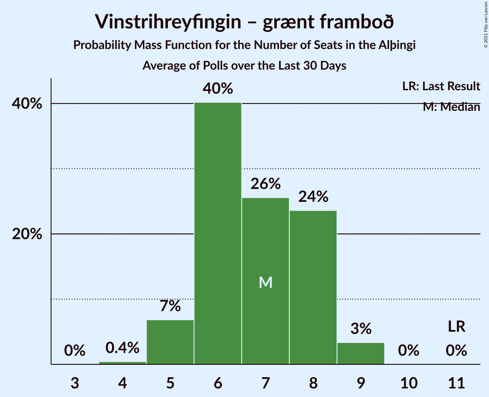

# Poll Average

<a href="#voting-intentions">Voting Intentions</a> | <a href="#seats">Seats</a> | <a href="#coalitions">Coalitions</a> | <a href="#technical-information">Technical Information</a>

## Summary

The table below lists the polls on which the average is based. They are the most recent polls (less than 30 days old) registered and analyzed so far.

| Period     | Polling firm/Commissioner(s) | D | V | S | M | B | P | F | C | A | R | T | J |
|:----------:|:----------------------------:|:--:|:--:|:--:|:--:|:--:|:--:|:--:|:--:|:--:|:--:|:--:|:--:|
| 28 October 2017 | General Election | 25.2%   16 | 16.9%   11 | 12.1%   7 | 10.9%   7 | 10.7%   8 | 9.2%   6 | 6.9%   4 | 6.7%   4 | 1.2%   0 | 0.2%   0 | 0.1%   0 | 0.0%   0 |
| N/A | Poll Average | 18–23%   12–15 | 8–14%   5–10 | 14–20%   8–14 | 10–15%   7–10 | 6–12%   4–10 | 8–12%   4–8 | 3–10%   0–6 | 8–13%   5–9 | N/A   N/A | N/A   N/A | N/A   N/A | 2–4%   0 |
| [21–25 October 2019](2019-10-25-MMR.html) | MMR | 19–24%   12–15 | 8–12%   5–7 | 13–18%   8–12 | 11–16%   8–10 | 8–12%   5–10 | 7–11%   4–7 | 6–10%   4–6 | 8–12%   5–8 | N/A   N/A | N/A   N/A | N/A   N/A | 2–4%   0 |
| [10–4 October 2019](2019-10-04-Zenter.html) | Zenter | 18–22%   12–15 | 11–15%   7–10 | 16–21%   11–15 | 10–14%   7–10 | 6–9%   4–6 | 9–13%   6–9 | 3–5%   0–3 | 10–13%   6–9 | N/A   N/A | N/A   N/A | N/A   N/A | N/A   N/A |
| 28 October 2017 | General Election | 25.2%   16 | 16.9%   11 | 12.1%   7 | 10.9%   7 | 10.7%   8 | 9.2%   6 | 6.9%   4 | 6.7%   4 | 1.2%   0 | 0.2%   0 | 0.1%   0 | 0.0%   0 |

Only polls for which at least the sample size has been published are included in the table above.

**Legend:**
+ **Top half of each row:** Voting intentions (95% confidence interval)
+ **Bottom half of each row:** Seat projections for the Alþingi (95% confidence interval)
+ **D:** Sjálfstæðisflokkurinn
+ **V:** Vinstrihreyfingin – grænt framboð
+ **S:** Samfylkingin
+ **M:** Miðflokkurinn
+ **B:** Framsóknarflokkurinn
+ **P:** Píratar
+ **F:** Flokkur fólksins
+ **C:** Viðreisn
+ **A:** Björt framtíð
+ **R:** Alþýðufylkingin
+ **T:** Dögun
+ **J:** Sósíalistaflokkur Íslands
+ **N/A (single party):** Party not included the published results
+ **N/A (entire row):** Calculation for this opinion poll not started yet

## Voting Intentions

### Confidence Intervals

| Party | Last Result | Median | 80% Confidence Interval | 90% Confidence Interval | 95% Confidence Interval | 99% Confidence Interval |
|:-----:|:-----------:|:------:|:-----------------------:|:-----------------------:|:-----------------------:|:-----------------------:|
| <a href="#sjálfstæðisflokkurinn">Sjálfstæðisflokkurinn</a> | 25.2% | 20.4% | 18.7–22.3% |18.2–22.9% | 17.9–23.3% | 17.1–24.3% |
| <a href="#vinstrihreyfingin-–-grænt-framboð">Vinstrihreyfingin – grænt framboð</a> | 16.9% | 11.2% | 9.0–13.4% |8.6–13.8% | 8.2–14.2% | 7.7–14.9% |
| <a href="#samfylkingin">Samfylkingin</a> | 12.1% | 17.0% | 14.4–19.5% |13.9–20.0% | 13.5–20.4% | 12.8–21.2% |
| <a href="#miðflokkurinn">Miðflokkurinn</a> | 10.9% | 12.6% | 10.9–14.5% |10.5–15.0% | 10.2–15.4% | 9.7–16.2% |
| <a href="#framsóknarflokkurinn">Framsóknarflokkurinn</a> | 10.7% | 8.6% | 6.7–10.9% |6.4–11.3% | 6.2–11.7% | 5.7–12.4% |
| <a href="#píratar">Píratar</a> | 9.2% | 10.0% | 8.3–11.7% |7.9–12.1% | 7.6–12.5% | 7.0–13.1% |
| <a href="#flokkur-fólksins">Flokkur fólksins</a> | 6.9% | 5.9% | 3.6–8.8% |3.4–9.2% | 3.2–9.6% | 2.9–10.3% |
| <a href="#viðreisn">Viðreisn</a> | 6.7% | 10.7% | 9.2–12.2% |8.8–12.6% | 8.5–12.9% | 7.9–13.6% |
| <a href="#björt-framtíð">Björt framtíð</a> | 1.2% | N/A | N/A |N/A | N/A | N/A |
| <a href="#alþýðufylkingin">Alþýðufylkingin</a> | 0.2% | N/A | N/A |N/A | N/A | N/A |
| <a href="#dögun">Dögun</a> | 0.1% | N/A | N/A |N/A | N/A | N/A |
| <a href="#sósíalistaflokkur-íslands">Sósíalistaflokkur Íslands</a> | 0.0% | 2.6% | 2.0–3.3% |1.9–3.6% | 1.8–3.8% | 1.5–4.2% |

### Sjálfstæðisflokkurinn

*For a full overview of the results for this party, see the [Sjálfstæðisflokkurinn](party-sjálfstæðisflokkurinn.html) page.*

| Voting Intentions | Probability | Accumulated | Special Marks |
|:-----------------:|:-----------:|:-----------:|:-------------:|
| 14.5–15.5% | 0% | 100% |  |
| 15.5–16.5% | 0.1% | 100% |  |
| 16.5–17.5% | 1.2% | 99.9% |  |
| 17.5–18.5% | 7% | 98.7% |  |
| 18.5–19.5% | 19% | 92% |  |
| 19.5–20.5% | 27% | 72% | Median |
| 20.5–21.5% | 24% | 46% |  |
| 21.5–22.5% | 14% | 22% |  |
| 22.5–23.5% | 6% | 7% |  |
| 23.5–24.5% | 2% | 2% |  |
| 24.5–25.5% | 0.3% | 0.3% | Last Result |
| 25.5–26.5% | 0% | 0% |  |

### Vinstrihreyfingin – grænt framboð

*For a full overview of the results for this party, see the [Vinstrihreyfingin – grænt framboð](party-vinstrihreyfingin–græntframboð.html) page.*

| Voting Intentions | Probability | Accumulated | Special Marks |
|:-----------------:|:-----------:|:-----------:|:-------------:|
| 5.5–6.5% | 0% | 100% |  |
| 6.5–7.5% | 0.3% | 100% |  |
| 7.5–8.5% | 5% | 99.7% |  |
| 8.5–9.5% | 17% | 95% |  |
| 9.5–10.5% | 19% | 79% |  |
| 10.5–11.5% | 14% | 59% | Median |
| 11.5–12.5% | 19% | 45% |  |
| 12.5–13.5% | 18% | 26% |  |
| 13.5–14.5% | 7% | 8% |  |
| 14.5–15.5% | 1.1% | 1.2% |  |
| 15.5–16.5% | 0.1% | 0.1% |  |
| 16.5–17.5% | 0% | 0% | Last Result |

### Samfylkingin

*For a full overview of the results for this party, see the [Samfylkingin](party-samfylkingin.html) page.*

| Voting Intentions | Probability | Accumulated | Special Marks |
|:-----------------:|:-----------:|:-----------:|:-------------:|
| 10.5–11.5% | 0% | 100% |  |
| 11.5–12.5% | 0.2% | 100% | Last Result |
| 12.5–13.5% | 2% | 99.8% |  |
| 13.5–14.5% | 9% | 97% |  |
| 14.5–15.5% | 16% | 88% |  |
| 15.5–16.5% | 16% | 72% |  |
| 16.5–17.5% | 13% | 56% | Median |
| 17.5–18.5% | 17% | 43% |  |
| 18.5–19.5% | 16% | 26% |  |
| 19.5–20.5% | 8% | 10% |  |
| 20.5–21.5% | 2% | 2% |  |
| 21.5–22.5% | 0.2% | 0.2% |  |
| 22.5–23.5% | 0% | 0% |  |

### Miðflokkurinn

*For a full overview of the results for this party, see the [Miðflokkurinn](party-miðflokkurinn.html) page.*

| Voting Intentions | Probability | Accumulated | Special Marks |
|:-----------------:|:-----------:|:-----------:|:-------------:|
| 7.5–8.5% | 0% | 100% |  |
| 8.5–9.5% | 0.3% | 100% |  |
| 9.5–10.5% | 5% | 99.7% |  |
| 10.5–11.5% | 18% | 95% | Last Result |
| 11.5–12.5% | 26% | 77% |  |
| 12.5–13.5% | 24% | 50% | Median |
| 13.5–14.5% | 17% | 26% |  |
| 14.5–15.5% | 7% | 9% |  |
| 15.5–16.5% | 2% | 2% |  |
| 16.5–17.5% | 0.2% | 0.2% |  |
| 17.5–18.5% | 0% | 0% |  |

### Framsóknarflokkurinn

*For a full overview of the results for this party, see the [Framsóknarflokkurinn](party-framsóknarflokkurinn.html) page.*

| Voting Intentions | Probability | Accumulated | Special Marks |
|:-----------------:|:-----------:|:-----------:|:-------------:|
| 3.5–4.5% | 0% | 100% |  |
| 4.5–5.5% | 0.2% | 100% |  |
| 5.5–6.5% | 7% | 99.8% |  |
| 6.5–7.5% | 24% | 93% |  |
| 7.5–8.5% | 19% | 70% |  |
| 8.5–9.5% | 16% | 50% | Median |
| 9.5–10.5% | 20% | 35% |  |
| 10.5–11.5% | 12% | 15% | Last Result |
| 11.5–12.5% | 3% | 3% |  |
| 12.5–13.5% | 0.3% | 0.4% |  |
| 13.5–14.5% | 0% | 0% |  |

### Píratar

*For a full overview of the results for this party, see the [Píratar](party-píratar.html) page.*

| Voting Intentions | Probability | Accumulated | Special Marks |
|:-----------------:|:-----------:|:-----------:|:-------------:|
| 4.5–5.5% | 0% | 100% |  |
| 5.5–6.5% | 0.1% | 100% |  |
| 6.5–7.5% | 2% | 99.9% |  |
| 7.5–8.5% | 13% | 98% |  |
| 8.5–9.5% | 23% | 85% | Last Result |
| 9.5–10.5% | 25% | 61% | Median |
| 10.5–11.5% | 24% | 37% |  |
| 11.5–12.5% | 11% | 13% |  |
| 12.5–13.5% | 2% | 2% |  |
| 13.5–14.5% | 0.2% | 0.2% |  |
| 14.5–15.5% | 0% | 0% |  |

### Flokkur fólksins

*For a full overview of the results for this party, see the [Flokkur fólksins](party-flokkurfólksins.html) page.*

| Voting Intentions | Probability | Accumulated | Special Marks |
|:-----------------:|:-----------:|:-----------:|:-------------:|
| 1.5–2.5% | 0% | 100% |  |
| 2.5–3.5% | 8% | 100% |  |
| 3.5–4.5% | 31% | 92% |  |
| 4.5–5.5% | 10% | 60% |  |
| 5.5–6.5% | 2% | 50% | Median |
| 6.5–7.5% | 12% | 48% | Last Result |
| 7.5–8.5% | 22% | 37% |  |
| 8.5–9.5% | 12% | 15% |  |
| 9.5–10.5% | 2% | 3% |  |
| 10.5–11.5% | 0.2% | 0.2% |  |
| 11.5–12.5% | 0% | 0% |  |

### Viðreisn

*For a full overview of the results for this party, see the [Viðreisn](party-viðreisn.html) page.*

| Voting Intentions | Probability | Accumulated | Special Marks |
|:-----------------:|:-----------:|:-----------:|:-------------:|
| 5.5–6.5% | 0% | 100% |  |
| 6.5–7.5% | 0.1% | 100% | Last Result |
| 7.5–8.5% | 3% | 99.9% |  |
| 8.5–9.5% | 14% | 97% |  |
| 9.5–10.5% | 28% | 84% |  |
| 10.5–11.5% | 32% | 56% | Median |
| 11.5–12.5% | 19% | 24% |  |
| 12.5–13.5% | 5% | 5% |  |
| 13.5–14.5% | 0.5% | 0.6% |  |
| 14.5–15.5% | 0% | 0% |  |

### Sósíalistaflokkur Íslands

*For a full overview of the results for this party, see the [Sósíalistaflokkur Íslands](party-sósíalistaflokkuríslands.html) page.*

| Voting Intentions | Probability | Accumulated | Special Marks |
|:-----------------:|:-----------:|:-----------:|:-------------:|
| 0.0–0.5% | 0% | 100% | Last Result |
| 0.5–1.5% | 0.6% | 100% |  |
| 1.5–2.5% | 42% | 99.4% |  |
| 2.5–3.5% | 52% | 57% | Median |
| 3.5–4.5% | 5% | 5% |  |
| 4.5–5.5% | 0.1% | 0.1% |  |
| 5.5–6.5% | 0% | 0% |  |

## Seats

### Confidence Intervals

| Party | Last Result | Median | 80% Confidence Interval | 90% Confidence Interval | 95% Confidence Interval | 99% Confidence Interval |
|:-----:|:-----------:|:------:|:-----------------------:|:-----------------------:|:-----------------------:|:-----------------------:|
| <a href="#sjálfstæðisflokkurinn">Sjálfstæðisflokkurinn</a> | 16 | 13 | 12–15 |12–15 | 12–15 | 11–16 |
| <a href="#vinstrihreyfingin-–-grænt-framboð">Vinstrihreyfingin – grænt framboð</a> | 11 | 7 | 5–9 |5–10 | 5–10 | 5–10 |
| <a href="#samfylkingin">Samfylkingin</a> | 7 | 12 | 10–14 |8–14 | 8–14 | 8–15 |
| <a href="#miðflokkurinn">Miðflokkurinn</a> | 7 | 9 | 8–10 |7–10 | 7–10 | 6–10 |
| <a href="#framsóknarflokkurinn">Framsóknarflokkurinn</a> | 8 | 5 | 4–7 |4–10 | 4–10 | 4–10 |
| <a href="#píratar">Píratar</a> | 6 | 7 | 4–8 |4–8 | 4–8 | 4–9 |
| <a href="#flokkur-fólksins">Flokkur fólksins</a> | 4 | 3 | 0–5 |0–6 | 0–6 | 0–6 |
| <a href="#viðreisn">Viðreisn</a> | 4 | 7 | 5–8 |5–8 | 5–9 | 5–9 |
| <a href="#björt-framtíð">Björt framtíð</a> | 0 | N/A | N/A |N/A | N/A | N/A |
| <a href="#alþýðufylkingin">Alþýðufylkingin</a> | 0 | N/A | N/A |N/A | N/A | N/A |
| <a href="#dögun">Dögun</a> | 0 | N/A | N/A |N/A | N/A | N/A |
| <a href="#sósíalistaflokkur-íslands">Sósíalistaflokkur Íslands</a> | 0 | 0 | 0 |0 | 0 | 0 |

### Sjálfstæðisflokkurinn

*For a full overview of the results for this party, see the [Sjálfstæðisflokkurinn](party-sjálfstæðisflokkurinn.html) page.*

| Number of Seats | Probability | Accumulated | Special Marks |
|:---------------:|:-----------:|:-----------:|:-------------:|
| 11 | 0.7% | 100% |  |
| 12 | 11% | 99.3% |  |
| 13 | 50% | 88% | Median |
| 14 | 25% | 38% |  |
| 15 | 12% | 14% |  |
| 16 | 0.6% | 1.0% | Last Result |
| 17 | 0.5% | 0.5% |  |
| 18 | 0% | 0% |  |

### Vinstrihreyfingin – grænt framboð

*For a full overview of the results for this party, see the [Vinstrihreyfingin – grænt framboð](party-vinstrihreyfingin–græntframboð.html) page.*

| Number of Seats | Probability | Accumulated | Special Marks |
|:---------------:|:-----------:|:-----------:|:-------------:|
| 5 | 14% | 100% |  |
| 6 | 3% | 86% |  |
| 7 | 38% | 83% | Median |
| 8 | 19% | 45% |  |
| 9 | 18% | 26% |  |
| 10 | 8% | 8% |  |
| 11 | 0.1% | 0.1% | Last Result |
| 12 | 0% | 0% |  |

### Samfylkingin

*For a full overview of the results for this party, see the [Samfylkingin](party-samfylkingin.html) page.*

| Number of Seats | Probability | Accumulated | Special Marks |
|:---------------:|:-----------:|:-----------:|:-------------:|
| 7 | 0% | 100% | Last Result |
| 8 | 7% | 100% |  |
| 9 | 0% | 93% |  |
| 10 | 14% | 93% |  |
| 11 | 4% | 79% |  |
| 12 | 45% | 76% | Median |
| 13 | 20% | 30% |  |
| 14 | 9% | 10% |  |
| 15 | 1.3% | 1.3% |  |
| 16 | 0% | 0% |  |

### Miðflokkurinn

*For a full overview of the results for this party, see the [Miðflokkurinn](party-miðflokkurinn.html) page.*

| Number of Seats | Probability | Accumulated | Special Marks |
|:---------------:|:-----------:|:-----------:|:-------------:|
| 6 | 1.0% | 100% |  |
| 7 | 8% | 99.0% | Last Result |
| 8 | 26% | 91% |  |
| 9 | 16% | 65% | Median |
| 10 | 49% | 49% |  |
| 11 | 0% | 0% |  |

### Framsóknarflokkurinn

*For a full overview of the results for this party, see the [Framsóknarflokkurinn](party-framsóknarflokkurinn.html) page.*

| Number of Seats | Probability | Accumulated | Special Marks |
|:---------------:|:-----------:|:-----------:|:-------------:|
| 3 | 0.4% | 100% |  |
| 4 | 18% | 99.6% |  |
| 5 | 35% | 81% | Median |
| 6 | 30% | 47% |  |
| 7 | 10% | 17% |  |
| 8 | 0.2% | 7% | Last Result |
| 9 | 0% | 7% |  |
| 10 | 7% | 7% |  |
| 11 | 0% | 0% |  |

### Píratar

*For a full overview of the results for this party, see the [Píratar](party-píratar.html) page.*

| Number of Seats | Probability | Accumulated | Special Marks |
|:---------------:|:-----------:|:-----------:|:-------------:|
| 4 | 11% | 100% |  |
| 5 | 32% | 89% |  |
| 6 | 6% | 57% | Last Result |
| 7 | 34% | 51% | Median |
| 8 | 16% | 17% |  |
| 9 | 1.4% | 1.4% |  |
| 10 | 0% | 0% |  |

### Flokkur fólksins

*For a full overview of the results for this party, see the [Flokkur fólksins](party-flokkurfólksins.html) page.*

| Number of Seats | Probability | Accumulated | Special Marks |
|:---------------:|:-----------:|:-----------:|:-------------:|
| 0 | 47% | 100% |  |
| 1 | 0% | 53% |  |
| 2 | 0% | 53% |  |
| 3 | 4% | 53% | Median |
| 4 | 6% | 49% | Last Result |
| 5 | 37% | 44% |  |
| 6 | 7% | 7% |  |
| 7 | 0% | 0% |  |

### Viðreisn

*For a full overview of the results for this party, see the [Viðreisn](party-viðreisn.html) page.*

| Number of Seats | Probability | Accumulated | Special Marks |
|:---------------:|:-----------:|:-----------:|:-------------:|
| 4 | 0% | 100% | Last Result |
| 5 | 28% | 100% |  |
| 6 | 4% | 72% |  |
| 7 | 34% | 67% | Median |
| 8 | 29% | 34% |  |
| 9 | 4% | 4% |  |
| 10 | 0.1% | 0.1% |  |
| 11 | 0% | 0% |  |

### Sósíalistaflokkur Íslands

*For a full overview of the results for this party, see the [Sósíalistaflokkur Íslands](party-sósíalistaflokkuríslands.html) page.*

| Number of Seats | Probability | Accumulated | Special Marks |
|:---------------:|:-----------:|:-----------:|:-------------:|
| 0 | 100% | 100% | Last Result, Median |

## Coalitions

### Confidence Intervals

| Coalition | Last Result | Median | Majority? | 80% Confidence Interval | 90% Confidence Interval | 95% Confidence Interval | 99% Confidence Interval |
|:---------:|:-----------:|:------:|:---------:|:-----------------------:|:-----------------------:|:-----------------------:|:-----------------------:|
| Vinstrihreyfingin – grænt framboð – Samfylkingin – Píratar – Viðreisn – Björt framtíð | 28 | 31 | 50% | 28–37 | 26–38 | 26–38 | 26–39 |
| Vinstrihreyfingin – grænt framboð – Samfylkingin – Píratar – Viðreisn | 28 | 31 | 50% | 28–37 | 26–38 | 26–38 | 26–39 |
| Vinstrihreyfingin – grænt framboð – Samfylkingin – Miðflokkurinn – Framsóknarflokkurinn | 33 | 35 | 85% | 30–36 | 30–36 | 30–36 | 30–37 |
| Sjálfstæðisflokkurinn – Miðflokkurinn – Framsóknarflokkurinn | 31 | 28 | 7% | 26–31 | 25–32 | 25–32 | 24–32 |
| Vinstrihreyfingin – grænt framboð – Samfylkingin – Miðflokkurinn | 25 | 29 | 2% | 25–31 | 23–31 | 23–31 | 23–32 |
| Vinstrihreyfingin – grænt framboð – Samfylkingin – Píratar – Björt framtíð | 24 | 24 | 0.4% | 20–30 | 19–30 | 19–30 | 19–31 |
| Vinstrihreyfingin – grænt framboð – Samfylkingin – Píratar | 24 | 24 | 0.4% | 20–30 | 19–30 | 19–30 | 19–31 |
| Sjálfstæðisflokkurinn – Vinstrihreyfingin – grænt framboð – Framsóknarflokkurinn | 35 | 26 | 0% | 25–28 | 25–28 | 25–29 | 24–30 |
| Sjálfstæðisflokkurinn – Samfylkingin | 23 | 25 | 0% | 22–27 | 21–28 | 21–28 | 21–29 |
| Vinstrihreyfingin – grænt framboð – Samfylkingin – Framsóknarflokkurinn | 26 | 25 | 0% | 22–27 | 20–28 | 20–28 | 20–29 |
| Vinstrihreyfingin – grænt framboð – Miðflokkurinn – Framsóknarflokkurinn | 26 | 22 | 0% | 20–24 | 20–25 | 20–25 | 19–25 |
| Sjálfstæðisflokkurinn – Miðflokkurinn | 23 | 23 | 0% | 21–24 | 20–25 | 20–25 | 19–25 |
| Sjálfstæðisflokkurinn – Vinstrihreyfingin – grænt framboð | 27 | 20 | 0% | 20–23 | 17–24 | 17–24 | 17–25 |
| Sjálfstæðisflokkurinn – Viðreisn – Björt framtíð | 20 | 20 | 0% | 18–23 | 18–23 | 18–23 | 18–24 |
| Sjálfstæðisflokkurinn – Viðreisn | 20 | 20 | 0% | 18–23 | 18–23 | 18–23 | 18–24 |
| Vinstrihreyfingin – grænt framboð – Samfylkingin | 18 | 19 | 0% | 15–22 | 15–23 | 15–23 | 14–24 |
| Sjálfstæðisflokkurinn – Framsóknarflokkurinn | 24 | 19 | 0% | 17–21 | 17–22 | 17–22 | 16–23 |
| Vinstrihreyfingin – grænt framboð – Miðflokkurinn | 18 | 17 | 0% | 15–18 | 15–18 | 15–19 | 14–19 |
| Vinstrihreyfingin – grænt framboð – Píratar | 17 | 14 | 0% | 10–17 | 9–17 | 9–18 | 9–18 |
| Sjálfstæðisflokkurinn – Björt framtíð | 16 | 13 | 0% | 12–15 | 12–15 | 12–15 | 11–16 |
| Vinstrihreyfingin – grænt framboð – Framsóknarflokkurinn | 19 | 13 | 0% | 12–15 | 10–15 | 10–15 | 10–16 |

### Vinstrihreyfingin – grænt framboð – Samfylkingin – Píratar – Viðreisn – Björt framtíð

| Number of Seats | Probability | Accumulated | Special Marks |
|:---------------:|:-----------:|:-----------:|:-------------:|
| 26 | 7% | 100% |  |
| 27 | 2% | 93% |  |
| 28 | 10% | 91% | Last Result |
| 29 | 30% | 81% |  |
| 30 | 0.2% | 51% |  |
| 31 | 1.0% | 51% |  |
| 32 | 0.3% | 50% | Majority |
| 33 | 1.2% | 50% | Median |
| 34 | 4% | 48% |  |
| 35 | 9% | 44% |  |
| 36 | 15% | 36% |  |
| 37 | 15% | 21% |  |
| 38 | 5% | 6% |  |
| 39 | 1.0% | 1.1% |  |
| 40 | 0.1% | 0.1% |  |
| 41 | 0% | 0% |  |

### Vinstrihreyfingin – grænt framboð – Samfylkingin – Píratar – Viðreisn

| Number of Seats | Probability | Accumulated | Special Marks |
|:---------------:|:-----------:|:-----------:|:-------------:|
| 26 | 7% | 100% |  |
| 27 | 2% | 93% |  |
| 28 | 10% | 91% | Last Result |
| 29 | 30% | 81% |  |
| 30 | 0.2% | 51% |  |
| 31 | 1.0% | 51% |  |
| 32 | 0.3% | 50% | Majority |
| 33 | 1.2% | 50% | Median |
| 34 | 4% | 48% |  |
| 35 | 9% | 44% |  |
| 36 | 15% | 36% |  |
| 37 | 15% | 21% |  |
| 38 | 5% | 6% |  |
| 39 | 1.0% | 1.1% |  |
| 40 | 0.1% | 0.1% |  |
| 41 | 0% | 0% |  |

### Vinstrihreyfingin – grænt framboð – Samfylkingin – Miðflokkurinn – Framsóknarflokkurinn

| Number of Seats | Probability | Accumulated | Special Marks |
|:---------------:|:-----------:|:-----------:|:-------------:|
| 30 | 14% | 100% |  |
| 31 | 0.4% | 86% |  |
| 32 | 3% | 85% | Majority |
| 33 | 8% | 82% | Last Result, Median |
| 34 | 16% | 74% |  |
| 35 | 46% | 58% |  |
| 36 | 10% | 12% |  |
| 37 | 2% | 2% |  |
| 38 | 0.1% | 0.1% |  |
| 39 | 0% | 0% |  |

### Sjálfstæðisflokkurinn – Miðflokkurinn – Framsóknarflokkurinn

| Number of Seats | Probability | Accumulated | Special Marks |
|:---------------:|:-----------:|:-----------:|:-------------:|
| 23 | 0.3% | 100% |  |
| 24 | 2% | 99.6% |  |
| 25 | 6% | 98% |  |
| 26 | 16% | 91% |  |
| 27 | 14% | 75% | Median |
| 28 | 13% | 60% |  |
| 29 | 28% | 48% |  |
| 30 | 9% | 20% |  |
| 31 | 4% | 11% | Last Result |
| 32 | 7% | 7% | Majority |
| 33 | 0.4% | 0.5% |  |
| 34 | 0% | 0% |  |

### Vinstrihreyfingin – grænt framboð – Samfylkingin – Miðflokkurinn

| Number of Seats | Probability | Accumulated | Special Marks |
|:---------------:|:-----------:|:-----------:|:-------------:|
| 23 | 5% | 100% |  |
| 24 | 2% | 95% |  |
| 25 | 13% | 93% | Last Result |
| 26 | 1.3% | 79% |  |
| 27 | 1.2% | 78% |  |
| 28 | 5% | 77% | Median |
| 29 | 44% | 72% |  |
| 30 | 17% | 28% |  |
| 31 | 9% | 11% |  |
| 32 | 2% | 2% | Majority |
| 33 | 0.3% | 0.3% |  |
| 34 | 0% | 0% |  |

### Vinstrihreyfingin – grænt framboð – Samfylkingin – Píratar – Björt framtíð

| Number of Seats | Probability | Accumulated | Special Marks |
|:---------------:|:-----------:|:-----------:|:-------------:|
| 19 | 6% | 100% |  |
| 20 | 7% | 94% |  |
| 21 | 2% | 87% |  |
| 22 | 6% | 84% |  |
| 23 | 4% | 78% |  |
| 24 | 25% | 75% | Last Result |
| 25 | 0.3% | 50% |  |
| 26 | 2% | 50% | Median |
| 27 | 7% | 48% |  |
| 28 | 13% | 41% |  |
| 29 | 17% | 28% |  |
| 30 | 9% | 11% |  |
| 31 | 2% | 2% |  |
| 32 | 0.4% | 0.4% | Majority |
| 33 | 0% | 0% |  |

### Vinstrihreyfingin – grænt framboð – Samfylkingin – Píratar

| Number of Seats | Probability | Accumulated | Special Marks |
|:---------------:|:-----------:|:-----------:|:-------------:|
| 19 | 6% | 100% |  |
| 20 | 7% | 94% |  |
| 21 | 2% | 87% |  |
| 22 | 6% | 84% |  |
| 23 | 4% | 78% |  |
| 24 | 25% | 75% | Last Result |
| 25 | 0.3% | 50% |  |
| 26 | 2% | 50% | Median |
| 27 | 7% | 48% |  |
| 28 | 13% | 41% |  |
| 29 | 17% | 28% |  |
| 30 | 9% | 11% |  |
| 31 | 2% | 2% |  |
| 32 | 0.4% | 0.4% | Majority |
| 33 | 0% | 0% |  |

### Sjálfstæðisflokkurinn – Vinstrihreyfingin – grænt framboð – Framsóknarflokkurinn

| Number of Seats | Probability | Accumulated | Special Marks |
|:---------------:|:-----------:|:-----------:|:-------------:|
| 22 | 0.1% | 100% |  |
| 23 | 0.2% | 99.9% |  |
| 24 | 2% | 99.7% |  |
| 25 | 13% | 98% | Median |
| 26 | 37% | 84% |  |
| 27 | 29% | 48% |  |
| 28 | 14% | 19% |  |
| 29 | 4% | 5% |  |
| 30 | 0.5% | 0.5% |  |
| 31 | 0% | 0% |  |
| 32 | 0% | 0% | Majority |
| 33 | 0% | 0% |  |
| 34 | 0% | 0% |  |
| 35 | 0% | 0% | Last Result |

### Sjálfstæðisflokkurinn – Samfylkingin

| Number of Seats | Probability | Accumulated | Special Marks |
|:---------------:|:-----------:|:-----------:|:-------------:|
| 19 | 0.2% | 100% |  |
| 20 | 0% | 99.8% |  |
| 21 | 5% | 99.8% |  |
| 22 | 8% | 94% |  |
| 23 | 0.3% | 86% | Last Result |
| 24 | 3% | 86% |  |
| 25 | 41% | 83% | Median |
| 26 | 21% | 42% |  |
| 27 | 14% | 21% |  |
| 28 | 6% | 7% |  |
| 29 | 1.0% | 1.1% |  |
| 30 | 0.1% | 0.1% |  |
| 31 | 0% | 0% |  |

### Vinstrihreyfingin – grænt framboð – Samfylkingin – Framsóknarflokkurinn

| Number of Seats | Probability | Accumulated | Special Marks |
|:---------------:|:-----------:|:-----------:|:-------------:|
| 20 | 9% | 100% |  |
| 21 | 0% | 91% |  |
| 22 | 6% | 91% |  |
| 23 | 0.9% | 85% |  |
| 24 | 4% | 84% | Median |
| 25 | 41% | 81% |  |
| 26 | 21% | 39% | Last Result |
| 27 | 12% | 18% |  |
| 28 | 5% | 6% |  |
| 29 | 0.5% | 0.6% |  |
| 30 | 0% | 0% |  |

### Vinstrihreyfingin – grænt framboð – Miðflokkurinn – Framsóknarflokkurinn

| Number of Seats | Probability | Accumulated | Special Marks |
|:---------------:|:-----------:|:-----------:|:-------------:|
| 17 | 0.1% | 100% |  |
| 18 | 0.2% | 99.9% |  |
| 19 | 2% | 99.7% |  |
| 20 | 13% | 98% |  |
| 21 | 16% | 85% | Median |
| 22 | 24% | 69% |  |
| 23 | 32% | 45% |  |
| 24 | 6% | 13% |  |
| 25 | 7% | 7% |  |
| 26 | 0% | 0% | Last Result |

### Sjálfstæðisflokkurinn – Miðflokkurinn

| Number of Seats | Probability | Accumulated | Special Marks |
|:---------------:|:-----------:|:-----------:|:-------------:|
| 18 | 0.1% | 100% |  |
| 19 | 1.0% | 99.9% |  |
| 20 | 5% | 98.9% |  |
| 21 | 18% | 94% |  |
| 22 | 25% | 76% | Median |
| 23 | 35% | 51% | Last Result |
| 24 | 9% | 16% |  |
| 25 | 7% | 8% |  |
| 26 | 0% | 0.5% |  |
| 27 | 0.4% | 0.4% |  |
| 28 | 0% | 0% |  |

### Sjálfstæðisflokkurinn – Vinstrihreyfingin – grænt framboð

| Number of Seats | Probability | Accumulated | Special Marks |
|:---------------:|:-----------:|:-----------:|:-------------:|
| 17 | 6% | 100% |  |
| 18 | 0.1% | 94% |  |
| 19 | 1.1% | 93% |  |
| 20 | 44% | 92% | Median |
| 21 | 14% | 49% |  |
| 22 | 15% | 35% |  |
| 23 | 13% | 19% |  |
| 24 | 6% | 6% |  |
| 25 | 0.7% | 0.7% |  |
| 26 | 0% | 0% |  |
| 27 | 0% | 0% | Last Result |

### Sjálfstæðisflokkurinn – Viðreisn – Björt framtíð

| Number of Seats | Probability | Accumulated | Special Marks |
|:---------------:|:-----------:|:-----------:|:-------------:|
| 18 | 25% | 100% |  |
| 19 | 13% | 75% |  |
| 20 | 18% | 62% | Last Result, Median |
| 21 | 21% | 44% |  |
| 22 | 12% | 24% |  |
| 23 | 10% | 11% |  |
| 24 | 1.2% | 1.2% |  |
| 25 | 0% | 0% |  |

### Sjálfstæðisflokkurinn – Viðreisn

| Number of Seats | Probability | Accumulated | Special Marks |
|:---------------:|:-----------:|:-----------:|:-------------:|
| 18 | 25% | 100% |  |
| 19 | 13% | 75% |  |
| 20 | 18% | 62% | Last Result, Median |
| 21 | 21% | 44% |  |
| 22 | 12% | 24% |  |
| 23 | 10% | 11% |  |
| 24 | 1.2% | 1.2% |  |
| 25 | 0% | 0% |  |

### Vinstrihreyfingin – grænt framboð – Samfylkingin

| Number of Seats | Probability | Accumulated | Special Marks |
|:---------------:|:-----------:|:-----------:|:-------------:|
| 14 | 2% | 100% |  |
| 15 | 19% | 98% |  |
| 16 | 0.5% | 79% |  |
| 17 | 0.6% | 79% |  |
| 18 | 0.4% | 78% | Last Result |
| 19 | 29% | 78% | Median |
| 20 | 9% | 49% |  |
| 21 | 18% | 40% |  |
| 22 | 15% | 22% |  |
| 23 | 6% | 7% |  |
| 24 | 1.0% | 1.0% |  |
| 25 | 0.1% | 0.1% |  |
| 26 | 0% | 0% |  |

### Sjálfstæðisflokkurinn – Framsóknarflokkurinn

| Number of Seats | Probability | Accumulated | Special Marks |
|:---------------:|:-----------:|:-----------:|:-------------:|
| 15 | 0.2% | 100% |  |
| 16 | 2% | 99.8% |  |
| 17 | 9% | 98% |  |
| 18 | 21% | 89% | Median |
| 19 | 38% | 68% |  |
| 20 | 19% | 30% |  |
| 21 | 4% | 11% |  |
| 22 | 6% | 7% |  |
| 23 | 1.0% | 1.0% |  |
| 24 | 0% | 0% | Last Result |

### Vinstrihreyfingin – grænt framboð – Miðflokkurinn

| Number of Seats | Probability | Accumulated | Special Marks |
|:---------------:|:-----------:|:-----------:|:-------------:|
| 13 | 0.1% | 100% |  |
| 14 | 0.6% | 99.9% |  |
| 15 | 23% | 99.3% |  |
| 16 | 14% | 76% | Median |
| 17 | 50% | 62% |  |
| 18 | 9% | 13% | Last Result |
| 19 | 3% | 3% |  |
| 20 | 0.1% | 0.1% |  |
| 21 | 0% | 0% |  |

### Vinstrihreyfingin – grænt framboð – Píratar

| Number of Seats | Probability | Accumulated | Special Marks |
|:---------------:|:-----------:|:-----------:|:-------------:|
| 9 | 6% | 100% |  |
| 10 | 8% | 94% |  |
| 11 | 5% | 86% |  |
| 12 | 24% | 81% |  |
| 13 | 2% | 57% |  |
| 14 | 11% | 55% | Median |
| 15 | 14% | 44% |  |
| 16 | 17% | 31% |  |
| 17 | 11% | 14% | Last Result |
| 18 | 3% | 3% |  |
| 19 | 0.1% | 0.1% |  |
| 20 | 0% | 0% |  |

### Sjálfstæðisflokkurinn – Björt framtíð

| Number of Seats | Probability | Accumulated | Special Marks |
|:---------------:|:-----------:|:-----------:|:-------------:|
| 11 | 0.7% | 100% |  |
| 12 | 11% | 99.3% |  |
| 13 | 50% | 88% | Median |
| 14 | 25% | 38% |  |
| 15 | 12% | 14% |  |
| 16 | 0.6% | 1.0% | Last Result |
| 17 | 0.5% | 0.5% |  |
| 18 | 0% | 0% |  |

### Vinstrihreyfingin – grænt framboð – Framsóknarflokkurinn

| Number of Seats | Probability | Accumulated | Special Marks |
|:---------------:|:-----------:|:-----------:|:-------------:|
| 10 | 7% | 100% |  |
| 11 | 2% | 93% |  |
| 12 | 11% | 90% | Median |
| 13 | 43% | 79% |  |
| 14 | 22% | 36% |  |
| 15 | 13% | 14% |  |
| 16 | 0.9% | 0.9% |  |
| 17 | 0% | 0% |  |
| 18 | 0% | 0% |  |
| 19 | 0% | 0% | Last Result |

## Technical Information

+ **Number of polls included in this average:** 2
+ **Lowest number of simulations done in a poll included in this average:** 1,024
+ **Total number of simulations done in the polls included in this average:** 1,049,600
+ **Error estimate:** 7.10%
