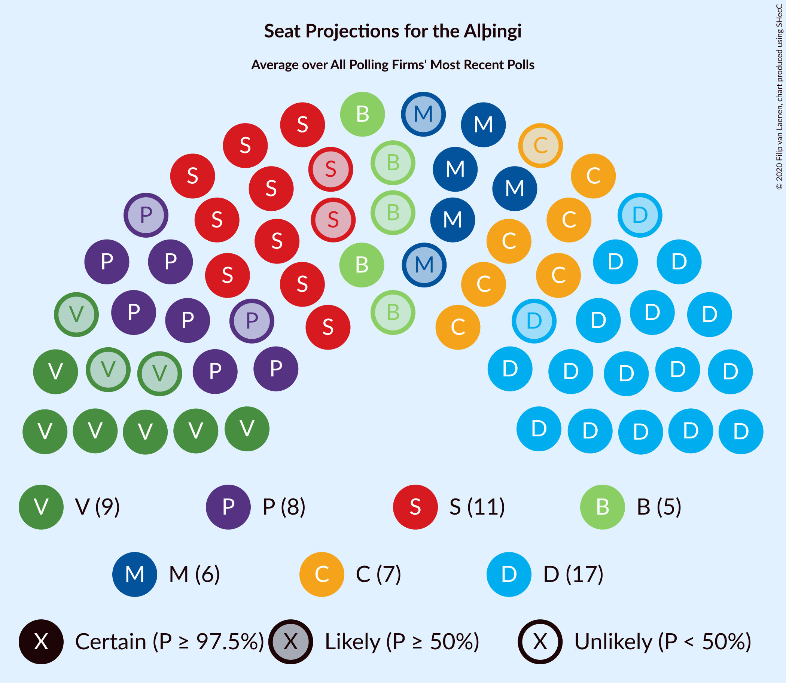

# Overview

The table below lists the most recent polls (less than 30 days old) registered and analyzed so far.

| Period     | Polling firm/Commissioner(s) | D | V | S | M | B | P | F | C | A | R | T | J |
|:----------:|:----------------------------:|:--:|:--:|:--:|:--:|:--:|:--:|:--:|:--:|:--:|:--:|:--:|:--:|
| 28 October 2017 | General Election | 25.2%   16 | 16.9%   11 | 12.1%   7 | 10.9%   7 | 10.7%   8 | 9.2%   6 | 6.9%   4 | 6.7%   4 | 1.2%   0 | 0.2%   0 | 0.1%   0 | 0.0%   0 |
| N/A | [Poll Average](average.html) | 21–25%   15–18 | 9–12%   6–9 | 14–18%   10–13 | 6–10%   3–6 | 6–9%   4–6 | 11–19%   8–13 | 4–6%   0–4 | 9–12%   6–8 | N/A   N/A | N/A   N/A | N/A   N/A | 3–4%   0 |
| [1 December 2020–3 January 2021](2021-01-03-Gallup.html) | Gallup | 23–25%   16–17 | 11–13%   7–9 | 16–18%   11–12 | 8–10%   6–7 | 8–9%   5–6 | 11–13%   8–9 | 4–5%   0 | 9–11%   6–7 | N/A   N/A | N/A   N/A | N/A   N/A | 3–4%   0 |
| [11–19 December 2020](2020-12-19-Zenter.html) | Zenter | 21–25%   15–18 | 9–12%   6–8 | 14–18%   9–13 | 5–8%   3–5 | 6–9%   4–6 | 15–19%   10–13 | 4–6%   0–4 | 9–12%   6–8 | N/A   N/A | N/A   N/A | N/A   N/A | 2–4%   0 |
| 28 October 2017 | General Election | 25.2%   16 | 16.9%   11 | 12.1%   7 | 10.9%   7 | 10.7%   8 | 9.2%   6 | 6.9%   4 | 6.7%   4 | 1.2%   0 | 0.2%   0 | 0.1%   0 | 0.0%   0 |

Only polls for which at least the sample size has been published are included in the table above.

**Legend:**
+ **Top half of each row:** Voting intentions (95% confidence interval)
+ **Bottom half of each row:** Seat projections for the Alþingi (95% confidence interval)
+ **D:** Sjálfstæðisflokkurinn
+ **V:** Vinstrihreyfingin – grænt framboð
+ **S:** Samfylkingin
+ **M:** Miðflokkurinn
+ **B:** Framsóknarflokkurinn
+ **P:** Píratar
+ **F:** Flokkur fólksins
+ **C:** Viðreisn
+ **A:** Björt framtíð
+ **R:** Alþýðufylkingin
+ **T:** Dögun
+ **J:** Sósíalistaflokkur Íslands
+ **N/A (single party):** Party not included the published results
+ **N/A (entire row):** Calculation for this opinion poll not started yet

