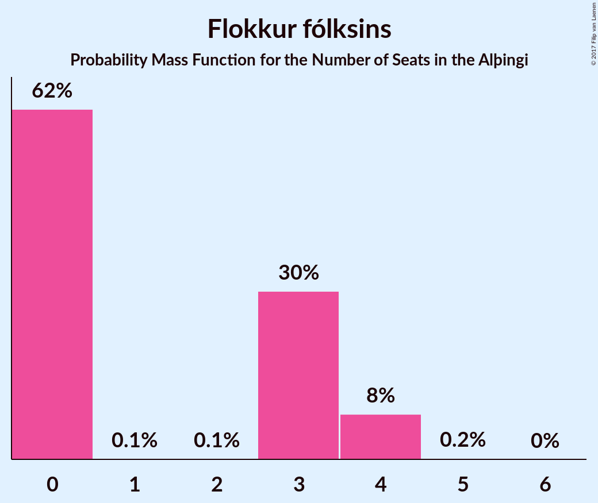

# Flokkur fólksins

<a href="#voting-intentions">Voting Intentions</a> | <a href="#seats">Seats</a>

## Voting Intentions

Last result: **3.5%** (General Election of 29 October 2016)

### Confidence Intervals

| Period     | Polling firm/Commissioner(s) | Median | 80% Confidence Interval | 90% Confidence Interval | 95% Confidence Interval | 99% Confidence Interval |
|:----------:|:----------------:|:-----------:|:-----------------------:|:-----------------------:|:-----------------------:|:-----------------------:|
| N/A | [Poll Average](average.html) | 4.3% | 3.7–5.0% | 3.5–5.3% | 3.3–5.5% | 3.1–6.0% |
| [26–27 October 2017](2017-10-27-MMR.html) | MMR | 4.4% | 3.7–5.3% | 3.4–5.6% | 3.3–5.9% | 3.0–6.4% |
| [23–27 October 2017](2017-10-27-Gallup.html) | Gallup | 4.0% | 3.5–4.6% | 3.4–4.8% | 3.2–4.9% | 3.0–5.2% |
| [22–25 October 2017](2017-10-25-Felagsvisindastofnun.html) | Félagsvísindastofnun   Morgunblaðið | 4.2% | 3.7–4.8% | 3.6–5.0% | 3.5–5.1% | 3.2–5.4% |
| [23–24 October 2017](2017-10-24-Frettabladid.html) | Fréttablaðið | 4.4% | 3.8–5.1% | 3.6–5.3% | 3.5–5.5% | 3.2–5.9% |
| [20–23 October 2017](2017-10-23-MMR.html) | MMR | 4.7% | 3.9–5.7% | 3.7–6.0% | 3.5–6.2% | 3.2–6.7% |
| [13–19 October 2017](2017-10-19-Gallup.html) | Gallup | 5.7% | 5.0–6.5% | 4.9–6.7% | 4.7–6.9% | 4.4–7.3% |
| [16–19 October 2017](2017-10-19-Felagsvisindastofnun.html) | Félagsvísindastofnun   Morgunblaðið | 3.3% | 2.8–3.9% | 2.7–4.1% | 2.6–4.2% | 2.4–4.5% |
| [17–18 October 2017](2017-10-18-MMR.html) | MMR | 5.3% | 4.5–6.3% | 4.2–6.6% | 4.1–6.8% | 3.7–7.3% |
| [16 October 2017](2017-10-16-Frettabladid.html) | Fréttablaðið | 3.7% | 3.0–4.7% | 2.8–5.0% | 2.6–5.3% | 2.3–5.8% |
| [29 September–12 October 2017](2017-10-12-Gallup.html) | Gallup | 5.7% | 5.1–6.4% | 5.0–6.6% | 4.8–6.7% | 4.6–7.1% |
| [9–12 October 2017](2017-10-12-Felagsvisindastofnun.html) | Félagsvísindastofnun   Morgunblaðið | 6.5% | 5.7–7.5% | 5.4–7.7% | 5.2–8.0% | 4.9–8.5% |
| [6–11 October 2017](2017-10-11-MMR.html) | MMR | 7.3% | 6.4–8.5% | 6.1–8.9% | 5.9–9.2% | 5.4–9.8% |
| [10 October 2017](2017-10-10-Frettabladid.html) | Fréttablaðið | 6.1% | 5.1–7.3% | 4.9–7.7% | 4.6–8.0% | 4.2–8.6% |
| [2–6 October 2017](2017-10-06-Felagsvisindastofnun.html) | Félagsvísindastofnun   Morgunblaðið | 9.0% | 7.9–10.3% | 7.6–10.7% | 7.3–11.0% | 6.9–11.7% |
| [2–3 October 2017](2017-10-03-Frettabladid.html) | Fréttablaðið | 5.8% | 4.8–7.0% | 4.6–7.3% | 4.3–7.6% | 3.9–8.2% |
| [26–28 September 2017](2017-09-28-MMR.html) | MMR | 8.5% | 7.5–9.7% | 7.2–10.1% | 6.9–10.4% | 6.5–11.0% |
| [15–28 September 2017](2017-09-28-Gallup.html) | Gallup | 10.1% | 9.4–10.9% | 9.2–11.2% | 9.0–11.4% | 8.6–11.8% |
| [25–28 September 2017](2017-09-28-Felagsvisindastofnun.html) | Félagsvísindastofnun   Morgunblaðið | 6.5% | 5.6–7.7% | 5.3–8.0% | 5.1–8.3% | 4.7–8.8% |
| [19–21 September 2017](2017-09-21-Felagsvisindastofnun.html) | Félagsvísindastofnun   Morgunblaðið | 8.9% | 7.8–10.3% | 7.5–10.6% | 7.2–11.0% | 6.7–11.6% |
| [15–18 September 2017](2017-09-18-Zenter.html) | Zenter | 9.8% | 8.7–11.2% | 8.4–11.6% | 8.1–11.9% | 7.6–12.6% |
| [18 September 2017](2017-09-18-Frettabladid.html) | Fréttablaðið | 10.9% | 9.6–12.4% | 9.2–12.8% | 8.9–13.2% | 8.3–14.0% |
| [10–30 August 2017](2017-08-30-Gallup.html) | Gallup | 10.6% | 9.8–11.5% | 9.6–11.7% | 9.4–11.9% | 9.0–12.4% |
| [15–18 August 2017](2017-08-18-MMR.html) | MMR | 6.7% | 5.8–7.9% | 5.5–8.2% | 5.3–8.5% | 4.9–9.1% |

### Probability Mass Function

The following table shows the probability mass function per percentage block of voting intentions for the [poll average](average.html) for Flokkur fólksins.

| Voting Intentions | Probability | Accumulated | Special Marks |
|:-----------------:|:-----------:|:-----------:|:-------------:|
| 1.5–2.5% | 0% | 100% |  |
| 2.5–3.5% | 7% | 100% |  |
| 3.5–4.5% | 64% | 93% | Last Result, Median |
| 4.5–5.5% | 27% | 29% |  |
| 5.5–6.5% | 2% | 2% |  |
| 6.5–7.5% | 0.1% | 0.1% |  |
| 7.5–8.5% | 0% | 0% |  |

## Seats

Last result: **0** seats (General Election of 29 October 2016)

### Confidence Intervals

| Period     | Polling firm/Commissioner(s) | Median | 80% Confidence Interval | 90% Confidence Interval | 95% Confidence Interval | 99% Confidence Interval |
|:----------:|:----------------:|:------:|:-----------------------:|:-----------------------:|:-----------------------:|:-----------------------:|
| N/A | [Poll Average](average.html) | 0 | 0–3 | 0–3 | 0–3 | 0–4 |
| [26–27 October 2017](2017-10-27-MMR.html) | MMR | 0 | 0–3 | 0–3 | 0–4 | 0–4 |
| [23–27 October 2017](2017-10-27-Gallup.html) | Gallup | 0 | 0 | 0 | 0 | 0–3 |
| [22–25 October 2017](2017-10-25-Felagsvisindastofnun.html) | Félagsvísindastofnun   Morgunblaðið | 0 | 0 | 0 | 0–3 | 0–3 |
| [23–24 October 2017](2017-10-24-Frettabladid.html) | Fréttablaðið | 0 | 0–3 | 0–3 | 0–3 | 0–4 |
| [20–23 October 2017](2017-10-23-MMR.html) | MMR | 0 | 0–3 | 0–4 | 0–4 | 0–4 |
| [13–19 October 2017](2017-10-19-Gallup.html) | Gallup | 3 | 3–4 | 0–4 | 0–4 | 0–4 |
| [16–19 October 2017](2017-10-19-Felagsvisindastofnun.html) | Félagsvísindastofnun   Morgunblaðið | 0 | 0 | 0 | 0 | 0 |
| [17–18 October 2017](2017-10-18-MMR.html) | MMR | 3 | 0–4 | 0–4 | 0–4 | 0–4 |
| [16 October 2017](2017-10-16-Frettabladid.html) | Fréttablaðið | 0 | 0 | 0 | 0–3 | 0–3 |
| [29 September–12 October 2017](2017-10-12-Gallup.html) | Gallup | 4 | 3–4 | 0–4 | 0–4 | 0–5 |
| [9–12 October 2017](2017-10-12-Felagsvisindastofnun.html) | Félagsvísindastofnun   Morgunblaðið | 4 | 3–5 | 3–5 | 3–5 | 0–6 |
| [6–11 October 2017](2017-10-11-MMR.html) | MMR | 5 | 4–6 | 4–6 | 4–6 | 3–7 |
| [10 October 2017](2017-10-10-Frettabladid.html) | Fréttablaðið | 4 | 3–5 | 0–5 | 0–5 | 0–6 |
| [2–6 October 2017](2017-10-06-Felagsvisindastofnun.html) | Félagsvísindastofnun   Morgunblaðið | 6 | 5–7 | 5–7 | 5–7 | 5–8 |
| [2–3 October 2017](2017-10-03-Frettabladid.html) | Fréttablaðið | 4 | 0–4 | 0–5 | 0–5 | 0–5 |
| [26–28 September 2017](2017-09-28-MMR.html) | MMR | 5 | 5–6 | 4–7 | 4–7 | 4–7 |
| [15–28 September 2017](2017-09-28-Gallup.html) | Gallup | 7 | 6–8 | 6–8 | 6–8 | 6–8 |
| [25–28 September 2017](2017-09-28-Felagsvisindastofnun.html) | Félagsvísindastofnun   Morgunblaðið | 4 | 3–5 | 3–5 | 3–6 | 0–6 |
| [19–21 September 2017](2017-09-21-Felagsvisindastofnun.html) | Félagsvísindastofnun   Morgunblaðið | 6 | 5–6 | 5–7 | 4–7 | 4–7 |
| [15–18 September 2017](2017-09-18-Zenter.html) | Zenter | 6 | 5–7 | 5–8 | 5–8 | 5–8 |
| [18 September 2017](2017-09-18-Frettabladid.html) | Fréttablaðið | 7 | 6–8 | 6–8 | 5–9 | 5–9 |
| [10–30 August 2017](2017-08-30-Gallup.html) | Gallup | 7 | 6–8 | 6–8 | 6–8 | 6–8 |
| [15–18 August 2017](2017-08-18-MMR.html) | MMR | 4 | 4–5 | 3–5 | 3–6 | 0–6 |

### Probability Mass Function

The following table shows the probability mass function per seat for the [poll average](average.html) for Flokkur fólksins.

| Number of Seats | Probability | Accumulated | Special Marks |
|:---------------:|:-----------:|:-----------:|:-------------:|
| 0 | 89% | 100% | Last Result, Median |
| 1 | 0% | 11% |  |
| 2 | 0% | 11% |  |
| 3 | 10% | 11% |  |
| 4 | 0.8% | 0.8% |  |
| 5 | 0% | 0% |  |

