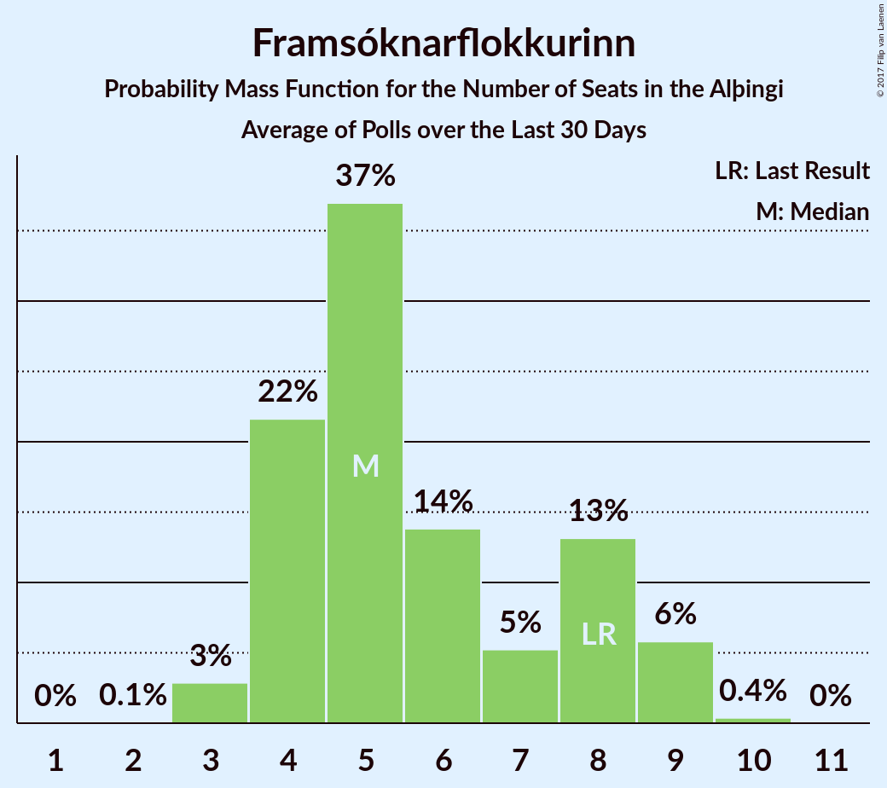

# Framsóknarflokkurinn

<a href="#voting-intentions">Voting Intentions</a> | <a href="#seats">Seats</a>

## Voting Intentions

Last result: **11.5%** (General Election of 29 October 2016)

### Confidence Intervals

| Period     | Polling firm/Commissioner(s) | Median | 80% Confidence Interval | 90% Confidence Interval | 95% Confidence Interval | 99% Confidence Interval |
|:----------:|:----------------:|:-----------:|:-----------------------:|:-----------------------:|:-----------------------:|:-----------------------:|
| N/A | [Poll Average](average.html) | 8.4% | 6.1–12.0% | 5.7–12.7% | 5.5–13.1% | 5.1–14.0% |
| [26–27 October 2017](2017-10-27-MMR.html) | MMR | 11.7% | 10.5–13.2% | 10.2–13.5% | 9.9–13.9% | 9.3–14.6% |
| [23–27 October 2017](2017-10-27-Gallup.html) | Gallup | 8.9% | 8.1–9.7% | 7.9–10.0% | 7.7–10.2% | 7.4–10.6% |
| [22–25 October 2017](2017-10-25-Felagsvisindastofnun.html) | Félagsvísindastofnun   Morgunblaðið | 7.9% | 7.2–8.7% | 7.0–8.9% | 6.8–9.1% | 6.5–9.5% |
| [23–24 October 2017](2017-10-24-Frettabladid.html) | Fréttablaðið | 6.2% | 5.5–7.0% | 5.3–7.3% | 5.1–7.5% | 4.8–7.9% |
| [20–23 October 2017](2017-10-23-MMR.html) | MMR | 8.6% | 7.5–9.8% | 7.2–10.2% | 7.0–10.5% | 6.5–11.1% |
| [13–19 October 2017](2017-10-19-Gallup.html) | Gallup | 7.4% | 6.7–8.3% | 6.4–8.6% | 6.3–8.8% | 5.9–9.2% |
| [16–19 October 2017](2017-10-19-Felagsvisindastofnun.html) | Félagsvísindastofnun   Morgunblaðið | 7.1% | 6.4–7.9% | 6.2–8.1% | 6.1–8.4% | 5.7–8.7% |
| [17–18 October 2017](2017-10-18-MMR.html) | MMR | 8.0% | 7.0–9.2% | 6.7–9.5% | 6.4–9.8% | 6.0–10.4% |
| [16 October 2017](2017-10-16-Frettabladid.html) | Fréttablaðið | 7.4% | 6.4–8.8% | 6.1–9.1% | 5.8–9.5% | 5.4–10.1% |
| [29 September–12 October 2017](2017-10-12-Gallup.html) | Gallup | 7.2% | 6.5–7.9% | 6.4–8.1% | 6.2–8.3% | 5.9–8.7% |
| [9–12 October 2017](2017-10-12-Felagsvisindastofnun.html) | Félagsvísindastofnun   Morgunblaðið | 5.5% | 4.8–6.4% | 4.6–6.7% | 4.4–6.9% | 4.0–7.4% |
| [6–11 October 2017](2017-10-11-MMR.html) | MMR | 5.9% | 5.0–7.0% | 4.8–7.3% | 4.6–7.6% | 4.2–8.1% |
| [10 October 2017](2017-10-10-Frettabladid.html) | Fréttablaðið | 7.1% | 6.1–8.4% | 5.8–8.8% | 5.5–9.1% | 5.1–9.8% |
| [2–6 October 2017](2017-10-06-Felagsvisindastofnun.html) | Félagsvísindastofnun   Morgunblaðið | 5.5% | 4.7–6.6% | 4.4–6.9% | 4.2–7.2% | 3.9–7.7% |
| [2–3 October 2017](2017-10-03-Frettabladid.html) | Fréttablaðið | 5.5% | 4.6–6.7% | 4.3–7.0% | 4.1–7.3% | 3.7–7.9% |
| [26–28 September 2017](2017-09-28-MMR.html) | MMR | 6.4% | 5.5–7.5% | 5.3–7.8% | 5.1–8.1% | 4.7–8.7% |
| [15–28 September 2017](2017-09-28-Gallup.html) | Gallup | 9.9% | 9.2–10.7% | 9.0–10.9% | 8.8–11.1% | 8.4–11.6% |
| [25–28 September 2017](2017-09-28-Felagsvisindastofnun.html) | Félagsvísindastofnun   Morgunblaðið | 7.0% | 6.1–8.2% | 5.8–8.6% | 5.6–8.8% | 5.2–9.4% |
| [19–21 September 2017](2017-09-21-Felagsvisindastofnun.html) | Félagsvísindastofnun   Morgunblaðið | 10.9% | 9.7–12.3% | 9.3–12.8% | 9.1–13.1% | 8.5–13.8% |
| [15–18 September 2017](2017-09-18-Zenter.html) | Zenter | 10.5% | 9.3–11.8% | 9.0–12.2% | 8.7–12.6% | 8.1–13.2% |
| [18 September 2017](2017-09-18-Frettabladid.html) | Fréttablaðið | 10.4% | 9.1–11.9% | 8.7–12.3% | 8.4–12.7% | 7.9–13.4% |
| [10–30 August 2017](2017-08-30-Gallup.html) | Gallup | 10.8% | 10.0–11.7% | 9.8–12.0% | 9.6–12.2% | 9.2–12.6% |
| [15–18 August 2017](2017-08-18-MMR.html) | MMR | 10.1% | 8.9–11.4% | 8.6–11.8% | 8.3–12.1% | 7.8–12.8% |

### Probability Mass Function

The following table shows the probability mass function per percentage block of voting intentions for the [poll average](average.html) for Framsóknarflokkurinn.

| Voting Intentions | Probability | Accumulated | Special Marks |
|:-----------------:|:-----------:|:-----------:|:-------------:|
| 3.5–4.5% | 0% | 100% |  |
| 4.5–5.5% | 3% | 100% |  |
| 5.5–6.5% | 15% | 97% |  |
| 6.5–7.5% | 13% | 82% |  |
| 7.5–8.5% | 23% | 69% | Median |
| 8.5–9.5% | 18% | 46% |  |
| 9.5–10.5% | 6% | 28% |  |
| 10.5–11.5% | 8% | 22% | Last Result |
| 11.5–12.5% | 9% | 15% |  |
| 12.5–13.5% | 5% | 6% |  |
| 13.5–14.5% | 1.1% | 1.2% |  |
| 14.5–15.5% | 0.1% | 0.1% |  |
| 15.5–16.5% | 0% | 0% |  |

## Seats

Last result: **8** seats (General Election of 29 October 2016)

### Confidence Intervals

| Period     | Polling firm/Commissioner(s) | Median | 80% Confidence Interval | 90% Confidence Interval | 95% Confidence Interval | 99% Confidence Interval |
|:----------:|:----------------:|:------:|:-----------------------:|:-----------------------:|:-----------------------:|:-----------------------:|
| N/A | [Poll Average](average.html) | 5 | 4–8 | 4–8 | 3–8 | 3–8 |
| [26–27 October 2017](2017-10-27-MMR.html) | MMR | 8 | 8 | 8 | 8 | 8 |
| [23–27 October 2017](2017-10-27-Gallup.html) | Gallup | 6 | 5–6 | 5–7 | 5–7 | 4–8 |
| [22–25 October 2017](2017-10-25-Felagsvisindastofnun.html) | Félagsvísindastofnun   Morgunblaðið | 5 | 5 | 4–6 | 4–6 | 4–6 |
| [23–24 October 2017](2017-10-24-Frettabladid.html) | Fréttablaðið | 4 | 3–5 | 3–5 | 3–5 | 3–5 |
| [20–23 October 2017](2017-10-23-MMR.html) | MMR | 6 | 5–6 | 4–7 | 4–7 | 4–8 |
| [13–19 October 2017](2017-10-19-Gallup.html) | Gallup | 5 | 4–5 | 4–5 | 4–5 | 3–6 |
| [16–19 October 2017](2017-10-19-Felagsvisindastofnun.html) | Félagsvísindastofnun   Morgunblaðið | 4 | 4–5 | 4–5 | 4–5 | 3–5 |
| [17–18 October 2017](2017-10-18-MMR.html) | MMR | 5 | 4–6 | 4–6 | 4–6 | 4–7 |
| [16 October 2017](2017-10-16-Frettabladid.html) | Fréttablaðið | 5 | 4–6 | 4–6 | 4–6 | 3–7 |
| [29 September–12 October 2017](2017-10-12-Gallup.html) | Gallup | 4 | 4–5 | 4–5 | 4–5 | 4–6 |
| [9–12 October 2017](2017-10-12-Felagsvisindastofnun.html) | Félagsvísindastofnun   Morgunblaðið | 3 | 2–4 | 1–4 | 1–4 | 0–5 |
| [6–11 October 2017](2017-10-11-MMR.html) | MMR | 4 | 3–5 | 2–5 | 1–5 | 0–5 |
| [10 October 2017](2017-10-10-Frettabladid.html) | Fréttablaðið | 5 | 4–5 | 4–6 | 3–6 | 3–6 |
| [2–6 October 2017](2017-10-06-Felagsvisindastofnun.html) | Félagsvísindastofnun   Morgunblaðið | 4 | 1–4 | 1–4 | 0–5 | 0–5 |
| [2–3 October 2017](2017-10-03-Frettabladid.html) | Fréttablaðið | 3 | 1–4 | 0–4 | 0–5 | 0–5 |
| [26–28 September 2017](2017-09-28-MMR.html) | MMR | 4 | 3–5 | 3–5 | 3–5 | 2–6 |
| [15–28 September 2017](2017-09-28-Gallup.html) | Gallup | 7 | 6–7 | 6–8 | 6–8 | 6–8 |
| [25–28 September 2017](2017-09-28-Felagsvisindastofnun.html) | Félagsvísindastofnun   Morgunblaðið | 4 | 4–5 | 3–5 | 3–6 | 3–6 |
| [19–21 September 2017](2017-09-21-Felagsvisindastofnun.html) | Félagsvísindastofnun   Morgunblaðið | 7 | 6–8 | 6–8 | 6–8 | 5–9 |
| [15–18 September 2017](2017-09-18-Zenter.html) | Zenter | 7 | 6–8 | 6–8 | 5–8 | 5–9 |
| [18 September 2017](2017-09-18-Frettabladid.html) | Fréttablaðið | 7 | 6–8 | 5–8 | 5–9 | 5–10 |
| [10–30 August 2017](2017-08-30-Gallup.html) | Gallup | 7 | 7–8 | 7–8 | 6–8 | 6–9 |
| [15–18 August 2017](2017-08-18-MMR.html) | MMR | 7 | 6–8 | 6–8 | 5–8 | 5–9 |

### Probability Mass Function

The following table shows the probability mass function per seat for the [poll average](average.html) for Framsóknarflokkurinn.

| Number of Seats | Probability | Accumulated | Special Marks |
|:---------------:|:-----------:|:-----------:|:-------------:|
| 2 | 0.1% | 100% |  |
| 3 | 3% | 99.9% |  |
| 4 | 23% | 97% |  |
| 5 | 41% | 74% | Median |
| 6 | 4% | 32% |  |
| 7 | 0.1% | 29% |  |
| 8 | 28% | 29% | Last Result |
| 9 | 0% | 0.1% |  |
| 10 | 0% | 0.1% |  |
| 11 | 0% | 0.1% |  |
| 12 | 0.1% | 0.1% |  |
| 13 | 0% | 0% |  |

