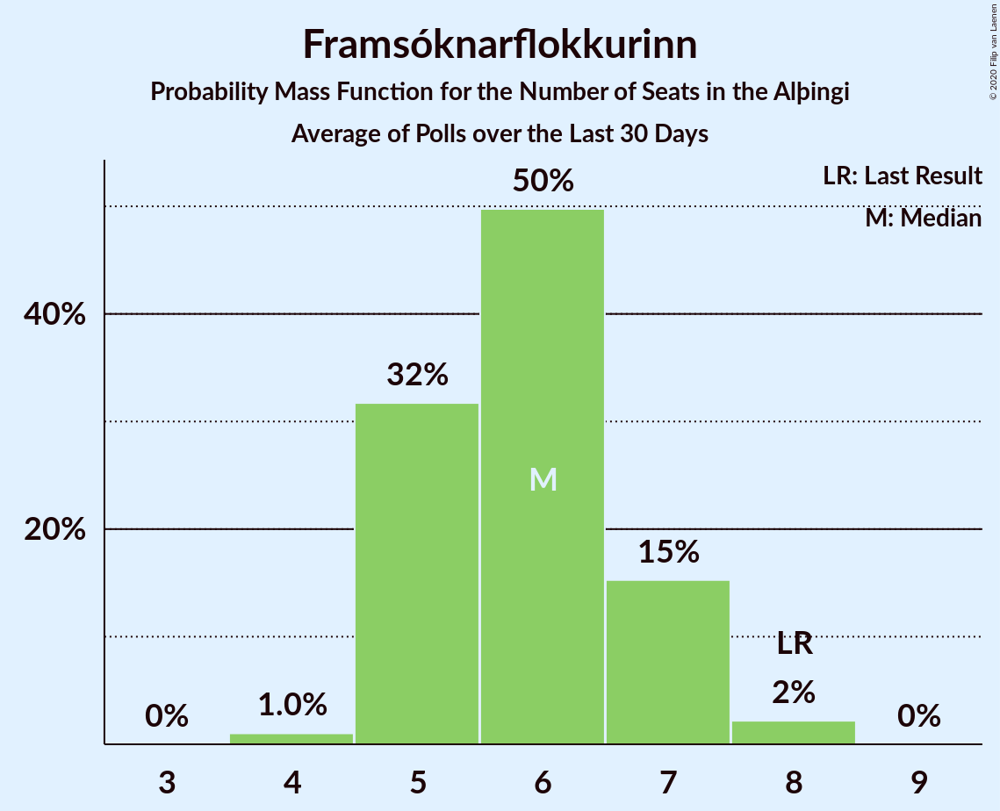

# Framsóknarflokkurinn

<a href="#voting-intentions">Voting Intentions</a> | <a href="#seats">Seats</a>

## Voting Intentions

Last result: **10.7%** (General Election of 28 October 2017)

### Confidence Intervals

| Period     | Polling firm/Commissioner(s) | Median | 80% Confidence Interval | 90% Confidence Interval | 95% Confidence Interval | 99% Confidence Interval |
|:----------:|:----------------:|:-----------:|:-----------------------:|:-----------------------:|:-----------------------:|:-----------------------:|
| N/A | [Poll Average](average.html) | 8.6% | 7.9–9.5% | 7.6–9.9% | 7.3–10.2% | 6.7–11.0% |
| [23–28 July 2020](2020-07-28-MMR.html) | MMR | 8.6% | 7.6–9.9% | 7.3–10.3% | 7.0–10.6% | 6.5–11.2% |
| [2–30 June 2020](2020-06-30-Gallup.html) | Gallup | 8.6% | 8.1–9.1% | 8.0–9.3% | 7.9–9.4% | 7.7–9.6% |
| [16–19 June 2020](2020-06-19-MMR.html) | MMR | 6.1% | 5.3–7.2% | 5.0–7.5% | 4.8–7.7% | 4.5–8.3% |
| [4 May–1 June 2020](2020-06-01-Gallup.html) | Gallup | 7.7% | 7.3–8.2% | 7.2–8.3% | 7.1–8.4% | 6.9–8.7% |
| [19–25 May 2020](2020-05-25-MMR.html) | MMR | 6.4% | 5.5–7.5% | 5.3–7.9% | 5.1–8.1% | 4.7–8.7% |
| [30 March–3 May 2020](2020-05-03-Gallup.html) | Gallup | 8.4% | 8.0–8.9% | 7.8–9.0% | 7.8–9.1% | 7.5–9.4% |
| [15–17 April 2020](2020-04-17-MMR.html) | MMR | 9.8% | 8.7–11.1% | 8.4–11.4% | 8.1–11.8% | 7.7–12.4% |
| [3–7 April 2020](2020-04-07-MMR.html) | MMR | 8.8% | 7.8–10.1% | 7.5–10.4% | 7.2–10.7% | 6.7–11.4% |
| [2–29 March 2020](2020-03-29-Gallup.html) | Gallup | 8.1% | 7.7–8.6% | 7.5–8.7% | 7.4–8.8% | 7.2–9.1% |
| [18–20 March 2020](2020-03-20-MMR.html) | MMR | 8.2% | 7.2–9.4% | 6.9–9.8% | 6.7–10.1% | 6.2–10.7% |
| [3 February–1 March 2020](2020-03-01-Gallup.html) | Gallup | 6.9% | 6.4–7.4% | 6.3–7.6% | 6.2–7.7% | 5.9–7.9% |
| [6–10 February 2020](2020-02-10-MMR.html) | MMR | 6.8% | 5.9–7.9% | 5.6–8.2% | 5.4–8.5% | 5.0–9.1% |
| [3 January–2 February 2020](2020-02-02-Gallup.html) | Gallup | 7.8% | 7.3–8.4% | 7.2–8.5% | 7.1–8.7% | 6.9–8.9% |
| [28 January 2020](2020-01-28-MMR.html) | MMR | 7.1% | 6.2–8.4% | 5.9–8.7% | 5.6–9.0% | 5.2–9.6% |
| [3–13 January 2020](2020-01-13-MMR.html) | MMR | 8.2% | 7.5–9.0% | 7.3–9.3% | 7.1–9.5% | 6.8–9.9% |
| [2 December 2019–1 January 2020](2020-01-01-Gallup.html) | Gallup | 8.6% | 8.1–9.2% | 8.0–9.4% | 7.8–9.5% | 7.6–9.8% |
| [13–19 December 2019](2019-12-19-MMR.html) | MMR | 8.3% | 7.3–9.5% | 7.0–9.8% | 6.7–10.2% | 6.3–10.8% |
| [28 October–1 December 2019](2019-12-01-Gallup.html) | Gallup | 7.8% | 7.4–8.3% | 7.3–8.4% | 7.2–8.5% | 7.0–8.7% |
| [15–22 November 2019](2019-11-22-MMR.html) | MMR | 9.4% | 8.4–10.7% | 8.1–11.0% | 7.8–11.3% | 7.3–12.0% |
| [30 September–27 October 2019](2019-10-27-Gallup.html) | Gallup | 8.2% | 7.8–8.7% | 7.6–8.9% | 7.5–9.0% | 7.3–9.2% |
| [21–25 October 2019](2019-10-25-MMR.html) | MMR | 10.0% | 8.8–11.3% | 8.5–11.7% | 8.2–12.0% | 7.7–12.7% |
| [10–14 October 2019](2019-10-14-Zenter.html) | Zenter | 7.3% | 6.4–8.4% | 6.2–8.6% | 6.0–8.9% | 5.6–9.4% |
| [30 September–9 October 2019](2019-10-09-MMR.html) | MMR | 10.1% | 9.3–11.0% | 9.1–11.3% | 8.9–11.5% | 8.6–11.9% |
| [1–30 September 2019](2019-09-30-Gallup.html) | Gallup | 7.9% | 7.2–8.8% | 7.0–9.0% | 6.8–9.2% | 6.5–9.6% |
| [9–16 September 2019](2019-09-16-MMR.html) | MMR | 11.8% | 10.6–13.1% | 10.2–13.5% | 10.0–13.9% | 9.4–14.6% |
| [29 July–1 September 2019](2019-09-01-Gallup.html) | Gallup | 8.3% | 7.8–8.9% | 7.6–9.1% | 7.5–9.2% | 7.2–9.5% |
| [12–19 August 2019](2019-08-19-MMR.html) | MMR | 10.4% | 9.3–11.8% | 8.9–12.1% | 8.7–12.5% | 8.1–13.1% |
| [1–31 July 2019](2019-07-31-Gallup.html) | Gallup | 8.5% | 7.8–9.4% | 7.6–9.6% | 7.4–9.8% | 7.1–10.3% |
| [24–26 July 2019](2019-07-26-Zenter.html) | Zenter | 8.2% | 7.1–9.5% | 6.9–9.9% | 6.6–10.2% | 6.1–10.9% |
| [4–17 July 2019](2019-07-17-MMR.html) | MMR | 8.4% | 7.6–9.2% | 7.4–9.4% | 7.2–9.7% | 6.9–10.1% |
| [31 May–30 June 2019](2019-06-30-Gallup.html) | Gallup | 8.6% | 8.0–9.3% | 7.8–9.4% | 7.7–9.6% | 7.4–10.0% |
| [7–14 June 2019](2019-06-14-MMR.html) | MMR | 7.7% | 6.7–8.9% | 6.4–9.2% | 6.2–9.5% | 5.7–10.1% |
| [3–30 May 2019](2019-05-30-Gallup.html) | Gallup | 8.5% | 7.9–9.2% | 7.7–9.4% | 7.6–9.5% | 7.3–9.8% |
| [23–29 May 2019](2019-05-29-MMR.html) | MMR | 9.7% | 8.5–11.0% | 8.2–11.4% | 7.9–11.7% | 7.4–12.4% |
| [14–16 May 2019](2019-05-16-MMR.html) | MMR | 11.6% | 10.3–13.0% | 10.0–13.4% | 9.7–13.7% | 9.1–14.4% |
| [30 April–3 May 2019](2019-05-03-MMR.html) | MMR | 9.8% | 8.6–11.1% | 8.3–11.5% | 8.0–11.8% | 7.5–12.5% |
| [5–30 April 2019](2019-04-30-Gallup.html) | Gallup | 8.0% | 7.4–8.7% | 7.2–8.9% | 7.1–9.0% | 6.8–9.4% |
| [13 April 2019](2019-04-13-MMR.html) | MMR | 11.2% | 10.0–12.7% | 9.6–13.1% | 9.3–13.4% | 8.7–14.1% |
| [4–9 April 2019](2019-04-09-MMR.html) | MMR | 8.7% | 7.7–10.0% | 7.3–10.4% | 7.1–10.7% | 6.6–11.4% |
| [1–31 March 2019](2019-03-31-Gallup.html) | Gallup | 9.0% | 8.4–9.6% | 8.2–9.8% | 8.1–10.0% | 7.8–10.3% |
| [11–14 March 2019](2019-03-14-MMR.html) | MMR | 11.1% | 10.0–12.5% | 9.6–12.9% | 9.3–13.2% | 8.8–13.9% |
| [31 January–28 February 2019](2019-02-28-Gallup.html) | Gallup | 9.0% | 8.4–9.6% | 8.3–9.8% | 8.1–10.0% | 7.9–10.3% |
| [11–15 February 2019](2019-02-15-MMR.html) | MMR | 13.5% | 12.1–15.0% | 11.8–15.5% | 11.4–15.8% | 10.8–16.6% |
| [7–31 January 2019](2019-01-31-Gallup.html) | Gallup | 8.8% | 8.1–9.6% | 7.9–9.8% | 7.7–10.0% | 7.4–10.4% |
| [28 January 2019](2019-01-28-MMR.html) | MMR | 12.6% | 11.3–14.2% | 10.9–14.6% | 10.6–15.0% | 10.0–15.7% |
| [4–14 January 2019](2019-01-14-MMR.html) | MMR | 11.7% | 10.8–12.7% | 10.6–12.9% | 10.4–13.2% | 10.0–13.6% |
| [3 December 2018–1 January 2019](2019-01-01-Gallup.html) | Gallup | 11.4% | 10.7–12.2% | 10.5–12.4% | 10.3–12.6% | 10.0–13.0% |
| [5–11 December 2018](2018-12-11-MMR.html) | MMR | 12.5% | 11.2–14.0% | 10.9–14.4% | 10.6–14.7% | 10.0–15.5% |
| [3–4 December 2018](2018-12-04-Zenter.html) | Zenter | 8.5% | 7.6–9.6% | 7.3–9.9% | 7.1–10.2% | 6.7–10.7% |
| [30 November–3 December 2018](2018-12-03-Maskína.html) | Maskína | 8.8% | 7.8–9.9% | 7.6–10.2% | 7.4–10.4% | 6.9–11.0% |
| [3 November–2 December 2018](2018-12-02-Gallup.html) | Gallup | 7.5% | 6.9–8.2% | 6.8–8.3% | 6.6–8.5% | 6.4–8.8% |
| [21 November 2018](2018-11-21-MMR.html) | MMR | 7.5% | 6.5–8.7% | 6.2–9.1% | 5.9–9.4% | 5.5–10.0% |
| [8–12 November 2018](2018-11-12-MMR.html) | MMR | 8.8% | 7.7–10.0% | 7.5–10.3% | 7.2–10.7% | 6.8–11.3% |
| [2–31 October 2018](2018-10-31-Gallup.html) | Gallup | 7.2% | 6.7–7.8% | 6.5–8.0% | 6.4–8.1% | 6.1–8.4% |
| [22 October 2018](2018-10-22-MMR.html) | MMR | 7.8% | 6.8–9.1% | 6.5–9.4% | 6.2–9.7% | 5.8–10.4% |
| [3–9 October 2018](2018-10-09-MMR.html) | MMR | 8.9% | 7.8–10.2% | 7.5–10.6% | 7.2–10.9% | 6.7–11.6% |
| [3 September–1 October 2018](2018-10-01-Gallup.html) | Gallup | 6.6% | 6.0–7.2% | 5.9–7.4% | 5.7–7.6% | 5.5–7.9% |
| [7–12 September 2018](2018-09-12-MMR.html) | MMR | 8.1% | 7.0–9.3% | 6.8–9.7% | 6.5–10.0% | 6.1–10.6% |
| [2 August–2 September 2018](2018-09-02-Gallup.html) | Gallup | 8.2% | 7.7–8.8% | 7.5–9.0% | 7.4–9.1% | 7.1–9.4% |
| [10 August 2018](2018-08-10-MMR.html) | MMR | 8.9% | 7.8–10.2% | 7.5–10.6% | 7.2–10.9% | 6.7–11.6% |
| [29 June–30 July 2018](2018-07-30-Gallup.html) | Gallup | 9.2% | 8.6–9.8% | 8.4–10.0% | 8.3–10.2% | 8.0–10.5% |
| [31 May–1 July 2018](2018-07-01-Gallup.html) | Gallup | 8.5% | 7.9–9.2% | 7.7–9.4% | 7.6–9.5% | 7.3–9.8% |
| [12–18 June 2018](2018-06-18-MMR.html) | MMR | 9.5% | 8.4–10.9% | 8.1–11.2% | 7.8–11.6% | 7.3–12.3% |
| [2–31 May 2018](2018-05-31-Gallup.html) | Gallup | 8.9% | 8.3–9.5% | 8.2–9.7% | 8.0–9.8% | 7.8–10.1% |
| [16–22 May 2018](2018-05-22-MMR.html) | MMR | 10.1% | 8.9–11.5% | 8.6–11.9% | 8.3–12.2% | 7.8–12.9% |
| [2 May 2018](2018-05-02-MMR.html) | MMR | 8.2% | 7.2–9.5% | 6.9–9.9% | 6.6–10.2% | 6.1–10.9% |
| [27 March–29 April 2018](2018-04-29-Gallup.html) | Gallup | 9.6% | 9.0–10.2% | 8.9–10.4% | 8.7–10.6% | 8.4–10.9% |
| [13–19 April 2018](2018-04-19-MMR.html) | MMR | 7.3% | 6.2–8.5% | 6.0–8.8% | 5.7–9.1% | 5.3–9.7% |
| [1–26 March 2018](2018-03-26-Gallup.html) | Gallup | 9.2% | 8.6–9.9% | 8.4–10.1% | 8.2–10.3% | 7.9–10.6% |
| [19 March 2018](2018-03-19-MMR.html) | MMR | 9.0% | 7.9–10.3% | 7.6–10.7% | 7.3–11.1% | 6.8–11.7% |
| [1–28 February 2018](2018-02-28-Gallup.html) | Gallup | 9.3% | 8.7–10.0% | 8.5–10.2% | 8.3–10.4% | 8.0–10.7% |
| [4–31 January 2018](2018-01-31-Gallup.html) | Gallup | 9.5% | 8.9–10.2% | 8.7–10.4% | 8.5–10.6% | 8.2–11.0% |
| [25–30 January 2018](2018-01-30-MMR.html) | MMR | 11.2% | 10.0–12.6% | 9.6–13.0% | 9.3–13.4% | 8.8–14.1% |
| [9–17 January 2018](2018-01-17-MMR.html) | MMR | 11.2% | 10.3–12.3% | 10.0–12.6% | 9.8–12.9% | 9.3–13.4% |
| [30 November–28 December 2017](2017-12-28-Gallup.html) | Gallup | 11.9% | 11.3–12.6% | 11.1–12.8% | 10.9–13.0% | 10.6–13.3% |
| [12–15 December 2017](2017-12-15-MMR.html) | MMR | 8.6% | 7.5–9.9% | 7.2–10.2% | 6.9–10.5% | 6.4–11.2% |
| [4 December 2017](2017-12-04-FréttablaðiðStöð2Vísir.html) | Fréttablaðið/Stöð 2/Vísir | 11.3% | 10.0–12.9% | 9.6–13.3% | 9.3–13.7% | 8.7–14.5% |
| [4 December 2017](2017-12-04-Fréttablaðið-Stöð2-Vísir.html) | Fréttablaðið, Stöð 2 and Vísir | 11.3% | 10.0–12.9% | 9.6–13.3% | 9.3–13.7% | 8.7–14.5% |
| [8–30 November 2017](2017-11-30-Gallup.html) | Gallup | 10.4% | 9.6–11.3% | 9.4–11.5% | 9.2–11.7% | 8.9–12.1% |
| [14–17 November 2017](2017-11-17-MMR.html) | MMR | 9.5% | 8.4–10.9% | 8.1–11.2% | 7.8–11.6% | 7.3–12.2% |

### Probability Mass Function

The following table shows the probability mass function per percentage block of voting intentions for the [poll average](average.html) for Framsóknarflokkurinn.

| Voting Intentions | Probability | Accumulated | Special Marks |
|:-----------------:|:-----------:|:-----------:|:-------------:|
| 4.5–5.5% | 0% | 100% |  |
| 5.5–6.5% | 0.3% | 100% |  |
| 6.5–7.5% | 5% | 99.7% |  |
| 7.5–8.5% | 39% | 95% |  |
| 8.5–9.5% | 47% | 56% | Median |
| 9.5–10.5% | 8% | 9% |  |
| 10.5–11.5% | 1.2% | 1.3% | Last Result |
| 11.5–12.5% | 0.1% | 0.1% |  |
| 12.5–13.5% | 0% | 0% |  |

## Seats

Last result: **8** seats (General Election of 28 October 2017)

### Confidence Intervals

| Period     | Polling firm/Commissioner(s) | Median | 80% Confidence Interval | 90% Confidence Interval | 95% Confidence Interval | 99% Confidence Interval |
|:----------:|:----------------:|:------:|:-----------------------:|:-----------------------:|:-----------------------:|:-----------------------:|
| N/A | [Poll Average](average.html) | 6 | 5–6 | 5–7 | 4–7 | 4–8 |
| [23–28 July 2020](2020-07-28-MMR.html) | MMR | 6 | 5–7 | 4–7 | 4–8 | 4–8 |
| [2–30 June 2020](2020-06-30-Gallup.html) | Gallup | 6 | 5–6 | 5–6 | 5–6 | 5–6 |
| [16–19 June 2020](2020-06-19-MMR.html) | MMR | 4 | 3–5 | 2–5 | 2–5 | 2–6 |
| [4 May–1 June 2020](2020-06-01-Gallup.html) | Gallup | 5 | 5 | 5 | 5 | 4–6 |
| [19–25 May 2020](2020-05-25-MMR.html) | MMR | 4 | 3–5 | 3–5 | 3–5 | 2–6 |
| [30 March–3 May 2020](2020-05-03-Gallup.html) | Gallup | 5 | 5–6 | 5–6 | 5–6 | 5–6 |
| [15–17 April 2020](2020-04-17-MMR.html) | MMR | 6 | 6–8 | 5–8 | 5–8 | 5–9 |
| [3–7 April 2020](2020-04-07-MMR.html) | MMR | 6 | 5–7 | 5–7 | 5–7 | 4–8 |
| [2–29 March 2020](2020-03-29-Gallup.html) | Gallup | 5 | 5–6 | 5–6 | 5–6 | 5–6 |
| [18–20 March 2020](2020-03-20-MMR.html) | MMR | 5 | 4–6 | 4–7 | 4–7 | 4–7 |
| [3 February–1 March 2020](2020-03-01-Gallup.html) | Gallup | 4 | 4–5 | 4–5 | 4–5 | 4–5 |
| [6–10 February 2020](2020-02-10-MMR.html) | MMR | 4 | 4–5 | 3–5 | 3–6 | 2–6 |
| [3 January–2 February 2020](2020-02-02-Gallup.html) | Gallup | 5 | 5 | 5 | 5 | 4–6 |
| [28 January 2020](2020-01-28-MMR.html) | MMR | 5 | 4–6 | 3–6 | 3–6 | 3–6 |
| [3–13 January 2020](2020-01-13-MMR.html) | MMR | 6 | 5–6 | 5–6 | 5–6 | 4–6 |
| [2 December 2019–1 January 2020](2020-01-01-Gallup.html) | Gallup | 6 | 5–6 | 5–6 | 5–6 | 5–6 |
| [13–19 December 2019](2019-12-19-MMR.html) | MMR | 5 | 4–6 | 4–7 | 4–7 | 4–7 |
| [28 October–1 December 2019](2019-12-01-Gallup.html) | Gallup | 5 | 5 | 5 | 4–6 | 4–6 |
| [15–22 November 2019](2019-11-22-MMR.html) | MMR | 6 | 6–8 | 5–8 | 5–8 | 5–8 |
| [30 September–27 October 2019](2019-10-27-Gallup.html) | Gallup | 5 | 4–6 | 4–6 | 4–6 | 4–6 |
| [21–25 October 2019](2019-10-25-MMR.html) | MMR | 6 | 5–8 | 5–8 | 5–9 | 5–10 |
| [10–14 October 2019](2019-10-14-Zenter.html) | Zenter | 5 | 4–5 | 4–6 | 4–6 | 3–6 |
| [30 September–9 October 2019](2019-10-09-MMR.html) | MMR | 6 | 6–7 | 6–8 | 6–8 | 6–9 |
| [1–30 September 2019](2019-09-30-Gallup.html) | Gallup | 5 | 4–6 | 4–6 | 4–6 | 4–6 |
| [9–16 September 2019](2019-09-16-MMR.html) | MMR | 8 | 7–10 | 7–10 | 7–10 | 6–10 |
| [29 July–1 September 2019](2019-09-01-Gallup.html) | Gallup | 6 | 5–6 | 5–6 | 5–6 | 5–6 |
| [12–19 August 2019](2019-08-19-MMR.html) | MMR | 7 | 6–8 | 6–8 | 6–9 | 5–10 |
| [1–31 July 2019](2019-07-31-Gallup.html) | Gallup | 5 | 4–6 | 4–6 | 4–7 | 4–7 |
| [24–26 July 2019](2019-07-26-Zenter.html) | Zenter | 5 | 4–6 | 4–7 | 4–7 | 4–7 |
| [4–17 July 2019](2019-07-17-MMR.html) | MMR | 5 | 5–6 | 5–7 | 5–7 | 4–7 |
| [31 May–30 June 2019](2019-06-30-Gallup.html) | Gallup | 5 | 5–6 | 5–7 | 5–7 | 4–7 |
| [7–14 June 2019](2019-06-14-MMR.html) | MMR | 5 | 4–6 | 4–6 | 4–6 | 3–7 |
| [3–30 May 2019](2019-05-30-Gallup.html) | Gallup | 5 | 5–7 | 5–7 | 5–7 | 5–7 |
| [23–29 May 2019](2019-05-29-MMR.html) | MMR | 6 | 6–8 | 5–8 | 5–8 | 5–9 |
| [14–16 May 2019](2019-05-16-MMR.html) | MMR | 8 | 7–9 | 6–9 | 6–10 | 6–11 |
| [30 April–3 May 2019](2019-05-03-MMR.html) | MMR | 7 | 6–8 | 5–8 | 5–9 | 5–10 |
| [5–30 April 2019](2019-04-30-Gallup.html) | Gallup | 5 | 5–6 | 5–6 | 5–6 | 4–6 |
| [13 April 2019](2019-04-13-MMR.html) | MMR | 8 | 7–9 | 6–10 | 6–10 | 6–11 |
| [4–9 April 2019](2019-04-09-MMR.html) | MMR | 6 | 5–7 | 4–7 | 4–8 | 4–8 |
| [1–31 March 2019](2019-03-31-Gallup.html) | Gallup | 6 | 6 | 5–6 | 5–7 | 5–7 |
| [11–14 March 2019](2019-03-14-MMR.html) | MMR | 8 | 7–8 | 6–8 | 6–9 | 6–10 |
| [31 January–28 February 2019](2019-02-28-Gallup.html) | Gallup | 6 | 5–6 | 5–7 | 5–7 | 5–8 |
| [11–15 February 2019](2019-02-15-MMR.html) | MMR | 10 | 8–11 | 8–12 | 8–12 | 8–12 |
| [7–31 January 2019](2019-01-31-Gallup.html) | Gallup | 6 | 5–7 | 5–7 | 5–7 | 5–7 |
| [28 January 2019](2019-01-28-MMR.html) | MMR | 9 | 8–10 | 8–11 | 7–11 | 6–11 |
| [4–14 January 2019](2019-01-14-MMR.html) | MMR | 8 | 8–9 | 7–9 | 7–10 | 7–10 |
| [3 December 2018–1 January 2019](2019-01-01-Gallup.html) | Gallup | 8 | 7–9 | 6–10 | 6–10 | 6–10 |
| [5–11 December 2018](2018-12-11-MMR.html) | MMR | 9 | 8–10 | 7–10 | 7–10 | 7–11 |
| [3–4 December 2018](2018-12-04-Zenter.html) | Zenter | 6 | 5–6 | 5–7 | 4–7 | 4–7 |
| [30 November–3 December 2018](2018-12-03-Maskína.html) | Maskína | 6 | 5–6 | 5–7 | 5–7 | 4–7 |
| [3 November–2 December 2018](2018-12-02-Gallup.html) | Gallup | 4 | 4–5 | 4–5 | 4–5 | 4–5 |
| [21 November 2018](2018-11-21-MMR.html) | MMR | 4 | 4–5 | 4–6 | 3–6 | 3–6 |
| [8–12 November 2018](2018-11-12-MMR.html) | MMR | 5 | 5–6 | 4–7 | 4–7 | 4–8 |
| [2–31 October 2018](2018-10-31-Gallup.html) | Gallup | 4 | 4–5 | 4–5 | 3–5 | 3–5 |
| [22 October 2018](2018-10-22-MMR.html) | MMR | 5 | 4–5 | 4–6 | 4–6 | 3–6 |
| [3–9 October 2018](2018-10-09-MMR.html) | MMR | 6 | 5–6 | 5–7 | 4–7 | 4–8 |
| [3 September–1 October 2018](2018-10-01-Gallup.html) | Gallup | 4 | 4 | 3–5 | 3–5 | 3–5 |
| [7–12 September 2018](2018-09-12-MMR.html) | MMR | 5 | 4–6 | 4–6 | 4–6 | 4–7 |
| [2 August–2 September 2018](2018-09-02-Gallup.html) | Gallup | 5 | 5–6 | 5–6 | 5–6 | 4–6 |
| [10 August 2018](2018-08-10-MMR.html) | MMR | 6 | 5–6 | 5–7 | 4–7 | 4–8 |
| [29 June–30 July 2018](2018-07-30-Gallup.html) | Gallup | 5 | 5–6 | 5–7 | 5–7 | 5–7 |
| [31 May–1 July 2018](2018-07-01-Gallup.html) | Gallup | 6 | 5–6 | 5–6 | 5–6 | 5–6 |
| [12–18 June 2018](2018-06-18-MMR.html) | MMR | 6 | 5–7 | 5–7 | 5–8 | 4–8 |
| [2–31 May 2018](2018-05-31-Gallup.html) | Gallup | 6 | 5–6 | 5–6 | 5–6 | 5–7 |
| [16–22 May 2018](2018-05-22-MMR.html) | MMR | 7 | 6–8 | 5–8 | 5–8 | 5–9 |
| [2 May 2018](2018-05-02-MMR.html) | MMR | 5 | 5–6 | 4–6 | 4–6 | 4–7 |
| [27 March–29 April 2018](2018-04-29-Gallup.html) | Gallup | 6 | 6–7 | 6–7 | 6–8 | 5–8 |
| [13–19 April 2018](2018-04-19-MMR.html) | MMR | 4 | 4–5 | 4–6 | 3–6 | 3–6 |
| [1–26 March 2018](2018-03-26-Gallup.html) | Gallup | 6 | 5–6 | 5–7 | 5–7 | 5–7 |
| [19 March 2018](2018-03-19-MMR.html) | MMR | 6 | 5–7 | 5–7 | 5–7 | 4–8 |
| [1–28 February 2018](2018-02-28-Gallup.html) | Gallup | 6 | 5–6 | 5–7 | 5–7 | 5–8 |
| [4–31 January 2018](2018-01-31-Gallup.html) | Gallup | 6 | 5–7 | 5–8 | 5–8 | 5–8 |
| [25–30 January 2018](2018-01-30-MMR.html) | MMR | 8 | 7–9 | 6–9 | 6–9 | 6–10 |
| [9–17 January 2018](2018-01-17-MMR.html) | MMR | 8 | 7–8 | 6–8 | 6–8 | 6–9 |
| [30 November–28 December 2017](2017-12-28-Gallup.html) | Gallup | 8 | 8–9 | 8–9 | 8–9 | 7–10 |
| [12–15 December 2017](2017-12-15-MMR.html) | MMR | 6 | 5–7 | 5–7 | 4–7 | 4–8 |
| [4 December 2017](2017-12-04-FréttablaðiðStöð2Vísir.html) | Fréttablaðið/Stöð 2/Vísir | 8 | 7–9 | 6–9 | 6–10 | 6–10 |
| [4 December 2017](2017-12-04-Fréttablaðið-Stöð2-Vísir.html) | Fréttablaðið, Stöð 2 and Vísir | 8 | 7–9 | 6–9 | 6–9 | 5–10 |
| [8–30 November 2017](2017-11-30-Gallup.html) | Gallup | 8 | 6–8 | 6–8 | 6–8 | 5–8 |
| [14–17 November 2017](2017-11-17-MMR.html) | MMR | 6 | 5–7 | 5–7 | 5–8 | 4–8 |

### Probability Mass Function

The following table shows the probability mass function per seat for the [poll average](average.html) for Framsóknarflokkurinn.

| Number of Seats | Probability | Accumulated | Special Marks |
|:---------------:|:-----------:|:-----------:|:-------------:|
| 4 | 3% | 100% |  |
| 5 | 36% | 97% |  |
| 6 | 53% | 62% | Median |
| 7 | 7% | 8% |  |
| 8 | 2% | 2% | Last Result |
| 9 | 0% | 0% |  |

