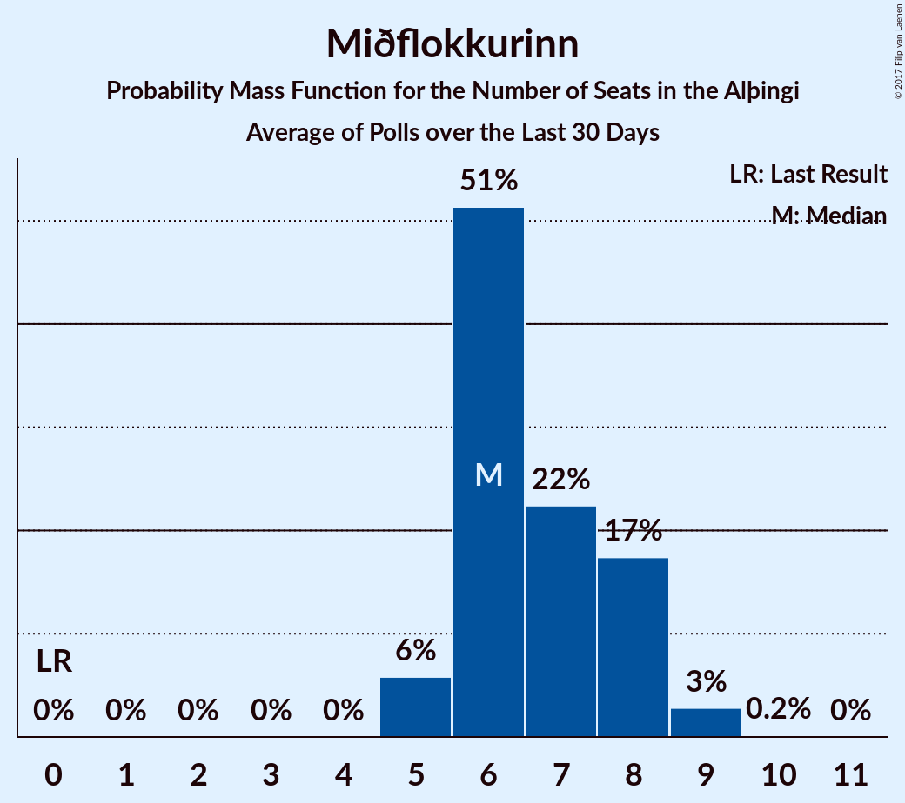

# Miðflokkurinn

<a href="#voting-intentions">Voting Intentions</a> | <a href="#seats">Seats</a>

## Voting Intentions

Last result: **0.0%** (General Election of 29 October 2016)

### Confidence Intervals

| Period     | Polling firm/Commissioner(s) | Median | 80% Confidence Interval | 90% Confidence Interval | 95% Confidence Interval | 99% Confidence Interval |
|:----------:|:----------------:|:-----------:|:-----------------------:|:-----------------------:|:-----------------------:|:-----------------------:|
| N/A | [Poll Average](average.html) | 9.8% | 8.7–12.7% | 8.5–13.3% | 8.3–13.8% | 7.9–14.7% |
| [22–25 October 2017](2017-10-25-Felagsvisindastofnun.html) | Félagsvísindastofnun   Morgunblaðið | 9.3% | 8.6–10.1% | 8.3–10.3% | 8.2–10.5% | 7.8–11.0% |
| [23–24 October 2017](2017-10-24-Frettabladid.html) | Fréttablaðið | 9.6% | 8.7–10.6% | 8.5–10.9% | 8.3–11.2% | 7.9–11.7% |
| [20–23 October 2017](2017-10-23-MMR.html) | MMR | 12.4% | 11.1–13.8% | 10.7–14.2% | 10.4–14.6% | 9.9–15.3% |
| [13–19 October 2017](2017-10-19-Gallup.html) | Gallup | 9.4% | 8.6–10.4% | 8.3–10.7% | 8.1–10.9% | 7.7–11.4% |
| [16–19 October 2017](2017-10-19-Felagsvisindastofnun.html) | Félagsvísindastofnun   Morgunblaðið | 9.8% | 9.0–10.7% | 8.7–11.0% | 8.6–11.2% | 8.2–11.6% |
| [17–18 October 2017](2017-10-18-MMR.html) | MMR | 11.0% | 9.9–12.4% | 9.5–12.8% | 9.2–13.1% | 8.7–13.8% |
| [16 October 2017](2017-10-16-Frettabladid.html) | Fréttablaðið | 10.7% | 9.4–12.2% | 9.0–12.6% | 8.7–13.0% | 8.1–13.7% |
| [29 September–12 October 2017](2017-10-12-Gallup.html) | Gallup | 9.5% | 8.7–10.3% | 8.6–10.6% | 8.4–10.8% | 8.0–11.2% |
| [9–12 October 2017](2017-10-12-Felagsvisindastofnun.html) | Félagsvísindastofnun   Morgunblaðið | 6.4% | 5.6–7.4% | 5.4–7.6% | 5.2–7.9% | 4.8–8.4% |
| [6–11 October 2017](2017-10-11-MMR.html) | MMR | 10.7% | 9.5–12.0% | 9.1–12.4% | 8.9–12.8% | 8.3–13.4% |
| [10 October 2017](2017-10-10-Frettabladid.html) | Fréttablaðið | 9.2% | 8.0–10.7% | 7.7–11.1% | 7.4–11.4% | 6.9–12.1% |
| [2–6 October 2017](2017-10-06-Felagsvisindastofnun.html) | Félagsvísindastofnun   Morgunblaðið | 9.4% | 8.3–10.8% | 8.0–11.1% | 7.7–11.5% | 7.2–12.1% |
| [2–3 October 2017](2017-10-03-Frettabladid.html) | Fréttablaðið | 8.9% | 7.7–10.3% | 7.4–10.7% | 7.1–11.1% | 6.6–11.8% |
| [26–28 September 2017](2017-09-28-MMR.html) | MMR | 7.3% | 6.4–8.5% | 6.1–8.8% | 5.9–9.1% | 5.4–9.7% |
| [15–28 September 2017](2017-09-28-Gallup.html) | Gallup | 2.0% | 1.7–2.4% | 1.6–2.5% | 1.5–2.6% | 1.4–2.9% |
| [25–28 September 2017](2017-09-28-Felagsvisindastofnun.html) | Félagsvísindastofnun   Morgunblaðið | 4.6% | 3.9–5.6% | 3.6–5.9% | 3.5–6.2% | 3.1–6.7% |
| [19–21 September 2017](2017-09-21-Felagsvisindastofnun.html) | Félagsvísindastofnun   Morgunblaðið | 0.0% | N/A | N/A | N/A | N/A |
| [15–18 September 2017](2017-09-18-Zenter.html) | Zenter | 0.0% | N/A | N/A | N/A | N/A |
| [18 September 2017](2017-09-18-Frettabladid.html) | Fréttablaðið | 0.0% | N/A | N/A | N/A | N/A |
| [10–30 August 2017](2017-08-30-Gallup.html) | Gallup | 0.0% | N/A | N/A | N/A | N/A |
| [15–18 August 2017](2017-08-18-MMR.html) | MMR | 0.0% | N/A | N/A | N/A | N/A |

### Probability Mass Function

The following table shows the probability mass function per percentage block of voting intentions for the [poll average](average.html) for Miðflokkurinn.

| Voting Intentions | Probability | Accumulated | Special Marks |
|:-----------------:|:-----------:|:-----------:|:-------------:|
| 0.0–0.5% | 0% | 100% | Last Result |
| 0.5–1.5% | 0% | 100% |  |
| 1.5–2.5% | 0% | 100% |  |
| 2.5–3.5% | 0% | 100% |  |
| 3.5–4.5% | 0% | 100% |  |
| 4.5–5.5% | 0% | 100% |  |
| 5.5–6.5% | 0% | 100% |  |
| 6.5–7.5% | 0.1% | 100% |  |
| 7.5–8.5% | 6% | 99.9% |  |
| 8.5–9.5% | 35% | 94% |  |
| 9.5–10.5% | 29% | 58% | Median |
| 10.5–11.5% | 9% | 29% |  |
| 11.5–12.5% | 9% | 20% |  |
| 12.5–13.5% | 8% | 11% |  |
| 13.5–14.5% | 3% | 4% |  |
| 14.5–15.5% | 0.6% | 0.6% |  |
| 15.5–16.5% | 0.1% | 0.1% |  |
| 16.5–17.5% | 0% | 0% |  |

## Seats

Last result: **0** seats (General Election of 29 October 2016)

### Confidence Intervals

| Period     | Polling firm/Commissioner(s) | Median | 80% Confidence Interval | 90% Confidence Interval | 95% Confidence Interval | 99% Confidence Interval |
|:----------:|:----------------:|:------:|:-----------------------:|:-----------------------:|:-----------------------:|:-----------------------:|
| N/A | [Poll Average](average.html) | 6 | 5–9 | 5–9 | 5–10 | 5–11 |
| [22–25 October 2017](2017-10-25-Felagsvisindastofnun.html) | Félagsvísindastofnun   Morgunblaðið | 6 | 5–6 | 5–7 | 5–7 | 5–7 |
| [23–24 October 2017](2017-10-24-Frettabladid.html) | Fréttablaðið | 6 | 6–7 | 6–8 | 5–8 | 5–8 |
| [20–23 October 2017](2017-10-23-MMR.html) | MMR | 8 | 8–10 | 7–10 | 7–11 | 6–12 |
| [13–19 October 2017](2017-10-19-Gallup.html) | Gallup | 6 | 5–7 | 5–7 | 5–8 | 5–8 |
| [16–19 October 2017](2017-10-19-Felagsvisindastofnun.html) | Félagsvísindastofnun   Morgunblaðið | 6 | 6–7 | 6–7 | 5–7 | 5–8 |
| [17–18 October 2017](2017-10-18-MMR.html) | MMR | 7 | 6–8 | 6–8 | 6–9 | 5–9 |
| [16 October 2017](2017-10-16-Frettabladid.html) | Fréttablaðið | 8 | 6–8 | 6–9 | 5–9 | 5–10 |
| [29 September–12 October 2017](2017-10-12-Gallup.html) | Gallup | 6 | 6–7 | 6–7 | 5–8 | 5–8 |
| [9–12 October 2017](2017-10-12-Felagsvisindastofnun.html) | Félagsvísindastofnun   Morgunblaðið | 4 | 3–5 | 3–5 | 3–5 | 2–5 |
| [6–11 October 2017](2017-10-11-MMR.html) | MMR | 7 | 6–8 | 6–9 | 6–9 | 5–9 |
| [10 October 2017](2017-10-10-Frettabladid.html) | Fréttablaðið | 6 | 5–7 | 5–8 | 5–8 | 4–8 |
| [2–6 October 2017](2017-10-06-Felagsvisindastofnun.html) | Félagsvísindastofnun   Morgunblaðið | 6 | 5–7 | 5–7 | 5–8 | 5–8 |
| [2–3 October 2017](2017-10-03-Frettabladid.html) | Fréttablaðið | 6 | 5–7 | 5–7 | 5–8 | 4–8 |
| [26–28 September 2017](2017-09-28-MMR.html) | MMR | 5 | 4–6 | 4–6 | 4–6 | 3–7 |
| [15–28 September 2017](2017-09-28-Gallup.html) | Gallup | 0 | 0 | 0 | 0 | 0 |
| [25–28 September 2017](2017-09-28-Felagsvisindastofnun.html) | Félagsvísindastofnun   Morgunblaðið | 2 | 0–3 | 0–3 | 0–4 | 0–4 |
| [19–21 September 2017](2017-09-21-Felagsvisindastofnun.html) | Félagsvísindastofnun   Morgunblaðið |  |  |  |  |  |
| [15–18 September 2017](2017-09-18-Zenter.html) | Zenter |  |  |  |  |  |
| [18 September 2017](2017-09-18-Frettabladid.html) | Fréttablaðið |  |  |  |  |  |
| [10–30 August 2017](2017-08-30-Gallup.html) | Gallup |  |  |  |  |  |
| [15–18 August 2017](2017-08-18-MMR.html) | MMR |  |  |  |  |  |

### Probability Mass Function

The following table shows the probability mass function per seat for the [poll average](average.html) for Miðflokkurinn.

| Number of Seats | Probability | Accumulated | Special Marks |
|:---------------:|:-----------:|:-----------:|:-------------:|
| 0 | 0% | 100% | Last Result |
| 1 | 0% | 100% |  |
| 2 | 0% | 100% |  |
| 3 | 0% | 100% |  |
| 4 | 0.1% | 100% |  |
| 5 | 13% | 99.9% |  |
| 6 | 45% | 87% | Median |
| 7 | 16% | 42% |  |
| 8 | 16% | 26% |  |
| 9 | 6% | 10% |  |
| 10 | 3% | 4% |  |
| 11 | 1.1% | 1.2% |  |
| 12 | 0.1% | 0.1% |  |
| 13 | 0% | 0% |  |

