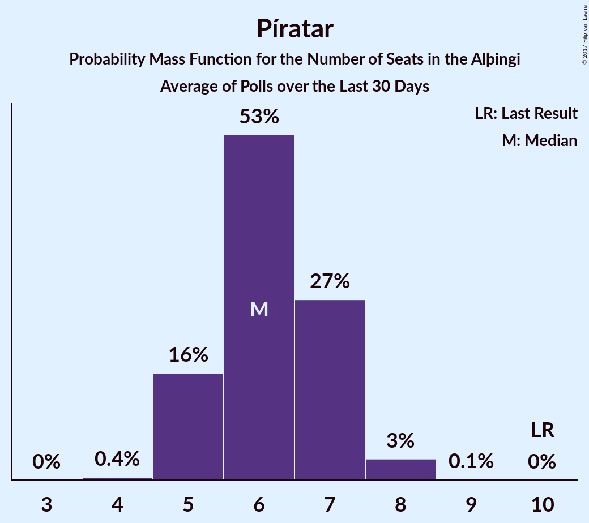

# Píratar

<a href="#voting-intentions">Voting Intentions</a> | <a href="#seats">Seats</a>

## Voting Intentions

Last result: **14.5%** (General Election of 29 October 2016)

### Confidence Intervals

| Period     | Polling firm/Commissioner(s) | Median | 80% Confidence Interval | 90% Confidence Interval | 95% Confidence Interval | 99% Confidence Interval |
|:----------:|:----------------:|:-----------:|:-----------------------:|:-----------------------:|:-----------------------:|:-----------------------:|
| N/A | [Poll Average](average.html) | 9.4% | 8.4–11.2% | 8.1–11.8% | 7.9–12.3% | 7.5–13.1% |
| [23–27 October 2017](2017-10-27-Zenter.html) | Zenter | 9.6% | 8.4–10.9% | 8.1–11.3% | 7.9–11.6% | 7.4–12.3% |
| [26–27 October 2017](2017-10-27-MMR.html) | MMR | 11.0% | 9.8–12.4% | 9.5–12.8% | 9.2–13.1% | 8.7–13.8% |
| [23–27 October 2017](2017-10-27-Gallup.html) | Gallup | 9.0% | 8.2–9.8% | 8.0–10.0% | 7.8–10.3% | 7.5–10.7% |
| [22–25 October 2017](2017-10-25-Felagsvisindastofnun.html) | Félagsvísindastofnun   Morgunblaðið | 8.8% | 8.1–9.6% | 7.9–9.8% | 7.7–10.0% | 7.4–10.4% |
| [23–24 October 2017](2017-10-24-Frettabladid.html) | Fréttablaðið | 9.4% | 8.6–10.4% | 8.3–10.7% | 8.1–11.0% | 7.7–11.4% |
| [20–23 October 2017](2017-10-23-MMR.html) | MMR | 9.3% | 8.2–10.6% | 7.9–11.0% | 7.6–11.3% | 7.1–11.9% |
| [13–19 October 2017](2017-10-19-Gallup.html) | Gallup | 10.7% | 9.8–11.7% | 9.5–12.0% | 9.3–12.3% | 8.9–12.8% |
| [16–19 October 2017](2017-10-19-Felagsvisindastofnun.html) | Félagsvísindastofnun   Morgunblaðið | 8.2% | 7.4–9.1% | 7.2–9.3% | 7.1–9.5% | 6.7–9.9% |
| [17–18 October 2017](2017-10-18-MMR.html) | MMR | 11.9% | 10.7–13.3% | 10.4–13.7% | 10.1–14.1% | 9.5–14.8% |
| [16 October 2017](2017-10-16-Frettabladid.html) | Fréttablaðið | 10.0% | 8.8–11.5% | 8.5–11.9% | 8.2–12.3% | 7.6–13.1% |
| [29 September–12 October 2017](2017-10-12-Gallup.html) | Gallup | 8.8% | 8.1–9.6% | 7.9–9.8% | 7.7–10.0% | 7.4–10.4% |
| [9–12 October 2017](2017-10-12-Felagsvisindastofnun.html) | Félagsvísindastofnun   Morgunblaðið | 9.2% | 8.2–10.3% | 7.9–10.6% | 7.7–10.9% | 7.3–11.5% |
| [6–11 October 2017](2017-10-11-MMR.html) | MMR | 10.4% | 9.3–11.8% | 8.9–12.2% | 8.7–12.5% | 8.1–13.2% |
| [10 October 2017](2017-10-10-Frettabladid.html) | Fréttablaðið | 8.5% | 7.3–9.9% | 7.0–10.3% | 6.7–10.6% | 6.2–11.3% |
| [2–6 October 2017](2017-10-06-Felagsvisindastofnun.html) | Félagsvísindastofnun   Morgunblaðið | 9.1% | 8.0–10.4% | 7.7–10.8% | 7.4–11.1% | 7.0–11.8% |
| [2–3 October 2017](2017-10-03-Frettabladid.html) | Fréttablaðið | 11.4% | 10.0–12.9% | 9.7–13.4% | 9.4–13.8% | 8.7–14.5% |
| [26–28 September 2017](2017-09-28-MMR.html) | MMR | 10.0% | 8.9–11.3% | 8.6–11.7% | 8.3–12.0% | 7.8–12.7% |
| [15–28 September 2017](2017-09-28-Gallup.html) | Gallup | 10.3% | 9.6–11.1% | 9.3–11.4% | 9.2–11.6% | 8.8–12.0% |
| [25–28 September 2017](2017-09-28-Felagsvisindastofnun.html) | Félagsvísindastofnun   Morgunblaðið | 11.6% | 10.3–13.0% | 10.0–13.4% | 9.7–13.7% | 9.1–14.4% |
| [19–21 September 2017](2017-09-21-Felagsvisindastofnun.html) | Félagsvísindastofnun   Morgunblaðið | 9.9% | 8.7–11.3% | 8.4–11.7% | 8.1–12.0% | 7.6–12.7% |
| [15–18 September 2017](2017-09-18-Zenter.html) | Zenter | 12.4% | 11.2–13.9% | 10.8–14.3% | 10.5–14.7% | 9.9–15.4% |
| [18 September 2017](2017-09-18-Frettabladid.html) | Fréttablaðið | 13.8% | 12.3–15.4% | 11.9–15.9% | 11.5–16.3% | 10.9–17.1% |
| [10–30 August 2017](2017-08-30-Gallup.html) | Gallup | 13.1% | 12.2–14.1% | 12.0–14.4% | 11.8–14.6% | 11.4–15.1% |
| [15–18 August 2017](2017-08-18-MMR.html) | MMR | 13.5% | 12.2–15.0% | 11.8–15.5% | 11.5–15.8% | 10.9–16.6% |

### Probability Mass Function

The following table shows the probability mass function per percentage block of voting intentions for the [poll average](average.html) for Píratar.

| Voting Intentions | Probability | Accumulated | Special Marks |
|:-----------------:|:-----------:|:-----------:|:-------------:|
| 5.5–6.5% | 0% | 100% |  |
| 6.5–7.5% | 0.6% | 100% |  |
| 7.5–8.5% | 15% | 99.4% |  |
| 8.5–9.5% | 40% | 84% | Median |
| 9.5–10.5% | 25% | 44% |  |
| 10.5–11.5% | 12% | 19% |  |
| 11.5–12.5% | 5% | 7% |  |
| 12.5–13.5% | 1.4% | 2% |  |
| 13.5–14.5% | 0.2% | 0.2% | Last Result |
| 14.5–15.5% | 0% | 0% |  |

## Seats

Last result: **10** seats (General Election of 29 October 2016)

### Confidence Intervals

| Period     | Polling firm/Commissioner(s) | Median | 80% Confidence Interval | 90% Confidence Interval | 95% Confidence Interval | 99% Confidence Interval |
|:----------:|:----------------:|:------:|:-----------------------:|:-----------------------:|:-----------------------:|:-----------------------:|
| N/A | [Poll Average](average.html) | 6 | 5–7 | 5–8 | 5–8 | 5–9 |
| [23–27 October 2017](2017-10-27-Zenter.html) | Zenter | 5 | 5–7 | 5–7 | 5–7 | 5–8 |
| [26–27 October 2017](2017-10-27-MMR.html) | MMR | 7 | 6–8 | 6–9 | 6–9 | 6–9 |
| [23–27 October 2017](2017-10-27-Gallup.html) | Gallup | 6 | 5–6 | 5–7 | 5–7 | 5–7 |
| [22–25 October 2017](2017-10-25-Felagsvisindastofnun.html) | Félagsvísindastofnun   Morgunblaðið | 6 | 5–6 | 5–6 | 5–6 | 5–7 |
| [23–24 October 2017](2017-10-24-Frettabladid.html) | Fréttablaðið | 6 | 6–7 | 5–7 | 5–8 | 5–8 |
| [20–23 October 2017](2017-10-23-MMR.html) | MMR | 6 | 5–7 | 5–7 | 5–8 | 4–8 |
| [13–19 October 2017](2017-10-19-Gallup.html) | Gallup | 7 | 6–7 | 6–8 | 6–8 | 5–8 |
| [16–19 October 2017](2017-10-19-Felagsvisindastofnun.html) | Félagsvísindastofnun   Morgunblaðið | 5 | 4–6 | 4–6 | 4–6 | 4–6 |
| [17–18 October 2017](2017-10-18-MMR.html) | MMR | 8 | 7–9 | 6–9 | 6–9 | 6–10 |
| [16 October 2017](2017-10-16-Frettabladid.html) | Fréttablaðið | 7 | 6–8 | 5–8 | 5–8 | 5–9 |
| [29 September–12 October 2017](2017-10-12-Gallup.html) | Gallup | 6 | 5–6 | 5–6 | 5–6 | 4–7 |
| [9–12 October 2017](2017-10-12-Felagsvisindastofnun.html) | Félagsvísindastofnun   Morgunblaðið | 6 | 5–7 | 5–7 | 5–7 | 5–8 |
| [6–11 October 2017](2017-10-11-MMR.html) | MMR | 7 | 6–8 | 6–8 | 6–8 | 5–9 |
| [10 October 2017](2017-10-10-Frettabladid.html) | Fréttablaðið | 6 | 5–6 | 4–7 | 4–7 | 4–8 |
| [2–6 October 2017](2017-10-06-Felagsvisindastofnun.html) | Félagsvísindastofnun   Morgunblaðið | 6 | 5–7 | 5–7 | 5–7 | 4–8 |
| [2–3 October 2017](2017-10-03-Frettabladid.html) | Fréttablaðið | 8 | 7–9 | 6–9 | 6–9 | 6–10 |
| [26–28 September 2017](2017-09-28-MMR.html) | MMR | 6 | 5–8 | 5–8 | 5–8 | 5–9 |
| [15–28 September 2017](2017-09-28-Gallup.html) | Gallup | 7 | 7–8 | 6–8 | 6–8 | 6–8 |
| [25–28 September 2017](2017-09-28-Felagsvisindastofnun.html) | Félagsvísindastofnun   Morgunblaðið | 8 | 6–9 | 6–9 | 6–9 | 5–10 |
| [19–21 September 2017](2017-09-21-Felagsvisindastofnun.html) | Félagsvísindastofnun   Morgunblaðið | 6 | 5–7 | 5–7 | 5–8 | 5–8 |
| [15–18 September 2017](2017-09-18-Zenter.html) | Zenter | 8 | 7–9 | 7–9 | 7–10 | 6–10 |
| [18 September 2017](2017-09-18-Frettabladid.html) | Fréttablaðið | 9 | 8–10 | 8–11 | 7–11 | 7–12 |
| [10–30 August 2017](2017-08-30-Gallup.html) | Gallup | 9 | 8–10 | 8–10 | 8–10 | 7–10 |
| [15–18 August 2017](2017-08-18-MMR.html) | MMR | 9 | 8–10 | 8–10 | 8–11 | 7–11 |

### Probability Mass Function

The following table shows the probability mass function per seat for the [poll average](average.html) for Píratar.

| Number of Seats | Probability | Accumulated | Special Marks |
|:---------------:|:-----------:|:-----------:|:-------------:|
| 4 | 0.1% | 100% |  |
| 5 | 27% | 99.9% |  |
| 6 | 42% | 73% | Median |
| 7 | 23% | 32% |  |
| 8 | 7% | 8% |  |
| 9 | 1.2% | 1.2% |  |
| 10 | 0.1% | 0.1% | Last Result |
| 11 | 0% | 0% |  |

