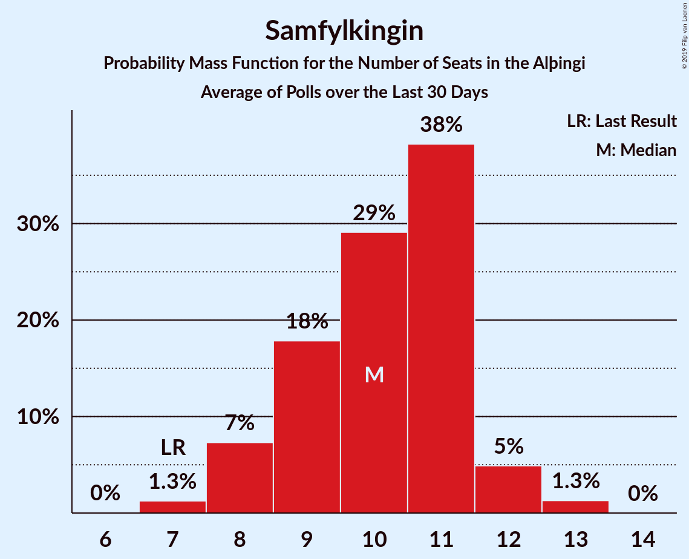

# Samfylkingin

<a href="#voting-intentions">Voting Intentions</a> | <a href="#seats">Seats</a>

## Voting Intentions

Last result: **12.1%** (General Election of 28 October 2017)

### Confidence Intervals

| Period     | Polling firm/Commissioner(s) | Median | 80% Confidence Interval | 90% Confidence Interval | 95% Confidence Interval | 99% Confidence Interval |
|:----------:|:----------------:|:-----------:|:-----------------------:|:-----------------------:|:-----------------------:|:-----------------------:|
| N/A | [Poll Average](average.html) | 11.8% | 10.2–13.1% | 9.7–13.5% | 9.4–13.8% | 8.8–14.3% |
| [25 May–1 June 2021](2021-06-01-MMR.html) | MMR | 10.9% | 9.7–12.3% | 9.4–12.7% | 9.1–13.1% | 8.6–13.8% |
| [1–31 May 2021](2021-05-31-Gallup.html) | Gallup | 12.4% | 11.5–13.4% | 11.2–13.7% | 11.0–14.0% | 10.6–14.5% |
| [7–12 May 2021](2021-05-12-MMR.html) | MMR | 10.9% | 9.7–12.3% | 9.4–12.7% | 9.1–13.1% | 8.5–13.7% |
| [1–30 April 2021](2021-04-30-Gallup.html) | Gallup | 12.0% | 11.1–13.0% | 10.8–13.3% | 10.6–13.5% | 10.2–14.0% |
| [21–28 April 2021](2021-04-28-MMR.html) | MMR | 11.3% | 10.1–12.7% | 9.7–13.1% | 9.4–13.5% | 8.9–14.2% |
| [29 March–7 April 2021](2021-04-07-MMR.html) | MMR | 15.4% | 14.0–17.0% | 13.6–17.5% | 13.3–17.9% | 12.6–18.7% |
| [1–29 March 2021](2021-03-29-Gallup.html) | Gallup | 12.7% | 12.1–13.3% | 12.0–13.5% | 11.8–13.6% | 11.6–13.9% |
| [5–10 March 2021](2021-03-10-MMR.html) | MMR | 13.8% | 12.4–15.3% | 12.1–15.7% | 11.7–16.1% | 11.1–16.9% |
| [1–28 February 2021](2021-02-28-Gallup.html) | Gallup | 14.4% | 13.8–15.1% | 13.6–15.3% | 13.4–15.4% | 13.1–15.7% |
| [12–18 February 2021](2021-02-18-MMR.html) | MMR | 13.2% | 11.8–14.7% | 11.4–15.1% | 11.1–15.5% | 10.5–16.3% |
| [6–31 January 2021](2021-01-31-Gallup.html) | Gallup | 16.6% | 15.9–17.3% | 15.7–17.5% | 15.6–17.7% | 15.2–18.0% |
| [30 December 2020–11 January 2021](2021-01-11-MMR.html) | MMR | 15.6% | 14.6–16.7% | 14.3–17.0% | 14.1–17.2% | 13.6–17.8% |
| [1 December 2020–3 January 2021](2021-01-03-Gallup.html) | Gallup | 17.0% | 16.4–17.7% | 16.2–17.9% | 16.1–18.0% | 15.8–18.3% |
| [11–19 December 2020](2020-12-19-Zenter.html) | Zenter | 15.6% | 14.4–16.9% | 14.0–17.3% | 13.7–17.7% | 13.2–18.3% |
| [26 November–3 December 2020](2020-12-03-MMR.html) | MMR | 13.9% | 12.5–15.4% | 12.1–15.9% | 11.8–16.2% | 11.2–17.0% |
| [2–30 November 2020](2020-11-30-Gallup.html) | Gallup | 17.1% | 16.5–17.8% | 16.3–18.0% | 16.1–18.2% | 15.8–18.5% |
| [6–11 November 2020](2020-11-11-MMR.html) | MMR | 16.8% | 15.3–18.4% | 14.8–18.9% | 14.5–19.3% | 13.8–20.1% |
| [30 September–1 November 2020](2020-11-01-Gallup.html) | Gallup | 15.8% | 15.3–16.5% | 15.1–16.6% | 15.0–16.8% | 14.7–17.1% |
| [23–28 October 2020](2020-10-28-MMR.html) | MMR | 15.2% | 13.8–16.8% | 13.4–17.3% | 13.1–17.7% | 12.4–18.5% |
| [1–30 September 2020](2020-09-30-Gallup.html) | Gallup | 14.9% | 14.3–15.6% | 14.1–15.8% | 14.0–15.9% | 13.7–16.2% |
| [10–23 September 2020](2020-09-23-MMR.html) | MMR | 12.8% | 11.9–13.8% | 11.7–14.1% | 11.4–14.3% | 11.0–14.8% |
| [26 August–2 September 2020](2020-09-02-MMR.html) | MMR | 14.9% | 13.4–16.4% | 13.0–16.9% | 12.7–17.3% | 12.1–18.1% |
| [4–31 August 2020](2020-08-31-Gallup.html) | Gallup | 14.7% | 14.1–15.4% | 13.9–15.5% | 13.7–15.7% | 13.4–16.0% |
| [23–28 July 2020](2020-07-28-MMR.html) | MMR | 13.1% | 11.8–14.6% | 11.5–15.1% | 11.1–15.4% | 10.5–16.2% |
| [2–30 June 2020](2020-06-30-Gallup.html) | Gallup | 14.9% | 14.3–15.5% | 14.1–15.7% | 14.0–15.9% | 13.7–16.2% |
| [16–19 June 2020](2020-06-19-MMR.html) | MMR | 16.4% | 15.0–17.9% | 14.6–18.4% | 14.3–18.7% | 13.6–19.5% |
| [4 May–1 June 2020](2020-06-01-Gallup.html) | Gallup | 14.4% | 13.8–15.0% | 13.7–15.2% | 13.6–15.3% | 13.3–15.6% |
| [19–25 May 2020](2020-05-25-MMR.html) | MMR | 13.3% | 12.0–14.8% | 11.6–15.2% | 11.3–15.5% | 10.7–16.3% |
| [30 March–3 May 2020](2020-05-03-Gallup.html) | Gallup | 13.8% | 13.3–14.4% | 13.1–14.6% | 13.0–14.7% | 12.7–15.0% |
| [15–17 April 2020](2020-04-17-MMR.html) | MMR | 13.1% | 11.9–14.6% | 11.5–15.0% | 11.2–15.3% | 10.7–16.0% |
| [3–7 April 2020](2020-04-07-MMR.html) | MMR | 14.1% | 12.7–15.6% | 12.4–16.0% | 12.1–16.4% | 11.4–17.1% |
| [2–29 March 2020](2020-03-29-Gallup.html) | Gallup | 15.1% | 14.5–15.7% | 14.3–15.9% | 14.2–16.0% | 13.9–16.4% |
| [18–20 March 2020](2020-03-20-MMR.html) | MMR | 14.9% | 13.6–16.4% | 13.2–16.8% | 12.8–17.2% | 12.2–17.9% |
| [3 February–1 March 2020](2020-03-01-Gallup.html) | Gallup | 14.5% | 13.9–15.2% | 13.7–15.5% | 13.5–15.6% | 13.2–16.0% |
| [6–10 February 2020](2020-02-10-MMR.html) | MMR | 15.1% | 13.7–16.6% | 13.3–17.0% | 13.0–17.4% | 12.3–18.2% |
| [3 January–2 February 2020](2020-02-02-Gallup.html) | Gallup | 17.8% | 17.1–18.5% | 16.9–18.7% | 16.7–18.9% | 16.4–19.3% |
| [28 January 2020](2020-01-28-MMR.html) | MMR | 16.6% | 15.1–18.3% | 14.7–18.7% | 14.3–19.2% | 13.6–20.0% |
| [3–13 January 2020](2020-01-13-MMR.html) | MMR | 16.8% | 15.8–17.9% | 15.5–18.2% | 15.3–18.5% | 14.8–19.0% |
| [2 December 2019–1 January 2020](2020-01-01-Gallup.html) | Gallup | 14.0% | 13.3–14.7% | 13.2–14.8% | 13.0–15.0% | 12.7–15.3% |
| [13–19 December 2019](2019-12-19-MMR.html) | MMR | 14.4% | 13.1–15.9% | 12.7–16.3% | 12.4–16.7% | 11.8–17.4% |
| [28 October–1 December 2019](2019-12-01-Gallup.html) | Gallup | 15.8% | 15.2–16.4% | 15.1–16.6% | 15.0–16.8% | 14.7–17.0% |
| [15–22 November 2019](2019-11-22-MMR.html) | MMR | 13.2% | 11.9–14.6% | 11.6–15.0% | 11.3–15.4% | 10.7–16.1% |
| [30 September–27 October 2019](2019-10-27-Gallup.html) | Gallup | 17.4% | 16.7–18.0% | 16.5–18.2% | 16.4–18.4% | 16.1–18.7% |
| [21–25 October 2019](2019-10-25-MMR.html) | MMR | 15.3% | 13.9–16.9% | 13.5–17.3% | 13.2–17.7% | 12.6–18.5% |
| [10–14 October 2019](2019-10-14-Zenter.html) | Zenter | 18.5% | 17.2–20.0% | 16.8–20.5% | 16.5–20.8% | 15.8–21.6% |
| [30 September–9 October 2019](2019-10-09-MMR.html) | MMR | 14.1% | 13.2–15.1% | 12.9–15.4% | 12.7–15.6% | 12.2–16.1% |
| [1–30 September 2019](2019-09-30-Gallup.html) | Gallup | 16.1% | 15.1–17.3% | 14.8–17.6% | 14.5–17.9% | 14.1–18.4% |
| [9–16 September 2019](2019-09-16-MMR.html) | MMR | 14.8% | 13.5–16.3% | 13.1–16.8% | 12.8–17.1% | 12.2–17.8% |
| [29 July–1 September 2019](2019-09-01-Gallup.html) | Gallup | 15.5% | 14.8–16.2% | 14.6–16.5% | 14.4–16.6% | 14.1–17.0% |
| [12–19 August 2019](2019-08-19-MMR.html) | MMR | 16.8% | 15.3–18.4% | 14.9–18.8% | 14.6–19.2% | 13.9–20.0% |
| [1–31 July 2019](2019-07-31-Gallup.html) | Gallup | 13.7% | 12.8–14.8% | 12.5–15.1% | 12.3–15.4% | 11.8–15.9% |
| [24–26 July 2019](2019-07-26-Zenter.html) | Zenter | 14.3% | 12.9–15.9% | 12.5–16.4% | 12.2–16.8% | 11.6–17.6% |
| [4–17 July 2019](2019-07-17-MMR.html) | MMR | 13.5% | 12.6–14.5% | 12.3–14.8% | 12.1–15.0% | 11.6–15.5% |
| [31 May–30 June 2019](2019-06-30-Gallup.html) | Gallup | 14.7% | 13.9–15.5% | 13.7–15.8% | 13.5–16.0% | 13.1–16.4% |
| [7–14 June 2019](2019-06-14-MMR.html) | MMR | 14.4% | 13.0–15.9% | 12.7–16.3% | 12.3–16.7% | 11.7–17.5% |
| [3–30 May 2019](2019-05-30-Gallup.html) | Gallup | 16.6% | 15.8–17.5% | 15.6–17.7% | 15.4–17.9% | 15.0–18.3% |
| [23–29 May 2019](2019-05-29-MMR.html) | MMR | 12.4% | 11.2–13.9% | 10.8–14.4% | 10.5–14.7% | 9.9–15.5% |
| [14–16 May 2019](2019-05-16-MMR.html) | MMR | 13.9% | 12.6–15.4% | 12.2–15.9% | 11.9–16.2% | 11.3–17.0% |
| [30 April–3 May 2019](2019-05-03-MMR.html) | MMR | 14.1% | 12.8–15.7% | 12.4–16.1% | 12.1–16.5% | 11.4–17.3% |
| [5–30 April 2019](2019-04-30-Gallup.html) | Gallup | 16.2% | 15.4–17.1% | 15.1–17.3% | 14.9–17.6% | 14.5–18.0% |
| [13 April 2019](2019-04-13-MMR.html) | MMR | 14.3% | 12.9–15.9% | 12.5–16.3% | 12.2–16.7% | 11.5–17.5% |
| [4–9 April 2019](2019-04-09-MMR.html) | MMR | 13.9% | 12.6–15.5% | 12.2–15.9% | 11.8–16.3% | 11.2–17.1% |
| [1–31 March 2019](2019-03-31-Gallup.html) | Gallup | 15.9% | 15.2–16.7% | 15.0–16.9% | 14.8–17.1% | 14.4–17.5% |
| [11–14 March 2019](2019-03-14-MMR.html) | MMR | 13.8% | 12.5–15.2% | 12.1–15.6% | 11.8–16.0% | 11.2–16.7% |
| [31 January–28 February 2019](2019-02-28-Gallup.html) | Gallup | 16.8% | 16.0–17.6% | 15.8–17.8% | 15.7–18.0% | 15.3–18.4% |
| [11–15 February 2019](2019-02-15-MMR.html) | MMR | 16.0% | 14.5–17.6% | 14.1–18.0% | 13.7–18.4% | 13.1–19.2% |
| [7–31 January 2019](2019-01-31-Gallup.html) | Gallup | 19.1% | 18.1–20.2% | 17.8–20.5% | 17.6–20.8% | 17.1–21.3% |
| [28 January 2019](2019-01-28-MMR.html) | MMR | 15.5% | 14.0–17.1% | 13.6–17.6% | 13.3–18.0% | 12.6–18.8% |
| [4–14 January 2019](2019-01-14-MMR.html) | MMR | 15.0% | 14.0–16.0% | 13.7–16.3% | 13.5–16.6% | 13.1–17.1% |
| [3 December 2018–1 January 2019](2019-01-01-Gallup.html) | Gallup | 18.4% | 17.5–19.4% | 17.3–19.6% | 17.0–19.9% | 16.6–20.3% |
| [5–11 December 2018](2018-12-11-MMR.html) | MMR | 16.9% | 15.5–18.5% | 15.1–19.0% | 14.7–19.4% | 14.0–20.2% |
| [3–4 December 2018](2018-12-04-Zenter.html) | Zenter | 20.8% | 19.4–22.3% | 19.0–22.7% | 18.6–23.1% | 18.0–23.9% |
| [30 November–3 December 2018](2018-12-03-Maskína.html) | Maskína | 19.7% | 18.3–21.1% | 17.9–21.6% | 17.6–21.9% | 17.0–22.6% |
| [3 November–2 December 2018](2018-12-02-Gallup.html) | Gallup | 18.7% | 17.8–19.6% | 17.6–19.9% | 17.4–20.1% | 17.0–20.6% |
| [21 November 2018](2018-11-21-MMR.html) | MMR | 16.3% | 14.8–17.9% | 14.4–18.4% | 14.0–18.8% | 13.3–19.6% |
| [8–12 November 2018](2018-11-12-MMR.html) | MMR | 16.6% | 15.2–18.2% | 14.8–18.6% | 14.5–19.0% | 13.8–19.7% |
| [2–31 October 2018](2018-10-31-Gallup.html) | Gallup | 17.0% | 16.2–17.8% | 16.0–18.1% | 15.8–18.3% | 15.4–18.7% |
| [22 October 2018](2018-10-22-MMR.html) | MMR | 16.5% | 15.0–18.2% | 14.6–18.6% | 14.2–19.0% | 13.5–19.9% |
| [3–9 October 2018](2018-10-09-MMR.html) | MMR | 16.7% | 15.2–18.4% | 14.8–18.9% | 14.4–19.3% | 13.8–20.1% |
| [3 September–1 October 2018](2018-10-01-Gallup.html) | Gallup | 19.3% | 18.4–20.3% | 18.1–20.5% | 17.9–20.8% | 17.5–21.2% |
| [7–12 September 2018](2018-09-12-MMR.html) | MMR | 19.8% | 18.2–21.6% | 17.8–22.1% | 17.4–22.5% | 16.7–23.3% |
| [2 August–2 September 2018](2018-09-02-Gallup.html) | Gallup | 19.3% | 18.5–20.1% | 18.3–20.4% | 18.1–20.6% | 17.7–21.0% |
| [10 August 2018](2018-08-10-MMR.html) | MMR | 16.6% | 15.1–18.3% | 14.7–18.7% | 14.3–19.2% | 13.6–20.0% |
| [29 June–30 July 2018](2018-07-30-Gallup.html) | Gallup | 16.7% | 15.9–17.5% | 15.7–17.8% | 15.5–18.0% | 15.2–18.4% |
| [31 May–1 July 2018](2018-07-01-Gallup.html) | Gallup | 15.2% | 14.4–16.0% | 14.2–16.3% | 14.0–16.5% | 13.6–16.9% |
| [12–18 June 2018](2018-06-18-MMR.html) | MMR | 15.1% | 13.7–16.7% | 13.3–17.2% | 13.0–17.6% | 12.3–18.4% |
| [2–31 May 2018](2018-05-31-Gallup.html) | Gallup | 17.9% | 17.1–18.7% | 16.9–18.9% | 16.8–19.1% | 16.4–19.5% |
| [16–22 May 2018](2018-05-22-MMR.html) | MMR | 14.6% | 13.2–16.2% | 12.8–16.7% | 12.5–17.1% | 11.9–17.8% |
| [2 May 2018](2018-05-02-MMR.html) | MMR | 14.7% | 13.3–16.3% | 12.9–16.8% | 12.6–17.2% | 11.9–18.0% |
| [27 March–29 April 2018](2018-04-29-Gallup.html) | Gallup | 17.7% | 16.9–18.5% | 16.7–18.7% | 16.5–18.9% | 16.2–19.3% |
| [13–19 April 2018](2018-04-19-MMR.html) | MMR | 13.6% | 12.3–15.2% | 11.9–15.6% | 11.6–16.0% | 10.9–16.8% |
| [1–26 March 2018](2018-03-26-Gallup.html) | Gallup | 16.5% | 15.7–17.4% | 15.4–17.6% | 15.2–17.8% | 14.8–18.3% |
| [19 March 2018](2018-03-19-MMR.html) | MMR | 16.0% | 14.6–17.7% | 14.2–18.2% | 13.8–18.6% | 13.1–19.4% |
| [1–28 February 2018](2018-02-28-Gallup.html) | Gallup | 15.3% | 14.5–16.1% | 14.2–16.4% | 14.1–16.6% | 13.7–17.0% |
| [4–31 January 2018](2018-01-31-Gallup.html) | Gallup | 16.1% | 15.3–17.0% | 15.0–17.3% | 14.8–17.5% | 14.5–17.9% |
| [25–30 January 2018](2018-01-30-MMR.html) | MMR | 14.9% | 13.5–16.5% | 13.1–16.9% | 12.7–17.3% | 12.1–18.1% |
| [9–17 January 2018](2018-01-17-MMR.html) | MMR | 13.9% | 12.9–15.1% | 12.6–15.4% | 12.3–15.7% | 11.8–16.3% |
| [30 November–28 December 2017](2017-12-28-Gallup.html) | Gallup | 15.5% | 14.8–16.3% | 14.6–16.5% | 14.4–16.7% | 14.1–17.0% |
| [12–15 December 2017](2017-12-15-MMR.html) | MMR | 16.8% | 15.3–18.5% | 14.9–18.9% | 14.5–19.3% | 13.8–20.2% |
| [4 December 2017](2017-12-04-FréttablaðiðStöð2Vísir.html) | Fréttablaðið/Stöð 2/Vísir | 13.4% | 12.0–15.1% | 11.6–15.6% | 11.2–16.0% | 10.6–16.8% |
| [4 December 2017](2017-12-04-Fréttablaðið-Stöð2-Vísir.html) | Fréttablaðið, Stöð 2 and Vísir | 13.4% | 12.0–15.1% | 11.6–15.6% | 11.2–16.0% | 10.6–16.8% |
| [8–30 November 2017](2017-11-30-Gallup.html) | Gallup | 16.7% | 15.7–17.7% | 15.5–18.0% | 15.2–18.3% | 14.8–18.8% |
| [14–17 November 2017](2017-11-17-MMR.html) | MMR | 16.0% | 14.6–17.6% | 14.1–18.1% | 13.8–18.5% | 13.1–19.3% |

### Probability Mass Function

The following table shows the probability mass function per percentage block of voting intentions for the [poll average](average.html) for Samfylkingin.

| Voting Intentions | Probability | Accumulated | Special Marks |
|:-----------------:|:-----------:|:-----------:|:-------------:|
| 6.5–7.5% | 0% | 100% |  |
| 7.5–8.5% | 0.2% | 100% |  |
| 8.5–9.5% | 3% | 99.8% |  |
| 9.5–10.5% | 13% | 97% |  |
| 10.5–11.5% | 24% | 83% |  |
| 11.5–12.5% | 33% | 59% | Last Result, Median |
| 12.5–13.5% | 22% | 26% |  |
| 13.5–14.5% | 4% | 4% |  |
| 14.5–15.5% | 0.2% | 0.2% |  |
| 15.5–16.5% | 0% | 0% |  |

## Seats

Last result: **7** seats (General Election of 28 October 2017)

### Confidence Intervals

| Period     | Polling firm/Commissioner(s) | Median | 80% Confidence Interval | 90% Confidence Interval | 95% Confidence Interval | 99% Confidence Interval |
|:----------:|:----------------:|:------:|:-----------------------:|:-----------------------:|:-----------------------:|:-----------------------:|
| N/A | [Poll Average](average.html) | 8 | 6–8 | 6–9 | 6–9 | 5–10 |
| [25 May–1 June 2021](2021-06-01-MMR.html) | MMR | 7 | 6–8 | 6–8 | 5–9 | 5–9 |
| [1–31 May 2021](2021-05-31-Gallup.html) | Gallup | 8 | 7–9 | 7–9 | 7–9 | 7–10 |
| [7–12 May 2021](2021-05-12-MMR.html) | MMR | 7 | 6–8 | 6–8 | 6–9 | 5–9 |
| [1–30 April 2021](2021-04-30-Gallup.html) | Gallup | 8 | 7–9 | 6–9 | 6–9 | 6–10 |
| [21–28 April 2021](2021-04-28-MMR.html) | MMR | 7 | 6–8 | 6–9 | 6–9 | 5–10 |
| [29 March–7 April 2021](2021-04-07-MMR.html) | MMR | 11 | 9–12 | 9–12 | 9–12 | 8–13 |
| [1–29 March 2021](2021-03-29-Gallup.html) | Gallup | 8 | 7–9 | 7–9 | 7–9 | 7–10 |
| [5–10 March 2021](2021-03-10-MMR.html) | MMR | 9 | 9–10 | 8–11 | 8–11 | 7–12 |
| [1–28 February 2021](2021-02-28-Gallup.html) | Gallup | 10 | 9–10 | 9–10 | 9–10 | 8–11 |
| [12–18 February 2021](2021-02-18-MMR.html) | MMR | 9 | 8–10 | 8–10 | 7–11 | 7–11 |
| [6–31 January 2021](2021-01-31-Gallup.html) | Gallup | 12 | 11–12 | 10–12 | 10–12 | 10–12 |
| [30 December 2020–11 January 2021](2021-01-11-MMR.html) | MMR | 11 | 10–12 | 10–12 | 9–12 | 9–12 |
| [1 December 2020–3 January 2021](2021-01-03-Gallup.html) | Gallup | 12 | 11–12 | 11–12 | 11–12 | 11–13 |
| [11–19 December 2020](2020-12-19-Zenter.html) | Zenter | 11 | 10–13 | 10–13 | 9–13 | 9–13 |
| [26 November–3 December 2020](2020-12-03-MMR.html) | MMR | 10 | 8–10 | 8–11 | 7–11 | 7–12 |
| [2–30 November 2020](2020-11-30-Gallup.html) | Gallup | 12 | 12 | 11–12 | 11–13 | 11–13 |
| [6–11 November 2020](2020-11-11-MMR.html) | MMR | 12 | 10–13 | 10–13 | 10–14 | 9–14 |
| [30 September–1 November 2020](2020-11-01-Gallup.html) | Gallup | 11 | 11–12 | 10–12 | 10–12 | 10–12 |
| [23–28 October 2020](2020-10-28-MMR.html) | MMR | 10 | 9–12 | 9–12 | 9–12 | 8–13 |
| [1–30 September 2020](2020-09-30-Gallup.html) | Gallup | 10 | 10–11 | 10–11 | 10–11 | 9–11 |
| [10–23 September 2020](2020-09-23-MMR.html) | MMR | 9 | 8–10 | 8–10 | 8–10 | 7–10 |
| [26 August–2 September 2020](2020-09-02-MMR.html) | MMR | 10 | 9–12 | 9–12 | 8–12 | 8–12 |
| [4–31 August 2020](2020-08-31-Gallup.html) | Gallup | 10 | 10–11 | 9–11 | 9–11 | 9–11 |
| [23–28 July 2020](2020-07-28-MMR.html) | MMR | 9 | 8–10 | 7–10 | 7–11 | 7–11 |
| [2–30 June 2020](2020-06-30-Gallup.html) | Gallup | 10 | 10–11 | 10–11 | 9–11 | 9–11 |
| [16–19 June 2020](2020-06-19-MMR.html) | MMR | 11 | 10–13 | 10–13 | 10–13 | 9–14 |
| [4 May–1 June 2020](2020-06-01-Gallup.html) | Gallup | 10 | 9–10 | 9–10 | 9–10 | 9–10 |
| [19–25 May 2020](2020-05-25-MMR.html) | MMR | 9 | 8–10 | 8–11 | 7–11 | 7–11 |
| [30 March–3 May 2020](2020-05-03-Gallup.html) | Gallup | 10 | 9–10 | 9–10 | 9–10 | 8–10 |
| [15–17 April 2020](2020-04-17-MMR.html) | MMR | 9 | 8–10 | 7–10 | 7–10 | 7–11 |
| [3–7 April 2020](2020-04-07-MMR.html) | MMR | 10 | 8–11 | 8–11 | 8–11 | 8–12 |
| [2–29 March 2020](2020-03-29-Gallup.html) | Gallup | 10 | 10–11 | 10–11 | 10–11 | 9–11 |
| [18–20 March 2020](2020-03-20-MMR.html) | MMR | 10 | 9–11 | 9–12 | 8–12 | 8–12 |
| [3 February–1 March 2020](2020-03-01-Gallup.html) | Gallup | 10 | 9–11 | 9–11 | 9–11 | 9–11 |
| [6–10 February 2020](2020-02-10-MMR.html) | MMR | 10 | 9–11 | 9–12 | 8–12 | 8–13 |
| [3 January–2 February 2020](2020-02-02-Gallup.html) | Gallup | 12 | 11–13 | 11–13 | 11–13 | 11–14 |
| [28 January 2020](2020-01-28-MMR.html) | MMR | 11 | 10–13 | 10–13 | 10–14 | 9–14 |
| [3–13 January 2020](2020-01-13-MMR.html) | MMR | 12 | 11–12 | 11–13 | 10–13 | 10–14 |
| [2 December 2019–1 January 2020](2020-01-01-Gallup.html) | Gallup | 9 | 9–10 | 9–10 | 8–10 | 8–10 |
| [13–19 December 2019](2019-12-19-MMR.html) | MMR | 10 | 9–11 | 8–11 | 8–11 | 8–12 |
| [28 October–1 December 2019](2019-12-01-Gallup.html) | Gallup | 11 | 10–11 | 10–11 | 10–11 | 10–12 |
| [15–22 November 2019](2019-11-22-MMR.html) | MMR | 9 | 8–10 | 7–10 | 7–10 | 7–11 |
| [30 September–27 October 2019](2019-10-27-Gallup.html) | Gallup | 12 | 11–12 | 11–12 | 10–12 | 10–13 |
| [21–25 October 2019](2019-10-25-MMR.html) | MMR | 10 | 9–11 | 9–11 | 8–11 | 8–12 |
| [10–14 October 2019](2019-10-14-Zenter.html) | Zenter | 13 | 12–14 | 11–14 | 11–14 | 11–15 |
| [30 September–9 October 2019](2019-10-09-MMR.html) | MMR | 10 | 9–10 | 9–10 | 8–10 | 8–11 |
| [1–30 September 2019](2019-09-30-Gallup.html) | Gallup | 11 | 10–12 | 10–12 | 10–12 | 9–12 |
| [9–16 September 2019](2019-09-16-MMR.html) | MMR | 10 | 9–11 | 9–11 | 8–12 | 8–12 |
| [29 July–1 September 2019](2019-09-01-Gallup.html) | Gallup | 10 | 10–11 | 10–11 | 10–11 | 9–12 |
| [12–19 August 2019](2019-08-19-MMR.html) | MMR | 12 | 10–13 | 10–13 | 10–13 | 9–14 |
| [1–31 July 2019](2019-07-31-Gallup.html) | Gallup | 9 | 9–10 | 8–10 | 8–10 | 8–11 |
| [24–26 July 2019](2019-07-26-Zenter.html) | Zenter | 10 | 9–11 | 8–11 | 8–11 | 8–12 |
| [4–17 July 2019](2019-07-17-MMR.html) | MMR | 9 | 8–10 | 8–10 | 8–10 | 7–11 |
| [31 May–30 June 2019](2019-06-30-Gallup.html) | Gallup | 10 | 9–10 | 9–11 | 9–11 | 9–11 |
| [7–14 June 2019](2019-06-14-MMR.html) | MMR | 10 | 9–11 | 8–11 | 8–12 | 7–12 |
| [3–30 May 2019](2019-05-30-Gallup.html) | Gallup | 11 | 11–12 | 11–12 | 11–12 | 10–12 |
| [23–29 May 2019](2019-05-29-MMR.html) | MMR | 8 | 7–10 | 7–10 | 7–10 | 7–11 |
| [14–16 May 2019](2019-05-16-MMR.html) | MMR | 9 | 8–10 | 8–10 | 8–11 | 7–11 |
| [30 April–3 May 2019](2019-05-03-MMR.html) | MMR | 10 | 8–11 | 8–11 | 8–11 | 7–12 |
| [5–30 April 2019](2019-04-30-Gallup.html) | Gallup | 11 | 11–12 | 11–12 | 10–12 | 10–12 |
| [13 April 2019](2019-04-13-MMR.html) | MMR | 10 | 8–11 | 8–11 | 8–12 | 7–12 |
| [4–9 April 2019](2019-04-09-MMR.html) | MMR | 9 | 8–10 | 8–11 | 8–11 | 7–12 |
| [1–31 March 2019](2019-03-31-Gallup.html) | Gallup | 11 | 10–11 | 10–12 | 10–12 | 10–12 |
| [11–14 March 2019](2019-03-14-MMR.html) | MMR | 9 | 8–11 | 8–11 | 8–11 | 7–12 |
| [31 January–28 February 2019](2019-02-28-Gallup.html) | Gallup | 11 | 11–12 | 11–12 | 10–12 | 10–13 |
| [11–15 February 2019](2019-02-15-MMR.html) | MMR | 10 | 10–12 | 9–12 | 9–12 | 8–13 |
| [7–31 January 2019](2019-01-31-Gallup.html) | Gallup | 13 | 12–14 | 12–14 | 12–15 | 11–16 |
| [28 January 2019](2019-01-28-MMR.html) | MMR | 10 | 9–11 | 9–12 | 9–12 | 8–13 |
| [4–14 January 2019](2019-01-14-MMR.html) | MMR | 10 | 9–11 | 9–11 | 9–11 | 8–11 |
| [3 December 2018–1 January 2019](2019-01-01-Gallup.html) | Gallup | 12 | 12–13 | 11–14 | 11–14 | 11–15 |
| [5–11 December 2018](2018-12-11-MMR.html) | MMR | 11 | 10–13 | 10–13 | 10–13 | 9–14 |
| [3–4 December 2018](2018-12-04-Zenter.html) | Zenter | 14 | 13–16 | 13–16 | 12–16 | 12–17 |
| [30 November–3 December 2018](2018-12-03-Maskína.html) | Maskína | 14 | 12–14 | 12–15 | 12–15 | 11–16 |
| [3 November–2 December 2018](2018-12-02-Gallup.html) | Gallup | 13 | 11–13 | 11–14 | 11–14 | 10–15 |
| [21 November 2018](2018-11-21-MMR.html) | MMR | 11 | 10–12 | 9–12 | 9–12 | 8–13 |
| [8–12 November 2018](2018-11-12-MMR.html) | MMR | 11 | 10–12 | 10–12 | 9–13 | 9–13 |
| [2–31 October 2018](2018-10-31-Gallup.html) | Gallup | 11 | 10–12 | 10–13 | 10–13 | 10–13 |
| [22 October 2018](2018-10-22-MMR.html) | MMR | 10 | 10–12 | 9–12 | 9–13 | 9–13 |
| [3–9 October 2018](2018-10-09-MMR.html) | MMR | 11 | 10–12 | 10–13 | 9–13 | 9–13 |
| [3 September–1 October 2018](2018-10-01-Gallup.html) | Gallup | 13 | 12–14 | 12–15 | 11–15 | 11–15 |
| [7–12 September 2018](2018-09-12-MMR.html) | MMR | 13 | 12–15 | 12–15 | 11–15 | 11–16 |
| [2 August–2 September 2018](2018-09-02-Gallup.html) | Gallup | 13 | 12–15 | 12–15 | 12–15 | 11–15 |
| [10 August 2018](2018-08-10-MMR.html) | MMR | 11 | 10–12 | 10–12 | 9–13 | 9–13 |
| [29 June–30 July 2018](2018-07-30-Gallup.html) | Gallup | 11 | 10–11 | 10–11 | 10–12 | 10–12 |
| [31 May–1 July 2018](2018-07-01-Gallup.html) | Gallup | 10 | 10–11 | 9–11 | 9–11 | 9–12 |
| [12–18 June 2018](2018-06-18-MMR.html) | MMR | 10 | 9–11 | 8–11 | 8–12 | 8–12 |
| [2–31 May 2018](2018-05-31-Gallup.html) | Gallup | 12 | 12–13 | 11–13 | 11–13 | 11–13 |
| [16–22 May 2018](2018-05-22-MMR.html) | MMR | 10 | 8–11 | 8–11 | 8–11 | 7–12 |
| [2 May 2018](2018-05-02-MMR.html) | MMR | 10 | 8–11 | 8–11 | 8–11 | 7–12 |
| [27 March–29 April 2018](2018-04-29-Gallup.html) | Gallup | 12 | 11–13 | 11–13 | 11–13 | 11–13 |
| [13–19 April 2018](2018-04-19-MMR.html) | MMR | 9 | 8–10 | 7–10 | 7–10 | 7–11 |
| [1–26 March 2018](2018-03-26-Gallup.html) | Gallup | 11 | 10–12 | 10–12 | 10–12 | 10–12 |
| [19 March 2018](2018-03-19-MMR.html) | MMR | 11 | 10–12 | 9–12 | 9–12 | 9–13 |
| [1–28 February 2018](2018-02-28-Gallup.html) | Gallup | 10 | 10–11 | 9–11 | 9–11 | 9–11 |
| [4–31 January 2018](2018-01-31-Gallup.html) | Gallup | 10 | 10–11 | 10–11 | 10–11 | 9–12 |
| [25–30 January 2018](2018-01-30-MMR.html) | MMR | 10 | 9–11 | 9–11 | 8–12 | 8–12 |
| [9–17 January 2018](2018-01-17-MMR.html) | MMR | 9 | 8–10 | 8–10 | 8–10 | 7–11 |
| [30 November–28 December 2017](2017-12-28-Gallup.html) | Gallup | 10 | 10–11 | 9–11 | 9–11 | 9–11 |
| [12–15 December 2017](2017-12-15-MMR.html) | MMR | 11 | 10–12 | 10–13 | 10–13 | 9–14 |
| [4 December 2017](2017-12-04-FréttablaðiðStöð2Vísir.html) | Fréttablaðið/Stöð 2/Vísir | 9 | 8–10 | 8–11 | 7–11 | 7–12 |
| [4 December 2017](2017-12-04-Fréttablaðið-Stöð2-Vísir.html) | Fréttablaðið, Stöð 2 and Vísir | 9 | 8–10 | 8–11 | 7–11 | 7–12 |
| [8–30 November 2017](2017-11-30-Gallup.html) | Gallup | 11 | 10–11 | 10–12 | 10–12 | 9–12 |
| [14–17 November 2017](2017-11-17-MMR.html) | MMR | 10 | 9–11 | 9–12 | 9–12 | 8–13 |

### Probability Mass Function

The following table shows the probability mass function per seat for the [poll average](average.html) for Samfylkingin.

| Number of Seats | Probability | Accumulated | Special Marks |
|:---------------:|:-----------:|:-----------:|:-------------:|
| 5 | 2% | 100% |  |
| 6 | 11% | 98% |  |
| 7 | 27% | 87% | Last Result |
| 8 | 51% | 60% | Median |
| 9 | 8% | 9% |  |
| 10 | 1.0% | 1.0% |  |
| 11 | 0% | 0% |  |

