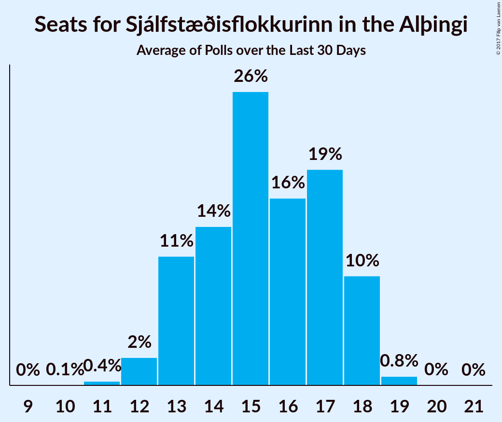

# Sjálfstæðisflokkurinn

<a href="#voting-intentions">Voting Intentions</a> | <a href="#seats">Seats</a>

## Voting Intentions

Last result: **29.0%** (General Election of 29 October 2016)

### Confidence Intervals

| Period     | Polling firm/Commissioner(s) | Median | 80% Confidence Interval | 90% Confidence Interval | 95% Confidence Interval | 99% Confidence Interval |
|:----------:|:----------------:|:-----------:|:-----------------------:|:-----------------------:|:-----------------------:|:-----------------------:|
| N/A | [Poll Average](average.html) | 24.2% | 21.0–25.8% | 20.3–26.3% | 19.7–26.6% | 18.8–27.3% |
| [26–27 October 2017](2017-10-27-MMR.html) | MMR | 21.3% | 19.7–23.1% | 19.3–23.6% | 18.9–24.0% | 18.1–24.9% |
| [23–27 October 2017](2017-10-27-Gallup.html) | Gallup | 25.2% | 24.1–26.5% | 23.7–26.8% | 23.4–27.1% | 22.9–27.7% |
| [22–25 October 2017](2017-10-25-Felagsvisindastofnun.html) | Félagsvísindastofnun   Morgunblaðið | 24.5% | 23.4–25.7% | 23.0–26.0% | 22.8–26.3% | 22.2–26.9% |
| [23–24 October 2017](2017-10-24-Frettabladid.html) | Fréttablaðið | 24.1% | 22.8–25.5% | 22.4–25.9% | 22.1–26.2% | 21.4–26.9% |
| [20–23 October 2017](2017-10-23-MMR.html) | MMR | 23.0% | 21.3–24.8% | 20.9–25.3% | 20.5–25.7% | 19.7–26.6% |
| [13–19 October 2017](2017-10-19-Gallup.html) | Gallup | 22.6% | 21.3–23.9% | 21.0–24.3% | 20.7–24.6% | 20.1–25.3% |
| [16–19 October 2017](2017-10-19-Felagsvisindastofnun.html) | Félagsvísindastofnun   Morgunblaðið | 25.1% | 23.9–26.4% | 23.5–26.8% | 23.2–27.1% | 22.6–27.7% |
| [17–18 October 2017](2017-10-18-MMR.html) | MMR | 19.9% | 18.3–21.6% | 17.9–22.0% | 17.5–22.5% | 16.8–23.3% |
| [16 October 2017](2017-10-16-Frettabladid.html) | Fréttablaðið | 22.2% | 20.4–24.2% | 19.9–24.7% | 19.5–25.2% | 18.6–26.2% |
| [29 September–12 October 2017](2017-10-12-Gallup.html) | Gallup | 23.7% | 22.6–24.9% | 22.3–25.2% | 22.0–25.5% | 21.5–26.0% |
| [9–12 October 2017](2017-10-12-Felagsvisindastofnun.html) | Félagsvísindastofnun   Morgunblaðið | 22.6% | 21.1–24.2% | 20.7–24.6% | 20.4–25.0% | 19.7–25.8% |
| [6–11 October 2017](2017-10-11-MMR.html) | MMR | 21.1% | 19.5–22.8% | 19.0–23.3% | 18.6–23.8% | 17.9–24.6% |
| [10 October 2017](2017-10-10-Frettabladid.html) | Fréttablaðið | 22.2% | 20.4–24.1% | 19.9–24.7% | 19.4–25.2% | 18.6–26.1% |
| [2–6 October 2017](2017-10-06-Felagsvisindastofnun.html) | Félagsvísindastofnun   Morgunblaðið | 20.7% | 19.1–22.5% | 18.6–22.9% | 18.2–23.4% | 17.5–24.2% |
| [2–3 October 2017](2017-10-03-Frettabladid.html) | Fréttablaðið | 22.2% | 20.5–24.2% | 19.9–24.8% | 19.5–25.3% | 18.7–26.2% |
| [26–28 September 2017](2017-09-28-MMR.html) | MMR | 23.5% | 21.9–25.3% | 21.4–25.8% | 21.0–26.3% | 20.3–27.1% |
| [15–28 September 2017](2017-09-28-Gallup.html) | Gallup | 23.1% | 22.1–24.3% | 21.8–24.6% | 21.5–24.9% | 21.0–25.4% |
| [25–28 September 2017](2017-09-28-Felagsvisindastofnun.html) | Félagsvísindastofnun   Morgunblaðið | 24.3% | 22.5–26.1% | 22.1–26.6% | 21.6–27.1% | 20.9–28.0% |
| [19–21 September 2017](2017-09-21-Felagsvisindastofnun.html) | Félagsvísindastofnun   Morgunblaðið | 22.9% | 21.2–24.8% | 20.7–25.3% | 20.3–25.8% | 19.5–26.7% |
| [15–18 September 2017](2017-09-18-Zenter.html) | Zenter | 26.4% | 24.6–28.2% | 24.1–28.8% | 23.7–29.2% | 22.8–30.2% |
| [18 September 2017](2017-09-18-Frettabladid.html) | Fréttablaðið | 23.0% | 21.2–25.0% | 20.7–25.6% | 20.2–26.0% | 19.4–27.0% |
| [10–30 August 2017](2017-08-30-Gallup.html) | Gallup | 26.3% | 25.1–27.5% | 24.8–27.9% | 24.5–28.2% | 23.9–28.8% |
| [15–18 August 2017](2017-08-18-MMR.html) | MMR | 24.5% | 22.8–26.4% | 22.3–26.9% | 21.9–27.4% | 21.1–28.3% |

### Probability Mass Function

The following table shows the probability mass function per percentage block of voting intentions for the [poll average](average.html) for Sjálfstæðisflokkurinn.

| Voting Intentions | Probability | Accumulated | Special Marks |
|:-----------------:|:-----------:|:-----------:|:-------------:|
| 16.5–17.5% | 0% | 100% |  |
| 17.5–18.5% | 0.3% | 100% |  |
| 18.5–19.5% | 2% | 99.7% |  |
| 19.5–20.5% | 5% | 98% |  |
| 20.5–21.5% | 8% | 93% |  |
| 21.5–22.5% | 8% | 86% |  |
| 22.5–23.5% | 13% | 78% |  |
| 23.5–24.5% | 24% | 65% | Median |
| 24.5–25.5% | 25% | 40% |  |
| 25.5–26.5% | 12% | 15% |  |
| 26.5–27.5% | 3% | 3% |  |
| 27.5–28.5% | 0.2% | 0.2% |  |
| 28.5–29.5% | 0% | 0% | Last Result |

## Seats

Last result: **21** seats (General Election of 29 October 2016)

### Confidence Intervals

| Period     | Polling firm/Commissioner(s) | Median | 80% Confidence Interval | 90% Confidence Interval | 95% Confidence Interval | 99% Confidence Interval |
|:----------:|:----------------:|:------:|:-----------------------:|:-----------------------:|:-----------------------:|:-----------------------:|
| N/A | [Poll Average](average.html) | 17 | 14–18 | 14–18 | 13–19 | 13–20 |
| [26–27 October 2017](2017-10-27-MMR.html) | MMR | 14 | 13–16 | 13–16 | 13–17 | 12–17 |
| [23–27 October 2017](2017-10-27-Gallup.html) | Gallup | 18 | 17–19 | 16–19 | 16–19 | 15–20 |
| [22–25 October 2017](2017-10-25-Felagsvisindastofnun.html) | Félagsvísindastofnun   Morgunblaðið | 17 | 16–18 | 15–18 | 15–18 | 15–19 |
| [23–24 October 2017](2017-10-24-Frettabladid.html) | Fréttablaðið | 17 | 16–18 | 16–19 | 15–19 | 15–19 |
| [20–23 October 2017](2017-10-23-MMR.html) | MMR | 16 | 14–18 | 14–18 | 14–18 | 13–19 |
| [13–19 October 2017](2017-10-19-Gallup.html) | Gallup | 15 | 14–16 | 14–17 | 13–17 | 13–18 |
| [16–19 October 2017](2017-10-19-Felagsvisindastofnun.html) | Félagsvísindastofnun   Morgunblaðið | 17 | 16–18 | 16–18 | 16–18 | 15–19 |
| [17–18 October 2017](2017-10-18-MMR.html) | MMR | 13 | 12–14 | 12–15 | 12–15 | 11–16 |
| [16 October 2017](2017-10-16-Frettabladid.html) | Fréttablaðið | 16 | 14–17 | 13–18 | 13–18 | 13–19 |
| [29 September–12 October 2017](2017-10-12-Gallup.html) | Gallup | 18 | 16–18 | 15–18 | 15–18 | 15–19 |
| [9–12 October 2017](2017-10-12-Felagsvisindastofnun.html) | Félagsvísindastofnun   Morgunblaðið | 16 | 15–17 | 14–17 | 14–18 | 13–18 |
| [6–11 October 2017](2017-10-11-MMR.html) | MMR | 15 | 14–16 | 13–16 | 13–17 | 12–18 |
| [10 October 2017](2017-10-10-Frettabladid.html) | Fréttablaðið | 15 | 14–17 | 14–17 | 13–18 | 13–19 |
| [2–6 October 2017](2017-10-06-Felagsvisindastofnun.html) | Félagsvísindastofnun   Morgunblaðið | 14 | 13–15 | 13–16 | 12–16 | 12–17 |
| [2–3 October 2017](2017-10-03-Frettabladid.html) | Fréttablaðið | 15 | 14–17 | 14–17 | 13–18 | 13–19 |
| [26–28 September 2017](2017-09-28-MMR.html) | MMR | 17 | 15–18 | 14–18 | 14–18 | 13–19 |
| [15–28 September 2017](2017-09-28-Gallup.html) | Gallup | 17 | 16–18 | 15–18 | 15–18 | 15–18 |
| [25–28 September 2017](2017-09-28-Felagsvisindastofnun.html) | Félagsvísindastofnun   Morgunblaðið | 17 | 15–18 | 15–19 | 14–20 | 14–21 |
| [19–21 September 2017](2017-09-21-Felagsvisindastofnun.html) | Félagsvísindastofnun   Morgunblaðið | 15 | 14–16 | 13–17 | 13–17 | 13–18 |
| [15–18 September 2017](2017-09-18-Zenter.html) | Zenter | 18 | 16–19 | 16–20 | 16–20 | 15–21 |
| [18 September 2017](2017-09-18-Frettabladid.html) | Fréttablaðið | 15 | 14–17 | 14–18 | 14–18 | 13–20 |
| [10–30 August 2017](2017-08-30-Gallup.html) | Gallup | 18 | 17–20 | 17–20 | 17–20 | 16–20 |
| [15–18 August 2017](2017-08-18-MMR.html) | MMR | 17 | 16–19 | 15–19 | 15–20 | 14–20 |

### Probability Mass Function

The following table shows the probability mass function per seat for the [poll average](average.html) for Sjálfstæðisflokkurinn.

| Number of Seats | Probability | Accumulated | Special Marks |
|:---------------:|:-----------:|:-----------:|:-------------:|
| 12 | 0.4% | 100% |  |
| 13 | 4% | 99.6% |  |
| 14 | 11% | 95% |  |
| 15 | 9% | 85% |  |
| 16 | 16% | 76% |  |
| 17 | 16% | 59% | Median |
| 18 | 39% | 43% |  |
| 19 | 4% | 4% |  |
| 20 | 0.5% | 0.5% |  |
| 21 | 0% | 0% | Last Result |

