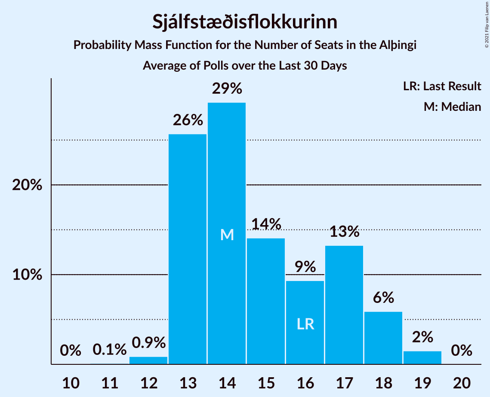

# Sjálfstæðisflokkurinn

<a href="#voting-intentions">Voting Intentions</a> | <a href="#seats">Seats</a>

## Voting Intentions

Last result: **25.2%** (General Election of 28 October 2017)

### Confidence Intervals

| Period     | Polling firm/Commissioner(s) | Median | 80% Confidence Interval | 90% Confidence Interval | 95% Confidence Interval | 99% Confidence Interval |
|:----------:|:----------------:|:-----------:|:-----------------------:|:-----------------------:|:-----------------------:|:-----------------------:|
| N/A | [Poll Average](average.html) | 21.3% | 19.0–22.3% | 18.5–22.6% | 18.1–22.7% | 17.2–23.3% |
| [13–19 December 2019](2019-12-19-MMR.html) | MMR | 20.0% | 18.5–21.7% | 18.0–22.2% | 17.7–22.6% | 17.0–23.4% |
| [28 October–1 December 2019](2019-12-01-Gallup.html) | Gallup | 21.7% | 21.1–22.5% | 20.9–22.6% | 20.7–22.8% | 20.4–23.1% |
| [15–22 November 2019](2019-11-22-MMR.html) | MMR | 18.1% | N/A | N/A | N/A | N/A |
| [30 September–27 October 2019](2019-10-27-Gallup.html) | Gallup | 22.8% | N/A | N/A | N/A | N/A |
| [21–25 October 2019](2019-10-25-MMR.html) | MMR | 21.1% | 19.5–22.8% | 19.0–23.3% | 18.6–23.8% | 17.9–24.6% |
| [10–14 October 2019](2019-10-14-Zenter.html) | Zenter | 19.7% | N/A | N/A | N/A | N/A |
| [30 September–9 October 2019](2019-10-09-MMR.html) | MMR | 19.8% | N/A | N/A | N/A | N/A |
| [9–16 September 2019](2019-09-16-MMR.html) | MMR | 18.3% | N/A | N/A | N/A | N/A |
| [29 July–1 September 2019](2019-09-01-Gallup.html) | Gallup | 21.7% | N/A | N/A | N/A | N/A |
| [12–19 August 2019](2019-08-19-MMR.html) | MMR | 19.1% | N/A | N/A | N/A | N/A |
| [24–26 July 2019](2019-07-26-Zenter.html) | Zenter | 20.4% | N/A | N/A | N/A | N/A |
| [4–17 July 2019](2019-07-17-MMR.html) | MMR | 19.0% | N/A | N/A | N/A | N/A |
| [31 May–30 June 2019](2019-06-30-Gallup.html) | Gallup | 23.7% | N/A | N/A | N/A | N/A |
| [7–14 June 2019](2019-06-14-MMR.html) | MMR | 22.2% | N/A | N/A | N/A | N/A |
| [3–30 May 2019](2019-05-30-Gallup.html) | Gallup | 23.4% | 22.5–24.4% | 22.2–24.6% | 22.0–24.9% | 21.6–25.3% |
| [23–29 May 2019](2019-05-29-MMR.html) | MMR | 21.5% | 19.8–23.3% | 19.3–23.8% | 18.9–24.2% | 18.2–25.1% |
| [14–16 May 2019](2019-05-16-MMR.html) | MMR | 21.3% | N/A | N/A | N/A | N/A |
| [30 April–3 May 2019](2019-05-03-MMR.html) | MMR | 20.2% | N/A | N/A | N/A | N/A |
| [5–30 April 2019](2019-04-30-Gallup.html) | Gallup | 23.6% | N/A | N/A | N/A | N/A |
| [4–9 April 2019](2019-04-09-MMR.html) | MMR | 21.7% | N/A | N/A | N/A | N/A |
| [1–31 March 2019](2019-03-31-Gallup.html) | Gallup | 25.0% | N/A | N/A | N/A | N/A |
| [11–14 March 2019](2019-03-14-MMR.html) | MMR | 23.6% | N/A | N/A | N/A | N/A |
| [31 January–28 February 2019](2019-02-28-Gallup.html) | Gallup | 25.0% | N/A | N/A | N/A | N/A |
| [11–15 February 2019](2019-02-15-MMR.html) | MMR | 22.7% | N/A | N/A | N/A | N/A |
| [7–31 January 2019](2019-01-31-Gallup.html) | Gallup | 23.4% | N/A | N/A | N/A | N/A |
| [4–14 January 2019](2019-01-14-MMR.html) | MMR | 22.2% | 21.1–23.4% | 20.8–23.8% | 20.5–24.1% | 20.0–24.6% |
| [3 December 2018–1 January 2019](2019-01-01-Gallup.html) | Gallup | 22.7% | N/A | N/A | N/A | N/A |
| [5–11 December 2018](2018-12-11-MMR.html) | MMR | 22.1% | 20.4–23.8% | 20.0–24.3% | 19.6–24.8% | 18.8–25.6% |
| [3–4 December 2018](2018-12-04-Zenter.html) | Zenter | 21.4% | 20.0–23.0% | 19.6–23.4% | 19.2–23.8% | 18.6–24.5% |
| [30 November–3 December 2018](2018-12-03-Maskína.html) | Maskína | 19.3% | 18.0–20.8% | 17.6–21.2% | 17.3–21.5% | 16.6–22.2% |
| [3 November–2 December 2018](2018-12-02-Gallup.html) | Gallup | 23.5% | N/A | N/A | N/A | N/A |
| [8–12 November 2018](2018-11-12-MMR.html) | MMR | 19.8% | 18.3–21.5% | 17.9–22.0% | 17.5–22.4% | 16.8–23.2% |
| [2–31 October 2018](2018-10-31-Gallup.html) | Gallup | 25.8% | 24.9–26.8% | 24.6–27.1% | 24.4–27.3% | 23.9–27.8% |
| [3–9 October 2018](2018-10-09-MMR.html) | MMR | 20.8% | 19.2–22.6% | 18.7–23.2% | 18.4–23.6% | 17.6–24.5% |
| [3 September–1 October 2018](2018-10-01-Gallup.html) | Gallup | 24.6% | 23.6–25.7% | 23.3–25.9% | 23.1–26.2% | 22.6–26.7% |
| [7–12 September 2018](2018-09-12-MMR.html) | MMR | 21.3% | 19.7–23.1% | 19.2–23.6% | 18.8–24.0% | 18.1–24.9% |
| [2 August–2 September 2018](2018-09-02-Gallup.html) | Gallup | 22.7% | 21.8–23.6% | 21.6–23.9% | 21.4–24.1% | 21.0–24.5% |
| [29 June–30 July 2018](2018-07-30-Gallup.html) | Gallup | 24.6% | 23.7–25.5% | 23.4–25.8% | 23.2–26.0% | 22.8–26.5% |
| [31 May–1 July 2018](2018-07-01-Gallup.html) | Gallup | 24.5% | 23.6–25.5% | 23.3–25.8% | 23.1–26.0% | 22.6–26.5% |
| [12–18 June 2018](2018-06-18-MMR.html) | MMR | 21.6% | 20.0–23.4% | 19.5–23.9% | 19.1–24.4% | 18.3–25.3% |
| [2–31 May 2018](2018-05-31-Gallup.html) | Gallup | 23.8% | 23.0–24.7% | 22.7–24.9% | 22.5–25.1% | 22.1–25.5% |
| [16–22 May 2018](2018-05-22-MMR.html) | MMR | 23.7% | 22.0–25.5% | 21.5–26.1% | 21.1–26.5% | 20.3–27.4% |
| [27 March–29 April 2018](2018-04-29-Gallup.html) | Gallup | 25.3% | 24.4–26.2% | 24.2–26.5% | 24.0–26.7% | 23.5–27.1% |
| [13–19 April 2018](2018-04-19-MMR.html) | MMR | 24.0% | 22.2–25.8% | 21.7–26.4% | 21.3–26.8% | 20.5–27.8% |
| [1–26 March 2018](2018-03-26-Gallup.html) | Gallup | 24.5% | 23.5–25.5% | 23.2–25.8% | 23.0–26.0% | 22.6–26.5% |
| [1–28 February 2018](2018-02-28-Gallup.html) | Gallup | 23.5% | 22.5–24.5% | 22.2–24.8% | 22.0–25.0% | 21.6–25.5% |
| [4–31 January 2018](2018-01-31-Gallup.html) | Gallup | 25.5% | 24.5–26.5% | 24.2–26.8% | 24.0–27.1% | 23.5–27.6% |
| [25–30 January 2018](2018-01-30-MMR.html) | MMR | 22.3% | 20.6–24.1% | 20.1–24.6% | 19.7–25.1% | 19.0–26.0% |
| [9–17 January 2018](2018-01-17-MMR.html) | MMR | 25.8% | 24.5–27.3% | 24.1–27.7% | 23.8–28.0% | 23.1–28.7% |
| [30 November–28 December 2017](2017-12-28-Gallup.html) | Gallup | 25.1% | 24.2–26.0% | 24.0–26.3% | 23.8–26.5% | 23.4–26.9% |
| [12–15 December 2017](2017-12-15-MMR.html) | MMR | 23.2% | 21.5–25.0% | 21.0–25.6% | 20.6–26.0% | 19.8–26.9% |
| [4 December 2017](2017-12-04-Fréttablaðið-Stöð2-Vísir.html) | Fréttablaðið, Stöð 2 and Vísir | 26.4% | 24.4–28.4% | 23.9–29.0% | 23.4–29.5% | 22.5–30.5% |
| [8–30 November 2017](2017-11-30-Gallup.html) | Gallup | 24.0% | 22.9–25.2% | 22.6–25.5% | 22.3–25.8% | 21.8–26.4% |
| [14–17 November 2017](2017-11-17-MMR.html) | MMR | 24.4% | 22.6–26.2% | 22.1–26.7% | 21.7–27.2% | 20.9–28.1% |

### Probability Mass Function

The following table shows the probability mass function per percentage block of voting intentions for the [poll average](average.html) for Sjálfstæðisflokkurinn.

| Voting Intentions | Probability | Accumulated | Special Marks |
|:-----------------:|:-----------:|:-----------:|:-------------:|
| 14.5–15.5% | 0% | 100% |  |
| 15.5–16.5% | 0.1% | 100% |  |
| 16.5–17.5% | 0.9% | 99.9% |  |
| 17.5–18.5% | 5% | 99.1% |  |
| 18.5–19.5% | 12% | 95% |  |
| 19.5–20.5% | 16% | 83% |  |
| 20.5–21.5% | 28% | 67% | Median |
| 21.5–22.5% | 34% | 39% |  |
| 22.5–23.5% | 5% | 5% |  |
| 23.5–24.5% | 0.2% | 0.2% |  |
| 24.5–25.5% | 0% | 0% | Last Result |

## Seats

Last result: **16** seats (General Election of 28 October 2017)

### Confidence Intervals

| Period     | Polling firm/Commissioner(s) | Median | 80% Confidence Interval | 90% Confidence Interval | 95% Confidence Interval | 99% Confidence Interval |
|:----------:|:----------------:|:------:|:-----------------------:|:-----------------------:|:-----------------------:|:-----------------------:|
| N/A | [Poll Average](average.html) | 13 | 13 | 13 | 13 | 11–13 |
| [13–19 December 2019](2019-12-19-MMR.html) | MMR | 13 | 13 | 13 | 13 | 11–13 |
| [28 October–1 December 2019](2019-12-01-Gallup.html) | Gallup |  |  |  |  |  |
| [15–22 November 2019](2019-11-22-MMR.html) | MMR |  |  |  |  |  |
| [30 September–27 October 2019](2019-10-27-Gallup.html) | Gallup |  |  |  |  |  |
| [21–25 October 2019](2019-10-25-MMR.html) | MMR | 13 | 12–15 | 12–15 | 12–15 | 12–17 |
| [10–14 October 2019](2019-10-14-Zenter.html) | Zenter |  |  |  |  |  |
| [30 September–9 October 2019](2019-10-09-MMR.html) | MMR |  |  |  |  |  |
| [9–16 September 2019](2019-09-16-MMR.html) | MMR |  |  |  |  |  |
| [29 July–1 September 2019](2019-09-01-Gallup.html) | Gallup |  |  |  |  |  |
| [12–19 August 2019](2019-08-19-MMR.html) | MMR |  |  |  |  |  |
| [24–26 July 2019](2019-07-26-Zenter.html) | Zenter |  |  |  |  |  |
| [4–17 July 2019](2019-07-17-MMR.html) | MMR |  |  |  |  |  |
| [31 May–30 June 2019](2019-06-30-Gallup.html) | Gallup |  |  |  |  |  |
| [7–14 June 2019](2019-06-14-MMR.html) | MMR |  |  |  |  |  |
| [3–30 May 2019](2019-05-30-Gallup.html) | Gallup | 16 | 16 | 16 | 16 | 16–17 |
| [23–29 May 2019](2019-05-29-MMR.html) | MMR | 15 | 15 | 15–16 | 15–16 | 15–16 |
| [14–16 May 2019](2019-05-16-MMR.html) | MMR |  |  |  |  |  |
| [30 April–3 May 2019](2019-05-03-MMR.html) | MMR |  |  |  |  |  |
| [5–30 April 2019](2019-04-30-Gallup.html) | Gallup |  |  |  |  |  |
| [4–9 April 2019](2019-04-09-MMR.html) | MMR |  |  |  |  |  |
| [1–31 March 2019](2019-03-31-Gallup.html) | Gallup |  |  |  |  |  |
| [11–14 March 2019](2019-03-14-MMR.html) | MMR |  |  |  |  |  |
| [31 January–28 February 2019](2019-02-28-Gallup.html) | Gallup |  |  |  |  |  |
| [11–15 February 2019](2019-02-15-MMR.html) | MMR |  |  |  |  |  |
| [7–31 January 2019](2019-01-31-Gallup.html) | Gallup |  |  |  |  |  |
| [4–14 January 2019](2019-01-14-MMR.html) | MMR | 15 | 14–16 | 14–16 | 13–16 | 13–17 |
| [3 December 2018–1 January 2019](2019-01-01-Gallup.html) | Gallup |  |  |  |  |  |
| [5–11 December 2018](2018-12-11-MMR.html) | MMR | 15 | 14–16 | 13–17 | 13–17 | 13–18 |
| [3–4 December 2018](2018-12-04-Zenter.html) | Zenter | 15 | 14–16 | 13–16 | 13–17 | 13–17 |
| [30 November–3 December 2018](2018-12-03-Maskína.html) | Maskína | 13 | 12–14 | 12–15 | 12–15 | 11–15 |
| [3 November–2 December 2018](2018-12-02-Gallup.html) | Gallup |  |  |  |  |  |
| [8–12 November 2018](2018-11-12-MMR.html) | MMR | 13 | 12–14 | 12–15 | 12–15 | 11–15 |
| [2–31 October 2018](2018-10-31-Gallup.html) | Gallup | 17 | 15–19 | 15–19 | 15–19 | 15–21 |
| [3–9 October 2018](2018-10-09-MMR.html) | MMR | 14 | 13–15 | 13–15 | 12–16 | 12–17 |
| [3 September–1 October 2018](2018-10-01-Gallup.html) | Gallup | 17 | 17 | 17 | 17 | 15–17 |
| [7–12 September 2018](2018-09-12-MMR.html) | MMR | 14 | 13–15 | 13–16 | 12–16 | 12–17 |
| [2 August–2 September 2018](2018-09-02-Gallup.html) | Gallup | 14 | 14 | 14 | 14 | 14–16 |
| [29 June–30 July 2018](2018-07-30-Gallup.html) | Gallup | 17 | 17 | 17 | 17 | 17–18 |
| [31 May–1 July 2018](2018-07-01-Gallup.html) | Gallup | 19 | 15–19 | 15–19 | 15–19 | 15–19 |
| [12–18 June 2018](2018-06-18-MMR.html) | MMR | 14 | 13–15 | 13–16 | 12–16 | 12–17 |
| [2–31 May 2018](2018-05-31-Gallup.html) | Gallup | 16 | 16–17 | 15–17 | 15–17 | 15–18 |
| [16–22 May 2018](2018-05-22-MMR.html) | MMR | 16 | 15–18 | 14–18 | 14–18 | 13–19 |
| [27 March–29 April 2018](2018-04-29-Gallup.html) | Gallup | 18 | 17–18 | 17–19 | 16–19 | 16–19 |
| [13–19 April 2018](2018-04-19-MMR.html) | MMR | 16 | 15–18 | 15–18 | 14–18 | 14–19 |
| [1–26 March 2018](2018-03-26-Gallup.html) | Gallup | 17 | 16–17 | 15–18 | 15–18 | 15–18 |
| [1–28 February 2018](2018-02-28-Gallup.html) | Gallup | 16 | 15–16 | 15–17 | 15–17 | 14–18 |
| [4–31 January 2018](2018-01-31-Gallup.html) | Gallup | 17 | 16–19 | 16–19 | 16–19 | 15–19 |
| [25–30 January 2018](2018-01-30-MMR.html) | MMR | 15 | 14–17 | 14–17 | 13–17 | 13–18 |
| [9–17 January 2018](2018-01-17-MMR.html) | MMR | 18 | 16–19 | 16–19 | 16–19 | 15–19 |
| [30 November–28 December 2017](2017-12-28-Gallup.html) | Gallup | 17 | 16–18 | 16–18 | 16–18 | 15–19 |
| [12–15 December 2017](2017-12-15-MMR.html) | MMR | 16 | 15–18 | 14–18 | 14–18 | 13–19 |
| [4 December 2017](2017-12-04-Fréttablaðið-Stöð2-Vísir.html) | Fréttablaðið, Stöð 2 and Vísir | 18 | 17–20 | 16–20 | 16–21 | 15–22 |
| [8–30 November 2017](2017-11-30-Gallup.html) | Gallup | 16 | 15–17 | 15–18 | 15–18 | 14–19 |
| [14–17 November 2017](2017-11-17-MMR.html) | MMR | 16 | 15–17 | 14–18 | 14–18 | 14–19 |

### Probability Mass Function

The following table shows the probability mass function per seat for the [poll average](average.html) for Sjálfstæðisflokkurinn.

| Number of Seats | Probability | Accumulated | Special Marks |
|:---------------:|:-----------:|:-----------:|:-------------:|
| 11 | 0.7% | 100% |  |
| 12 | 0% | 99.3% |  |
| 13 | 98.9% | 99.3% | Median |
| 14 | 0.3% | 0.4% |  |
| 15 | 0% | 0.1% |  |
| 16 | 0% | 0.1% | Last Result |
| 17 | 0% | 0.1% |  |
| 18 | 0% | 0% |  |

