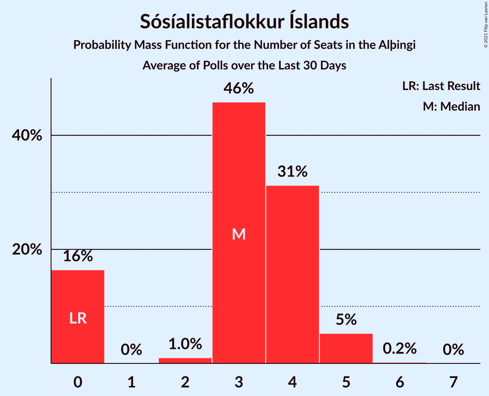

# Sósíalistaflokkur Íslands

<a href="#voting-intentions">Voting Intentions</a> | <a href="#seats">Seats</a>

## Voting Intentions

Last result: **0.0%** (General Election of 28 October 2017)

### Confidence Intervals

| Period     | Polling firm/Commissioner(s) | Median | 80% Confidence Interval | 90% Confidence Interval | 95% Confidence Interval | 99% Confidence Interval |
|:----------:|:----------------:|:-----------:|:-----------------------:|:-----------------------:|:-----------------------:|:-----------------------:|
| N/A | [Poll Average](average.html) | 3.9% | 3.6–4.3% | 3.5–4.4% | 3.4–4.5% | 3.3–4.7% |
| [4–31 August 2020](2020-08-31-Gallup.html) | Gallup | 3.9% | 3.6–4.3% | 3.5–4.4% | 3.4–4.5% | 3.2–4.7% |
| [23–28 July 2020](2020-07-28-MMR.html) | MMR | 5.2% | 4.3–6.2% | 4.1–6.5% | 3.9–6.8% | 3.6–7.3% |
| [2–30 June 2020](2020-06-30-Gallup.html) | Gallup | 3.8% | 3.5–4.2% | 3.4–4.3% | 3.3–4.3% | 3.2–4.5% |
| [16–19 June 2020](2020-06-19-MMR.html) | MMR | 3.5% | 2.9–4.4% | 2.7–4.6% | 2.6–4.8% | 2.3–5.3% |
| [4 May–1 June 2020](2020-06-01-Gallup.html) | Gallup | 3.3% | 3.0–3.6% | 2.9–3.7% | 2.9–3.8% | 2.7–4.0% |
| [19–25 May 2020](2020-05-25-MMR.html) | MMR | 4.1% | 3.4–5.1% | 3.2–5.3% | 3.0–5.5% | 2.7–6.0% |
| [30 March–3 May 2020](2020-05-03-Gallup.html) | Gallup | 4.0% | 3.7–4.3% | 3.6–4.4% | 3.5–4.5% | 3.4–4.7% |
| [15–17 April 2020](2020-04-17-MMR.html) | MMR | 5.6% | 4.8–6.6% | 4.6–6.9% | 4.4–7.2% | 4.0–7.7% |
| [3–7 April 2020](2020-04-07-MMR.html) | MMR | 3.4% | 2.8–4.3% | 2.6–4.6% | 2.5–4.8% | 2.2–5.2% |
| [2–29 March 2020](2020-03-29-Gallup.html) | Gallup | 3.2% | 2.9–3.5% | 2.8–3.6% | 2.8–3.7% | 2.7–3.9% |
| [18–20 March 2020](2020-03-20-MMR.html) | MMR | 4.7% | 4.0–5.7% | 3.8–6.0% | 3.6–6.2% | 3.3–6.7% |
| [3 February–1 March 2020](2020-03-01-Gallup.html) | Gallup | 4.9% | 4.5–5.3% | 4.4–5.5% | 4.3–5.6% | 4.1–5.8% |
| [6–10 February 2020](2020-02-10-MMR.html) | MMR | 5.3% | 4.5–6.3% | 4.3–6.6% | 4.1–6.9% | 3.7–7.4% |
| [3 January–2 February 2020](2020-02-02-Gallup.html) | Gallup | 3.4% | 3.1–3.8% | 3.0–3.9% | 2.9–4.0% | 2.8–4.2% |
| [28 January 2020](2020-01-28-MMR.html) | MMR | 4.9% | 4.1–6.0% | 3.9–6.3% | 3.7–6.6% | 3.4–7.1% |
| [3–13 January 2020](2020-01-13-MMR.html) | MMR | 4.1% | 3.6–4.7% | 3.4–4.9% | 3.3–5.0% | 3.1–5.3% |
| [2 December 2019–1 January 2020](2020-01-01-Gallup.html) | Gallup | 3.3% | 3.0–3.7% | 2.9–3.8% | 2.8–3.9% | 2.7–4.1% |
| [13–19 December 2019](2019-12-19-MMR.html) | MMR | 5.2% | 4.4–6.2% | 4.2–6.5% | 4.0–6.8% | 3.7–7.3% |
| [28 October–1 December 2019](2019-12-01-Gallup.html) | Gallup | 3.0% | 2.7–3.3% | 2.7–3.4% | 2.6–3.4% | 2.5–3.6% |
| [15–22 November 2019](2019-11-22-MMR.html) | MMR | 3.0% | 2.4–3.8% | 2.3–4.0% | 2.1–4.2% | 1.9–4.6% |
| [30 September–27 October 2019](2019-10-27-Gallup.html) | Gallup | 2.6% | 2.3–2.9% | 2.3–3.0% | 2.2–3.1% | 2.1–3.2% |
| [21–25 October 2019](2019-10-25-MMR.html) | MMR | 2.6% | 2.0–3.4% | 1.9–3.6% | 1.8–3.8% | 1.5–4.2% |
| [10–14 October 2019](2019-10-14-Zenter.html) | Zenter | 2.9% | 2.3–3.6% | 2.2–3.8% | 2.1–4.0% | 1.8–4.3% |
| [30 September–9 October 2019](2019-10-09-MMR.html) | MMR | 3.1% | 2.7–3.6% | 2.5–3.8% | 2.5–3.9% | 2.3–4.2% |
| [1–30 September 2019](2019-09-30-Gallup.html) | Gallup | 2.7% | 2.3–3.2% | 2.2–3.4% | 2.1–3.5% | 1.9–3.8% |
| [9–16 September 2019](2019-09-16-MMR.html) | MMR | 2.0% | 1.6–2.7% | 1.4–2.9% | 1.3–3.1% | 1.1–3.4% |
| [29 July–1 September 2019](2019-09-01-Gallup.html) | Gallup | 3.7% | 3.3–4.1% | 3.2–4.2% | 3.2–4.3% | 3.0–4.5% |
| [12–19 August 2019](2019-08-19-MMR.html) | MMR | 2.9% | 2.3–3.7% | 2.2–4.0% | 2.0–4.2% | 1.8–4.6% |
| [1–31 July 2019](2019-07-31-Gallup.html) | Gallup | 3.2% | 2.7–3.8% | 2.6–3.9% | 2.5–4.1% | 2.3–4.3% |
| [24–26 July 2019](2019-07-26-Zenter.html) | Zenter | 2.7% | 2.1–3.5% | 1.9–3.7% | 1.8–3.9% | 1.6–4.4% |
| [4–17 July 2019](2019-07-17-MMR.html) | MMR | 4.3% | 3.7–4.9% | 3.6–5.1% | 3.5–5.3% | 3.2–5.6% |
| [31 May–30 June 2019](2019-06-30-Gallup.html) | Gallup | 3.0% | 2.6–3.4% | 2.5–3.6% | 2.5–3.7% | 2.3–3.9% |
| [7–14 June 2019](2019-06-14-MMR.html) | MMR | 4.5% | 3.7–5.4% | 3.5–5.7% | 3.3–5.9% | 3.0–6.4% |
| [3–30 May 2019](2019-05-30-Gallup.html) | Gallup | 3.7% | 3.3–4.1% | 3.2–4.3% | 3.1–4.4% | 2.9–4.6% |
| [23–29 May 2019](2019-05-29-MMR.html) | MMR | 3.4% | 2.8–4.3% | 2.6–4.6% | 2.4–4.8% | 2.2–5.3% |
| [14–16 May 2019](2019-05-16-MMR.html) | MMR | 3.2% | 2.6–4.0% | 2.4–4.3% | 2.2–4.5% | 2.0–4.9% |
| [30 April–3 May 2019](2019-05-03-MMR.html) | MMR | 4.3% | 3.5–5.2% | 3.3–5.5% | 3.1–5.7% | 2.8–6.2% |
| [5–30 April 2019](2019-04-30-Gallup.html) | Gallup | 3.6% | 3.2–4.1% | 3.1–4.2% | 3.0–4.3% | 2.8–4.6% |
| [13 April 2019](2019-04-13-MMR.html) | MMR | 2.9% | 2.3–3.7% | 2.1–3.9% | 2.0–4.2% | 1.7–4.6% |
| [4–9 April 2019](2019-04-09-MMR.html) | MMR | 4.5% | 3.8–5.5% | 3.6–5.8% | 3.4–6.1% | 3.0–6.6% |
| [1–31 March 2019](2019-03-31-Gallup.html) | Gallup | 3.5% | 3.1–3.9% | 3.0–4.0% | 3.0–4.1% | 2.8–4.3% |
| [11–14 March 2019](2019-03-14-MMR.html) | MMR | 2.5% | 2.0–3.3% | 1.9–3.5% | 1.7–3.7% | 1.5–4.1% |
| [31 January–28 February 2019](2019-02-28-Gallup.html) | Gallup | 5.0% | 4.6–5.5% | 4.5–5.6% | 4.4–5.7% | 4.2–6.0% |
| [11–15 February 2019](2019-02-15-MMR.html) | MMR | 3.6% | 3.0–4.6% | 2.8–4.8% | 2.6–5.0% | 2.3–5.5% |
| [7–31 January 2019](2019-01-31-Gallup.html) | Gallup | 5.3% | 4.7–5.9% | 4.6–6.1% | 4.5–6.3% | 4.2–6.6% |
| [28 January 2019](2019-01-28-MMR.html) | MMR | 0.0% | N/A | N/A | N/A | N/A |
| [4–14 January 2019](2019-01-14-MMR.html) | MMR | 0.0% | N/A | N/A | N/A | N/A |
| [3 December 2018–1 January 2019](2019-01-01-Gallup.html) | Gallup | 3.4% | 3.0–3.9% | 2.9–4.0% | 2.8–4.1% | 2.6–4.4% |
| [5–11 December 2018](2018-12-11-MMR.html) | MMR | 0.0% | N/A | N/A | N/A | N/A |
| [3–4 December 2018](2018-12-04-Zenter.html) | Zenter | 0.0% | N/A | N/A | N/A | N/A |
| [30 November–3 December 2018](2018-12-03-Maskína.html) | Maskína | 0.0% | N/A | N/A | N/A | N/A |
| [3 November–2 December 2018](2018-12-02-Gallup.html) | Gallup | 1.3% | 1.1–1.6% | 1.0–1.7% | 0.9–1.8% | 0.9–1.9% |
| [21 November 2018](2018-11-21-MMR.html) | MMR | 0.0% | N/A | N/A | N/A | N/A |
| [8–12 November 2018](2018-11-12-MMR.html) | MMR | 0.0% | N/A | N/A | N/A | N/A |
| [2–31 October 2018](2018-10-31-Gallup.html) | Gallup | 1.1% | 0.9–1.4% | 0.8–1.4% | 0.8–1.5% | 0.7–1.7% |
| [22 October 2018](2018-10-22-MMR.html) | MMR | 0.0% | N/A | N/A | N/A | N/A |
| [3–9 October 2018](2018-10-09-MMR.html) | MMR | 0.0% | N/A | N/A | N/A | N/A |
| [3 September–1 October 2018](2018-10-01-Gallup.html) | Gallup | 0.9% | 0.7–1.2% | 0.7–1.2% | 0.6–1.3% | 0.5–1.4% |
| [7–12 September 2018](2018-09-12-MMR.html) | MMR | 0.0% | N/A | N/A | N/A | N/A |
| [2 August–2 September 2018](2018-09-02-Gallup.html) | Gallup | 0.7% | 0.5–0.9% | 0.5–1.0% | 0.5–1.0% | 0.4–1.1% |
| [10 August 2018](2018-08-10-MMR.html) | MMR | 0.0% | N/A | N/A | N/A | N/A |
| [29 June–30 July 2018](2018-07-30-Gallup.html) | Gallup | 0.9% | 0.7–1.1% | 0.7–1.2% | 0.6–1.3% | 0.6–1.4% |
| [31 May–1 July 2018](2018-07-01-Gallup.html) | Gallup | 1.0% | 0.8–1.2% | 0.7–1.3% | 0.7–1.4% | 0.6–1.5% |
| [12–18 June 2018](2018-06-18-MMR.html) | MMR | 0.0% | N/A | N/A | N/A | N/A |
| [2–31 May 2018](2018-05-31-Gallup.html) | Gallup | 0.0% | N/A | N/A | N/A | N/A |
| [16–22 May 2018](2018-05-22-MMR.html) | MMR | 0.0% | N/A | N/A | N/A | N/A |
| [2 May 2018](2018-05-02-MMR.html) | MMR | 0.0% | N/A | N/A | N/A | N/A |
| [27 March–29 April 2018](2018-04-29-Gallup.html) | Gallup | 0.0% | N/A | N/A | N/A | N/A |
| [13–19 April 2018](2018-04-19-MMR.html) | MMR | 0.0% | N/A | N/A | N/A | N/A |
| [1–26 March 2018](2018-03-26-Gallup.html) | Gallup | 0.0% | N/A | N/A | N/A | N/A |
| [19 March 2018](2018-03-19-MMR.html) | MMR | 0.0% | N/A | N/A | N/A | N/A |
| [1–28 February 2018](2018-02-28-Gallup.html) | Gallup | 0.0% | N/A | N/A | N/A | N/A |
| [4–31 January 2018](2018-01-31-Gallup.html) | Gallup | 0.0% | N/A | N/A | N/A | N/A |
| [25–30 January 2018](2018-01-30-MMR.html) | MMR | 0.0% | N/A | N/A | N/A | N/A |
| [9–17 January 2018](2018-01-17-MMR.html) | MMR | 0.0% | N/A | N/A | N/A | N/A |
| [30 November–28 December 2017](2017-12-28-Gallup.html) | Gallup | 0.0% | N/A | N/A | N/A | N/A |
| [12–15 December 2017](2017-12-15-MMR.html) | MMR | 0.0% | N/A | N/A | N/A | N/A |
| [4 December 2017](2017-12-04-FréttablaðiðStöð2Vísir.html) | Fréttablaðið/Stöð 2/Vísir | 0.0% | N/A | N/A | N/A | N/A |
| [4 December 2017](2017-12-04-Fréttablaðið-Stöð2-Vísir.html) | Fréttablaðið, Stöð 2 and Vísir | 0.0% | N/A | N/A | N/A | N/A |
| [8–30 November 2017](2017-11-30-Gallup.html) | Gallup | 0.0% | N/A | N/A | N/A | N/A |
| [14–17 November 2017](2017-11-17-MMR.html) | MMR | 0.0% | N/A | N/A | N/A | N/A |

### Probability Mass Function

The following table shows the probability mass function per percentage block of voting intentions for the [poll average](average.html) for Sósíalistaflokkur Íslands.

| Voting Intentions | Probability | Accumulated | Special Marks |
|:-----------------:|:-----------:|:-----------:|:-------------:|
| 0.0–0.5% | 0% | 100% | Last Result |
| 0.5–1.5% | 0% | 100% |  |
| 1.5–2.5% | 0% | 100% |  |
| 2.5–3.5% | 8% | 100% |  |
| 3.5–4.5% | 90% | 92% | Median |
| 4.5–5.5% | 1.2% | 1.2% |  |
| 5.5–6.5% | 0% | 0% |  |

## Seats

Last result: **0** seats (General Election of 28 October 2017)

### Confidence Intervals

| Period     | Polling firm/Commissioner(s) | Median | 80% Confidence Interval | 90% Confidence Interval | 95% Confidence Interval | 99% Confidence Interval |
|:----------:|:----------------:|:------:|:-----------------------:|:-----------------------:|:-----------------------:|:-----------------------:|
| N/A | [Poll Average](average.html) | 0 | 0 | 0 | 0 | 0 |
| [4–31 August 2020](2020-08-31-Gallup.html) | Gallup | 0 | 0 | 0 | 0 | 0 |
| [23–28 July 2020](2020-07-28-MMR.html) | MMR | 3 | 0–4 | 0–4 | 0–4 | 0–5 |
| [2–30 June 2020](2020-06-30-Gallup.html) | Gallup | 0 | 0 | 0 | 0 | 0 |
| [16–19 June 2020](2020-06-19-MMR.html) | MMR | 0 | 0 | 0 | 0 | 0–3 |
| [4 May–1 June 2020](2020-06-01-Gallup.html) | Gallup | 0 | 0 | 0 | 0 | 0 |
| [19–25 May 2020](2020-05-25-MMR.html) | MMR | 0 | 0–3 | 0–3 | 0–3 | 0–4 |
| [30 March–3 May 2020](2020-05-03-Gallup.html) | Gallup | 0 | 0 | 0 | 0 | 0 |
| [15–17 April 2020](2020-04-17-MMR.html) | MMR | 3 | 0–4 | 0–4 | 0–4 | 0–5 |
| [3–7 April 2020](2020-04-07-MMR.html) | MMR | 0 | 0 | 0 | 0 | 0–3 |
| [2–29 March 2020](2020-03-29-Gallup.html) | Gallup | 0 | 0 | 0 | 0 | 0 |
| [18–20 March 2020](2020-03-20-MMR.html) | MMR | 0 | 0–3 | 0–4 | 0–4 | 0–4 |
| [3 February–1 March 2020](2020-03-01-Gallup.html) | Gallup | 0 | 0–3 | 0–3 | 0–3 | 0–4 |
| [6–10 February 2020](2020-02-10-MMR.html) | MMR | 3 | 0–4 | 0–4 | 0–4 | 0–5 |
| [3 January–2 February 2020](2020-02-02-Gallup.html) | Gallup | 0 | 0 | 0 | 0 | 0 |
| [28 January 2020](2020-01-28-MMR.html) | MMR | 1 | 0–4 | 0–4 | 0–4 | 0–4 |
| [3–13 January 2020](2020-01-13-MMR.html) | MMR | 0 | 0 | 0 | 0–3 | 0–3 |
| [2 December 2019–1 January 2020](2020-01-01-Gallup.html) | Gallup | 0 | 0 | 0 | 0 | 0 |
| [13–19 December 2019](2019-12-19-MMR.html) | MMR | 3 | 0–4 | 0–4 | 0–4 | 0–5 |
| [28 October–1 December 2019](2019-12-01-Gallup.html) | Gallup | 0 | 0 | 0 | 0 | 0 |
| [15–22 November 2019](2019-11-22-MMR.html) | MMR | 0 | 0 | 0 | 0 | 0 |
| [30 September–27 October 2019](2019-10-27-Gallup.html) | Gallup | 0 | 0 | 0 | 0 | 0 |
| [21–25 October 2019](2019-10-25-MMR.html) | MMR | 0 | 0 | 0 | 0 | 0 |
| [10–14 October 2019](2019-10-14-Zenter.html) | Zenter | 0 | 0 | 0 | 0 | 0 |
| [30 September–9 October 2019](2019-10-09-MMR.html) | MMR | 0 | 0 | 0 | 0 | 0 |
| [1–30 September 2019](2019-09-30-Gallup.html) | Gallup | 0 | 0 | 0 | 0 | 0 |
| [9–16 September 2019](2019-09-16-MMR.html) | MMR | 0 | 0 | 0 | 0 | 0 |
| [29 July–1 September 2019](2019-09-01-Gallup.html) | Gallup | 0 | 0 | 0 | 0 | 0 |
| [12–19 August 2019](2019-08-19-MMR.html) | MMR | 0 | 0 | 0 | 0 | 0 |
| [1–31 July 2019](2019-07-31-Gallup.html) | Gallup | 0 | 0 | 0 | 0 | 0 |
| [24–26 July 2019](2019-07-26-Zenter.html) | Zenter | 0 | 0 | 0 | 0 | 0 |
| [4–17 July 2019](2019-07-17-MMR.html) | MMR | 0 | 0 | 0–3 | 0–3 | 0–3 |
| [31 May–30 June 2019](2019-06-30-Gallup.html) | Gallup | 0 | 0 | 0 | 0 | 0 |
| [7–14 June 2019](2019-06-14-MMR.html) | MMR | 0 | 0–3 | 0–3 | 0–4 | 0–4 |
| [3–30 May 2019](2019-05-30-Gallup.html) | Gallup | 0 | 0 | 0 | 0 | 0 |
| [23–29 May 2019](2019-05-29-MMR.html) | MMR | 0 | 0 | 0 | 0 | 0–3 |
| [14–16 May 2019](2019-05-16-MMR.html) | MMR | 0 | 0 | 0 | 0 | 0 |
| [30 April–3 May 2019](2019-05-03-MMR.html) | MMR | 0 | 0–3 | 0–3 | 0–3 | 0–4 |
| [5–30 April 2019](2019-04-30-Gallup.html) | Gallup | 0 | 0 | 0 | 0 | 0 |
| [13 April 2019](2019-04-13-MMR.html) | MMR | 0 | 0 | 0 | 0 | 0 |
| [4–9 April 2019](2019-04-09-MMR.html) | MMR | 0 | 0–3 | 0–3 | 0–4 | 0–4 |
| [1–31 March 2019](2019-03-31-Gallup.html) | Gallup | 0 | 0 | 0 | 0 | 0 |
| [11–14 March 2019](2019-03-14-MMR.html) | MMR | 0 | 0 | 0 | 0 | 0 |
| [31 January–28 February 2019](2019-02-28-Gallup.html) | Gallup | 3 | 0–3 | 0–3 | 0–3 | 0–4 |
| [11–15 February 2019](2019-02-15-MMR.html) | MMR | 0 | 0 | 0 | 0–3 | 0–3 |
| [7–31 January 2019](2019-01-31-Gallup.html) | Gallup | 3 | 0–4 | 0–4 | 0–4 | 0–4 |
| [28 January 2019](2019-01-28-MMR.html) | MMR |  |  |  |  |  |
| [4–14 January 2019](2019-01-14-MMR.html) | MMR |  |  |  |  |  |
| [3 December 2018–1 January 2019](2019-01-01-Gallup.html) | Gallup | 0 | 0 | 0 | 0 | 0 |
| [5–11 December 2018](2018-12-11-MMR.html) | MMR |  |  |  |  |  |
| [3–4 December 2018](2018-12-04-Zenter.html) | Zenter |  |  |  |  |  |
| [30 November–3 December 2018](2018-12-03-Maskína.html) | Maskína |  |  |  |  |  |
| [3 November–2 December 2018](2018-12-02-Gallup.html) | Gallup | 0 | 0 | 0 | 0 | 0 |
| [21 November 2018](2018-11-21-MMR.html) | MMR |  |  |  |  |  |
| [8–12 November 2018](2018-11-12-MMR.html) | MMR |  |  |  |  |  |
| [2–31 October 2018](2018-10-31-Gallup.html) | Gallup | 0 | 0 | 0 | 0 | 0 |
| [22 October 2018](2018-10-22-MMR.html) | MMR |  |  |  |  |  |
| [3–9 October 2018](2018-10-09-MMR.html) | MMR |  |  |  |  |  |
| [3 September–1 October 2018](2018-10-01-Gallup.html) | Gallup | 0 | 0 | 0 | 0 | 0 |
| [7–12 September 2018](2018-09-12-MMR.html) | MMR |  |  |  |  |  |
| [2 August–2 September 2018](2018-09-02-Gallup.html) | Gallup | 0 | 0 | 0 | 0 | 0 |
| [10 August 2018](2018-08-10-MMR.html) | MMR |  |  |  |  |  |
| [29 June–30 July 2018](2018-07-30-Gallup.html) | Gallup | 0 | 0 | 0 | 0 | 0 |
| [31 May–1 July 2018](2018-07-01-Gallup.html) | Gallup | 0 | 0 | 0 | 0 | 0 |
| [12–18 June 2018](2018-06-18-MMR.html) | MMR |  |  |  |  |  |
| [2–31 May 2018](2018-05-31-Gallup.html) | Gallup |  |  |  |  |  |
| [16–22 May 2018](2018-05-22-MMR.html) | MMR |  |  |  |  |  |
| [2 May 2018](2018-05-02-MMR.html) | MMR |  |  |  |  |  |
| [27 March–29 April 2018](2018-04-29-Gallup.html) | Gallup |  |  |  |  |  |
| [13–19 April 2018](2018-04-19-MMR.html) | MMR |  |  |  |  |  |
| [1–26 March 2018](2018-03-26-Gallup.html) | Gallup |  |  |  |  |  |
| [19 March 2018](2018-03-19-MMR.html) | MMR |  |  |  |  |  |
| [1–28 February 2018](2018-02-28-Gallup.html) | Gallup |  |  |  |  |  |
| [4–31 January 2018](2018-01-31-Gallup.html) | Gallup |  |  |  |  |  |
| [25–30 January 2018](2018-01-30-MMR.html) | MMR |  |  |  |  |  |
| [9–17 January 2018](2018-01-17-MMR.html) | MMR |  |  |  |  |  |
| [30 November–28 December 2017](2017-12-28-Gallup.html) | Gallup |  |  |  |  |  |
| [12–15 December 2017](2017-12-15-MMR.html) | MMR |  |  |  |  |  |
| [4 December 2017](2017-12-04-FréttablaðiðStöð2Vísir.html) | Fréttablaðið/Stöð 2/Vísir |  |  |  |  |  |
| [4 December 2017](2017-12-04-Fréttablaðið-Stöð2-Vísir.html) | Fréttablaðið, Stöð 2 and Vísir |  |  |  |  |  |
| [8–30 November 2017](2017-11-30-Gallup.html) | Gallup |  |  |  |  |  |
| [14–17 November 2017](2017-11-17-MMR.html) | MMR |  |  |  |  |  |

### Probability Mass Function

The following table shows the probability mass function per seat for the [poll average](average.html) for Sósíalistaflokkur Íslands.

| Number of Seats | Probability | Accumulated | Special Marks |
|:---------------:|:-----------:|:-----------:|:-------------:|
| 0 | 100% | 100% | Last Result, Median |

