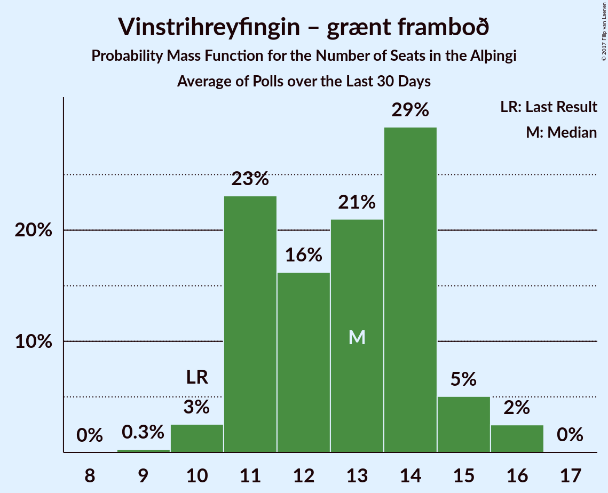

# Vinstrihreyfingin – grænt framboð

<a href="#voting-intentions">Voting Intentions</a> | <a href="#seats">Seats</a>

## Voting Intentions

Last result: **15.9%** (General Election of 29 October 2016)

### Confidence Intervals

| Period     | Polling firm/Commissioner(s) | Median | 80% Confidence Interval | 90% Confidence Interval | 95% Confidence Interval | 99% Confidence Interval |
|:----------:|:----------------:|:-----------:|:-----------------------:|:-----------------------:|:-----------------------:|:-----------------------:|
| N/A | [Poll Average](average.html) | 20.3% | 18.6–23.6% | 18.1–24.2% | 17.8–24.7% | 17.1–25.5% |
| [22–25 October 2017](2017-10-25-Felagsvisindastofnun.html) | Félagsvísindastofnun   Morgunblaðið | 20.2% | 19.1–21.3% | 18.9–21.6% | 18.6–21.9% | 18.1–22.4% |
| [23–24 October 2017](2017-10-24-Frettabladid.html) | Fréttablaðið | 19.2% | 18.0–20.5% | 17.7–20.9% | 17.4–21.2% | 16.8–21.9% |
| [20–23 October 2017](2017-10-23-MMR.html) | MMR | 19.9% | 18.4–21.6% | 17.9–22.1% | 17.5–22.5% | 16.8–23.4% |
| [13–19 October 2017](2017-10-19-Gallup.html) | Gallup | 23.3% | 22.0–24.7% | 21.7–25.0% | 21.4–25.4% | 20.8–26.0% |
| [16–19 October 2017](2017-10-19-Felagsvisindastofnun.html) | Félagsvísindastofnun   Morgunblaðið | 23.2% | 22.0–24.5% | 21.7–24.8% | 21.4–25.1% | 20.8–25.7% |
| [17–18 October 2017](2017-10-18-MMR.html) | MMR | 19.1% | 17.6–20.7% | 17.1–21.2% | 16.8–21.6% | 16.1–22.5% |
| [16 October 2017](2017-10-16-Frettabladid.html) | Fréttablaðið | 27.0% | 25.1–29.1% | 24.6–29.7% | 24.1–30.2% | 23.2–31.2% |
| [29 September–12 October 2017](2017-10-12-Gallup.html) | Gallup | 23.0% | 21.9–24.2% | 21.6–24.5% | 21.3–24.8% | 20.8–25.3% |
| [9–12 October 2017](2017-10-12-Felagsvisindastofnun.html) | Félagsvísindastofnun   Morgunblaðið | 27.4% | 25.8–29.1% | 25.4–29.5% | 25.0–29.9% | 24.3–30.7% |
| [6–11 October 2017](2017-10-11-MMR.html) | MMR | 21.8% | 20.2–23.6% | 19.7–24.1% | 19.3–24.5% | 18.6–25.4% |
| [10 October 2017](2017-10-10-Frettabladid.html) | Fréttablaðið | 29.9% | 27.9–32.0% | 27.3–32.6% | 26.8–33.1% | 25.9–34.2% |
| [2–6 October 2017](2017-10-06-Felagsvisindastofnun.html) | Félagsvísindastofnun   Morgunblaðið | 28.1% | 26.3–30.0% | 25.8–30.6% | 25.3–31.1% | 24.5–32.0% |
| [2–3 October 2017](2017-10-03-Frettabladid.html) | Fréttablaðið | 28.6% | 26.6–30.7% | 26.1–31.3% | 25.6–31.9% | 24.7–32.9% |
| [26–28 September 2017](2017-09-28-MMR.html) | MMR | 24.7% | 23.0–26.5% | 22.6–27.0% | 22.2–27.5% | 21.4–28.4% |
| [15–28 September 2017](2017-09-28-Gallup.html) | Gallup | 25.4% | 24.3–26.6% | 24.0–26.9% | 23.7–27.2% | 23.2–27.7% |
| [25–28 September 2017](2017-09-28-Felagsvisindastofnun.html) | Félagsvísindastofnun   Morgunblaðið | 28.8% | 26.9–30.7% | 26.4–31.3% | 26.0–31.7% | 25.1–32.7% |
| [19–21 September 2017](2017-09-21-Felagsvisindastofnun.html) | Félagsvísindastofnun   Morgunblaðið | 29.9% | 28.0–31.9% | 27.5–32.4% | 27.0–32.9% | 26.1–33.9% |
| [15–18 September 2017](2017-09-18-Zenter.html) | Zenter | 22.8% | 21.1–24.6% | 20.7–25.1% | 20.3–25.6% | 19.5–26.5% |
| [18 September 2017](2017-09-18-Frettabladid.html) | Fréttablaðið | 22.8% | 20.9–24.7% | 20.4–25.3% | 20.0–25.8% | 19.1–26.7% |
| [10–30 August 2017](2017-08-30-Gallup.html) | Gallup | 19.5% | 18.5–20.6% | 18.2–21.0% | 17.9–21.2% | 17.4–21.8% |
| [15–18 August 2017](2017-08-18-MMR.html) | MMR | 20.5% | 18.9–22.3% | 18.5–22.8% | 18.1–23.2% | 17.4–24.1% |

### Probability Mass Function

The following table shows the probability mass function per percentage block of voting intentions for the [poll average](average.html) for Vinstrihreyfingin – grænt framboð.

| Voting Intentions | Probability | Accumulated | Special Marks |
|:-----------------:|:-----------:|:-----------:|:-------------:|
| 14.5–15.5% | 0% | 100% |  |
| 15.5–16.5% | 0.1% | 100% | Last Result |
| 16.5–17.5% | 1.5% | 99.9% |  |
| 17.5–18.5% | 8% | 98% |  |
| 18.5–19.5% | 21% | 90% |  |
| 19.5–20.5% | 26% | 70% | Median |
| 20.5–21.5% | 16% | 44% |  |
| 21.5–22.5% | 8% | 29% |  |
| 22.5–23.5% | 10% | 20% |  |
| 23.5–24.5% | 8% | 10% |  |
| 24.5–25.5% | 3% | 3% |  |
| 25.5–26.5% | 0.4% | 0.4% |  |
| 26.5–27.5% | 0% | 0% |  |

## Seats

Last result: **10** seats (General Election of 29 October 2016)

### Confidence Intervals

| Period     | Polling firm/Commissioner(s) | Median | 80% Confidence Interval | 90% Confidence Interval | 95% Confidence Interval | 99% Confidence Interval |
|:----------:|:----------------:|:------:|:-----------------------:|:-----------------------:|:-----------------------:|:-----------------------:|
| N/A | [Poll Average](average.html) | 14 | 13–16 | 12–17 | 12–17 | 11–19 |
| [22–25 October 2017](2017-10-25-Felagsvisindastofnun.html) | Félagsvísindastofnun   Morgunblaðið | 14 | 13–15 | 13–15 | 12–16 | 12–16 |
| [23–24 October 2017](2017-10-24-Frettabladid.html) | Fréttablaðið | 14 | 13–15 | 12–15 | 12–16 | 11–16 |
| [20–23 October 2017](2017-10-23-MMR.html) | MMR | 14 | 12–15 | 12–16 | 12–16 | 11–17 |
| [13–19 October 2017](2017-10-19-Gallup.html) | Gallup | 16 | 15–17 | 15–18 | 15–18 | 14–19 |
| [16–19 October 2017](2017-10-19-Felagsvisindastofnun.html) | Félagsvísindastofnun   Morgunblaðið | 16 | 15–17 | 15–17 | 15–17 | 14–19 |
| [17–18 October 2017](2017-10-18-MMR.html) | MMR | 13 | 12–14 | 11–15 | 11–15 | 11–16 |
| [16 October 2017](2017-10-16-Frettabladid.html) | Fréttablaðið | 20 | 18–21 | 17–22 | 17–22 | 16–23 |
| [29 September–12 October 2017](2017-10-12-Gallup.html) | Gallup | 16 | 16–18 | 16–18 | 16–18 | 14–19 |
| [9–12 October 2017](2017-10-12-Felagsvisindastofnun.html) | Félagsvísindastofnun   Morgunblaðið | 20 | 18–21 | 18–22 | 17–22 | 17–22 |
| [6–11 October 2017](2017-10-11-MMR.html) | MMR | 16 | 14–17 | 14–17 | 13–18 | 13–19 |
| [10 October 2017](2017-10-10-Frettabladid.html) | Fréttablaðið | 22 | 20–23 | 20–24 | 20–25 | 18–25 |
| [2–6 October 2017](2017-10-06-Felagsvisindastofnun.html) | Félagsvísindastofnun   Morgunblaðið | 20 | 19–21 | 18–22 | 18–22 | 17–23 |
| [2–3 October 2017](2017-10-03-Frettabladid.html) | Fréttablaðið | 21 | 19–22 | 18–23 | 18–23 | 17–24 |
| [26–28 September 2017](2017-09-28-MMR.html) | MMR | 17 | 16–19 | 16–20 | 15–21 | 15–21 |
| [15–28 September 2017](2017-09-28-Gallup.html) | Gallup | 18 | 17–19 | 17–20 | 17–20 | 16–21 |
| [25–28 September 2017](2017-09-28-Felagsvisindastofnun.html) | Félagsvísindastofnun   Morgunblaðið | 21 | 20–22 | 19–23 | 18–23 | 17–25 |
| [19–21 September 2017](2017-09-21-Felagsvisindastofnun.html) | Félagsvísindastofnun   Morgunblaðið | 22 | 19–22 | 19–22 | 18–23 | 17–23 |
| [15–18 September 2017](2017-09-18-Zenter.html) | Zenter | 15 | 14–17 | 14–17 | 13–17 | 13–18 |
| [18 September 2017](2017-09-18-Frettabladid.html) | Fréttablaðið | 16 | 15–17 | 14–18 | 13–18 | 12–19 |
| [10–30 August 2017](2017-08-30-Gallup.html) | Gallup | 14 | 13–14 | 12–15 | 12–15 | 12–15 |
| [15–18 August 2017](2017-08-18-MMR.html) | MMR | 14 | 13–16 | 13–17 | 12–17 | 12–17 |

### Probability Mass Function

The following table shows the probability mass function per seat for the [poll average](average.html) for Vinstrihreyfingin – grænt framboð.

| Number of Seats | Probability | Accumulated | Special Marks |
|:---------------:|:-----------:|:-----------:|:-------------:|
| 10 | 0% | 100% | Last Result |
| 11 | 0.6% | 100% |  |
| 12 | 6% | 99.4% |  |
| 13 | 22% | 93% |  |
| 14 | 32% | 71% | Median |
| 15 | 13% | 39% |  |
| 16 | 18% | 26% |  |
| 17 | 6% | 8% |  |
| 18 | 1.3% | 2% |  |
| 19 | 0.4% | 0.5% |  |
| 20 | 0.1% | 0.1% |  |
| 21 | 0% | 0% |  |

