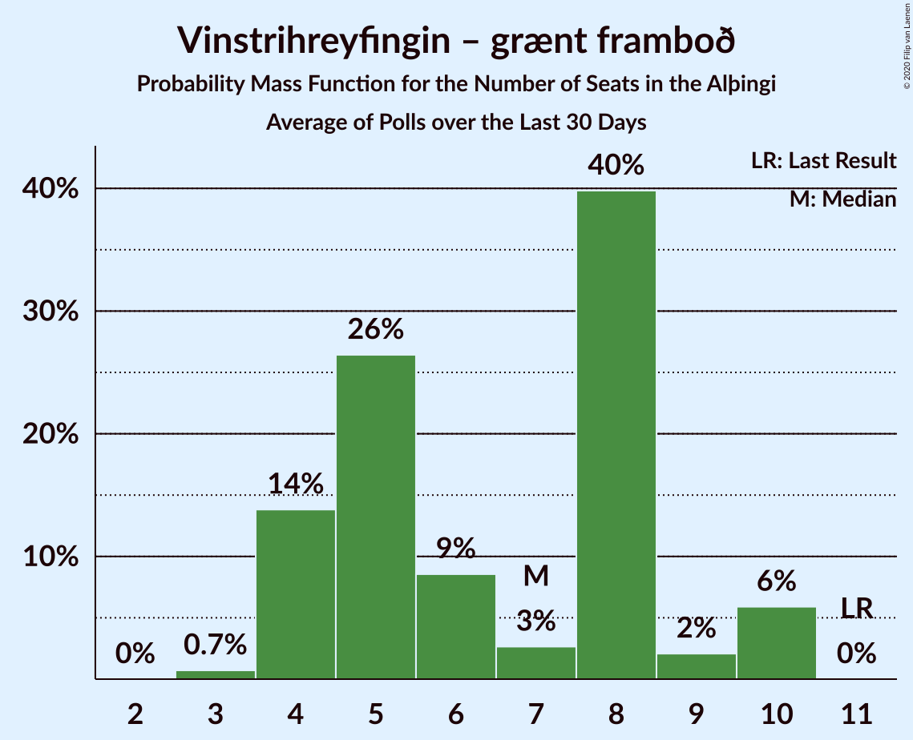

# Vinstrihreyfingin – grænt framboð

<a href="#voting-intentions">Voting Intentions</a> | <a href="#seats">Seats</a>

## Voting Intentions

Last result: **16.9%** (General Election of 28 October 2017)

### Confidence Intervals

| Period     | Polling firm/Commissioner(s) | Median | 80% Confidence Interval | 90% Confidence Interval | 95% Confidence Interval | 99% Confidence Interval |
|:----------:|:----------------:|:-----------:|:-----------------------:|:-----------------------:|:-----------------------:|:-----------------------:|
| N/A | [Poll Average](average.html) | 13.1% | 11.8–14.0% | 11.3–14.4% | 11.0–14.7% | 10.3–15.4% |
| [12–18 June 2018](2018-06-18-MMR.html) | MMR | 12.6% | 11.3–14.1% | 11.0–14.6% | 10.7–15.0% | 10.1–15.7% |
| [2–31 May 2018](2018-05-31-Gallup.html) | Gallup | 13.3% | 12.6–14.0% | 12.4–14.2% | 12.3–14.4% | 12.0–14.7% |
| [16–22 May 2018](2018-05-22-MMR.html) | MMR | 11.9% | 10.7–13.4% | 10.3–13.8% | 10.0–14.2% | 9.4–14.9% |
| [27 March–29 April 2018](2018-04-29-Gallup.html) | Gallup | 14.1% | 13.4–14.8% | 13.2–15.1% | 13.0–15.2% | 12.7–15.6% |
| [13–19 April 2018](2018-04-19-MMR.html) | MMR | 14.3% | 12.9–15.9% | 12.5–16.3% | 12.2–16.7% | 11.5–17.5% |
| [1–26 March 2018](2018-03-26-Gallup.html) | Gallup | 13.9% | 13.1–14.7% | 12.9–15.0% | 12.7–15.2% | 12.4–15.6% |
| [1–28 February 2018](2018-02-28-Gallup.html) | Gallup | 16.6% | 15.7–17.5% | 15.5–17.7% | 15.3–17.9% | 14.9–18.4% |
| [4–31 January 2018](2018-01-31-Gallup.html) | Gallup | 16.9% | 16.1–17.8% | 15.8–18.1% | 15.6–18.3% | 15.2–18.7% |
| [25–30 January 2018](2018-01-30-MMR.html) | MMR | 18.4% | 16.9–20.1% | 16.4–20.6% | 16.1–21.0% | 15.3–21.9% |
| [9–17 January 2018](2018-01-17-MMR.html) | MMR | 15.0% | 13.9–16.2% | 13.6–16.5% | 13.3–16.8% | 12.8–17.4% |
| [30 November–28 December 2017](2017-12-28-Gallup.html) | Gallup | 17.3% | 16.6–18.1% | 16.3–18.3% | 16.2–18.5% | 15.8–18.9% |
| [12–15 December 2017](2017-12-15-MMR.html) | MMR | 16.7% | 15.2–18.4% | 14.8–18.8% | 14.4–19.2% | 13.7–20.0% |
| [4 December 2017](2017-12-04-Fréttablaðið-Stöð2-Vísir.html) | Fréttablaðið, Stöð 2 and Vísir | 23.5% | 21.7–25.5% | 21.2–26.1% | 20.7–26.6% | 19.8–27.5% |
| [8–30 November 2017](2017-11-30-Gallup.html) | Gallup | 16.1% | 15.1–17.1% | 14.9–17.4% | 14.6–17.6% | 14.2–18.1% |
| [14–17 November 2017](2017-11-17-MMR.html) | MMR | 13.0% | 11.7–14.5% | 11.3–15.0% | 11.0–15.3% | 10.4–16.1% |

### Probability Mass Function

The following table shows the probability mass function per percentage block of voting intentions for the [poll average](average.html) for Vinstrihreyfingin – grænt framboð.

| Voting Intentions | Probability | Accumulated | Special Marks |
|:-----------------:|:-----------:|:-----------:|:-------------:|
| 8.5–9.5% | 0% | 100% |  |
| 9.5–10.5% | 0.9% | 100% |  |
| 10.5–11.5% | 6% | 99.1% |  |
| 11.5–12.5% | 19% | 93% |  |
| 12.5–13.5% | 47% | 74% | Median |
| 13.5–14.5% | 24% | 27% |  |
| 14.5–15.5% | 3% | 3% |  |
| 15.5–16.5% | 0.3% | 0.3% |  |
| 16.5–17.5% | 0% | 0% | Last Result |

## Seats

Last result: **11** seats (General Election of 28 October 2017)

### Confidence Intervals

| Period     | Polling firm/Commissioner(s) | Median | 80% Confidence Interval | 90% Confidence Interval | 95% Confidence Interval | 99% Confidence Interval |
|:----------:|:----------------:|:------:|:-----------------------:|:-----------------------:|:-----------------------:|:-----------------------:|
| N/A | [Poll Average](average.html) | 9 | 8–9 | 7–10 | 7–10 | 6–10 |
| [12–18 June 2018](2018-06-18-MMR.html) | MMR | 8 | 7–10 | 7–10 | 7–10 | 6–10 |
| [2–31 May 2018](2018-05-31-Gallup.html) | Gallup | 9 | 8–9 | 8–10 | 8–10 | 8–10 |
| [16–22 May 2018](2018-05-22-MMR.html) | MMR | 8 | 7–9 | 7–9 | 6–10 | 6–10 |
| [27 March–29 April 2018](2018-04-29-Gallup.html) | Gallup | 10 | 9–10 | 9–10 | 9–10 | 9–11 |
| [13–19 April 2018](2018-04-19-MMR.html) | MMR | 10 | 8–10 | 8–11 | 8–11 | 7–11 |
| [1–26 March 2018](2018-03-26-Gallup.html) | Gallup | 9 | 9–10 | 8–10 | 8–10 | 8–10 |
| [1–28 February 2018](2018-02-28-Gallup.html) | Gallup | 11 | 10–11 | 10–12 | 10–12 | 10–12 |
| [4–31 January 2018](2018-01-31-Gallup.html) | Gallup | 11 | 10–12 | 10–12 | 10–12 | 10–13 |
| [25–30 January 2018](2018-01-30-MMR.html) | MMR | 13 | 11–14 | 11–14 | 11–15 | 10–15 |
| [9–17 January 2018](2018-01-17-MMR.html) | MMR | 10 | 9–11 | 9–11 | 9–11 | 8–11 |
| [30 November–28 December 2017](2017-12-28-Gallup.html) | Gallup | 11 | 11–12 | 11–12 | 10–12 | 10–13 |
| [12–15 December 2017](2017-12-15-MMR.html) | MMR | 11 | 10–13 | 10–13 | 10–13 | 9–14 |
| [4 December 2017](2017-12-04-Fréttablaðið-Stöð2-Vísir.html) | Fréttablaðið, Stöð 2 and Vísir | 17 | 15–18 | 15–18 | 14–19 | 14–20 |
| [8–30 November 2017](2017-11-30-Gallup.html) | Gallup | 10 | 10–11 | 10–11 | 10–12 | 9–12 |
| [14–17 November 2017](2017-11-17-MMR.html) | MMR | 8 | 7–10 | 7–10 | 7–10 | 6–10 |

### Probability Mass Function

The following table shows the probability mass function per seat for the [poll average](average.html) for Vinstrihreyfingin – grænt framboð.

| Number of Seats | Probability | Accumulated | Special Marks |
|:---------------:|:-----------:|:-----------:|:-------------:|
| 6 | 0.8% | 100% |  |
| 7 | 8% | 99.2% |  |
| 8 | 32% | 91% |  |
| 9 | 50% | 59% | Median |
| 10 | 9% | 9% |  |
| 11 | 0.1% | 0.1% | Last Result |
| 12 | 0% | 0% |  |

