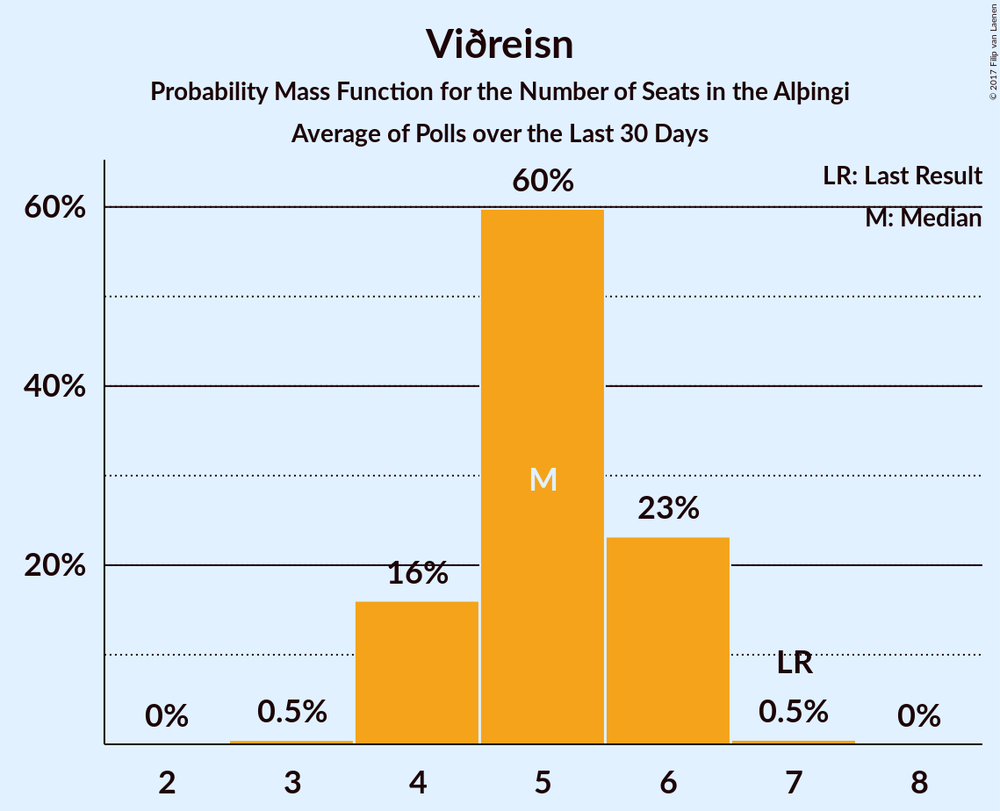

# Viðreisn

<a href="#voting-intentions">Voting Intentions</a> | <a href="#seats">Seats</a>

## Voting Intentions

Last result: **10.5%** (General Election of 29 October 2016)

### Confidence Intervals

| Period     | Polling firm/Commissioner(s) | Median | 80% Confidence Interval | 90% Confidence Interval | 95% Confidence Interval | 99% Confidence Interval |
|:----------:|:----------------:|:-----------:|:-----------------------:|:-----------------------:|:-----------------------:|:-----------------------:|
| N/A | [Poll Average](average.html) | 8.1% | 7.1–9.0% | 6.8–9.3% | 6.6–9.5% | 6.1–10.1% |
| [26–27 October 2017](2017-10-27-MMR.html) | MMR | 8.1% | 7.0–9.3% | 6.8–9.6% | 6.5–9.9% | 6.1–10.5% |
| [23–27 October 2017](2017-10-27-Gallup.html) | Gallup | 8.2% | 7.5–9.0% | 7.3–9.3% | 7.1–9.5% | 6.8–9.9% |
| [22–25 October 2017](2017-10-25-Felagsvisindastofnun.html) | Félagsvísindastofnun   Morgunblaðið | 8.3% | 7.6–9.1% | 7.4–9.3% | 7.2–9.5% | 6.9–9.9% |
| [23–24 October 2017](2017-10-24-Frettabladid.html) | Fréttablaðið | 7.5% | 6.7–8.4% | 6.5–8.7% | 6.3–8.9% | 5.9–9.3% |
| [20–23 October 2017](2017-10-23-MMR.html) | MMR | 5.5% | 4.7–6.6% | 4.5–6.9% | 4.3–7.1% | 3.9–7.7% |
| [13–19 October 2017](2017-10-19-Gallup.html) | Gallup | 5.8% | 5.2–6.6% | 5.0–6.8% | 4.8–7.0% | 4.5–7.4% |
| [16–19 October 2017](2017-10-19-Felagsvisindastofnun.html) | Félagsvísindastofnun   Morgunblaðið | 5.7% | 5.1–6.5% | 4.9–6.7% | 4.8–6.8% | 4.5–7.2% |
| [17–18 October 2017](2017-10-18-MMR.html) | MMR | 6.7% | 5.7–7.8% | 5.5–8.1% | 5.3–8.4% | 4.9–8.9% |
| [16 October 2017](2017-10-16-Frettabladid.html) | Fréttablaðið | 5.0% | 4.1–6.1% | 3.9–6.4% | 3.7–6.7% | 3.3–7.3% |
| [29 September–12 October 2017](2017-10-12-Gallup.html) | Gallup | 4.8% | 4.3–5.4% | 4.1–5.6% | 4.0–5.7% | 3.7–6.1% |
| [9–12 October 2017](2017-10-12-Felagsvisindastofnun.html) | Félagsvísindastofnun   Morgunblaðið | 3.4% | 2.9–4.2% | 2.7–4.4% | 2.6–4.6% | 2.3–5.0% |
| [6–11 October 2017](2017-10-11-MMR.html) | MMR | 3.6% | 3.0–4.5% | 2.8–4.8% | 2.6–5.0% | 2.3–5.5% |
| [10 October 2017](2017-10-10-Frettabladid.html) | Fréttablaðið | 3.4% | 2.7–4.3% | 2.5–4.6% | 2.3–4.8% | 2.0–5.4% |
| [2–6 October 2017](2017-10-06-Felagsvisindastofnun.html) | Félagsvísindastofnun   Morgunblaðið | 3.1% | 2.5–3.9% | 2.3–4.2% | 2.1–4.4% | 1.9–4.8% |
| [2–3 October 2017](2017-10-03-Frettabladid.html) | Fréttablaðið | 3.0% | 2.3–3.9% | 2.2–4.2% | 2.0–4.4% | 1.8–4.9% |
| [26–28 September 2017](2017-09-28-MMR.html) | MMR | 4.9% | 4.2–5.9% | 3.9–6.2% | 3.8–6.5% | 3.4–7.0% |
| [15–28 September 2017](2017-09-28-Gallup.html) | Gallup | 3.6% | 3.1–4.1% | 3.0–4.3% | 2.9–4.4% | 2.7–4.7% |
| [25–28 September 2017](2017-09-28-Felagsvisindastofnun.html) | Félagsvísindastofnun   Morgunblaðið | 4.8% | 4.0–5.9% | 3.8–6.1% | 3.6–6.4% | 3.3–6.9% |
| [19–21 September 2017](2017-09-21-Felagsvisindastofnun.html) | Félagsvísindastofnun   Morgunblaðið | 6.0% | 5.1–7.1% | 4.8–7.4% | 4.6–7.7% | 4.2–8.3% |
| [15–18 September 2017](2017-09-18-Zenter.html) | Zenter | 2.7% | 2.1–3.5% | 2.0–3.7% | 1.9–4.0% | 1.6–4.4% |
| [18 September 2017](2017-09-18-Frettabladid.html) | Fréttablaðið | 5.2% | 4.4–6.4% | 4.1–6.7% | 3.9–7.0% | 3.5–7.6% |
| [10–30 August 2017](2017-08-30-Gallup.html) | Gallup | 4.8% | 4.2–5.4% | 4.1–5.6% | 4.0–5.8% | 3.7–6.1% |
| [15–18 August 2017](2017-08-18-MMR.html) | MMR | 6.0% | 5.1–7.1% | 4.8–7.4% | 4.6–7.7% | 4.3–8.2% |

### Probability Mass Function

The following table shows the probability mass function per percentage block of voting intentions for the [poll average](average.html) for Viðreisn.

| Voting Intentions | Probability | Accumulated | Special Marks |
|:-----------------:|:-----------:|:-----------:|:-------------:|
| 4.5–5.5% | 0% | 100% |  |
| 5.5–6.5% | 2% | 100% |  |
| 6.5–7.5% | 22% | 98% |  |
| 7.5–8.5% | 51% | 76% | Median |
| 8.5–9.5% | 23% | 25% |  |
| 9.5–10.5% | 2% | 2% | Last Result |
| 10.5–11.5% | 0.1% | 0.1% |  |
| 11.5–12.5% | 0% | 0% |  |

## Seats

Last result: **7** seats (General Election of 29 October 2016)

### Confidence Intervals

| Period     | Polling firm/Commissioner(s) | Median | 80% Confidence Interval | 90% Confidence Interval | 95% Confidence Interval | 99% Confidence Interval |
|:----------:|:----------------:|:------:|:-----------------------:|:-----------------------:|:-----------------------:|:-----------------------:|
| N/A | [Poll Average](average.html) | 5 | 4–6 | 4–6 | 4–6 | 4–7 |
| [26–27 October 2017](2017-10-27-MMR.html) | MMR | 5 | 5 | 5 | 5 | 4–5 |
| [23–27 October 2017](2017-10-27-Gallup.html) | Gallup | 5 | 5–6 | 5–6 | 4–6 | 4–7 |
| [22–25 October 2017](2017-10-25-Felagsvisindastofnun.html) | Félagsvísindastofnun   Morgunblaðið | 5 | 5–6 | 5–6 | 4–6 | 4–6 |
| [23–24 October 2017](2017-10-24-Frettabladid.html) | Fréttablaðið | 5 | 4–6 | 4–6 | 4–6 | 4–6 |
| [20–23 October 2017](2017-10-23-MMR.html) | MMR | 3 | 0–4 | 0–4 | 0–4 | 0–5 |
| [13–19 October 2017](2017-10-19-Gallup.html) | Gallup | 3 | 3–4 | 0–4 | 0–4 | 0–4 |
| [16–19 October 2017](2017-10-19-Felagsvisindastofnun.html) | Félagsvísindastofnun   Morgunblaðið | 4 | 3–4 | 3–4 | 0–4 | 0–5 |
| [17–18 October 2017](2017-10-18-MMR.html) | MMR | 4 | 3–5 | 3–5 | 3–5 | 0–6 |
| [16 October 2017](2017-10-16-Frettabladid.html) | Fréttablaðið | 3 | 0–4 | 0–4 | 0–4 | 0–5 |
| [29 September–12 October 2017](2017-10-12-Gallup.html) | Gallup | 0 | 0–3 | 0–3 | 0–3 | 0–4 |
| [9–12 October 2017](2017-10-12-Felagsvisindastofnun.html) | Félagsvísindastofnun   Morgunblaðið | 0 | 0 | 0 | 0 | 0 |
| [6–11 October 2017](2017-10-11-MMR.html) | MMR | 0 | 0 | 0 | 0 | 0–3 |
| [10 October 2017](2017-10-10-Frettabladid.html) | Fréttablaðið | 0 | 0 | 0 | 0 | 0–3 |
| [2–6 October 2017](2017-10-06-Felagsvisindastofnun.html) | Félagsvísindastofnun   Morgunblaðið | 0 | 0 | 0 | 0 | 0 |
| [2–3 October 2017](2017-10-03-Frettabladid.html) | Fréttablaðið | 0 | 0 | 0 | 0 | 0 |
| [26–28 September 2017](2017-09-28-MMR.html) | MMR | 3 | 0–4 | 0–4 | 0–4 | 0–4 |
| [15–28 September 2017](2017-09-28-Gallup.html) | Gallup | 0 | 0 | 0 | 0 | 0 |
| [25–28 September 2017](2017-09-28-Felagsvisindastofnun.html) | Félagsvísindastofnun   Morgunblaðið | 0 | 0–3 | 0–4 | 0–4 | 0–4 |
| [19–21 September 2017](2017-09-21-Felagsvisindastofnun.html) | Félagsvísindastofnun   Morgunblaðið | 3 | 3–4 | 0–5 | 0–5 | 0–5 |
| [15–18 September 2017](2017-09-18-Zenter.html) | Zenter | 0 | 0 | 0 | 0 | 0 |
| [18 September 2017](2017-09-18-Frettabladid.html) | Fréttablaðið | 3 | 0–4 | 0–4 | 0–4 | 0–5 |
| [10–30 August 2017](2017-08-30-Gallup.html) | Gallup | 0 | 0–3 | 0–3 | 0–4 | 0–4 |
| [15–18 August 2017](2017-08-18-MMR.html) | MMR | 4 | 3–5 | 0–5 | 0–5 | 0–5 |

### Probability Mass Function

The following table shows the probability mass function per seat for the [poll average](average.html) for Viðreisn.

| Number of Seats | Probability | Accumulated | Special Marks |
|:---------------:|:-----------:|:-----------:|:-------------:|
| 4 | 10% | 100% |  |
| 5 | 70% | 90% | Median |
| 6 | 19% | 20% |  |
| 7 | 1.2% | 1.2% | Last Result |
| 8 | 0% | 0% |  |

